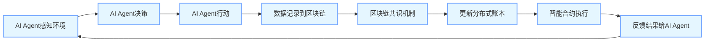

# AI Agent在企业区块链应用中的集成与应用

> 关键词：AI Agent、企业区块链、集成应用、智能合约、数据处理

> 摘要：本文深入探讨了AI Agent在企业区块链应用中的集成与应用。首先介绍了相关背景，包括目的、预期读者等内容。接着阐述了AI Agent和企业区块链的核心概念及其联系，并给出了原理和架构的示意图与流程图。详细讲解了核心算法原理及操作步骤，通过Python代码进行示例。分析了相关的数学模型和公式，并举例说明。进行了项目实战，从开发环境搭建到源代码实现与解读。探讨了实际应用场景，推荐了学习、开发相关的工具和资源，最后总结了未来发展趋势与挑战，还给出了常见问题解答和扩展阅读参考资料，旨在为企业在区块链应用中有效集成AI Agent提供全面的技术指导。

## 1. 背景介绍 
### 1.1 目的和范围
随着区块链技术在企业领域的广泛应用，如何提高区块链系统的智能性和自主性成为了重要的研究方向。AI Agent作为具有自主决策和行动能力的智能实体，与企业区块链的集成可以为企业带来更高效、智能的业务流程。本文的目的是深入探讨AI Agent在企业区块链应用中的集成方法和具体应用场景，涵盖了从基本概念到实际项目开发的全过程，旨在为企业开发者和技术决策者提供全面的技术参考。

### 1.2 预期读者
本文预期读者包括企业区块链开发者、AI技术研究者、企业技术决策者以及对区块链和AI融合应用感兴趣的技术爱好者。开发者可以从中获取具体的技术实现细节和代码示例，研究者可以了解相关领域的前沿动态和研究方向，决策者可以评估AI Agent在企业区块链应用中的价值和可行性。

### 1.3 文档结构概述
本文首先介绍相关背景知识，包括目的、读者和文档结构。然后阐述AI Agent和企业区块链的核心概念及其联系，通过示意图和流程图进行说明。接着详细讲解核心算法原理和操作步骤，结合Python代码示例。分析相关的数学模型和公式并举例。进行项目实战，包括开发环境搭建、源代码实现与解读。探讨实际应用场景，推荐学习和开发相关的工具和资源。最后总结未来发展趋势与挑战，给出常见问题解答和扩展阅读参考资料。

### 1.4 术语表
#### 1.4.1 核心术语定义
- **AI Agent**：是一种能够感知环境、自主决策并采取行动以实现特定目标的智能实体。它可以根据预设的规则或通过学习不断优化自身的行为。
- **企业区块链**：是专门为企业设计的区块链解决方案，具有更高的安全性、可扩展性和隐私保护能力，通常采用联盟链或私有链的形式。
- **智能合约**：是一种基于区块链技术的自动化合约，它可以在满足预设条件时自动执行相应的操作，无需第三方干预。
- **共识机制**：是区块链系统中用于达成节点间共识的算法，确保区块链上的数据一致性和不可篡改。

#### 1.4.2 相关概念解释
- **多智能体系统**：由多个AI Agent组成的系统，这些Agent之间可以相互协作、竞争或通信，以实现共同的或各自的目标。
- **区块链网络**：由多个节点组成的分布式网络，节点之间通过共识机制维护区块链的账本数据。
- **数据隐私保护**：在区块链和AI应用中，保护数据不被非法获取和使用的技术和措施。

#### 1.4.3 缩略词列表
- **AI**：Artificial Intelligence（人工智能）
- **DAG**：Directed Acyclic Graph（有向无环图）
- **PoW**：Proof of Work（工作量证明）
- **PoS**：Proof of Stake（权益证明）

## 2. 核心概念与联系 

### 2.1 AI Agent核心概念
AI Agent是一种具有感知、决策和行动能力的智能实体。它可以通过传感器感知环境信息，根据内置的规则或学习到的模型进行决策，并通过执行器采取相应的行动。AI Agent可以分为反应式Agent、基于模型的Agent、基于目标的Agent和基于效用的Agent等不同类型。

### 2.2 企业区块链核心概念
企业区块链是为满足企业需求而设计的区块链解决方案。与公有链不同，企业区块链通常采用联盟链或私有链的形式，只有经过授权的节点才能参与区块链网络。企业区块链具有更高的安全性、可扩展性和隐私保护能力，适用于企业内部的业务流程和合作伙伴之间的协作。

### 2.3 核心概念联系
AI Agent与企业区块链的集成可以带来多方面的优势。一方面，AI Agent可以利用区块链的不可篡改、分布式存储等特性，实现数据的安全共享和可信交互。例如，AI Agent可以将决策过程和结果记录在区块链上，确保其可追溯性和可信度。另一方面，区块链可以为AI Agent提供一个去中心化的协作平台，多个AI Agent可以在区块链上进行协作和交互，共同完成复杂的任务。

### 2.4 原理和架构的文本示意图
```plaintext
+---------------------+
|     AI Agent        |
|  (感知、决策、行动) |
+---------------------+
        |
        |  数据交互
        v
+---------------------+
|    企业区块链网络   |
| (分布式账本、智能合约) |
+---------------------+
```

### 2.5 Mermaid流程图


## 3. 核心算法原理 & 具体操作步骤 

### 3.1 核心算法原理
#### 3.1.1 AI Agent决策算法
AI Agent的决策算法通常基于机器学习或深度学习模型。以强化学习为例，强化学习是一种通过智能体与环境进行交互，不断尝试不同的行动并根据奖励信号来优化自身策略的算法。其核心思想是最大化长期累积奖励。

在强化学习中，智能体的策略可以用一个函数 $\pi(s)$ 表示，其中 $s$ 是环境的状态。智能体根据当前状态 $s$ 选择一个行动 $a$，并执行该行动。环境会根据行动 $a$ 给出一个奖励 $r$ 和一个新的状态 $s'$。智能体的目标是学习一个最优策略 $\pi^*$，使得长期累积奖励最大化。

#### 3.1.2 区块链共识算法
区块链共识算法用于确保区块链网络中节点间的数据一致性和不可篡改。常见的共识算法有工作量证明（PoW）、权益证明（PoS）等。

以工作量证明为例，矿工需要通过计算一个复杂的哈希函数，找到一个满足特定条件的随机数（Nonce）。一旦找到这个随机数，矿工就可以将一个新的区块添加到区块链上，并获得相应的奖励。其他节点需要验证这个新区块的合法性，如果验证通过，则将其添加到自己的账本中。

### 3.2 具体操作步骤
#### 3.2.1 AI Agent操作步骤
1. **感知环境**：AI Agent通过传感器获取环境信息，将其转换为状态表示 $s$。
2. **决策**：根据当前状态 $s$，使用决策算法 $\pi(s)$ 选择一个行动 $a$。
3. **行动**：执行选择的行动 $a$，与环境进行交互。
4. **获取反馈**：环境返回奖励 $r$ 和新的状态 $s'$。
5. **学习更新**：根据奖励 $r$ 和新的状态 $s'$，更新决策算法 $\pi(s)$。

#### 3.2.2 区块链操作步骤
1. **交易发起**：用户发起一笔交易，将交易信息打包成一个交易数据结构。
2. **交易广播**：将交易数据广播到区块链网络中的所有节点。
3. **交易验证**：节点验证交易的合法性，包括签名验证、余额验证等。
4. **区块打包**：矿工将验证通过的交易打包成一个新区块，并计算区块的哈希值。
5. **共识达成**：通过共识算法，节点间达成一致，确定新区块的合法性。
6. **区块添加**：将合法的新区块添加到区块链上。

### 3.3 Python代码示例
```python
import random

# 简单的AI Agent示例
class AIAgent:
    def __init__(self):
        self.strategy = {}  # 简单的策略表

    def perceive(self, state):
        # 感知环境状态
        return state

    def decide(self, state):
        # 根据状态决策行动
        if state not in self.strategy:
            actions = [0, 1]  # 假设有两个行动
            action = random.choice(actions)
            self.strategy[state] = action
        return self.strategy[state]

    def act(self, action):
        # 执行行动
        print(f"执行行动: {action}")
        return action

    def learn(self, state, action, reward, new_state):
        # 简单的学习更新
        if reward > 0:
            self.strategy[state] = action

# 简单的区块链示例
class Blockchain:
    def __init__(self):
        self.chain = []

    def add_block(self, block):
        # 添加区块到区块链
        self.chain.append(block)
        print(f"添加新区块: {block}")

# 模拟交互过程
agent = AIAgent()
blockchain = Blockchain()

state = "state1"
for i in range(5):
    perceived_state = agent.perceive(state)
    action = agent.decide(perceived_state)
    result = agent.act(action)
    reward = random.randint(-1, 1)  # 随机奖励
    new_state = f"state{i + 2}"
    agent.learn(perceived_state, action, reward, new_state)
    block = f"Block {i + 1}: State={state}, Action={action}, Reward={reward}"
    blockchain.add_block(block)
    state = new_state
```

## 4. 数学模型和公式 & 详细讲解 & 举例说明 

### 4.1 强化学习数学模型
在强化学习中，智能体与环境的交互可以用马尔可夫决策过程（MDP）来描述。一个MDP可以用一个五元组 $(S, A, P, R, \gamma)$ 表示，其中：
- $S$ 是环境的状态集合。
- $A$ 是智能体的行动集合。
- $P(s'|s, a)$ 是状态转移概率，表示在状态 $s$ 下执行行动 $a$ 后转移到状态 $s'$ 的概率。
- $R(s, a, s')$ 是奖励函数，表示在状态 $s$ 下执行行动 $a$ 并转移到状态 $s'$ 时获得的奖励。
- $\gamma \in [0, 1]$ 是折扣因子，用于权衡即时奖励和未来奖励。

智能体的目标是学习一个最优策略 $\pi^*$，使得长期累积折扣奖励最大化。长期累积折扣奖励可以表示为：
$$G_t = \sum_{k = 0}^{\infty} \gamma^k R_{t + k + 1}$$

状态价值函数 $V^{\pi}(s)$ 表示在策略 $\pi$ 下，从状态 $s$ 开始的长期累积折扣奖励的期望值：
$$V^{\pi}(s) = \mathbb{E}_{\pi}[G_t | S_t = s]$$

动作价值函数 $Q^{\pi}(s, a)$ 表示在策略 $\pi$ 下，从状态 $s$ 执行行动 $a$ 后的长期累积折扣奖励的期望值：
$$Q^{\pi}(s, a) = \mathbb{E}_{\pi}[G_t | S_t = s, A_t = a]$$

### 4.2 区块链共识算法数学模型
以工作量证明（PoW）为例，矿工需要找到一个随机数（Nonce），使得区块的哈希值 $H$ 满足特定条件：
$$H = Hash(BlockHeader + Nonce) < Target$$
其中 $BlockHeader$ 是区块头信息，包括前一个区块的哈希值、时间戳等，$Target$ 是一个目标值，决定了挖矿的难度。

### 4.3 举例说明
#### 4.3.1 强化学习举例
假设一个智能体在一个简单的网格世界中移动，状态集合 $S$ 是网格中的所有位置，行动集合 $A$ 是上下左右四个方向。奖励函数 $R$ 可以定义为：如果智能体到达目标位置，获得奖励 $+10$；如果撞到障碍物，获得奖励 $-1$；其他情况奖励为 $0$。

智能体通过不断尝试不同的行动，根据奖励信号来更新自己的策略，最终找到从起始位置到目标位置的最优路径。

#### 4.3.2 区块链共识算法举例
在比特币网络中，矿工需要通过计算哈希值来竞争记账权。每个区块的目标值 $Target$ 会根据网络的算力动态调整，以保证平均每10分钟产生一个新区块。矿工不断尝试不同的随机数（Nonce），直到找到一个满足条件的哈希值，将新区块添加到区块链上。

## 5. 项目实战：代码实际案例和详细解释说明 

### 5.1  开发环境搭建
#### 5.1.1 安装Python
首先需要安装Python环境，建议使用Python 3.7及以上版本。可以从Python官方网站（https://www.python.org/downloads/）下载安装包，按照安装向导进行安装。

#### 5.1.2 安装相关库
使用pip安装必要的库，如 `numpy`、`pandas` 等。可以使用以下命令进行安装：
```sh
pip install numpy pandas
```

#### 5.1.3 安装区块链开发框架
如果需要开发区块链应用，可以选择安装一些流行的区块链开发框架，如 `Web3.py` 用于与以太坊区块链交互。可以使用以下命令进行安装：
```sh
pip install web3
```

### 5.2  源代码详细实现和代码解读
#### 5.2.1 AI Agent类实现
```python
import numpy as np

class AIAgent:
    def __init__(self, state_size, action_size, learning_rate=0.1, discount_factor=0.9):
        self.state_size = state_size
        self.action_size = action_size
        self.learning_rate = learning_rate
        self.discount_factor = discount_factor
        self.q_table = np.zeros((state_size, action_size))

    def choose_action(self, state):
        if np.random.uniform(0, 1) < 0.1:  # 探索率
            action = np.random.choice(self.action_size)
        else:
            action = np.argmax(self.q_table[state, :])
        return action

    def learn(self, state, action, reward, next_state):
        target = reward + self.discount_factor * np.max(self.q_table[next_state, :])
        self.q_table[state, action] = (1 - self.learning_rate) * self.q_table[state, action] + self.learning_rate * target
```
**代码解读**：
- `__init__` 方法：初始化AI Agent的参数，包括状态空间大小、行动空间大小、学习率和折扣因子，同时初始化Q表。
- `choose_action` 方法：根据当前状态选择一个行动，以一定的概率进行探索（随机选择行动），否则选择Q表中价值最大的行动。
- `learn` 方法：根据当前状态、行动、奖励和下一个状态更新Q表。

#### 5.2.2 区块链类实现
```python
import hashlib
import time

class Block:
    def __init__(self, index, timestamp, data, previous_hash):
        self.index = index
        self.timestamp = timestamp
        self.data = data
        self.previous_hash = previous_hash
        self.nonce = 0
        self.hash = self.calculate_hash()

    def calculate_hash(self):
        block_string = f"{self.index}{self.timestamp}{self.data}{self.previous_hash}{self.nonce}"
        return hashlib.sha256(block_string.encode()).hexdigest()

    def mine_block(self, difficulty):
        target = "0" * difficulty
        while self.hash[:difficulty]!= target:
            self.nonce += 1
            self.hash = self.calculate_hash()
        print(f"Block mined: {self.hash}")

class Blockchain:
    def __init__(self):
        self.chain = [self.create_genesis_block()]
        self.difficulty = 2

    def create_genesis_block(self):
        return Block(0, time.time(), "Genesis Block", "0")

    def get_latest_block(self):
        return self.chain[-1]

    def add_block(self, new_block):
        new_block.previous_hash = self.get_latest_block().hash
        new_block.mine_block(self.difficulty)
        self.chain.append(new_block)
```
**代码解读**：
- `Block` 类：表示区块链中的一个区块，包含区块的索引、时间戳、数据、前一个区块的哈希值等信息。`calculate_hash` 方法用于计算区块的哈希值，`mine_block` 方法用于挖矿，找到满足难度要求的哈希值。
- `Blockchain` 类：表示区块链，包含一个区块链列表和挖矿难度。`create_genesis_block` 方法创建创世区块，`add_block` 方法将新的区块添加到区块链上。

### 5.3  代码解读与分析
#### 5.3.1 AI Agent代码分析
AI Agent使用Q学习算法进行学习，Q表用于存储状态-行动对的价值。通过不断地与环境交互，更新Q表中的值，从而学习到最优策略。探索率的设置允许智能体在一定程度上进行随机探索，避免陷入局部最优。

#### 5.3.2 区块链代码分析
区块链代码实现了一个简单的工作量证明机制，矿工需要通过不断尝试不同的随机数（Nonce）来找到满足难度要求的哈希值。一旦找到，就将新区块添加到区块链上。这种机制保证了区块链的安全性和不可篡改性。

## 6. 实际应用场景 
### 6.1 供应链金融
在供应链金融中，AI Agent可以用于评估供应商的信用风险。通过收集供应商的历史交易数据、财务数据等信息，AI Agent可以进行数据分析和建模，预测供应商的违约概率。区块链可以用于记录供应链中的交易信息，确保数据的真实性和不可篡改。智能合约可以根据AI Agent的评估结果自动执行融资、担保等操作，提高供应链金融的效率和安全性。

### 6.2 医疗数据共享
在医疗领域，AI Agent可以用于分析患者的医疗数据，提供个性化的诊断和治疗建议。区块链可以用于存储患者的医疗记录，保证数据的隐私和安全。多个医疗机构之间可以通过区块链共享患者的医疗数据，AI Agent可以在区块链上对这些数据进行分析和挖掘，为医疗决策提供支持。

### 6.3 智能物流
在智能物流中，AI Agent可以用于优化物流路径规划、车辆调度等。通过实时感知物流环境信息，如交通状况、货物需求等，AI Agent可以做出最优的决策。区块链可以用于记录物流过程中的货物信息、运输信息等，确保物流信息的透明和可追溯。智能合约可以根据物流任务的完成情况自动执行结算等操作。

## 7. 工具和资源推荐
### 7.1 学习资源推荐
#### 7.1.1 书籍推荐
- 《人工智能：一种现代的方法》：全面介绍了人工智能的基本概念、算法和应用，是人工智能领域的经典教材。
- 《区块链技术原理与开发实战》：详细讲解了区块链的技术原理和开发方法，适合初学者和开发者学习。
- 《强化学习：原理与Python实现》：深入介绍了强化学习的理论和实践，通过Python代码示例帮助读者理解和应用强化学习算法。

#### 7.1.2 在线课程
- Coursera上的“人工智能基础”课程：由知名高校教授授课，系统地介绍了人工智能的基础知识和算法。
- edX上的“区块链基础”课程：讲解了区块链的基本概念、技术原理和应用场景。
- Udemy上的“强化学习实战”课程：通过实际项目案例，帮助学习者掌握强化学习的应用技巧。

#### 7.1.3 技术博客和网站
- Medium：有许多关于人工智能、区块链的技术博客文章，涵盖了最新的研究成果和实践经验。
- Hacker News：是一个技术社区，经常分享人工智能、区块链等领域的最新技术动态和研究论文。
- 开源中国：提供了丰富的开源项目和技术文章，对于学习和实践有很大的帮助。

### 7.2 开发工具框架推荐
#### 7.2.1 IDE和编辑器
- PyCharm：是一款专业的Python集成开发环境，提供了丰富的代码编辑、调试和分析功能。
- Visual Studio Code：是一款轻量级的代码编辑器，支持多种编程语言，有丰富的插件扩展。
- Remix：是一个基于Web的以太坊智能合约开发环境，方便开发者编写、调试和部署智能合约。

#### 7.2.2 调试和性能分析工具
- TensorBoard：是TensorFlow的可视化工具，可用于调试和分析深度学习模型的训练过程。
- Ganache：是一个以太坊区块链开发和测试工具，提供了一个本地的区块链环境，方便开发者进行智能合约的调试和测试。
- cProfile：是Python的性能分析工具，可用于分析Python代码的性能瓶颈。

#### 7.2.3 相关框架和库
- TensorFlow：是一个开源的深度学习框架，提供了丰富的深度学习模型和工具。
- PyTorch：是另一个流行的深度学习框架，具有动态图的优势，适合快速开发和研究。
- Web3.py：是一个Python库，用于与以太坊区块链进行交互，方便开发者编写以太坊智能合约和应用。

### 7.3 相关论文著作推荐
#### 7.3.1 经典论文
- “A Markov Decision Process”：介绍了马尔可夫决策过程的基本概念和理论，是强化学习的基础。
- “Bitcoin: A Peer-to-Peer Electronic Cash System”：比特币的白皮书，阐述了比特币的原理和设计思路。
- “Proof of Stake: How I Learned to Love Weak Subjectivity”：探讨了权益证明共识算法的原理和优势。

#### 7.3.2 最新研究成果
- 关注顶级学术会议如NeurIPS、ICML、ACM SIGKDD等的论文，了解人工智能和区块链领域的最新研究成果。
- 关注知名学术期刊如Journal of Artificial Intelligence Research、IEEE Transactions on Blockchain等的文章。

#### 7.3.3 应用案例分析
- 研究一些知名企业在区块链和AI融合应用方面的案例，如IBM在供应链金融领域的应用、谷歌在医疗数据挖掘方面的实践等。

## 8. 总结：未来发展趋势与挑战
### 8.1 未来发展趋势
#### 8.1.1 深度融合
AI Agent与企业区块链的融合将更加深入，从简单的数据交互和协作发展到深度的智能决策和自动化流程。例如，AI Agent可以根据区块链上的实时数据自动调整策略，智能合约可以根据AI Agent的决策自动执行复杂的业务逻辑。

#### 8.1.2 跨领域应用
这种融合技术将在更多领域得到应用，如能源、教育、政府治理等。在能源领域，AI Agent可以优化能源分配和调度，区块链可以保证能源交易的透明和安全。

#### 8.1.3 标准化和规范化
随着应用的广泛推广，相关的标准和规范将逐渐建立，促进技术的健康发展。例如，制定AI Agent与区块链交互的接口标准、智能合约的编写规范等。

### 8.2 挑战
#### 8.2.1 技术难题
AI Agent的决策过程往往是黑盒的，缺乏可解释性。在与区块链集成时，如何保证决策的可追溯和可解释是一个挑战。此外，区块链的性能和可扩展性也是需要解决的问题，以满足大规模应用的需求。

#### 8.2.2 安全和隐私问题
AI Agent和区块链都涉及到大量的数据，如何保证数据的安全和隐私是至关重要的。例如，在医疗数据共享场景中，如何防止患者数据的泄露和滥用。

#### 8.2.3 法律法规和监管
这种融合技术的应用可能会带来一些新的法律法规和监管问题。例如，如何界定AI Agent的责任和义务，如何监管区块链上的智能合约等。

## 9. 附录：常见问题与解答
### 9.1 AI Agent与传统程序有什么区别？
AI Agent具有自主决策和行动能力，能够根据环境的变化动态调整自己的行为。而传统程序通常是按照预设的规则和流程执行，缺乏自主性和适应性。

### 9.2 区块链的共识机制有哪些类型？
常见的区块链共识机制有工作量证明（PoW）、权益证明（PoS）、委托权益证明（DPoS）、实用拜占庭容错（PBFT）等。不同的共识机制适用于不同的场景，具有不同的优缺点。

### 9.3 如何保证AI Agent和区块链集成的安全性？
可以从多个方面保证安全性，如使用加密算法对数据进行加密，采用访问控制机制限制对数据和系统的访问，定期进行安全审计和漏洞修复等。

### 9.4 智能合约可以实现哪些功能？
智能合约可以实现自动化的业务逻辑，如自动执行交易、自动分配资源、自动结算等。它可以在满足预设条件时自动触发相应的操作，无需第三方干预。

## 10. 扩展阅读 & 参考资料
### 10.1 扩展阅读
- 《区块链：从数字货币到信用社会》：深入探讨了区块链的技术原理和应用前景，对理解区块链的本质有很大帮助。
- 《AI未来进行式》：介绍了人工智能在各个领域的应用和发展趋势，拓宽了对AI的认识。

### 10.2 参考资料
- 比特币官方网站：https://bitcoin.org/
- 以太坊官方网站：https://ethereum.org/
- TensorFlow官方文档：https://www.tensorflow.org/
- PyTorch官方文档：https://pytorch.org/

作者：AI天才研究院/AI Genius Institute & 禅与计算机程序设计艺术 /Zen And The Art of Computer Programming