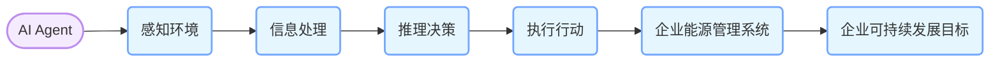

# AI Agent在企业能源管理与可持续发展中的应用

> 关键词：AI Agent、企业能源管理、可持续发展、能源优化、智能决策

> 摘要：本文深入探讨了AI Agent在企业能源管理与可持续发展中的应用。首先介绍了相关背景知识，包括目的范围、预期读者等内容。接着阐述了AI Agent及相关概念的原理与联系，并通过Mermaid流程图进行展示。详细讲解了核心算法原理及操作步骤，给出了对应的Python源代码。还介绍了相关数学模型和公式，并举例说明。通过项目实战，展示了代码实现及解读。分析了AI Agent在企业能源管理中的实际应用场景，推荐了相关学习资源、开发工具框架和论文著作。最后总结了未来发展趋势与挑战，提供了常见问题解答和扩展阅读参考资料，旨在为企业在能源管理和可持续发展方面利用AI Agent提供全面且深入的指导。

## 1. 背景介绍 
### 1.1 目的和范围
在当今社会，能源问题日益突出，企业面临着能源成本上升、能源供应不稳定以及环境保护等多重压力。企业能源管理与可持续发展成为了企业发展过程中必须关注的重要议题。本文章的目的在于探讨AI Agent在企业能源管理与可持续发展中的应用，旨在为企业提供一种智能化、高效化的能源管理解决方案。范围涵盖了AI Agent的基本概念、相关算法原理、在企业能源管理中的实际应用场景以及未来发展趋势等方面。

### 1.2 预期读者
本文预期读者包括企业能源管理部门的工作人员、能源领域的研究人员、对人工智能在能源领域应用感兴趣的技术爱好者、企业管理者以及相关政策制定者等。通过阅读本文，读者可以了解到AI Agent在企业能源管理与可持续发展中的应用原理、方法和实践案例，为其在实际工作或研究中提供参考和借鉴。

### 1.3 文档结构概述
本文共分为十个部分。第一部分为背景介绍，阐述了文章的目的、范围、预期读者和文档结构概述，并给出了术语表。第二部分介绍核心概念与联系，包括AI Agent等核心概念的原理和架构，同时给出文本示意图和Mermaid流程图。第三部分详细讲解核心算法原理及具体操作步骤，使用Python源代码进行阐述。第四部分介绍数学模型和公式，并进行详细讲解和举例说明。第五部分通过项目实战，展示代码实际案例并进行详细解释说明。第六部分分析AI Agent在企业能源管理中的实际应用场景。第七部分推荐相关工具和资源，包括学习资源、开发工具框架和论文著作。第八部分总结未来发展趋势与挑战。第九部分为附录，提供常见问题与解答。第十部分为扩展阅读与参考资料。

### 1.4 术语表
#### 1.4.1 核心术语定义
- **AI Agent（人工智能代理）**：是一种能够感知环境、进行推理并采取行动以实现特定目标的智能实体。它可以根据环境信息自主地做出决策，并执行相应的操作。
- **企业能源管理**：是指对企业的能源消耗进行规划、组织、控制和监督等一系列活动，以提高能源利用效率、降低能源成本、减少环境污染。
- **可持续发展**：是指既满足当代人的需求，又不损害后代人满足其需求的能力的发展模式。在企业能源管理中，可持续发展要求企业在追求经济效益的同时，注重环境保护和资源的合理利用。

#### 1.4.2 相关概念解释
- **能源优化**：是指通过对能源系统的分析、设计和运行管理，使能源的利用效率达到最优状态，从而降低能源消耗和成本。
- **智能决策**：是指利用人工智能技术，对复杂的决策问题进行分析和处理，提供科学、合理的决策方案。

#### 1.4.3 缩略词列表
- **AI**：Artificial Intelligence（人工智能）
- **IoT**：Internet of Things（物联网）

## 2. 核心概念与联系 

### AI Agent原理
AI Agent是一种能够感知环境、进行推理并采取行动以实现特定目标的智能实体。其基本原理可以分为以下几个步骤：
1. **感知环境**：AI Agent通过各种传感器收集环境信息，例如温度、湿度、能源消耗数据等。
2. **信息处理**：对感知到的环境信息进行处理和分析，提取有用的信息。
3. **推理决策**：根据处理后的信息和预设的目标，进行推理和决策，选择合适的行动方案。
4. **执行行动**：将决策结果转化为具体的行动，对环境产生影响。

### 企业能源管理与可持续发展的关系
企业能源管理是实现可持续发展的重要手段之一。通过有效的能源管理，企业可以降低能源消耗，减少对环境的影响，同时提高能源利用效率，降低生产成本，增强企业的竞争力。可持续发展则为企业能源管理提供了指导原则和目标，要求企业在能源管理过程中注重环境保护和资源的合理利用，实现经济、社会和环境的协调发展。

### 文本示意图
```plaintext
         +----------------+
         |   AI Agent     |
         +----------------+
         | 感知环境       |
         | 信息处理       |
         | 推理决策       |
         | 执行行动       |
         +----------------+
                |
                v
 +------------------------------+
 |        企业能源管理系统       |
 | 能源数据采集、分析、优化等   |
 +------------------------------+
                |
                v
 +------------------------------+
 |      企业可持续发展目标      |
 | 降低能源消耗、减少污染等    |
 +------------------------------+
```

### Mermaid流程图


## 3. 核心算法原理 & 具体操作步骤 

### 核心算法原理
在企业能源管理中，AI Agent可以使用强化学习算法来实现能源优化决策。强化学习是一种通过智能体与环境进行交互，不断尝试不同的行动，并根据环境反馈的奖励信号来学习最优策略的机器学习方法。

以一个简单的能源调度问题为例，AI Agent的目标是在满足企业生产需求的前提下，最小化能源消耗成本。AI Agent在每个时间步需要做出决策，选择不同的能源供应方式（例如，使用电网电力、太阳能发电或储能设备等）。环境会根据AI Agent的决策给出相应的奖励，奖励的大小与能源消耗成本和生产需求的满足程度有关。

### Python源代码实现
```python
import numpy as np

# 定义环境参数
num_states = 10  # 状态数量
num_actions = 3  # 行动数量
gamma = 0.9  # 折扣因子
alpha = 0.1  # 学习率

# 初始化Q表
Q = np.zeros((num_states, num_actions))

# 定义奖励函数
def get_reward(state, action):
    # 这里简单模拟奖励，实际应用中需要根据具体情况计算
    if action == 0:
        return -10  # 高成本行动
    elif action == 1:
        return -5  # 中等成本行动
    else:
        return -2  # 低成本行动

# 定义环境转移函数
def next_state(state, action):
    # 这里简单模拟状态转移，实际应用中需要根据具体情况计算
    return (state + action) % num_states

# 强化学习训练过程
num_episodes = 1000
for episode in range(num_episodes):
    state = np.random.randint(0, num_states)  # 随机初始化状态
    done = False
    while not done:
        # 选择行动
        if np.random.uniform(0, 1) < 0.1:  # 探索率为0.1
            action = np.random.randint(0, num_actions)
        else:
            action = np.argmax(Q[state, :])
        
        # 获取奖励和下一个状态
        reward = get_reward(state, action)
        next_state_value = next_state(state, action)
        
        # 更新Q表
        Q[state, action] = Q[state, action] + alpha * (reward + gamma * np.max(Q[next_state_value, :]) - Q[state, action])
        
        state = next_state_value
        
        # 判断是否结束
        if state == 0:
            done = True
```

### 具体操作步骤
1. **数据收集**：收集企业的能源消耗数据、生产需求数据、能源价格数据等环境信息。
2. **状态和行动定义**：根据收集到的数据，定义AI Agent的状态和行动空间。例如，状态可以包括当前的能源消耗水平、生产需求等，行动可以包括选择不同的能源供应方式。
3. **奖励函数设计**：设计合适的奖励函数，用于评估AI Agent的决策效果。奖励函数应该与企业的能源管理目标（例如，最小化能源消耗成本、满足生产需求等）相关。
4. **强化学习训练**：使用强化学习算法（例如，Q学习、深度Q网络等）对AI Agent进行训练，使其学习到最优的能源管理策略。
5. **策略部署**：将训练好的策略部署到企业的能源管理系统中，实现智能化的能源调度和优化。

## 4. 数学模型和公式 & 详细讲解 & 举例说明 

### 强化学习的数学模型
强化学习的数学模型可以用马尔可夫决策过程（MDP）来描述。一个MDP可以用一个五元组 $\langle S, A, P, R, \gamma \rangle$ 表示，其中：
- $S$ 是状态空间，表示环境的所有可能状态。
- $A$ 是行动空间，表示智能体可以采取的所有可能行动。
- $P(s'|s, a)$ 是状态转移概率，表示在状态 $s$ 下采取行动 $a$ 后转移到状态 $s'$ 的概率。
- $R(s, a)$ 是奖励函数，表示在状态 $s$ 下采取行动 $a$ 后获得的即时奖励。
- $\gamma$ 是折扣因子，用于衡量未来奖励的重要性，取值范围为 $[0, 1]$。

### Q学习算法公式
Q学习是一种基于价值迭代的强化学习算法，其核心思想是通过不断更新Q表来学习最优策略。Q表 $Q(s, a)$ 表示在状态 $s$ 下采取行动 $a$ 的价值。Q学习的更新公式为：
$$Q(s, a) \leftarrow Q(s, a) + \alpha [R(s, a) + \gamma \max_{a'} Q(s', a') - Q(s, a)]$$
其中，$\alpha$ 是学习率，用于控制每次更新的步长；$s'$ 是在状态 $s$ 下采取行动 $a$ 后转移到的下一个状态。

### 举例说明
假设一个企业的能源管理问题可以用一个简单的MDP来描述，状态空间 $S = \{0, 1, 2\}$，行动空间 $A = \{0, 1\}$。状态转移概率和奖励函数如下表所示：

| 状态 $s$ | 行动 $a$ | 下一个状态 $s'$ | 奖励 $R(s, a)$ |
|----------|----------|----------------|----------------|
| 0        | 0        | 1              | -10            |
| 0        | 1        | 2              | -5             |
| 1        | 0        | 0              | -2             |
| 1        | 1        | 2              | -3             |
| 2        | 0        | 1              | -4             |
| 2        | 1        | 0              | -1             |

初始时，Q表 $Q(s, a)$ 全为0。假设折扣因子 $\gamma = 0.9$，学习率 $\alpha = 0.1$。在状态 $s = 0$ 下，智能体选择行动 $a = 1$，转移到状态 $s' = 2$，获得奖励 $R(0, 1) = -5$。根据Q学习的更新公式，Q表的更新过程如下：
$$Q(0, 1) \leftarrow Q(0, 1) + 0.1 [-5 + 0.9 \max_{a'} Q(2, a') - Q(0, 1)]$$
由于初始时 $Q(2, a')$ 全为0，所以 $Q(0, 1) \leftarrow 0 + 0.1 [-5 + 0.9 \times 0 - 0] = -0.5$。

通过不断地与环境进行交互和更新Q表，智能体可以学习到最优的能源管理策略。

## 5. 项目实战：代码实际案例和详细解释说明 

### 5.1  开发环境搭建
- **操作系统**：推荐使用Ubuntu 20.04或Windows 10。
- **Python版本**：Python 3.8及以上。
- **开发工具**：推荐使用PyCharm或VS Code作为集成开发环境。
- **依赖库安装**：使用以下命令安装必要的依赖库：
```bash
pip install numpy
```

### 5.2  源代码详细实现和代码解读
```python
import numpy as np

# 定义环境参数
num_states = 10  # 状态数量
num_actions = 3  # 行动数量
gamma = 0.9  # 折扣因子
alpha = 0.1  # 学习率

# 初始化Q表
Q = np.zeros((num_states, num_actions))

# 定义奖励函数
def get_reward(state, action):
    # 这里简单模拟奖励，实际应用中需要根据具体情况计算
    if action == 0:
        return -10  # 高成本行动
    elif action == 1:
        return -5  # 中等成本行动
    else:
        return -2  # 低成本行动

# 定义环境转移函数
def next_state(state, action):
    # 这里简单模拟状态转移，实际应用中需要根据具体情况计算
    return (state + action) % num_states

# 强化学习训练过程
num_episodes = 1000
for episode in range(num_episodes):
    state = np.random.randint(0, num_states)  # 随机初始化状态
    done = False
    while not done:
        # 选择行动
        if np.random.uniform(0, 1) < 0.1:  # 探索率为0.1
            action = np.random.randint(0, num_actions)
        else:
            action = np.argmax(Q[state, :])
        
        # 获取奖励和下一个状态
        reward = get_reward(state, action)
        next_state_value = next_state(state, action)
        
        # 更新Q表
        Q[state, action] = Q[state, action] + alpha * (reward + gamma * np.max(Q[next_state_value, :]) - Q[state, action])
        
        state = next_state_value
        
        # 判断是否结束
        if state == 0:
            done = True

# 输出训练好的Q表
print("训练好的Q表：")
print(Q)
```

### 代码解读与分析
1. **环境参数定义**：`num_states` 定义了状态的数量，`num_actions` 定义了行动的数量，`gamma` 是折扣因子，`alpha` 是学习率。
2. **Q表初始化**：使用 `np.zeros` 函数将Q表初始化为全0矩阵。
3. **奖励函数**：`get_reward` 函数根据状态和行动返回相应的奖励，这里只是简单模拟，实际应用中需要根据具体的能源管理问题进行计算。
4. **环境转移函数**：`next_state` 函数根据当前状态和行动返回下一个状态，同样，实际应用中需要根据具体情况进行计算。
5. **强化学习训练过程**：通过 `for` 循环进行多个回合的训练，每个回合中，智能体不断与环境进行交互，根据Q表选择行动，获取奖励和下一个状态，并更新Q表。
6. **结束条件**：当状态为0时，当前回合结束。
7. **输出结果**：训练结束后，输出训练好的Q表。

## 6. 实际应用场景 
### 能源调度优化
AI Agent可以根据企业的生产需求、能源价格、电网负荷等信息，实时调整能源供应方式，实现能源调度的优化。例如，在电价低谷期，优先使用电网电力进行生产和储能；在太阳能充足时，优先使用太阳能发电，减少对电网的依赖，降低能源消耗成本。

### 设备运行管理
AI Agent可以对企业的能源设备（如空调、照明系统、电机等）进行实时监测和控制。根据环境温度、光照强度、设备运行状态等信息，自动调整设备的运行参数，提高设备的能源利用效率。例如，当室内温度达到设定值时，自动调节空调的制冷或制热功率；当光照强度足够时，自动关闭部分照明设备。

### 能源预测与规划
AI Agent可以利用历史能源消耗数据、气象数据、生产计划等信息，对企业未来的能源需求进行预测。根据预测结果，制定合理的能源采购计划和生产计划，避免能源浪费和供应不足的情况发生。例如，提前预测到未来一段时间内能源需求将增加，可以提前与能源供应商签订合同，确保能源的稳定供应。

### 能源效率评估与改进