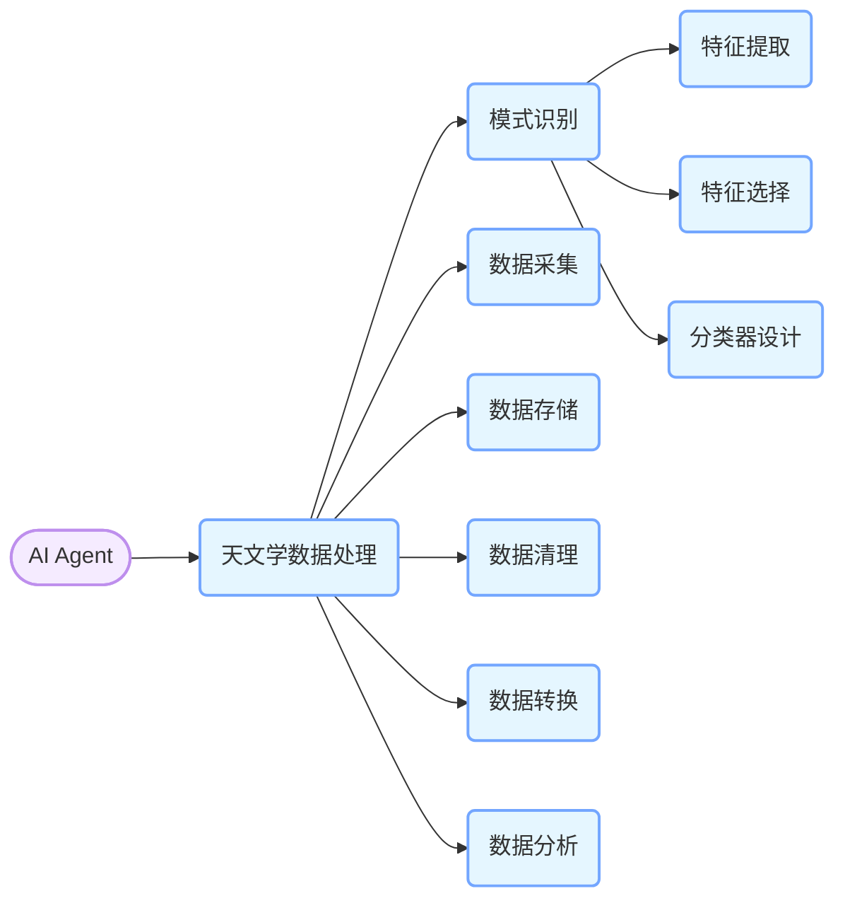

# AI Agent在天文学中的应用：数据处理与模式识别

> 关键词：AI Agent、天文学、数据处理、模式识别、天体分析

> 摘要：本文深入探讨了AI Agent在天文学领域的数据处理与模式识别方面的应用。随着天文学观测数据的爆炸式增长，传统的数据处理和分析方法面临巨大挑战。AI Agent凭借其强大的自主学习和决策能力，为天文学数据处理提供了高效、智能的解决方案。文章详细介绍了AI Agent的核心概念、算法原理、数学模型，并通过实际案例展示了其在天文学中的具体应用。同时，推荐了相关的学习资源、开发工具和研究论文，最后对AI Agent在天文学中的未来发展趋势与挑战进行了总结。

## 1. 背景介绍 
### 1.1 目的和范围
天文学是一门古老而又充满活力的科学，随着观测技术的不断进步，如大型望远镜阵列、卫星观测等，天文学数据呈现出爆炸式增长。这些数据包含了丰富的天体信息，但也给数据处理和分析带来了巨大挑战。传统的数据处理方法往往效率低下，难以从海量数据中提取有价值的信息。

本文的目的是探讨AI Agent在天文学数据处理与模式识别中的应用，介绍其核心概念、算法原理、数学模型和实际应用案例。范围涵盖了AI Agent在天文学中的各个方面，包括天体分类、星系结构分析、天文事件预测等。

### 1.2 预期读者
本文预期读者包括天文学研究人员、数据科学家、人工智能工程师以及对天文学和人工智能交叉领域感兴趣的爱好者。对于天文学研究人员，本文可以提供新的数据处理和分析方法；对于数据科学家和人工智能工程师，本文可以介绍天文学领域的应用场景和挑战；对于爱好者，本文可以帮助他们了解AI Agent在天文学中的神奇应用。

### 1.3 文档结构概述
本文将按照以下结构进行组织：
1. 背景介绍：介绍本文的目的、范围、预期读者和文档结构概述。
2. 核心概念与联系：介绍AI Agent、天文学数据处理和模式识别的核心概念，并展示它们之间的联系。
3. 核心算法原理 & 具体操作步骤：详细讲解AI Agent的核心算法原理，并给出具体的操作步骤和Python代码示例。
4. 数学模型和公式 & 详细讲解 & 举例说明：介绍AI Agent在天文学中的数学模型和公式，并通过具体例子进行说明。
5. 项目实战：代码实际案例和详细解释说明：通过实际项目案例，展示AI Agent在天文学数据处理与模式识别中的应用。
6. 实际应用场景：介绍AI Agent在天文学中的实际应用场景。
7. 工具和资源推荐：推荐相关的学习资源、开发工具和研究论文。
8. 总结：未来发展趋势与挑战：总结AI Agent在天文学中的应用现状，并展望未来的发展趋势和挑战。
9. 附录：常见问题与解答：解答读者可能遇到的常见问题。
10. 扩展阅读 & 参考资料：提供相关的扩展阅读材料和参考资料。

### 1.4 术语表
#### 1.4.1 核心术语定义
- **AI Agent（人工智能代理）**：是一种能够感知环境、自主学习和决策的智能体，它可以根据环境的变化自动调整自己的行为。
- **天文学数据处理**：是指对天文学观测数据进行采集、存储、清理、转换和分析的过程。
- **模式识别**：是指对数据中的模式、规律和特征进行识别和分类的过程。
- **天体分类**：是指将天体按照其物理性质、形态特征等进行分类的过程。
- **星系结构分析**：是指对星系的形态、结构和演化进行分析的过程。

#### 1.4.2 相关概念解释
- **机器学习**：是一门多领域交叉学科，涉及概率论、统计学、逼近论、凸分析、算法复杂度理论等多门学科。它专门研究计算机怎样模拟或实现人类的学习行为，以获取新的知识或技能，重新组织已有的知识结构使之不断改善自身的性能。
- **深度学习**：是机器学习的一个分支领域，它是一种基于对数据进行表征学习的方法。深度学习通过构建具有很多层的神经网络模型，自动从数据中学习到复杂的特征和模式。

#### 1.4.3 缩略词列表
- **AI**：Artificial Intelligence（人工智能）
- **ML**：Machine Learning（机器学习）
- **DL**：Deep Learning（深度学习）
- **CNN**：Convolutional Neural Network（卷积神经网络）
- **RNN**：Recurrent Neural Network（循环神经网络）

## 2. 核心概念与联系 

### 2.1 AI Agent的概念
AI Agent是一种能够感知环境、自主学习和决策的智能体。它可以根据环境的变化自动调整自己的行为，以实现特定的目标。AI Agent通常由感知模块、决策模块和执行模块组成。感知模块用于获取环境信息，决策模块根据感知到的信息进行决策，执行模块根据决策结果执行相应的动作。

### 2.2 天文学数据处理的概念
天文学数据处理是指对天文学观测数据进行采集、存储、清理、转换和分析的过程。天文学观测数据包括天体的图像、光谱、光度等信息。数据处理的目的是从这些数据中提取有价值的信息，如天体的位置、亮度、温度等。

### 2.3 模式识别的概念
模式识别是指对数据中的模式、规律和特征进行识别和分类的过程。在天文学中，模式识别可以用于天体分类、星系结构分析、天文事件预测等。模式识别通常包括特征提取、特征选择和分类器设计等步骤。

### 2.4 核心概念的联系
AI Agent在天文学中的应用主要体现在数据处理和模式识别方面。AI Agent可以通过感知模块获取天文学观测数据，然后使用决策模块对数据进行处理和分析，最后通过执行模块输出分析结果。在数据处理过程中，AI Agent可以使用机器学习和深度学习算法进行模式识别，以提高数据处理的效率和准确性。

### 2.5 文本示意图
```plaintext
          +----------------+
          |   AI Agent     |
          +----------------+
          | 感知模块       |
          | 决策模块       |
          | 执行模块       |
          +----------------+
                |
                v
 +-----------------------+
 | 天文学数据处理        |
 |  - 数据采集           |
 |  - 数据存储           |
 |  - 数据清理           |
 |  - 数据转换           |
 |  - 数据分析           |
 +-----------------------+
                |
                v
 +-----------------------+
 | 模式识别              |
 |  - 特征提取           |
 |  - 特征选择           |
 |  - 分类器设计         |
 +-----------------------+
```

### 2.6 Mermaid流程图


## 3. 核心算法原理 & 具体操作步骤 

### 3.1 核心算法原理
在天文学数据处理与模式识别中，常用的AI Agent算法包括机器学习和深度学习算法。下面分别介绍几种常见的算法原理。

#### 3.1.1 支持向量机（SVM）
支持向量机是一种二分类模型，它的基本思想是在特征空间中找到一个最优的超平面，使得不同类别的样本能够被最大程度地分开。SVM的目标是最大化分类间隔，即超平面到最近样本点的距离。

#### 3.1.2 卷积神经网络（CNN）
卷积神经网络是一种专门用于处理具有网格结构数据的深度学习模型，如图像数据。CNN通过卷积层、池化层和全连接层等组件，自动从数据中学习到特征和模式。卷积层用于提取数据的局部特征，池化层用于减少数据的维度，全连接层用于进行分类或回归。

#### 3.1.3 循环神经网络（RNN）
循环神经网络是一种专门用于处理序列数据的深度学习模型，如时间序列数据。RNN通过引入循环结构，使得网络能够记住之前的输入信息，从而处理序列数据中的上下文信息。

### 3.2 具体操作步骤

#### 3.2.1 数据准备
首先，需要收集和整理天文学观测数据。数据可以来自于各种天文观测设备，如望远镜、卫星等。然后，对数据进行预处理，包括数据清理、归一化、划分训练集和测试集等。

#### 3.2.2 模型选择
根据数据的特点和任务的需求，选择合适的AI Agent算法。例如，如果数据是图像数据，可以选择CNN；如果数据是序列数据，可以选择RNN。

#### 3.2.3 模型训练
使用训练集对选择的模型进行训练。在训练过程中，需要调整模型的参数，以最小化损失函数。可以使用梯度下降等优化算法来更新模型的参数。

#### 3.2.4 模型评估
使用测试集对训练好的模型进行评估。评估指标可以包括准确率、召回率、F1值等。根据评估结果，可以对模型进行调整和优化。

#### 3.2.5 模型应用
将训练好的模型应用到实际的天文学数据处理和模式识别任务中。可以使用模型对新的数据进行分类、预测等操作。

### 3.3 Python源代码示例
下面是一个使用Python和Scikit-learn库实现支持向量机进行天体分类的示例代码：

```python
import numpy as np
from sklearn import datasets
from sklearn.model_selection import train_test_split
from sklearn.svm import SVC
from sklearn.metrics import accuracy_score

# 加载天文学数据集
# 这里使用鸢尾花数据集作为示例，实际应用中需要替换为真实的天文学数据集
iris = datasets.load_iris()
X = iris.data
y = iris.target

# 划分训练集和测试集
X_train, X_test, y_train, y_test = train_test_split(X, y, test_size=0.3, random_state=42)

# 创建支持向量机模型
model = SVC(kernel='linear')

# 训练模型
model.fit(X_train, y_train)

# 预测测试集
y_pred = model.predict(X_test)

# 计算准确率
accuracy = accuracy_score(y_test, y_pred)
print("Accuracy:", accuracy)
```

## 4. 数学模型和公式 & 详细讲解 & 举例说明 

### 4.1 支持向量机的数学模型和公式
支持向量机的目标是在特征空间中找到一个最优的超平面，使得不同类别的样本能够被最大程度地分开。超平面的方程可以表示为：

$$w^T x + b = 0$$

其中，$w$ 是超平面的法向量，$b$ 是偏置项，$x$ 是样本点的特征向量。

支持向量机的优化目标是最大化分类间隔，即超平面到最近样本点的距离。分类间隔可以表示为：

$$\frac{2}{\|w\|}$$

因此，支持向量机的优化问题可以表示为：

$$\min_{w,b} \frac{1}{2} \|w\|^2$$

$$s.t. \quad y_i (w^T x_i + b) \geq 1, \quad i = 1,2,\cdots,n$$

其中，$y_i$ 是样本点 $x_i$ 的标签，$n$ 是样本的数量。

### 4.2 卷积神经网络的数学模型和公式
卷积神经网络的核心组件是卷积层、池化层和全连接层。下面分别介绍它们的数学模型和公式。

#### 4.2.1 卷积层
卷积层的作用是提取数据的局部特征。卷积操作可以表示为：

$$y_{i,j} = \sum_{m=0}^{M-1} \sum_{n=0}^{N-1} x_{i+m,j+n} w_{m,n} + b$$

其中，$x$ 是输入数据，$w$ 是卷积核，$b$ 是偏置项，$y$ 是输出数据，$M$ 和 $N$ 是卷积核的大小。

#### 4.2.2 池化层
池化层的作用是减少数据的维度。常用的池化操作包括最大池化和平均池化。最大池化操作可以表示为：

$$y_{i,j} = \max_{m=0}^{M-1} \max_{n=0}^{N-1} x_{iM+m,jN+n}$$

其中，$x$ 是输入数据，$y$ 是输出数据，$M$ 和 $N$ 是池化窗口的大小。

#### 4.2.3 全连接层
全连接层的作用是将卷积层和池化层提取的特征进行分类或回归。全连接层的输出可以表示为：

$$y = f(Wx + b)$$

其中，$x$ 是输入数据，$W$ 是权重矩阵，$b$ 是偏置项，$f$ 是激活函数。

### 4.3 循环神经网络的数学模型和公式
循环神经网络的核心组件是循环单元。常用的循环单元包括简单循环单元（SRU）、长短期记忆网络（LSTM）和门控循环单元（GRU）。下面以简单循环单元为例，介绍循环神经网络的数学模型和公式。

简单循环单元的输入包括当前时刻的输入 $x_t$ 和上一时刻的隐藏状态 $h_{t-1}$，输出为当前时刻的隐藏状态 $h_t$。简单循环单元的更新公式可以表示为：

$$h_t = \tanh(W_{xh} x_t + W_{hh} h_{t-1} + b_h)$$

其中，$W_{xh}$ 是输入到隐藏状态的权重矩阵，$W_{hh}$ 是隐藏状态到隐藏状态的权重矩阵，$b_h$ 是偏置项，$\tanh$ 是激活函数。

### 4.4 举例说明
下面以支持向量机为例，通过一个简单的例子来说明其应用。假设我们有一个二维的数据集，包含两个类别的样本。我们的目标是使用支持向量机找到一个最优的超平面，将这两个类别的样本分开。

```python
import numpy as np
import matplotlib.pyplot as plt
from sklearn import svm

# 生成数据集
X = np.array([[3, 4], [1, 2], [4, 5], [2, 3], [5, 6], [7, 8], [6, 7], [8, 9]])
y = np.array([0, 0, 0, 0, 1, 1, 1, 1])

# 创建支持向量机模型
model = svm.SVC(kernel='linear')

# 训练模型
model.fit(X, y)

# 绘制数据集和超平面
plt.scatter(X[:, 0], X[:, 1], c=y, cmap=plt.cm.Paired)
ax = plt.gca()
xlim = ax.get_xlim()
ylim = ax.get_ylim()

# 创建网格点
xx = np.linspace(xlim[0], xlim[1], 30)
yy = np.linspace(ylim[0], ylim[1], 30)
YY, XX = np.meshgrid(yy, xx)
xy = np.vstack([XX.ravel(), YY.ravel()]).T
Z = model.decision_function(xy).reshape(XX.shape)

# 绘制超平面和边界
ax.contour(XX, YY, Z, colors='k', levels=[-1, 0, 1], alpha=0.5, linestyles=['--', '-', '--'])

# 绘制支持向量
ax.scatter(model.support_vectors_[:, 0], model.support_vectors_[:, 1], s=100, linewidth=1, facecolors='none', edgecolors='k')

plt.show()
```

## 5. 项目实战：代码实际案例和详细解释说明 

### 5.1  开发环境搭建
在进行项目实战之前，需要搭建开发环境。以下是搭建开发环境的步骤：

#### 5.1.1 安装Python
Python是一种广泛使用的编程语言，许多机器学习和深度学习库都支持Python。可以从Python官方网站（https://www.python.org/downloads/）下载并安装Python。

#### 5.1.2 安装必要的库
在Python中，有许多用于机器学习和深度学习的库，如NumPy、Pandas、Scikit-learn、TensorFlow、PyTorch等。可以使用pip命令来安装这些库：

```sh
pip install numpy pandas scikit-learn tensorflow pytorch
```

#### 5.1.3 安装开发工具
可以使用Jupyter Notebook或PyCharm等开发工具来编写和运行代码。Jupyter Notebook是一种交互式的开发环境，适合进行数据分析和模型训练；PyCharm是一种专业的Python集成开发环境，适合进行大型项目的开发。

### 5.2  源代码详细实现和代码解读
下面以一个使用CNN进行天体图像分类的项目为例，详细介绍源代码的实现和代码解读。

```python
import tensorflow as tf
from tensorflow.keras import layers, models
import numpy as np
import matplotlib.pyplot as plt
from sklearn.model_selection import train_test_split

# 加载天文学图像数据集
# 这里使用随机生成的数据作为示例，实际应用中需要替换为真实的天文学图像数据集
num_samples = 1000
image_size = 64
X = np.random.rand(num_samples, image_size, image_size, 3)
y = np.random.randint(0, 2, num_samples)

# 划分训练集和测试集
X_train, X_test, y_train, y_test = train_test_split(X, y, test_size=0.2, random_state=42)

# 构建CNN模型
model = models.Sequential([
    layers.Conv2D(32, (3, 3), activation='relu', input_shape=(image_size, image_size, 3)),
    layers.MaxPooling2D((2, 2)),
    layers.Conv2D(64, (3, 3), activation='relu'),
    layers.MaxPooling2D((2, 2)),
    layers.Conv2D(64, (3, 3), activation='relu'),
    layers.Flatten(),
    layers.Dense(64, activation='relu'),
    layers.Dense(2, activation='softmax')
])

# 编译模型
model.compile(optimizer='adam',
              loss='sparse_categorical_crossentropy',
              metrics=['accuracy'])

# 训练模型
history = model.fit(X_train, y_train, epochs=10, validation_data=(X_test, y_test))

# 评估模型
test_loss, test_acc = model.evaluate(X_test, y_test)
print(f"Test accuracy: {test_acc}")

# 绘制训练过程曲线
plt.plot(history.history['accuracy'], label='Training accuracy')
plt.plot(history.history['val_accuracy'], label='Validation accuracy')
plt.xlabel('Epoch')
plt.ylabel('Accuracy')
plt.legend()
plt.show()
```

### 5.3  代码解读与分析
#### 5.3.1 数据加载和预处理
首先，使用随机生成的数据作为示例，实际应用中需要替换为真实的天文学图像数据集。然后，使用`train_test_split`函数将数据集划分为训练集和测试集。

#### 5.3.2 模型构建
使用`Sequential`模型构建CNN模型。模型包含三个卷积层、三个池化层、一个全连接层和一个输出层。卷积层用于提取图像的特征，池化层用于减少数据的维度，全连接层用于进行分类。

#### 5.3.3 模型编译
使用`compile`方法编译模型，指定优化器、损失函数和评估指标。这里使用`adam`优化器、`sparse_categorical_crossentropy`损失函数和`accuracy`评估指标。

#### 5.3.4 模型训练
使用`fit`方法训练模型，指定训练集、训练轮数和验证集。训练过程中，模型会不断调整参数，以最小化损失函数。

#### 5.3.5 模型评估
使用`evaluate`方法评估模型在测试集上的性能。输出测试集的损失和准确率。

#### 5.3.6 绘制训练过程曲线
使用`matplotlib`库绘制训练过程中的准确率曲线，以便观察模型的训练效果。

## 6. 实际应用场景 
### 6.1 天体分类
AI Agent可以根据天体的图像、光谱等特征，对天体进行分类。例如，将恒星、行星、星系等不同类型的天体区分开来。通过对大量天体数据的学习和分析，AI Agent可以提高天体分类的准确率和效率。

### 6.2 星系结构分析
AI Agent可以分析星系的形态、结构和演化。通过对星系图像的处理和模式识别，AI Agent可以识别星系的旋臂、核球、盘等结构特征，并研究星系的形成和演化过程。

### 6.3 天文事件预测
AI Agent可以根据历史天文数据和当前观测数据，预测天文事件的发生。例如，预测超新星爆发、彗星撞击等事件。通过对大量天文数据的学习和分析，AI Agent可以发现天文事件的规律和模式，从而提高预测的准确率。

### 6.4 天文数据清理和修复
天文学观测数据中往往存在噪声、缺失值等问题。AI Agent可以使用数据处理和模式识别技术，对天文数据进行清理和修复。例如，使用机器学习算法去除噪声，使用插值算法填补缺失值。

## 7. 工具和资源推荐
### 7.1 学习资源推荐
#### 7.1.1 书籍推荐
- 《Python机器学习》：介绍了Python在机器学习中的应用，包括数据处理、模型选择、模型评估等内容。
- 《深度学习》：由深度学习领域的三位先驱Ian Goodfellow、Yoshua Bengio和Aaron Courville撰写，全面介绍了深度学习的理论和实践。
- 《天文学基础》：介绍了天文学的基本概念、天体物理、星系演化等内容，适合初学者入门。

#### 7.1.2 在线课程
- Coursera上的“机器学习”课程：由斯坦福大学教授Andrew Ng讲授，是机器学习领域的经典课程。
- edX上的“深度学习”课程：由深度学习领域的专家讲授，介绍了深度学习的基本概念、算法和应用。
- 中国大学MOOC上的“天文学概论”课程：由国内知名高校的教授讲授，介绍了天文学的基本概念、天体物理、星系演化等内容。

#### 7.1.3 技术博客和网站
- Medium：是一个技术博客平台，上面有许多关于机器学习、深度学习和天文学的文章。
- arXiv：是一个预印本数据库，上面有许多关于天文学和人工智能的研究论文。
- Kaggle：是一个数据科学竞赛平台，上面有许多关于天文学数据处理和模式识别的竞赛和数据集。

### 7.2 开发工具框架推荐
#### 7.2.1 IDE和编辑器
- Jupyter Notebook：是一种交互式的开发环境，适合进行数据分析和模型训练。
- PyCharm：是一种专业的Python集成开发环境，适合进行大型项目的开发。
- Visual Studio Code：是一种轻量级的代码编辑器，支持多种编程语言和插件。

#### 7.2.2 调试和性能分析工具
- TensorBoard：是TensorFlow提供的一个可视化工具，可以用于可视化模型的训练过程、性能指标等。
- PyTorch Profiler：是PyTorch提供的一个性能分析工具，可以用于分析模型的性能瓶颈和优化建议。
- Numba：是一个用于加速Python代码的编译器，可以将Python代码编译成机器码，提高代码的执行效率。

#### 7.2.3 相关框架和库
- NumPy：是Python中用于科学计算的基础库，提供了多维数组对象和各种数学函数。
- Pandas：是Python中用于数据处理和分析的库，提供了数据结构和数据操作方法。
- Scikit-learn：是Python中用于机器学习的库，提供了各种机器学习算法和工具。
- TensorFlow：是Google开发的一个深度学习框架，提供了各种深度学习模型和工具。
- PyTorch：是Facebook开发的一个深度学习框架，提供了动态图和静态图两种编程方式。

### 7.3 相关论文著作推荐
#### 7.3.1 经典论文
- “Support-Vector Networks”：介绍了支持向量机的基本原理和算法。
- “Gradient-Based Learning Applied to Document Recognition”：介绍了卷积神经网络的基本原理和算法。
- “Long Short-Term Memory”：介绍了长短期记忆网络的基本原理和算法。

#### 7.3.2 最新研究成果
- “Deep Learning for Astrophysics”：介绍了深度学习在天文学中的应用现状和未来发展趋势。
- “AI Agents for Astronomical Data Analysis”：介绍了AI Agent在天文学数据处理和模式识别中的应用。
- “Pattern Recognition in Astronomy: A Review”：介绍了模式识别在天文学中的应用和发展。

#### 7.3.3 应用案例分析
- “Classification of Astronomical Objects Using Machine Learning”：介绍了使用机器学习算法对天体进行分类的应用案例。
- “Analysis of Galaxy Structure Using Deep Learning”：介绍了使用深度学习算法对星系结构进行分析的应用案例。
- “Prediction of Astronomical Events Using AI Agents”：介绍了使用AI Agent对天文事件进行预测的应用案例。

## 8. 总结：未来发展趋势与挑战
### 8.1 未来发展趋势
- **多模态数据融合**：未来，AI Agent将能够处理更多类型的天文学数据，如图像、光谱、时间序列等。通过多模态数据融合，AI Agent可以更全面地了解天体的性质和演化过程。
- **强化学习的应用**：强化学习是一种通过与环境交互来学习最优策略的机器学习方法。未来，AI Agent可以使用强化学习来优化天文学观测计划，提高观测效率和质量。
- **可解释性人工智能**：随着AI Agent在天文学中的应用越来越广泛，其决策过程的可解释性变得越来越重要。未来，研究人员将致力于开发可解释性人工智能方法，使AI Agent的决策过程更加透明和可理解。

### 8.2 挑战
- **数据质量问题**：天文学观测数据往往存在噪声、缺失值等问题，这些问题会影响AI Agent的性能。因此，需要开发有效的数据清理和修复方法，提高数据质量。
- **计算资源需求**：AI Agent的训练和推理需要大量的计算资源，尤其是深度学习模型。因此，需要开发高效的计算算法和硬件平台，降低计算资源需求。
- **跨学科合作**：AI Agent在天文学中的应用需要天文学、计算机科学、数学等多个学科的知识和技能。因此，需要加强跨学科合作，培养复合型人才。

## 9. 附录：常见问题与解答
### 9.1 AI Agent在天文学中的应用有哪些优势？
AI Agent在天文学中的应用具有以下优势：
- **高效处理海量数据**：随着天文学观测技术的不断进步，天文学数据呈现出爆炸式增长。AI Agent可以快速、高效地处理这些海量数据，从中提取有价值的信息。
- **自动发现模式和规律**：AI Agent可以通过机器学习和深度学习算法，自动发现天文学数据中的模式和规律，为天文学研究提供新的思路和方法。
- **提高分类和预测准确率**：AI Agent可以通过大量数据的学习和训练，提高天体分类和天文事件预测的准确率，为天文学研究提供更可靠的结果。

### 9.2 如何选择合适的AI Agent算法？
选择合适的AI Agent算法需要考虑以下因素：
- **数据类型**：不同的AI Agent算法适用于不同类型的数据。例如，CNN适用于处理图像数据，RNN适用于处理序列数据。
- **任务需求**：不同的任务需求需要选择不同的AI Agent算法。例如，分类任务可以选择支持向量机、决策树等算法，回归任务可以选择线性回归、神经网络等算法。
- **数据规模**：数据规模的大小也会影响AI Agent算法的选择。对于大规模数据集，可以选择深度学习算法；对于小规模数据集，可以选择传统的机器学习算法。

### 9.3 AI Agent在天文学中的应用面临哪些挑战？
AI Agent在天文学中的应用面临以下挑战：
- **数据质量问题**：天文学观测数据往往存在噪声、缺失值等问题，这些问题会影响AI Agent的性能。
- **计算资源需求**：AI Agent的训练和推理需要大量的计算资源，尤其是深度学习模型。
- **跨学科合作**：AI Agent在天文学中的应用需要天文学、计算机科学、数学等多个学科的知识和技能。

## 10. 扩展阅读 & 参考资料
### 10.1 扩展阅读
- 《人工智能：现代方法》：全面介绍了人工智能的基本概念、算法和应用。
- 《天体物理学导论》：介绍了天体物理学的基本概念、理论和方法。
- 《机器学习实战》：通过实际案例介绍了机器学习的基本概念、算法和应用。

### 10.2 参考资料
- Goodfellow, I., Bengio, Y., & Courville, A. (2016). Deep Learning. MIT Press.
- Bishop, C. M. (2006). Pattern Recognition and Machine Learning. Springer.
- Hogg, D. W., Bovy, J., & Lang, D. (2010). Data analysis recipes: Fitting a model to data. arXiv preprint arXiv:1008.4686.

作者：AI天才研究院/AI Genius Institute & 禅与计算机程序设计艺术 /Zen And The Art of Computer Programming