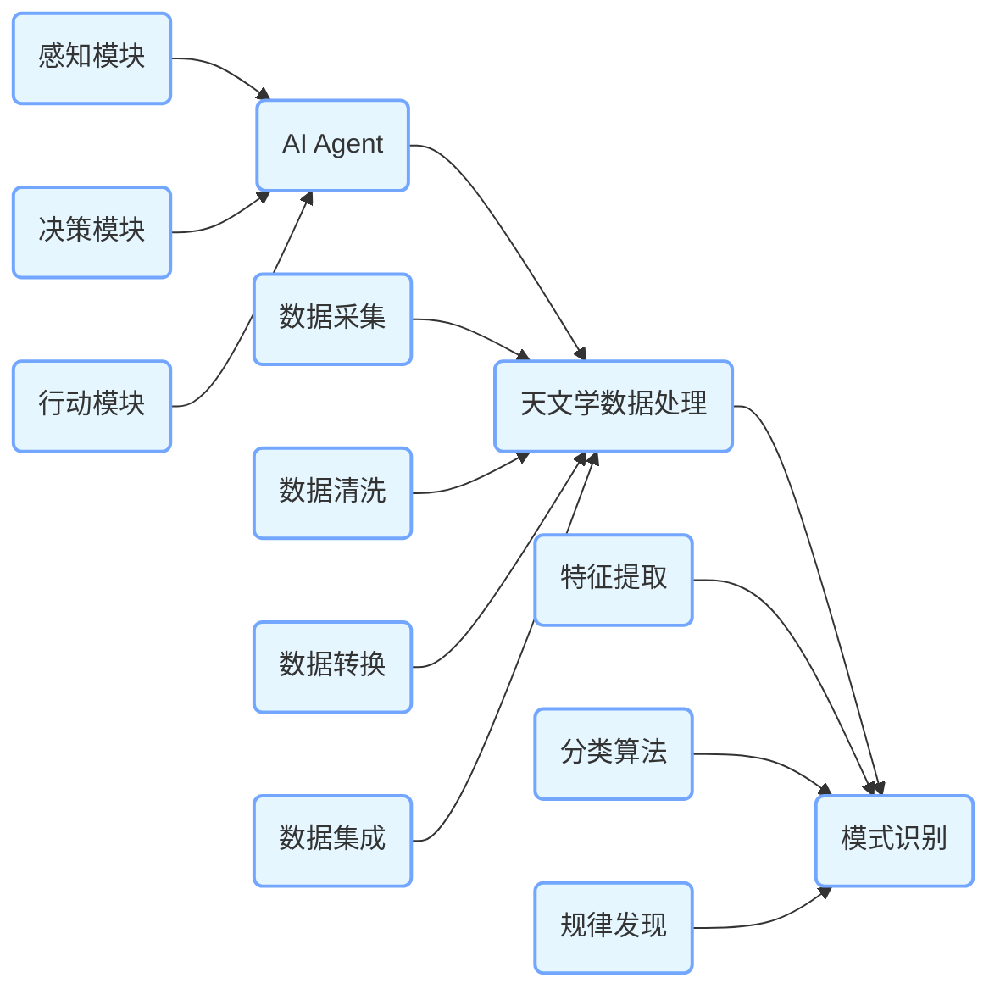

# AI Agent在天文学中的应用：数据处理与模式识别

> 关键词：AI Agent、天文学、数据处理、模式识别、天体探测

> 摘要：本文深入探讨了AI Agent在天文学领域的数据处理与模式识别应用。首先介绍了研究的背景、目的、预期读者和文档结构等内容，接着阐述了AI Agent、天文学数据处理和模式识别的核心概念及联系，详细讲解了相关核心算法原理并给出Python代码示例，通过数学模型和公式进一步剖析其内在原理。随后通过项目实战展示了代码实现与解读，探讨了实际应用场景，推荐了相关学习资源、开发工具框架以及论文著作。最后总结了未来发展趋势与挑战，还给出了常见问题解答和参考资料。旨在为天文学领域利用AI Agent进行数据处理与模式识别提供全面且深入的技术指引。

## 1. 背景介绍 
### 1.1 目的和范围
随着天文学观测技术的飞速发展，如大型望远镜、卫星探测器等的广泛应用，天文学数据呈现出爆炸式增长。这些数据不仅规模巨大，而且具有高维度、复杂多样等特点。传统的数据处理和分析方法已经难以满足现代天文学研究的需求。本研究的目的在于探讨如何利用AI Agent技术，高效地处理天文学数据，并从中识别出有价值的模式，如天体的特征、演化规律等。研究范围涵盖了天文学数据的采集、清洗、预处理、特征提取，以及利用AI Agent进行模式识别的各个环节。

### 1.2 预期读者
本文预期读者包括天文学研究人员、数据科学家、人工智能领域的开发者、对天文学与人工智能交叉领域感兴趣的学生和爱好者等。对于天文学研究人员，本文提供了利用先进技术处理天文数据的新方法和思路；对于数据科学家和AI开发者，展示了AI Agent在天文学这一特定领域的具体应用场景和技术实现细节；对于学生和爱好者，有助于他们了解跨学科领域的前沿知识和研究动态。

### 1.3 文档结构概述
本文首先介绍研究的背景信息，包括目的、预期读者和文档结构等。接着阐述AI Agent、天文学数据处理和模式识别的核心概念及其联系，并通过示意图和流程图进行直观展示。然后详细讲解核心算法原理，给出Python代码示例，同时通过数学模型和公式深入剖析其内在原理。随后通过项目实战展示代码的实际实现和解读。再探讨AI Agent在天文学中的实际应用场景。之后推荐相关的学习资源、开发工具框架以及论文著作。最后总结未来发展趋势与挑战，给出常见问题解答和参考资料。

### 1.4 术语表
#### 1.4.1 核心术语定义
- **AI Agent（人工智能智能体）**：是一种能够感知环境，根据内部状态和感知信息进行决策，并采取行动以实现特定目标的智能实体。在天文学应用中，AI Agent可以根据天文数据的特征和研究需求，自动执行数据处理和模式识别任务。
- **天文学数据**：指通过各种天文观测设备（如望远镜、卫星等）收集到的关于天体的各种信息，包括图像、光谱、天体位置、亮度等数据。
- **数据处理**：对原始的天文学数据进行采集、清洗、转换、集成等操作，以提高数据的质量和可用性，为后续的分析和模式识别做准备。
- **模式识别**：从大量的天文学数据中发现有意义的模式和规律，如天体的分类、演化趋势等。

#### 1.4.2 相关概念解释
- **机器学习**：是AI Agent实现模式识别的重要技术手段之一，通过对大量数据的学习，让计算机自动发现数据中的模式和规律。常见的机器学习算法包括决策树、支持向量机、神经网络等。
- **深度学习**：是机器学习的一个分支，基于深度神经网络，能够自动学习数据的深层次特征，在图像识别、语音识别等领域取得了巨大的成功。在天文学中，深度学习可以用于天体图像的分类、星系形态的识别等。
- **数据挖掘**：从大量的、不完全的、有噪声的、模糊的、随机的数据中，提取隐含在其中的、人们事先不知道的、但又是潜在有用的信息和知识的过程。在天文学中，数据挖掘可以帮助发现新的天体类型、天体之间的关联等。

#### 1.4.3 缩略词列表
- **AI**：Artificial Intelligence，人工智能
- **ML**：Machine Learning，机器学习
- **DL**：Deep Learning，深度学习
- **CNN**：Convolutional Neural Network，卷积神经网络
- **RNN**：Recurrent Neural Network，循环神经网络

## 2. 核心概念与联系 

### 核心概念原理
#### AI Agent原理
AI Agent由感知模块、决策模块和行动模块组成。感知模块负责收集环境信息，在天文学中就是收集天文数据；决策模块根据感知到的信息和内部状态进行决策，确定要采取的行动；行动模块则执行决策模块的指令，如对数据进行处理、执行模式识别算法等。AI Agent可以通过学习和进化不断提高其性能和适应性。

#### 天文学数据处理原理
天文学数据处理的主要目的是去除数据中的噪声、误差和冗余信息，提高数据的质量和可用性。常见的数据处理步骤包括数据采集、数据清洗、数据转换和数据集成。数据采集是通过各种天文观测设备收集原始数据；数据清洗是去除数据中的噪声和错误值；数据转换是将数据转换为适合分析的格式；数据集成是将不同来源的数据整合在一起。

#### 模式识别原理
模式识别是通过对数据的特征提取和分类，将数据划分到不同的类别中，或者发现数据中的规律和趋势。常见的模式识别方法包括基于统计的方法、基于机器学习的方法和基于深度学习的方法。基于统计的方法通过统计数据的特征参数进行分类；基于机器学习的方法通过训练分类器进行分类；基于深度学习的方法通过深度神经网络自动学习数据的特征和分类规则。

### 架构的文本示意图
```plaintext
                            +-------------------+
                            |    AI Agent       |
                            +-------------------+
                            | 感知模块          |
                            | 决策模块          |
                            | 行动模块          |
                            +-------------------+
                                     |
                                     | 感知天文数据
                                     v
                            +-------------------+
                            | 天文学数据处理    |
                            +-------------------+
                            | 数据采集          |
                            | 数据清洗          |
                            | 数据转换          |
                            | 数据集成          |
                            +-------------------+
                                     |
                                     | 处理后的数据
                                     v
                            +-------------------+
                            | 模式识别          |
                            +-------------------+
                            | 特征提取          |
                            | 分类算法          |
                            | 规律发现          |
                            +-------------------+
```

### Mermaid流程图


## 3. 核心算法原理 & 具体操作步骤 

### 数据处理算法 - 数据清洗
数据清洗的目的是去除数据中的噪声和错误值。常见的方法包括均值滤波、中值滤波等。下面是一个使用Python实现均值滤波的示例代码：

```python
import numpy as np

def mean_filter(data, window_size):
    """
    均值滤波函数
    :param data: 输入的数据
    :param window_size: 滤波窗口大小
    :return: 滤波后的数据
    """
    filtered_data = np.zeros_like(data)
    half_window = window_size // 2
    for i in range(len(data)):
        start = max(0, i - half_window)
        end = min(len(data), i + half_window + 1)
        filtered_data[i] = np.mean(data[start:end])
    return filtered_data

# 示例数据
data = np.array([1, 2, 3, 4, 5, 6, 7, 8, 9, 10])
window_size = 3
filtered_data = mean_filter(data, window_size)
print("原始数据:", data)
print("滤波后的数据:", filtered_data)
```

### 模式识别算法 - 基于决策树的分类
决策树是一种常用的分类算法，它通过构建树状结构来进行分类决策。下面是一个使用Python的`scikit-learn`库实现决策树分类的示例代码：

```python
from sklearn.datasets import load_iris
from sklearn.model_selection import train_test_split
from sklearn.tree import DecisionTreeClassifier
from sklearn.metrics import accuracy_score

# 加载鸢尾花数据集
iris = load_iris()
X = iris.data
y = iris.target

# 划分训练集和测试集
X_train, X_test, y_train, y_test = train_test_split(X, y, test_size=0.3, random_state=42)

# 创建决策树分类器
clf = DecisionTreeClassifier()

# 训练模型
clf.fit(X_train, y_train)

# 预测
y_pred = clf.predict(X_test)

# 计算准确率
accuracy = accuracy_score(y_test, y_pred)
print("决策树分类准确率:", accuracy)
```

### 具体操作步骤
1. **数据采集**：使用各种天文观测设备收集原始数据。
2. **数据清洗**：使用均值滤波、中值滤波等方法去除数据中的噪声和错误值。
3. **数据转换**：将数据转换为适合分析的格式，如归一化、标准化等。
4. **数据集成**：将不同来源的数据整合在一起。
5. **特征提取**：从处理后的数据中提取有代表性的特征。
6. **模式识别**：使用决策树、支持向量机、神经网络等算法进行分类和规律发现。

## 4. 数学模型和公式 & 详细讲解 & 举例说明 

### 均值滤波数学模型
均值滤波的数学模型可以表示为：

$$
\hat{x}[n] = \frac{1}{N} \sum_{i = n - \lfloor \frac{N}{2} \rfloor}^{n + \lfloor \frac{N}{2} \rfloor} x[i]
$$

其中，$\hat{x}[n]$ 是滤波后的数据在位置 $n$ 的值，$x[i]$ 是原始数据在位置 $i$ 的值，$N$ 是滤波窗口的大小。

详细讲解：均值滤波是一种线性滤波方法，它通过计算窗口内数据的平均值来平滑数据。窗口的大小 $N$ 决定了滤波的效果，$N$ 越大，滤波效果越明显，但也会导致数据的细节丢失。

举例说明：假设有一组数据 $x = [1, 2, 3, 4, 5]$，滤波窗口大小 $N = 3$。对于位置 $n = 2$ 的数据，其滤波后的值为：

$$
\hat{x}[2] = \frac{1}{3} \sum_{i = 2 - 1}^{2 + 1} x[i] = \frac{1}{3} (x[1] + x[2] + x[3]) = \frac{1}{3} (2 + 3 + 4) = 3
$$

### 决策树分类数学模型
决策树分类的数学模型基于信息熵和信息增益。信息熵是衡量数据不确定性的指标，定义为：

$$
H(X) = - \sum_{i = 1}^{k} p(x_i) \log_2 p(x_i)
$$

其中，$X$ 是数据集，$p(x_i)$ 是数据集中第 $i$ 类样本的概率，$k$ 是类别的数量。

信息增益是在划分数据集前后信息熵的减少量，定义为：

$$
IG(X, A) = H(X) - \sum_{v \in Values(A)} \frac{|X_v|}{|X|} H(X_v)
$$

其中，$A$ 是划分属性，$Values(A)$ 是属性 $A$ 的取值集合，$X_v$ 是属性 $A$ 取值为 $v$ 的子集。

详细讲解：决策树通过不断选择信息增益最大的属性进行划分，构建树状结构。信息熵越大，数据的不确定性越大；信息增益越大，划分越有效。

举例说明：假设有一个二分类数据集，其中正类样本有 6 个，负类样本有 4 个。则数据集的信息熵为：

$$
H(X) = - \frac{6}{10} \log_2 \frac{6}{10} - \frac{4}{10} \log_2 \frac{4}{10} \approx 0.971
$$

假设选择一个属性 $A$ 进行划分，划分后得到两个子集 $X_1$ 和 $X_2$，$X_1$ 中有 4 个正类样本和 1 个负类样本，$X_2$ 中有 2 个正类样本和 3 个负类样本。则划分后的信息熵为：

$$
H(X_1) = - \frac{4}{5} \log_2 \frac{4}{5} - \frac{1}{5} \log_2 \frac{1}{5} \approx 0.722
$$

$$
H(X_2) = - \frac{2}{5} \log_2 \frac{2}{5} - \frac{3}{5} \log_2 \frac{3}{5} \approx 0.971
$$

信息增益为：

$$
IG(X, A) = H(X) - \frac{5}{10} H(X_1) - \frac{5}{10} H(X_2) \approx 0.971 - \frac{1}{2} \times 0.722 - \frac{1}{2} \times 0.971 \approx 0.125
$$

## 5. 项目实战：代码实际案例和详细解释说明 

### 5.1  开发环境搭建
1. **安装Python**：建议安装Python 3.7及以上版本，可以从Python官方网站（https://www.python.org/downloads/）下载安装包进行安装。
2. **安装必要的库**：使用`pip`命令安装所需的库，如`numpy`、`scikit-learn`、`matplotlib`等。

```bash
pip install numpy scikit-learn matplotlib
```

### 5.2  源代码详细实现和代码解读
以下是一个使用深度学习进行天体图像分类的项目实战代码：

```python
import numpy as np
import tensorflow as tf
from tensorflow.keras import layers, models
from sklearn.model_selection import train_test_split
import matplotlib.pyplot as plt

# 加载天体图像数据集（假设已经有数据集）
# 这里简单模拟数据集
num_samples = 1000
image_size = 64
num_classes = 3

# 生成随机图像数据和标签
images = np.random.rand(num_samples, image_size, image_size, 3).astype(np.float32)
labels = np.random.randint(0, num_classes, num_samples)

# 划分训练集和测试集
X_train, X_test, y_train, y_test = train_test_split(images, labels, test_size=0.2, random_state=42)

# 构建卷积神经网络模型
model = models.Sequential([
    layers.Conv2D(32, (3, 3), activation='relu', input_shape=(image_size, image_size, 3)),
    layers.MaxPooling2D((2, 2)),
    layers.Conv2D(64, (3, 3), activation='relu'),
    layers.MaxPooling2D((2, 2)),
    layers.Conv2D(64, (3, 3), activation='relu'),
    layers.Flatten(),
    layers.Dense(64, activation='relu'),
    layers.Dense(num_classes, activation='softmax')
])

# 编译模型
model.compile(optimizer='adam',
              loss='sparse_categorical_crossentropy',
              metrics=['accuracy'])

# 训练模型
history = model.fit(X_train, y_train, epochs=10, validation_data=(X_test, y_test))

# 绘制训练和验证准确率曲线
plt.plot(history.history['accuracy'], label='Training Accuracy')
plt.plot(history.history['val_accuracy'], label='Validation Accuracy')
plt.xlabel('Epoch')
plt.ylabel('Accuracy')
plt.legend()
plt.show()

# 评估模型
test_loss, test_acc = model.evaluate(X_test, y_test)
print(f"Test accuracy: {test_acc}")
```

### 5.3  代码解读与分析
1. **数据加载和预处理**：使用`numpy`生成随机的天体图像数据和标签，并使用`sklearn`的`train_test_split`函数将数据集划分为训练集和测试集。
2. **模型构建**：使用`TensorFlow`的`Keras` API构建一个简单的卷积神经网络模型。模型包含卷积层、池化层、全连接层等。
3. **模型编译**：使用`adam`优化器和`sparse_categorical_crossentropy`损失函数编译模型。
4. **模型训练**：使用`fit`方法训练模型，并记录训练过程中的准确率和损失值。
5. **模型评估**：使用`evaluate