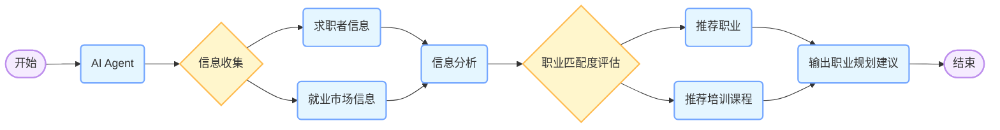

# AI Agent在智能个性化职业规划中的应用

> 关键词：AI Agent、智能个性化职业规划、职业分析、推荐算法、自然语言处理

> 摘要：本文聚焦于AI Agent在智能个性化职业规划中的应用。首先介绍了相关背景，包括目的范围、预期读者等内容。接着阐述了核心概念与联系，详细讲解了AI Agent和智能个性化职业规划的原理及架构。在核心算法原理部分，运用Python代码进行了说明。通过数学模型和公式深入分析了职业规划中的关键因素。项目实战部分给出了具体的代码案例及解读。探讨了AI Agent在智能个性化职业规划中的实际应用场景，推荐了学习、开发等相关工具和资源。最后总结了未来发展趋势与挑战，并对常见问题进行了解答，提供了扩展阅读和参考资料，旨在为相关领域的研究者和从业者提供全面且深入的知识参考。

## 1. 背景介绍 
### 1.1 目的和范围
随着科技的飞速发展，就业市场变得愈发复杂和多元化。传统的职业规划方式往往难以满足个体对于精准、个性化职业指导的需求。本文章的目的在于深入探讨AI Agent在智能个性化职业规划中的应用，旨在揭示如何利用先进的人工智能技术为求职者提供更贴合自身特点的职业建议。文章的范围涵盖了AI Agent的核心概念、相关算法原理、数学模型、实际项目案例以及应用场景等多个方面，力求全面且系统地呈现AI Agent在职业规划领域的应用全貌。

### 1.2 预期读者
本文的预期读者主要包括对人工智能和职业规划领域感兴趣的研究者、学生，从事职业规划咨询的专业人士，以及正在寻找职业发展方向的求职者。对于研究者和学生而言，文章提供了理论和实践相结合的研究思路；对于职业规划师，有助于其借助AI Agent提升服务质量和效率；对于求职者，能够帮助他们更好地理解如何利用AI技术进行个性化的职业规划。

### 1.3 文档结构概述
本文共分为十个部分。第一部分为背景介绍，阐述了文章的目的、预期读者和文档结构。第二部分讲解核心概念与联系，明确AI Agent和智能个性化职业规划的原理和架构。第三部分介绍核心算法原理和具体操作步骤，并给出Python代码示例。第四部分分析数学模型和公式，结合具体例子进行说明。第五部分为项目实战，包括开发环境搭建、源代码实现和代码解读。第六部分探讨实际应用场景。第七部分推荐相关的工具和资源，如学习资料、开发工具和论文著作。第八部分总结未来发展趋势与挑战。第九部分为附录，解答常见问题。第十部分提供扩展阅读和参考资料。

### 1.4 术语表
#### 1.4.1 核心术语定义
- **AI Agent（人工智能代理）**：是一种能够感知环境、自主决策并采取行动以实现特定目标的智能实体。在职业规划中，它可以收集求职者的信息，分析就业市场动态，为求职者提供个性化的职业建议。
- **智能个性化职业规划**：基于个体的兴趣、能力、价值观等多方面因素，利用人工智能技术为其量身定制职业发展路径和建议的过程。

#### 1.4.2 相关概念解释
- **自然语言处理（NLP）**：是AI Agent在职业规划中常用的技术之一，用于处理和理解人类语言。例如，通过分析求职者的简历、面试记录等文本信息，提取关键内容，为职业规划提供依据。
- **机器学习（ML）**：通过让计算机从数据中学习模式和规律，AI Agent可以利用机器学习算法对大量的职业数据和求职者信息进行分析，从而做出准确的职业预测和推荐。

#### 1.4.3 缩略词列表
- **NLP**：Natural Language Processing（自然语言处理）
- **ML**：Machine Learning（机器学习）

## 2. 核心概念与联系 

### 核心概念原理
#### AI Agent原理
AI Agent的核心原理基于感知、决策和行动三个关键环节。感知环节中，AI Agent通过各种渠道收集信息，如求职者的个人信息、职业技能、工作经历等，以及就业市场的动态数据，包括行业发展趋势、职位需求等。在决策环节，它运用机器学习、自然语言处理等技术对收集到的信息进行分析和处理，构建模型以评估求职者与不同职业的匹配度。最后，在行动环节，AI Agent根据决策结果为求职者提供具体的职业建议，如推荐合适的职位、培训课程等。

#### 智能个性化职业规划原理
智能个性化职业规划的原理是基于个体差异理论。每个人都有独特的兴趣、能力和价值观，这些因素决定了其适合的职业方向。智能个性化职业规划通过收集和分析个体的相关信息，利用人工智能算法挖掘个体与职业之间的潜在联系，从而为其制定个性化的职业发展方案。

### 架构示意图


该流程图展示了AI Agent在智能个性化职业规划中的工作流程。首先，AI Agent开始工作，进行信息收集，包括求职者信息和就业市场信息。然后对这些信息进行分析，评估职业匹配度，根据评估结果推荐合适的职业和培训课程，最后输出职业规划建议，流程结束。

## 3. 核心算法原理 & 具体操作步骤 

### 核心算法原理
在智能个性化职业规划中，常用的核心算法包括基于内容的推荐算法和协同过滤算法。以下以基于内容的推荐算法为例进行详细讲解。

基于内容的推荐算法主要是根据求职者的特征和职业的特征进行匹配。求职者的特征可以包括技能、学历、工作经验等，职业的特征可以包括职位要求、技能需求、行业前景等。算法的核心思想是计算求职者特征与职业特征之间的相似度，相似度越高，说明该职业越适合求职者。

### 具体操作步骤
1. **数据收集**：收集求职者的个人信息、职业技能、工作经历等数据，以及职业的相关信息，如职位描述、技能要求等。
2. **特征提取**：从收集到的数据中提取关键特征。例如，对于求职者的技能信息，可以将其转化为技能向量；对于职业的技能要求，也转化为相应的技能向量。
3. **相似度计算**：计算求职者特征向量与职业特征向量之间的相似度。常用的相似度计算方法包括余弦相似度、欧几里得距离等。
4. **职业推荐**：根据相似度排序，为求职者推荐相似度较高的职业。

### Python代码示例
```python
import numpy as np

# 定义求职者特征向量
job_seeker_features = np.array([1, 0, 1, 0, 1])

# 定义职业特征向量列表
job_features_list = [
    np.array([1, 1, 0, 0, 1]),
    np.array([0, 0, 1, 1, 0]),
    np.array([1, 0, 1, 1, 1])
]

# 计算余弦相似度的函数
def cosine_similarity(vector1, vector2):
    dot_product = np.dot(vector1, vector2)
    norm_vector1 = np.linalg.norm(vector1)
    norm_vector2 = np.linalg.norm(vector2)
    return dot_product / (norm_vector1 * norm_vector2)

# 计算每个职业与求职者的相似度
similarities = []
for job_features in job_features_list:
    similarity = cosine_similarity(job_seeker_features, job_features)
    similarities.append(similarity)

# 排序并推荐职业
sorted_indices = np.argsort(similarities)[::-1]
recommended_jobs = [i for i in sorted_indices]

print("推荐的职业索引（按相似度从高到低）:", recommended_jobs)
```
在上述代码中，首先定义了求职者的特征向量和职业的特征向量列表。然后定义了一个计算余弦相似度的函数，通过循环计算每个职业与求职者的相似度。最后，对相似度进行排序，输出推荐的职业索引。

## 4. 数学模型和公式 & 详细讲解 & 举例说明 

### 余弦相似度数学模型
余弦相似度是一种常用的计算向量相似度的方法，其数学公式为：
$$
\text{Cosine Similarity}(\vec{A}, \vec{B}) = \frac{\vec{A} \cdot \vec{B}}{\|\vec{A}\| \|\vec{B}\|}
$$
其中，$\vec{A}$ 和 $\vec{B}$ 是两个向量，$\vec{A} \cdot \vec{B}$ 表示两个向量的点积，$\|\vec{A}\|$ 和 $\|\vec{B}\|$ 分别表示向量 $\vec{A}$ 和 $\vec{B}$ 的模。

### 详细讲解
余弦相似度的取值范围在 $[-1, 1]$ 之间。当余弦相似度为 1 时，表示两个向量完全相同；当余弦相似度为 -1 时，表示两个向量完全相反；当余弦相似度为 0 时，表示两个向量相互垂直，即没有相关性。在职业规划中，我们希望找到与求职者特征向量余弦相似度较高的职业特征向量，这样的职业更有可能适合求职者。

### 举例说明
假设求职者的技能向量为 $\vec{A} = [1, 0, 1]$，表示求职者具备技能 1 和技能 3。某职业的技能要求向量为 $\vec{B} = [1, 1, 0]$，表示该职业需要技能 1 和技能 2。

首先计算点积：$\vec{A} \cdot \vec{B} = 1\times1 + 0\times1 + 1\times0 = 1$

然后计算向量的模：$\|\vec{A}\| = \sqrt{1^2 + 0^2 + 1^2} = \sqrt{2}$，$\|\vec{B}\| = \sqrt{1^2 + 1^2 + 0^2} = \sqrt{2}$

最后计算余弦相似度：$\text{Cosine Similarity}(\vec{A}, \vec{B}) = \frac{1}{\sqrt{2} \times \sqrt{2}} = \frac{1}{2}$

这表明该职业与求职者的技能匹配度为 $\frac{1}{2}$，可以根据这个相似度值与其他职业进行比较，从而做出职业推荐。

## 5. 项目实战：代码实际案例和详细解释说明 

### 5.1  开发环境搭建
#### 安装Python
首先需要安装Python环境，建议使用Python 3.7及以上版本。可以从Python官方网站（https://www.python.org/downloads/）下载对应操作系统的安装包，按照安装向导进行安装。

#### 安装必要的库
在项目中，我们需要使用一些Python库，如`numpy`、`pandas`等。可以使用`pip`命令进行安装：
```sh
pip install numpy pandas
```

### 5.2  源代码详细实现和代码解读
```python
import numpy as np
import pandas as pd

# 读取求职者信息和职业信息数据
job_seeker_data = pd.read_csv('job_seeker_info.csv')
job_data = pd.read_csv('job_info.csv')

# 提取求职者特征和职业特征
job_seeker_features = job_seeker_data[['skill_1', 'skill_2', 'skill_3']].values
job_features = job_data[['skill_1', 'skill_2', 'skill_3']].values

# 计算余弦相似度的函数
def cosine_similarity(vector1, vector2):
    dot_product = np.dot(vector1, vector2)
    norm_vector1 = np.linalg.norm(vector1)
    norm_vector2 = np.linalg.norm(vector2)
    return dot_product / (norm_vector1 * norm_vector2)

# 计算每个职业与求职者的相似度
similarities = []
for job_feature in job_features:
    similarity = cosine_similarity(job_seeker_features[0], job_feature)
    similarities.append(similarity)

# 排序并推荐职业
job_data['similarity'] = similarities
sorted_jobs = job_data.sort_values(by='similarity', ascending=False)
top_3_jobs = sorted_jobs.head(3)

print("推荐的前3个职业：")
print(top_3_jobs[['job_title', 'similarity']])
```

### 代码解读与分析
1. **数据读取**：使用`pandas`库的`read_csv`函数读取求职者信息和职业信息的CSV文件。
2. **特征提取**：从读取的数据中提取求职者和职业的技能特征，将其转换为`numpy`数组。
3. **相似度计算**：定义`cosine_similarity`函数计算余弦相似度，通过循环计算每个职业与求职者的相似度。
4. **职业推荐**：将相似度添加到职业信息数据框中，按照相似度进行排序，选取相似度最高的前3个职业进行推荐。

## 6. 实际应用场景 
### 求职平台
在求职平台上，AI Agent可以根据求职者的注册信息、浏览记录、投递历史等数据，为其提供个性化的职位推荐。例如，当求职者登录平台时，AI Agent可以快速分析其技能、兴趣和职业目标，在海量的职位信息中筛选出最适合的职位，并将其推送给求职者，提高求职效率和匹配度。

### 职业咨询机构
职业咨询机构可以利用AI Agent辅助咨询师为客户提供更精准的职业规划服务。咨询师可以将客户的信息输入到AI Agent系统中，AI Agent进行初步的分析和评估，为咨询师提供参考建议。同时，AI Agent还可以持续跟踪客户的职业发展情况，及时调整职业规划方案。

### 企业招聘
企业在招聘过程中，AI Agent可以帮助筛选简历。通过分析求职者的简历内容，提取关键信息，与企业职位要求进行匹配，快速筛选出符合要求的候选人。此外，AI Agent还可以为企业提供人才市场分析，帮助企业制定合理的招聘策略。

## 7. 工具和资源推荐
### 7.1 学习资源推荐
#### 7.1.1 书籍推荐
- 《Python机器学习实战》：本书详细介绍了Python在机器学习领域的应用，包括各种机器学习算法的原理和实现，对于理解AI Agent中的算法原理有很大帮助。
- 《人工智能：一种现代的方法》：这是人工智能领域的经典教材，全面介绍了人工智能的基本概念、算法和应用，为深入学习AI Agent提供了理论基础。

#### 7.1.2 在线课程
- Coursera上的“机器学习”课程：由斯坦福大学教授Andrew Ng授课，课程内容丰富，深入浅出，适合初学者学习机器学习的基础知识。
- edX上的“人工智能导论”课程：该课程系统地介绍了人工智能的各个方面，包括AI Agent的相关知识。

#### 7.1.3 技术博客和网站
- Medium：上面有很多关于人工智能和职业规划的技术文章和案例分享，可以从中获取最新的技术动态和实践经验。
- AI科技大本营：专注于人工智能领域的资讯和技术分享，提供了丰富的学习资源和行业动态。

### 7.2 开发工具框架推荐
#### 7.2.1 IDE和编辑器
- PyCharm：是一款专门为Python开发设计的集成开发环境，具有代码自动补全、调试等强大功能，提高开发效率。
- Jupyter Notebook：支持交互式编程，方便进行数据探索和模型调试，适合进行AI Agent相关项目的开发。

#### 7.2.2 调试和性能分析工具
- Py-Spy：可以对Python程序进行性能分析，找出程序中的性能瓶颈，帮助优化代码。
- pdb：Python自带的调试工具，用于调试Python代码，定位和解决程序中的错误。

#### 7.2.3 相关框架和库
- Scikit-learn：提供了丰富的机器学习算法和工具，方便实现AI Agent中的机器学习模型。
- NLTK：自然语言处理工具包，可用于处理和分析文本数据，如求职者的简历和职位描述。

### 7.3 相关论文著作推荐
#### 7.3.1 经典论文
- “A Mathematical Theory of Communication”：香农的这篇论文奠定了信息论的基础，对于理解数据处理和信息传输有重要意义。
- “Neural Networks and Deep Learning”：介绍了神经网络和深度学习的基本原理和应用，是深度学习领域的经典之作。

#### 7.3.2 最新研究成果
- 在ACM、IEEE等学术会议和期刊上搜索关于AI Agent在职业规划中的应用的最新研究论文，了解该领域的前沿动态。

#### 7.3.3 应用案例分析
- 可以参考一些知名企业或研究机构发布的关于AI Agent在职业规划中的应用案例报告，学习实际应用中的经验和方法。

## 8. 总结：未来发展趋势与挑战
### 未来发展趋势
- **多模态数据融合**：未来的AI Agent将不仅仅依赖于文本数据，还会融合图像、语音等多模态数据，更全面地了解求职者的情况。例如，通过分析求职者的视频面试记录，提取其表情、语气等信息，进一步完善职业规划建议。
- **与虚拟现实（VR）和增强现实（AR）技术结合**：利用VR和AR技术为求职者提供更加沉浸式的职业体验。例如，求职者可以通过VR技术模拟不同职业的工作场景，提前感受工作氛围，从而更好地做出职业选择。
- **个性化学习路径规划**：AI Agent将不仅提供职业推荐，还会为求职者制定个性化的学习路径，帮助他们提升职业技能。根据求职者的目标职业和当前技能水平，推荐适合的在线课程、培训项目等。

### 挑战
- **数据隐私和安全问题**：AI Agent需要收集大量的求职者个人信息，如何保障这些信息的隐私和安全是一个重要挑战。一旦数据泄露，可能会给求职者带来严重的损失。
- **算法的可解释性**：一些复杂的人工智能算法，如深度学习算法，往往是黑盒模型，难以解释其决策过程。在职业规划中，求职者和职业规划师需要了解AI Agent给出的建议是如何得出的，因此提高算法的可解释性至关重要。
- **就业市场的动态变化**：就业市场是不断变化的，新的职业和技能需求不断涌现。AI Agent需要及时跟上市场变化，更新其模型和数据，以提供准确的职业规划建议。

## 9. 附录：常见问题与解答
### 1. AI Agent给出的职业规划建议一定准确吗？
AI Agent的职业规划建议是基于大量的数据和算法模型得出的，但由于就业市场的复杂性和个体的多样性，其建议不能保证100%准确。不过，随着数据的不断丰富和算法的不断优化，建议的准确性会逐渐提高。同时，求职者在参考AI Agent的建议时，还应结合自身的实际情况和职业规划师的意见。

### 2. 使用AI Agent进行职业规划需要付费吗？
这取决于具体的应用和平台。有些求职平台或职业规划服务提供商可能会免费提供基本的AI Agent职业规划功能，而对于一些高级功能或定制化服务，可能会收取一定的费用。

### 3. AI Agent会取代职业规划师吗？
目前来看，AI Agent不会完全取代职业规划师。虽然AI Agent可以提供快速、高效的职业规划建议，但职业规划不仅仅是基于数据和算法的分析，还涉及到与求职者的情感沟通、心理辅导等方面。职业规划师可以根据自己的经验和专业知识，为求职者提供更全面、个性化的服务，与AI Agent形成互补。

## 10. 扩展阅读 & 参考资料
### 扩展阅读
- 《未来简史：从智人到神人》：探讨了科技发展对人类社会和职业的影响，有助于从宏观角度理解职业规划的未来趋势。
- 《智能时代》：介绍了人工智能在各个领域的应用和发展，对于深入了解AI Agent的技术背景有帮助。

### 参考资料
- 相关学术论文和研究报告，如ACM、IEEE等学术会议和期刊上发表的关于AI Agent和职业规划的论文。
- 求职平台和职业规划机构的官方文档和技术博客，了解他们在实际应用中使用AI Agent的经验和方法。

作者：AI天才研究院/AI Genius Institute & 禅与计算机程序设计艺术 /Zen And The Art of Computer Programming