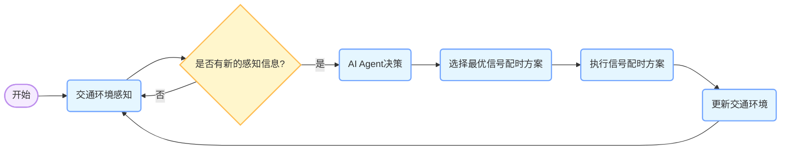

# AI Agent在智能交通信号优化中的实践

> 关键词：AI Agent、智能交通信号优化、强化学习、交通流量预测、智能控制

> 摘要：本文深入探讨了AI Agent在智能交通信号优化中的实践应用。首先介绍了智能交通信号优化的背景和重要性，阐述了AI Agent的核心概念及其与交通信号优化的联系。详细讲解了相关核心算法原理，结合Python代码进行说明，并给出了数学模型和公式。通过项目实战案例，展示了如何搭建开发环境、实现源代码以及对代码进行解读分析。同时，列举了AI Agent在智能交通信号优化中的实际应用场景，推荐了相关的学习资源、开发工具框架和论文著作。最后对未来发展趋势与挑战进行了总结，并给出常见问题解答和扩展阅读参考资料。

## 1. 背景介绍 
### 1.1 目的和范围
智能交通系统（Intelligent Transportation System，ITS）是解决城市交通拥堵、提高交通安全和效率的重要手段。交通信号控制作为ITS的核心组成部分，其优化对于改善交通状况起着关键作用。传统的交通信号控制方法往往基于固定的时间配时方案，难以适应动态变化的交通流量。而AI Agent技术的出现为交通信号优化提供了新的思路和方法。

本文的目的是探讨AI Agent在智能交通信号优化中的实践应用，详细介绍相关的技术原理、算法实现、项目实践和应用场景。范围涵盖了从AI Agent的基本概念到实际应用的各个方面，旨在为研究人员和开发者提供全面的参考。

### 1.2 预期读者
本文预期读者包括交通工程领域的研究人员、智能交通系统开发者、人工智能领域的技术人员以及对智能交通信号优化感兴趣的学者和爱好者。通过阅读本文，读者可以了解AI Agent在智能交通信号优化中的应用原理和方法，掌握相关的技术和工具，为实际项目的开发和研究提供指导。

### 1.3 文档结构概述
本文的结构如下：
- 核心概念与联系：介绍AI Agent和智能交通信号优化的核心概念，以及它们之间的联系，并给出相关的文本示意图和Mermaid流程图。
- 核心算法原理 & 具体操作步骤：详细讲解AI Agent在智能交通信号优化中常用的算法原理，结合Python代码进行说明。
- 数学模型和公式 & 详细讲解 & 举例说明：给出智能交通信号优化的数学模型和公式，并进行详细讲解和举例说明。
- 项目实战：代码实际案例和详细解释说明：通过一个具体的项目实战案例，展示如何搭建开发环境、实现源代码以及对代码进行解读分析。
- 实际应用场景：列举AI Agent在智能交通信号优化中的实际应用场景。
- 工具和资源推荐：推荐相关的学习资源、开发工具框架和论文著作。
- 总结：未来发展趋势与挑战：对AI Agent在智能交通信号优化中的未来发展趋势与挑战进行总结。
- 附录：常见问题与解答：给出常见问题的解答。
- 扩展阅读 & 参考资料：提供扩展阅读的资料和参考资料。

### 1.4 术语表
#### 1.4.1 核心术语定义
- **AI Agent（人工智能智能体）**：是一种能够感知环境、做出决策并执行动作的智能实体。在智能交通信号优化中，AI Agent可以根据交通流量等信息，实时调整交通信号的配时方案。
- **智能交通信号优化**：是指通过合理调整交通信号的配时方案，提高交通流量的通行效率，减少交通拥堵和延误。
- **强化学习**：是一种机器学习方法，通过智能体与环境进行交互，根据环境反馈的奖励信号来学习最优的行为策略。在智能交通信号优化中，强化学习可以用于训练AI Agent，使其能够根据不同的交通状况选择最优的信号配时方案。
- **交通流量预测**：是指通过对历史交通数据的分析和建模，预测未来一段时间内的交通流量情况。交通流量预测可以为交通信号优化提供重要的参考信息。

#### 1.4.2 相关概念解释
- **状态空间**：是指AI Agent在环境中可能处于的所有状态的集合。在智能交通信号优化中，状态空间可以包括交通流量、车辆排队长度、信号灯状态等信息。
- **动作空间**：是指AI Agent可以执行的所有动作的集合。在智能交通信号优化中，动作空间可以包括信号灯的切换时间、相位时长等。
- **奖励函数**：是指环境根据AI Agent的动作给予的反馈信号，用于评价AI Agent的行为好坏。在智能交通信号优化中，奖励函数可以根据交通流量的通行效率、车辆排队长度等指标来设计。

#### 1.4.3 缩略词列表
- **ITS**：Intelligent Transportation System，智能交通系统
- **RL**：Reinforcement Learning，强化学习
- **Q - learning**：Q学习，一种经典的强化学习算法

## 2. 核心概念与联系 

### 2.1 AI Agent的核心概念
AI Agent是一种能够感知环境、做出决策并执行动作的智能实体。它通常由感知模块、决策模块和执行模块组成。感知模块用于获取环境的信息，决策模块根据感知到的信息选择合适的动作，执行模块将决策模块选择的动作执行到环境中。

在智能交通信号优化中，AI Agent的感知模块可以通过交通传感器（如摄像头、地磁传感器等）获取交通流量、车辆排队长度等信息；决策模块根据这些信息，利用强化学习等算法选择最优的信号配时方案；执行模块将选择的信号配时方案发送到交通信号控制器，控制信号灯的切换。

### 2.2 智能交通信号优化的核心概念
智能交通信号优化是指通过合理调整交通信号的配时方案，提高交通流量的通行效率，减少交通拥堵和延误。传统的交通信号控制方法往往基于固定的时间配时方案，难以适应动态变化的交通流量。而智能交通信号优化方法可以根据实时的交通状况，动态调整信号配时方案，提高交通系统的运行效率。

### 2.3 核心概念的联系
AI Agent与智能交通信号优化之间存在着密切的联系。AI Agent可以作为智能交通信号优化的核心控制器，通过感知交通环境的信息，利用强化学习等算法进行决策，选择最优的信号配时方案，从而实现智能交通信号的优化。

### 2.4 文本示意图
```plaintext
              +-------------------+
              |   交通环境        |
              +-------------------+
                     |
                     |  感知信息
                     v
              +-------------------+
              |   AI Agent        |
              | - 感知模块        |
              | - 决策模块        |
              | - 执行模块        |
              +-------------------+
                     |
                     |  控制信号
                     v
              +-------------------+
              |  交通信号控制器  |
              +-------------------+
```

### 2.5 Mermaid流程图


## 3. 核心算法原理 & 具体操作步骤 

### 3.1 强化学习算法原理
强化学习是一种机器学习方法，通过智能体与环境进行交互，根据环境反馈的奖励信号来学习最优的行为策略。在智能交通信号优化中，强化学习可以用于训练AI Agent，使其能够根据不同的交通状况选择最优的信号配时方案。

强化学习的基本要素包括状态空间 $S$、动作空间 $A$、奖励函数 $R$ 和策略 $\pi$。状态空间 $S$ 是指智能体在环境中可能处于的所有状态的集合；动作空间 $A$ 是指智能体可以执行的所有动作的集合；奖励函数 $R(s, a)$ 是指智能体在状态 $s$ 下执行动作 $a$ 后，环境给予的反馈信号；策略 $\pi(s)$ 是指智能体在状态 $s$ 下选择动作的概率分布。

强化学习的目标是找到一个最优的策略 $\pi^*$，使得智能体在与环境的交互过程中获得的累积奖励最大。常用的强化学习算法包括Q - learning、Deep Q - Network（DQN）等。

### 3.2 Q - learning算法原理
Q - learning是一种无模型的强化学习算法，它通过学习一个Q值函数 $Q(s, a)$ 来近似最优的动作价值函数。Q值函数 $Q(s, a)$ 表示智能体在状态 $s$ 下执行动作 $a$ 后，获得的期望累积奖励。

Q - learning算法的更新公式如下：
$$Q(s_t, a_t) \leftarrow Q(s_t, a_t) + \alpha [r_{t+1} + \gamma \max_{a} Q(s_{t+1}, a) - Q(s_t, a_t)]$$
其中，$s_t$ 是当前状态，$a_t$ 是当前动作，$r_{t+1}$ 是执行动作 $a_t$ 后获得的奖励，$s_{t+1}$ 是下一个状态，$\alpha$ 是学习率，$\gamma$ 是折扣因子。

### 3.3 Python代码实现Q - learning算法
```python
import numpy as np

# 定义状态空间和动作空间
state_space = 10
action_space = 3

# 初始化Q表
Q = np.zeros((state_space, action_space))

# 定义超参数
alpha = 0.1  # 学习率
gamma = 0.9  # 折扣因子
epsilon = 0.1  # 探索率

# 定义奖励函数
def get_reward(state, action):
    # 这里简单示例，实际应用中需要根据具体情况定义
    if state == 5 and action == 1:
        return 1
    else:
        return 0

# 定义选择动作的函数
def choose_action(state):
    if np.random.uniform(0, 1) < epsilon:
        # 探索：随机选择动作
        action = np.random.choice(action_space)
    else:
        # 利用：选择Q值最大的动作
        action = np.argmax(Q[state, :])
    return action

# Q - learning算法训练
num_episodes = 1000
for episode in range(num_episodes):
    state = np.random.randint(0, state_space)
    done = False
    while not done:
        action = choose_action(state)
        reward = get_reward(state, action)
        # 这里简单假设下一个状态是随机的，实际应用中需要根据具体情况更新
        next_state = np.random.randint(0, state_space)
        
        # 更新Q表
        Q[state, action] = Q[state, action] + alpha * (reward + gamma * np.max(Q[next_state, :]) - Q[state, action])
        
        state = next_state
        if state == 5 and action == 1:
            done = True

# 输出最终的Q表
print("Final Q table:")
print(Q)
```

### 3.4 具体操作步骤
1. **定义状态空间和动作空间**：根据实际的交通场景，确定AI Agent的状态空间和动作空间。例如，状态空间可以包括交通流量、车辆排队长度等信息，动作空间可以包括信号灯的切换时间、相位时长等。
2. **初始化Q表**：将Q表初始化为全零矩阵，其大小为状态空间的大小乘以动作空间的大小。
3. **设置超参数**：设置学习率 $\alpha$、折扣因子 $\gamma$ 和探索率 $\epsilon$ 等超参数。
4. **定义奖励函数**：根据交通流量的通行效率、车辆排队长度等指标，定义奖励函数 $R(s, a)$。
5. **选择动作**：根据当前状态 $s$，利用 $\epsilon$-贪心策略选择动作 $a$。
6. **执行动作并获取奖励**：执行选择的动作 $a$，并从环境中获取奖励 $r$ 和下一个状态 $s'$。
7. **更新Q表**：根据Q - learning算法的更新公式，更新Q表中的Q值。
8. **重复步骤5 - 7**：直到达到终止条件（如达到最大步数或完成目标）。

## 4. 数学模型和公式 & 详细讲解 & 举例说明 

### 4.1 智能交通信号优化的数学模型
智能交通信号优化的目标是在一定的约束条件下，最大化交通流量的通行效率，减少交通拥堵和延误。可以将其建模为一个优化问题，具体如下：

#### 目标函数
设 $T$ 为一个信号周期的时长，$N$ 为交通路口的车道数量，$q_{i}(t)$ 为第 $i$ 条车道在时刻 $t$ 的交通流量，$x_{i}(t)$ 为第 $i$ 条车道在时刻 $t$ 的信号灯状态（$x_{i}(t) = 1$ 表示绿灯，$x_{i}(t) = 0$ 表示红灯）。则目标函数可以定义为：
$$\max \sum_{i = 1}^{N} \sum_{t = 0}^{T - 1} q_{i}(t) x_{i}(t)$$
该目标函数表示在一个信号周期内，所有车道通过的车辆总数最大。

#### 约束条件
- **信号灯切换约束**：信号灯的切换需要满足一定的时间间隔要求，例如，绿灯时间不能小于最小绿灯时间 $g_{min}$，红灯时间不能小于最小红灯时间 $r_{min}$。
- **相位约束**：交通信号灯的相位需要满足一定的逻辑关系，例如，同一相位内的车道信号灯状态应该相同。

### 4.2 公式详细讲解
- **目标函数**：目标函数 $\sum_{i = 1}^{N} \sum_{t = 0}^{T - 1} q_{i}(t) x_{i}(t)$ 表示在一个信号周期内，所有车道通过的车辆总数。其中，$q_{i}(t)$ 表示第 $i$ 条车道在时刻 $t$ 的交通流量，$x_{i}(t)$ 表示第 $i$ 条车道在时刻 $t$ 的信号灯状态。只有当信号灯为绿灯时（$x_{i}(t) = 1$），车辆才能通过该车道，因此目标函数中乘以 $x_{i}(t)$。
- **约束条件**：信号灯切换约束和相位约束是为了保证交通信号控制的合理性和安全性。例如，最小绿灯时间 $g_{min}$ 是为了保证车辆有足够的时间通过路口，最小红灯时间 $r_{min}$ 是为了保证行人有足够的时间通过斑马线。

### 4.3 举例说明
假设一个简单的交通路口有两条车道，信号周期时长 $T = 60$ 秒。第1条车道的交通流量 $q_{1}(t)$ 在前30秒为10辆/秒，后30秒为5辆/秒；第2条车道的交通流量 $q_{2}(t)$ 在前30秒为5辆/秒，后30秒为10辆/秒。最小绿灯时间 $g_{min} = 10$ 秒，最小红灯时间 $r_{min} = 10$ 秒。

则目标函数为：
$$\max \sum_{i = 1}^{2} \sum_{t = 0}^{59} q_{i}(t) x_{i}(t)$$
约束条件为：
- 对于第1条车道，绿灯时间 $\sum_{t = 0}^{59} x_{1}(t) \geq g_{min}$，红灯时间 $60 - \sum_{t = 0}^{59} x_{1}(t) \geq r_{min}$。
- 对于第2条车道，绿灯时间 $\sum_{t = 0}^{59} x_{2}(t) \geq g_{min}$，红灯时间 $60 - \sum_{t = 0}^{59} x_{2}(t) \geq r_{min}$。

通过求解该优化问题，可以得到最优的信号灯配时方案，使得在一个信号周期内通过的车辆总数最大。

## 5. 项目实战：代码实际案例和详细解释说明 

### 5.1  开发环境搭建
#### 5.1.1 安装Python
首先，需要安装Python开发环境。可以从Python官方网站（https://www.python.org/downloads/）下载适合自己操作系统的Python版本，并按照安装向导进行安装。

#### 5.1.2 安装必要的库
在智能交通信号优化项目中，需要使用一些Python库，如NumPy、Pandas、Matplotlib等。可以使用以下命令来安装这些库：
```sh
pip install numpy pandas matplotlib
```

#### 5.1.3 安装交通仿真工具
为了模拟交通场景，可以使用一些交通仿真工具，如SUMO（Simulation of Urban MObility）。可以从SUMO官方网站（https://sumo.dlr.de/docs/Downloads.php）下载适合自己操作系统的SUMO版本，并按照安装向导进行安装。

### 5.2  源代码详细实现和代码解读
以下是一个使用Python和SUMO进行智能交通信号优化的示例代码：

```python
import traci
import numpy as np
import random

# 定义超参数
alpha = 0.1  # 学习率
gamma = 0.9  # 折扣因子
epsilon = 0.1  # 探索率

# 定义状态空间和动作空间
state_space = 10
action_space = 3

# 初始化Q表
Q = np.zeros((state_space, action_space))

# 连接到SUMO仿真环境
traci.start(['sumo-gui', '-c', 'path/to/your/sumo/config.sumocfg'])

# 定义选择动作的函数
def choose_action(state):
    if random.uniform(0, 1) < epsilon:
        # 探索：随机选择动作
        action = random.randint(0, action_space - 1)
    else:
        # 利用：选择Q值最大的动作
        action = np.argmax(Q[state, :])
    return action

# 定义奖励函数
def get_reward():
    # 获取当前交通流量信息
    vehicle_ids = traci.vehicle.getIDList()
    num_vehicles = len(vehicle_ids)
    # 简单示例，车辆数量越少奖励越高
    reward = -num_vehicles
    return reward

# 定义获取状态的函数
def get_state():
    # 这里简单示例，实际应用中需要根据具体情况获取状态信息
    state = random.randint(0, state_space - 1)
    return state

# Q - learning算法训练
num_episodes = 100
for episode in range(num_episodes):
    state = get_state()
    done = False
    while not done:
        action = choose_action(state)
        
        # 执行动作：切换信号灯状态
        if action == 0:
            traci.trafficlight.setPhase('your_traffic_light_id', 0)
        elif action == 1:
            traci.trafficlight.setPhase('your_traffic_light_id', 1)
        elif action == 2:
            traci.trafficlight.setPhase('your_traffic_light_id', 2)
        
        # 仿真一步
        traci.simulationStep()
        
        # 获取奖励和下一个状态
        reward = get_reward()
        next_state = get_state()
        
        # 更新Q表
        Q[state, action] = Q[state, action] + alpha * (reward + gamma * np.max(Q[next_state, :]) - Q[state, action])
        
        state = next_state
        
        # 判断是否结束
        if traci.simulation.getMinExpectedNumber() == 0:
            done = True

# 关闭SUMO仿真环境
traci.close()

# 输出最终的Q表
print("Final Q table:")
print(Q)
```

### 5.3  代码解读与分析
#### 5.3.1 超参数设置
- `alpha`：学习率，控制Q表更新的步长。
- `gamma`：折扣因子，影响未来奖励的重要性。
- `epsilon`：探索率，控制智能体的探索和利用行为。

#### 5.3.2 状态空间和动作空间
- `state_space`：定义了状态空间的大小。
- `action_space`：定义了动作空间的大小。

#### 5.3.3 Q表初始化
`Q = np.zeros((state_space, action_space))`：将Q表初始化为全零矩阵。

#### 5.3.4 连接到SUMO仿真环境
`traci.start(['sumo-gui', '-c', 'path/to/your/sumo/config.sumocfg'])`：使用TraCI（Traffic Control Interface）库连接到SUMO仿真环境。

#### 5.3.5 选择动作
`choose_action` 函数根据 $\epsilon$-贪心策略选择动作。

#### 5.3.6 奖励函数
`get_reward` 函数根据当前交通流量信息计算奖励。这里简单地将车辆数量的负数作为奖励，车辆数量越少奖励越高。

#### 5.3.7 获取状态
`get_state` 函数获取当前的状态信息。这里简单地随机生成一个状态，实际应用中需要根据具体情况获取状态信息。

#### 5.3.8 Q - learning算法训练
在每个episode中，智能体根据当前状态选择动作，执行动作后获取奖励和下一个状态，然后更新Q表。当仿真环境中没有车辆时，结束当前episode。

#### 5.3.9 关闭SUMO仿真环境
`traci.close()`：关闭SUMO仿真环境。

#### 5.3.10 输出最终的Q表
最后输出训练得到的最终Q表。

## 6. 实际应用场景 
### 6.1 城市交通路口信号控制
在城市交通路口，AI Agent可以根据实时的交通流量信息，动态调整信号灯的配时方案。例如，当某个方向的交通流量较大时，AI Agent可以延长该方向的绿灯时间，减少车辆排队等待的时间，提高交通通行效率。

### 6.2 高速公路入口匝道控制
在高速公路入口匝道处，AI Agent可以根据高速公路主线上的交通流量和匝道上的车辆排队情况，控制匝道信号灯的开启和关闭。当高速公路主线上的交通流量较大时，AI Agent可以适当减少匝道上车辆的进入速度，避免造成高速公路主线上的交通拥堵。

### 6.3 智能停车场引导
在智能停车场中，AI Agent可以根据停车场内的车位占用情况和车辆的进出情况，引导车辆快速找到空闲的车位。例如，AI Agent可以通过显示屏或手机APP向车主提供车位信息和导航路线，提高停车场的使用效率。

### 6.4 公共交通优先控制
AI Agent可以实现公共交通优先控制，当公交车接近交通路口时，AI Agent可以提前调整信号灯的配时方案，为公交车提供优先通行权，减少公交车的延误时间，提高公共交通的服务质量。

## 7. 工具和资源推荐
### 7.1 学习资源推荐
#### 7.1.1 书籍推荐
- 《强化学习：原理与Python实现》：本书系统地介绍了强化学习的基本原理和算法，并通过Python代码实现了各种强化学习算法，适合初学者入门。
- 《智能交通系统概论》：本书全面介绍了智能交通系统的基本概念、技术和应用，对于了解智能交通信号优化的背景和相关技术有很大帮助。
- 《Python机器学习实战》：本书介绍了Python在机器学习领域的应用，包括强化学习、深度学习等算法，通过实际案例帮助读者掌握机器学习的应用技巧。

#### 7.1.2 在线课程
- Coursera上的“Reinforcement Learning Specialization”：由美国华盛顿大学的教授授课，系统地介绍了强化学习的理论和实践。
- edX上的“Introduction to Intelligent Transportation Systems”：介绍了智能交通系统的基本概念、技术和应用，适合初学者学习。
- 中国大学MOOC上的“Python语言程序设计”：帮助读者掌握Python编程语言的基本语法和应用，为学习智能交通信号优化的相关代码打下基础。

#### 7.1.3 技术博客和网站
- Towards Data Science：一个专注于数据科学和机器学习的技术博客，上面有很多关于强化学习和智能交通的文章。
- arXiv：一个预印本论文平台，上面可以找到很多关于智能交通信号优化和AI Agent的最新研究成果。
- SUMO官方网站（https://sumo.dlr.de/）：提供了SUMO交通仿真工具的详细文档和教程，对于使用SUMO进行交通仿真和信号优化有很大帮助。

### 7.2 开发工具框架推荐
#### 7.2.1 IDE和编辑器
- PyCharm：一款专业的Python集成开发环境，提供了丰富的代码编辑、调试和版本控制等功能，适合Python项目的开发。
- Jupyter Notebook：一个交互式的开发环境，可以方便地编写和运行Python代码，同时支持Markdown文本和可视化输出，适合进行数据分析和模型实验。
- Visual Studio Code：一款轻量级的代码编辑器，支持多种编程语言和插件扩展，具有丰富的代码编辑和调试功能。

#### 7.2.2 调试和性能分析工具
- pdb：Python自带的调试器，可以帮助开发者在代码中设置断点、单步执行代码和查看变量值等。
- cProfile：Python的性能分析工具，可以分析代码的运行时间和函数调用次数，帮助开发者找出代码中的性能瓶颈。
- TensorBoard：一个用于可视化深度学习模型训练过程的工具，可以帮助开发者监控模型的训练进度和性能指标。

#### 7.2.3 相关框架和库
- NumPy：一个用于科学计算的Python库，提供了高效的多维数组对象和各种数学函数，是机器学习和数据分析的基础库。
- Pandas：一个用于数据处理和分析的Python库，提供了灵活的数据结构和数据操作方法，方便进行数据清洗、转换和分析。
- OpenAI Gym：一个用于开发和比较强化学习算法的工具包，提供了各种模拟环境和评估指标，方便开发者进行强化学习算法的实验和测试。

### 7.3 相关论文著作推荐
#### 7.3.1 经典论文
- “Q - learning” by Watkins and Dayan：介绍了Q - learning算法的基本原理和实现方法，是强化学习领域的经典论文。
- “Deep Q - Networks” by Mnih et al.：提出了深度Q网络（DQN）算法，将深度学习和强化学习相结合，在很多游戏和控制任务中取得了很好的效果。
- “Intelligent Traffic Signal Control Based on Reinforcement Learning” by Zhang et al.：介绍了基于强化学习的智能交通信号控制方法，为智能交通信号优化提供了一种新的思路。

#### 7.3.2 最新研究成果
可以通过arXiv、IEEE Xplore等学术数据库搜索关于AI Agent在智能交通信号优化方面的最新研究成果。例如，一些研究提出了基于多智能体强化学习的交通信号控制方法，考虑了多个交通路口之间的协同控制；还有一些研究结合了深度学习和交通流量预测技术，提高了交通信号优化的准确性和实时性。

#### 7.3.3 应用案例分析
可以参考一些实际的智能交通项目案例，了解AI Agent在智能交通信号优化中的应用效果和实践经验。例如，某些城市的智能交通系统采用了基于AI Agent的交通信号控制技术，通过实际运行数据验证了该技术在提高交通通行效率、减少交通拥堵方面的有效性。

## 8. 总结：未来发展趋势与挑战
### 8.1 未来发展趋势
#### 8.1.1 多智能体协同控制
未来的智能交通信号优化将不再局限于单个交通路口的控制，而是需要考虑多个交通路口之间的协同控制。多智能体强化学习技术可以用于实现多个AI Agent之间的协作，共同优化整个交通网络的信号配时方案，提高交通系统的整体运行效率。

#### 8.1.2 融合多种技术
AI Agent在智能交通信号优化中将融合更多的技术，如深度学习、交通流量预测、物联网等。深度学习可以用于提取交通数据的特征，提高交通流量预测的准确性；物联网技术可以实现交通传感器和信号控制器之间的实时通信，为AI Agent提供更丰富的交通信息。

#### 8.1.3 与自动驾驶技术的结合
随着自动驾驶技术的发展，AI Agent在智能交通信号优化中将与自动驾驶车辆进行更紧密的结合。自动驾驶车辆可以向AI Agent提供实时的行驶信息，AI Agent可以根据这些信息调整交通信号的配时方案，实现更加高效和安全的交通运行。

### 8.2 挑战
#### 8.2.1 数据质量和隐私问题
智能交通信号优化需要大量的交通数据作为支撑，但是数据的质量和隐私问题是一个挑战。交通数据可能存在噪声、缺失值等问题，需要进行数据清洗和预处理。同时，交通数据涉及到个人隐私信息，需要采取有效的措施保护数据的隐私安全。

#### 8.2.2 算法复杂度和计算资源需求
强化学习算法在处理复杂的交通场景时，算法复杂度和计算资源需求较高。例如，在大规模的交通网络中，状态空间和动作空间会非常大，导致Q表的存储和更新变得困难。需要研究更高效的算法和优化方法，降低算法的复杂度和计算资源需求。

#### 8.2.3 实际应用的验证和推广
虽然AI Agent在智能交通信号优化方面取得了一些研究成果，但是实际应用的验证和推广还面临一些挑战。需要在实际的交通场景中进行大规模的实验和验证，评估AI Agent的性能和效果。同时，还需要解决实际应用中的一些技术和管理问题，如与现有交通系统的兼容性、操作人员的培训等。

## 9. 附录：常见问题与解答
### 9.1 什么是AI Agent？
AI Agent是一种能够感知环境、做出决策并执行动作的智能实体。在智能交通信号优化中，AI Agent可以根据交通流量等信息，实时调整交通信号的配时方案。

### 9.2 强化学习在智能交通信号优化中有什么优势？
强化学习可以让AI Agent在与环境的交互过程中不断学习和优化行为策略，适应动态变化的交通流量。与传统的固定时间配时方案相比，强化学习可以根据实时的交通状况动态调整信号配时方案，提高交通系统的运行效率。

### 9.3 如何选择合适的奖励函数？
选择合适的奖励函数需要考虑交通信号优化的目标，如提高交通流量的通行效率、减少交通拥堵和延误等。可以根据交通流量、车辆排队长度、停车次数等指标来设计奖励函数。例如，可以将交通流量的增加作为正奖励，将车辆排队长度的增加作为负奖励。

### 9.4 如何解决强化学习算法的收敛问题？
可以通过调整超参数（如学习率、折扣因子等）、采用经验回放机制、使用更复杂的算法（如DQN、A3C等）等方法来解决强化学习算法的收敛问题。同时，还需要对环境进行合理的建模和抽象，减少状态空间和动作空间的维度。

### 9.5 AI Agent在智能交通信号优化中的应用需要哪些数据？
AI Agent在智能交通信号优化中需要交通流量、车辆排队长度、信号灯状态等数据。这些数据可以通过交通传感器（如摄像头、地磁传感器等）来获取。同时，还可以结合历史交通数据进行交通流量预测，为AI Agent的决策提供更多的信息。

## 10. 扩展阅读 & 参考资料
### 10.1 扩展阅读
- 《人工智能：一种现代的方法》：全面介绍了人工智能的基本概念、技术和应用，对于深入理解AI Agent的原理和应用有很大帮助。
- 《交通工程学》：介绍了交通工程的基本理论和方法，包括交通流量分析、交通信号控制等内容，对于了解智能交通信号优化的背景和相关技术有重要参考价值。
- 《深度学习》：由深度学习领域的三位顶尖专家撰写，系统地介绍了深度学习的基本原理、算法和应用，对于了解深度学习在智能交通信号优化中的应用有很大帮助。

### 10.2 参考资料
- [1] Watkins, C. J. C. H., & Dayan, P. (1992). Q - learning. Machine learning, 8(3 - 4), 279 - 292.
- [2] Mnih, V., Kavukcuoglu, K., Silver, D., Rusu, A. A., Veness, J., Bellemare, M. G.,... & Petersen, S. (2015). Human - level control through deep reinforcement learning. Nature, 518(7540), 529 - 533.
- [3] Zhang, X., Li, Z., & Wang, Y. (2018). Intelligent traffic signal control based on reinforcement learning. IEEE Transactions on Intelligent Transportation Systems, 19(11), 3738 - 3748.

作者：AI天才研究院/AI Genius Institute & 禅与计算机程序设计艺术 /Zen And The Art of Computer Programming