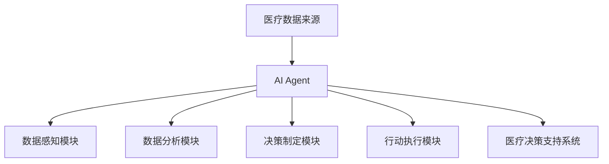

# AI Agent在智能医疗诊断中的应用

> 关键词：AI Agent、智能医疗诊断、医疗数据处理、疾病预测、辅助决策

> 摘要：本文围绕AI Agent在智能医疗诊断中的应用展开，深入探讨了AI Agent的核心概念、算法原理、数学模型等内容。通过详细的项目实战案例，展示了AI Agent在实际医疗诊断中的应用流程和效果。同时，分析了AI Agent在不同医疗场景中的应用情况，推荐了相关的学习资源、开发工具和论文著作。最后，对AI Agent在智能医疗诊断领域的未来发展趋势与挑战进行了总结，并提供了常见问题的解答和扩展阅读参考资料，旨在为该领域的研究和实践提供全面而深入的指导。

## 1. 背景介绍 
### 1.1 目的和范围
随着医疗数据的爆炸式增长和人工智能技术的飞速发展，如何利用先进的技术手段提高医疗诊断的准确性和效率成为了医疗领域的重要研究课题。AI Agent作为一种具有自主决策和交互能力的智能实体，在智能医疗诊断中展现出了巨大的潜力。本文的目的在于全面介绍AI Agent在智能医疗诊断中的应用，涵盖从核心概念到实际应用的各个方面，包括其原理、算法、模型以及具体的开发和实践过程。范围涉及医疗数据的处理、疾病的预测和诊断、辅助医生进行决策等多个智能医疗诊断的关键环节。

### 1.2 预期读者
本文预期读者包括医疗领域的专业人员，如医生、医学研究人员等，他们可以通过本文了解AI Agent如何辅助医疗诊断，为临床实践提供新的思路和方法；计算机科学和人工智能领域的研究者和开发者，他们可以从技术层面深入学习AI Agent在医疗场景中的应用原理和实现细节；以及对智能医疗感兴趣的普通读者，帮助他们了解这一前沿技术的发展和应用情况。

### 1.3 文档结构概述
本文将按照以下结构进行组织：首先介绍AI Agent和智能医疗诊断的核心概念以及它们之间的联系，并通过文本示意图和Mermaid流程图进行直观展示；接着详细阐述AI Agent在智能医疗诊断中所涉及的核心算法原理和具体操作步骤，同时使用Python源代码进行说明；然后介绍相关的数学模型和公式，并结合具体例子进行讲解；通过项目实战，展示AI Agent在智能医疗诊断中的代码实现和详细解读；分析AI Agent在不同实际医疗场景中的应用；推荐相关的学习资源、开发工具和论文著作；最后总结AI Agent在智能医疗诊断领域的未来发展趋势与挑战，提供常见问题的解答和扩展阅读参考资料。

### 1.4 术语表
#### 1.4.1 核心术语定义
- **AI Agent（人工智能代理）**：是一种能够感知环境、自主决策并采取行动以实现特定目标的智能实体。在智能医疗诊断中，它可以感知医疗数据，根据内置的算法和模型进行分析和判断，为医疗决策提供支持。
- **智能医疗诊断**：利用人工智能技术，对医疗数据进行分析和处理，辅助医生进行疾病的诊断、预测和治疗方案的制定。
- **医疗数据**：包括患者的病历、检查报告、影像资料等各种与医疗相关的数据。

#### 1.4.2 相关概念解释
- **机器学习**：是AI Agent实现智能决策的重要技术手段之一，通过对大量医疗数据的学习，建立模型来预测疾病的发生和发展。
- **深度学习**：一种特殊的机器学习方法，通过构建深层神经网络，自动从数据中提取特征，在图像识别、语音识别等领域取得了显著的成果，在医疗影像诊断中也有广泛的应用。
- **知识图谱**：将医疗领域的知识以图的形式表示，包含实体和实体之间的关系，为AI Agent提供结构化的知识，辅助其进行推理和决策。

#### 1.4.3 缩略词列表
- **ML（Machine Learning）**：机器学习
- **DL（Deep Learning）**：深度学习
- **KG（Knowledge Graph）**：知识图谱

## 2. 核心概念与联系 
### 核心概念原理
AI Agent在智能医疗诊断中的核心原理是基于其感知、决策和行动的能力。它通过各种传感器和接口获取医疗数据，如电子病历系统、医疗设备等。然后，利用机器学习、深度学习等算法对这些数据进行分析和处理，提取有价值的信息和特征。根据这些信息，AI Agent可以进行疾病的预测、诊断和治疗方案的推荐等决策。最后，将决策结果反馈给医生或其他医疗系统，辅助他们进行医疗决策。

### 架构的文本示意图
```plaintext
          +---------------------+
          |  医疗数据来源       |
          | （电子病历、影像等） |
          +---------------------+
                   |
                   v
          +---------------------+
          |  AI Agent           |
          | - 数据感知模块      |
          | - 数据分析模块      |
          | - 决策制定模块      |
          | - 行动执行模块      |
          +---------------------+
                   |
                   v
          +---------------------+
          |  医疗决策支持系统  |
          | （医生、治疗方案）  |
          +---------------------+
```

### Mermaid流程图


## 3. 核心算法原理 & 具体操作步骤 
### 核心算法原理
在智能医疗诊断中，常用的算法包括决策树、支持向量机、神经网络等。这里以决策树算法为例进行详细阐述。决策树是一种基于树结构进行决策的算法，每个内部节点表示一个属性上的测试，每个分支表示一个测试输出，每个叶节点表示一种类别或值。在医疗诊断中，决策树可以根据患者的症状、检查结果等属性进行分类，判断患者是否患有某种疾病。

### Python源代码实现
```python
import numpy as np
from sklearn.datasets import load_breast_cancer
from sklearn.model_selection import train_test_split
from sklearn.tree import DecisionTreeClassifier
from sklearn.metrics import accuracy_score

# 加载乳腺癌数据集
data = load_breast_cancer()
X = data.data
y = data.target

# 划分训练集和测试集
X_train, X_test, y_train, y_test = train_test_split(X, y, test_size=0.2, random_state=42)

# 创建决策树分类器
clf = DecisionTreeClassifier()

# 训练模型
clf.fit(X_train, y_train)

# 预测
y_pred = clf.predict(X_test)

# 计算准确率
accuracy = accuracy_score(y_test, y_pred)
print(f"决策树模型的准确率: {accuracy}")
```

### 具体操作步骤
1. **数据准备**：收集和整理医疗数据，包括患者的基本信息、症状、检查结果等。对数据进行预处理，如缺失值处理、数据归一化等。
2. **特征选择**：从原始数据中选择对疾病诊断有重要影响的特征，减少数据维度，提高模型的效率和准确性。
3. **模型训练**：选择合适的算法，如决策树、支持向量机等，使用训练数据对模型进行训练。
4. **模型评估**：使用测试数据对训练好的模型进行评估，计算准确率、召回率、F1值等指标，评估模型的性能。
5. **模型优化**：根据评估结果，对模型进行优化，如调整模型参数、更换算法等。
6. **部署应用**：将优化后的模型部署到实际医疗系统中，为医生提供诊断支持。

## 4. 数学模型和公式 & 详细讲解 & 举例说明 
### 决策树的数学模型和公式
决策树的构建过程主要基于信息增益的概念。信息增益是指在划分数据集前后信息熵的变化量，信息熵是衡量数据集中不确定性的指标。信息熵的计算公式为：
$$H(D)=-\sum_{i=1}^{n}p_i\log_2p_i$$
其中，$D$ 表示数据集，$p_i$ 表示数据集中第 $i$ 类样本的概率，$n$ 表示类别数。

信息增益的计算公式为：
$$IG(D,A)=H(D)-H(D|A)$$
其中，$IG(D,A)$ 表示数据集 $D$ 在属性 $A$ 上的信息增益，$H(D)$ 表示数据集 $D$ 的信息熵，$H(D|A)$ 表示数据集 $D$ 在属性 $A$ 给定条件下的条件熵。

### 详细讲解
在决策树的构建过程中，每次选择信息增益最大的属性作为划分节点，将数据集划分为多个子集，直到满足停止条件。停止条件可以是子集的样本数小于某个阈值，或者子集的纯度达到一定程度。

### 举例说明
假设有一个简单的医疗数据集，包含患者的症状（发热、咳嗽）和是否患有疾病（是、否）两个属性。数据集如下：
| 发热 | 咳嗽 | 疾病 |
|------|------|------|
| 是   | 是   | 是   |
| 是   | 否   | 是   |
| 否   | 是   | 否   |
| 否   | 否   | 否   |

首先计算数据集的信息熵：
$p_1 = \frac{2}{4} = 0.5$，$p_2 = \frac{2}{4} = 0.5$
$H(D)=-0.5\log_20.5 - 0.5\log_20.5 = 1$

然后分别计算在“发热”和“咳嗽”属性上的信息增益：
- **“发热”属性**：
  - 发热为“是”的子集：$p_1 = \frac{2}{2} = 1$，$p_2 = \frac{0}{2} = 0$，$H(D_1)=-1\log_21 - 0\log_20 = 0$
  - 发热为“否”的子集：$p_1 = \frac{0}{2} = 0$，$p_2 = \frac{2}{2} = 1$，$H(D_2)=-0\log_20 - 1\log_21 = 0$
  - $H(D|发热)=\frac{2}{4} \times 0 + \frac{2}{4} \times 0 = 0$
  - $IG(D,发热)=1 - 0 = 1$
- **“咳嗽”属性**：
  - 咳嗽为“是”的子集：$p_1 = \frac{1}{2} = 0.5$，$p_2 = \frac{1}{2} = 0.5$，$H(D_1)=-0.5\log_20.5 - 0.5\log_20.5 = 1$
  - 咳嗽为“否”的子集：$p_1 = \frac{1}{2} = 0.5$，$p_2 = \frac{1}{2} = 0.5$，$H(D_2)=-0.5\log_20.5 - 0.5\log_20.5 = 1$
  - $H(D|咳嗽)=\frac{2}{4} \times 1 + \frac{2}{4} \times 1 = 1$
  - $IG(D,咳嗽)=1 - 1 = 0$

由于“发热”属性的信息增益最大，所以选择“发热”作为根节点进行划分。

## 5. 项目实战：代码实际案例和详细解释说明 
### 5.1  开发环境搭建
#### 安装Python
首先需要安装Python，建议使用Python 3.7及以上版本。可以从Python官方网站（https://www.python.org/downloads/）下载适合自己操作系统的安装包进行安装。

#### 安装必要的库
使用pip命令安装必要的库，如NumPy、Pandas、Scikit-learn等。
```bash
pip install numpy pandas scikit-learn
```

### 5.2  源代码详细实现和代码解读
```python
import pandas as pd
from sklearn.model_selection import train_test_split
from sklearn.ensemble import RandomForestClassifier
from sklearn.metrics import classification_report

# 加载数据集
data = pd.read_csv('medical_data.csv')

# 分离特征和标签
X = data.drop('disease', axis=1)
y = data['disease']

# 划分训练集和测试集
X_train, X_test, y_train, y_test = train_test_split(X, y, test_size=0.2, random_state=42)

# 创建随机森林分类器
clf = RandomForestClassifier(n_estimators=100, random_state=42)

# 训练模型
clf.fit(X_train, y_train)

# 预测
y_pred = clf.predict(X_test)

# 评估模型
report = classification_report(y_test, y_pred)
print(report)
```
### 代码解读与分析
1. **数据加载**：使用Pandas库的`read_csv`函数加载医疗数据集。
2. **特征和标签分离**：使用`drop`方法将目标标签“disease”从数据集中分离出来，得到特征矩阵`X`和标签向量`y`。
3. **数据集划分**：使用`train_test_split`函数将数据集划分为训练集和测试集，测试集占比为20%。
4. **模型创建**：创建一个随机森林分类器，设置树的数量为100。
5. **模型训练**：使用训练集对随机森林分类器进行训练。
6. **模型预测**：使用训练好的模型对测试集进行预测，得到预测结果`y_pred`。
7. **模型评估**：使用`classification_report`函数生成分类报告，包括准确率、召回率、F1值等指标。

## 6. 实际应用场景 
### 疾病预测
AI Agent可以根据患者的历史病历、基因数据、生活习惯等信息，预测患者患某种疾病的概率。例如，通过分析患者的家族遗传史、血压、血糖等指标，预测患者患心血管疾病的风险。

### 影像诊断
在医学影像诊断中，AI Agent可以辅助医生快速准确地识别病变部位。例如，对X光、CT、MRI等影像进行分析，检测肿瘤、骨折等病变。

### 辅助决策
AI Agent可以为医生提供治疗方案的推荐和建议。根据患者的病情、身体状况等因素，结合医学知识和临床指南，为医生提供最佳的治疗方案。

### 药物研发
在药物研发过程中，AI Agent可以帮助筛选药物靶点、预测药物疗效和副作用。通过对大量的生物数据进行分析，加速药物研发的进程。

## 7. 工具和资源推荐
### 7.1 学习资源推荐
#### 7.1.1 书籍推荐
- 《Python机器学习》：全面介绍了Python在机器学习领域的应用，包括各种算法的原理和实现。
- 《深度学习》：深度学习领域的经典著作，详细介绍了深度学习的理论和实践。
- 《医疗人工智能》：专门介绍了人工智能在医疗领域的应用，包括智能诊断、医疗机器人等方面的内容。

#### 7.1.2 在线课程
- Coursera上的“机器学习”课程：由斯坦福大学的Andrew Ng教授授课，是机器学习领域的经典课程。
- edX上的“深度学习”课程：深入介绍了深度学习的原理和应用。
- 中国大学MOOC上的“医疗大数据与人工智能”课程：结合医疗领域的实际案例，介绍了人工智能在医疗中的应用。

#### 7.1.3 技术博客和网站
- Towards Data Science：提供了大量关于数据科学和人工智能的文章和教程。
- Medium上的人工智能相关博客：有很多专业人士分享的最新研究成果和实践经验。
- 医疗人工智能网：专注于医疗人工智能领域的资讯和技术分享。

### 7.2 开发工具框架推荐
#### 7.2.1 IDE和编辑器
- PyCharm：功能强大的Python集成开发环境，提供了代码编辑、调试、版本控制等功能。
- Jupyter Notebook：交互式的开发环境，适合进行数据分析和模型实验。
- Visual Studio Code：轻量级的代码编辑器，支持多种编程语言和插件扩展。

#### 7.2.2 调试和性能分析工具
- PDB：Python自带的调试工具，可以帮助开发者定位代码中的错误。
- TensorBoard：TensorFlow的可视化工具，可以用于监控模型的训练过程和性能分析。
- Scikit-learn的交叉验证工具：可以帮助开发者评估模型的性能和选择最佳的模型参数。

#### 7.2.3 相关框架和库
- TensorFlow：开源的深度学习框架，提供了丰富的工具和模型库。
- PyTorch：另一个流行的深度学习框架，具有动态图的优势，适合快速开发和实验。
- Scikit-learn：机器学习库，提供了各种机器学习算法的实现和工具。

### 7.3 相关论文著作推荐
#### 7.3.1 经典论文
- “ImageNet Classification with Deep Convolutional Neural Networks”：介绍了卷积神经网络在图像分类中的应用，开启了深度学习在计算机视觉领域的热潮。
- “Long Short-Term Memory”：提出了长短期记忆网络（LSTM），解决了循环神经网络中的梯度消失问题。
- “Deep Learning in Medical Imaging: Overview and Future Promise of an Exciting New Technique”：综述了深度学习在医学影像领域的应用和发展前景。

#### 7.3.2 最新研究成果
- 关注顶级学术会议如NeurIPS、ICML、CVPR等上发表的关于医疗人工智能的论文，了解最新的研究进展。
- 阅读《Nature Medicine》、《JAMA》等医学领域顶级期刊上关于人工智能应用的研究成果。

#### 7.3.3 应用案例分析
- 可以参考一些知名医疗企业或研究机构发布的AI Agent在医疗诊断中的应用案例，了解实际应用中的挑战和解决方案。

## 8. 总结：未来发展趋势与挑战
### 未来发展趋势
- **多模态数据融合**：未来的AI Agent将能够融合更多类型的医疗数据，如文本、图像、视频等，提供更全面的诊断信息。
- **个性化医疗**：根据患者的个体差异，如基因信息、生活习惯等，提供个性化的诊断和治疗方案。
- **与物联网的结合**：通过与医疗物联网设备的结合，实时获取患者的生理数据，实现远程医疗和健康监测。
- **强化学习的应用**：利用强化学习算法，让AI Agent在不断的交互和实践中学习，提高诊断和决策的能力。

### 挑战
- **数据隐私和安全**：医疗数据包含大量的个人隐私信息，如何保证数据的安全和隐私是一个重要的挑战。
- **模型可解释性**：深度学习模型通常是黑盒模型，难以解释其决策过程和结果，这在医疗领域可能会影响医生的信任和应用。
- **法律法规和伦理问题**：AI Agent在医疗诊断中的应用涉及到法律法规和伦理问题，如责任认定、医疗事故等。
- **数据质量和标注**：高质量的医疗数据是训练有效模型的基础，但医疗数据往往存在质量参差不齐、标注困难等问题。

## 9. 附录：常见问题与解答
### 问题1：AI Agent在医疗诊断中的准确性如何保证？
解答：可以通过以下方法保证准确性：使用大量高质量的医疗数据进行训练；选择合适的算法和模型，并进行优化和调参；进行严格的模型评估和验证；结合医生的专业知识和经验。

### 问题2：AI Agent能否完全替代医生进行诊断？
解答：目前还不能。虽然AI Agent在某些方面可以提供辅助诊断和决策支持，但医生的临床经验、判断力和人文关怀是不可替代的。AI Agent和医生应该相互协作，共同提高医疗诊断的质量。

### 问题3：如何解决AI Agent在医疗诊断中的数据隐私问题？
解答：可以采用数据加密、匿名化处理、访问控制等技术手段保护数据隐私；建立严格的法律法规和管理制度，规范数据的使用和共享。

## 10. 扩展阅读 & 参考资料
### 扩展阅读
- 《人工智能简史》：了解人工智能的发展历程和重要里程碑。
- 《数据驱动的医疗决策》：深入探讨数据在医疗决策中的应用和价值。

### 参考资料
- 相关学术论文和研究报告。
- 医疗行业的标准和规范。
- 各大开源项目的官方文档。

作者：AI天才研究院/AI Genius Institute & 禅与计算机程序设计艺术 /Zen And The Art of Computer Programming