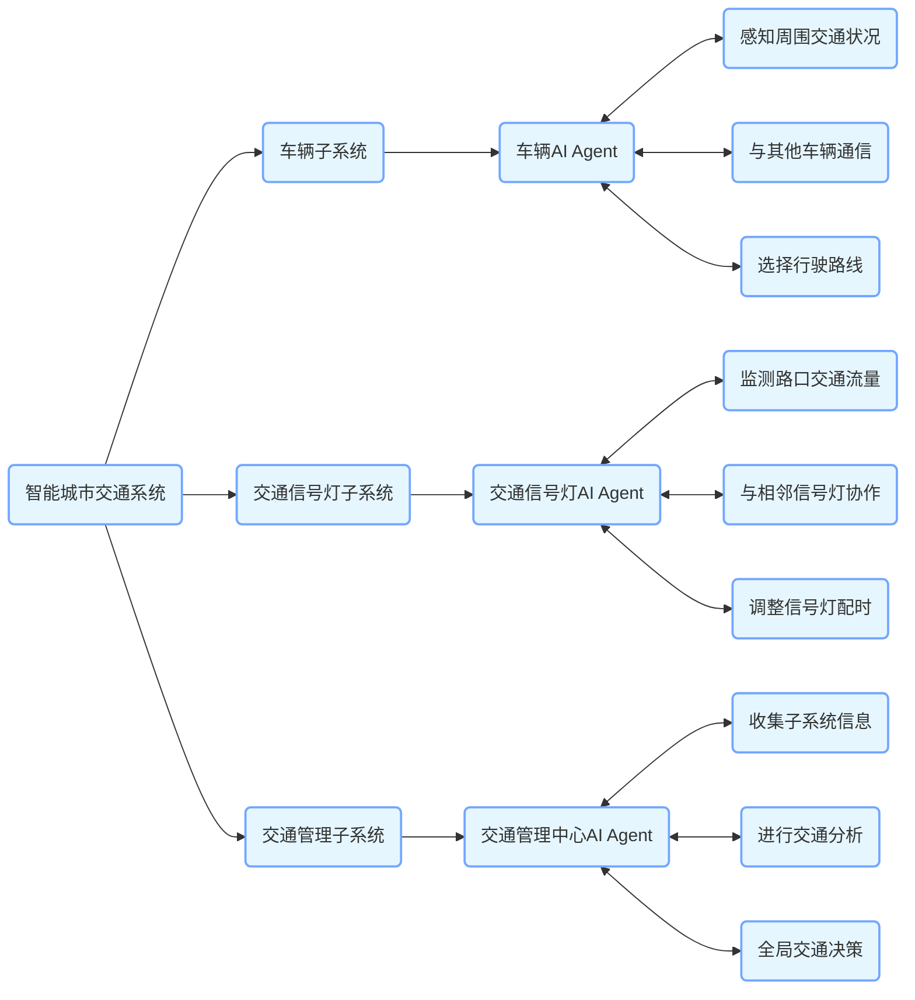

# AI Agent在智能城市交通优化中的应用

> 关键词：AI Agent、智能城市交通、交通优化、多智能体系统、强化学习

> 摘要：本文深入探讨了AI Agent在智能城市交通优化中的应用。首先介绍了相关背景知识，包括研究目的、预期读者、文档结构和术语表。接着阐述了AI Agent和智能城市交通的核心概念及它们之间的联系，并给出了相应的文本示意图和Mermaid流程图。详细讲解了核心算法原理和具体操作步骤，结合Python源代码进行说明。同时，介绍了相关的数学模型和公式，并举例说明。通过项目实战，展示了代码的实际案例和详细解释。分析了AI Agent在智能城市交通中的实际应用场景，推荐了学习资源、开发工具框架和相关论文著作。最后总结了未来发展趋势与挑战，还给出了常见问题与解答以及扩展阅读和参考资料。旨在为研究和应用AI Agent进行城市交通优化提供全面的技术指导。

## 1. 背景介绍 
### 1.1 目的和范围
随着城市化进程的加速，城市交通问题日益严重，如交通拥堵、交通事故频发、环境污染等。智能城市交通优化旨在通过先进的技术手段，提高交通系统的效率、安全性和可持续性。AI Agent作为一种具有自主决策和学习能力的智能实体，为解决城市交通问题提供了新的思路和方法。本文的目的是深入研究AI Agent在智能城市交通优化中的应用，探讨其核心概念、算法原理、实际应用场景等，为相关研究和实践提供理论支持和技术指导。范围涵盖了AI Agent的基本原理、与智能城市交通的结合方式、具体的算法实现以及在不同交通场景中的应用案例。

### 1.2 预期读者
本文预期读者包括计算机科学、交通工程、人工智能等领域的研究人员、学生和从业者。对于对智能城市交通优化和AI Agent技术感兴趣的人士，本文也提供了一个全面的学习和参考资料。研究人员可以从本文中获取新的研究思路和方法，学生可以学习到相关的理论知识和实践技能，从业者可以借鉴实际应用案例，提升自己的工作能力。

### 1.3 文档结构概述
本文共分为十个部分。第一部分为背景介绍，包括目的和范围、预期读者、文档结构概述和术语表。第二部分阐述核心概念与联系，介绍AI Agent和智能城市交通的基本概念以及它们之间的关系，并给出相应的示意图和流程图。第三部分讲解核心算法原理和具体操作步骤，结合Python源代码进行详细说明。第四部分介绍数学模型和公式，并举例说明其在交通优化中的应用。第五部分通过项目实战，展示代码的实际案例和详细解释。第六部分分析AI Agent在智能城市交通中的实际应用场景。第七部分推荐学习资源、开发工具框架和相关论文著作。第八部分总结未来发展趋势与挑战。第九部分给出常见问题与解答。第十部分提供扩展阅读和参考资料。

### 1.4 术语表
#### 1.4.1 核心术语定义
- **AI Agent（人工智能智能体）**：是一种能够感知环境、做出决策并采取行动以实现特定目标的智能实体。它可以是软件程序、机器人等，具有自主学习和适应环境变化的能力。
- **智能城市交通**：是指利用先进的信息技术、通信技术、控制技术等，对城市交通系统进行全面、实时的监测、管理和优化，以提高交通效率、安全性和可持续性。
- **多智能体系统（Multi-Agent System，MAS）**：由多个AI Agent组成的系统，这些Agent之间可以进行通信、协作和竞争，共同完成复杂的任务。
- **强化学习（Reinforcement Learning，RL）**：是一种机器学习方法，Agent通过与环境进行交互，根据环境反馈的奖励信号来学习最优的行为策略。

#### 1.4.2 相关概念解释
- **交通流量**：指在单位时间内通过道路某一断面的车辆数或行人数。
- **交通拥堵**：指交通流量超过道路的通行能力，导致车辆行驶速度缓慢、延误增加的现象。
- **信号控制**：指通过交通信号灯对车辆和行人的通行进行控制，以提高交通效率和安全性。

#### 1.4.3 缩略词列表
- **AI**：Artificial Intelligence，人工智能
- **MAS**：Multi-Agent System，多智能体系统
- **RL**：Reinforcement Learning，强化学习
- **ITS**：Intelligent Transportation System，智能交通系统

## 2. 核心概念与联系 
### 2.1 AI Agent的基本概念
AI Agent是人工智能领域中的一个重要概念，它可以被看作是一个具有自主性、反应性、社会性和适应性的实体。自主性意味着Agent能够独立地感知环境、做出决策并采取行动；反应性表示Agent能够对环境的变化做出及时的响应；社会性指Agent可以与其他Agent进行通信和协作；适应性则是指Agent能够通过学习和经验积累，不断优化自己的行为策略以适应环境的变化。

AI Agent通常由三个主要部分组成：感知模块、决策模块和行动模块。感知模块用于收集环境信息，决策模块根据感知到的信息和自身的目标，选择合适的行动，行动模块则负责执行决策模块所选择的行动。

### 2.2 智能城市交通的特点和需求
智能城市交通系统具有复杂性、动态性和不确定性等特点。复杂性体现在交通系统包含众多的元素，如道路、车辆、行人、交通设施等，这些元素之间相互作用、相互影响。动态性是指交通流量、交通状况等会随着时间和地点的变化而发生改变。不确定性则源于交通系统中存在许多随机因素，如交通事故、天气变化等。

智能城市交通的需求主要包括提高交通效率、减少交通拥堵、增强交通安全、降低环境污染等。为了满足这些需求，需要对交通系统进行实时监测、精准预测和有效控制。

### 2.3 AI Agent与智能城市交通的联系
AI Agent可以在智能城市交通中发挥重要作用。通过将AI Agent应用于交通系统中的各个元素，如车辆、交通信号灯、交通管理中心等，可以实现交通系统的智能化和自动化。例如，每辆车辆可以被看作一个AI Agent，它能够感知周围的交通状况，根据路况和目的地选择最优的行驶路线；交通信号灯也可以作为AI Agent，根据实时交通流量动态调整信号灯的配时，以提高路口的通行效率。

多个AI Agent可以组成多智能体系统（MAS），在智能城市交通中，MAS可以实现车辆之间的协作、交通信号灯之间的协调以及车辆与交通管理中心之间的交互。通过强化学习等方法，AI Agent可以不断学习和优化自己的行为策略，以适应交通系统的动态变化，从而实现智能城市交通的优化。

### 2.4 文本示意图
以下是AI Agent在智能城市交通中的应用的文本示意图：

智能城市交通系统包含多个子系统，如车辆子系统、交通信号灯子系统、交通管理子系统等。每个子系统中都可以部署AI Agent。车辆AI Agent通过传感器感知周围的交通状况，包括其他车辆的位置、速度、行驶方向等，同时与其他车辆AI Agent和交通管理中心进行通信，根据这些信息选择最优的行驶路线。交通信号灯AI Agent实时监测路口的交通流量，与相邻的交通信号灯AI Agent进行协作，动态调整信号灯的配时。交通管理中心AI Agent收集各个子系统的信息，进行全局的交通分析和决策，对整个交通系统进行宏观调控。

### 2.5 Mermaid流程图


## 3. 核心算法原理 & 具体操作步骤 
### 3.1 强化学习算法原理
强化学习是AI Agent在智能城市交通优化中常用的算法之一。在强化学习中，Agent与环境进行交互，通过执行一系列的动作来改变环境状态，并从环境中获得奖励信号。Agent的目标是通过学习，找到一种最优的行为策略，使得在长期运行中获得的累积奖励最大。

强化学习的基本要素包括：
- **状态（State）**：表示环境在某一时刻的特征，例如在交通系统中，状态可以是车辆的位置、速度、交通信号灯的状态等。
- **动作（Action）**：Agent可以执行的操作，如车辆的加速、减速、转弯，交通信号灯的切换等。
- **奖励（Reward）**：环境对Agent执行动作后的反馈，用于评价动作的好坏。例如，在交通优化中，如果车辆能够快速到达目的地，或者交通信号灯的配时能够减少车辆的延误，就可以给予正奖励；反之，则给予负奖励。
- **策略（Policy）**：Agent根据当前状态选择动作的规则，通常用 $\pi(s)$ 表示，其中 $s$ 是状态。

强化学习的目标是找到最优策略 $\pi^*$，使得累积奖励的期望值最大。常用的强化学习算法有Q - learning、Deep Q - Network（DQN）等。

### 3.2 Q - learning算法原理
Q - learning是一种无模型的强化学习算法，它通过学习一个Q值函数 $Q(s, a)$ 来找到最优策略。Q值函数表示在状态 $s$ 下执行动作 $a$ 后，能够获得的长期累积奖励的期望值。

Q - learning的更新公式为：
$$Q(s_t, a_t) \leftarrow Q(s_t, a_t) + \alpha [r_{t+1} + \gamma \max_{a} Q(s_{t+1}, a) - Q(s_t, a_t)]$$
其中：
- $s_t$ 是当前状态
- $a_t$ 是当前执行的动作
- $r_{t+1}$ 是执行动作 $a_t$ 后获得的即时奖励
- $s_{t+1}$ 是执行动作 $a_t$ 后转移到的下一个状态
- $\alpha$ 是学习率，控制每次更新的步长
- $\gamma$ 是折扣因子，用于衡量未来奖励的重要性

### 3.3 基于Q - learning的AI Agent实现步骤
#### 3.3.1 初始化
- 初始化Q值表 $Q(s, a)$，可以将所有的Q值初始化为0。
- 设定学习率 $\alpha$、折扣因子 $\gamma$ 和探索率 $\epsilon$。探索率用于控制Agent在学习过程中是进行探索（随机选择动作）还是利用（选择Q值最大的动作）。

#### 3.3.2 交互循环
- 重复以下步骤直到达到终止条件：
    1. 观察当前状态 $s_t$。
    2. 根据探索率 $\epsilon$ 选择动作：
        - 以概率 $\epsilon$ 随机选择一个动作 $a_t$。
        - 以概率 $1 - \epsilon$ 选择Q值最大的动作，即 $a_t = \arg\max_{a} Q(s_t, a)$。
    3. 执行动作 $a_t$，观察环境反馈的即时奖励 $r_{t+1}$ 和下一个状态 $s_{t+1}$。
    4. 根据Q - learning更新公式更新Q值表：
        $$Q(s_t, a_t) \leftarrow Q(s_t, a_t) + \alpha [r_{t+1} + \gamma \max_{a} Q(s_{t+1}, a) - Q(s_t, a_t)]$$
    5. 更新当前状态 $s_t = s_{t+1}$。

#### 3.3.3 策略提取
当学习过程结束后，根据最终的Q值表提取最优策略：对于每个状态 $s$，选择Q值最大的动作作为该状态下的最优动作，即 $\pi^*(s) = \arg\max_{a} Q(s, a)$。

### 3.4 Python源代码实现
```python
import numpy as np

class QLearningAgent:
    def __init__(self, state_space_size, action_space_size, learning_rate=0.1, discount_factor=0.9, exploration_rate=0.1):
        self.state_space_size = state_space_size
        self.action_space_size = action_space_size
        self.learning_rate = learning_rate
        self.discount_factor = discount_factor
        self.exploration_rate = exploration_rate
        # 初始化Q值表
        self.q_table = np.zeros((state_space_size, action_space_size))

    def choose_action(self, state):
        if np.random.uniform(0, 1) < self.exploration_rate:
            # 探索：随机选择动作
            action = np.random.choice(self.action_space_size)
        else:
            # 利用：选择Q值最大的动作
            action = np.argmax(self.q_table[state, :])
        return action

    def update_q_table(self, state, action, reward, next_state):
        # Q - learning更新公式
        max_q_next = np.max(self.q_table[next_state, :])
        self.q_table[state, action] += self.learning_rate * (reward + self.discount_factor * max_q_next - self.q_table[state, action])

# 示例使用
state_space_size = 10
action_space_size = 4
agent = QLearningAgent(state_space_size, action_space_size)

# 模拟交互循环
num_episodes = 100
for episode in range(num_episodes):
    state = np.random.randint(0, state_space_size)
    done = False
    while not done:
        action = agent.choose_action(state)
        # 模拟环境反馈
        next_state = np.random.randint(0, state_space_size)
        reward = np.random.randint(-1, 2)
        agent.update_q_table(state, action, reward, next_state)
        state = next_state
        # 模拟终止条件
        if np.random.rand() < 0.1:
            done = True

# 提取最优策略
optimal_policy = np.argmax(agent.q_table, axis=1)
print("Optimal policy:", optimal_policy)
```

## 4. 数学模型和公式 & 详细讲解 & 举例说明 
### 4.1 交通流量模型
#### 4.1.1 基本公式
交通流量 $q$、速度 $v$ 和密度 $k$ 之间存在着密切的关系，常用的基本公式为：
$$q = k \cdot v$$
其中，$q$ 表示单位时间内通过道路某一断面的车辆数（辆/小时），$k$ 表示道路上单位长度内的车辆数（辆/公里），$v$ 表示车辆的平均行驶速度（公里/小时）。

#### 4.1.2 举例说明
假设一条道路的长度为 1 公里，道路上共有 50 辆车，车辆的平均行驶速度为 60 公里/小时。根据上述公式，可以计算出该道路的交通流量为：
$$q = k \cdot v = 50 \text{ 辆/公里} \times 60 \text{ 公里/小时} = 3000 \text{ 辆/小时}$$

### 4.2 交通延误模型
#### 4.2.1 韦伯斯特延误公式
韦伯斯特延误公式是一种常用的计算车辆在信号控制交叉口延误的公式，其表达式为：
$$d = \frac{C(1 - \lambda)^2}{2(1 - \lambda x)} + \frac{x^2}{2q(1 - x)} - 0.65 \left(\frac{C}{q^2}\right)^{\frac{1}{3}} x^{2 + 5\beta}$$
其中：
- $d$ 是每辆车的平均延误时间（秒）
- $C$ 是信号周期时长（秒）
- $\lambda$ 是绿信比，即绿灯时间与周期时长的比值
- $x$ 是饱和度，即实际交通流量与饱和交通流量的比值
- $q$ 是到达流量（辆/秒）
- $\beta$ 是一个经验系数，通常取值为 0.5

#### 4.2.2 举例说明
假设一个信号控制交叉口的信号周期时长 $C = 120$ 秒，绿信比 $\lambda = 0.5$，饱和度 $x = 0.8$，到达流量 $q = 0.5$ 辆/秒，经验系数 $\beta = 0.5$。将这些值代入韦伯斯特延误公式中：
首先计算 $\frac{C(1 - \lambda)^2}{2(1 - \lambda x)}$：
$$\frac{120\times(1 - 0.5)^2}{2\times(1 - 0.5\times0.8)}=\frac{120\times0.25}{2\times0.6}=25$$
然后计算 $\frac{x^2}{2q(1 - x)}$：
$$\frac{0.8^2}{2\times0.5\times(1 - 0.8)}=\frac{0.64}{0.2}=3.2$$
最后计算 $0.65 \left(\frac{C}{q^2}\right)^{\frac{1}{3}} x^{2 + 5\beta}$：
$$0.65\times\left(\frac{120}{0.5^2}\right)^{\frac{1}{3}}\times0.8^{2 + 5\times0.5}\approx0.65\times7.83\times0.328\approx1.67$$
则每辆车的平均延误时间为：
$$d = 25 + 3.2 - 1.67 = 26.53 \text{ 秒}$$

### 4.3 强化学习中的价值函数和策略梯度
#### 4.3.1 价值函数
在强化学习中，价值函数用于评估状态或状态 - 动作对的好坏。状态价值函数 $V^\pi(s)$ 表示在策略 $\pi$ 下，从状态 $s$ 开始所能获得的长期累积奖励的期望值，其定义为：
$$V^\pi(s) = \mathbb{E}_\pi \left[\sum_{t = 0}^{\infty} \gamma^t r_{t+1} \mid s_0 = s\right]$$
其中，$\gamma$ 是折扣因子，$r_{t+1}$ 是在时间步 $t$ 执行动作后获得的即时奖励。

状态 - 动作价值函数 $Q^\pi(s, a)$ 表示在策略 $\pi$ 下，从状态 $s$ 执行动作 $a$ 后所能获得的长期累积奖励的期望值，其定义为：
$$Q^\pi(s, a) = \mathbb{E}_\pi \left[\sum_{t = 0}^{\infty} \gamma^t r_{t+1} \mid s_0 = s, a_0 = a\right]$$

#### 4.3.2 策略梯度
策略梯度算法通过直接优化策略 $\pi$ 来最大化累积奖励。策略通常用一个参数化的函数 $\pi_\theta(s, a)$ 表示，其中 $\theta$ 是策略的参数。策略梯度定理表明，策略梯度可以表示为：
$$\nabla_\theta J(\theta) = \mathbb{E}_\pi \left[\nabla_\theta \log \pi_\theta(s, a) Q^\pi(s, a)\right]$$
其中，$J(\theta)$ 是策略 $\pi_\theta$ 的性能指标，通常是累积奖励的期望值。

#### 4.3.3 举例说明
假设一个简单的强化学习任务，状态空间 $S = \{s_1, s_2\}$，动作空间 $A = \{a_1, a_2\}$，策略 $\pi$ 是一个随机策略，即 $\pi(s_1, a_1) = 0.6$，$\pi(s_1, a_2) = 0.4$，$\pi(s_2, a_1) = 0.3$，$\pi(s_2, a_2) = 0.7$。假设在状态 $s_1$ 执行动作 $a_1$ 后获得的即时奖励 $r = 1$，折扣因子 $\gamma = 0.9$。

首先计算状态 - 动作价值函数 $Q^\pi(s_1, a_1)$：
假设从状态 $s_1$ 执行动作 $a_1$ 后转移到状态 $s_2$，在状态 $s_2$ 执行动作 $a_2$ 后获得即时奖励 $r_2 = 2$。则：
$$Q^\pi(s_1, a_1) = r + \gamma r_2 = 1 + 0.9\times2 = 2.8$$

然后计算策略梯度 $\nabla_\theta \log \pi_\theta(s_1, a_1)$：
如果 $\pi_\theta(s_1, a_1)$ 是一个关于 $\theta$ 的函数，假设 $\pi_\theta(s_1, a_1) = \frac{e^{\theta_1}}{e^{\theta_1}+e^{\theta_2}}$，则：
$$\nabla_{\theta_1} \log \pi_{\theta}(s_1, a_1)=\frac{1}{\pi_{\theta}(s_1, a_1)}\times\frac{e^{\theta_1}(e^{\theta_1}+e^{\theta_2})-e^{\theta_1}\times e^{\theta_1}}{(e^{\theta_1}+e^{\theta_2})^2}=\frac{e^{\theta_2}}{e^{\theta_1}+e^{\theta_2}}$$
假设 $\theta_1 = 0$，$\theta_2 = 0$，则 $\pi_{\theta}(s_1, a_1) = 0.5$，$\nabla_{\theta_1} \log \pi_{\theta}(s_1, a_1) = 0.5$。

根据策略梯度定理，策略梯度 $\nabla_{\theta_1} J(\theta)$ 为：
$$\nabla_{\theta_1} J(\theta)=\nabla_{\theta_1} \log \pi_{\theta}(s_1, a_1) Q^\pi(s_1, a_1)=0.5\times2.8 = 1.4$$

## 5. 项目实战：代码实际案例和详细解释说明 
### 5.1  开发环境搭建
#### 5.1.1 安装Python
首先需要安装Python，建议使用Python 3.7及以上版本。可以从Python官方网站（https://www.python.org/downloads/）下载适合自己操作系统的安装包，按照安装向导进行安装。

#### 5.1.2 安装必要的库
在智能城市交通优化项目中，常用的库包括NumPy、Pandas、Matplotlib等。可以使用以下命令进行安装：
```bash
pip install numpy pandas matplotlib
```
如果要使用强化学习相关的库，如OpenAI Gym，可以使用以下命令安装：
```bash
pip install gym
```

### 5.2  源代码详细实现和代码解读
#### 5.2.1 项目背景
假设我们要实现一个简单的交通信号灯控制优化项目，使用Q - learning算法来动态调整交通信号灯的配时，以减少车辆的延误。

#### 5.2.2 代码实现
```python
import numpy as np
import gym
import matplotlib.pyplot as plt

# 定义交通信号灯环境类
class TrafficLightEnv(gym.Env):
    def __init__(self):
        # 状态空间：简单假设状态为交通流量的离散级别，这里假设有5个级别
        self.state_space_size = 5
        # 动作空间：信号灯的配时选择，假设有3种不同的配时方案
        self.action_space_size = 3
        # 初始化当前状态
        self.state = np.random.randint(0, self.state_space_size)

    def step(self, action):
        # 模拟环境的转移和奖励计算
        # 简单假设奖励与动作和状态有关，这里使用一个简单的函数来计算奖励
        reward = -np.abs(self.state - action)
        # 模拟状态转移，简单地将状态随机转移到另一个状态
        next_state = np.random.randint(0, self.state_space_size)
        done = False
        return next_state, reward, done, {}

    def reset(self):
        # 重置环境，将状态随机初始化
        self.state = np.random.randint(0, self.state_space_size)
        return self.state

# 定义Q - learning智能体类
class QLearningAgent:
    def __init__(self, state_space_size, action_space_size, learning_rate=0.1, discount_factor=0.9, exploration_rate=0.1):
        self.state_space_size = state_space_size
        self.action_space_size = action_space_size
        self.learning_rate = learning_rate
        self.discount_factor = discount_factor
        self.exploration_rate = exploration_rate
        # 初始化Q值表
        self.q_table = np.zeros((state_space_size, action_space_size))

    def choose_action(self, state):
        if np.random.uniform(0, 1) < self.exploration_rate:
            # 探索：随机选择动作
            action = np.random.choice(self.action_space_size)
        else:
            # 利用：选择Q值最大的动作
            action = np.argmax(self.q_table[state, :])
        return action

    def update_q_table(self, state, action, reward, next_state):
        # Q - learning更新公式
        max_q_next = np.max(self.q_table[next_state, :])
        self.q_table[state, action] += self.learning_rate * (reward + self.discount_factor * max_q_next - self.q_table[state, action])

# 主函数
if __name__ == "__main__":
    # 创建交通信号灯环境
    env = TrafficLightEnv()
    # 创建Q - learning智能体
    agent = QLearningAgent(env.state_space_size, env.action_space_size)

    num_episodes = 1000
    rewards = []

    for episode in range(num_episodes):
        state = env.reset()
        total_reward = 0
        done = False

        while not done:
            action = agent.choose_action(state)
            next_state, reward, done, _ = env.step(action)
            agent.update_q_table(state, action, reward, next_state)
            state = next_state
            total_reward += reward

        rewards.append(total_reward)

    # 绘制奖励曲线
    plt.plot(rewards)
    plt.xlabel('Episode')
    plt.ylabel('Total Reward')
    plt.title('Q - learning in Traffic Light Control')
    plt.show()
```

#### 5.2.3 代码解读
- **TrafficLightEnv类**：这是一个自定义的环境类，继承自`gym.Env`。`__init__`方法初始化环境的状态空间和动作空间，并随机初始化当前状态。`step`方法根据智能体执行的动作，模拟环境的转移和奖励计算，返回下一个状态、奖励、是否终止的标志和其他信息。`reset`方法用于重置环境，将状态随机初始化。
- **QLearningAgent类**：这是一个Q - learning智能体类。`__init__`方法初始化状态空间、动作空间、学习率、折扣因子、探索率和Q值表。`choose_action`方法根据探索率选择动作，既可以进行探索（随机选择动作），也可以进行利用（选择Q值最大的动作）。`update_q_table`方法根据Q - learning更新公式更新Q值表。
- **主函数**：创建交通信号灯环境和Q - learning智能体，进行多次训练回合。在每个回合中，重置环境，智能体根据当前状态选择动作，与环境进行交互，更新Q值表，直到回合结束。记录每个回合的总奖励，并绘制奖励曲线，用于观察智能体的学习过程。

### 5.3  代码解读与分析
#### 5.3.1 学习过程分析
通过观察奖励曲线，可以分析智能体的学习过程。在训练初期，由于智能体处于探索阶段，奖励可能会波动较大。随着训练的进行，智能体逐渐学习到最优策略，奖励会逐渐稳定并提高。

#### 5.3.2 参数调整
代码中的学习率、折扣因子和探索率等参数对智能体的学习效果有重要影响。学习率控制每次更新Q值表的步长，如果学习率过大，智能体可能会过于激进，无法收敛到最优策略；如果学习率过小，学习速度会很慢。折扣因子用于衡量未来奖励的重要性，折扣因子越大，智能体越注重长期奖励；反之，则更注重即时奖励。探索率控制智能体在学习过程中进行探索的概率，如果探索率过大，智能体可能会花费过多的时间在随机探索上；如果探索率过小，智能体可能会陷入局部最优解。

#### 5.3.3 扩展和改进
该代码只是一个简单的示例，可以进行扩展和改进。例如，可以增加状态空间和动作空间的维度，以更准确地模拟实际的交通场景；可以使用更复杂的强化学习算法，如DQN、A2C等；可以引入多智能体系统，实现交通信号灯之间的协作。

## 6. 实际应用场景 
### 6.1 交通信号灯控制
在城市交通中，交通信号灯是控制车辆和行人通行的重要设施。传统的交通信号灯控制方法通常采用固定的配时方案，无法根据实时交通流量进行动态调整。AI Agent可以实时监测路口的交通流量，通过强化学习等算法，动态调整信号灯的配时，以提高路口的通行效率，减少车辆的延误。例如，在交通高峰期，AI Agent可以增加绿灯时间，提高路口的车辆通过率；在交通低谷期，可以缩短信号灯的周期时长，减少车辆的等待时间。

### 6.2 车辆路径规划
在智能城市交通中，每辆车辆可以被看作一个AI Agent。车辆AI Agent可以感知周围的交通状况，包括其他车辆的位置、速度、行驶方向等，同时与其他车辆AI Agent和交通管理中心进行通信。根据这些信息，车辆AI Agent可以实时规划最优的行驶路线，避开拥堵路段，提高行驶效率。例如，当车辆前方出现交通事故或拥堵时，车辆AI Agent可以及时调整路线，选择其他畅通的道路行驶。

### 6.3 交通流量预测
AI Agent可以收集和分析大量的交通数据，如历史交通流量、天气信息、时间等，通过机器学习算法建立交通流量预测模型。根据预测结果，交通管理部门可以提前采取措施，如调整信号灯配时、发布交通预警等，以应对可能出现的交通拥堵。例如，在大型活动举办前，AI Agent可以预测周边道路的交通流量，提前安排交通疏导方案，确保活动期间的交通顺畅。

### 6.4 智能停车管理
在城市中，停车难是一个普遍存在的问题。AI Agent可以应用于智能停车管理系统中，实时监测停车场的车位信息，包括车位的空闲状态、位置等。车主可以通过手机APP与停车管理系统中的AI Agent进行交互，查询停车场的车位信息，提前预订车位，避免在停车场内盲目寻找车位，提高停车效率。同时，AI Agent可以根据停车场的实时车位情况，动态调整停车收费标准，引导车主合理选择停车场。

### 6.5 公交调度优化
公交调度是城市公共交通系统中的重要环节。AI Agent可以实时监测公交线路上的客流量、车辆位置等信息，通过优化算法动态调整公交车辆的调度方案。例如，在客流量较大的时间段，可以增加公交车辆的发车频率；在客流量较小的时间段，可以减少发车频率，以提高公交资源的利用效率，同时满足乘客的出行需求。

## 7. 工具和资源推荐
### 7.1 学习资源推荐
#### 7.1.1 书籍推荐
- 《人工智能：一种现代的方法》（Artificial Intelligence: A Modern Approach）：这是一本经典的人工智能教材，涵盖了AI Agent、搜索算法、机器学习、自然语言处理等多个领域的知识，对于深入理解AI Agent的基本原理和应用有很大帮助。
- 《强化学习：原理与Python实现》（Reinforcement Learning: An Introduction）：由强化学习领域的两位权威专家Richard S. Sutton和Andrew G. Barto所著，是强化学习领域的经典著作，详细介绍了强化学习的基本概念、算法和应用。
- 《智能交通系统原理与应用》：系统介绍了智能交通系统的基本原理、技术和应用，包括交通流量检测、交通信号控制、车辆导航等方面的内容，对于了解智能城市交通优化有重要的参考价值。

#### 7.1.2 在线课程
- Coursera上的“人工智能基础”（Fundamentals of Artificial Intelligence）课程：由知名高校的教授授课，全面介绍了人工智能的基本概念、算法和应用，包括AI Agent、机器学习、深度学习等内容。
- edX上的“强化学习”（Reinforcement Learning）课程：深入讲解了强化学习的理论和实践，通过实际案例和编程作业，帮助学习者掌握强化学习的算法和应用。
- Udemy上的“智能交通系统实战”（Practical Intelligent Transportation Systems）课程：结合实际项目，介绍了智能交通系统的设计、开发和应用，包括交通流量预测、交通信号控制等方面的内容。

#### 7.1.3 技术博客和网站
- Towards Data Science：这是一个专注于数据科学和人工智能的技术博客平台，上面有很多关于AI Agent、强化学习、智能交通等方面的文章，涵盖了最新的研究成果和实践经验。
- Medium上的AI板块：Medium是一个知名的在线写作平台，上面有很多人工智能领域的专家和从业者分享自己的见解和经验，对于了解AI Agent在智能城市交通优化中的应用有很大帮助。
- IEEE Xplore：这是电气和电子工程师协会（IEEE）的数字图书馆，包含了大量的学术论文和技术报告，涉及人工智能、智能交通等多个领域的最新研究成果。

### 7.2 开发工具框架推荐
#### 7.2.1 IDE和编辑器
- PyCharm：是一款专门为Python开发设计的集成开发环境（IDE），具有代码自动补全、调试、版本控制等功能，对于开发基于Python的AI Agent和智能交通系统非常方便。
- Jupyter Notebook：是一个交互式的开发环境，支持多种编程语言，如Python、R等。通过Jupyter Notebook，可以方便地进行代码编写、数据可视化和实验验证，适合进行AI Agent的算法研究和开发。
- Visual Studio Code：是一款轻量级的代码编辑器，支持多种编程语言和插件扩展。它具有丰富的代码编辑功能和调试功能，对于开发智能交通系统的前端和后端代码都非常适用。

#### 7.2.2 调试和性能分析工具
- PDB：是Python自带的调试器，可以在代码中设置断点，逐行调试代码，帮助开发者查找和解决代码中的问题。
- cProfile：是Python的性能分析工具，可以统计代码中各个函数的执行时间和调用次数，帮助开发者找出代码中的性能瓶颈。
- TensorBoard：是TensorFlow的可视化工具，可以用于可视化神经网络的训练过程、模型结构和性能指标等，对于调试和优化基于深度学习的AI Agent非常有用。

#### 7.2.3 相关框架和库
- OpenAI Gym：是一个开源的强化学习环境库，提供了多种不同的环境，如经典控制问题、Atari游戏等。通过OpenAI Gym，可以方便地进行强化学习算法的实验和验证。
- Stable Baselines：是一个基于OpenAI Gym的强化学习库，提供了多种预训练的强化学习算法，如DQN、A2C、PPO等。使用Stable Baselines，可以快速实现和测试不同的强化学习算法。
- SUMO（Simulation of Urban MObility）：是一个开源的交通仿真软件，可以用于模拟城市交通系统的运行，包括车辆的行驶、交通信号灯的控制等。通过SUMO，可以对AI Agent在智能城市交通优化中的应用进行仿真实验和评估。

### 7.3 相关论文著作推荐
#### 7.3.1 经典论文
- “Q - learning”：由Christopher J. C. H. Watkins和Peter Dayan发表，首次提出了Q - learning算法，是强化学习领域的经典论文之一。
- “Deep Q - Networks”：由Volodymyr Mnih等人发表，提出了深度Q网络（DQN）算法，将深度学习与强化学习相结合，在Atari游戏中取得了很好的效果。
- “Multi - Agent Systems: A Modern Approach to Distributed Artificial Intelligence”：全面介绍了多智能体系统的基本概念、理论和应用，对于理解AI Agent在智能城市交通优化中的协作机制有重要的参考价值。

#### 7.3.2 最新研究成果
- 在IEEE Transactions on Intelligent Transportation Systems、ACM Transactions on Intelligent Systems and Technology等期刊上发表的关于AI Agent在智能城市交通优化中的最新研究论文，涵盖了交通信号控制、车辆路径规划、交通流量预测等多个方面的研究成果。
- 每年在国际智能交通系统会议（IEEE Intelligent Transportation Systems Conference，ITSC）、国际人工智能联合会议（International Joint Conference on Artificial Intelligence，IJCAI）等学术会议上发表的相关研究论文，展示了该领域的最新研究动态和发展趋势。

#### 7.3.3 应用案例分析
- 一些实际的智能城市交通项目案例分析报告，如新加坡的智能交通系统、纽约的交通信号控制优化项目等。这些案例分析可以帮助读者了解AI Agent在实际应用中的具体实现方法和效果评估。

## 8. 总结：未来发展趋势与挑战
### 8.1 未来发展趋势
#### 8.1.1 多智能体协作与融合
未来，AI Agent在智能城市交通优化中的应用将更加注重多智能体之间的协作与融合。不仅车辆、交通信号灯等单个元素的AI Agent之间会进行更紧密的协作，不同类型的交通系统（如公交系统、地铁系统、共享单车系统等）中的AI Agent也会实现互联互通和协同工作，以实现整个城市交通系统的全局优化。

#### 8.1.2 与新兴技术的结合
AI Agent将与新兴技术如物联网（IoT）、大数据、云计算、区块链等深度结合。物联网技术可以提供更丰富、更准确的交通数据，大数据和云计算技术可以为AI Agent提供强大的计算和存储能力，区块链技术可以保障交通数据的安全和可信。通过与这些技术的结合，AI Agent可以更好地感知环境、做出决策，提高智能城市交通系统的性能和可靠性。

#### 8.1.3 智能化与自动化程度提高
随着AI技术的不断发展，AI Agent在智能城市交通中的智能化和自动化程度将不断提高。例如，自动驾驶车辆将更加普及，车辆之间可以实现更高效的协同驾驶，减少交通事故的发生；交通管理系统将实现自动化的决策和控制，无需人工干预即可应对各种复杂的交通情况。

#### 8.1.4 可持续发展导向
未来的智能城市交通优化将更加注重可持续发展。AI Agent可以通过优化交通流量、减少交通拥堵、提高能源利用效率等方式，降低城市交通对环境的影响，促进城市交通的绿色发展。例如，AI Agent可以引导车辆选择更节能的行驶路线，优化公共交通的调度方案，鼓励市民采用绿色出行方式。

### 8.2 挑战
#### 8.2.1 数据质量和安全问题
AI Agent的决策和学习依赖于大量的交通数据，数据的质量和安全直接影响到AI Agent的性能和可靠性。在实际应用中，交通数据可能存在噪声、缺失值等问题，需要进行有效的数据预处理和清洗。同时，交通数据涉及到个人隐私和城市安全，需要采取严格的安全措施来保障数据的安全和隐私。

#### 8.2.2 算法复杂度和计算资源需求
随着智能城市交通系统的复杂性不断增加，AI Agent所采用的算法也越来越复杂，对计算资源的需求也越来越高。在实际应用中，可能会面临计算资源不足的问题，需要研究高效的算法和优化技术，以降低算法的复杂度和计算资源的需求。

#### 8.2.3 社会接受度和法律法规问题
AI Agent在智能城市交通中的应用涉及到社会伦理、道德和法律法规等多个方面的问题。例如，自动驾驶车辆在发生交通事故时的责任认定问题，AI Agent的决策是否符合人类的价值观和道德标准等。需要加强社会宣传和教育，提高公众对AI Agent的认知和接受度，同时完善相关的法律法规，为AI Agent的应用提供法律保障。

#### 8.2.4 系统的鲁棒性和可靠性
智能城市交通系统是一个复杂的动态系统，受到多种因素的影响，如天气变化、交通事故、设备故障等。AI Agent需要具备良好的鲁棒性和可靠性，能够在各种复杂的环境下正常工作。需要研究鲁棒的算法和容错机制，提高系统的抗干扰能力和可靠性。

## 9. 附录：常见问题与解答
### 9.1 什么是AI Agent？
AI Agent是一种能够感知环境、做出决策并采取行动以实现特定目标的智能实体。它可以是软件程序、机器人等，具有自主学习和适应环境变化的能力。

### 9.2 AI Agent在智能城市交通优化中有哪些优势？
AI Agent在智能城市交通优化中具有以下优势：
- 自主性：能够独立地感知环境、做出决策并采取行动，无需人工干预。
- 适应性：可以通过学习和经验积累，不断优化自己的行为策略，以适应交通系统的动态变化。
- 协作性：多个AI Agent可以组成多智能体系统，实现车辆之间的协作、交通信号灯之间的协调以及车辆与交通管理中心之间的交互。
- 实时性：能够实时监测交通状况，及时做出决策和调整，提高交通系统的响应速度。

### 9.3 强化学习在AI Agent交通优化中是如何应用的？
在AI Agent交通优化中，强化学习通过让Agent与交通环境进行交互，根据环境反馈的奖励信号来学习最优的行为策略。例如，在交通信号灯控制中，Agent可以根据实时交通流量选择不同的信号灯配时方案，环境根据车辆的延误情况给予相应的奖励，Agent通过不断学习，找到能够使车辆延误最小的信号灯配时策略。

### 9.4 如何评估AI Agent在智能城市交通优化中的效果？
可以从以下几个方面评估AI Agent在智能城市交通优化中的效果：
- 交通效率：如车辆的平均行驶速度、行程时间、延误时间等。
- 交通安全：如交通事故的发生率、交通冲突的数量等。
- 环境影响：如车辆的尾气排放、能源消耗等。
- 社会经济效益：如公交系统的乘客满意度、物流成本的降低等。

### 9.5 AI Agent在智能城市交通优化中面临哪些挑战？
AI Agent在智能城市交通优化中面临的数据质量和安全问题、算法复杂度和计算资源需求、社会接受度和法律法规问题以及系统的鲁棒性和可靠性等挑战。

## 10. 扩展阅读 & 参考资料
### 10.1 扩展阅读
- 《智能城市：技术、应用与挑战》：深入探讨了智能城市的各个方面，包括智能交通、智能能源、智能环境等，对于了解智能城市的整体架构和发展趋势有很大帮助。
- 《无人驾驶：科技重塑交通未来》：介绍了无人驾驶技术的发展现状、技术原理和应用前景，对于了解AI Agent在自动驾驶领域的应用有重要的参考价值。
- 《交通大数据：理论、方法与应用》：详细介绍了交通大数据的采集、处理、分析和应用，对于利用大数据技术优化智能城市交通有很好的指导作用。

### 10.2 参考资料
- 相关的学术论文和研究报告，可以从IEEE Xplore、ACM Digital Library、ScienceDirect等学术数据库中获取。
- 智能交通系统的行业标准和规范，如《智能交通系统术语》、《交通信号控制机与上位机间的数据通信协议》等。
- 各大科技公司和研究机构发布的关于AI Agent和智能城市交通的技术白皮书和案例分析报告。

作者：AI天才研究院/AI Genius Institute &