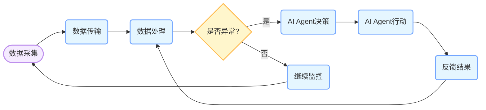

# AI Agent在智能城市安全监控中的角色

> 关键词：AI Agent、智能城市、安全监控、角色、技术原理

> 摘要：本文深入探讨了AI Agent在智能城市安全监控中的角色。首先介绍了相关背景，包括目的范围、预期读者等内容。接着阐述了核心概念及联系，详细说明了AI Agent的原理和架构，并给出了相应的文本示意图和Mermaid流程图。然后对核心算法原理进行讲解，通过Python源代码展示具体操作步骤，同时给出数学模型和公式并举例说明。通过项目实战，包括开发环境搭建、源代码实现与解读，进一步说明AI Agent在安全监控中的应用。还分析了实际应用场景，推荐了相关的工具和资源，最后总结了未来发展趋势与挑战，解答常见问题并提供扩展阅读和参考资料，旨在全面剖析AI Agent在智能城市安全监控中的重要作用。

## 1. 背景介绍 
### 1.1 目的和范围
随着城市化进程的加速，城市规模不断扩大，人口密度日益增加，城市安全面临着诸多挑战。传统的安全监控手段已经难以满足现代城市复杂环境下的安全需求。智能城市的概念应运而生，旨在利用先进的信息技术提升城市的管理和服务水平，其中安全监控是重要的组成部分。

本文的目的是深入研究AI Agent在智能城市安全监控中的角色，分析其如何通过智能化的方式提高安全监控的效率和准确性。范围涵盖了AI Agent的基本原理、核心算法、在安全监控中的具体应用场景，以及相关的工具和资源等方面。

### 1.2 预期读者
本文预期读者包括从事智能城市建设、安全监控领域的专业技术人员，如软件工程师、系统架构师、安全分析师等；对人工智能和智能城市发展感兴趣的科研人员和学者；以及关注城市安全问题的政府部门工作人员和城市规划者。

### 1.3 文档结构概述
本文将按照以下结构进行阐述：首先介绍核心概念与联系，包括AI Agent和智能城市安全监控的基本概念、原理和架构；接着详细讲解核心算法原理和具体操作步骤，并给出相应的Python源代码；然后介绍数学模型和公式，并举例说明；通过项目实战展示AI Agent在安全监控中的实际应用；分析实际应用场景；推荐相关的工具和资源；总结未来发展趋势与挑战；解答常见问题；最后提供扩展阅读和参考资料。

### 1.4 术语表
#### 1.4.1 核心术语定义
- **AI Agent（人工智能代理）**：是一种能够感知环境、根据自身的知识和目标进行决策，并采取行动以实现目标的智能实体。它可以是软件程序、机器人或其他具有智能行为的系统。
- **智能城市**：是利用物联网、云计算、大数据、人工智能等先进信息技术，对城市的基础设施、公共服务、安全管理等进行全面感知、分析和管理，以提高城市的运行效率和居民的生活质量的城市发展模式。
- **安全监控**：是指通过各种技术手段对特定区域或对象进行实时监测，及时发现安全隐患和异常情况，并采取相应的措施进行处理，以保障人员和财产的安全。

#### 1.4.2 相关概念解释
- **物联网（IoT）**：是指通过各种信息传感设备，如传感器、射频识别（RFID）技术、全球定位系统等，按约定的协议，将任何物品与互联网相连接，进行信息交换和通信，以实现智能化识别、定位、跟踪、监控和管理的一种网络。在智能城市安全监控中，物联网技术用于收集各种环境数据和设备状态信息。
- **大数据**：是指无法在一定时间范围内用常规软件工具进行捕捉、管理和处理的数据集合，是需要新处理模式才能具有更强的决策力、洞察发现力和流程优化能力的海量、高增长率和多样化的信息资产。在安全监控中，大数据技术用于存储和分析大量的监控数据，挖掘潜在的安全风险。
- **云计算**：是一种基于互联网的计算方式，通过将计算任务分布在大量计算机构成的资源池上，使各种应用系统能够根据需要获取计算力、存储空间和信息服务。在智能城市安全监控中，云计算为监控系统提供强大的计算和存储能力。

#### 1.4.3 缩略词列表
- **AI**：Artificial Intelligence（人工智能）
- **IoT**：Internet of Things（物联网）
- **RFID**：Radio Frequency Identification（射频识别）

## 2. 核心概念与联系 
### 核心概念原理
#### AI Agent原理
AI Agent的核心原理基于感知 - 决策 - 行动的循环。它通过各种传感器感知周围环境的信息，将这些信息进行处理和分析，根据自身的知识和目标进行决策，然后采取相应的行动来影响环境。例如，在智能城市安全监控中，AI Agent可以通过摄像头、传感器等设备感知城市中的人员活动、车辆行驶、环境参数等信息，根据预设的安全规则和算法进行决策，如判断是否存在异常行为或安全隐患，然后采取报警、控制设备等行动。

#### 智能城市安全监控原理
智能城市安全监控的原理是通过集成各种监控设备和技术，构建一个全方位、多层次的安全监控体系。该体系利用物联网技术收集城市各个角落的实时数据，通过大数据和云计算技术对这些数据进行存储、分析和处理，提取有价值的信息，及时发现安全隐患和异常情况，并通过智能决策系统采取相应的措施进行处理。

### 架构的文本示意图
```plaintext
智能城市安全监控系统
|
|-- 数据采集层
|   |-- 摄像头
|   |-- 传感器（温度、湿度、烟雾等）
|   |-- RFID读写器
|
|-- 数据传输层
|   |-- 无线网络（Wi-Fi、4G/5G等）
|   |-- 有线网络（以太网等）
|
|-- 数据处理层
|   |-- 大数据平台（Hadoop、Spark等）
|   |-- 云计算平台（阿里云、腾讯云等）
|
|-- AI Agent层
|   |-- 感知模块（接收数据采集层的数据）
|   |-- 决策模块（根据知识和规则进行决策）
|   |-- 行动模块（执行决策结果，如报警、控制设备等）
|
|-- 应用层
|   |-- 安全监控中心（实时显示监控信息）
|   |-- 应急指挥系统（处理突发事件）
```

### Mermaid流程图


## 3. 核心算法原理 & 具体操作步骤 
### 核心算法原理
在智能城市安全监控中，AI Agent常用的核心算法包括目标检测算法、行为分析算法和异常检测算法。

#### 目标检测算法
目标检测算法用于在监控图像或视频中识别特定的目标，如人员、车辆、物体等。常用的目标检测算法有基于深度学习的Faster R-CNN、YOLO等。以YOLO（You Only Look Once）算法为例，其核心思想是将输入的图像划分为多个网格，每个网格负责预测目标的边界框、类别和置信度。通过一次前向传播即可完成目标的检测，具有较高的检测速度。

#### 行为分析算法
行为分析算法用于分析目标的行为模式，如人员的行走轨迹、车辆的行驶方向等。可以采用基于深度学习的卷积神经网络（CNN）和循环神经网络（RNN）来实现。例如，通过CNN提取目标的特征，然后使用RNN对特征序列进行建模，预测目标的行为。

#### 异常检测算法
异常检测算法用于发现监控数据中的异常情况，如异常的人员聚集、车辆超速等。可以采用基于统计分析的方法，如基于高斯分布的异常检测，也可以采用基于机器学习的方法，如支持向量机（SVM）、孤立森林等。

### 具体操作步骤及Python源代码
#### 目标检测（使用YOLOv5）
```python
import torch

# 加载预训练的YOLOv5模型
model = torch.hub.load('ultralytics/yolov5', 'yolov5s', pretrained=True)

# 读取图像
img = 'path/to/your/image.jpg'

# 进行目标检测
results = model(img)

# 显示检测结果
results.show()

# 保存检测结果
results.save()
```
上述代码首先使用`torch.hub.load`函数加载预训练的YOLOv5模型，然后读取一张图像，调用模型的`__call__`方法进行目标检测，最后显示和保存检测结果。

#### 行为分析（简单示例）
```python
import numpy as np
import tensorflow as tf
from tensorflow.keras.models import Sequential
from tensorflow.keras.layers import LSTM, Dense

# 生成示例数据
data = np.random.rand(100, 10, 5)  # 100个样本，每个样本序列长度为10，特征维度为5
labels = np.random.randint(0, 2, 100)  # 二分类标签

# 构建LSTM模型
model = Sequential()
model.add(LSTM(64, input_shape=(10, 5)))
model.add(Dense(1, activation='sigmoid'))

# 编译模型
model.compile(optimizer='adam', loss='binary_crossentropy', metrics=['accuracy'])

# 训练模型
model.fit(data, labels, epochs=10, batch_size=32)
```
上述代码生成了一些示例数据，构建了一个简单的LSTM模型用于行为分析，然后编译并训练模型。

#### 异常检测（使用孤立森林）
```python
from sklearn.ensemble import IsolationForest
import numpy as np

# 生成示例数据
data = np.random.randn(100, 5)

# 创建孤立森林模型
clf = IsolationForest(contamination=0.1)

# 训练模型
clf.fit(data)

# 预测异常
predictions = clf.predict(data)
```
上述代码生成了一些示例数据，创建了一个孤立森林模型进行异常检测，然后训练模型并进行预测。

## 4. 数学模型和公式 & 详细讲解 & 举例说明 
### 目标检测（YOLOv5）数学模型和公式
#### 边界框预测
YOLOv5中每个网格预测的边界框由四个参数 $(x, y, w, h)$ 表示，其中 $(x, y)$ 是边界框中心相对于网格的偏移量，$w$ 和 $h$ 是边界框的宽度和高度。预测的边界框中心坐标 $(x_{center}, y_{center})$ 和宽度、高度 $(w_{box}, h_{box})$ 可以通过以下公式计算：
$$
x_{center} = (sigmoid(t_x) + c_x) \times g_w
$$
$$
y_{center} = (sigmoid(t_y) + c_y) \times g_h
$$
$$
w_{box} = p_w \times e^{t_w}
$$
$$
h_{box} = p_h \times e^{t_h}
$$
其中，$(t_x, t_y, t_w, t_h)$ 是模型预测的偏移量，$(c_x, c_y)$ 是网格的左上角坐标，$(p_w, p_h)$ 是预设的锚框宽度和高度，$g_w$ 和 $g_h$ 是网格的宽度和高度。

#### 置信度预测
每个边界框的置信度 $C$ 表示该边界框包含目标的概率，通过以下公式计算：
$$
C = sigmoid(t_c)
$$
其中，$t_c$ 是模型预测的置信度偏移量。

#### 类别预测
每个边界框预测的类别概率通过softmax函数计算：
$$
P(c_i) = \frac{e^{t_{c_i}}}{\sum_{j=1}^{N} e^{t_{c_j}}}
$$
其中，$t_{c_i}$ 是模型预测的第 $i$ 个类别的得分，$N$ 是类别总数。

### 行为分析（LSTM）数学模型和公式
#### LSTM单元结构
LSTM（长短期记忆网络）单元由输入门 $i_t$、遗忘门 $f_t$、输出门 $o_t$ 和细胞状态 $C_t$ 组成。其计算公式如下：
$$
i_t = \sigma(W_{ii}x_t + W_{hi}h_{t - 1} + b_i)
$$
$$
f_t = \sigma(W_{if}x_t + W_{hf}h_{t - 1} + b_f)
$$
$$
\tilde{C}_t = \tanh(W_{ic}x_t + W_{hc}h_{t - 1} + b_c)
$$
$$
C_t = f_t \odot C_{t - 1} + i_t \odot \tilde{C}_t
$$
$$
o_t = \sigma(W_{io}x_t + W_{ho}h_{t - 1} + b_o)
$$
$$
h_t = o_t \odot \tanh(C_t)
$$
其中，$x_t$ 是输入向量，$h_{t - 1}$ 是上一时刻的隐藏状态，$W$ 是权重矩阵，$b$ 是偏置向量，$\sigma$ 是sigmoid函数，$\tanh$ 是双曲正切函数，$\odot$ 表示逐元素相乘。

### 异常检测（孤立森林）数学模型和公式
#### 孤立森林原理
孤立森林通过构建多棵二叉搜索树来分离数据点。每个数据点的异常分数 $s$ 可以通过以下公式计算：
$$
s(x, n) = 2^{-\frac{E(h(x))}{c(n)}}
$$
其中，$x$ 是数据点，$n$ 是样本数量，$E(h(x))$ 是数据点 $x$ 在所有二叉搜索树中的平均路径长度，$c(n)$ 是样本数量为 $n$ 时的平均路径长度，可以通过以下公式计算：
$$
c(n) = 2H(n - 1) - \frac{2(n - 1)}{n}
$$
其中，$H(n)$ 是调和数，$H(n) = \sum_{i = 1}^{n} \frac{1}{i}$。

### 举例说明
#### 目标检测
假设有一张图像被划分为 $7 \times 7$ 的网格，某个网格预测的 $(t_x, t_y, t_w, t_h) = (0.2, 0.3, 0.1, 0.2)$，该网格的左上角坐标 $(c_x, c_y) = (2, 3)$，预设的锚框宽度和高度 $(p_w, p_h) = (0.5, 0.6)$，网格的宽度和高度 $g_w = g_h = 1$。则该边界框的中心坐标和宽度、高度计算如下：
$$
x_{center} = (sigmoid(0.2) + 2) \times 1 \approx 2.55
$$
$$
y_{center} = (sigmoid(0.3) + 3) \times 1 \approx 3.57
$$
$$
w_{box} = 0.5 \times e^{0.1} \approx 0.55
$$
$$
h_{box} = 0.6 \times e^{0.2} \approx 0.73
$$

#### 行为分析
假设有一个LSTM单元，输入向量 $x_t = [0.1, 0.2, 0.3]$，上一时刻的隐藏状态 $h_{t - 1} = [0.4, 0.5]$，权重矩阵和偏置向量的值已知。通过上述LSTM单元的计算公式，可以逐步计算出输入门、遗忘门、输出门和细胞状态，最终得到当前时刻的隐藏状态 $h_t$。

#### 异常检测
假设有一个包含100个样本的数据集，某个数据点 $x$ 在所有二叉搜索树中的平均路径长度 $E(h(x)) = 5$。则该数据点的异常分数计算如下：
$$
c(100) = 2H(99) - \frac{2 \times 99}{100} \approx 4.61
$$
$$
s(x, 100) = 2^{-\frac{5}{4.61}} \approx 0.65
$$
如果预设的异常阈值为0.6，则该数据点被判定为异常。

## 5. 项目实战：代码实际案例和详细解释说明 
### 5.1  开发环境搭建
#### 安装Python
首先需要安装Python，建议使用Python 3.7及以上版本。可以从Python官方网站（https://www.python.org/downloads/）下载安装包进行安装。

#### 安装依赖库
在智能城市安全监控项目中，需要安装一些常用的依赖库，如`torch`、`tensorflow`、`opencv-python`等。可以使用`pip`命令进行安装：
```bash
pip install torch tensorflow opencv-python
```

#### 安装YOLOv5
可以通过以下命令克隆YOLOv5的代码仓库：
```bash
git clone https://github.com/ultralytics/yolov5
cd yolov5
pip install -r requirements.txt
```

### 5.2  源代码详细实现和代码解读
#### 目标检测与异常人员行为分析
```python
import cv2
import torch

# 加载YOLOv5模型
model = torch.hub.load('ultralytics/yolov5', 'yolov5s', pretrained=True)

# 打开摄像头
cap = cv2.VideoCapture(0)

while True:
    ret, frame = cap.read()
    if not ret:
        break
    
    # 进行目标检测
    results = model(frame)
    
    # 获取检测结果
    detections = results.pandas().xyxy[0]
    
    # 分析人员行为（简单示例：判断人员是否静止）
    for _, detection in detections.iterrows():
        if detection['name'] == 'person':
            x1, y1, x2, y2 = int(detection['xmin']), int(detection['ymin']), int(detection['xmax']), int(detection['ymax'])
            person_area = frame[y1:y2, x1:x2]
            # 简单判断人员是否静止，这里可以使用更复杂的算法
            gray = cv2.cvtColor(person_area, cv2.COLOR_BGR2GRAY)
            _, thresh = cv2.threshold(gray, 127, 255, cv2.THRESH_BINARY)
            contours, _ = cv2.findContours(thresh, cv2.RETR_EXTERNAL, cv2.CHAIN_APPROX_SIMPLE)
            if len(contours) < 5:
                cv2.putText(frame, 'Person is stationary', (x1, y1 - 10), cv2.FONT_HERSHEY_SIMPLEX, 0.9, (0, 255, 0), 2)
    
    # 显示结果
    cv2.imshow('Security Monitoring', frame)
    
    # 按 'q' 键退出
    if cv2.waitKey(1) & 0xFF == ord('q'):
        break

# 释放摄像头并关闭窗口
cap.release()
cv2.destroyAllWindows()
```
#### 代码解读
1. **加载模型**：使用`torch.hub.load`函数加载预训练的YOLOv5模型。
2. **打开摄像头**：使用`cv2.VideoCapture`打开摄像头。
3. **循环读取帧**：在循环中不断读取摄像头的帧。
4. **目标检测**：将读取的帧输入到YOLOv5模型中进行目标检测。
5. **人员行为分析**：遍历检测结果，对于检测到的人员，提取其区域，将其转换为灰度图像并进行阈值处理，通过查找轮廓的数量简单判断人员是否静止。
6. **显示结果**：在图像上绘制相应的信息并显示。
7. **退出循环**：按 'q' 键退出循环。
8. **释放资源**：释放摄像头并关闭窗口。

### 5.3  代码解读与分析
#### 优点
- **实时性**：通过使用YOLOv5模型进行目标检测，能够在较短的时间内完成检测任务，满足实时监控的需求。
- **可扩展性**：代码结构简单，易于扩展。可以通过替换模型或添加新的行为分析算法来提升系统的功能。
- **可视化**：使用`opencv-python`库将检测结果可视化，方便用户直观地观察监控情况。

#### 缺点
- **行为分析简单**：当前的行为分析算法比较简单，只能进行一些基本的判断，对于复杂的行为模式可能无法准确识别。
- **依赖预训练模型**：代码依赖于预训练的YOLOv5模型，对于特定的场景可能需要进行微调或重新训练。

## 6. 实际应用场景 
### 公共场所安全监控
在商场、机场、火车站等公共场所，AI Agent可以通过摄像头实时监控人员的活动情况。例如，检测人员的密度，当人员过于密集时及时发出预警；识别异常行为，如打架、盗窃等，并立即通知安保人员。同时，还可以对公共场所的设施设备进行监控，如电梯的运行状态、消防设备的完好情况等，确保公共场所的安全。

### 交通管理与安全监控
在城市交通中，AI Agent可以用于交通流量监测、违章行为检测和交通事故预警。通过安装在道路上的摄像头和传感器，实时收集交通数据，分析车辆的行驶速度、行驶轨迹和交通流量。当检测到车辆超速、闯红灯等违章行为时，及时记录并通知交警部门。同时，还可以对交通事故进行实时预警，快速调度救援力量，减少事故造成的损失。

### 社区安全监控
在社区中，AI Agent可以实现门禁管理、人员出入监控和异常事件报警。通过人脸识别技术，对进入社区的人员进行身份验证，确保只有授权人员能够进入。同时，监控社区内的公共区域，如停车场、花园等，当检测到异常人员或事件时，及时通知物业管理人员。

### 工业安全监控
在工业生产环境中，AI Agent可以对生产设备的运行状态进行实时监控，检测设备的故障和异常情况。例如，通过振动传感器、温度传感器等设备收集设备的运行数据，使用机器学习算法分析数据，预测设备的故障发生概率。当检测到设备出现异常时，及时发出报警信号，提醒工作人员进行维修和维护，确保工业生产的安全和稳定。

## 7. 工具和资源推荐
### 7.1 学习资源推荐
#### 7.1.1 书籍推荐
- 《人工智能：一种现代的方法》：全面介绍了人工智能的基本概念、算法和应用，是人工智能领域的经典教材。
- 《深度学习》：由深度学习领域的三位顶级专家编写，详细介绍了深度学习的原理、算法和应用，是深度学习领域的权威著作。
- 《Python机器学习实战》：通过大量的实际案例，介绍了Python在机器学习中的应用，适合初学者快速上手。

#### 7.1.2 在线课程
- Coursera上的“人工智能基础”课程：由知名高校的教授授课，系统地介绍了人工智能的基本概念和算法。
- edX上的“深度学习专项课程”：由深度学习领域的专家提供，深入讲解了深度学习的原理和应用。
- 阿里云天池的“人工智能实战营”：提供了丰富的人工智能实战项目和案例，帮助学习者提高实践能力。

#### 7.1.3 技术博客和网站
- Medium：是一个技术博客平台，上面有很多人工智能领域的优秀文章和技术分享。
- arXiv：是一个预印本论文平台，提供了大量最新的人工智能研究成果。
- Kaggle：是一个数据科学和机器学习竞赛平台，上面有很多公开的数据集和优秀的解决方案，可以学习到很多实际应用中的技巧和方法。

### 7.2 开发工具框架推荐
#### 7.2.1 IDE和编辑器
- PyCharm：是一款专门为Python开发设计的集成开发环境，具有强大的代码编辑、调试和项目管理功能。
- Jupyter Notebook：是一个交互式的开发环境，适合进行数据探索和模型实验，支持多种编程语言。
- Visual Studio Code：是一款轻量级的代码编辑器，支持多种编程语言和插件扩展，具有丰富的开发工具和功能。

#### 7.2.2 调试和性能分析工具
- TensorBoard：是TensorFlow提供的一个可视化工具，用于监控模型的训练过程和性能指标。
- Py-Spy：是一个Python性能分析工具，可以实时监控Python程序的CPU使用情况和函数调用时间。
- cProfile：是Python标准库中的一个性能分析模块，可以分析Python程序的函数调用时间和内存使用情况。

#### 7.2.3 相关框架和库
- TensorFlow：是一个开源的机器学习框架，提供了丰富的工具和库，用于构建和训练各种深度学习模型。
- PyTorch：是另一个流行的深度学习框架，具有动态图机制，易于使用和调试。
- Scikit-learn：是一个用于机器学习的Python库，提供了各种机器学习算法和工具，适合初学者和快速开发。

### 7.3 相关论文著作推荐
#### 7.3.1 经典论文
- “You Only Look Once: Unified, Real-Time Object Detection”：介绍了YOLO目标检测算法的原理和实现，是目标检测领域的经典论文。
- “Long Short-Term Memory”：首次提出了LSTM长短期记忆网络的概念，解决了传统循环神经网络的梯度消失问题。
- “Isolation Forest”：介绍了孤立森林异常检测算法的原理和应用，是异常检测领域的重要论文。

#### 7.3.2 最新研究成果
- 关注顶级学术会议，如NeurIPS（神经信息处理系统大会）、ICCV（国际计算机视觉会议）、CVPR（计算机视觉与模式识别会议）等，这些会议上会发布很多最新的人工智能研究成果。
- 关注知名学术期刊，如Journal of Artificial Intelligence Research（JAIR）、Artificial Intelligence等，这些期刊上会发表一些高质量的人工智能研究论文。

#### 7.3.3 应用案例分析
- 可以在IEEE Xplore、ACM Digital Library等学术数据库中搜索关于AI Agent在智能城市安全监控中的应用案例分析，了解实际应用中的技术和方法。

## 8. 总结：未来发展趋势与挑战
### 未来发展趋势
#### 多模态融合
未来的AI Agent将融合多种传感器数据，如图像、音频、视频、传感器数据等，实现更全面、准确的环境感知。例如，在安全监控中，结合图像和音频信息可以更好地识别异常事件，如打架、呼喊等。

#### 自主学习与进化
AI Agent将具备更强的自主学习能力，能够在不断变化的环境中自动调整和优化自身的行为策略。通过强化学习、元学习等技术，AI Agent可以不断积累经验，提高决策的准确性和效率。

#### 与物联网深度融合
随着物联网技术的发展，AI Agent将与物联网设备深度融合，实现对城市中各种设备和设施的智能管理和控制。例如，通过与智能门锁、智能摄像头、智能传感器等设备的连接，实现更高效的安全监控和智能家居控制。

#### 群体智能协作
多个AI Agent可以组成群体，通过协作和通信实现更复杂的任务。在智能城市安全监控中，不同区域的AI Agent可以相互协作，共同应对突发事件，提高城市的整体安全水平。

### 挑战
#### 数据隐私与安全
在智能城市安全监控中，AI Agent需要收集和处理大量的个人数据，如人脸图像、行为轨迹等，这涉及到数据隐私和安全问题。如何在保证监控效果的同时，保护个人数据的隐私和安全是一个亟待解决的问题。

#### 算法可解释性
深度学习等复杂算法在AI Agent中得到了广泛应用，但这些算法往往具有较高的黑盒性，难以解释其决策过程和结果。在安全监控等关键领域，算法的可解释性至关重要，需要开发出可解释的人工智能算法。

#### 环境适应性
城市环境复杂多变，AI Agent需要具备较强的环境适应性，能够在不同的光照、天气、场景等条件下正常工作。如何提高AI Agent的环境适应性是一个挑战。

#### 标准与规范
目前，智能城市安全监控领域缺乏统一的标准和规范，不同的系统和设备之间存在兼容性问题。需要制定相关的标准和规范，促进智能城市安全监控系统的互联互通和互操作性。

## 9. 附录：常见问题与解答
### 问题1：AI Agent在智能城市安全监控中的准确性如何保证？
答：可以通过以下几种方式保证AI Agent的准确性：
- 使用高质量的训练数据：确保训练数据的多样性和代表性，涵盖各种不同的场景和情况。
- 模型选择与优化：选择合适的模型，并对模型进行优化和调参，提高模型的性能。
- 多模型融合：将多个不同的模型进行融合，综合各个模型的优势，提高检测和分析的准确性。
- 实时反馈与更新：根据实际监控情况，实时反馈数据，对模型进行更新和优化。

### 问题2：AI Agent在处理大量数据时的性能如何？
答：为了提高AI Agent在处理大量数据时的性能，可以采取以下措施：
- 采用分布式计算：使用分布式计算框架，如Hadoop、Spark等，将数据处理任务分布到多个节点上并行处理。
- 优化算法复杂度：选择复杂度较低的算法，减少计算量。
- 数据压缩与降维：对数据进行压缩和降维处理，减少数据量。
- 使用硬件加速：如GPU、FPGA等硬件设备，提高计算速度。

### 问题3：AI Agent如何与现有的安全监控系统集成？
答：可以通过以下步骤将AI Agent与现有的安全监控系统集成：
- 数据接口对接：确定现有的安全监控系统的数据接口格式，将AI Agent与该接口进行对接，实现数据的传输和共享。
- 协议适配：确保AI Agent和现有的安全监控系统使用相同的通信协议，如HTTP、MQTT等。
- 功能扩展：根据现有的安全监控系统的功能需求，对AI Agent进行定制开发，实现功能的扩展和增强。
- 系统测试：在集成完成后，进行系统测试，确保AI Agent和现有的安全监控系统能够正常协同工作。

## 10. 扩展阅读 & 参考资料
### 扩展阅读
- 《智能城市：技术、应用与实践》：深入介绍了智能城市的各个方面，包括技术架构、应用场景和实践案例。
- 《人工智能安全》：探讨了人工智能在安全领域的应用和面临的挑战，以及相应的解决方案。
- 《物联网与智慧城市》：介绍了物联网技术在智慧城市建设中的应用和发展趋势。

### 参考资料
- YOLOv5官方文档：https://github.com/ultralytics/yolov5
- TensorFlow官方文档：https://www.tensorflow.org/
- PyTorch官方文档：https://pytorch.org/

作者：AI天才研究院/AI Genius Institute & 禅与计算机程序设计艺术 /Zen And The Art of Computer Programming