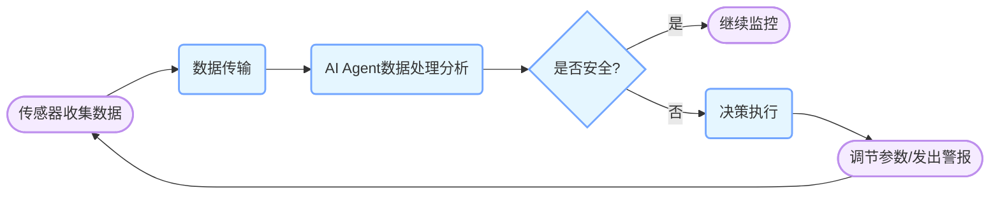

# AI Agent在智能婴儿床中的安全监控

> 关键词：AI Agent、智能婴儿床、安全监控、机器学习、传感器技术

> 摘要：本文聚焦于AI Agent在智能婴儿床安全监控中的应用。详细阐述了AI Agent和智能婴儿床安全监控的核心概念及其联系，深入分析了相关核心算法原理与操作步骤，并通过数学模型和公式进行理论支持。同时，结合项目实战给出代码案例及详细解释，探讨了其实际应用场景。此外，还推荐了学习、开发工具及相关论文著作。最后对AI Agent在智能婴儿床安全监控领域的未来发展趋势与挑战进行总结，并提供常见问题解答和扩展阅读参考资料，旨在为该领域的研究和应用提供全面而深入的技术指导。

## 1. 背景介绍 
### 1.1 目的和范围
本文章旨在深入探讨AI Agent在智能婴儿床安全监控方面的应用，详细介绍其原理、实现方法、实际应用场景以及未来发展趋势。范围涵盖从核心概念的解释到具体算法的实现，再到实际项目的案例分析，最后对相关工具资源的推荐和未来挑战的展望。

### 1.2 预期读者
本文预期读者包括对人工智能、智能家居领域感兴趣的技术爱好者，从事相关领域研究的科研人员，以及致力于开发智能婴儿床产品的工程师和开发者。

### 1.3 文档结构概述
本文首先介绍相关背景知识，包括目的、预期读者和文档结构。接着阐述核心概念及其联系，通过文本示意图和Mermaid流程图展示。然后详细讲解核心算法原理和具体操作步骤，并使用Python源代码进行说明。随后介绍数学模型和公式，并举例说明。之后进行项目实战，包括开发环境搭建、源代码实现和代码解读。再探讨实际应用场景，推荐相关工具和资源。最后总结未来发展趋势与挑战，提供常见问题解答和扩展阅读参考资料。

### 1.4 术语表
#### 1.4.1 核心术语定义
- **AI Agent**：人工智能代理，是一种能够感知环境、做出决策并采取行动以实现特定目标的软件实体。
- **智能婴儿床**：配备了各种传感器和智能设备，能够对婴儿的状态进行监测和管理的婴儿床。
- **安全监控**：对特定环境或对象进行实时监测，以确保其处于安全状态的过程。

#### 1.4.2 相关概念解释
- **机器学习**：是一门多领域交叉学科，涉及概率论、统计学、逼近论、凸分析、算法复杂度理论等多门学科。它专门研究计算机怎样模拟或实现人类的学习行为，以获取新的知识或技能，重新组织已有的知识结构使之不断改善自身的性能。
- **传感器技术**：是关于从自然信源获取信息，并对之进行处理（变换）和识别的一门多学科交叉的现代科学与工程技术，它涉及传感器（又称换能器）、信息处理和识别的规划设计、开发、制造、测试、应用及评价改进等活动。

#### 1.4.3 缩略词列表
- **AI**：Artificial Intelligence，人工智能
- **ML**：Machine Learning，机器学习

## 2. 核心概念与联系 
### 核心概念原理
#### AI Agent
AI Agent的核心原理基于感知、决策和行动三个关键环节。它通过各种传感器感知周围环境的信息，例如温度、湿度、声音等。然后，利用内置的算法和模型对这些信息进行分析和处理，做出相应的决策。最后，根据决策结果采取行动，如调整婴儿床的温度、发出警报等。

#### 智能婴儿床安全监控
智能婴儿床安全监控的原理是通过在婴儿床中安装各种传感器，实时收集婴儿的生理状态和周围环境信息。这些信息被传输到AI Agent中进行分析，以判断婴儿是否处于安全状态。如果发现异常情况，AI Agent会及时采取措施，保障婴儿的安全。

### 架构的文本示意图
AI Agent在智能婴儿床安全监控中的架构可以描述为：传感器层负责收集婴儿床周围的各种信息，包括婴儿的生命体征（如心率、呼吸）、环境参数（如温度、湿度、光线）等。数据传输层将传感器收集到的数据传输到AI Agent层。AI Agent层对数据进行处理和分析，利用机器学习模型判断婴儿的状态是否安全。决策执行层根据AI Agent的决策结果，执行相应的操作，如调节温度、发出警报等。

### Mermaid流程图


## 3. 核心算法原理 & 具体操作步骤 
### 核心算法原理
在智能婴儿床安全监控中，常用的核心算法是机器学习算法，例如支持向量机（SVM）和卷积神经网络（CNN）。

#### 支持向量机（SVM）
支持向量机的基本思想是在特征空间中找到一个最优的超平面，将不同类别的样本分开。对于智能婴儿床安全监控问题，我们可以将正常状态和异常状态看作两个不同的类别，通过SVM算法找到一个合适的超平面来区分它们。

#### 卷积神经网络（CNN）
卷积神经网络是一种专门用于处理具有网格结构数据的深度学习模型，如图像和时间序列数据。在智能婴儿床安全监控中，我们可以将传感器收集到的数据看作时间序列数据，利用CNN的卷积层和池化层提取数据的特征，然后通过全连接层进行分类，判断婴儿的状态是否安全。

### 具体操作步骤
#### 数据收集
使用各种传感器收集婴儿床周围的环境信息和婴儿的生理状态信息，如温度传感器、湿度传感器、心率传感器等。

#### 数据预处理
对收集到的数据进行清洗、归一化等预处理操作，以提高数据的质量和可用性。

#### 模型训练
使用预处理后的数据对SVM或CNN模型进行训练，调整模型的参数，使其能够准确地判断婴儿的状态。

#### 模型评估
使用测试数据集对训练好的模型进行评估，计算模型的准确率、召回率等指标，评估模型的性能。

#### 部署和监控
将训练好的模型部署到智能婴儿床系统中，实时监控婴儿的状态。如果发现异常情况，及时采取措施。

### Python源代码实现
```python
import numpy as np
from sklearn.svm import SVC
from sklearn.model_selection import train_test_split
from sklearn.metrics import accuracy_score

# 模拟数据收集
def generate_data():
    # 正常数据
    normal_data = np.random.normal(loc=0, scale=1, size=(100, 5))
    normal_labels = np.zeros(100)
    # 异常数据
    abnormal_data = np.random.normal(loc=5, scale=1, size=(100, 5))
    abnormal_labels = np.ones(100)
    
    data = np.vstack((normal_data, abnormal_data))
    labels = np.hstack((normal_labels, abnormal_labels))
    
    return data, labels

# 数据预处理
def preprocess_data(data):
    # 归一化处理
    data = (data - np.mean(data, axis=0)) / np.std(data, axis=0)
    return data

# 模型训练和评估
def train_and_evaluate(data, labels):
    # 划分训练集和测试集
    X_train, X_test, y_train, y_test = train_test_split(data, labels, test_size=0.2, random_state=42)
    
    # 创建SVM模型
    model = SVC()
    
    # 模型训练
    model.fit(X_train, y_train)
    
    # 模型预测
    y_pred = model.predict(X_test)
    
    # 计算准确率
    accuracy = accuracy_score(y_test, y_pred)
    print(f"模型准确率: {accuracy}")
    
    return model

# 主函数
def main():
    data, labels = generate_data()
    data = preprocess_data(data)
    model = train_and_evaluate(data, labels)

if __name__ == "__main__":
    main()
```

## 4. 数学模型和公式 & 详细讲解 & 举例说明 
### 支持向量机（SVM）数学模型和公式
#### 线性可分情况
对于线性可分的数据集，SVM的目标是找到一个最优的超平面 $w^T x + b = 0$，使得不同类别的样本能够被最大间隔地分开。其中，$w$ 是超平面的法向量，$b$ 是偏置项，$x$ 是样本向量。

SVM的优化问题可以表示为：
$$
\begin{aligned}
\min_{w, b} &\quad \frac{1}{2} \| w \|^2 \\
\text{s.t.} &\quad y_i (w^T x_i + b) \geq 1, \quad i = 1, 2, \cdots, n
\end{aligned}
$$
其中，$y_i$ 是样本 $x_i$ 的标签，取值为 $\pm 1$。

#### 线性不可分情况
对于线性不可分的数据集，我们引入松弛变量 $\xi_i \geq 0$，允许一些样本点可以落在间隔带内。此时，SVM的优化问题变为：
$$
\begin{aligned}
\min_{w, b, \xi} &\quad \frac{1}{2} \| w \|^2 + C \sum_{i=1}^{n} \xi_i \\
\text{s.t.} &\quad y_i (w^T x_i + b) \geq 1 - \xi_i, \quad i = 1, 2, \cdots, n \\
&\quad \xi_i \geq 0, \quad i = 1, 2, \cdots, n
\end{aligned}
$$
其中，$C$ 是惩罚参数，用于控制对误分类样本的惩罚程度。

### 卷积神经网络（CNN）数学模型和公式
#### 卷积层
卷积层是CNN的核心层，它通过卷积操作提取输入数据的特征。卷积操作可以表示为：
$$
y_{i, j}^l = \sum_{m=0}^{M-1} \sum_{n=0}^{N-1} x_{i+m, j+n}^{l-1} \cdot k_{m, n}^l + b^l
$$
其中，$y_{i, j}^l$ 是第 $l$ 层卷积层的输出特征图中第 $(i, j)$ 位置的值，$x_{i+m, j+n}^{l-1}$ 是第 $l-1$ 层输入特征图中第 $(i+m, j+n)$ 位置的值，$k_{m, n}^l$ 是第 $l$ 层的卷积核中第 $(m, n)$ 位置的值，$b^l$ 是第 $l$ 层的偏置项。

#### 池化层
池化层用于减少特征图的尺寸，降低计算量。常见的池化操作有最大池化和平均池化。以最大池化为例，其公式可以表示为：
$$
y_{i, j}^l = \max_{m=0}^{M-1} \max_{n=0}^{N-1} x_{i \cdot s + m, j \cdot s + n}^{l-1}
$$
其中，$s$ 是池化操作的步长。

### 举例说明
#### SVM举例
假设我们有一个二维数据集，包含两个类别：正类和负类。我们可以使用SVM算法找到一个最优的超平面将这两个类别分开。例如，在上面的Python代码中，我们模拟生成了一个二维数据集，使用SVM算法进行训练和预测，最终得到了模型的准确率。

#### CNN举例
假设我们要对图像进行分类，我们可以使用CNN模型。首先，将图像输入到卷积层中，通过卷积操作提取图像的特征。然后，将卷积层的输出输入到池化层中，减少特征图的尺寸。最后，将池化层的输出输入到全连接层中，进行分类。例如，在图像分类任务中，我们可以使用预训练的CNN模型，如ResNet、VGG等，对图像进行分类。

## 5. 项目实战：代码实际案例和详细解释说明 
### 5.1  开发环境搭建
#### 硬件环境
- **智能婴儿床**：配备各种传感器，如温度传感器、湿度传感器、心率传感器等。
- **开发板**：如Raspberry Pi，用于运行AI Agent程序。

#### 软件环境
- **操作系统**：Raspbian OS
- **编程语言**：Python 3.x
- **开发框架**：TensorFlow、Scikit-learn

### 5.2  源代码详细实现和代码解读
```python
import time
import numpy as np
from sklearn.svm import SVC
import RPi.GPIO as GPIO  # 树莓派GPIO控制库

# 模拟传感器数据读取
def read_sensor_data():
    # 这里可以替换为实际的传感器读取代码
    temperature = np.random.uniform(20, 30)
    humidity = np.random.uniform(40, 60)
    heart_rate = np.random.randint(80, 120)
    return [temperature, humidity, heart_rate]

# 数据预处理
def preprocess_data(data):
    data = np.array(data).reshape(1, -1)
    # 简单归一化处理
    data = (data - np.mean(data)) / np.std(data)
    return data

# 模型训练
def train_model():
    # 模拟训练数据
    normal_data = np.random.normal(loc=0, scale=1, size=(100, 3))
    normal_labels = np.zeros(100)
    abnormal_data = np.random.normal(loc=5, scale=1, size=(100, 3))
    abnormal_labels = np.ones(100)
    
    data = np.vstack((normal_data, abnormal_data))
    labels = np.hstack((normal_labels, abnormal_labels))
    
    model = SVC()
    model.fit(data, labels)
    return model

# 警报函数
def trigger_alarm():
    GPIO.setmode(GPIO.BCM)
    GPIO.setup(18, GPIO.OUT)
    GPIO.output(18, GPIO.HIGH)
    time.sleep(5)  # 警报持续5秒
    GPIO.output(18, GPIO.LOW)
    GPIO.cleanup()

# 主函数
def main():
    model = train_model()
    while True:
        sensor_data = read_sensor_data()
        processed_data = preprocess_data(sensor_data)
        prediction = model.predict(processed_data)
        
        if prediction[0] == 1:
            print("异常情况，触发警报！")
            trigger_alarm()
        else:
            print("正常状态")
        
        time.sleep(1)  # 每秒检测一次

if __name__ == "__main__":
    main()
```

### 5.3  代码解读与分析
#### 传感器数据读取
`read_sensor_data` 函数模拟了传感器数据的读取过程，实际应用中需要替换为真实的传感器读取代码。

#### 数据预处理
`preprocess_data` 函数对传感器数据进行预处理，将数据转换为模型可以接受的格式，并进行简单的归一化处理。

#### 模型训练
`train_model` 函数使用模拟数据训练SVM模型，实际应用中需要使用真实的训练数据。

#### 警报函数
`trigger_alarm` 函数用于触发警报，通过树莓派的GPIO接口控制警报器。

#### 主函数
`main` 函数是程序的入口，不断读取传感器数据，进行预处理和预测。如果预测结果为异常情况，则触发警报。

## 6. 实际应用场景 
### 实时生理状态监测
通过心率传感器、呼吸传感器等实时监测婴儿的生理状态，如心率、呼吸频率等。一旦发现异常，如心率过快或过慢、呼吸暂停等，AI Agent会及时发出警报，提醒家长或监护人采取措施。

### 环境参数调节
利用温度传感器、湿度传感器等监测婴儿床周围的环境参数，如温度、湿度等。AI Agent可以根据监测结果自动调节婴儿床的温度和湿度，为婴儿创造一个舒适的睡眠环境。

### 防止婴儿窒息
通过摄像头或压力传感器监测婴儿的睡眠姿势，防止婴儿因俯卧或被被子捂住口鼻而导致窒息。如果发现异常姿势，AI Agent会及时发出警报，并提醒家长调整婴儿的姿势。

### 睡眠质量分析
记录婴儿的睡眠数据，如睡眠时间、睡眠深度等。AI Agent可以对这些数据进行分析，为家长提供婴儿睡眠质量的评估报告，并给出改善睡眠质量的建议。

## 7. 工具和资源推荐
### 7.1 学习资源推荐
#### 7.1.1 书籍推荐
- 《机器学习》（周志华）：全面介绍了机器学习的基本概念、算法和应用，是机器学习领域的经典教材。
- 《深度学习》（Ian Goodfellow、Yoshua Bengio、Aaron Courville）：深度学习领域的权威著作，详细介绍了深度学习的原理、模型和应用。
- 《Python机器学习实战》（Sebastian Raschka）：通过实际案例介绍了Python在机器学习中的应用，适合初学者学习。

#### 7.1.2 在线课程
- Coursera上的“机器学习”课程（Andrew Ng教授）：经典的机器学习课程，由斯坦福大学的Andrew Ng教授授课，涵盖了机器学习的基本概念、算法和应用。
- edX上的“深度学习专项课程”（Andrew Ng教授）：深入介绍了深度学习的原理、模型和应用，适合有一定机器学习基础的学习者。
- 网易云课堂上的“Python数据分析与机器学习实战”课程：通过实际案例介绍了Python在数据分析和机器学习中的应用，适合初学者学习。

#### 7.1.3 技术博客和网站
- Medium：一个技术博客平台，上面有很多关于人工智能、机器学习的优质文章。
- Kaggle：一个数据科学竞赛平台，上面有很多关于机器学习、深度学习的数据集和代码示例。
- 机器之心：专注于人工智能领域的科技媒体，提供最新的人工智能技术和应用资讯。

### 7.2 开发工具框架推荐
#### 7.2.1 IDE和编辑器
- PyCharm：一款功能强大的Python集成开发环境，提供代码编辑、调试、版本控制等功能。
- Jupyter Notebook：一个交互式的开发环境，适合进行数据分析和机器学习实验。
- Visual Studio Code：一款轻量级的代码编辑器，支持多种编程语言，具有丰富的插件生态系统。

#### 7.2.2 调试和性能分析工具
- TensorBoard：TensorFlow的可视化工具，用于可视化训练过程、模型结构等。
- Py-Spy：一个Python性能分析工具，用于分析Python程序的性能瓶颈。
- cProfile：Python标准库中的性能分析工具，用于分析Python程序的运行时间和函数调用情况。

#### 7.2.3 相关框架和库
- TensorFlow：一个开源的深度学习框架，提供了丰富的深度学习模型和工具。
- PyTorch：一个开源的深度学习框架，具有动态图和静态图两种模式，适合进行深度学习研究和开发。
- Scikit-learn：一个开源的机器学习库，提供了丰富的机器学习算法和工具，适合进行机器学习实验和开发。

### 7.3 相关论文著作推荐
#### 7.3.1 经典论文
- “Support-Vector Networks”（Cortes和Vapnik）：支持向量机领域的经典论文，介绍了支持向量机的基本原理和算法。
- “ImageNet Classification with Deep Convolutional Neural Networks”（Krizhevsky、Sutskever和Hinton）：卷积神经网络领域的经典论文，介绍了AlexNet模型在ImageNet图像分类任务中的应用。
- “Long Short-Term Memory”（Hochreiter和Schmidhuber）：长短期记忆网络（LSTM）领域的经典论文，介绍了LSTM的基本原理和算法。

#### 7.3.2 最新研究成果
- 关注顶级学术会议，如NeurIPS、ICML、CVPR等，这些会议上会发表很多关于人工智能、机器学习的最新研究成果。
- 关注顶级学术期刊，如Journal of Artificial Intelligence Research（JAIR）、Artificial Intelligence等，这些期刊上会发表很多关于人工智能、机器学习的高质量研究论文。

#### 7.3.3 应用案例分析
- 关注行业报告和研究机构的分析报告，如Gartner、IDC等，这些报告中会包含很多关于人工智能、机器学习在各个领域的应用案例分析。
- 关注科技公司的博客和官方网站，如Google、Microsoft、Facebook等，这些公司会分享很多关于人工智能、机器学习的应用案例和技术经验。

## 8. 总结：未来发展趋势与挑战
### 未来发展趋势
#### 多模态融合
未来的智能婴儿床安全监控系统将融合多种传感器数据，如视觉、听觉、触觉等，实现更加全面和准确的安全监控。

#### 个性化服务
根据婴儿的个体差异和成长阶段，提供个性化的安全监控和服务。例如，根据婴儿的睡眠习惯和生理状态，自动调整婴儿床的环境参数。

#### 智能化交互
智能婴儿床将与家长和监护人实现更加智能化的交互，如通过语音交互、手机APP等方式，方便家长随时随地了解婴儿的状态。

#### 云服务和大数据分析
利用云服务和大数据分析技术，对大量的婴儿数据进行存储和分析，挖掘数据背后的潜在价值，为婴儿的健康成长提供更科学的建议。

### 挑战
#### 数据隐私和安全
智能婴儿床收集了大量的婴儿个人信息和生理数据，如何保障这些数据的隐私和安全是一个重要的挑战。

#### 算法的准确性和可靠性
AI Agent的决策和判断直接关系到婴儿的安全，如何提高算法的准确性和可靠性，减少误判和漏判是一个关键问题。

#### 成本和普及度
智能婴儿床的研发和生产成本较高，如何降低成本，提高产品的普及度，让更多的家庭受益是一个亟待解决的问题。

## 9. 附录：常见问题与解答
### 问题1：AI Agent在智能婴儿床安全监控中的准确率如何保证？
解答：可以通过以下方法保证准确率：使用大量的真实数据进行模型训练，对数据进行充分的预处理和特征工程，选择合适的机器学习算法和模型，进行模型评估和调优，不断更新和优化模型。

### 问题2：智能婴儿床安全监控系统的稳定性如何保障？
解答：可以从硬件和软件两个方面保障稳定性。硬件方面，选择质量可靠的传感器和开发板，进行合理的电路设计和散热处理。软件方面，进行严格的代码测试和优化，采用容错机制和备份策略，确保系统在异常情况下能够正常运行。

### 问题3：如何保障智能婴儿床收集的数据的隐私和安全？
解答：可以采取以下措施保障数据的隐私和安全：对数据进行加密处理，采用安全的传输协议，对数据进行访问控制和权限管理，定期进行数据备份和恢复，遵守相关的法律法规和隐私政策。

## 10. 扩展阅读 & 参考资料
### 扩展阅读
- 《智能家居技术与应用》：介绍了智能家居的基本概念、技术和应用，有助于进一步了解智能婴儿床在智能家居中的地位和作用。
- 《人工智能原理与应用》：深入介绍了人工智能的基本原理和应用，有助于深入理解AI Agent的工作原理和实现方法。

### 参考资料
- 相关的学术论文和研究报告，如IEEE、ACM等学术会议和期刊上发表的关于人工智能、机器学习在智能家居领域的研究论文。
- 智能婴儿床相关的产品说明书和技术文档，如各大品牌智能婴儿床的官方网站和产品手册。

作者：AI天才研究院/AI Genius Institute & 禅与计算机程序设计艺术 /Zen And The Art of Computer Programming