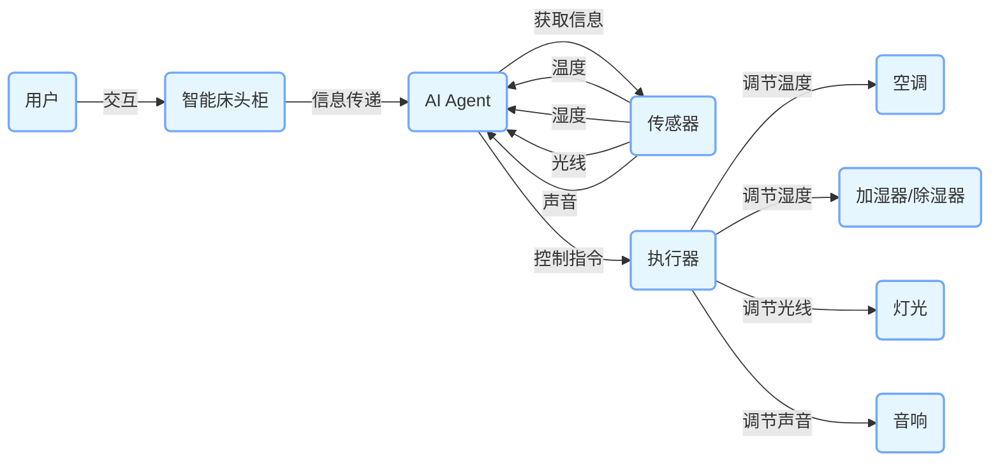

# AI Agent在智能床头柜中的睡眠环境调节

> 关键词：AI Agent、智能床头柜、睡眠环境调节、传感器、机器学习

> 摘要：本文深入探讨了AI Agent在智能床头柜中对睡眠环境调节的应用。首先介绍了相关背景，包括目的范围、预期读者等内容。接着阐述了核心概念及联系，详细说明了AI Agent和智能床头柜的原理与架构。通过Python代码讲解了核心算法原理和具体操作步骤，同时给出了数学模型和公式。结合实际项目案例，展示了代码实现和解读。分析了该技术在不同场景下的实际应用，推荐了学习资源、开发工具框架和相关论文著作。最后总结了未来发展趋势与挑战，并提供常见问题解答和扩展阅读参考资料，旨在为该领域的研究和应用提供全面的指导。

## 1. 背景介绍 
### 1.1 目的和范围
睡眠质量对于人们的身心健康至关重要，一个适宜的睡眠环境能够显著提高睡眠的深度和时长。传统的床头柜仅具备基本的收纳和放置物品功能，无法对睡眠环境进行主动调节。而随着人工智能技术的发展，将AI Agent引入智能床头柜，使其能够根据用户的睡眠状态和环境参数，自动调节诸如温度、湿度、光线和声音等因素，以创造出最适合用户睡眠的环境。

本文的范围涵盖了AI Agent在智能床头柜中睡眠环境调节的各个方面，包括核心概念、算法原理、数学模型、项目实战、应用场景等，旨在为读者提供一个全面而深入的了解。

### 1.2 预期读者
本文预期读者包括对人工智能、智能家居感兴趣的技术爱好者，从事相关领域研究的科研人员，以及致力于智能家居产品开发的工程师和产品经理。通过阅读本文，他们可以获取关于AI Agent在智能床头柜中应用的详细知识和实践经验。

### 1.3 文档结构概述
本文将按照以下结构进行阐述：首先介绍核心概念与联系，明确AI Agent和智能床头柜的相关原理和架构；接着讲解核心算法原理和具体操作步骤，并给出Python代码示例；然后介绍数学模型和公式，通过举例加深理解；再通过项目实战展示代码的实际应用和详细解释；分析实际应用场景；推荐相关的工具和资源；最后总结未来发展趋势与挑战，提供常见问题解答和扩展阅读参考资料。

### 1.4 术语表
#### 1.4.1 核心术语定义
- **AI Agent**：人工智能代理，是一种能够感知环境、根据感知信息做出决策并采取行动的智能实体。在本文中，AI Agent用于感知智能床头柜周围的睡眠环境信息，并根据这些信息调节睡眠环境。
- **智能床头柜**：集成了多种传感器和执行器的床头柜，能够与AI Agent交互，实现对睡眠环境的自动化调节。
- **睡眠环境调节**：根据用户的睡眠状态和需求，对睡眠环境中的温度、湿度、光线、声音等因素进行调整，以提高睡眠质量。

#### 1.4.2 相关概念解释
- **传感器**：用于感知睡眠环境中的各种参数，如温度传感器、湿度传感器、光线传感器、声音传感器等。这些传感器将感知到的信息转换为电信号，传输给AI Agent进行处理。
- **执行器**：根据AI Agent的决策，对睡眠环境进行实际调节的设备，如空调、加湿器、灯光、音响等。

#### 1.4.3 缩略词列表
- **AI**：Artificial Intelligence，人工智能
- **IoT**：Internet of Things，物联网

## 2. 核心概念与联系 

### 核心概念原理
#### AI Agent原理
AI Agent的核心是其感知 - 决策 - 行动的循环机制。它通过传感器感知睡眠环境的各种参数，如温度、湿度、光线强度、声音分贝等。然后，AI Agent使用机器学习算法对这些感知信息进行分析和处理，根据预设的规则或训练好的模型做出决策，判断当前睡眠环境是否适宜。最后，AI Agent向执行器发送控制指令，调节睡眠环境，使其达到最佳状态。

#### 智能床头柜原理
智能床头柜集成了多种传感器和执行器，作为AI Agent的物理载体和交互界面。传感器实时收集睡眠环境的信息，并将其传输给AI Agent。执行器则根据AI Agent的指令，对睡眠环境进行调节。同时，智能床头柜还可以提供用户交互功能，如通过触摸屏或语音交互，让用户手动设置睡眠环境参数。

### 架构示意图


该架构图展示了AI Agent、传感器、执行器、智能床头柜和用户之间的关系。AI Agent通过传感器获取睡眠环境信息，根据这些信息做出决策，并向执行器发送控制指令。用户可以通过智能床头柜与系统进行交互，设置睡眠环境参数。

## 3. 核心算法原理 & 具体操作步骤 

### 核心算法原理
AI Agent在智能床头柜中调节睡眠环境主要使用机器学习算法，如决策树、神经网络等。这里以简单的决策树算法为例进行说明。

决策树算法是一种基于树结构进行决策的算法，它根据输入的特征值（如温度、湿度等），通过一系列的判断节点，最终输出一个决策结果（如是否需要调节温度、调节的幅度等）。

### 具体操作步骤
#### 数据收集
使用传感器收集睡眠环境的各种参数，如温度、湿度、光线强度、声音分贝等，并记录用户在不同环境下的睡眠质量反馈（如睡眠时间、睡眠深度等）。

#### 数据预处理
对收集到的数据进行清洗、归一化等预处理操作，以提高数据的质量和可用性。例如，将温度数据归一化到[0, 1]区间，方便后续的算法处理。

#### 模型训练
使用预处理后的数据训练决策树模型。训练过程中，模型会学习不同环境参数与用户睡眠质量之间的关系，从而构建出决策树。

#### 决策与调节
在实际应用中，AI Agent实时获取传感器的数据，将其输入到训练好的决策树模型中，模型根据树结构进行判断，输出决策结果。AI Agent根据决策结果向执行器发送控制指令，调节睡眠环境。

### Python代码示例
```python
import numpy as np
from sklearn.tree import DecisionTreeRegressor
from sklearn.preprocessing import MinMaxScaler

# 模拟数据收集
# 假设我们有温度、湿度、光线强度和声音分贝四个特征
# 以及对应的睡眠质量评分作为标签
X = np.array([[25, 60, 50, 30],
              [22, 55, 40, 25],
              [28, 65, 60, 35],
              [20, 50, 30, 20]])
y = np.array([8, 9, 7, 9])

# 数据预处理
scaler = MinMaxScaler()
X_scaled = scaler.fit_transform(X)

# 模型训练
model = DecisionTreeRegressor()
model.fit(X_scaled, y)

# 模拟实时数据获取
new_data = np.array([[23, 58, 45, 28]])
new_data_scaled = scaler.transform(new_data)

# 决策
predicted_score = model.predict(new_data_scaled)
print("预测的睡眠质量评分:", predicted_score)

# 根据预测结果进行调节（这里简单示例）
if predicted_score < 8:
    print("需要调节睡眠环境")
else:
    print("睡眠环境适宜")
```

在上述代码中，我们首先模拟了数据收集过程，创建了一些环境参数和对应的睡眠质量评分数据。然后使用`MinMaxScaler`对数据进行归一化处理，训练了一个决策树回归模型。接着模拟实时数据获取，将新数据输入到模型中进行预测。最后根据预测结果判断是否需要调节睡眠环境。

## 4. 数学模型和公式 & 详细讲解 & 举例说明 

### 决策树算法的数学模型
决策树算法的核心是构建一个树结构，树的每个内部节点是一个特征上的判断条件，每个分支是一个判断结果，每个叶节点是一个决策结果。

决策树的构建过程通常基于信息增益或基尼不纯度等指标。以信息增益为例，信息增益用于衡量一个特征对分类结果的影响程度，信息增益越大，说明该特征对分类的贡献越大。

信息熵的计算公式为：
$$H(D)=-\sum_{i=1}^{n}p_i\log_2p_i$$
其中，$D$ 表示数据集，$p_i$ 表示数据集中第 $i$ 类样本的比例。

信息增益的计算公式为：
$$Gain(D, A)=H(D)-\sum_{v=1}^{V}\frac{|D^v|}{|D|}H(D^v)$$
其中，$A$ 表示特征，$V$ 表示特征 $A$ 的取值个数，$D^v$ 表示数据集 $D$ 中特征 $A$ 取值为 $v$ 的子集。

### 详细讲解
在决策树的构建过程中，首先计算数据集的信息熵 $H(D)$。然后对于每个特征 $A$，计算其信息增益 $Gain(D, A)$。选择信息增益最大的特征作为当前节点的划分特征，将数据集根据该特征的不同取值划分为多个子集。对每个子集重复上述过程，直到满足停止条件（如子集的样本数小于某个阈值、所有样本属于同一类等）。

### 举例说明
假设我们有一个数据集，包含两个特征：温度（高、低）和湿度（高、低），以及对应的睡眠质量（好、坏）。数据集如下：

| 温度 | 湿度 | 睡眠质量 |
|------|------|----------|
| 高   | 高   | 坏       |
| 高   | 低   | 好       |
| 低   | 高   | 坏       |
| 低   | 低   | 好       |

首先计算数据集的信息熵 $H(D)$：
数据集中好和坏的样本数均为 2，总样本数为 4，所以 $p_好 = p_坏 = \frac{2}{4} = 0.5$。
$$H(D)=-0.5\log_20.5 - 0.5\log_20.5 = 1$$

然后计算温度特征的信息增益：
当温度为高时，好样本数为 1，坏样本数为 1，$p_{好|高} = p_{坏|高} = \frac{1}{2} = 0.5$，$H(D_{高})=-0.5\log_20.5 - 0.5\log_20.5 = 1$。
当温度为低时，好样本数为 1，坏样本数为 1，$p_{好|低} = p_{坏|低} = \frac{1}{2} = 0.5$，$H(D_{低})=-0.5\log_20.5 - 0.5\log_20.5 = 1$。
温度特征的信息增益为：
$$Gain(D, 温度)=H(D)-\frac{2}{4}H(D_{高})-\frac{2}{4}H(D_{低})=1 - \frac{2}{4}\times1 - \frac{2}{4}\times1 = 0$$

同理，计算湿度特征的信息增益也为 0。在实际应用中，我们会选择信息增益最大的特征进行划分。

## 5. 项目实战：代码实际案例和详细解释说明 

### 5.1  开发环境搭建
#### 硬件环境
- 智能床头柜：选择具有一定计算能力和接口扩展能力的床头柜，如支持物联网通信的智能床头柜。
- 传感器：温度传感器、湿度传感器、光线传感器、声音传感器等，可通过串口、I2C 或 SPI 接口与智能床头柜连接。
- 执行器：空调、加湿器、灯光、音响等，可通过无线通信（如 Wi-Fi、蓝牙）与智能床头柜连接。

#### 软件环境
- 操作系统：选择适合智能设备的操作系统，如 Linux（如 Raspberry Pi OS）。
- 开发语言：Python，具有丰富的机器学习和物联网开发库。
- 开发框架：Scikit-learn 用于机器学习模型训练，Paho MQTT 用于物联网通信。

### 5.2  源代码详细实现和代码解读
```python
import paho.mqtt.client as mqtt
import time
from sklearn.tree import DecisionTreeRegressor
from sklearn.preprocessing import MinMaxScaler
import numpy as np

# MQTT 配置
MQTT_BROKER = "localhost"
MQTT_PORT = 1883
MQTT_TOPIC_SENSOR = "sensor/data"
MQTT_TOPIC_ACTUATOR = "actuator/control"

# 模拟数据收集和模型训练
X = np.array([[25, 60, 50, 30],
              [22, 55, 40, 25],
              [28, 65, 60, 35],
              [20, 50, 30, 20]])
y = np.array([8, 9, 7, 9])

scaler = MinMaxScaler()
X_scaled = scaler.fit_transform(X)

model = DecisionTreeRegressor()
model.fit(X_scaled, y)

# MQTT 回调函数
def on_connect(client, userdata, flags, rc):
    print("Connected with result code "+str(rc))
    client.subscribe(MQTT_TOPIC_SENSOR)

def on_message(client, userdata, msg):
    # 解析传感器数据
    data = msg.payload.decode().split(",")
    temperature = float(data[0])
    humidity = float(data[1])
    light = float(data[2])
    sound = float(data[3])

    # 数据预处理
    new_data = np.array([[temperature, humidity, light, sound]])
    new_data_scaled = scaler.transform(new_data)

    # 决策
    predicted_score = model.predict(new_data_scaled)
    print("预测的睡眠质量评分:", predicted_score)

    # 根据预测结果进行调节
    if predicted_score < 8:
        control_message = "adjust"
    else:
        control_message = "normal"

    # 发布控制指令
    client.publish(MQTT_TOPIC_ACTUATOR, control_message)

# 创建 MQTT 客户端
client = mqtt.Client()
client.on_connect = on_connect
client.on_message = on_message

# 连接 MQTT 服务器
client.connect(MQTT_BROKER, MQTT_PORT, 60)

# 开始循环处理网络流量
client.loop_start()

try:
    while True:
        time.sleep(1)
except KeyboardInterrupt:
    print("Exiting...")
    client.loop_stop()
    client.disconnect()
```

### 5.3  代码解读与分析
#### 代码整体功能
该代码实现了一个基于 MQTT 通信的智能睡眠环境调节系统。通过订阅传感器数据主题，接收传感器发送的温度、湿度、光线和声音等信息。使用训练好的决策树模型对数据进行预测，根据预测结果判断是否需要调节睡眠环境，并发布控制指令到执行器主题。

#### 代码详细解读
1. **MQTT 配置**：设置 MQTT 服务器的地址、端口以及订阅和发布的主题。
2. **数据收集和模型训练**：模拟收集一些环境参数和对应的睡眠质量评分数据，使用`MinMaxScaler`进行数据归一化处理，训练决策树回归模型。
3. **MQTT 回调函数**：
    - `on_connect`：在连接到 MQTT 服务器时调用，订阅传感器数据主题。
    - `on_message`：在接收到传感器数据时调用，解析数据，进行预处理和预测，根据预测结果发布控制指令。
4. **创建 MQTT 客户端**：创建 MQTT 客户端实例，设置回调函数，连接到 MQTT 服务器，并开始循环处理网络流量。
5. **主循环**：使用`try-except`语句捕获键盘中断信号，在程序退出时停止 MQTT 循环并断开连接。

## 6. 实际应用场景 
### 家庭卧室
在家庭卧室中，智能床头柜可以根据用户的睡眠习惯和实时环境参数，自动调节卧室的温度、湿度、光线和声音。例如，在夜间，智能床头柜可以逐渐调暗灯光，降低空调温度，播放轻柔的音乐，帮助用户更快入睡。当用户在睡眠中翻身或出现其他动作时，智能床头柜可以根据传感器检测到的信息，及时调整环境参数，提高用户的睡眠舒适度。

### 酒店客房
酒店可以为客房配备智能床头柜，为客人提供个性化的睡眠体验。客人可以通过智能床头柜上的触摸屏或语音交互，设置自己喜欢的睡眠环境参数。智能床头柜会根据客人的设置和实时环境信息，自动调节客房的环境。此外，酒店管理人员还可以通过后台系统对所有客房的智能床头柜进行集中管理和监控。

### 医疗康复机构
在医疗康复机构中，智能床头柜可以帮助患者改善睡眠质量，促进康复。例如，对于患有失眠症或其他睡眠障碍的患者，智能床头柜可以根据医生的建议，调节睡眠环境，如使用特定的光线和声音疗法，帮助患者放松身心，提高睡眠质量。同时，智能床头柜还可以实时监测患者的睡眠状态，将数据反馈给医护人员，以便及时调整治疗方案。

## 7. 工具和资源推荐
### 7.1 学习资源推荐
#### 7.1.1 书籍推荐
- 《机器学习》（周志华著）：全面介绍了机器学习的基本概念、算法和应用，是机器学习领域的经典教材。
- 《Python机器学习实战》（Sebastian Raschka著）：通过实际案例介绍了如何使用 Python 进行机器学习项目开发，适合初学者。
- 《物联网导论》（谢希仁著）：介绍了物联网的基本概念、技术和应用，对于理解智能床头柜中的物联网通信技术有很大帮助。

#### 7.1.2 在线课程
- Coursera 上的“机器学习”课程（Andrew Ng 教授主讲）：是一门非常经典的机器学习课程，内容全面，讲解详细。
- edX 上的“物联网基础”课程：介绍了物联网的基本概念、技术和应用，适合对物联网感兴趣的学习者。
- 中国大学 MOOC 上的“Python 语言程序设计”课程：是一门 Python 基础课程，对于初学者来说是很好的入门课程。

#### 7.1.3 技术博客和网站
- Medium：有很多关于人工智能、机器学习和物联网的技术文章，作者来自不同的领域，内容丰富多样。
- 开源中国：是国内知名的开源技术社区，有很多关于物联网和智能家居的技术文章和项目分享。
- 博客园：有很多程序员分享自己的技术经验和项目实践，对于学习和交流有很大帮助。

### 7.2 开发工具框架推荐
#### 7.2.1 IDE和编辑器
- PyCharm：是一款专门为 Python 开发设计的集成开发环境，具有强大的代码编辑、调试和自动补全功能。
- Visual Studio Code：是一款轻量级的代码编辑器，支持多种编程语言，具有丰富的插件扩展功能，适合开发物联网和机器学习项目。
- Jupyter Notebook：是一个交互式的开发环境，适合进行数据探索、模型训练和代码演示。

#### 7.2.2 调试和性能分析工具
- PDB：Python 自带的调试工具，可以帮助开发者调试 Python 代码。
- cProfile：Python 自带的性能分析工具，可以分析代码的执行时间和函数调用情况。
- TensorBoard：是 TensorFlow 提供的可视化工具，可以用于可视化模型训练过程中的各种指标，如损失函数、准确率等。

#### 7.2.3 相关框架和库
- Scikit-learn：是一个简单易用的机器学习库，提供了各种机器学习算法和工具，如分类、回归、聚类等。
- TensorFlow：是一个开源的深度学习框架，广泛应用于图像识别、自然语言处理等领域。
- Paho MQTT：是一个用于 MQTT 通信的 Python 库，支持 MQTT 协议的各种功能，如订阅、发布、连接等。

### 7.3 相关论文著作推荐
#### 7.3.1 经典论文
- “A Decision-Theoretic Generalization of On-Line Learning and an Application to Boosting”（Yoav Freund 和 Robert E. Schapire 著）：介绍了 AdaBoost 算法，是机器学习领域的经典论文之一。
- “Deep Residual Learning for Image Recognition”（Kaiming He 等人著）：提出了残差网络（ResNet），在图像识别领域取得了很好的效果。
- “Attention Is All You Need”（Ashish Vaswani 等人著）：提出了 Transformer 模型，在自然语言处理领域引起了很大的反响。

#### 7.3.2 最新研究成果
- 可以关注 IEEE Transactions on Smart Grid、ACM Transactions on Sensor Networks 等学术期刊，了解人工智能和物联网领域的最新研究成果。
- 参加相关的学术会议，如 ACM SIGKDD、NeurIPS 等，与国内外的研究人员交流和分享最新的研究进展。

#### 7.3.3 应用案例分析
- 可以参考一些智能家居产品的官方网站和技术文档，了解他们在实际应用中使用的技术和解决方案。
- 关注一些科技媒体和行业报告，了解智能床头柜和睡眠环境调节领域的最新应用案例和市场趋势。

## 8. 总结：未来发展趋势与挑战
### 未来发展趋势
#### 个性化定制
未来的智能床头柜将能够根据每个用户的独特睡眠习惯和生理特征，提供更加个性化的睡眠环境调节方案。例如，通过分析用户的睡眠数据，智能床头柜可以了解用户在不同季节、不同心情下的睡眠需求，自动调整温度、湿度、光线和声音等参数，为用户创造出最适合自己的睡眠环境。

#### 多模态交互
智能床头柜将不再局限于传统的触摸屏和语音交互方式，而是会引入更多的交互方式，如手势识别、眼神跟踪等。用户可以通过简单的手势或眼神指令，快速调整睡眠环境参数，提高交互的便捷性和自然度。

#### 与其他智能家居设备的集成
智能床头柜将与其他智能家居设备（如智能窗帘、智能床垫等）进行更深入的集成，实现整个卧室环境的协同调节。例如，当智能床头柜检测到用户准备入睡时，它可以同时控制智能窗帘关闭，智能床垫调整到舒适的状态，为用户营造一个更加舒适的睡眠氛围。

#### 健康监测与管理
除了调节睡眠环境，智能床头柜还将具备更多的健康监测功能，如监测用户的心率、呼吸频率、睡眠姿势等。通过对这些健康数据的分析，智能床头柜可以为用户提供个性化的健康建议和睡眠改善方案，帮助用户提高睡眠质量和身体健康水平。

### 挑战
#### 数据隐私和安全
智能床头柜需要收集大量的用户睡眠数据和个人信息，这些数据的隐私和安全问题至关重要。如何确保数据不被泄露和滥用，是智能床头柜发展面临的一个重要挑战。

#### 算法的准确性和可靠性
AI Agent在调节睡眠环境时，需要依赖准确可靠的算法模型。然而，睡眠环境是一个复杂的系统，受到多种因素的影响，如用户的身体状况、心理状态等。如何提高算法的准确性和可靠性，以适应不同用户和不同环境的需求，是一个需要解决的问题。

#### 硬件成本和性能
智能床头柜需要集成多种传感器和执行器，以及具备一定的计算能力，这会增加硬件成本。同时，如何在保证硬件性能的前提下，降低功耗和成本，是智能床头柜大规模推广应用的关键。

#### 标准和规范的缺乏
目前，智能床头柜和智能家居领域还缺乏统一的标准和规范，不同厂家的产品之间可能存在兼容性问题。这给用户的使用和系统的集成带来了一定的困难，也限制了智能床头柜的发展。

## 9. 附录：常见问题与解答
### 问题1：智能床头柜的传感器精度如何保证？
解答：传感器的精度受到多种因素的影响，如传感器的质量、安装位置、环境干扰等。为了保证传感器的精度，可以选择质量可靠的传感器产品，按照厂家的安装说明进行正确安装。同时，可以定期对传感器进行校准和维护，以确保其测量结果的准确性。

### 问题2：AI Agent 如何处理传感器数据的异常值？
解答：在数据预处理阶段，可以使用一些方法来处理传感器数据的异常值，如基于统计学的方法（如 Z-score 方法）、基于机器学习的方法（如孤立森林算法）等。这些方法可以识别出异常值，并根据具体情况进行处理，如删除异常值、替换异常值等。

### 问题3：智能床头柜与其他智能家居设备的集成方式有哪些？
解答：智能床头柜与其他智能家居设备的集成方式主要有以下几种：
- **通过物联网平台**：使用统一的物联网平台，将智能床头柜和其他智能家居设备连接到平台上，通过平台实现设备之间的通信和协同控制。
- **使用无线通信协议**：如 Wi-Fi、蓝牙、ZigBee 等，智能床头柜和其他智能家居设备可以通过这些无线通信协议直接进行通信和控制。
- **使用 API 接口**：一些智能家居设备提供了 API 接口，智能床头柜可以通过调用这些 API 接口，实现与其他设备的集成和控制。

### 问题4：智能床头柜的功耗如何控制？
解答：为了控制智能床头柜的功耗，可以采取以下措施：
- **选择低功耗的硬件组件**：如低功耗的传感器、处理器等。
- **优化算法和程序**：减少不必要的计算和数据处理，降低处理器的功耗。
- **采用节能模式**：在不需要工作时，智能床头柜可以进入节能模式，降低功耗。

## 10. 扩展阅读 & 参考资料
### 扩展阅读
- 《人工智能：现代方法》（Stuart Russell 和 Peter Norvig 著）：全面介绍了人工智能的基本概念、算法和应用，是人工智能领域的经典教材。
- 《智能家居：原理、设计与应用》（孙利民等著）：详细介绍了智能家居的原理、技术和应用，对于深入了解智能床头柜和智能家居系统有很大帮助。
- 《睡眠革命》（阿里安娜·赫芬顿著）：介绍了睡眠对身体健康和生活质量的重要性，以及如何改善睡眠质量的方法和建议。

### 参考资料
- 相关传感器和执行器的产品说明书和技术文档。
- 相关机器学习算法和物联网技术的学术论文和研究报告。
- 智能床头柜和智能家居产品的官方网站和技术文档。

作者：AI天才研究院/AI Genius Institute & 禅与计算机程序设计艺术 /Zen And The Art of Computer Programming