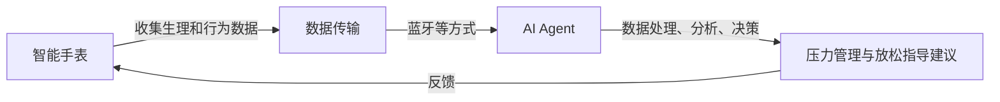

# AI Agent在智能手表中的压力管理与放松指导

> 关键词：AI Agent、智能手表、压力管理、放松指导、心理健康

> 摘要：本文深入探讨了AI Agent在智能手表中应用于压力管理与放松指导的相关技术。首先介绍了研究的背景，包括目的、预期读者、文档结构等内容。接着阐述了AI Agent、压力管理和放松指导的核心概念及其联系，并通过文本示意图和Mermaid流程图进行直观展示。详细讲解了核心算法原理，使用Python源代码进行说明，同时给出了相关的数学模型和公式。通过项目实战，从开发环境搭建到源代码实现与解读，展示了如何在智能手表中实现压力管理与放松指导功能。还探讨了实际应用场景，推荐了学习资源、开发工具框架以及相关论文著作。最后总结了未来发展趋势与挑战，并提供了常见问题解答和扩展阅读参考资料，旨在为相关领域的研究者和开发者提供全面且深入的技术指导。

## 1. 背景介绍 
### 1.1 目的和范围
在当今快节奏的生活中，人们面临着各种各样的压力，长期的压力会对身心健康造成严重的影响。智能手表作为一种便捷的可穿戴设备，具有实时监测用户生理和行为数据的能力。AI Agent（人工智能代理）则能够利用这些数据进行分析和决策，为用户提供个性化的压力管理和放松指导。本研究的目的在于探讨如何将AI Agent应用于智能手表中，实现有效的压力管理与放松指导功能。研究范围涵盖了从核心概念的理解到算法原理的实现，再到实际项目的开发和应用场景的探讨。

### 1.2 预期读者
本文预期读者包括人工智能领域的研究者、智能手表开发工程师、关注心理健康的技术爱好者、医疗保健领域的专业人士以及对可穿戴设备应用感兴趣的相关人员。

### 1.3 文档结构概述
本文首先介绍研究的背景信息，包括目的、读者和文档结构等。接着阐述核心概念及其联系，通过文本示意图和流程图进行直观展示。然后详细讲解核心算法原理和具体操作步骤，给出相关的数学模型和公式。通过项目实战展示如何在智能手表中实现压力管理与放松指导功能，包括开发环境搭建、源代码实现与解读。探讨实际应用场景，推荐学习资源、开发工具框架和相关论文著作。最后总结未来发展趋势与挑战，提供常见问题解答和扩展阅读参考资料。

### 1.4 术语表
#### 1.4.1 核心术语定义
- **AI Agent（人工智能代理）**：是一种能够感知环境、进行推理和决策，并采取行动以实现特定目标的软件实体。
- **智能手表**：一种可穿戴设备，通常具有显示时间、运动监测、心率监测等功能，并且可以与智能手机等设备进行连接。
- **压力管理**：通过各种方法和策略来识别、评估和应对压力，以维持身心健康的过程。
- **放松指导**：为用户提供一系列有助于放松身心的方法和建议，如深呼吸、冥想等。

#### 1.4.2 相关概念解释
- **生理数据**：指通过智能手表等设备监测到的用户身体生理指标，如心率、血压、睡眠质量等。
- **行为数据**：包括用户的运动轨迹、活动量、日常作息等行为方面的数据。
- **机器学习**：是一门多领域交叉学科，涉及概率论、统计学、逼近论、凸分析、算法复杂度理论等多门学科。它专门研究计算机怎样模拟或实现人类的学习行为，以获取新的知识或技能，重新组织已有的知识结构使之不断改善自身的性能。

#### 1.4.3 缩略词列表
- **AI**：Artificial Intelligence（人工智能）
- **ML**：Machine Learning（机器学习）
- **HR**：Heart Rate（心率）

## 2. 核心概念与联系 

### 核心概念原理
#### AI Agent
AI Agent是一个具有自主性、反应性、社会性和主动性的智能实体。它能够感知环境中的信息，例如智能手表收集的用户生理和行为数据。通过内部的推理机制，AI Agent可以对这些数据进行分析和处理，判断用户当前的压力状态。然后，根据预设的规则或通过机器学习训练得到的模型，AI Agent可以做出决策，为用户提供相应的压力管理和放松指导建议。

#### 压力管理
压力管理的核心在于识别压力源、评估压力水平，并采取适当的措施来应对压力。智能手表可以通过监测用户的生理数据（如心率变异性、血压等）和行为数据（如运动模式、睡眠质量等）来辅助识别压力源和评估压力水平。AI Agent则可以根据这些数据为用户制定个性化的压力管理方案，例如提醒用户进行适当的运动、调整作息时间等。

#### 放松指导
放松指导旨在帮助用户缓解身心压力，恢复平静和放松状态。常见的放松方法包括深呼吸、冥想、渐进性肌肉松弛等。AI Agent可以根据用户的压力状态和个人偏好，为用户推荐合适的放松方法，并提供相应的指导和训练。

### 架构的文本示意图
```plaintext
智能手表（收集生理和行为数据）
    |
    v
数据传输（蓝牙等方式）
    |
    v
AI Agent（数据处理、分析、决策）
    |
    v
压力管理与放松指导建议（反馈给智能手表显示）
```

### Mermaid流程图


## 3. 核心算法原理 & 具体操作步骤 

### 核心算法原理
我们可以使用机器学习中的分类算法来判断用户的压力状态。这里以支持向量机（SVM）为例，SVM是一种二分类模型，它的基本模型是定义在特征空间上的间隔最大的线性分类器。其学习策略是间隔最大化，最终可转化为一个凸二次规划问题的求解。

### 具体操作步骤
1. **数据收集**：智能手表收集用户的生理和行为数据，如心率、运动步数、睡眠时长等。
2. **数据预处理**：对收集到的数据进行清洗、归一化等处理，以提高数据质量。
3. **特征提取**：从预处理后的数据中提取有代表性的特征，如心率的均值、标准差等。
4. **模型训练**：使用标注好的数据集对SVM模型进行训练。
5. **压力状态预测**：将实时收集到的数据输入训练好的模型，预测用户的压力状态。
6. **放松指导生成**：根据预测的压力状态，为用户生成相应的放松指导建议。

### Python源代码实现
```python
import numpy as np
from sklearn import svm
from sklearn.preprocessing import StandardScaler
from sklearn.model_selection import train_test_split

# 模拟数据收集
# 假设有100个样本，每个样本有3个特征（心率、运动步数、睡眠时长）
X = np.random.rand(100, 3)
# 模拟压力状态标签，0表示低压力，1表示高压力
y = np.random.randint(0, 2, 100)

# 数据预处理
scaler = StandardScaler()
X_scaled = scaler.fit_transform(X)

# 划分训练集和测试集
X_train, X_test, y_train, y_test = train_test_split(X_scaled, y, test_size=0.2, random_state=42)

# 模型训练
clf = svm.SVC(kernel='linear')
clf.fit(X_train, y_train)

# 压力状态预测
y_pred = clf.predict(X_test)

# 输出预测结果
print("预测的压力状态：", y_pred)
```

## 4. 数学模型和公式 & 详细讲解 & 举例说明 

### 支持向量机（SVM）的数学模型
支持向量机的目标是找到一个超平面，使得不同类别的样本能够被最大程度地分开。对于线性可分的数据集，超平面可以表示为：
$$
w^T x + b = 0
$$
其中，$w$ 是超平面的法向量，$b$ 是偏置项，$x$ 是样本向量。

对于一个样本 $(x_i, y_i)$，其中 $y_i \in \{-1, 1\}$，如果样本在超平面的正侧，则 $w^T x_i + b \geq 1$；如果样本在超平面的负侧，则 $w^T x_i + b \leq -1$。

支持向量机的优化目标是最大化间隔，即：
$$
\max_{\omega, b} \frac{2}{\|\omega\|}
$$
约束条件为：
$$
y_i(\omega^T x_i + b) \geq 1, i = 1, 2, \cdots, n
$$
为了方便计算，通常将上述问题转化为其对偶问题：
$$
\min_{\alpha} \frac{1}{2} \sum_{i=1}^{n} \sum_{j=1}^{n} \alpha_i \alpha_j y_i y_j x_i^T x_j - \sum_{i=1}^{n} \alpha_i
$$
约束条件为：
$$
\sum_{i=1}^{n} \alpha_i y_i = 0
$$
$$
\alpha_i \geq 0, i = 1, 2, \cdots, n
$$
其中，$\alpha_i$ 是拉格朗日乘子。

### 详细讲解
支持向量机的核心思想是通过找到一个最优的超平面，使得不同类别的样本之间的间隔最大。间隔是指超平面到最近样本点的距离，最大化间隔可以提高模型的泛化能力。在实际应用中，数据集往往不是线性可分的，此时可以引入松弛变量和惩罚参数 $C$ 来处理。

### 举例说明
假设有一个二维数据集，包含两个类别的样本点。我们可以使用支持向量机来找到一个最优的超平面，将这两个类别分开。以下是一个简单的Python代码示例：
```python
import numpy as np
import matplotlib.pyplot as plt
from sklearn import svm

# 生成样本数据
X = np.array([[3, 4], [1, 2], [5, 6], [7, 8], [2, 3], [6, 7]])
y = np.array([1, 1, -1, -1, 1, -1])

# 创建SVM模型
clf = svm.SVC(kernel='linear')
clf.fit(X, y)

# 绘制样本点
plt.scatter(X[:, 0], X[:, 1], c=y, cmap=plt.cm.Paired)

# 绘制超平面
ax = plt.gca()
xlim = ax.get_xlim()
ylim = ax.get_ylim()

xx = np.linspace(xlim[0], xlim[1], 30)
yy = np.linspace(ylim[0], ylim[1], 30)
YY, XX = np.meshgrid(yy, xx)
xy = np.vstack([XX.ravel(), YY.ravel()]).T
Z = clf.decision_function(xy).reshape(XX.shape)

ax.contour(XX, YY, Z, colors='k', levels=[-1, 0, 1], alpha=0.5, linestyles=['--', '-', '--'])

plt.show()
```
在这个例子中，我们使用SVM模型找到了一个线性超平面，将两个类别的样本点分开。

## 5. 项目实战：代码实际案例和详细解释说明 

### 5.1  开发环境搭建
#### 硬件环境
- 智能手表：选择一款支持数据采集和蓝牙通信的智能手表，如小米手表、Apple Watch等。
- 开发电脑：具备一定的计算能力，安装有相应的开发工具和软件。

#### 软件环境
- 操作系统：Windows、Linux或macOS。
- 开发语言：Python。
- 开发框架：Flask（用于搭建服务器）、Pandas（用于数据处理）、Scikit-learn（用于机器学习）。
- 数据库：MySQL或SQLite（用于存储用户数据）。

### 5.2  源代码详细实现和代码解读
#### 数据收集模块
```python
import bluetooth

# 模拟智能手表数据收集
def collect_data():
    # 连接智能手表的蓝牙设备
    sock = bluetooth.BluetoothSocket(bluetooth.RFCOMM)
    sock.connect(("XX:XX:XX:XX:XX:XX", 1))  # 替换为实际的蓝牙地址和端口号

    # 接收数据
    data = sock.recv(1024)
    sock.close()

    return data
```
**代码解读**：该函数通过蓝牙连接到智能手表，接收手表发送的数据。

#### 数据预处理模块
```python
import pandas as pd
from sklearn.preprocessing import StandardScaler

def preprocess_data(data):
    # 将接收到的数据转换为DataFrame
    df = pd.DataFrame(data)

    # 数据清洗，去除缺失值
    df = df.dropna()

    # 数据归一化
    scaler = StandardScaler()
    X = scaler.fit_transform(df)

    return X
```
**代码解读**：该函数将接收到的数据转换为DataFrame格式，进行数据清洗，去除缺失值，然后使用`StandardScaler`进行数据归一化处理。

#### 压力状态预测模块
```python
from sklearn import svm

# 加载训练好的SVM模型
clf = svm.SVC(kernel='linear')
# 假设模型已经训练好并保存
clf.load('model.pkl')

def predict_stress_level(X):
    # 预测压力状态
    y_pred = clf.predict(X)

    return y_pred
```
**代码解读**：该函数加载训练好的SVM模型，将预处理后的数据输入模型进行压力状态预测。

#### 放松指导生成模块
```python
def generate_relaxation_guide(y_pred):
    if y_pred == 0:
        return "当前压力较低，建议保持良好的生活习惯。"
    else:
        return "当前压力较高，建议进行深呼吸、冥想等放松活动。"
```
**代码解读**：该函数根据预测的压力状态生成相应的放松指导建议。

### 5.3  代码解读与分析
整个项目的代码实现了从数据收集到压力状态预测，再到放松指导生成的完整流程。数据收集模块通过蓝牙连接智能手表获取数据，数据预处理模块对数据进行清洗和归一化处理，压力状态预测模块使用训练好的SVM模型进行预测，放松指导生成模块根据预测结果生成相应的建议。

通过模块化的设计，代码的可维护性和扩展性得到了提高。例如，如果需要更换智能手表的蓝牙连接方式，只需要修改数据收集模块的代码；如果需要使用其他机器学习模型进行压力状态预测，只需要修改压力状态预测模块的代码。

## 6. 实际应用场景 
### 日常健康管理
智能手表搭配AI Agent可以实时监测用户的压力状态，为用户提供个性化的压力管理和放松指导。用户可以根据智能手表的建议，及时调整自己的生活方式和情绪状态，预防压力相关的疾病。

### 运动健身
在运动过程中，智能手表可以监测用户的心率、运动强度等数据，AI Agent可以根据这些数据判断用户的压力状态，并提供相应的运动建议。例如，当用户压力较大时，建议进行一些轻松的有氧运动，如散步、瑜伽等。

### 工作场景
在工作中，智能手表可以实时监测用户的压力状态。当用户压力过高时，AI Agent可以提醒用户进行适当的休息和放松活动，提高工作效率和工作质量。

### 睡眠监测
智能手表可以监测用户的睡眠质量，AI Agent可以根据睡眠数据判断用户的压力状态。如果用户睡眠质量较差，可能是由于压力过大导致的，AI Agent可以提供相应的放松指导，帮助用户改善睡眠质量。

## 7. 工具和资源推荐
### 7.1 学习资源推荐
#### 7.1.1 书籍推荐
- 《机器学习》（周志华著）：全面介绍了机器学习的基本概念、算法和应用。
- 《Python机器学习实战》（Sebastian Raschka著）：通过实际案例介绍了如何使用Python进行机器学习开发。
- 《人工智能：一种现代的方法》（Stuart Russell、Peter Norvig著）：是人工智能领域的经典教材，涵盖了人工智能的各个方面。

#### 7.1.2 在线课程
- Coursera上的“机器学习”课程（Andrew Ng教授主讲）：是一门非常经典的机器学习课程，适合初学者。
- edX上的“人工智能基础”课程：系统介绍了人工智能的基本概念和方法。
- 中国大学MOOC上的“Python语言程序设计”课程：帮助学习者掌握Python编程基础。

#### 7.1.3 技术博客和网站
- 博客园：提供了大量的技术文章和博客，涵盖了人工智能、机器学习等领域。
- 开源中国：是一个开源技术社区，提供了丰富的开源项目和技术资源。
- Kaggle：是一个数据科学竞赛平台，提供了大量的数据集和优秀的解决方案。

### 7.2 开发工具框架推荐
#### 7.2.1 IDE和编辑器
- PyCharm：是一款专门为Python开发设计的集成开发环境，功能强大，支持代码调试、自动补全、版本控制等功能。
- Visual Studio Code：是一款轻量级的代码编辑器，支持多种编程语言，具有丰富的插件扩展功能。

#### 7.2.2 调试和性能分析工具
- PDB：是Python自带的调试工具，可以帮助开发者调试代码。
- cProfile：是Python的性能分析工具，可以帮助开发者分析代码的性能瓶颈。

#### 7.2.3 相关框架和库
- Scikit-learn：是一个简单高效的机器学习工具库，提供了各种机器学习算法和工具。
- TensorFlow：是一个开源的机器学习框架，广泛应用于深度学习领域。
- Keras：是一个高级神经网络API，简单易用，适合快速开发深度学习模型。

### 7.3 相关论文著作推荐
#### 7.3.1 经典论文
- “Support-Vector Networks”（Cortes, C. & Vapnik, V. 1995）：介绍了支持向量机的基本原理和算法。
- “A Decision-Theoretic Generalization of On-Line Learning and an Application to Boosting”（Freund, Y. & Schapire, R. E. 1997）：提出了Adaboost算法，是机器学习中的经典算法之一。

#### 7.3.2 最新研究成果
- 可以关注ACM、IEEE等学术会议和期刊上的最新研究成果，了解AI Agent在智能手表中的最新应用和发展趋势。

#### 7.3.3 应用案例分析
- 可以参考一些实际的应用案例，了解如何将AI Agent应用于智能手表中，实现压力管理与放松指导功能。例如，一些医疗保健公司的研究报告和产品介绍。

## 8. 总结：未来发展趋势与挑战
### 未来发展趋势
- **个性化定制**：未来的AI Agent将能够根据用户的个人特征、生活习惯、健康状况等因素，提供更加个性化的压力管理和放松指导方案。
- **多模态数据融合**：除了生理和行为数据，还将融合用户的语音、表情、环境等多模态数据，提高压力状态判断的准确性。
- **与医疗健康系统的集成**：智能手表搭配AI Agent将与医疗健康系统进行更深入的集成，为用户提供更加全面的健康管理服务。
- **社交互动功能**：增加社交互动功能，让用户可以与朋友、家人或专业人士分享自己的压力状态和放松经验，获得更多的支持和帮助。

### 挑战
- **数据隐私和安全**：智能手表收集的用户数据涉及到个人隐私和敏感信息，如何保证数据的隐私和安全是一个重要的挑战。
- **算法准确性和可靠性**：压力状态的判断是一个复杂的问题，受到多种因素的影响。如何提高算法的准确性和可靠性，是需要解决的关键问题。
- **用户接受度**：用户对智能手表和AI Agent的接受度也是一个挑战。需要提高用户对这些技术的认知和信任，让用户愿意使用这些服务。
- **硬件性能限制**：智能手表的硬件性能有限，如何在有限的硬件资源下实现高效的算法和功能，是一个需要解决的技术难题。

## 9. 附录：常见问题与解答
### 1. 智能手表收集的数据准确吗？
智能手表收集的数据准确性受到多种因素的影响，如传感器的精度、佩戴方式等。一般来说，现代智能手表的传感器精度较高，但在某些情况下可能会存在一定的误差。为了提高数据的准确性，建议用户按照正确的佩戴方式使用智能手表，并定期校准传感器。

### 2. AI Agent的压力状态判断准确吗？
AI Agent的压力状态判断准确性取决于多个因素，如数据的质量、算法的选择和训练等。目前的技术还不能完全准确地判断用户的压力状态，但可以提供一个相对可靠的参考。随着技术的不断发展，AI Agent的压力状态判断准确性将会不断提高。

### 3. 智能手表和AI Agent会侵犯用户的隐私吗？
智能手表和AI Agent的开发者通常会采取一系列的措施来保护用户的隐私和数据安全。例如，对用户数据进行加密处理，严格控制数据的访问权限等。用户在使用智能手表和AI Agent时，也可以根据自己的需求设置隐私选项，保护自己的隐私。

### 4. 如何选择适合自己的智能手表和AI Agent？
在选择智能手表和AI Agent时，建议用户考虑以下因素：功能需求、品牌信誉、用户评价、价格等。可以根据自己的实际需求和预算选择适合自己的产品。

## 10. 扩展阅读 & 参考资料
- [1] 周志华. 机器学习[M]. 清华大学出版社, 2016.
- [2] Sebastian Raschka. Python机器学习实战[M]. 机械工业出版社, 2018.
- [3] Stuart Russell, Peter Norvig. 人工智能：一种现代的方法[M]. 人民邮电出版社, 2016.
- [4] Cortes, C., & Vapnik, V. (1995). Support-Vector Networks. Machine Learning, 20(3), 273-297.
- [5] Freund, Y., & Schapire, R. E. (1997). A Decision-Theoretic Generalization of On-Line Learning and an Application to Boosting. Journal of Computer and System Sciences, 55(1), 119-139.

作者：AI天才研究院/AI Genius Institute & 禅与计算机程序设计艺术 /Zen And The Art of Computer Programming