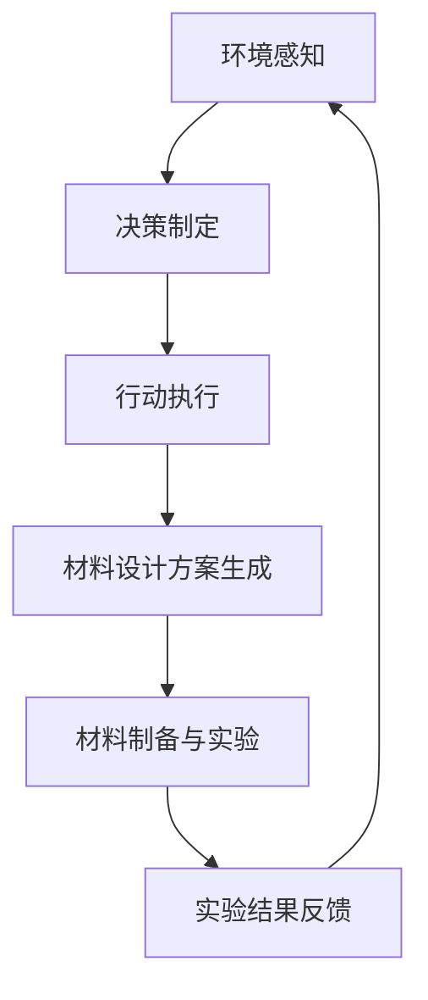

# AI Agent在智能材料设计中的实践

> 关键词：AI Agent、智能材料设计、机器学习、自动化设计、材料性能预测

> 摘要：本文聚焦于AI Agent在智能材料设计中的实践应用。详细介绍了AI Agent和智能材料设计的核心概念及其联系，阐述了相关核心算法原理和具体操作步骤，并给出了数学模型和公式。通过项目实战案例，展示了如何运用AI Agent进行智能材料设计的具体过程。同时，探讨了其实际应用场景，推荐了相关的学习资源、开发工具框架以及论文著作。最后总结了未来发展趋势与挑战，并提供了常见问题解答和扩展阅读参考资料，旨在为相关领域的研究者和开发者提供全面而深入的技术指导。

## 1. 背景介绍 
### 1.1 目的和范围
智能材料在现代科技领域的应用愈发广泛，如航空航天、生物医学、电子信息等。传统的材料设计方法往往依赖于经验和试错，效率低下且成本高昂。AI Agent作为一种具有自主决策和学习能力的智能实体，为智能材料设计带来了新的思路和方法。本文的目的在于深入探讨AI Agent在智能材料设计中的具体应用，涵盖从核心概念到实际操作的各个方面，为研究者和工程师提供一个全面的技术参考。范围包括AI Agent的基本原理、智能材料设计的流程、相关算法的实现以及实际项目案例的分析。

### 1.2 预期读者
本文预期读者包括材料科学领域的研究者、人工智能领域的开发者、对智能材料设计感兴趣的工程师以及相关专业的学生。对于材料科学研究者，本文提供了利用AI技术改进材料设计方法的新思路；对于人工智能开发者，展示了AI Agent在材料科学领域的具体应用场景；对于工程师和学生，有助于他们了解智能材料设计的前沿技术和实践方法。

### 1.3 文档结构概述
本文首先介绍了AI Agent和智能材料设计的背景知识，包括术语定义和相关概念解释。接着阐述了核心概念之间的联系，并给出了相应的文本示意图和Mermaid流程图。然后详细讲解了核心算法原理和具体操作步骤，同时给出了Python源代码示例。在数学模型部分，提供了相关公式并进行了详细讲解和举例说明。通过项目实战案例，展示了AI Agent在智能材料设计中的具体应用过程，包括开发环境搭建、源代码实现和代码解读。随后探讨了实际应用场景，推荐了学习资源、开发工具框架和相关论文著作。最后总结了未来发展趋势与挑战，提供了常见问题解答和扩展阅读参考资料。

### 1.4 术语表
#### 1.4.1 核心术语定义
- **AI Agent**：一种能够感知环境、自主决策并采取行动以实现特定目标的智能实体。它可以通过学习和推理来不断优化自身的行为。
- **智能材料设计**：利用先进的计算技术和人工智能方法，结合材料科学的知识，设计出具有特定性能和功能的材料的过程。
- **机器学习**：让计算机通过数据学习模式和规律，从而实现预测和决策的技术。在智能材料设计中，常用于材料性能预测和材料结构优化。
- **材料性能预测**：根据材料的组成、结构等信息，预测其物理、化学等性能的过程。

#### 1.4.2 相关概念解释
- **环境感知**：AI Agent通过传感器或数据接口获取周围环境的信息，例如材料的实验数据、文献资料等。
- **决策制定**：AI Agent根据感知到的信息，运用算法和模型进行推理和判断，制定出下一步的行动方案，如选择合适的材料成分或制备工艺。
- **行动执行**：AI Agent根据决策结果，采取相应的行动，例如生成材料设计方案、控制实验设备等。

#### 1.4.3 缩略词列表
- **ML**：Machine Learning（机器学习）
- **ANN**：Artificial Neural Network（人工神经网络）
- **GA**：Genetic Algorithm（遗传算法）

## 2. 核心概念与联系 

### 核心概念原理
#### AI Agent原理
AI Agent的核心原理基于感知 - 决策 - 行动的循环。它首先通过传感器或数据接口感知环境信息，将这些信息输入到内部的决策模型中。决策模型可以是基于规则的系统、机器学习模型或深度学习模型等。根据输入的信息，决策模型进行推理和计算，生成决策结果。最后，AI Agent根据决策结果采取相应的行动，改变环境状态。行动的结果又会被感知，形成一个闭环反馈系统，使得AI Agent能够不断学习和优化自己的行为。

#### 智能材料设计原理
智能材料设计的目标是根据特定的性能要求，设计出合适的材料组成和结构。其原理基于材料科学的基本理论，如量子力学、热力学等，结合计算模拟和实验数据。通过对材料的原子结构、化学键等微观信息进行分析和预测，建立材料结构与性能之间的关系模型。然后利用优化算法，在大量的可能材料组成和结构中搜索最优解，以满足设计要求。

### 架构的文本示意图
```plaintext
+----------------------+
|      AI Agent        |
|----------------------|
|  - 环境感知模块      |
|  - 决策制定模块      |
|  - 行动执行模块      |
+----------------------+
           |
           v
+----------------------+
|    智能材料设计系统  |
|----------------------|
|  - 材料数据库        |
|  - 性能预测模型      |
|  - 优化算法模块      |
+----------------------+
```

### Mermaid流程图


## 3. 核心算法原理 & 具体操作步骤 

### 核心算法原理
#### 机器学习算法在材料性能预测中的应用
以人工神经网络（ANN）为例，ANN是一种模仿人类神经系统的计算模型，由输入层、隐藏层和输出层组成。在材料性能预测中，输入层的神经元接收材料的特征信息，如化学成分、晶体结构等。隐藏层的神经元对输入信息进行非线性变换和特征提取，输出层的神经元输出预测的材料性能。ANN通过反向传播算法进行训练，不断调整神经元之间的连接权重，以最小化预测值与实际值之间的误差。

以下是一个简单的Python代码示例，使用Keras库实现一个简单的ANN模型进行材料性能预测：

```python
import numpy as np
from keras.models import Sequential
from keras.layers import Dense

# 生成一些示例数据
X = np.random.rand(100, 5)  # 输入特征，100个样本，每个样本有5个特征
y = np.random.rand(100, 1)  # 目标值，100个样本，每个样本有1个目标值

# 构建ANN模型
model = Sequential()
model.add(Dense(10, input_dim=5, activation='relu'))  # 输入层到第一个隐藏层
model.add(Dense(1, activation='linear'))  # 输出层

# 编译模型
model.compile(loss='mean_squared_error', optimizer='adam')

# 训练模型
model.fit(X, y, epochs=100, batch_size=10)

# 进行预测
new_X = np.random.rand(10, 5)  # 新的输入样本
predictions = model.predict(new_X)
print(predictions)
```

#### 优化算法在材料设计中的应用
遗传算法（GA）是一种基于生物进化原理的优化算法，常用于在复杂的搜索空间中寻找最优解。在材料设计中，GA可以用于搜索最优的材料组成和结构。GA的基本步骤包括初始化种群、评估适应度、选择、交叉和变异。种群是一组可能的材料设计方案，适应度评估函数根据材料的性能要求评估每个方案的优劣。选择操作根据适应度值选择优秀的方案进行繁殖，交叉操作将优秀方案的部分信息组合生成新的方案，变异操作对新方案进行随机修改，以增加种群的多样性。

以下是一个简单的Python代码示例，使用DEAP库实现一个简单的遗传算法进行材料设计优化：

```python
import random
from deap import base, creator, tools

# 定义适应度和个体类型
creator.create("FitnessMax", base.Fitness, weights=(1.0,))
creator.create("Individual", list, fitness=creator.FitnessMax)

# 定义基因范围和种群大小
gene_min = 0
gene_max = 1
pop_size = 50
gene_length = 10

# 初始化工具盒
toolbox = base.Toolbox()
toolbox.register("attr_float", random.uniform, gene_min, gene_max)
toolbox.register("individual", tools.initRepeat, creator.Individual, toolbox.attr_float, gene_length)
toolbox.register("population", tools.initRepeat, list, toolbox.individual)

# 定义适应度评估函数
def eval_fitness(individual):
    # 这里简单地将个体的基因值之和作为适应度
    return sum(individual),

toolbox.register("evaluate", eval_fitness)
toolbox.register("mate", tools.cxTwoPoint)
toolbox.register("mutate", tools.mutGaussian, mu=0, sigma=0.2, indpb=0.2)
toolbox.register("select", tools.selTournament, tournsize=3)

# 初始化种群
pop = toolbox.population(n=pop_size)

# 遗传算法主循环
NGEN = 40
for gen in range(NGEN):
    offspring = toolbox.select(pop, len(pop))
    offspring = list(map(toolbox.clone, offspring))

    for child1, child2 in zip(offspring[::2], offspring[1::2]):
        if random.random() < 0.5:
            toolbox.mate(child1, child2)
            del child1.fitness.values
            del child2.fitness.values

    for mutant in offspring:
        if random.random() < 0.2:
            toolbox.mutate(mutant)
            del mutant.fitness.values

    invalid_ind = [ind for ind in offspring if not ind.fitness.valid]
    fitnesses = map(toolbox.evaluate, invalid_ind)
    for ind, fit in zip(invalid_ind, fitnesses):
        ind.fitness.values = fit

    pop[:] = offspring

# 输出最优个体
best_ind = tools.selBest(pop, 1)[0]
print("Best individual:", best_ind)
print("Fitness:", best_ind.fitness.values[0])
```

### 具体操作步骤
1. **数据收集与预处理**：收集材料的相关数据，包括化学成分、晶体结构、性能测试结果等。对数据进行清洗、归一化等预处理操作，以提高模型的训练效果。
2. **模型选择与训练**：根据材料设计的任务和数据特点，选择合适的机器学习模型，如ANN、支持向量机等。使用预处理后的数据对模型进行训练，调整模型的参数以优化性能。
3. **优化算法配置**：选择合适的优化算法，如GA、粒子群算法等。配置优化算法的参数，如种群大小、交叉概率、变异概率等。
4. **材料设计搜索**：使用优化算法在材料设计的搜索空间中进行搜索，根据性能预测模型评估每个设计方案的优劣，不断迭代更新最优方案。
5. **实验验证与反馈**：根据搜索得到的最优方案制备材料，并进行实验测试。将实验结果反馈给AI Agent，更新模型和优化算法，以进一步提高材料设计的准确性和效率。

## 4. 数学模型和公式 & 详细讲解 & 举例说明 

### 人工神经网络的数学模型
#### 神经元模型
神经元是ANN的基本单元，其输入输出关系可以用以下公式表示：

$$y = f(\sum_{i=1}^{n} w_i x_i + b)$$

其中，$x_i$ 是输入信号，$w_i$ 是连接权重，$b$ 是偏置，$f$ 是激活函数。常见的激活函数有Sigmoid函数、ReLU函数等。

#### 反向传播算法
反向传播算法是用于训练ANN的核心算法，其目标是最小化预测值与实际值之间的误差。误差函数通常使用均方误差（MSE）：

$$E = \frac{1}{2m} \sum_{j=1}^{m} (y_j - \hat{y}_j)^2$$

其中，$m$ 是样本数量，$y_j$ 是实际值，$\hat{y}_j$ 是预测值。

反向传播算法通过链式法则计算误差对每个连接权重的梯度，并使用梯度下降法更新权重：

$$w_{i}^{new} = w_{i}^{old} - \alpha \frac{\partial E}{\partial w_{i}}$$

其中，$\alpha$ 是学习率。

### 举例说明
假设有一个简单的ANN模型，包含一个输入层（2个神经元）、一个隐藏层（3个神经元）和一个输出层（1个神经元）。输入信号 $x = [x_1, x_2]$，隐藏层的输出 $h = [h_1, h_2, h_3]$，输出层的输出 $y$。

隐藏层神经元的输入输出关系为：

$$h_j = f(\sum_{i=1}^{2} w_{ij} x_i + b_j), j = 1, 2, 3$$

输出层神经元的输入输出关系为：

$$y = f(\sum_{j=1}^{3} v_j h_j + c)$$

假设使用Sigmoid函数作为激活函数：

$$f(z) = \frac{1}{1 + e^{-z}}$$

在训练过程中，根据反向传播算法计算误差对权重的梯度，并更新权重，直到误差达到满意的程度。

### 遗传算法的数学模型
#### 适应度函数
适应度函数用于评估每个个体（材料设计方案）的优劣，通常根据材料的性能要求定义。例如，假设要设计一种具有最大强度的材料，适应度函数可以定义为：

$$F(x) = \text{Strength}(x)$$

其中，$x$ 是材料设计方案，$\text{Strength}(x)$ 是该方案对应的材料强度。

#### 选择操作
选择操作根据适应度值选择优秀的个体进行繁殖。常用的选择方法有轮盘赌选择、锦标赛选择等。以轮盘赌选择为例，每个个体被选择的概率为：

$$P_i = \frac{F(x_i)}{\sum_{j=1}^{N} F(x_j)}$$

其中，$N$ 是种群大小，$F(x_i)$ 是个体 $i$ 的适应度值。

#### 交叉操作
交叉操作将两个父代个体的部分信息组合生成子代个体。常见的交叉方法有单点交叉、多点交叉等。以单点交叉为例，随机选择一个交叉点，将两个父代个体在交叉点之后的部分进行交换。

#### 变异操作
变异操作对个体的基因进行随机修改，以增加种群的多样性。变异概率通常设置为一个较小的值。例如，对个体的某个基因进行高斯变异：

$$x_{i}^{new} = x_{i}^{old} + \epsilon$$

其中，$\epsilon$ 是一个服从高斯分布的随机变量。

### 举例说明
假设有一个种群包含5个个体，每个个体有4个基因。适应度函数为个体基因值之和。种群的初始状态如下：

| 个体编号 | 基因值 | 适应度值 |
|----------|--------|----------|
| 1        | [1, 2, 3, 4] | 10 |
| 2        | [2, 3, 4, 5] | 14 |
| 3        | [3, 4, 5, 6] | 18 |
| 4        | [4, 5, 6, 7] | 22 |
| 5        | [5, 6, 7, 8] | 26 |

使用轮盘赌选择方法，每个个体被选择的概率分别为：

$$P_1 = \frac{10}{10 + 14 + 18 + 22 + 26} = 0.1$$
$$P_2 = \frac{14}{10 + 14 + 18 + 22 + 26} = 0.14$$
$$P_3 = \frac{18}{10 + 14 + 18 + 22 + 26} = 0.18$$
$$P_4 = \frac{22}{10 + 14 + 18 + 22 + 26} = 0.22$$
$$P_5 = \frac{26}{10 + 14 + 18 + 22 + 26} = 0.26$$

假设选择个体2和个体4进行单点交叉，交叉点为第2个基因之后。交叉后的子代个体为：

| 子代个体编号 | 基因值 |
|--------------|--------|
| 1            | [2, 3, 6, 7] |
| 2            | [4, 5, 4, 5] |

假设对个体1的第3个基因进行高斯变异，变异后的个体为：

| 子代个体编号 | 基因值 |
|--------------|--------|
| 1            | [2, 3, 6 + \epsilon, 7] |

## 5. 项目实战：代码实际案例和详细解释说明 

### 5.1  开发环境搭建
#### 操作系统
推荐使用Linux系统，如Ubuntu 18.04及以上版本，因为Linux系统在科学计算和机器学习领域具有良好的支持和稳定性。

#### Python环境
安装Python 3.7及以上版本，可以使用Anaconda进行Python环境的管理。Anaconda集成了许多常用的科学计算和机器学习库，方便开发和调试。

#### 安装必要的库
使用以下命令安装必要的库：

```bash
pip install numpy pandas scikit-learn keras deap
```

### 5.2  源代码详细实现和代码解读
#### 数据准备
首先，我们需要准备材料的相关数据。假设我们有一个包含材料化学成分和力学性能的数据集，数据存储在CSV文件中。以下是读取数据并进行预处理的代码：

```python
import pandas as pd
from sklearn.preprocessing import StandardScaler

# 读取数据
data = pd.read_csv('material_data.csv')

# 分离特征和目标值
X = data.drop('Strength', axis=1).values
y = data['Strength'].values

# 数据标准化
scaler = StandardScaler()
X = scaler.fit_transform(X)
```

#### 构建ANN模型
使用Keras库构建一个简单的ANN模型进行材料强度预测：

```python
from keras.models import Sequential
from keras.layers import Dense

# 构建ANN模型
model = Sequential()
model.add(Dense(10, input_dim=X.shape[1], activation='relu'))
model.add(Dense(1, activation='linear'))

# 编译模型
model.compile(loss='mean_squared_error', optimizer='adam')

# 训练模型
model.fit(X, y, epochs=100, batch_size=10)
```

#### 使用遗传算法进行材料设计优化
使用DEAP库实现遗传算法，搜索最优的材料化学成分：

```python
import random
from deap import base, creator, tools

# 定义适应度和个体类型
creator.create("FitnessMax", base.Fitness, weights=(1.0,))
creator.create("Individual", list, fitness=creator.FitnessMax)

# 定义基因范围和种群大小
gene_min = -2
gene_max = 2
pop_size = 50
gene_length = X.shape[1]

# 初始化工具盒
toolbox = base.Toolbox()
toolbox.register("attr_float", random.uniform, gene_min, gene_max)
toolbox.register("individual", tools.initRepeat, creator.Individual, toolbox.attr_float, gene_length)
toolbox.register("population", tools.initRepeat, list, toolbox.individual)

# 定义适应度评估函数
def eval_fitness(individual):
    individual = np.array(individual).reshape(1, -1)
    individual = scaler.transform(individual)
    prediction = model.predict(individual)
    return prediction[0][0],

toolbox.register("evaluate", eval_fitness)
toolbox.register("mate", tools.cxTwoPoint)
toolbox.register("mutate", tools.mutGaussian, mu=0, sigma=0.2, indpb=0.2)
toolbox.register("select", tools.selTournament, tournsize=3)

# 初始化种群
pop = toolbox.population(n=pop_size)

# 遗传算法主循环
NGEN = 40
for gen in range(NGEN):
    offspring = toolbox.select(pop, len(pop))
    offspring = list(map(toolbox.clone, offspring))

    for child1, child2 in zip(offspring[::2], offspring[1::2]):
        if random.random() < 0.5:
            toolbox.mate(child1, child2)
            del child1.fitness.values
            del child2.fitness.values

    for mutant in offspring:
        if random.random() < 0.2:
            toolbox.mutate(mutant)
            del mutant.fitness.values

    invalid_ind = [ind for ind in offspring if not ind.fitness.valid]
    fitnesses = map(toolbox.evaluate, invalid_ind)
    for ind, fit in zip(invalid_ind, fitnesses):
        ind.fitness.values = fit

    pop[:] = offspring

# 输出最优个体
best_ind = tools.selBest(pop, 1)[0]
print("Best individual:", best_ind)
print("Predicted strength:", best_ind.fitness.values[0])
```

### 5.3  代码解读与分析
#### 数据准备部分
- 使用`pandas`库读取CSV文件中的数据，并分离特征和目标值。
- 使用`StandardScaler`对特征数据进行标准化处理，以提高模型的训练效果。

#### ANN模型构建部分
- 使用`Keras`库构建一个简单的ANN模型，包含一个输入层、一个隐藏层和一个输出层。
- 编译模型时，使用均方误差作为损失函数，Adam优化器进行参数更新。
- 训练模型时，设置训练轮数和批次大小。

#### 遗传算法部分
- 使用`DEAP`库实现遗传算法，定义适应度和个体类型。
- 初始化种群，每个个体表示一种材料化学成分的组合。
- 定义适应度评估函数，使用训练好的ANN模型预测材料强度作为适应度值。
- 进行选择、交叉和变异操作，不断迭代更新种群，直到达到最大迭代次数。
- 输出最优个体及其预测的材料强度。

## 6. 实际应用场景 
### 航空航天领域
在航空航天领域，对材料的性能要求非常高，如高强度、低密度、耐高温等。AI Agent可以通过分析大量的材料数据，设计出满足这些要求的新型材料。例如，在飞机发动机叶片的设计中，AI Agent可以根据发动机的工作条件和性能要求，优化叶片的材料成分和结构，提高叶片的强度和耐高温性能，从而提高发动机的效率和可靠性。

### 生物医学领域
在生物医学领域，智能材料的应用越来越广泛，如生物传感器、药物载体、组织工程支架等。AI Agent可以帮助设计具有特定生物活性和生物相容性的材料。例如，在药物载体的设计中，AI Agent可以根据药物的性质和治疗目标，优化载体的材料组成和结构，实现药物的精准释放和靶向输送，提高药物的治疗效果。

### 电子信息领域
在电子信息领域，对材料的电学性能和光学性能有严格的要求。AI Agent可以用于设计高性能的半导体材料、光学材料等。例如，在集成电路的制造中，AI Agent可以根据芯片的性能要求，优化半导体材料的掺杂浓度和晶体结构，提高芯片的运行速度和降低功耗。

## 7. 工具和资源推荐
### 7.1 学习资源推荐
#### 7.1.1 书籍推荐
- 《机器学习》（周志华）：全面介绍了机器学习的基本概念、算法和应用，是机器学习领域的经典教材。
- 《深度学习》（Ian Goodfellow等）：详细介绍了深度学习的原理、模型和应用，是深度学习领域的权威著作。
- 《材料科学基础》（胡赓祥等）：系统介绍了材料科学的基本理论和知识，是材料科学领域的基础教材。

#### 7.1.2 在线课程
- Coursera上的“Machine Learning”（Andrew Ng）：由机器学习领域的知名专家Andrew Ng教授授课，是学习机器学习的经典课程。
- edX上的“Deep Learning Specialization”（deeplearning.ai）：由深度学习领域的权威专家Geoffrey Hinton、Yoshua Bengio等授课，全面介绍了深度学习的各个方面。
- 中国大学MOOC上的“材料科学基础”：由国内知名高校的教授授课，系统介绍了材料科学的基本理论和知识。

#### 7.1.3 技术博客和网站
- Towards Data Science：提供了大量关于机器学习、人工智能等领域的技术文章和案例分析。
- arXiv：一个预印本平台，收录了大量关于材料科学、人工智能等领域的最新研究成果。
- 材料人网：专注于材料科学领域的技术交流和信息分享，提供了丰富的材料科学知识和行业动态。

### 7.2 开发工具框架推荐
#### 7.2.1 IDE和编辑器
- PyCharm：一款功能强大的Python集成开发环境，提供了代码编辑、调试、版本控制等功能，适合Python项目的开发。
- Jupyter Notebook：一种交互式的编程环境，支持Python、R等多种编程语言，适合数据探索和模型开发。

#### 7.2.2 调试和性能分析工具
- TensorBoard：TensorFlow提供的可视化工具，可以用于查看模型的训练过程、损失函数变化等信息，帮助调试和优化模型。
- Scikit-learn的`cross_val_score`：用于评估模型的性能和稳定性，通过交叉验证的方法计算模型的准确率、召回率等指标。

#### 7.2.3 相关框架和库
- TensorFlow：一个开源的机器学习框架，提供了丰富的工具和函数，支持深度学习模型的开发和训练。
- PyTorch：另一个流行的深度学习框架，具有动态图的特点，易于使用和调试。
- Scikit-learn：一个开源的机器学习库，提供了各种机器学习算法和工具，如分类、回归、聚类等。

### 7.3 相关论文著作推荐
#### 7.3.1 经典论文
- “Learning representations by back-propagating errors”（Rumelhart等）：首次提出了反向传播算法，是神经网络领域的经典论文。
- “A logical calculus of the ideas immanent in nervous activity”（McCulloch和Pitts）：提出了人工神经元的数学模型，为神经网络的发展奠定了基础。

#### 7.3.2 最新研究成果
- “AI-Enabled Autonomous Experimentation for Accelerated Materials Discovery”（Science）：介绍了利用AI Agent进行自主实验和材料发现的最新研究成果。
- “Machine Learning for Materials Science”（Nature Reviews Materials）：综述了机器学习在材料科学领域的应用和发展趋势。

#### 7.3.3 应用案例分析
- “Using Machine Learning to Predict Mechanical Properties of Materials”（Journal of Materials Science）：介绍了使用机器学习方法预测材料力学性能的应用案例。
- “AI-Enhanced Design of Smart Materials for Biomedical Applications”（Advanced Materials）：展示了AI Agent在生物医学智能材料设计中的应用案例。

## 8. 总结：未来发展趋势与挑战
### 未来发展趋势
#### 多学科融合
AI Agent在智能材料设计中的应用将与材料科学、物理学、化学、生物学等多个学科深度融合，形成跨学科的研究和发展趋势。通过整合不同学科的知识和方法，可以更全面地理解材料的结构和性能，设计出具有更复杂功能的智能材料。

#### 自主实验与智能决策
未来的AI Agent将具备更强的自主实验能力，能够自动控制实验设备进行材料制备和性能测试，并根据实验结果实时调整设计方案。同时，AI Agent的决策能力也将不断提高，能够在复杂的材料设计问题中做出更智能、更优化的决策。

#### 云端协作与共享
随着云计算和物联网技术的发展，AI Agent在智能材料设计中的应用将实现云端协作和共享。多个研究者和开发者可以通过云端平台共享数据、模型和算法，共同开展材料设计项目，提高研究效率和创新能力。

### 挑战
#### 数据质量与数量
AI Agent的性能很大程度上依赖于高质量的数据。然而，在材料科学领域，数据的收集和标注往往比较困难，数据质量参差不齐，数据量也相对较少。如何获取大量高质量的材料数据，并进行有效的预处理和标注，是当前面临的一个挑战。

#### 模型可解释性
许多机器学习模型，如深度学习模型，往往是黑盒模型，其决策过程难以解释。在智能材料设计中，需要对模型的决策结果进行解释，以便材料科学家理解和接受。如何提高模型的可解释性，是一个亟待解决的问题。

#### 计算资源与效率
AI Agent在智能材料设计中的应用需要大量的计算资源，尤其是在处理大规模数据和复杂模型时。如何提高计算效率，降低计算成本，是当前需要解决的另一个挑战。

## 9. 附录：常见问题与解答
### 问题1：AI Agent在智能材料设计中的准确性如何保证？
解答：可以通过以下几个方面保证AI Agent的准确性：
- 收集大量高质量的数据，并进行有效的预处理和标注。
- 选择合适的机器学习模型，并进行充分的训练和优化。
- 采用交叉验证等方法评估模型的性能和稳定性。
- 结合实验验证，不断调整和改进模型。

### 问题2：如何选择适合的机器学习模型进行材料性能预测？
解答：选择适合的机器学习模型需要考虑以下因素：
- 数据的特点，如数据量、数据类型、数据分布等。
- 任务的复杂度，如线性问题还是非线性问题。
- 模型的可解释性要求。
- 计算资源和时间限制。

一般来说，可以先尝试一些简单的模型，如线性回归、决策树等，然后再尝试更复杂的模型，如神经网络、支持向量机等。

### 问题3：遗传算法在材料设计中的收敛速度如何提高？
解答：可以通过以下方法提高遗传算法的收敛速度：
- 合理设置种群大小、交叉概率、变异概率等参数。
- 采用自适应的交叉和变异策略，根据种群的进化情况动态调整参数。
- 引入局部搜索算法，如模拟退火算法，对遗传算法的搜索结果进行局部优化。
- 利用先验知识初始化种群，减少搜索空间。

## 10. 扩展阅读 & 参考资料
### 扩展阅读
- 《人工智能：现代方法》（Stuart Russell等）：全面介绍了人工智能的基本概念、算法和应用，是人工智能领域的经典教材。
- 《材料基因组工程》（顾明远等）：介绍了材料基因组工程的基本原理和方法，以及在材料设计中的应用。

### 参考资料
- [TensorFlow官方文档](https://www.tensorflow.org/)
- [PyTorch官方文档](https://pytorch.org/)
- [Scikit-learn官方文档](https://scikit-learn.org/)
- [DEAP官方文档](https://deap.readthedocs.io/)

作者：AI天才研究院/AI Genius Institute & 禅与计算机程序设计艺术 /Zen And The Art of Computer Programming