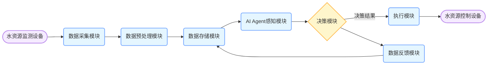

# AI Agent在智能水资源管理系统中的实践

> 关键词：AI Agent、智能水资源管理系统、水资源监测、决策优化、自动化控制

> 摘要：本文围绕AI Agent在智能水资源管理系统中的实践展开深入探讨。首先介绍了智能水资源管理系统的背景及引入AI Agent的重要性，详细阐述了AI Agent的核心概念、与水资源管理系统的联系及架构。接着分析了AI Agent在水资源管理中所运用的核心算法原理，并给出Python代码示例，同时讲解了相关数学模型和公式。通过实际项目案例，展示了如何搭建开发环境、实现源代码并进行解读分析。还探讨了AI Agent在智能水资源管理系统中的实际应用场景，推荐了相关学习资源、开发工具框架及论文著作。最后总结了未来发展趋势与挑战，提供了常见问题解答及扩展阅读参考资料，旨在为相关领域的研究和实践提供全面且深入的指导。

## 1. 背景介绍 
### 1.1 目的和范围
随着全球人口的增长和经济的发展，水资源的合理管理和有效利用变得至关重要。传统的水资源管理方式往往依赖于人工经验和简单的规则，难以应对复杂多变的水资源状况和日益增长的用水需求。智能水资源管理系统旨在利用先进的信息技术和人工智能技术，实现水资源的实时监测、精准预测、科学决策和自动化控制。

本文的目的是探讨AI Agent在智能水资源管理系统中的具体实践，包括其核心概念、算法原理、数学模型、实际应用案例等。范围涵盖了从水资源监测数据的处理到决策优化和自动化控制的整个流程，旨在为智能水资源管理系统的开发和应用提供理论支持和实践指导。

### 1.2 预期读者
本文预期读者包括从事水资源管理、人工智能、计算机科学等领域的科研人员、工程师、技术爱好者，以及对智能水资源管理系统感兴趣的相关行业从业者。对于希望了解AI Agent在水资源管理中应用的初学者，本文可以作为入门参考；对于有一定经验的专业人士，本文可以提供深入的技术分析和实践案例。

### 1.3 文档结构概述
本文将按照以下结构进行组织：
1. 背景介绍：阐述智能水资源管理系统的背景、目的和范围，以及预期读者和文档结构概述。
2. 核心概念与联系：介绍AI Agent的核心概念、与智能水资源管理系统的联系，以及相关的架构和流程。
3. 核心算法原理 & 具体操作步骤：分析AI Agent在水资源管理中所运用的核心算法原理，并给出Python代码示例和具体操作步骤。
4. 数学模型和公式 & 详细讲解 & 举例说明：讲解相关的数学模型和公式，并通过具体例子进行说明。
5. 项目实战：代码实际案例和详细解释说明：通过实际项目案例，展示如何搭建开发环境、实现源代码并进行解读分析。
6. 实际应用场景：探讨AI Agent在智能水资源管理系统中的实际应用场景。
7. 工具和资源推荐：推荐相关的学习资源、开发工具框架和论文著作。
8. 总结：未来发展趋势与挑战：总结AI Agent在智能水资源管理系统中的应用现状，分析未来发展趋势和面临的挑战。
9. 附录：常见问题与解答：提供常见问题的解答，帮助读者更好地理解和应用本文的内容。
10. 扩展阅读 & 参考资料：提供扩展阅读的建议和相关参考资料，方便读者进一步深入学习。

### 1.4 术语表
#### 1.4.1 核心术语定义
- **AI Agent（人工智能代理）**：是一种能够感知环境、自主决策并采取行动以实现特定目标的软件实体。在智能水资源管理系统中，AI Agent可以根据水资源监测数据进行分析和决策，实现水资源的优化管理。
- **智能水资源管理系统**：利用先进的信息技术和人工智能技术，对水资源进行实时监测、精准预测、科学决策和自动化控制的系统。
- **水资源监测数据**：包括水位、流量、水质等相关数据，是智能水资源管理系统进行决策的重要依据。
- **决策优化**：通过对水资源监测数据的分析和处理，制定出最优的水资源管理策略，以实现水资源的合理利用和有效保护。
- **自动化控制**：根据决策优化的结果，自动控制水资源的调配、灌溉等操作，提高水资源管理的效率和准确性。

#### 1.4.2 相关概念解释
- **多Agent系统（Multi-Agent System，MAS）**：由多个AI Agent组成的系统，这些Agent之间可以通过通信和协作来完成复杂的任务。在智能水资源管理系统中，多Agent系统可以实现不同区域、不同部门之间的水资源协同管理。
- **机器学习（Machine Learning）**：是一门多领域交叉学科，涉及概率论、统计学、逼近论、凸分析、算法复杂度理论等多门学科。它专门研究计算机怎样模拟或实现人类的学习行为，以获取新的知识或技能，重新组织已有的知识结构使之不断改善自身的性能。在智能水资源管理系统中，机器学习可以用于对水资源监测数据的分析和预测。
- **深度学习（Deep Learning）**：是机器学习的一个分支领域，它是一种基于对数据进行表征学习的方法。深度学习通过构建具有很多层的神经网络模型，自动从数据中学习特征和模式，从而实现对复杂数据的分析和处理。在智能水资源管理系统中，深度学习可以用于对水质的预测和评估。

#### 1.4.3 缩略词列表
- **AI**：Artificial Intelligence，人工智能
- **MAS**：Multi-Agent System，多Agent系统
- **ML**：Machine Learning，机器学习
- **DL**：Deep Learning，深度学习

## 2. 核心概念与联系 
### 2.1 AI Agent的核心概念
AI Agent是一种能够感知环境、自主决策并采取行动以实现特定目标的软件实体。它通常由感知模块、决策模块和执行模块组成。感知模块负责收集环境信息，决策模块根据感知到的信息进行分析和决策，执行模块则根据决策结果采取相应的行动。

在智能水资源管理系统中，AI Agent可以感知水资源监测数据，如水位、流量、水质等，根据这些数据进行分析和决策，例如判断是否需要进行水资源调配、是否需要采取水质净化措施等，并通过执行模块控制相应的设备，如水泵、阀门等，实现水资源的优化管理。

### 2.2 AI Agent与智能水资源管理系统的联系
AI Agent与智能水资源管理系统密切相关。智能水资源管理系统需要处理大量的水资源监测数据，并根据这些数据进行科学决策和自动化控制。AI Agent可以作为智能水资源管理系统的核心组成部分，通过感知水资源监测数据，运用先进的算法和模型进行分析和决策，为智能水资源管理系统提供智能化的支持。

具体来说，AI Agent可以在以下几个方面为智能水资源管理系统提供帮助：
- **数据处理和分析**：AI Agent可以对水资源监测数据进行实时处理和分析，提取有价值的信息，如水位变化趋势、水质污染程度等，为决策提供依据。
- **决策优化**：AI Agent可以根据水资源监测数据和预设的目标，运用优化算法制定出最优的水资源管理策略，如水资源调配方案、灌溉计划等。
- **自动化控制**：AI Agent可以根据决策结果，自动控制水资源的调配、灌溉等操作，提高水资源管理的效率和准确性。
- **协同合作**：在多Agent系统中，不同的AI Agent可以通过通信和协作，实现不同区域、不同部门之间的水资源协同管理，提高水资源管理的整体效益。

### 2.3 核心架构和流程示意图
以下是AI Agent在智能水资源管理系统中的核心架构和流程示意图：



该示意图展示了AI Agent在智能水资源管理系统中的核心架构和流程：
1. 水资源监测设备（如水位传感器、流量传感器、水质监测仪等）实时采集水资源监测数据。
2. 数据采集模块将采集到的数据传输到数据预处理模块，进行数据清洗、转换等预处理操作。
3. 预处理后的数据存储到数据存储模块中，以便后续分析和使用。
4. AI Agent的感知模块从数据存储模块中获取水资源监测数据。
5. 决策模块根据感知到的数据进行分析和决策，制定出最优的水资源管理策略。
6. 执行模块根据决策结果控制水资源控制设备（如水泵、阀门等），实现水资源的调配和控制。
7. 数据反馈模块将执行结果反馈到数据存储模块中，以便AI Agent进行学习和优化。

## 3. 核心算法原理 & 具体操作步骤 
### 3.1 核心算法原理
在智能水资源管理系统中，AI Agent可以运用多种算法进行数据处理、分析和决策。以下介绍几种常用的核心算法：

#### 3.1.1 机器学习算法 - 线性回归
线性回归是一种用于建立自变量和因变量之间线性关系的机器学习算法。在智能水资源管理系统中，线性回归可以用于预测水位、流量等水资源参数。

线性回归的基本模型可以表示为：

$$y = \theta_0 + \theta_1x_1 + \theta_2x_2 + \cdots + \theta_nx_n + \epsilon$$

其中，$y$ 是因变量，$x_1, x_2, \cdots, x_n$ 是自变量，$\theta_0, \theta_1, \theta_2, \cdots, \theta_n$ 是模型的参数，$\epsilon$ 是误差项。

线性回归的目标是通过最小化误差项的平方和来估计模型的参数，即最小化以下损失函数：

$$J(\theta) = \frac{1}{2m}\sum_{i=1}^{m}(h_{\theta}(x^{(i)}) - y^{(i)})^2$$

其中，$m$ 是样本数量，$h_{\theta}(x^{(i)})$ 是模型对第 $i$ 个样本的预测值，$y^{(i)}$ 是第 $i$ 个样本的真实值。

#### 3.1.2 深度学习算法 - 长短期记忆网络（LSTM）
长短期记忆网络（LSTM）是一种特殊的循环神经网络（RNN），能够处理序列数据中的长期依赖关系。在智能水资源管理系统中，LSTM可以用于对水位、流量等时间序列数据进行预测。

LSTM的核心结构包括输入门、遗忘门和输出门，通过这些门控机制可以有效地控制信息的流动和记忆。LSTM的基本单元可以表示为：

$$f_t = \sigma(W_f[h_{t-1}, x_t] + b_f)$$
$$i_t = \sigma(W_i[h_{t-1}, x_t] + b_i)$$
$$\tilde{C}_t = \tanh(W_C[h_{t-1}, x_t] + b_C)$$
$$C_t = f_t \odot C_{t-1} + i_t \odot \tilde{C}_t$$
$$o_t = \sigma(W_o[h_{t-1}, x_t] + b_o)$$
$$h_t = o_t \odot \tanh(C_t)$$

其中，$f_t$ 是遗忘门，$i_t$ 是输入门，$\tilde{C}_t$ 是候选记忆单元，$C_t$ 是记忆单元，$o_t$ 是输出门，$h_t$ 是隐藏状态，$\sigma$ 是 sigmoid 函数，$\tanh$ 是双曲正切函数，$W$ 是权重矩阵，$b$ 是偏置向量，$\odot$ 是逐元素相乘。

#### 3.1.3 优化算法 - 遗传算法
遗传算法是一种基于自然选择和遗传机制的优化算法，通过模拟生物进化过程来寻找最优解。在智能水资源管理系统中，遗传算法可以用于优化水资源调配方案、灌溉计划等。

遗传算法的基本步骤包括：
1. **初始化种群**：随机生成一组初始解，每个解表示一个可能的水资源管理方案。
2. **适应度评估**：根据预设的目标函数，计算每个解的适应度值，适应度值越高表示解越优。
3. **选择操作**：根据适应度值，选择一部分解作为父代，用于产生下一代解。
4. **交叉操作**：对父代解进行交叉操作，生成新的子代解。
5. **变异操作**：对子代解进行变异操作，引入新的基因，增加种群的多样性。
6. **更新种群**：用子代解替换部分父代解，更新种群。
7. **终止条件判断**：如果满足终止条件（如达到最大迭代次数、适应度值达到阈值等），则停止迭代，输出最优解；否则，返回步骤2继续迭代。

### 3.2 具体操作步骤及Python代码示例
以下是使用Python实现线性回归算法进行水位预测的具体操作步骤和代码示例：

#### 3.2.1 数据准备
首先，我们需要准备水位预测所需的数据。假设我们已经收集到了一段时间内的水位数据和相关的影响因素数据（如降雨量、蒸发量等），将其存储在一个CSV文件中。

```python
import pandas as pd

# 读取数据
data = pd.read_csv('water_level_data.csv')

# 分离自变量和因变量
X = data.drop('water_level', axis=1)
y = data['water_level']
```

#### 3.2.2 数据划分
将数据划分为训练集和测试集，用于模型的训练和评估。

```python
from sklearn.model_selection import train_test_split

# 划分训练集和测试集
X_train, X_test, y_train, y_test = train_test_split(X, y, test_size=0.2, random_state=42)
```

#### 3.2.3 模型训练
使用线性回归模型对训练数据进行训练。

```python
from sklearn.linear_model import LinearRegression

# 创建线性回归模型
model = LinearRegression()

# 训练模型
model.fit(X_train, y_train)
```

#### 3.2.4 模型评估
使用测试数据对训练好的模型进行评估，计算模型的预测误差。

```python
from sklearn.metrics import mean_squared_error

# 预测测试集数据
y_pred = model.predict(X_test)

# 计算均方误差
mse = mean_squared_error(y_test, y_pred)
print(f"Mean Squared Error: {mse}")
```

#### 3.2.5 模型预测
使用训练好的模型对新的水位数据进行预测。

```python
# 假设我们有一组新的自变量数据
new_X = [[100, 20, 30]]  # 示例数据

# 进行预测
new_y_pred = model.predict(new_X)
print(f"Predicted Water Level: {new_y_pred[0]}")
```

## 4. 数学模型和公式 & 详细讲解 & 举例说明 
### 4.1 线性回归数学模型和公式
线性回归的数学模型如前文所述：

$$y = \theta_0 + \theta_1x_1 + \theta_2x_2 + \cdots + \theta_nx_n + \epsilon$$

其中，$y$ 是因变量，$x_1, x_2, \cdots, x_n$ 是自变量，$\theta_0, \theta_1, \theta_2, \cdots, \theta_n$ 是模型的参数，$\epsilon$ 是误差项。

损失函数为：

$$J(\theta) = \frac{1}{2m}\sum_{i=1}^{m}(h_{\theta}(x^{(i)}) - y^{(i)})^2$$

其中，$m$ 是样本数量，$h_{\theta}(x^{(i)}) = \theta_0 + \theta_1x_1^{(i)} + \theta_2x_2^{(i)} + \cdots + \theta_nx_n^{(i)}$ 是模型对第 $i$ 个样本的预测值，$y^{(i)}$ 是第 $i$ 个样本的真实值。

为了最小化损失函数 $J(\theta)$，我们可以使用梯度下降法来更新模型的参数。梯度下降法的更新公式为：

$$\theta_j := \theta_j - \alpha\frac{\partial J(\theta)}{\partial \theta_j}$$

其中，$\alpha$ 是学习率，控制参数更新的步长。

### 4.2 详细讲解
线性回归的目标是找到一组最优的参数 $\theta_0, \theta_1, \theta_2, \cdots, \theta_n$，使得模型的预测值 $h_{\theta}(x)$ 尽可能接近真实值 $y$。损失函数 $J(\theta)$ 衡量了模型预测值与真实值之间的误差，我们的目标是通过调整参数 $\theta$ 来最小化损失函数。

梯度下降法是一种常用的优化算法，通过不断迭代更新参数 $\theta$，使得损失函数 $J(\theta)$ 逐渐减小。具体来说，梯度下降法每次迭代都会计算损失函数 $J(\theta)$ 关于参数 $\theta_j$ 的偏导数 $\frac{\partial J(\theta)}{\partial \theta_j}$，然后根据偏导数的方向和学习率 $\alpha$ 来更新参数 $\theta_j$。

### 4.3 举例说明
假设我们有一组简单的水位数据，包含降雨量 $x_1$ 和水位 $y$，数据如下：

| 降雨量 $x_1$ | 水位 $y$ |
| --- | --- |
| 10 | 20 |
| 20 | 30 |
| 30 | 40 |
| 40 | 50 |

我们可以使用线性回归模型来预测水位与降雨量之间的关系。假设线性回归模型为 $y = \theta_0 + \theta_1x_1$，我们的目标是找到最优的参数 $\theta_0$ 和 $\theta_1$。

首先，我们需要计算损失函数 $J(\theta)$ 关于参数 $\theta_0$ 和 $\theta_1$ 的偏导数：

$$\frac{\partial J(\theta)}{\partial \theta_0} = \frac{1}{m}\sum_{i=1}^{m}(h_{\theta}(x^{(i)}) - y^{(i)})$$
$$\frac{\partial J(\theta)}{\partial \theta_1} = \frac{1}{m}\sum_{i=1}^{m}(h_{\theta}(x^{(i)}) - y^{(i)})x_1^{(i)}$$

然后，使用梯度下降法更新参数：

$$\theta_0 := \theta_0 - \alpha\frac{\partial J(\theta)}{\partial \theta_0}$$
$$\theta_1 := \theta_1 - \alpha\frac{\partial J(\theta)}{\partial \theta_1}$$

假设初始参数 $\theta_0 = 0$，$\theta_1 = 0$，学习率 $\alpha = 0.01$，迭代次数为 100 次。以下是使用Python实现的代码：

```python
import numpy as np

# 数据
x = np.array([10, 20, 30, 40])
y = np.array([20, 30, 40, 50])
m = len(x)

# 初始化参数
theta_0 = 0
theta_1 = 0

# 学习率和迭代次数
alpha = 0.01
iterations = 100

# 梯度下降
for _ in range(iterations):
    h = theta_0 + theta_1 * x
    theta_0 = theta_0 - alpha * (1/m) * np.sum(h - y)
    theta_1 = theta_1 - alpha * (1/m) * np.sum((h - y) * x)

print(f"Optimal theta_0: {theta_0}")
print(f"Optimal theta_1: {theta_1}")
```

运行上述代码后，我们可以得到最优的参数 $\theta_0$ 和 $\theta_1$，从而得到水位与降雨量之间的线性关系。

## 5. 项目实战：代码实际案例和详细解释说明 
### 5.1 开发环境搭建
在进行智能水资源管理系统的项目实战之前，我们需要搭建相应的开发环境。以下是具体的搭建步骤：

#### 5.1.1 安装Python
Python是一种广泛使用的编程语言，具有丰富的科学计算和机器学习库。我们可以从Python官方网站（https://www.python.org/downloads/）下载并安装Python。建议安装Python 3.7及以上版本。

#### 5.1.2 安装必要的库
在项目中，我们需要使用一些Python库来处理数据、构建模型和进行可视化。可以使用以下命令安装这些库：

```bash
pip install pandas numpy scikit-learn matplotlib
```

- **pandas**：用于数据处理和分析。
- **numpy**：用于数值计算。
- **scikit-learn**：提供了丰富的机器学习算法和工具。
- **matplotlib**：用于数据可视化。

#### 5.1.3 安装开发工具
可以选择使用PyCharm、Jupyter Notebook等开发工具来编写和运行代码。PyCharm是一款功能强大的Python集成开发环境（IDE），适合大型项目的开发；Jupyter Notebook是一种交互式的开发环境，适合快速原型开发和数据探索。

### 5.2 源代码详细实现和代码解读
以下是一个使用线性回归模型进行水位预测的完整代码示例：

```python
import pandas as pd
import numpy as np
from sklearn.model_selection import train_test_split
from sklearn.linear_model import LinearRegression
from sklearn.metrics import mean_squared_error
import matplotlib.pyplot as plt

# 读取数据
data = pd.read_csv('water_level_data.csv')

# 分离自变量和因变量
X = data.drop('water_level', axis=1)
y = data['water_level']

# 划分训练集和测试集
X_train, X_test, y_train, y_test = train_test_split(X, y, test_size=0.2, random_state=42)

# 创建线性回归模型
model = LinearRegression()

# 训练模型
model.fit(X_train, y_train)

# 预测测试集数据
y_pred = model.predict(X_test)

# 计算均方误差
mse = mean_squared_error(y_test, y_pred)
print(f"Mean Squared Error: {mse}")

# 可视化预测结果
plt.scatter(y_test, y_pred)
plt.xlabel('Actual Water Level')
plt.ylabel('Predicted Water Level')
plt.title('Actual vs Predicted Water Level')
plt.show()
```

### 5.3 代码解读与分析
#### 5.3.1 数据读取和预处理
```python
import pandas as pd

# 读取数据
data = pd.read_csv('water_level_data.csv')

# 分离自变量和因变量
X = data.drop('water_level', axis=1)
y = data['water_level']
```
这段代码使用`pandas`库读取存储在CSV文件中的水位数据，并将自变量和因变量分离。

#### 5.3.2 数据划分
```python
from sklearn.model_selection import train_test_split

# 划分训练集和测试集
X_train, X_test, y_train, y_test = train_test_split(X, y, test_size=0.2, random_state=42)
```
这段代码使用`sklearn`库的`train_test_split`函数将数据划分为训练集和测试集，其中测试集占总数据的20%。

#### 5.3.3 模型训练
```python
from sklearn.linear_model import LinearRegression

# 创建线性回归模型
model = LinearRegression()

# 训练模型
model.fit(X_train, y_train)
```
这段代码使用`sklearn`库的`LinearRegression`类创建线性回归模型，并使用训练集数据对模型进行训练。

#### 5.3.4 模型评估
```python
from sklearn.metrics import mean_squared_error

# 预测测试集数据
y_pred = model.predict(X_test)

# 计算均方误差
mse = mean_squared_error(y_test, y_pred)
print(f"Mean Squared Error: {mse}")
```
这段代码使用训练好的模型对测试集数据进行预测，并计算预测结果的均方误差，用于评估模型的性能。

#### 5.3.5 可视化预测结果
```python
import matplotlib.pyplot as plt

# 可视化预测结果
plt.scatter(y_test, y_pred)
plt.xlabel('Actual Water Level')
plt.ylabel('Predicted Water Level')
plt.title('Actual vs Predicted Water Level')
plt.show()
```
这段代码使用`matplotlib`库绘制散点图，将实际水位和预测水位进行可视化，方便直观地观察模型的预测效果。

## 6. 实际应用场景 
### 6.1 水资源监测与预警
AI Agent可以实时感知水资源监测设备采集的数据，如水位、流量、水质等，通过对这些数据的分析和处理，及时发现水资源异常情况，如水位过高或过低、水质污染等，并发出预警信息，提醒相关人员采取相应的措施。

例如，当AI Agent监测到某一水库的水位超过警戒水位时，会立即向水库管理部门发送预警信息，同时自动调整水库的泄洪阀门，以确保水库的安全。

### 6.2 水资源调配优化
在水资源分布不均的情况下，AI Agent可以根据不同地区的水资源需求和供应情况，运用优化算法制定出最优的水资源调配方案。通过自动化控制设备，如水泵、阀门等，实现水资源的合理调配，提高水资源的利用效率。

例如，在干旱地区，AI Agent可以根据农田的灌溉需求和水源的供应情况，自动调整灌溉系统的开启时间和灌溉量，确保农作物得到足够的水分，同时避免水资源的浪费。

### 6.3 水质管理与保护
AI Agent可以对水质监测数据进行实时分析和评估，判断水质是否符合标准。当发现水质污染时，AI Agent可以自动启动水质净化设备，采取相应的净化措施，同时分析污染源，为水质保护提供决策支持。

例如，在污水处理厂，AI Agent可以根据污水的水质情况，自动调整处理工艺和药剂投放量，提高污水处理效率，确保处理后的水质达到排放标准。

### 6.4 洪水和干旱预测与应对
AI Agent可以利用历史数据和实时监测数据，运用机器学习和深度学习算法对洪水和干旱等自然灾害进行预测。提前发出预警信息，帮助相关部门做好应对准备，减少灾害造成的损失。

例如，在洪水来临之前，AI Agent可以预测洪水的淹没范围和水位变化情况，为居民的疏散和防洪措施的制定提供依据；在干旱期间，AI Agent可以预测干旱的持续时间和影响范围，指导农业生产和水资源的合理调配。

## 7. 工具和资源推荐
### 7.1 学习资源推荐
#### 7.1.1 书籍推荐
- 《Python机器学习》：本书详细介绍了Python在机器学习领域的应用，包括数据预处理、模型选择、评估和优化等方面的内容，适合初学者入门。
- 《深度学习》：由深度学习领域的三位先驱Ian Goodfellow、Yoshua Bengio和Aaron Courville撰写，全面介绍了深度学习的理论和实践，是深度学习领域的经典著作。
- 《人工智能：一种现代的方法》：本书是人工智能领域的权威教材，涵盖了人工智能的各个方面，包括搜索算法、知识表示、机器学习、自然语言处理等，适合有一定基础的读者深入学习。

#### 7.1.2 在线课程
- Coursera上的“机器学习”课程：由斯坦福大学教授Andrew Ng主讲，是机器学习领域的经典课程，内容涵盖了机器学习的基本概念、算法和应用。
- edX上的“深度学习”课程：由麻省理工学院（MIT）和哈佛大学等知名高校联合推出，深入介绍了深度学习的理论和实践，包括神经网络、卷积神经网络、循环神经网络等。
- 中国大学MOOC上的“人工智能基础”课程：由国内多所高校的教授联合授课，系统介绍了人工智能的基本概念、算法和应用，适合初学者入门。

#### 7.1.3 技术博客和网站
- Medium：是一个知名的技术博客平台，上面有很多关于人工智能、机器学习、深度学习等领域的优质文章。
- Towards Data Science：专注于数据科学和机器学习领域的技术博客，提供了很多实用的教程和案例。
- Kaggle：是一个数据科学竞赛平台，上面有很多开源的数据集和代码，同时也有很多数据科学和机器学习领域的优秀经验分享。

### 7.2 开发工具框架推荐
#### 7.2.1 IDE和编辑器
- PyCharm：是一款功能强大的Python集成开发环境（IDE），提供了代码编辑、调试、版本控制等一系列功能，适合大型项目的开发。
- Jupyter Notebook：是一种交互式的开发环境，支持多种编程语言，适合快速原型开发和数据探索。
- Visual Studio Code：是一款轻量级的代码编辑器，支持多种编程语言和插件扩展，具有丰富的功能和良好的用户体验。

#### 7.2.2 调试和性能分析工具
- PySnooper：是一个简单易用的Python调试工具，可以自动记录函数的执行过程和变量的值，方便调试代码。
- cProfile：是Python标准库中的性能分析工具，可以分析代码的执行时间和函数调用情况，帮助优化代码性能。
- TensorBoard：是TensorFlow提供的可视化工具，可以用于可视化深度学习模型的训练过程、损失函数变化、模型结构等。

#### 7.2.3 相关框架和库
- TensorFlow：是一个开源的深度学习框架，由Google开发和维护，提供了丰富的深度学习模型和工具，支持多种编程语言。
- PyTorch：是一个开源的深度学习框架，由Facebook开发和维护，具有简洁易用的接口和高效的计算性能，受到了很多研究人员和开发者的喜爱。
- Scikit-learn：是一个开源的机器学习库，提供了丰富的机器学习算法和工具，包括分类、回归、聚类、降维等，适合初学者入门。

### 7.3 相关论文著作推荐
#### 7.3.1 经典论文
- “Gradient-Based Learning Applied to Document Recognition”：由Yann LeCun等人发表，介绍了卷积神经网络（CNN）在手写数字识别中的应用，是深度学习领域的经典论文之一。
- “Long Short-Term Memory”：由Sepp Hochreiter和Jürgen Schmidhuber发表，提出了长短期记忆网络（LSTM），解决了传统循环神经网络（RNN）中的梯度消失问题。
- “Artificial Intelligence: A Modern Approach”：由Stuart Russell和Peter Norvig撰写，是人工智能领域的经典教材，对人工智能的各个方面进行了系统的介绍。

#### 7.3.2 最新研究成果
- 关注顶级学术会议和期刊，如NeurIPS（神经信息处理系统大会）、ICML（国际机器学习会议）、IJCAI（国际人工智能联合会议）、Journal of Artificial Intelligence Research（JAIR）等，这些会议和期刊上发表了很多人工智能领域的最新研究成果。
- 利用学术搜索引擎，如Google Scholar、Microsoft Academic等，搜索与AI Agent在智能水资源管理系统中的应用相关的最新论文。

#### 7.3.3 应用案例分析
- 查阅相关的行业报告和案例分析，了解AI Agent在智能水资源管理系统中的实际应用案例和效果。例如，一些水资源管理部门或企业会发布关于智能水资源管理系统的应用报告，介绍系统的建设背景、功能特点、应用效果等。

## 8. 总结：未来发展趋势与挑战
### 8.1 未来发展趋势
#### 8.1.1 多学科融合
AI Agent在智能水资源管理系统中的应用将越来越多地与其他学科进行融合，如地理学、水文学、生态学等。通过多学科的交叉融合，可以更全面地了解水资源系统的复杂性，提高水资源管理的科学性和有效性。

#### 8.1.2 智能化和自动化程度不断提高
随着人工智能技术的不断发展，AI Agent在智能水资源管理系统中的智能化和自动化程度将不断提高。未来，AI Agent将能够更加自主地感知环境、分析数据、做出决策和执行操作，实现水资源管理的全过程自动化。

#### 8.1.3 与物联网和大数据技术深度结合
物联网和大数据技术为智能水资源管理系统提供了丰富的数据来源和强大的数据处理能力。未来，AI Agent将与物联网和大数据技术深度结合，实现对水资源的实时监测、精准分析和智能决策。

#### 8.1.4 云服务和边缘计算的应用
云服务和边缘计算技术可以为智能水资源管理系统提供强大的计算资源和存储能力。未来，AI Agent将更多地采用云服务和边缘计算技术，实现数据的高效处理和分析，提高系统的响应速度和可靠性。

### 8.2 面临的挑战
#### 8.2.1 数据质量和安全性
智能水资源管理系统需要处理大量的水资源监测数据，数据的质量和安全性直接影响到系统的决策准确性和可靠性。然而，实际应用中数据可能存在缺失、错误、噪声等问题，同时数据的安全性也面临着威胁，如数据泄露、恶意攻击等。

#### 8.2.2 算法复杂度和计算资源需求
AI Agent在智能水资源管理系统中运用的一些算法，如深度学习算法，具有较高的复杂度和计算资源需求。在实际应用中，需要考虑算法的可扩展性和计算资源的限制，以确保系统的高效运行。

#### 8.2.3 模型可解释性和可信度
一些人工智能模型，如深度学习模型，具有较强的黑盒性，模型的决策过程和结果难以解释和理解。在智能水资源管理系统中，模型的可解释性和可信度非常重要，需要开发可解释的人工智能模型，提高模型的透明度和可信度。

#### 8.2.4 法律法规和伦理问题
AI Agent在智能水资源管理系统中的应用涉及到一些法律法规和伦理问题，如数据隐私保护、算法歧视、责任归属等。需要建立相应的法律法规和伦理准则，规范AI Agent的应用，保障公民的合法权益。

## 9. 附录：常见问题与解答
### 9.1 什么是AI Agent？
AI Agent是一种能够感知环境、自主决策并采取行动以实现特定目标的软件实体。它通常由感知模块、决策模块和执行模块组成，可以根据环境信息进行分析和决策，并通过执行模块采取相应的行动。

### 9.2 AI Agent在智能水资源管理系统中有哪些应用？
AI Agent在智能水资源管理系统中的应用包括水资源监测与预警、水资源调配优化、水质管理与保护、洪水和干旱预测与应对等方面。通过实时感知水资源监测数据，运用先进的算法和模型进行分析和决策，实现水资源的优化管理。

### 9.3 如何选择适合的AI算法？
选择适合的AI算法需要考虑多个因素，如数据类型、问题类型、算法复杂度、计算资源等。对于简单的线性关系问题，可以选择线性回归算法；对于处理序列数据的问题，可以选择长短期记忆网络（LSTM）等深度学习算法；对于优化问题，可以选择遗传算法等优化算法。

### 9.4 如何评估AI Agent在智能水资源管理系统中的性能？
可以使用多种指标来评估AI Agent在智能水资源管理系统中的性能，如均方误差（MSE）、均方根误差（RMSE）、准确率、召回率等。同时，还可以通过实际应用效果来评估AI Agent的性能，如水资源利用效率的提高、灾害损失的减少等。

### 9.5 如何保障智能水资源管理系统的数据安全？
保障智能水资源管理系统的数据安全可以采取以下措施：
1. 采用加密技术对数据进行加密，防止数据泄露。
2. 建立严格的访问控制机制，限制对数据的访问权限。
3. 定期对数据进行备份，防止数据丢失。
4. 加强网络安全防护，防止恶意攻击。

## 10. 扩展阅读 & 参考资料
### 10.1 扩展阅读
- 《智能水资源管理：理论与实践》：本书系统介绍了智能水资源管理的理论和方法，包括水资源监测、预测、决策和控制等方面的内容，适合对智能水资源管理系统感兴趣的读者深入学习。
- 《人工智能与水资源管理》：探讨了人工智能技术在水资源管理中的应用现状和发展趋势，分析了人工智能技术在解决水资源问题中的优势和挑战，为相关领域的研究和实践提供了有益的参考。

### 10.2 参考资料
- 相关学术论文和研究报告：可以查阅国内外相关学术期刊和会议上发表的论文，以及政府部门和科研机构发布的研究报告，了解AI Agent在智能水资源管理系统中的最新研究成果和应用案例。
- 行业标准和规范：参考相关的行业标准和规范，如水资源监测标准、水质评价标准等，确保智能水资源管理系统的开发和应用符合行业要求。

作者：AI天才研究院/AI Genius Institute & 禅与计算机程序设计艺术 /Zen And The Art of Computer Programming