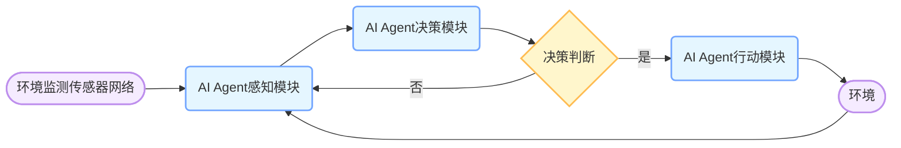

# AI Agent在智能环境污染溯源中的实践

> 关键词：AI Agent、智能环境污染溯源、多智能体系统、环境监测、机器学习

> 摘要：本文聚焦于AI Agent在智能环境污染溯源中的实践应用。首先介绍了相关背景，包括目的、预期读者等内容。详细阐述了AI Agent及环境污染溯源的核心概念与联系，给出了相应的文本示意图和Mermaid流程图。深入讲解了核心算法原理，并用Python代码进行示例。通过数学模型和公式进一步剖析其内在逻辑，并举例说明。以实际项目为例，展示了代码实现和解读。探讨了AI Agent在不同环境污染溯源场景中的应用，同时推荐了相关学习资源、开发工具框架和论文著作。最后总结了未来发展趋势与挑战，还给出了常见问题解答和扩展阅读参考资料，旨在为相关领域的研究和实践提供全面且深入的指导。

## 1. 背景介绍 
### 1.1 目的和范围
环境污染问题一直是全球关注的焦点，准确快速地溯源污染源对于有效治理和预防污染至关重要。传统的环境污染溯源方法存在效率低、精度有限等问题。本文章的目的在于探讨如何利用AI Agent技术提升环境污染溯源的智能化水平，实现更高效、准确的污染源定位和分析。

范围涵盖了AI Agent的基本概念、相关算法原理、数学模型，以及在不同类型环境污染（如大气污染、水污染等）溯源中的具体应用实践。同时，还将涉及开发环境搭建、代码实现和解读等技术细节，为相关领域的研究和实践提供全面的参考。

### 1.2 预期读者
本文预期读者包括环境科学领域的研究人员和从业者，他们希望借助先进的AI技术提升环境污染溯源的能力；计算机科学领域的开发者和研究人员，对AI Agent在实际场景中的应用感兴趣；以及对环境保护和人工智能交叉领域有学习需求的学生和爱好者。

### 1.3 文档结构概述
本文首先介绍相关背景信息，让读者了解研究的目的和范围。接着阐述AI Agent和环境污染溯源的核心概念与联系，为后续内容奠定基础。详细讲解核心算法原理和具体操作步骤，并给出Python代码示例。通过数学模型和公式进一步剖析其内在逻辑，并举例说明。以实际项目为例，展示代码实现和解读。探讨AI Agent在不同环境污染溯源场景中的应用。推荐相关学习资源、开发工具框架和论文著作。最后总结未来发展趋势与挑战，给出常见问题解答和扩展阅读参考资料。

### 1.4 术语表
#### 1.4.1 核心术语定义
- **AI Agent（人工智能智能体）**：是一种能够感知环境、根据自身的目标和规则进行决策，并采取行动以影响环境的智能实体。它可以是软件程序、机器人等不同形式。
- **环境污染溯源**：指通过对环境中污染物的特征、分布等信息进行分析，确定污染源的位置、类型和排放情况等过程。
- **多智能体系统（Multi - Agent System，MAS）**：由多个AI Agent组成的系统，这些智能体之间可以相互协作、通信，共同完成复杂的任务。

#### 1.4.2 相关概念解释
- **传感器网络**：由大量的传感器节点组成的网络，用于实时监测环境中的各种参数，如污染物浓度、温度、湿度等。AI Agent可以通过传感器网络获取环境信息。
- **机器学习算法**：一类让计算机从数据中学习模式和规律的算法，如决策树、神经网络等。AI Agent可以利用机器学习算法对环境数据进行分析和处理。

#### 1.4.3 缩略词列表
- **MAS**：Multi - Agent System（多智能体系统）
- **ML**：Machine Learning（机器学习）

## 2. 核心概念与联系 

### 核心概念原理
#### AI Agent原理
AI Agent通常由感知模块、决策模块和行动模块组成。感知模块负责从环境中获取信息，例如通过传感器网络收集环境污染物的浓度、气象数据等。决策模块根据感知到的信息和预设的目标、规则，运用机器学习算法或其他决策方法进行推理和判断，确定下一步的行动策略。行动模块则根据决策结果采取相应的行动，如调整监测设备的位置、向其他智能体发送信息等。

#### 环境污染溯源原理
环境污染溯源主要基于污染物的物理化学特性和传输规律。通过对环境中污染物的空间分布、时间变化等信息进行分析，结合气象条件、地理信息等因素，利用数学模型和算法推断污染源的位置和排放特征。例如，在大气污染溯源中，可以根据污染物的扩散模型和风向、风速等气象数据，逆向推算污染源的可能位置。

### 架构的文本示意图
```plaintext
环境监测传感器网络
    |
    | 数据传输
    v
AI Agent（感知模块）
    |
    | 数据处理
    v
AI Agent（决策模块）
    |
    | 决策结果
    v
AI Agent（行动模块）
    |
    | 行动反馈
    v
环境
```

### Mermaid流程图


## 3. 核心算法原理 & 具体操作步骤 

### 核心算法原理
在AI Agent用于环境污染溯源中，常用的算法之一是基于机器学习的分类算法，如决策树算法。决策树算法通过对历史环境数据进行学习，构建决策树模型，用于判断污染源的类型和位置。

决策树的基本思想是根据数据的特征属性进行划分，形成树状结构。每个内部节点表示一个特征属性上的测试，每个分支是一个测试输出，每个叶节点是一个类别或值。例如，在水污染溯源中，可以根据水中各种污染物的浓度、酸碱度等特征构建决策树，判断污染源是工业废水排放、生活污水排放还是农业面源污染。

### 具体操作步骤
1. **数据收集**：通过环境监测传感器网络收集环境数据，包括污染物浓度、气象数据、地理信息等。
2. **数据预处理**：对收集到的数据进行清洗、归一化等处理，去除噪声和异常值，将数据转换为适合机器学习算法处理的格式。
3. **模型训练**：使用预处理后的数据训练决策树模型。可以使用Python中的`scikit - learn`库来实现决策树模型的训练。
4. **模型评估**：使用测试数据集对训练好的模型进行评估，计算模型的准确率、召回率等指标，评估模型的性能。
5. **溯源应用**：将新的环境数据输入到训练好的模型中，根据模型的输出结果进行污染源的判断和溯源。

### Python源代码示例
```python
from sklearn.datasets import make_classification
from sklearn.model_selection import train_test_split
from sklearn.tree import DecisionTreeClassifier
from sklearn.metrics import accuracy_score

# 生成示例数据
X, y = make_classification(n_samples=1000, n_features=10, n_informative=5, n_redundant=0, random_state=42)

# 划分训练集和测试集
X_train, X_test, y_train, y_test = train_test_split(X, y, test_size=0.2, random_state=42)

# 创建决策树分类器
clf = DecisionTreeClassifier()

# 训练模型
clf.fit(X_train, y_train)

# 预测
y_pred = clf.predict(X_test)

# 计算准确率
accuracy = accuracy_score(y_test, y_pred)
print(f"模型准确率: {accuracy}")
```

## 4. 数学模型和公式 & 详细讲解 & 举例说明 

### 决策树的信息增益公式
在决策树的构建过程中，常用信息增益来选择最优的划分特征。信息增益的计算公式如下：

$$
IG(D, A) = H(D) - H(D|A)
$$

其中，$IG(D, A)$ 表示特征 $A$ 对数据集 $D$ 的信息增益，$H(D)$ 表示数据集 $D$ 的信息熵，$H(D|A)$ 表示在特征 $A$ 给定的条件下数据集 $D$ 的条件熵。

### 信息熵公式
信息熵用于衡量数据集的不确定性，计算公式为：

$$
H(D) = -\sum_{i = 1}^{k}p_i\log_2p_i
$$

其中，$D$ 是数据集，$k$ 是数据集 $D$ 中类别的数量，$p_i$ 是第 $i$ 类样本在数据集 $D$ 中所占的比例。

### 条件熵公式
条件熵用于衡量在某个特征给定的条件下数据集的不确定性，计算公式为：

$$
H(D|A) = \sum_{j = 1}^{v}\frac{|D_j|}{|D|}H(D_j)
$$

其中，$A$ 是特征，$v$ 是特征 $A$ 取值的数量，$D_j$ 是特征 $A$ 取值为第 $j$ 个值的样本子集，$|D|$ 表示数据集 $D$ 的样本数量，$|D_j|$ 表示子集 $D_j$ 的样本数量。

### 详细讲解
信息增益越大，说明使用该特征进行划分后，数据集的不确定性降低得越多，该特征越适合作为划分特征。在决策树的构建过程中，会遍历所有特征，计算每个特征的信息增益，选择信息增益最大的特征作为当前节点的划分特征，然后递归地对划分后的子集进行同样的操作，直到满足停止条件（如子集样本数量小于某个阈值、所有样本属于同一类别等）。

### 举例说明
假设有一个水污染数据集 $D$，包含 100 个样本，分为两类：工业废水污染（60 个样本）和生活污水污染（40 个样本）。

首先计算数据集 $D$ 的信息熵：
$$
p_1=\frac{60}{100}=0.6, p_2=\frac{40}{100}=0.4
$$
$$
H(D)=-0.6\log_20.6 - 0.4\log_20.4\approx 0.971
$$

假设我们有一个特征 $A$，取值为 $a_1$ 和 $a_2$。$A$ 取值为 $a_1$ 的样本子集 $D_1$ 有 30 个样本，其中工业废水污染样本 20 个，生活污水污染样本 10 个；$A$ 取值为 $a_2$ 的样本子集 $D_2$ 有 70 个样本，其中工业废水污染样本 40 个，生活污水污染样本 30 个。

计算子集 $D_1$ 和 $D_2$ 的信息熵：
对于 $D_1$：
$$
p_{11}=\frac{20}{30}\approx 0.667, p_{12}=\frac{10}{30}\approx 0.333
$$
$$
H(D_1)=-0.667\log_20.667 - 0.333\log_20.333\approx 0.918
$$

对于 $D_2$：
$$
p_{21}=\frac{40}{70}\approx 0.571, p_{22}=\frac{30}{70}\approx 0.429
$$
$$
H(D_2)=-0.571\log_20.571 - 0.429\log_20.429\approx 0.985
$$

计算条件熵 $H(D|A)$：
$$
H(D|A)=\frac{30}{100}H(D_1)+\frac{70}{100}H(D_2)=\frac{30}{100}\times0.918+\frac{70}{100}\times0.985\approx 0.963
$$

计算信息增益 $IG(D, A)$：
$$
IG(D, A)=H(D)-H(D|A)=0.971 - 0.963 = 0.008
$$

如果其他特征的信息增益都小于 0.008，则特征 $A$ 将被选为当前节点的划分特征。

## 5. 项目实战：代码实际案例和详细解释说明 

### 5.1  开发环境搭建
#### 操作系统
可以选择Windows、Linux（如Ubuntu）或macOS等主流操作系统。

#### Python环境
安装Python 3.6及以上版本。可以从Python官方网站（https://www.python.org/downloads/）下载安装包进行安装。

#### 安装必要的库
使用`pip`命令安装所需的库，主要包括`scikit - learn`、`pandas`、`numpy`等。
```bash
pip install scikit-learn pandas numpy
```

### 5.2  源代码详细实现和代码解读
以下是一个更完整的基于决策树的水污染溯源代码示例：

```python
import pandas as pd
from sklearn.model_selection import train_test_split
from sklearn.tree import DecisionTreeClassifier
from sklearn.metrics import accuracy_score, classification_report

# 读取数据集
data = pd.read_csv('water_pollution_data.csv')

# 分离特征和标签
X = data.drop('pollution_type', axis=1)
y = data['pollution_type']

# 划分训练集和测试集
X_train, X_test, y_train, y_test = train_test_split(X, y, test_size=0.2, random_state=42)

# 创建决策树分类器
clf = DecisionTreeClassifier()

# 训练模型
clf.fit(X_train, y_train)

# 预测
y_pred = clf.predict(X_test)

# 计算准确率
accuracy = accuracy_score(y_test, y_pred)
print(f"模型准确率: {accuracy}")

# 打印分类报告
print(classification_report(y_test, y_pred))
```

### 代码解读与分析
1. **数据读取**：使用`pandas`库的`read_csv`函数读取水污染数据集文件`water_pollution_data.csv`。该数据集应包含多个特征列和一个标签列`pollution_type`，表示污染类型。
2. **特征和标签分离**：使用`drop`方法将标签列从数据集中分离出来，得到特征矩阵`X`和标签向量`y`。
3. **数据集划分**：使用`train_test_split`函数将数据集划分为训练集和测试集，测试集占比为 20%。
4. **模型创建和训练**：创建一个决策树分类器`DecisionTreeClassifier`，并使用训练集数据对其进行训练。
5. **模型预测**：使用训练好的模型对测试集数据进行预测，得到预测结果`y_pred`。
6. **模型评估**：使用`accuracy_score`函数计算模型的准确率，并使用`classification_report`函数打印分类报告，包括精确率、召回率、F1 值等指标，用于全面评估模型的性能。

## 6. 实际应用场景 
### 大气污染溯源
在大气污染溯源中，AI Agent可以通过部署在城市不同位置的空气质量监测站收集大气污染物浓度、气象数据等信息。根据这些信息，AI Agent可以利用机器学习算法和大气扩散模型，实时分析污染物的来源和传输路径。例如，当某个地区出现雾霾天气时，AI Agent可以快速判断污染物是来自本地的工业排放、交通尾气，还是来自周边地区的远距离传输，为环境管理部门制定针对性的治理措施提供依据。

### 水污染溯源
对于水污染溯源，AI Agent可以结合水质监测传感器网络和地理信息系统（GIS）。传感器网络实时监测水体中的各种污染物指标，如化学需氧量（COD）、氨氮含量等。AI Agent根据这些数据和水体的水流方向、流域地形等信息，判断污染源是工业废水排放口、生活污水处理厂泄漏，还是农业面源污染。同时，AI Agent可以与其他智能体（如执法部门的智能设备）协作，及时采取措施对污染源进行处理。

### 土壤污染溯源
在土壤污染溯源方面，AI Agent可以利用土壤采样数据和卫星遥感图像。通过对土壤中重金属、有机污染物等含量的分析，结合土地利用类型、历史工业活动记录等信息，AI Agent可以构建土壤污染分布模型，确定污染源的可能位置和污染范围。此外，AI Agent还可以预测土壤污染的扩散趋势，为土壤修复和环境保护提供决策支持。

## 7. 工具和资源推荐
### 7.1 学习资源推荐
#### 7.1.1 书籍推荐
- 《机器学习》（周志华著）：这本书全面介绍了机器学习的基本概念、算法和应用，是机器学习领域的经典教材，对于理解AI Agent中使用的机器学习算法非常有帮助。
- 《人工智能：一种现代的方法》（Stuart Russell和Peter Norvig著）：涵盖了人工智能的各个方面，包括智能体、搜索算法、机器学习等内容，是人工智能领域的权威著作。

#### 7.1.2 在线课程
- Coursera上的“Machine Learning”（Andrew Ng教授授课）：这是一门非常经典的机器学习在线课程，讲解了机器学习的基本原理和算法，通过大量的实例和编程作业帮助学习者掌握相关知识。
- edX上的“Artificial Intelligence”：由知名高校的教授授课，系统介绍了人工智能的理论和实践，包括智能体的设计和应用。

#### 7.1.3 技术博客和网站
- Medium上的AI相关博客：有很多人工智能领域的专家和从业者在Medium上分享他们的研究成果和实践经验，对于了解AI Agent的最新发展动态非常有帮助。
- 开源中国（https://www.oschina.net/）：提供了丰富的开源项目和技术文章，涵盖了人工智能、机器学习等多个领域。

### 7.2 开发工具框架推荐
#### 7.2.1 IDE和编辑器
- PyCharm：是一款专门为Python开发设计的集成开发环境（IDE），具有强大的代码编辑、调试和项目管理功能，非常适合开发基于Python的AI Agent应用。
- Jupyter Notebook：是一个交互式的开发环境，支持Python等多种编程语言。它可以方便地进行代码编写、数据可视化和文档记录，适合进行机器学习模型的开发和实验。

#### 7.2.2 调试和性能分析工具
- pdb：Python自带的调试器，可以帮助开发者逐行调试代码，查找代码中的错误。
- cProfile：Python的性能分析工具，可以统计代码中各个函数的执行时间和调用次数，帮助开发者找出性能瓶颈。

#### 7.2.3 相关框架和库
- scikit - learn：是一个简单易用的机器学习库，提供了丰富的机器学习算法和工具，如分类、回归、聚类等算法，以及数据预处理、模型评估等功能。
- TensorFlow：是一个开源的深度学习框架，由Google开发。它可以用于构建和训练各种深度学习模型，如神经网络、卷积神经网络等，在AI Agent的决策模块中可以发挥重要作用。

### 7.3 相关论文著作推荐
#### 7.3.1 经典论文
- “Multi - Agent Systems: A Modern Approach to Distributed Artificial Intelligence”：介绍了多智能体系统的基本概念、理论和应用，是多智能体系统领域的经典论文。
- “Decision Trees for Pattern Recognition”：详细阐述了决策树算法的原理和应用，对于理解AI Agent中使用的决策树分类算法有很大的帮助。

#### 7.3.2 最新研究成果
可以通过IEEE Xplore、ACM Digital Library等学术数据库搜索关于AI Agent在环境污染溯源方面的最新研究论文，了解该领域的前沿技术和发展趋势。

#### 7.3.3 应用案例分析
一些环境科学和人工智能领域的期刊，如《Environmental Science & Technology》、《Artificial Intelligence in Environmental Science》等，会发表AI Agent在环境污染溯源中的应用案例分析文章，可以从中学习实际项目的经验和方法。

## 8. 总结：未来发展趋势与挑战
### 未来发展趋势
- **多智能体协作增强**：未来的AI Agent系统将更加注重多智能体之间的协作和通信。不同类型的智能体（如监测智能体、决策智能体、执行智能体等）将相互配合，形成一个更加高效的环境污染溯源体系。例如，监测智能体负责收集环境数据，决策智能体根据数据进行分析和决策，执行智能体负责采取实际行动对污染源进行处理。
- **与物联网深度融合**：随着物联网技术的不断发展，AI Agent将与物联网设备更加紧密地结合。大量的环境监测传感器将通过物联网连接到AI Agent系统，实现实时、全面的环境数据采集。同时，AI Agent可以通过物联网对智能设备进行远程控制，提高环境污染溯源和治理的效率。
- **结合深度学习技术**：深度学习在图像识别、自然语言处理等领域取得了巨大的成功，未来也将在AI Agent的环境污染溯源中得到更广泛的应用。例如，利用深度学习算法对卫星遥感图像进行分析，更准确地识别污染源和污染范围；通过深度学习模型对环境数据进行预测，提前预警可能发生的环境污染事件。

### 挑战
- **数据质量和隐私问题**：AI Agent的性能很大程度上依赖于高质量的环境数据。然而，环境数据的收集过程中可能存在噪声、误差和缺失值等问题，影响数据的质量。此外，环境数据涉及到个人和企业的隐私信息，如何在保证数据可用性的同时保护数据隐私是一个亟待解决的问题。
- **算法复杂度和可解释性**：随着AI Agent系统的不断复杂，所使用的算法也越来越复杂。一些深度学习算法虽然在性能上表现出色，但往往缺乏可解释性，难以理解模型的决策过程和依据。在环境污染溯源这样的关键领域，算法的可解释性对于决策者来说非常重要，因此需要研究更加可解释的算法。
- **跨领域知识融合**：环境污染溯源涉及到环境科学、计算机科学、数学等多个领域的知识。开发AI Agent系统需要具备跨领域的专业知识和技能，如何促进不同领域之间的知识融合和交流是一个挑战。

## 9. 附录：常见问题与解答
### 问题1：AI Agent在环境污染溯源中的准确率如何保证？
解答：要保证AI Agent在环境污染溯源中的准确率，需要从多个方面入手。首先，要确保数据的质量，对收集到的环境数据进行严格的清洗和预处理，去除噪声和异常值。其次，选择合适的算法和模型，并进行充分的训练和调优。可以使用交叉验证等方法对模型进行评估和选择，以提高模型的泛化能力。此外，还可以结合多种数据源和算法，综合分析判断污染源，提高溯源的准确率。

### 问题2：如何处理AI Agent系统中的数据隐私问题？
解答：处理数据隐私问题可以采用多种技术手段。例如，使用数据加密技术对敏感数据进行加密，确保数据在传输和存储过程中的安全性。采用差分隐私技术对数据进行处理，在保证数据可用性的同时，保护数据中个体的隐私信息。此外，还可以建立严格的数据访问控制机制，限制对敏感数据的访问权限，只有经过授权的人员才能访问和处理数据。

### 问题3：AI Agent在实际应用中如何与现有的环境监测系统集成？
解答：AI Agent可以通过接口与现有的环境监测系统进行集成。首先，需要明确现有的环境监测系统的数据格式和通信协议。然后，开发相应的接口程序，将环境监测系统的数据采集到AI Agent系统中。同时，AI Agent系统可以通过接口将决策结果反馈给环境监测系统或其他相关系统，实现数据的交互和共享。在集成过程中，要注意数据的兼容性和系统的稳定性。

## 10. 扩展阅读 & 参考资料
### 扩展阅读
- 《智能体系统与多智能体系统》：深入介绍了智能体和多智能体系统的理论和应用，对于进一步理解AI Agent的工作原理和设计方法有很大的帮助。
- 《环境数据科学》：探讨了如何利用数据科学的方法处理和分析环境数据，为AI Agent在环境污染溯源中的应用提供了更多的数据处理和分析思路。

### 参考资料
- 相关学术论文和研究报告：在IEEE Xplore、ACM Digital Library、Web of Science等学术数据库中搜索关于AI Agent和环境污染溯源的相关论文和研究报告，获取最新的研究成果和技术方法。
- 行业标准和规范：查阅环境科学和人工智能领域的相关行业标准和规范，如环境监测数据的采集和处理标准、人工智能算法的评估标准等，确保项目的实施符合行业要求。

作者：AI天才研究院/AI Genius Institute & 禅与计算机程序设计艺术 /Zen And The Art of Computer Programming