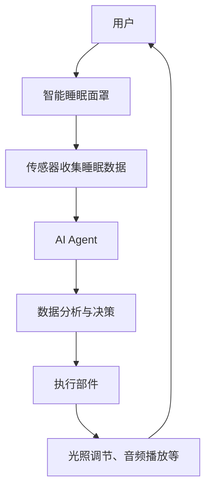

# AI Agent在智能睡眠面罩中的快速入睡辅助

> 关键词：AI Agent、智能睡眠面罩、快速入睡辅助、睡眠监测、数据分析

> 摘要：本文聚焦于AI Agent在智能睡眠面罩中的快速入睡辅助应用。通过对AI Agent和智能睡眠面罩的核心概念进行剖析，详细阐述了其相关算法原理和操作步骤，深入探讨了背后的数学模型。结合实际项目案例，展示了如何开发和实现这一应用，并分析了其在不同场景下的实际应用价值。同时，推荐了学习该领域所需的工具和资源，最后对其未来发展趋势与挑战进行了总结，旨在为相关技术人员和对睡眠科技感兴趣的读者提供全面且深入的技术解读。

## 1. 背景介绍 
### 1.1 目的和范围
在当今快节奏的生活中，睡眠问题日益成为困扰人们的重要因素。失眠、睡眠质量差等问题不仅影响人们的日常生活和工作效率，还可能引发一系列健康问题。智能睡眠面罩作为一种新兴的睡眠辅助设备，旨在通过各种技术手段改善人们的睡眠状况。而AI Agent的引入，为智能睡眠面罩带来了更强大的功能和更个性化的服务，能够根据用户的睡眠状态和需求，提供精准的快速入睡辅助。本文的目的在于深入探讨AI Agent在智能睡眠面罩中的应用原理、实现方法以及实际效果，范围涵盖从核心概念的解释到项目实战的全过程，为相关领域的研究和开发提供有价值的参考。

### 1.2 预期读者
本文预期读者包括但不限于计算机科学、人工智能、生物医学工程等领域的专业技术人员，对睡眠科技感兴趣的科研工作者，以及从事智能硬件开发的工程师。同时，对于关注自身睡眠健康，希望了解智能睡眠产品技术原理的普通消费者也具有一定的参考价值。

### 1.3 文档结构概述
本文将按照以下结构进行组织：首先介绍核心概念与联系，明确AI Agent和智能睡眠面罩的定义、原理以及它们之间的关联；接着详细阐述核心算法原理和具体操作步骤，通过Python代码进行说明；然后介绍相关的数学模型和公式，并举例说明其应用；之后通过项目实战展示代码的实际案例和详细解释；再探讨该技术的实际应用场景；随后推荐学习该领域所需的工具和资源；最后对未来发展趋势与挑战进行总结，并提供常见问题与解答以及扩展阅读和参考资料。

### 1.4 术语表
#### 1.4.1 核心术语定义
- **AI Agent（人工智能代理）**：是一种能够感知环境、自主决策并采取行动以实现特定目标的软件实体。在智能睡眠面罩中，AI Agent可以根据用户的睡眠数据进行分析和判断，提供相应的入睡辅助策略。
- **智能睡眠面罩**：一种集成了多种传感器和智能技术的睡眠辅助设备，能够监测用户的睡眠状态，并通过调节光照、声音等方式帮助用户快速入睡和改善睡眠质量。
- **快速入睡辅助**：指通过各种技术手段，如放松音乐、渐进式肌肉松弛引导、个性化光照调节等，帮助用户在较短时间内进入睡眠状态的方法。

#### 1.4.2 相关概念解释
- **睡眠监测**：通过传感器收集用户的生理信号，如心率、呼吸率、脑电波等，以评估用户的睡眠状态，包括入睡时间、睡眠深度、睡眠时长等。
- **数据分析**：对睡眠监测数据进行处理和分析，提取有价值的信息，为AI Agent的决策提供依据。
- **个性化服务**：根据用户的个体差异，如年龄、性别、睡眠习惯等，提供定制化的入睡辅助策略。

#### 1.4.3 缩略词列表
- **EEG（Electroencephalogram）**：脑电图，用于记录大脑电活动的技术。
- **HRV（Heart Rate Variability）**：心率变异性，反映心脏自主神经系统功能的指标。
- **EMG（Electromyogram）**：肌电图，用于记录肌肉电活动的技术。

## 2. 核心概念与联系 

### 核心概念原理
#### AI Agent原理
AI Agent通常由感知模块、决策模块和执行模块组成。感知模块负责收集环境信息，在智能睡眠面罩中，主要是通过各种传感器收集用户的睡眠数据，如心率、呼吸率、体动等。决策模块根据感知模块提供的信息，运用预设的算法和模型进行分析和判断，制定相应的策略。执行模块则将决策模块的策略转化为实际行动，如调节面罩的光照强度、播放特定的音乐等。

#### 智能睡眠面罩原理
智能睡眠面罩集成了多种传感器，如心率传感器、呼吸传感器、光照传感器等，用于实时监测用户的睡眠状态。同时，面罩还配备了光照调节装置、音频播放装置等执行部件，能够根据监测结果进行相应的调节。例如，当监测到用户处于清醒状态且心率较高时，面罩可以调节光照为柔和的暖色调，并播放舒缓的音乐，帮助用户放松身心，进入睡眠状态。

### 架构的文本示意图
```plaintext
智能睡眠面罩系统架构

用户 <----> 智能睡眠面罩
            |
            | 睡眠数据（心率、呼吸率等）
            |
            v
AI Agent
    |
    | 数据分析与决策
    |
    v
执行部件（光照调节、音频播放等）
```

### Mermaid流程图


## 3. 核心算法原理 & 具体操作步骤 

### 核心算法原理
在智能睡眠面罩中，AI Agent主要使用机器学习算法进行数据分析和决策。以下以一个简单的基于决策树的算法为例进行说明。

决策树是一种常用的机器学习算法，它通过对数据集进行递归划分，构建一棵决策树，每个内部节点表示一个属性上的测试，每个分支表示一个测试输出，每个叶节点表示一个类别或值。在智能睡眠面罩中，决策树可以根据用户的睡眠数据（如心率、呼吸率、体动等）判断用户的睡眠状态（清醒、浅睡眠、深睡眠等），并根据不同的睡眠状态制定相应的入睡辅助策略。

### Python源代码实现
```python
import pandas as pd
from sklearn.tree import DecisionTreeClassifier
from sklearn.model_selection import train_test_split
from sklearn.metrics import accuracy_score

# 假设我们有一个包含睡眠数据的数据集
# 数据集中包含心率、呼吸率、体动等特征，以及对应的睡眠状态标签
data = pd.read_csv('sleep_data.csv')

# 分离特征和标签
X = data.drop('sleep_state', axis=1)
y = data['sleep_state']

# 划分训练集和测试集
X_train, X_test, y_train, y_test = train_test_split(X, y, test_size=0.2, random_state=42)

# 创建决策树分类器
clf = DecisionTreeClassifier()

# 训练模型
clf.fit(X_train, y_train)

# 预测测试集
y_pred = clf.predict(X_test)

# 计算准确率
accuracy = accuracy_score(y_test, y_pred)
print(f"模型准确率: {accuracy}")

# 模拟实时数据进行预测
new_data = pd.DataFrame({
    'heart_rate': [70],
    'respiration_rate': [15],
    'body_movement': [0]
})
predicted_state = clf.predict(new_data)
print(f"预测的睡眠状态: {predicted_state[0]}")
```

### 具体操作步骤
1. **数据收集**：通过智能睡眠面罩的传感器收集用户的睡眠数据，包括心率、呼吸率、体动等，并将数据存储在本地或云端数据库中。
2. **数据预处理**：对收集到的数据进行清洗、归一化等预处理操作，以提高数据质量和模型的训练效果。
3. **模型训练**：使用预处理后的数据训练决策树模型，调整模型的参数，以提高模型的准确率。
4. **实时监测与决策**：在用户使用智能睡眠面罩时，实时收集睡眠数据，使用训练好的模型进行预测，根据预测结果制定相应的入睡辅助策略。
5. **策略执行**：将决策结果发送给智能睡眠面罩的执行部件，如调节光照强度、播放特定的音乐等，帮助用户快速入睡。

## 4. 数学模型和公式 & 详细讲解 & 举例说明 

### 决策树的信息熵和基尼不纯度
在决策树的构建过程中，常用的划分标准有信息熵和基尼不纯度。

#### 信息熵
信息熵是衡量数据集不确定性的指标，其计算公式为：
$$H(S)=-\sum_{i=1}^{n}p_i\log_2(p_i)$$
其中，$S$ 表示数据集，$n$ 表示数据集中的类别数，$p_i$ 表示第 $i$ 类数据在数据集中所占的比例。

信息增益是信息熵在划分前后的差值，用于衡量划分的有效性，其计算公式为：
$$IG(S,A)=H(S)-\sum_{v\in Values(A)}\frac{|S_v|}{|S|}H(S_v)$$
其中，$A$ 表示划分属性，$Values(A)$ 表示属性 $A$ 的取值集合，$S_v$ 表示属性 $A$ 取值为 $v$ 的子集。

#### 基尼不纯度
基尼不纯度也是衡量数据集不确定性的指标，其计算公式为：
$$Gini(S)=1-\sum_{i=1}^{n}p_i^2$$
基尼指数是基尼不纯度在划分前后的差值，用于衡量划分的有效性，其计算公式为：
$$GiniIndex(S,A)=\sum_{v\in Values(A)}\frac{|S_v|}{|S|}Gini(S_v)$$

### 举例说明
假设我们有一个包含 10 个样本的数据集，其中 6 个样本属于类别 1，4 个样本属于类别 2。则该数据集的信息熵为：
$$H(S)=-\frac{6}{10}\log_2(\frac{6}{10})-\frac{4}{10}\log_2(\frac{4}{10})\approx 0.971$$
该数据集的基尼不纯度为：
$$Gini(S)=1-(\frac{6}{10})^2-(\frac{4}{10})^2=0.48$$

假设我们使用某个属性 $A$ 对数据集进行划分，划分后得到两个子集 $S_1$ 和 $S_2$，其中 $S_1$ 包含 4 个样本，全部属于类别 1，$S_2$ 包含 6 个样本，其中 2 个属于类别 1，4 个属于类别 2。则子集 $S_1$ 的信息熵为：
$$H(S_1)=-\frac{4}{4}\log_2(\frac{4}{4})=0$$
子集 $S_2$ 的信息熵为：
$$H(S_2)=-\frac{2}{6}\log_2(\frac{2}{6})-\frac{4}{6}\log_2(\frac{4}{6})\approx 0.918$$
划分后的信息增益为：
$$IG(S,A)=0.971-\frac{4}{10}\times 0- \frac{6}{10}\times 0.918\approx 0.410$$

子集 $S_1$ 的基尼不纯度为：
$$Gini(S_1)=1-(\frac{4}{4})^2=0$$
子集 $S_2$ 的基尼不纯度为：
$$Gini(S_2)=1-(\frac{2}{6})^2-(\frac{4}{6})^2\approx 0.444$$
划分后的基尼指数为：
$$GiniIndex(S,A)=\frac{4}{10}\times 0+\frac{6}{10}\times 0.444\approx 0.266$$

通过比较信息增益和基尼指数的大小，可以选择最优的划分属性。

## 5. 项目实战：代码实际案例和详细解释说明 

### 5.1  开发环境搭建
#### 硬件环境
- 智能睡眠面罩开发板，集成了心率传感器、呼吸传感器、光照调节装置、音频播放装置等。
- 电脑，用于代码开发和调试。

#### 软件环境
- Python 3.x
- 相关库：pandas、scikit-learn、numpy 等

可以使用以下命令安装所需的库：
```sh
pip install pandas scikit-learn numpy
```

### 5.2  源代码详细实现和代码解读
```python
import pandas as pd
from sklearn.tree import DecisionTreeClassifier
import time

# 模拟智能睡眠面罩传感器数据收集
def collect_sleep_data():
    # 这里简单模拟收集心率、呼吸率和体动数据
    import random
    heart_rate = random.randint(60, 100)
    respiration_rate = random.randint(12, 20)
    body_movement = random.randint(0, 1)
    return {
        'heart_rate': heart_rate,
        'respiration_rate': respiration_rate,
        'body_movement': body_movement
    }

# 训练决策树模型
def train_model():
    # 假设我们有一个包含睡眠数据的数据集
    data = pd.read_csv('sleep_data.csv')
    X = data.drop('sleep_state', axis=1)
    y = data['sleep_state']
    clf = DecisionTreeClassifier()
    clf.fit(X, y)
    return clf

# 实时监测与决策
def real_time_monitoring(clf):
    while True:
        # 收集实时数据
        data = collect_sleep_data()
        new_data = pd.DataFrame([data])
        # 预测睡眠状态
        predicted_state = clf.predict(new_data)[0]
        print(f"当前睡眠状态: {predicted_state}")
        # 根据睡眠状态执行相应的入睡辅助策略
        if predicted_state == 'awake':
            print("播放舒缓音乐，调节光照为暖色调")
        elif predicted_state == 'light_sleep':
            print("保持当前状态，继续监测")
        elif predicted_state == 'deep_sleep':
            print("关闭光照和音乐，保持安静")
        time.sleep(5)  # 每隔5秒收集一次数据

if __name__ == "__main__":
    # 训练模型
    model = train_model()
    # 开始实时监测
    real_time_monitoring(model)
```

### 代码解读与分析
- **collect_sleep_data 函数**：模拟智能睡眠面罩的传感器数据收集过程，返回一个包含心率、呼吸率和体动数据的字典。
- **train_model 函数**：从 CSV 文件中读取睡眠数据，分离特征和标签，使用决策树分类器进行训练，并返回训练好的模型。
- **real_time_monitoring 函数**：在一个无限循环中，不断收集实时数据，使用训练好的模型进行预测，根据预测结果执行相应的入睡辅助策略。每隔 5 秒收集一次数据。
- **主程序**：调用 train_model 函数训练模型，然后调用 real_time_monitoring 函数开始实时监测。

## 6. 实际应用场景 
### 家庭使用
在家庭环境中，用户可以在晚上睡觉时佩戴智能睡眠面罩，AI Agent根据用户的睡眠状态提供个性化的入睡辅助。例如，当用户处于清醒状态时，面罩可以播放放松的音乐，调节光照为柔和的暖色调，帮助用户放松身心，快速入睡。在用户进入睡眠状态后，面罩可以根据睡眠深度自动调整光照和音乐的强度，确保用户有一个舒适的睡眠环境。

### 酒店住宿
对于经常出差或旅行的人来说，在酒店住宿时可能会因为环境陌生而难以入睡。智能睡眠面罩可以为用户提供熟悉的入睡辅助体验，帮助用户更快地适应新环境，提高睡眠质量。酒店可以为客人提供智能睡眠面罩，提升服务质量和客人的满意度。

### 医疗康复
在医疗康复领域，智能睡眠面罩可以用于帮助失眠患者和睡眠障碍患者改善睡眠状况。医生可以根据患者的睡眠数据，制定个性化的治疗方案，AI Agent可以根据治疗方案提供相应的入睡辅助。同时，面罩还可以实时监测患者的睡眠状态，为医生的治疗效果评估提供数据支持。

## 7. 工具和资源推荐
### 7.1 学习资源推荐
#### 7.1.1 书籍推荐
- 《机器学习》（周志华）：一本全面介绍机器学习算法和理论的经典教材，适合初学者和有一定基础的读者。
- 《Python机器学习实战》（Sebastian Raschka）：通过实际案例介绍如何使用Python实现机器学习算法，具有很强的实践性。
- 《人工智能：一种现代的方法》（Stuart Russell、Peter Norvig）：人工智能领域的权威著作，涵盖了AI的各个方面，包括搜索、推理、学习等。

#### 7.1.2 在线课程
- Coursera上的“机器学习”课程（Andrew Ng）：由斯坦福大学教授Andrew Ng授课，是学习机器学习的经典课程。
- edX上的“人工智能基础”课程：介绍人工智能的基本概念、算法和应用，适合初学者。
- Udemy上的“Python for Data Science and Machine Learning Bootcamp”：通过实际项目学习Python在数据科学和机器学习中的应用。

#### 7.1.3 技术博客和网站
- Medium：一个技术博客平台，上面有很多关于人工智能、机器学习的优秀文章。
- Towards Data Science：专注于数据科学和机器学习领域的博客，提供了很多实用的技术文章和案例分析。
- Kaggle：一个数据科学竞赛平台，上面有很多公开的数据集和优秀的解决方案，可以学习到很多实际应用中的技巧和方法。

### 7.2 开发工具框架推荐
#### 7.2.1 IDE和编辑器
- PyCharm：一款专业的Python集成开发环境，具有强大的代码编辑、调试和项目管理功能。
- Jupyter Notebook：一个交互式的开发环境，适合进行数据分析和模型训练的实验和演示。
- Visual Studio Code：一款轻量级的代码编辑器，支持多种编程语言，有丰富的插件可以扩展功能。

#### 7.2.2 调试和性能分析工具
- PDB：Python自带的调试器，可以帮助开发者定位代码中的问题。
- cProfile：Python的性能分析工具，可以分析代码的运行时间和函数调用情况。
- TensorBoard：TensorFlow的可视化工具，可以用于可视化模型的训练过程和性能指标。

#### 7.2.3 相关框架和库
- Scikit-learn：一个简单易用的机器学习库，提供了各种机器学习算法和工具，适合初学者和快速开发。
- TensorFlow：一个开源的深度学习框架，广泛应用于图像识别、自然语言处理等领域。
- PyTorch：另一个流行的深度学习框架，具有动态图的特点，易于使用和调试。

### 7.3 相关论文著作推荐
#### 7.3.1 经典论文
- “A Decision-Theoretic Generalization of On-Line Learning and an Application to Boosting”（Yoav Freund、Robert E. Schapire）：介绍了AdaBoost算法的原理和应用，是机器学习领域的经典论文。
- “Gradient-Based Learning Applied to Document Recognition”（Yann LeCun、Léon Bottou、Yoshua Bengio、Patrick Haffner）：介绍了卷积神经网络（CNN）在手写字符识别中的应用，为深度学习的发展奠定了基础。
- “Long Short-Term Memory”（Sepp Hochreiter、Jürgen Schmidhuber）：提出了长短期记忆网络（LSTM）的概念，解决了循环神经网络（RNN）中的梯度消失问题。

#### 7.3.2 最新研究成果
- 在IEEE Transactions on Neural Networks and Learning Systems、Journal of Artificial Intelligence Research等期刊上可以找到关于人工智能和机器学习的最新研究成果。
- 每年的NeurIPS、ICML、CVPR等顶级学术会议上也会发布很多前沿的研究论文。

#### 7.3.3 应用案例分析
- 在ACM SIGKDD、IEEE ICDM等会议上可以找到很多关于数据挖掘和机器学习应用案例的论文。
- 一些科技公司的官方博客也会分享他们在实际项目中的应用经验和案例分析。

## 8. 总结：未来发展趋势与挑战
### 未来发展趋势
- **更精准的睡眠监测**：随着传感器技术的不断发展，智能睡眠面罩将能够更精准地监测用户的睡眠状态，包括更详细的生理指标，如脑电波、眼动等，为AI Agent提供更丰富的数据支持。
- **个性化服务的进一步提升**：AI Agent将能够根据用户的长期睡眠数据和个体差异，提供更加个性化的入睡辅助策略，满足不同用户的需求。
- **与其他智能设备的联动**：智能睡眠面罩将与其他智能设备，如智能音箱、智能床垫等进行联动，实现更全面的睡眠监测和改善。例如，当智能睡眠面罩监测到用户睡眠质量不佳时，可以联动智能音箱播放特定的助眠声音，联动智能床垫调整舒适度。
- **医疗应用的拓展**：在医疗领域，智能睡眠面罩将不仅仅用于辅助入睡，还可以用于睡眠疾病的诊断和治疗。例如，通过对睡眠数据的分析，帮助医生更准确地诊断睡眠呼吸暂停综合征等疾病。

### 挑战
- **数据隐私和安全问题**：智能睡眠面罩收集的用户睡眠数据包含了大量的个人隐私信息，如何保证数据的安全和隐私是一个重要的挑战。需要采取有效的数据加密和存储措施，防止数据泄露。
- **算法的准确性和可靠性**：AI Agent的决策和策略制定依赖于算法的准确性和可靠性。如何提高算法的性能，减少误判和错误决策，是需要解决的问题。需要不断优化算法，进行大量的实验和验证。
- **用户体验的优化**：智能睡眠面罩的设计和功能需要充分考虑用户的体验。例如，面罩的舒适度、佩戴的便捷性等都会影响用户的使用意愿。需要在技术创新的同时，注重用户体验的优化。

## 9. 附录：常见问题与解答
### 1. 智能睡眠面罩会对人体产生辐射吗？
智能睡眠面罩所使用的传感器和电子设备产生的辐射都在安全范围内，一般不会对人体产生危害。例如，心率传感器和光照调节装置等产生的辐射强度都符合相关的安全标准。

### 2. AI Agent的决策是如何保证准确性的？
AI Agent的决策准确性主要依赖于大量的训练数据和优化的算法。通过对大量用户的睡眠数据进行训练和分析，不断调整算法的参数，可以提高决策的准确性。同时，还可以采用多模型融合和交叉验证等方法进一步提高准确性。

### 3. 智能睡眠面罩可以在旅行中使用吗？
可以。智能睡眠面罩通常具有便携性，方便在旅行中携带使用。而且，它可以帮助用户更快地适应新的睡眠环境，提高睡眠质量。

### 4. 如何保证智能睡眠面罩的电池续航能力？
可以通过优化硬件设计和降低功耗来提高电池续航能力。例如，采用低功耗的传感器和芯片，合理设计睡眠模式和工作模式的切换机制等。同时，也可以选择电池容量较大的面罩型号。

## 10. 扩展阅读 & 参考资料
### 扩展阅读
- 《睡眠革命》（阿里安娜·赫芬顿）：介绍了睡眠对健康和生活的重要性，以及如何改善睡眠质量的方法。
- 《深度学习》（Ian Goodfellow、Yoshua Bengio、Aaron Courville）：深入介绍了深度学习的理论和应用，适合对深度学习有一定基础的读者进一步学习。

### 参考资料
- 相关的学术论文和研究报告
- 智能睡眠面罩和AI Agent相关的技术文档和产品说明书
- 开源代码库和技术论坛上的相关讨论和资料

作者：AI天才研究院/AI Genius Institute & 禅与计算机程序设计艺术 /Zen And The Art of Computer Programming