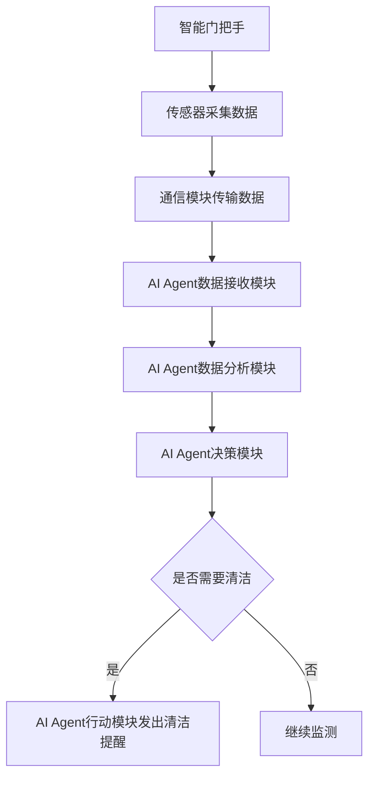

# AI Agent在智能门把手中的细菌检测

> 关键词：AI Agent、智能门把手、细菌检测、计算机视觉、传感器融合

> 摘要：本文深入探讨了AI Agent在智能门把手中的细菌检测应用。首先介绍了相关背景，包括目的范围、预期读者等。接着阐述了核心概念及联系，详细讲解了核心算法原理与具体操作步骤，给出了数学模型和公式并举例说明。通过项目实战展示了代码实现和解读，分析了实际应用场景。还推荐了相关工具和资源，最后总结了未来发展趋势与挑战，提供了常见问题解答和扩展阅读参考资料，旨在为该领域的研究和应用提供全面而深入的指导。

## 1. 背景介绍 
### 1.1 目的和范围
本研究的目的在于探索如何利用AI Agent技术实现智能门把手中的细菌检测。随着人们对公共卫生和个人健康的关注度不断提高，门把作为人们频繁接触的物品，其表面的细菌污染情况备受关注。通过AI Agent进行细菌检测，可以及时发现门把表面的细菌状况，提醒清洁人员进行清洁消毒，从而有效降低细菌传播的风险。

本研究的范围主要包括AI Agent在智能门把手中细菌检测的核心概念、算法原理、数学模型、实际应用案例以及相关工具和资源的推荐等方面。

### 1.2 预期读者
本文预期读者包括从事人工智能、物联网、生物医学工程等领域的研究人员和开发者，以及对智能门把手中细菌检测技术感兴趣的专业人士和爱好者。对于研究人员来说，可以从中获取该领域的最新研究动态和技术方法；对于开发者而言，能够学习到具体的算法实现和项目开发经验；对于专业人士和爱好者，可以了解到该技术的应用前景和实际意义。

### 1.3 文档结构概述
本文共分为十个部分。第一部分为背景介绍，阐述了研究的目的、范围、预期读者和文档结构。第二部分介绍核心概念与联系，包括AI Agent、智能门把手和细菌检测的相关概念及其相互关系，并给出文本示意图和Mermaid流程图。第三部分讲解核心算法原理和具体操作步骤，通过Python源代码详细阐述。第四部分给出数学模型和公式，并进行详细讲解和举例说明。第五部分进行项目实战，包括开发环境搭建、源代码实现和代码解读。第六部分分析实际应用场景。第七部分推荐相关的工具和资源，包括学习资源、开发工具框架和相关论文著作。第八部分总结未来发展趋势与挑战。第九部分为附录，解答常见问题。第十部分提供扩展阅读和参考资料。

### 1.4 术语表
#### 1.4.1 核心术语定义
- **AI Agent**：人工智能代理，是一种能够感知环境、做出决策并采取行动以实现特定目标的智能实体。在本文中，AI Agent用于处理智能门把手中的细菌检测数据，做出是否需要清洁的决策。
- **智能门把手**：集成了各种传感器和通信模块的门把手，能够实时感知门把表面的物理和化学信息，并将数据传输到AI Agent进行处理。
- **细菌检测**：通过各种技术手段检测门把表面细菌的种类、数量和分布情况的过程。

#### 1.4.2 相关概念解释
- **计算机视觉**：让计算机从图像或视频中提取信息、理解场景的技术。在细菌检测中，计算机视觉可以用于识别门把表面的细菌图像特征。
- **传感器融合**：将多种不同类型的传感器数据进行整合和处理，以获得更全面、准确的信息。在智能门把手中，传感器融合可以将光学传感器、化学传感器等的数据结合起来，提高细菌检测的准确性。

#### 1.4.3 缩略词列表
- **AI**：Artificial Intelligence，人工智能
- **IoT**：Internet of Things，物联网
- **CNN**：Convolutional Neural Network，卷积神经网络

## 2. 核心概念与联系 

### 核心概念原理
#### AI Agent
AI Agent是一种基于人工智能技术的智能实体，它具有感知、决策和行动的能力。在智能门把手中的细菌检测应用中，AI Agent的工作流程如下：
1. **感知**：通过智能门把手上的各种传感器（如光学传感器、化学传感器等）收集门把表面的相关数据，包括图像、化学物质浓度等。
2. **决策**：对收集到的数据进行分析和处理，利用机器学习算法（如卷积神经网络、支持向量机等）判断门把表面是否存在细菌以及细菌的污染程度。
3. **行动**：根据决策结果，AI Agent可以采取相应的行动，如发出清洁提醒、控制消毒设备进行消毒等。

#### 智能门把手
智能门把手是集成了多种传感器和通信模块的物联网设备。它的主要功能是实时感知门把表面的物理和化学信息，并将这些信息传输到AI Agent进行处理。智能门把手通常包括以下几个部分：
1. **传感器模块**：用于收集门把表面的各种信息，如光学传感器可以采集门把表面的图像，化学传感器可以检测门把表面的化学物质浓度。
2. **通信模块**：用于将传感器收集到的数据传输到AI Agent或其他设备，常见的通信方式包括蓝牙、Wi-Fi等。
3. **控制模块**：用于控制智能门把手的各种功能，如开关门、发出提示音等。

#### 细菌检测
细菌检测是通过各种技术手段检测门把表面细菌的种类、数量和分布情况的过程。常见的细菌检测方法包括：
1. **光学检测**：利用光学显微镜或摄像头采集门把表面的图像，通过图像处理和分析技术识别细菌的形态和数量。
2. **化学检测**：利用化学传感器检测门把表面的化学物质浓度，通过分析化学物质的种类和含量来推断细菌的存在和数量。

### 架构的文本示意图
```plaintext
智能门把手
|-- 传感器模块
|   |-- 光学传感器
|   |-- 化学传感器
|-- 通信模块
|-- 控制模块

AI Agent
|-- 数据接收模块
|-- 数据分析模块
|   |-- 机器学习算法
|-- 决策模块
|-- 行动模块
```

### Mermaid流程图


## 3. 核心算法原理 & 具体操作步骤 

### 核心算法原理
在智能门把手中的细菌检测中，我们可以使用卷积神经网络（CNN）作为核心算法。CNN是一种专门用于处理具有网格结构数据（如图像）的深度学习模型，它具有自动提取图像特征的能力，非常适合用于细菌图像的识别和分类。

CNN的基本结构包括卷积层、池化层和全连接层。卷积层通过卷积核在输入图像上滑动，提取图像的局部特征；池化层用于降低特征图的维度，减少计算量；全连接层将提取的特征进行整合，输出最终的分类结果。

### 具体操作步骤
#### 数据收集
使用智能门把手上的光学传感器采集门把表面的细菌图像数据。为了提高模型的泛化能力，需要收集不同环境、不同细菌种类的图像数据。

#### 数据预处理
对收集到的图像数据进行预处理，包括图像裁剪、缩放、归一化等操作，以保证输入到CNN模型中的图像数据具有一致的格式和尺寸。

#### 模型训练
使用预处理后的图像数据对CNN模型进行训练。在训练过程中，需要将图像数据分为训练集和验证集，通过不断调整模型的参数，使得模型在验证集上的准确率达到最优。

#### 模型评估
使用测试集对训练好的CNN模型进行评估，计算模型的准确率、召回率、F1值等指标，评估模型的性能。

#### 模型部署
将训练好的CNN模型部署到AI Agent中，实时处理智能门把手上的细菌图像数据，做出是否需要清洁的决策。

### Python源代码实现
```python
import tensorflow as tf
from tensorflow.keras import layers, models
import numpy as np
from sklearn.model_selection import train_test_split

# 数据收集和预处理
# 假设我们已经有了一个包含细菌图像数据和标签的数据集
# 这里使用随机生成的数据作为示例
num_samples = 1000
image_size = 64
num_classes = 2

# 随机生成图像数据
images = np.random.rand(num_samples, image_size, image_size, 3).astype(np.float32)
labels = np.random.randint(0, num_classes, num_samples)

# 划分训练集和测试集
train_images, test_images, train_labels, test_labels = train_test_split(images, labels, test_size=0.2, random_state=42)

# 构建CNN模型
model = models.Sequential([
    layers.Conv2D(32, (3, 3), activation='relu', input_shape=(image_size, image_size, 3)),
    layers.MaxPooling2D((2, 2)),
    layers.Conv2D(64, (3, 3), activation='relu'),
    layers.MaxPooling2D((2, 2)),
    layers.Conv2D(64, (3, 3), activation='relu'),
    layers.Flatten(),
    layers.Dense(64, activation='relu'),
    layers.Dense(num_classes, activation='softmax')
])

# 编译模型
model.compile(optimizer='adam',
              loss='sparse_categorical_crossentropy',
              metrics=['accuracy'])

# 训练模型
model.fit(train_images, train_labels, epochs=10, validation_data=(test_images, test_labels))

# 评估模型
test_loss, test_acc = model.evaluate(test_images, test_labels)
print(f"Test accuracy: {test_acc}")

# 部署模型
# 在实际应用中，需要将模型保存并加载到AI Agent中进行实时处理
model.save('bacteria_detection_model.h5')
```

## 4. 数学模型和公式 & 详细讲解 & 举例说明 

### 卷积层数学模型
卷积层是CNN的核心层，它通过卷积核在输入图像上滑动，进行卷积操作，提取图像的局部特征。卷积操作的数学公式如下：

$$y_{i,j}^k = \sum_{m=0}^{M-1} \sum_{n=0}^{N-1} x_{i+m,j+n}^l \cdot w_{m,n}^{k,l} + b^k$$

其中，$y_{i,j}^k$ 表示输出特征图中第 $k$ 个通道的第 $(i,j)$ 个位置的值，$x_{i+m,j+n}^l$ 表示输入特征图中第 $l$ 个通道的第 $(i+m,j+n)$ 个位置的值，$w_{m,n}^{k,l}$ 表示卷积核中第 $(m,n)$ 个位置的权重，$b^k$ 表示第 $k$ 个通道的偏置，$M$ 和 $N$ 分别表示卷积核的高度和宽度。

### 池化层数学模型
池化层用于降低特征图的维度，减少计算量。常见的池化操作有最大池化和平均池化。最大池化的数学公式如下：

$$y_{i,j}^k = \max_{m=0}^{M-1} \max_{n=0}^{N-1} x_{i \cdot s + m,j \cdot s + n}^k$$

其中，$y_{i,j}^k$ 表示输出特征图中第 $k$ 个通道的第 $(i,j)$ 个位置的值，$x_{i \cdot s + m,j \cdot s + n}^k$ 表示输入特征图中第 $k$ 个通道的第 $(i \cdot s + m,j \cdot s + n)$ 个位置的值，$s$ 表示池化操作的步长，$M$ 和 $N$ 分别表示池化窗口的高度和宽度。

### 全连接层数学模型
全连接层将提取的特征进行整合，输出最终的分类结果。全连接层的数学公式如下：

$$y_j = \sum_{i=0}^{I-1} x_i \cdot w_{i,j} + b_j$$

其中，$y_j$ 表示输出层中第 $j$ 个神经元的值，$x_i$ 表示输入层中第 $i$ 个神经元的值，$w_{i,j}$ 表示输入层第 $i$ 个神经元到输出层第 $j$ 个神经元的权重，$b_j$ 表示输出层第 $j$ 个神经元的偏置，$I$ 表示输入层的神经元数量。

### 举例说明
假设我们有一个输入图像的尺寸为 $4 \times 4$，通道数为 1，卷积核的尺寸为 $2 \times 2$，步长为 1。输入图像和卷积核的值如下：

输入图像 $x$：
$$
\begin{bmatrix}
1 & 2 & 3 & 4 \\
5 & 6 & 7 & 8 \\
9 & 10 & 11 & 12 \\
13 & 14 & 15 & 16
\end{bmatrix}
$$

卷积核 $w$：
$$
\begin{bmatrix}
1 & 0 \\
0 & 1
\end{bmatrix}
$$

偏置 $b = 1$

首先，我们将卷积核在输入图像上滑动，进行卷积操作。以左上角的卷积为例：

$$y_{0,0} = x_{0,0} \cdot w_{0,0} + x_{0,1} \cdot w_{0,1} + x_{1,0} \cdot w_{1,0} + x_{1,1} \cdot w_{1,1} + b$$
$$= 1 \cdot 1 + 2 \cdot 0 + 5 \cdot 0 + 6 \cdot 1 + 1 = 8$$

按照同样的方法，我们可以计算出输出特征图中其他位置的值。最终得到的输出特征图尺寸为 $3 \times 3$。

## 5. 项目实战：代码实际案例和详细解释说明 

### 5.1  开发环境搭建
#### 硬件环境
- **智能门把手**：选择一款支持多种传感器（如光学传感器、化学传感器）和通信模块（如蓝牙、Wi-Fi）的智能门把手。
- **开发板**：可以选择树莓派等开发板作为AI Agent的运行平台，安装相应的操作系统（如Raspbian）。

#### 软件环境
- **Python**：安装Python 3.x版本，建议使用Anaconda进行Python环境的管理。
- **深度学习框架**：安装TensorFlow或PyTorch等深度学习框架，用于构建和训练CNN模型。
- **图像处理库**：安装OpenCV等图像处理库，用于图像数据的预处理。

### 5.2  源代码详细实现和代码解读
```python
import tensorflow as tf
from tensorflow.keras import layers, models
import cv2
import numpy as np
import serial

# 加载训练好的模型
model = models.load_model('bacteria_detection_model.h5')

# 初始化串口通信，用于与智能门把手通信
ser = serial.Serial('/dev/ttyUSB0', 9600)

# 定义图像预处理函数
def preprocess_image(image):
    image = cv2.resize(image, (64, 64))
    image = image.astype(np.float32) / 255.0
    image = np.expand_dims(image, axis=0)
    return image

while True:
    # 从串口读取图像数据
    if ser.in_waiting:
        # 这里假设串口传输的是图像文件的路径
        image_path = ser.readline().decode().strip()
        try:
            # 读取图像
            image = cv2.imread(image_path)
            if image is not None:
                # 预处理图像
                processed_image = preprocess_image(image)
                # 进行细菌检测
                predictions = model.predict(processed_image)
                predicted_class = np.argmax(predictions)
                if predicted_class == 1:
                    # 检测到细菌，发出清洁提醒
                    print("Detected bacteria. Please clean the doorknob.")
                else:
                    print("No bacteria detected.")
        except Exception as e:
            print(f"Error: {e}")
```

### 5.3  代码解读与分析
- **模型加载**：使用 `models.load_model` 函数加载训练好的CNN模型。
- **串口通信**：使用 `serial.Serial` 函数初始化串口通信，与智能门把手进行数据传输。
- **图像预处理**：定义 `preprocess_image` 函数，对读取到的图像进行裁剪、缩放、归一化等操作，使其符合模型的输入要求。
- **循环检测**：使用 `while True` 循环不断从串口读取图像数据，对图像进行预处理和细菌检测，并根据检测结果发出相应的提醒。

## 6. 实际应用场景 
### 公共场所
在医院、学校、商场、酒店等公共场所，人员流动频繁，门把表面容易沾染大量细菌。通过在这些场所的门把手上安装智能细菌检测系统，可以实时监测门把表面的细菌污染情况，及时提醒清洁人员进行清洁消毒，有效降低细菌传播的风险，保障公众的健康安全。

### 家庭环境
在家庭中，智能门把手中的细菌检测系统可以帮助家庭成员及时了解门把表面的卫生状况，提醒家人进行清洁，特别是在流感季节或家中有老人、儿童等免疫力较弱的人群时，能够更好地保护家人的健康。

### 食品加工和医疗行业
在食品加工和医疗行业，对卫生要求非常严格。智能门把手中的细菌检测系统可以用于这些行业的生产车间、手术室等场所，确保门把表面的卫生符合相关标准，防止细菌污染食品或医疗器械，保障产品质量和医疗安全。

## 7. 工具和资源推荐
### 7.1 学习资源推荐
#### 7.1.1 书籍推荐
- 《深度学习》（Deep Learning）：由Ian Goodfellow、Yoshua Bengio和Aaron Courville撰写，是深度学习领域的经典教材，全面介绍了深度学习的基本原理、算法和应用。
- 《Python深度学习》（Deep Learning with Python）：由Francois Chollet撰写，以Python和Keras为工具，详细介绍了深度学习的实践方法和技巧。

#### 7.1.2 在线课程
- Coursera上的“深度学习专项课程”（Deep Learning Specialization）：由Andrew Ng教授授课，包括五门课程，系统地介绍了深度学习的各个方面，是学习深度学习的优质课程。
- edX上的“人工智能导论”（Introduction to Artificial Intelligence）：由MIT的Patrick Winston教授授课，介绍了人工智能的基本概念、算法和应用，适合初学者入门。

#### 7.1.3 技术博客和网站
- Medium：是一个汇聚了众多技术博客和文章的平台，上面有很多关于人工智能、深度学习的优质文章和教程。
- arXiv：是一个预印本服务器，提供了大量的学术论文和研究成果，是了解人工智能领域最新研究动态的重要渠道。

### 7.2 开发工具框架推荐
#### 7.2.1 IDE和编辑器
- PyCharm：是一款专门为Python开发设计的集成开发环境（IDE），具有代码编辑、调试、自动补全、版本控制等功能，非常适合Python项目的开发。
- Visual Studio Code：是一款轻量级的代码编辑器，支持多种编程语言和插件扩展，具有丰富的功能和良好的用户体验。

#### 7.2.2 调试和性能分析工具
- TensorBoard：是TensorFlow提供的一个可视化工具，可以用于可视化模型的训练过程、损失函数、准确率等指标，帮助开发者调试和优化模型。
- Py-Spy：是一个Python性能分析工具，可以用于分析Python程序的CPU使用情况、函数调用时间等，帮助开发者找出程序的性能瓶颈。

#### 7.2.3 相关框架和库
- TensorFlow：是Google开发的一个开源深度学习框架，具有丰富的工具和库，支持多种深度学习模型的构建和训练。
- PyTorch：是Facebook开发的一个开源深度学习框架，具有简洁易用的API和动态图机制，适合快速原型开发和研究。
- OpenCV：是一个开源的计算机视觉库，提供了丰富的图像处理和计算机视觉算法，可用于图像数据的预处理和分析。

### 7.3 相关论文著作推荐
#### 7.3.1 经典论文
- “Gradient-based learning applied to document recognition”：由Yann LeCun等人撰写，介绍了卷积神经网络（CNN）的基本原理和应用，是CNN领域的经典论文。
- “ImageNet Classification with Deep Convolutional Neural Networks”：由Alex Krizhevsky等人撰写，介绍了AlexNet模型，该模型在2012年的ImageNet图像分类竞赛中取得了巨大成功，开创了深度学习在计算机视觉领域的新纪元。

#### 7.3.2 最新研究成果
- 可以关注每年的计算机视觉和人工智能领域的顶级会议，如CVPR、ICCV、NeurIPS等，这些会议上会发表很多关于细菌检测、深度学习等方面的最新研究成果。

#### 7.3.3 应用案例分析
- 可以查阅相关的学术期刊和行业报告，了解AI Agent在智能门把手中细菌检测的实际应用案例和效果分析。

## 8. 总结：未来发展趋势与挑战
### 未来发展趋势
- **多传感器融合**：未来的智能门把手中的细菌检测系统将融合更多类型的传感器，如生物传感器、纳米传感器等，以获取更全面、准确的细菌信息。
- **智能化决策**：AI Agent将具备更强大的智能化决策能力，能够根据不同的场景和需求，自动调整检测策略和清洁方案。
- **与物联网的深度融合**：智能门把手中的细菌检测系统将与物联网技术深度融合，实现与其他智能设备的互联互通，构建更加智能、便捷的公共卫生管理系统。

### 挑战
- **数据隐私和安全**：智能门把手中的细菌检测系统会收集大量的个人和环境数据，如何保障这些数据的隐私和安全是一个重要的挑战。
- **算法准确性和鲁棒性**：细菌检测的准确性和鲁棒性直接影响到系统的实际应用效果，如何提高算法的准确性和鲁棒性，减少误判和漏判是需要解决的问题。
- **成本和可扩展性**：目前智能门把手中的细菌检测系统的成本较高，如何降低成本，提高系统的可扩展性，使其能够大规模应用也是一个挑战。

## 9. 附录：常见问题与解答
### 问题1：智能门把手中的细菌检测系统的检测精度如何？
解答：检测精度取决于多个因素，包括传感器的性能、算法的准确性、数据的质量等。通过不断优化传感器和算法，以及收集更多的训练数据，可以提高检测精度。

### 问题2：智能门把手中的细菌检测系统是否会受到环境因素的影响？
解答：是的，环境因素如光照、温度、湿度等可能会对检测结果产生一定的影响。在设计系统时，需要考虑这些因素，并采取相应的措施进行补偿和校正。

### 问题3：如何保证智能门把手中的细菌检测系统的稳定性和可靠性？
解答：可以通过以下措施保证系统的稳定性和可靠性：选择高质量的传感器和硬件设备、进行严格的测试和验证、采用冗余设计和故障诊断技术等。

## 10. 扩展阅读 & 参考资料
### 扩展阅读
- 《人工智能：现代方法》（Artificial Intelligence: A Modern Approach）：全面介绍了人工智能的各个领域和方法，是人工智能领域的经典教材。
- 《计算机视觉：算法与应用》（Computer Vision: Algorithms and Applications）：详细介绍了计算机视觉的基本算法和应用，适合深入学习计算机视觉的读者。

### 参考资料
- 相关的学术论文和研究报告
- 智能门把手和传感器的产品说明书和技术文档
- 深度学习框架和库的官方文档和教程

作者：AI天才研究院/AI Genius Institute & 禅与计算机程序设计艺术 /Zen And The Art of Computer Programming