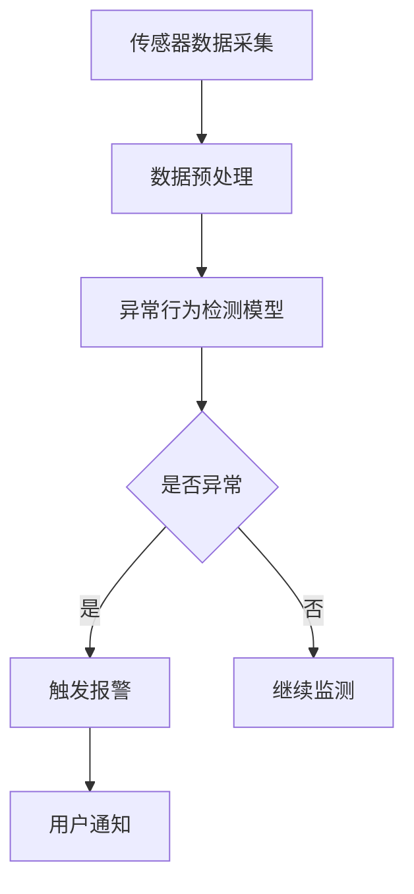

# AI Agent在智能门锁中的异常行为检测

> 关键词：AI Agent、智能门锁、异常行为检测、机器学习、安全防护

> 摘要：本文聚焦于AI Agent在智能门锁异常行为检测中的应用。详细阐述了AI Agent和智能门锁异常行为检测的核心概念及其联系，深入剖析了相关核心算法原理与具体操作步骤，借助数学模型和公式对检测过程进行了理论说明，并结合实际案例展示了如何在项目中实现异常行为检测。同时，探讨了其实际应用场景，推荐了相关的学习资源、开发工具框架以及论文著作。最后，对AI Agent在智能门锁异常行为检测领域的未来发展趋势与挑战进行了总结，旨在为该领域的研究和应用提供全面且深入的参考。

## 1. 背景介绍 
### 1.1 目的和范围
智能门锁作为智能家居的重要组成部分，其安全性直接关系到用户的财产和人身安全。然而，随着智能门锁的广泛应用，各种异常行为也随之出现，如暴力开锁、异常刷卡、频繁试错密码等。本文章的目的在于深入探讨如何利用AI Agent技术实现对智能门锁异常行为的有效检测，提高智能门锁的安全性。范围涵盖了AI Agent的基本原理、异常行为检测的算法、数学模型的建立、实际项目的开发以及相关工具和资源的推荐等方面。

### 1.2 预期读者
本文预期读者包括智能门锁领域的研发人员、对人工智能应用感兴趣的技术爱好者、从事智能家居安全研究的学者以及关注智能门锁安全的普通用户。通过阅读本文，研发人员可以获取关于异常行为检测的具体实现方法和技术细节；技术爱好者可以了解AI Agent在智能门锁中的应用原理和发展趋势；学者可以为相关研究提供理论和实践参考；普通用户可以增强对智能门锁安全的认识。

### 1.3 文档结构概述
本文将按照以下结构进行组织：首先介绍核心概念与联系，明确AI Agent和智能门锁异常行为检测的基本概念和它们之间的关联；接着阐述核心算法原理和具体操作步骤，并使用Python代码进行详细说明；然后通过数学模型和公式对检测过程进行理论分析，并举例说明；再结合实际项目，介绍开发环境搭建、源代码实现和代码解读；之后探讨实际应用场景；随后推荐相关的工具和资源；最后总结未来发展趋势与挑战，并提供常见问题与解答以及扩展阅读和参考资料。

### 1.4 术语表
#### 1.4.1 核心术语定义
- **AI Agent（人工智能代理）**：是一种能够感知环境、自主决策并采取行动以实现特定目标的智能实体。在智能门锁异常行为检测中，AI Agent可以根据门锁的各种传感器数据进行分析和判断，识别异常行为。
- **智能门锁**：一种具备智能化功能的门锁，通过电子技术、传感器技术、计算机技术等实现多种开锁方式（如密码、指纹、刷卡等），并能够记录和传输门锁的使用信息。
- **异常行为检测**：通过对智能门锁的各种数据进行分析，识别出不符合正常使用模式的行为，如异常的开锁尝试、长时间的门未关闭等。

#### 1.4.2 相关概念解释
- **机器学习**：是一门多领域交叉学科，涉及概率论、统计学、逼近论、凸分析、算法复杂度理论等多门学科。它专门研究计算机怎样模拟或实现人类的学习行为，以获取新的知识或技能，重新组织已有的知识结构使之不断改善自身的性能。在智能门锁异常行为检测中，机器学习算法可以用于训练模型，识别异常行为模式。
- **传感器数据**：智能门锁配备了多种传感器，如红外传感器、压力传感器、磁力传感器等，这些传感器可以实时采集门锁的状态信息，如门的开合状态、是否有人靠近等。

#### 1.4.3 缩略词列表
- **ML（Machine Learning）**：机器学习
- **AI（Artificial Intelligence）**：人工智能

## 2. 核心概念与联系 
### 核心概念原理
#### AI Agent原理
AI Agent的核心原理是基于感知、决策和行动的循环过程。它通过传感器感知环境信息，然后根据预先设定的规则或学习到的模型进行决策，最后采取相应的行动。在智能门锁异常行为检测中，AI Agent通过门锁的传感器感知门锁的各种状态信息，如开锁时间、开锁方式、门的开合状态等。然后，它将这些信息与正常的使用模式进行比较，如果发现异常，则触发相应的报警机制。

#### 智能门锁异常行为检测原理
智能门锁异常行为检测的原理是基于对门锁正常使用模式的建模和分析。通过收集大量的正常使用数据，利用机器学习算法建立正常使用模式的模型。在实际使用过程中，将实时采集的门锁数据与模型进行比较，如果数据与模型的差异超过一定的阈值，则认为出现了异常行为。

### 架构的文本示意图
```plaintext
智能门锁系统
|-- 传感器层
|   |-- 红外传感器
|   |-- 压力传感器
|   |-- 磁力传感器
|   |-- 其他传感器
|-- 数据采集与传输层
|   |-- 数据采集模块
|   |-- 数据传输模块
|-- AI Agent层
|   |-- 数据预处理单元
|   |-- 异常行为检测模型
|   |-- 决策与报警单元
|-- 用户交互层
|   |-- 手机APP
|   |-- 报警装置
```

### Mermaid流程图


## 3. 核心算法原理 & 具体操作步骤 
### 核心算法原理
在智能门锁异常行为检测中，常用的机器学习算法包括基于统计的方法、基于聚类的方法和基于深度学习的方法。这里我们以基于统计的方法为例进行详细阐述。

基于统计的方法的核心思想是通过计算数据的统计特征（如均值、方差、标准差等）来建立正常使用模式的模型。在实际使用过程中，将实时采集的数据与模型的统计特征进行比较，如果差异超过一定的阈值，则认为出现了异常行为。

### 具体操作步骤
#### 步骤1：数据收集
收集智能门锁的各种传感器数据，包括开锁时间、开锁方式、门的开合状态等。数据收集的时间跨度应足够长，以覆盖各种正常使用场景。

#### 步骤2：数据预处理
对收集到的数据进行预处理，包括数据清洗、数据归一化等操作。数据清洗的目的是去除噪声数据和异常值，数据归一化的目的是将不同类型的数据转换到相同的尺度上，以便于后续的计算。

#### 步骤3：模型训练
使用预处理后的数据计算正常使用模式的统计特征，如均值、方差等。这些统计特征将作为正常使用模式的模型。

#### 步骤4：异常检测
在实际使用过程中，实时采集门锁数据，并对其进行预处理。然后，将预处理后的数据与正常使用模式的统计特征进行比较，如果差异超过一定的阈值，则认为出现了异常行为。

### Python源代码详细阐述
```python
import numpy as np

# 步骤1：数据收集（假设已经收集到了开锁时间数据）
data = np.array([10, 12, 11, 13, 9, 10, 11, 12, 10, 11])

# 步骤2：数据预处理（这里简单地进行均值归一化）
mean = np.mean(data)
std = np.std(data)
normalized_data = (data - mean) / std

# 步骤3：模型训练（计算均值和标准差作为模型）
model_mean = np.mean(normalized_data)
model_std = np.std(normalized_data)

# 步骤4：异常检测（假设实时采集到一个新的开锁时间）
new_data = np.array([20])
new_normalized_data = (new_data - mean) / std

# 计算差异
diff = np.abs(new_normalized_data - model_mean)

# 设置阈值
threshold = 2 * model_std

# 判断是否异常
if diff > threshold:
    print("异常行为！")
else:
    print("正常行为。")
```

## 4. 数学模型和公式 & 详细讲解 & 举例说明 
### 数学模型
基于统计的异常行为检测模型可以用以下数学公式表示：

设 $X = \{x_1, x_2, \cdots, x_n\}$ 是收集到的正常使用数据，其中 $x_i$ 表示第 $i$ 个数据点。则正常使用模式的均值 $\mu$ 和标准差 $\sigma$ 可以通过以下公式计算：

$$\mu = \frac{1}{n} \sum_{i=1}^{n} x_i$$

$$\sigma = \sqrt{\frac{1}{n} \sum_{i=1}^{n} (x_i - \mu)^2}$$

在实际使用过程中，设 $x$ 是实时采集到的数据，则 $x$ 与正常使用模式的差异 $d$ 可以通过以下公式计算：

$$d = |x - \mu|$$

如果 $d > k\sigma$，其中 $k$ 是一个常数（通常取2或3），则认为 $x$ 是异常数据。

### 详细讲解
均值 $\mu$ 表示正常使用数据的平均水平，标准差 $\sigma$ 表示数据的离散程度。差异 $d$ 表示实时采集的数据与正常使用模式的平均水平的偏离程度。当 $d$ 超过 $k\sigma$ 时，说明实时采集的数据与正常使用模式的差异过大，可能是异常行为。

### 举例说明
假设我们收集到了10个开锁时间数据：$[10, 12, 11, 13, 9, 10, 11, 12, 10, 11]$。首先，计算均值 $\mu$ 和标准差 $\sigma$：

$$\mu = \frac{1}{10} \times (10 + 12 + 11 + 13 + 9 + 10 + 11 + 12 + 10 + 11) = 10.9$$

$$\sigma = \sqrt{\frac{1}{10} \times [(10 - 10.9)^2 + (12 - 10.9)^2 + \cdots + (11 - 10.9)^2]} \approx 1.02$$

假设实时采集到一个新的开锁时间为20，则差异 $d$ 为：

$$d = |20 - 10.9| = 9.1$$

如果取 $k = 2$，则 $k\sigma = 2 \times 1.02 = 2.04$。由于 $d > k\sigma$，所以可以判断这个新的开锁时间是异常行为。

## 5. 项目实战：代码实际案例和详细解释说明 
### 5.1  开发环境搭建
#### 硬件环境
- 智能门锁开发板：选择一款支持多种传感器接口和数据传输功能的智能门锁开发板，如Arduino、Raspberry Pi等。
- 传感器：配备红外传感器、压力传感器、磁力传感器等，用于采集门锁的状态信息。
- 数据传输模块：选择合适的数据传输模块，如Wi-Fi模块、蓝牙模块等，用于将采集到的数据传输到服务器。

#### 软件环境
- 操作系统：选择适合开发板的操作系统，如Linux、Windows等。
- 开发语言：选择Python作为开发语言，因为Python具有丰富的机器学习库和数据处理库。
- 机器学习库：安装Scikit-learn、TensorFlow等机器学习库，用于实现异常行为检测模型。

### 5.2  源代码详细实现和代码解读
```python
import numpy as np
import random

# 模拟传感器数据采集
def collect_sensor_data():
    # 模拟开锁时间，范围在8-15之间
    unlock_time = random.randint(8, 15)
    return unlock_time

# 数据预处理
def preprocess_data(data):
    mean = np.mean(data)
    std = np.std(data)
    normalized_data = (data - mean) / std
    return normalized_data

# 模型训练
def train_model(data):
    normalized_data = preprocess_data(data)
    model_mean = np.mean(normalized_data)
    model_std = np.std(normalized_data)
    return model_mean, model_std

# 异常检测
def detect_anomaly(new_data, model_mean, model_std, threshold=2):
    # 假设之前已经计算出了均值和标准差
    mean = np.mean(data)
    std = np.std(data)
    new_normalized_data = (new_data - mean) / std
    diff = np.abs(new_normalized_data - model_mean)
    if diff > threshold * model_std:
        return True
    return False

# 主程序
if __name__ == "__main__":
    # 模拟收集正常使用数据
    data = [collect_sensor_data() for _ in range(100)]
    
    # 模型训练
    model_mean, model_std = train_model(data)
    
    # 模拟实时采集新数据
    new_data = collect_sensor_data()
    
    # 异常检测
    if detect_anomaly(new_data, model_mean, model_std):
        print("异常行为！")
    else:
        print("正常行为。")
```

### 代码解读与分析
- `collect_sensor_data` 函数：模拟传感器数据采集，返回一个随机的开锁时间。
- `preprocess_data` 函数：对数据进行均值归一化处理，将数据转换到相同的尺度上。
- `train_model` 函数：使用预处理后的数据计算正常使用模式的均值和标准差，作为模型。
- `detect_anomaly` 函数：对实时采集的数据进行预处理，并与模型的均值和标准差进行比较，判断是否为异常行为。
- 主程序：首先模拟收集正常使用数据，然后进行模型训练，最后模拟实时采集新数据并进行异常检测。

## 6. 实际应用场景 
### 家庭安全防护
在家庭中，智能门锁的异常行为检测可以及时发现非法入侵行为，如暴力开锁、异常刷卡等。一旦检测到异常行为，门锁可以立即触发报警装置，通知用户或物业管理人员。同时，用户可以通过手机APP实时查看门锁的状态信息，增强家庭的安全性。

### 商业场所安全管理
在商业场所，如办公室、商场等，智能门锁的异常行为检测可以用于安全管理。例如，检测员工是否在非工作时间开锁、是否存在频繁试错密码等异常行为。通过对这些异常行为的及时发现和处理，可以有效防止商业机密泄露和财产损失。

### 公共场所设施管理
在公共场所，如学校、医院等，智能门锁的异常行为检测可以用于设施管理。例如，检测门是否长时间未关闭、是否有人在非开放时间进入等。通过对这些异常行为的监测和管理，可以提高公共场所的安全性和管理效率。

## 7. 工具和资源推荐
### 7.1 学习资源推荐
#### 7.1.1 书籍推荐
- 《机器学习》（周志华）：这本书全面介绍了机器学习的基本概念、算法和应用，是学习机器学习的经典教材。
- 《Python机器学习实战》（Sebastian Raschka）：这本书通过实际案例介绍了如何使用Python实现机器学习算法，适合初学者快速上手。
- 《深度学习》（Ian Goodfellow、Yoshua Bengio、Aaron Courville）：这本书是深度学习领域的权威著作，详细介绍了深度学习的原理、算法和应用。

#### 7.1.2 在线课程
- Coursera上的《机器学习》课程（Andrew Ng教授主讲）：这是一门非常经典的机器学习课程，通过视频讲解、编程作业等方式让学员系统地学习机器学习的知识。
- edX上的《深度学习》课程：该课程由知名学者授课，介绍了深度学习的最新进展和应用。
- 阿里云天池平台的机器学习实战课程：提供了丰富的实战案例和数据集，帮助学员在实践中提高机器学习能力。

#### 7.1.3 技术博客和网站
- 博客园：是一个技术人员分享技术经验和心得的平台，有很多关于机器学习和人工智能的优秀博客文章。
- 开源中国：提供了大量的开源项目和技术文章，涵盖了机器学习、人工智能等多个领域。
- Kaggle：是一个数据科学竞赛平台，上面有很多优秀的数据科学项目和解决方案，可以学习到最新的技术和方法。

### 7.2 开发工具框架推荐
#### 7.2.1 IDE和编辑器
- PyCharm：是一款专门为Python开发设计的集成开发环境，具有代码自动补全、调试等功能，提高开发效率。
- Jupyter Notebook：是一个交互式的开发环境，适合进行数据分析和模型训练，可以实时查看代码运行结果。
- Visual Studio Code：是一款轻量级的代码编辑器，支持多种编程语言和插件扩展，适合快速开发。

#### 7.2.2 调试和性能分析工具
- PDB：是Python自带的调试工具，可以在代码中设置断点，逐步执行代码，方便调试。
- cProfile：是Python的性能分析工具，可以分析代码的运行时间和内存使用情况，找出性能瓶颈。
- TensorBoard：是TensorFlow的可视化工具，可以用于可视化模型的训练过程和性能指标。

#### 7.2.3 相关框架和库
- Scikit-learn：是一个常用的机器学习库，提供了丰富的机器学习算法和工具，如分类、回归、聚类等。
- TensorFlow：是一个开源的深度学习框架，支持多种深度学习模型的构建和训练，如神经网络、卷积神经网络等。
- Keras：是一个高级神经网络API，基于TensorFlow、Theano等后端，简单易用，适合快速搭建深度学习模型。

### 7.3 相关论文著作推荐
#### 7.3.1 经典论文
- 《A Tutorial on Support Vector Machines for Pattern Recognition》：介绍了支持向量机的基本原理和应用，是支持向量机领域的经典论文。
- 《Gradient-Based Learning Applied to Document Recognition》：提出了卷积神经网络的基本思想，为深度学习在图像识别领域的应用奠定了基础。
- 《Long Short-Term Memory》：介绍了长短期记忆网络（LSTM）的基本原理和应用，是循环神经网络领域的重要论文。

#### 7.3.2 最新研究成果
- 关注顶级学术会议（如NeurIPS、ICML、CVPR等）上的相关论文，了解AI Agent在智能门锁异常行为检测领域的最新研究进展。
- 查阅知名学术期刊（如Journal of Artificial Intelligence Research、Artificial Intelligence等）上的相关文章，获取最新的理论和方法。

#### 7.3.3 应用案例分析
- 研究国内外智能门锁厂商的技术报告和案例分析，了解他们在异常行为检测方面的实践经验和解决方案。
- 分析一些实际的智能门锁安全事件，总结经验教训，为自己的项目提供参考。

## 8. 总结：未来发展趋势与挑战
### 未来发展趋势
- **多模态数据融合**：未来的智能门锁异常行为检测将不仅仅依赖于单一的传感器数据，而是会融合多种传感器数据，如视频、音频、生物特征等，提高检测的准确性和可靠性。
- **深度学习的广泛应用**：深度学习具有强大的特征提取和模式识别能力，未来将在智能门锁异常行为检测中得到更广泛的应用。例如，使用卷积神经网络对视频数据进行分析，识别异常的人员行为。
- **智能化和自动化**：AI Agent将变得更加智能化和自动化，能够自动学习和适应不同的使用场景和用户习惯，实现更加精准的异常行为检测。同时，门锁系统将能够自动采取相应的措施，如自动报警、自动锁定等。

### 挑战
- **数据隐私和安全**：智能门锁采集的大量用户数据涉及到用户的隐私和安全问题。如何保护这些数据不被泄露和滥用，是未来需要解决的重要问题。
- **复杂环境适应性**：智能门锁可能会面临各种复杂的环境，如恶劣天气、电磁干扰等。如何提高AI Agent在复杂环境下的异常行为检测能力，是一个挑战。
- **算法的可解释性**：深度学习等复杂算法虽然在异常行为检测中取得了很好的效果，但它们的决策过程往往难以解释。如何提高算法的可解释性，让用户能够理解和信任检测结果，是未来需要研究的方向。

## 9. 附录：常见问题与解答
### 问题1：AI Agent在智能门锁异常行为检测中的准确率如何保证？
解答：可以通过以下几个方面来保证准确率：一是收集大量的正常使用数据和异常行为数据，用于模型的训练和验证；二是选择合适的机器学习算法和模型，并进行调优；三是采用多模态数据融合的方法，综合利用多种传感器数据进行分析。

### 问题2：智能门锁的异常行为检测会受到哪些因素的影响？
解答：可能会受到以下因素的影响：传感器的精度和可靠性、环境因素（如温度、湿度、电磁干扰等）、用户的使用习惯变化等。

### 问题3：如何处理智能门锁异常行为检测中的误报问题？
解答：可以通过调整检测阈值、采用多阶段检测方法、结合用户反馈等方式来减少误报。例如，当检测到异常行为时，先进行初步判断，如果不能确定是否为异常，则可以通过其他方式（如视频监控）进行进一步确认。

## 10. 扩展阅读 & 参考资料
### 扩展阅读
- 《智能家居安全技术》：介绍了智能家居安全的相关技术和方法，包括智能门锁、安防监控等方面。
- 《人工智能导论》：全面介绍了人工智能的基本概念、算法和应用，有助于进一步了解AI Agent的原理和应用。

### 参考资料
- 智能门锁产品说明书和技术文档
- 相关的学术论文和研究报告
- 开源代码库和项目文档

作者：AI天才研究院/AI Genius Institute & 禅与计算机程序设计艺术 /Zen And The Art of Computer Programming