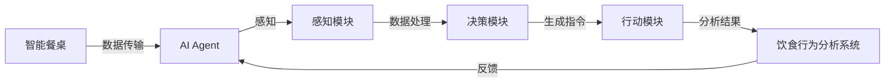

# AI Agent在智能餐桌中的饮食行为分析

> 关键词：AI Agent、智能餐桌、饮食行为分析、计算机视觉、数据挖掘

> 摘要：本文聚焦于AI Agent在智能餐桌饮食行为分析中的应用。首先介绍了相关背景，包括研究目的、预期读者、文档结构和术语定义。接着阐述了核心概念及联系，给出了原理和架构的示意图与流程图。详细讲解了核心算法原理，并用Python代码实现。深入探讨了数学模型和公式，通过实例说明其应用。通过项目实战，展示了开发环境搭建、源代码实现和解读。分析了实际应用场景，推荐了学习资源、开发工具框架和相关论文著作。最后总结了未来发展趋势与挑战，解答了常见问题，并提供了扩展阅读和参考资料，旨在为该领域的研究和应用提供全面且深入的指导。

## 1. 背景介绍 
### 1.1 目的和范围
随着人们对健康饮食的关注度不断提高，以及人工智能技术的飞速发展，利用AI技术对饮食行为进行分析具有重要的现实意义。本研究的目的是探讨如何将AI Agent应用于智能餐桌，实现对人们饮食行为的准确分析。范围涵盖了从AI Agent的原理和算法，到智能餐桌系统的开发和应用，以及饮食行为分析的各个方面，包括食物识别、进食量统计、进食速度分析等。

### 1.2 预期读者
本文预期读者包括人工智能领域的研究人员、计算机科学专业的学生、智能设备开发者、健康饮食相关行业的从业者等。对于那些对利用AI技术改善健康饮食感兴趣的人群，本文也具有一定的参考价值。

### 1.3 文档结构概述
本文共分为十个部分。第一部分为背景介绍，阐述研究的目的、范围、预期读者和文档结构。第二部分介绍核心概念与联系，包括AI Agent、智能餐桌和饮食行为分析的相关概念和它们之间的关系。第三部分详细讲解核心算法原理和具体操作步骤，并给出Python代码实现。第四部分介绍数学模型和公式，并通过举例说明其应用。第五部分进行项目实战，包括开发环境搭建、源代码实现和代码解读。第六部分分析实际应用场景。第七部分推荐学习资源、开发工具框架和相关论文著作。第八部分总结未来发展趋势与挑战。第九部分解答常见问题。第十部分提供扩展阅读和参考资料。

### 1.4 术语表
#### 1.4.1 核心术语定义
- **AI Agent**：人工智能代理，是一种能够感知环境、做出决策并采取行动的智能实体。在本文中，AI Agent用于感知智能餐桌上的饮食行为信息，并进行分析和处理。
- **智能餐桌**：配备了传感器、摄像头等设备的餐桌，能够收集餐桌上的食物信息和人们的饮食行为数据，并与AI Agent进行交互。
- **饮食行为分析**：对人们在进食过程中的各种行为进行分析，包括食物种类识别、进食量统计、进食速度分析等，以了解人们的饮食习惯和健康状况。

#### 1.4.2 相关概念解释
- **计算机视觉**：是一门研究如何使计算机“看”的科学，包括图像识别、目标检测、图像分割等技术。在智能餐桌中，计算机视觉技术用于识别食物种类和检测进食行为。
- **数据挖掘**：是从大量数据中发现有价值信息和知识的过程。在饮食行为分析中，数据挖掘技术用于分析和挖掘收集到的饮食行为数据，以发现潜在的模式和规律。

#### 1.4.3 缩略词列表
- **AI**：Artificial Intelligence，人工智能
- **CNN**：Convolutional Neural Network，卷积神经网络
- **RNN**：Recurrent Neural Network，循环神经网络
- **YOLO**：You Only Look Once，一种目标检测算法

## 2. 核心概念与联系 

### 核心概念原理
#### AI Agent
AI Agent的核心原理是基于感知、决策和行动的循环。它通过传感器感知环境信息，然后根据预设的规则或学习到的模型进行决策，最后采取相应的行动。在智能餐桌中，AI Agent通过摄像头和传感器感知餐桌上的食物信息和人们的饮食行为，利用机器学习和深度学习算法进行分析和决策，例如识别食物种类、统计进食量等。

#### 智能餐桌
智能餐桌是一个集成了多种传感器和设备的系统。摄像头用于捕捉餐桌上的图像和视频，压力传感器用于检测食物的重量变化，麦克风用于记录进食声音等。这些传感器将收集到的数据传输给AI Agent进行处理和分析。

#### 饮食行为分析
饮食行为分析是通过对收集到的饮食行为数据进行处理和分析，提取有价值的信息。例如，通过计算机视觉技术识别食物种类，根据压力传感器的数据统计进食量，分析进食时间和速度等。这些信息可以帮助人们了解自己的饮食习惯，为健康饮食提供建议。

### 架构的文本示意图
```plaintext
智能餐桌（包含摄像头、压力传感器、麦克风等）
        |
        | 数据传输
        v
AI Agent（包含感知模块、决策模块、行动模块）
        |
        | 分析结果
        v
饮食行为分析系统（食物识别、进食量统计、进食速度分析等）
```

### Mermaid流程图


## 3. 核心算法原理 & 具体操作步骤 

### 食物识别算法原理
在智能餐桌的饮食行为分析中，食物识别是一个关键任务。我们可以使用卷积神经网络（CNN）来实现食物识别。CNN是一种专门用于处理图像数据的深度学习模型，它通过卷积层、池化层和全连接层等结构，自动提取图像的特征，并进行分类。

以下是一个简单的Python代码示例，使用Keras库实现一个简单的CNN模型进行食物识别：

```python
import tensorflow as tf
from tensorflow.keras import layers, models

# 构建CNN模型
model = models.Sequential()
model.add(layers.Conv2D(32, (3, 3), activation='relu', input_shape=(150, 150, 3)))
model.add(layers.MaxPooling2D((2, 2)))
model.add(layers.Conv2D(64, (3, 3), activation='relu'))
model.add(layers.MaxPooling2D((2, 2)))
model.add(layers.Conv2D(128, (3, 3), activation='relu'))
model.add(layers.MaxPooling2D((2, 2)))
model.add(layers.Flatten())
model.add(layers.Dense(128, activation='relu'))
model.add(layers.Dense(10, activation='softmax'))  # 假设识别10种食物

# 编译模型
model.compile(optimizer='adam',
              loss='categorical_crossentropy',
              metrics=['accuracy'])

# 加载数据并训练模型（此处省略数据加载和预处理步骤）
# history = model.fit(train_images, train_labels, epochs=10, validation_data=(test_images, test_labels))
```

### 具体操作步骤
1. **数据收集**：收集大量的食物图像数据，并进行标注，标记出每张图像中食物的种类。
2. **数据预处理**：对收集到的图像数据进行预处理，包括图像缩放、归一化等操作，以提高模型的训练效果。
3. **模型训练**：使用预处理后的数据对CNN模型进行训练，调整模型的参数，使其能够准确地识别食物种类。
4. **模型评估**：使用测试数据对训练好的模型进行评估，计算模型的准确率、召回率等指标，评估模型的性能。
5. **部署应用**：将训练好的模型部署到智能餐桌系统中，实时对餐桌上的食物进行识别。

### 进食量统计算法原理
进食量统计可以通过压力传感器来实现。压力传感器可以实时监测餐桌上食物的重量变化，通过计算食物重量的差值，就可以统计出进食量。

以下是一个简单的Python代码示例，模拟压力传感器数据的读取和进食量统计：

```python
# 模拟压力传感器数据
pressure_data = [100, 98, 95, 92, 90]  # 单位：克

# 统计进食量
initial_weight = pressure_data[0]
final_weight = pressure_data[-1]
eating_amount = initial_weight - final_weight

print(f"进食量为：{eating_amount}克")
```

### 具体操作步骤
1. **传感器安装**：将压力传感器安装在智能餐桌的合适位置，确保能够准确地监测食物的重量变化。
2. **数据采集**：实时采集压力传感器的数据，并将其传输到AI Agent进行处理。
3. **数据处理**：对采集到的压力数据进行处理，去除噪声和异常值，计算食物重量的差值，得到进食量。
4. **结果输出**：将统计得到的进食量输出到饮食行为分析系统中，供后续分析和使用。

## 4. 数学模型和公式 & 详细讲解 & 举例说明 

### 食物识别的损失函数
在食物识别中，我们使用交叉熵损失函数来衡量模型预测结果与真实标签之间的差异。交叉熵损失函数的公式如下：

$$
L = -\frac{1}{N}\sum_{i=1}^{N}\sum_{j=1}^{C}y_{ij}\log(p_{ij})
$$

其中，$N$ 是样本数量，$C$ 是类别数量，$y_{ij}$ 是第 $i$ 个样本的第 $j$ 个类别的真实标签（$y_{ij}=1$ 表示该样本属于第 $j$ 类，$y_{ij}=0$ 表示不属于），$p_{ij}$ 是模型对第 $i$ 个样本的第 $j$ 个类别的预测概率。

详细讲解：交叉熵损失函数的目的是使模型的预测结果尽可能接近真实标签。当模型的预测概率与真实标签一致时，损失函数的值为 0；当预测概率与真实标签差异较大时，损失函数的值会增大。通过最小化损失函数，我们可以调整模型的参数，提高模型的分类准确率。

举例说明：假设我们有 3 个样本，每个样本有 2 个类别，真实标签矩阵 $Y$ 和模型预测概率矩阵 $P$ 如下：

$$
Y = \begin{bmatrix}
1 & 0 \\
0 & 1 \\
1 & 0
\end{bmatrix}
$$

$$
P = \begin{bmatrix}
0.8 & 0.2 \\
0.3 & 0.7 \\
0.6 & 0.4
\end{bmatrix}
$$

则交叉熵损失函数的值为：

$$
L = -\frac{1}{3}[(1\times\log(0.8) + 0\times\log(0.2)) + (0\times\log(0.3) + 1\times\log(0.7)) + (1\times\log(0.6) + 0\times\log(0.4))] \approx 0.29
$$

### 进食量统计的公式
进食量的计算公式非常简单，即：

$$
EatingAmount = InitialWeight - FinalWeight
$$

其中，$InitialWeight$ 是食物的初始重量，$FinalWeight$ 是食物的最终重量。

详细讲解：这个公式的原理是通过计算食物重量的差值来得到进食量。在实际应用中，我们需要确保压力传感器能够准确地测量食物的重量，并且要考虑到可能存在的误差，如传感器的精度、环境因素等。

举例说明：假设食物的初始重量为 200 克，经过一段时间的进食后，食物的最终重量为 150 克，则进食量为：

$$
EatingAmount = 200 - 150 = 50 \text{（克）}
$$

## 5. 项目实战：代码实际案例和详细解释说明 

### 5.1  开发环境搭建
#### 硬件环境
- 智能餐桌：配备摄像头、压力传感器、麦克风等设备。
- 服务器：用于运行AI Agent和饮食行为分析系统，可以选择云服务器或本地服务器。

#### 软件环境
- 操作系统：可以选择Linux、Windows等操作系统。
- 编程语言：Python，因为Python具有丰富的机器学习和深度学习库，非常适合用于开发AI Agent和饮食行为分析系统。
- 深度学习框架：TensorFlow、Keras等，用于构建和训练深度学习模型。
- 数据库：MySQL、MongoDB等，用于存储收集到的饮食行为数据。

### 5.2  源代码详细实现和代码解读
#### 食物识别模块
```python
import tensorflow as tf
from tensorflow.keras.preprocessing import image
import numpy as np

# 加载训练好的模型
model = tf.keras.models.load_model('food_recognition_model.h5')

# 定义食物类别
food_classes = ['apple', 'banana', 'orange', 'cake', 'pizza', 'hamburger', 'salad', 'soup', 'steak', 'ice cream']

def recognize_food(image_path):
    # 加载图像并进行预处理
    img = image.load_img(image_path, target_size=(150, 150))
    img = image.img_to_array(img)
    img = np.expand_dims(img, axis=0)
    img = img / 255.0  # 归一化

    # 进行预测
    predictions = model.predict(img)
    predicted_class_index = np.argmax(predictions)
    predicted_food = food_classes[predicted_class_index]

    return predicted_food

# 测试食物识别
image_path = 'test_image.jpg'
result = recognize_food(image_path)
print(f"识别结果：{result}")
```

代码解读：
1. **加载模型**：使用 `tf.keras.models.load_model` 函数加载训练好的食物识别模型。
2. **定义食物类别**：定义一个列表，包含所有要识别的食物类别。
3. **图像预处理**：使用 `image.load_img` 函数加载图像，并将其调整为模型所需的尺寸。然后将图像转换为数组，并进行归一化处理。
4. **预测**：使用 `model.predict` 函数对预处理后的图像进行预测，得到每个类别的预测概率。然后使用 `np.argmax` 函数找到预测概率最大的类别索引。
5. **输出结果**：根据类别索引从食物类别列表中获取对应的食物名称，并输出识别结果。

#### 进食量统计模块
```python
import time

# 模拟压力传感器数据读取函数
def read_pressure_sensor():
    # 这里可以替换为实际的传感器数据读取代码
    # 为了演示，我们随机生成一些数据
    import random
    return random.uniform(100, 200)

# 初始化初始重量
initial_weight = read_pressure_sensor()

# 模拟进食过程
for i in range(10):
    time.sleep(1)  # 每隔1秒读取一次数据
    current_weight = read_pressure_sensor()
    eating_amount = initial_weight - current_weight
    print(f"当前进食量：{eating_amount}克")

```

代码解读：
1. **读取压力传感器数据**：定义一个函数 `read_pressure_sensor` 来模拟压力传感器数据的读取。在实际应用中，需要替换为实际的传感器数据读取代码。
2. **初始化初始重量**：在进食开始时，读取一次压力传感器数据，作为初始重量。
3. **模拟进食过程**：使用 `for` 循环模拟进食过程，每隔 1 秒读取一次压力传感器数据，计算当前的进食量，并输出结果。

### 5.3  代码解读与分析
#### 食物识别模块
- **优点**：使用深度学习模型进行食物识别，具有较高的准确率。代码结构简单，易于理解和扩展。
- **缺点**：需要大量的训练数据和计算资源来训练模型。对图像的质量和光照条件比较敏感，可能会影响识别准确率。

#### 进食量统计模块
- **优点**：代码简单，易于实现。可以实时监测进食量的变化。
- **缺点**：使用模拟的压力传感器数据，实际应用中需要考虑传感器的精度和稳定性。没有考虑到食物的其他因素，如食物的密度、形状等，可能会导致进食量统计不准确。

## 6. 实际应用场景 
### 健康管理
智能餐桌的饮食行为分析系统可以帮助人们了解自己的饮食习惯，如食物种类摄入是否均衡、进食量是否合适等。根据分析结果，系统可以为用户提供个性化的健康饮食建议，帮助用户改善饮食习惯，预防肥胖、糖尿病等疾病。

### 餐饮行业
在餐饮行业，智能餐桌可以用于分析顾客的饮食偏好和消费习惯。餐厅可以根据这些信息调整菜品菜单，推出更符合顾客口味的菜品，提高顾客满意度和餐厅的经济效益。

### 营养研究
研究人员可以利用智能餐桌收集的大量饮食行为数据，进行营养研究。例如，分析不同人群的饮食习惯与健康状况之间的关系，为制定科学的营养标准提供依据。

### 儿童饮食教育
智能餐桌可以作为一种儿童饮食教育工具。通过识别食物种类和统计进食量，系统可以向儿童展示不同食物的营养价值，引导儿童养成健康的饮食习惯。

## 7. 工具和资源推荐
### 7.1 学习资源推荐
#### 7.1.1 书籍推荐
- 《深度学习》（Deep Learning）：由Ian Goodfellow、Yoshua Bengio和Aaron Courville所著，是深度学习领域的经典教材，全面介绍了深度学习的理论和方法。
- 《Python机器学习》（Python Machine Learning）：由Sebastian Raschka所著，详细介绍了如何使用Python进行机器学习的开发，包括数据预处理、模型选择、评估等内容。
- 《计算机视觉：算法与应用》（Computer Vision: Algorithms and Applications）：由Richard Szeliski所著，系统地介绍了计算机视觉的基本算法和应用，适合计算机视觉领域的初学者和专业人士。

#### 7.1.2 在线课程
- Coursera上的“深度学习专项课程”（Deep Learning Specialization）：由Andrew Ng教授主讲，包括深度学习的基础知识、卷积神经网络、循环神经网络等内容，是学习深度学习的优质课程。
- edX上的“计算机视觉基础”（Foundations of Computer Vision）：由UC Berkeley的教授主讲，介绍了计算机视觉的基本概念和算法，包括图像特征提取、目标检测、图像分割等内容。
- Kaggle上的“机器学习微课程”（Machine Learning Micro-Course）：提供了实践导向的机器学习课程，适合初学者快速上手机器学习。

#### 7.1.3 技术博客和网站
- Medium：是一个技术博客平台，有很多关于人工智能、机器学习、计算机视觉等领域的优质文章。
- Towards Data Science：专注于数据科学和机器学习领域的技术博客，提供了很多实用的教程和案例。
- arXiv：是一个预印本数据库，包含了很多最新的学术研究论文，对于了解人工智能领域的前沿研究非常有帮助。

### 7.2 开发工具框架推荐
#### 7.2.1 IDE和编辑器
- PyCharm：是一款专门为Python开发设计的集成开发环境，具有代码编辑、调试、版本控制等功能，非常适合Python项目的开发。
- Jupyter Notebook：是一个交互式的开发环境，支持Python、R等多种编程语言。可以方便地进行数据探索、模型训练和可视化等操作。
- Visual Studio Code：是一款轻量级的代码编辑器，支持多种编程语言和插件扩展。具有丰富的代码提示和调试功能，适合快速开发和调试。

#### 7.2.2 调试和性能分析工具
- TensorBoard：是TensorFlow提供的可视化工具，可以用于可视化模型的训练过程、网络结构、损失函数等信息，帮助开发者调试和优化模型。
- Py-Spy：是一个Python性能分析工具，可以实时监测Python程序的CPU使用率、函数调用时间等信息，帮助开发者找出性能瓶颈。
- cProfile：是Python标准库中的性能分析模块，可以用于分析Python程序的运行时间和函数调用次数，帮助开发者优化代码性能。

#### 7.2.3 相关框架和库
- TensorFlow：是一个开源的深度学习框架，由Google开发。提供了丰富的深度学习模型和工具，支持CPU、GPU等多种计算设备，广泛应用于图像识别、自然语言处理等领域。
- Keras：是一个高级神经网络API，基于TensorFlow、Theano等后端。Keras的代码简洁易懂，适合快速搭建和训练深度学习模型。
- OpenCV：是一个开源的计算机视觉库，提供了丰富的计算机视觉算法和工具，包括图像滤波、特征提取、目标检测等功能，广泛应用于计算机视觉领域。

### 7.3 相关论文著作推荐
#### 7.3.1 经典论文
- LeCun, Y., Bottou, L., Bengio, Y., & Haffner, P. (1998). Gradient-based learning applied to document recognition. Proceedings of the IEEE, 86(11), 2278-2324. 介绍了卷积神经网络（CNN）的经典应用——手写数字识别。
- Krizhevsky, A., Sutskever, I., & Hinton, G. E. (2012). ImageNet classification with deep convolutional neural networks. Advances in neural information processing systems, 25. 提出了AlexNet，开启了深度学习在图像识别领域的革命。
- Girshick, R., Donahue, J., Darrell, T., & Malik, J. (2014). Rich feature hierarchies for accurate object detection and semantic segmentation. Proceedings of the IEEE conference on computer vision and pattern recognition, 580-587. 提出了R-CNN目标检测算法。

#### 7.3.2 最新研究成果
- You can search for the latest research papers on arXiv, IEEE Xplore, ACM Digital Library, etc. using keywords such as "AI Agent in smart dining table", "Diet behavior analysis", "Computer vision for food recognition".

#### 7.3.3 应用案例分析
- 一些知名的科技公司和研究机构会发布关于智能餐桌和饮食行为分析的应用案例，可以通过他们的官方网站或相关技术博客进行查找。例如，IBM Watson Health可能有一些关于健康饮食分析的案例。

## 8. 总结：未来发展趋势与挑战
### 未来发展趋势
- **多模态融合**：未来的智能餐桌饮食行为分析系统将不仅仅依赖于图像和压力传感器数据，还会融合声音、视频等多模态数据，以更全面地分析饮食行为。例如，通过分析进食声音可以了解进食的咀嚼频率和食物的质地。
- **个性化服务**：根据用户的个人健康状况、饮食习惯、营养需求等因素，提供更加个性化的饮食建议和服务。例如，为患有糖尿病的用户提供低糖饮食方案，为健身爱好者提供高蛋白饮食推荐。
- **智能化交互**：智能餐桌将具备更加智能化的交互功能，例如与用户进行语音对话、提供可视化的饮食分析报告等。用户可以通过语音指令查询食物的营养信息、进食量统计等内容。
- **云服务和大数据**：利用云服务和大数据技术，将大量的饮食行为数据进行存储和分析。通过对大规模数据的挖掘和分析，可以发现更多的饮食行为模式和规律，为健康饮食提供更科学的依据。

### 挑战
- **数据隐私和安全**：智能餐桌收集的饮食行为数据包含了用户的个人隐私信息，如饮食习惯、健康状况等。如何确保这些数据的隐私和安全，防止数据泄露和滥用，是一个重要的挑战。
- **算法准确性和鲁棒性**：目前的食物识别和进食量统计算法在复杂场景下的准确性和鲁棒性还不够理想。例如，在不同光照条件下、食物摆放不规则时，食物识别的准确率会下降。如何提高算法的准确性和鲁棒性，是需要解决的问题。
- **硬件成本和可靠性**：智能餐桌需要配备摄像头、压力传感器等多种硬件设备，硬件成本较高。同时，硬件设备的可靠性和稳定性也会影响系统的性能。如何降低硬件成本，提高硬件设备的可靠性，是推广智能餐桌的关键。
- **用户接受度**：智能餐桌作为一种新兴的产品，用户对其接受度还需要进一步提高。一些用户可能对在餐桌上安装摄像头和传感器存在顾虑，担心个人隐私受到侵犯。如何提高用户的接受度，是智能餐桌推广应用的一个挑战。

## 9. 附录：常见问题与解答
### 问题1：AI Agent在智能餐桌中的饮食行为分析准确率有多高？
解答：AI Agent的饮食行为分析准确率受到多种因素的影响，如食物识别算法的性能、传感器的精度、环境条件等。一般来说，在理想的条件下，食物识别的准确率可以达到 80% 以上，进食量统计的误差可以控制在 10% 以内。但在实际应用中，由于环境的复杂性和食物的多样性，准确率可能会有所下降。

### 问题2：智能餐桌的硬件设备需要定期维护吗？
解答：是的，智能餐桌的硬件设备需要定期维护。摄像头需要定期清洁，以保证图像的清晰度；压力传感器需要定期校准，以确保测量的准确性；麦克风需要检查是否正常工作等。定期维护可以提高硬件设备的可靠性和稳定性，保证系统的正常运行。

### 问题3：智能餐桌收集的饮食行为数据会被泄露吗？
解答：为了保护用户的隐私，智能餐桌系统会采取一系列的安全措施来确保数据的安全。例如，对数据进行加密处理，限制数据的访问权限，定期备份数据等。同时，开发团队也会遵守相关的法律法规，不会将用户的个人数据泄露给第三方。

### 问题4：智能餐桌可以识别所有的食物吗？
解答：目前还不能识别所有的食物。食物识别的准确性取决于训练数据的多样性和模型的性能。如果训练数据中没有包含某种食物的图像，那么模型就无法准确地识别这种食物。随着技术的不断发展和训练数据的不断丰富，智能餐桌的食物识别能力会不断提高。

### 问题5：智能餐桌的价格贵吗？
解答：智能餐桌的价格相对较高，主要是因为其配备了多种先进的硬件设备和软件系统。价格会受到硬件配置、功能特点、品牌等因素的影响。随着技术的进步和市场的竞争，智能餐桌的价格可能会逐渐下降。

## 10. 扩展阅读 & 参考资料
### 扩展阅读
- 《人工智能：现代方法》（Artificial Intelligence: A Modern Approach）：全面介绍了人工智能的基本概念、算法和应用，是人工智能领域的经典教材。
- 《智能时代》：吴军所著，探讨了人工智能对社会和经济的影响，以及未来的发展趋势。
- 《大数据时代》：维克托·迈尔 - 舍恩伯格所著，介绍了大数据的概念、技术和应用，对于理解智能餐桌中的数据挖掘和分析有很大的帮助。

### 参考资料
- 相关的学术论文和研究报告，可以通过IEEE Xplore、ACM Digital Library、arXiv等数据库进行查找。
- 智能餐桌和人工智能相关的技术博客和网站，如Medium、Towards Data Science等。
- 各大科技公司的官方网站，如Google、Microsoft、IBM等，可能会有关于智能餐桌和饮食行为分析的相关技术和产品介绍。

作者：AI天才研究院/AI Genius Institute & 禅与计算机程序设计艺术 /Zen And The Art of Computer Programming