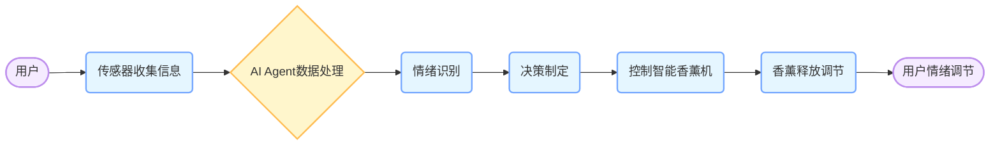

# AI Agent在智能香薰机中的情绪管理助手

> 关键词：AI Agent、智能香薰机、情绪管理、传感器、机器学习

> 摘要：本文深入探讨了AI Agent在智能香薰机中作为情绪管理助手的应用。首先介绍了相关背景知识，包括目的范围、预期读者等。接着阐述了核心概念与联系，详细讲解了核心算法原理及具体操作步骤，并给出了相应的Python代码。通过数学模型和公式进一步剖析其内在机制，结合实际案例进行了代码实现和解读。同时探讨了该技术的实际应用场景，推荐了学习资源、开发工具框架以及相关论文著作。最后总结了未来发展趋势与挑战，并提供了常见问题解答和扩展阅读参考资料，旨在为相关领域的研究者和开发者提供全面且深入的技术指导。

## 1. 背景介绍 
### 1.1 目的和范围
随着人们对生活品质的追求不断提高，情绪管理成为了一个备受关注的话题。智能香薰机作为一种可以改善室内气味环境、舒缓情绪的设备，越来越受到人们的喜爱。而引入AI Agent技术，可以使智能香薰机更加智能化，能够根据用户的情绪状态自动调整香薰的种类和浓度，从而更好地实现情绪管理的功能。本文的目的在于详细介绍AI Agent在智能香薰机中作为情绪管理助手的相关技术原理、实现方法以及实际应用，范围涵盖了从核心概念到项目实战的各个方面。

### 1.2 预期读者
本文预期读者包括对人工智能、智能家居领域感兴趣的技术爱好者，从事相关领域研究的科研人员，以及智能香薰机或智能家居产品的开发者和工程师。

### 1.3 文档结构概述
本文将按照以下结构进行组织：首先介绍背景知识，包括目的、预期读者和文档结构等；接着阐述核心概念与联系，包括AI Agent、智能香薰机和情绪管理的相关概念及它们之间的关系；然后详细讲解核心算法原理和具体操作步骤，并给出Python代码示例；通过数学模型和公式进一步分析其工作机制；结合实际案例进行代码实现和解读；探讨实际应用场景；推荐学习资源、开发工具框架和相关论文著作；最后总结未来发展趋势与挑战，提供常见问题解答和扩展阅读参考资料。

### 1.4 术语表
#### 1.4.1 核心术语定义
- **AI Agent**：人工智能代理，是一种能够感知环境、做出决策并采取行动的智能实体。在本文中，AI Agent可以感知用户的情绪状态，并控制智能香薰机做出相应的调整。
- **智能香薰机**：一种具备智能控制功能的香薰设备，可以通过网络连接、传感器等技术实现自动化操作，如调节香薰的释放量、选择不同的香薰种类等。
- **情绪管理**：通过各种方法和手段来调节和控制自己的情绪，以达到心理平衡和健康的目的。在本文中，智能香薰机结合AI Agent可以辅助用户进行情绪管理。

#### 1.4.2 相关概念解释
- **传感器技术**：用于感知环境信息的技术，如温度传感器、湿度传感器、气味传感器等。在智能香薰机中，传感器可以收集用户周围的环境信息和用户的生理信息，为AI Agent提供决策依据。
- **机器学习**：一种让计算机通过数据学习模式和规律的技术。AI Agent可以利用机器学习算法对传感器收集的数据进行分析和处理，从而实现对用户情绪状态的识别和预测。

#### 1.4.3 缩略词列表
- **AI**：Artificial Intelligence，人工智能
- **ML**：Machine Learning，机器学习

## 2. 核心概念与联系 

### 核心概念原理
AI Agent在智能香薰机中作为情绪管理助手的核心原理是通过传感器收集用户的生理信息（如心率、血压、皮肤电反应等）和环境信息（如温度、湿度、气味等），然后利用机器学习算法对这些数据进行分析和处理，识别用户的情绪状态。根据识别结果，AI Agent可以控制智能香薰机释放不同种类和浓度的香薰，以达到调节用户情绪的目的。

### 架构的文本示意图
```plaintext
用户 <-> 传感器（生理信息、环境信息） <-> AI Agent（数据处理、情绪识别、决策制定） <-> 智能香薰机（香薰释放控制）
```

### Mermaid流程图


## 3. 核心算法原理 & 具体操作步骤 

### 核心算法原理
AI Agent在情绪识别和决策制定过程中可以使用多种机器学习算法，如支持向量机（SVM）、神经网络等。以神经网络为例，其基本原理是通过构建一个多层的神经网络模型，将传感器收集的数据作为输入，经过神经网络的计算和处理，输出用户的情绪状态。神经网络模型通过大量的训练数据进行训练，不断调整网络中的权重和偏置，以提高情绪识别的准确率。

### 具体操作步骤
1. **数据收集**：使用传感器收集用户的生理信息和环境信息，将这些数据存储在数据库中。
2. **数据预处理**：对收集到的数据进行清洗、归一化等处理，以提高数据的质量和可用性。
3. **模型训练**：使用训练数据对神经网络模型进行训练，调整模型的参数，使模型能够准确地识别用户的情绪状态。
4. **情绪识别**：将实时收集到的数据输入到训练好的模型中，得到用户的情绪状态。
5. **决策制定**：根据用户的情绪状态，AI Agent制定相应的决策，如选择合适的香薰种类和浓度。
6. **香薰控制**：AI Agent将决策信息发送给智能香薰机，控制香薰机释放相应的香薰。

### Python源代码实现
```python
import numpy as np
import tensorflow as tf
from tensorflow.keras.models import Sequential
from tensorflow.keras.layers import Dense

# 模拟数据收集
def collect_data():
    # 这里简单模拟传感器收集的数据
    physiological_data = np.random.rand(10)  # 生理信息
    environmental_data = np.random.rand(5)  # 环境信息
    return np.concatenate((physiological_data, environmental_data))

# 数据预处理
def preprocess_data(data):
    # 简单的归一化处理
    return (data - np.mean(data)) / np.std(data)

# 构建神经网络模型
def build_model():
    model = Sequential([
        Dense(64, activation='relu', input_shape=(15,)),
        Dense(32, activation='relu'),
        Dense(5, activation='softmax')  # 假设情绪有5种状态
    ])
    model.compile(optimizer='adam', loss='categorical_crossentropy', metrics=['accuracy'])
    return model

# 模型训练
def train_model(model, X_train, y_train):
    model.fit(X_train, y_train, epochs=10, batch_size=32)
    return model

# 情绪识别
def recognize_emotion(model, data):
    preprocessed_data = preprocess_data(data)
    preprocessed_data = np.reshape(preprocessed_data, (1, 15))
    emotion_prediction = model.predict(preprocessed_data)
    emotion_index = np.argmax(emotion_prediction)
    return emotion_index

# 决策制定
def make_decision(emotion_index):
    # 简单的决策规则，根据情绪状态选择香薰
    if emotion_index == 0:
        return "薰衣草香薰，低浓度"
    elif emotion_index == 1:
        return "玫瑰香薰，中浓度"
    elif emotion_index == 2:
        return "柠檬香薰，高浓度"
    elif emotion_index == 3:
        return "薄荷香薰，中浓度"
    else:
        return "檀香，低浓度"

# 香薰控制
def control_aromatherapy_machine(decision):
    print(f"控制智能香薰机释放：{decision}")

# 主函数
def main():
    # 模拟训练数据
    X_train = np.random.rand(100, 15)
    y_train = np.random.randint(0, 5, 100)
    y_train = tf.keras.utils.to_categorical(y_train, num_classes=5)

    # 构建和训练模型
    model = build_model()
    trained_model = train_model(model, X_train, y_train)

    # 数据收集和情绪识别
    data = collect_data()
    emotion_index = recognize_emotion(trained_model, data)

    # 决策制定和香薰控制
    decision = make_decision(emotion_index)
    control_aromatherapy_machine(decision)

if __name__ == "__main__":
    main()
```

## 4. 数学模型和公式 & 详细讲解 & 举例说明 

### 神经网络模型的数学表示
神经网络模型可以用以下数学公式表示：

#### 输入层到隐藏层的计算
假设输入层有 $n$ 个神经元，隐藏层有 $m$ 个神经元，输入向量为 $\mathbf{x} = [x_1, x_2, \cdots, x_n]^T$，隐藏层的输入为 $\mathbf{z}_h$，权重矩阵为 $\mathbf{W}_h$，偏置向量为 $\mathbf{b}_h$，则隐藏层的输入计算如下：

$$\mathbf{z}_h = \mathbf{W}_h \mathbf{x} + \mathbf{b}_h$$

其中，$\mathbf{W}_h$ 是一个 $m \times n$ 的矩阵，$\mathbf{b}_h$ 是一个 $m$ 维向量。

#### 隐藏层的激活函数
对隐藏层的输入 $\mathbf{z}_h$ 应用激活函数 $\sigma$，得到隐藏层的输出 $\mathbf{a}_h$：

$$\mathbf{a}_h = \sigma(\mathbf{z}_h)$$

常用的激活函数有ReLU（Rectified Linear Unit）函数，其定义为：

$$\sigma(z) = \max(0, z)$$

#### 隐藏层到输出层的计算
假设输出层有 $k$ 个神经元，输出层的输入为 $\mathbf{z}_o$，权重矩阵为 $\mathbf{W}_o$，偏置向量为 $\mathbf{b}_o$，则输出层的输入计算如下：

$$\mathbf{z}_o = \mathbf{W}_o \mathbf{a}_h + \mathbf{b}_o$$

其中，$\mathbf{W}_o$ 是一个 $k \times m$ 的矩阵，$\mathbf{b}_o$ 是一个 $k$ 维向量。

#### 输出层的激活函数
对输出层的输入 $\mathbf{z}_o$ 应用激活函数，得到最终的输出 $\mathbf{a}_o$。在分类问题中，常用的激活函数是softmax函数，其定义为：

$$\sigma(z_i) = \frac{e^{z_i}}{\sum_{j=1}^{k} e^{z_j}}$$

其中，$i = 1, 2, \cdots, k$。

### 损失函数
在训练神经网络模型时，需要定义一个损失函数来衡量模型的预测结果与真实标签之间的差异。对于多分类问题，常用的损失函数是交叉熵损失函数，其定义为：

$$L(\mathbf{y}, \hat{\mathbf{y}}) = -\sum_{i=1}^{k} y_i \log(\hat{y}_i)$$

其中，$\mathbf{y}$ 是真实标签的one-hot编码向量，$\hat{\mathbf{y}}$ 是模型的预测结果。

### 举例说明
假设输入层有3个神经元，隐藏层有2个神经元，输出层有2个神经元。输入向量 $\mathbf{x} = [1, 2, 3]^T$，权重矩阵 $\mathbf{W}_h = \begin{bmatrix} 0.1 & 0.2 & 0.3 \\ 0.4 & 0.5 & 0.6 \end{bmatrix}$，偏置向量 $\mathbf{b}_h = [0.1, 0.2]^T$。

首先计算隐藏层的输入：

$$\mathbf{z}_h = \mathbf{W}_h \mathbf{x} + \mathbf{b}_h = \begin{bmatrix} 0.1 & 0.2 & 0.3 \\ 0.4 & 0.5 & 0.6 \end{bmatrix} \begin{bmatrix} 1 \\ 2 \\ 3 \end{bmatrix} + \begin{bmatrix} 0.1 \\ 0.2 \end{bmatrix} = \begin{bmatrix} 0.1\times1 + 0.2\times2 + 0.3\times3 + 0.1 \\ 0.4\times1 + 0.5\times2 + 0.6\times3 + 0.2 \end{bmatrix} = \begin{bmatrix} 1.5 \\ 3.4 \end{bmatrix}$$

然后应用ReLU激活函数得到隐藏层的输出：

$$\mathbf{a}_h = \sigma(\mathbf{z}_h) = \begin{bmatrix} \max(0, 1.5) \\ \max(0, 3.4) \end{bmatrix} = \begin{bmatrix} 1.5 \\ 3.4 \end{bmatrix}$$

假设权重矩阵 $\mathbf{W}_o = \begin{bmatrix} 0.7 & 0.8 \\ 0.9 & 1.0 \end{bmatrix}$，偏置向量 $\mathbf{b}_o = [0.3, 0.4]^T$，计算输出层的输入：

$$\mathbf{z}_o = \mathbf{W}_o \mathbf{a}_h + \mathbf{b}_o = \begin{bmatrix} 0.7 & 0.8 \\ 0.9 & 1.0 \end{bmatrix} \begin{bmatrix} 1.5 \\ 3.4 \end{bmatrix} + \begin{bmatrix} 0.3 \\ 0.4 \end{bmatrix} = \begin{bmatrix} 0.7\times1.5 + 0.8\times3.4 + 0.3 \\ 0.9\times1.5 + 1.0\times3.4 + 0.4 \end{bmatrix} = \begin{bmatrix} 3.87 \\ 5.25 \end{bmatrix}$$

最后应用softmax函数得到最终的输出：

$$\hat{y}_1 = \frac{e^{3.87}}{e^{3.87} + e^{5.25}} \approx 0.18$$

$$\hat{y}_2 = \frac{e^{5.25}}{e^{3.87} + e^{5.25}} \approx 0.82$$

## 5. 项目实战：代码实际案例和详细解释说明 

### 5.1  开发环境搭建
#### 硬件环境
- **智能香薰机**：选择一款支持网络控制的智能香薰机，如小米智能香薰机等。
- **传感器设备**：准备生理传感器（如心率传感器、血压传感器等）和环境传感器（如温度传感器、湿度传感器等）。
- **开发板**：可以选择树莓派等开发板，用于连接传感器和智能香薰机，并运行AI Agent程序。

#### 软件环境
- **操作系统**：在开发板上安装Linux系统，如Raspbian等。
- **Python环境**：安装Python 3.x版本，并安装相关的库，如TensorFlow、NumPy等。可以使用以下命令安装：
```sh
pip install tensorflow numpy
```

### 5.2  源代码详细实现和代码解读
```python
import numpy as np
import tensorflow as tf
from tensorflow.keras.models import Sequential
from tensorflow.keras.layers import Dense
import time

# 模拟传感器数据收集
def collect_sensor_data():
    # 这里需要根据实际的传感器设备进行数据收集
    # 假设心率传感器返回一个值
    heart_rate = np.random.randint(60, 120)
    # 假设温度传感器返回一个值
    temperature = np.random.uniform(20, 30)
    # 其他传感器数据同理
    data = np.array([heart_rate, temperature])
    return data

# 数据预处理
def preprocess_data(data):
    # 归一化处理
    mean = np.mean(data)
    std = np.std(data)
    processed_data = (data - mean) / std
    return processed_data

# 构建神经网络模型
def build_model():
    model = Sequential([
        Dense(64, activation='relu', input_shape=(2,)),
        Dense(32, activation='relu'),
        Dense(5, activation='softmax')  # 假设情绪有5种状态
    ])
    model.compile(optimizer='adam', loss='categorical_crossentropy', metrics=['accuracy'])
    return model

# 模型训练
def train_model(model, X_train, y_train):
    model.fit(X_train, y_train, epochs=10, batch_size=32)
    return model

# 情绪识别
def recognize_emotion(model, data):
    preprocessed_data = preprocess_data(data)
    preprocessed_data = np.reshape(preprocessed_data, (1, 2))
    emotion_prediction = model.predict(preprocessed_data)
    emotion_index = np.argmax(emotion_prediction)
    return emotion_index

# 决策制定
def make_decision(emotion_index):
    # 简单的决策规则，根据情绪状态选择香薰
    if emotion_index == 0:
        return "薰衣草香薰，低浓度"
    elif emotion_index == 1:
        return "玫瑰香薰，中浓度"
    elif emotion_index == 2:
        return "柠檬香薰，高浓度"
    elif emotion_index == 3:
        return "薄荷香薰，中浓度"
    else:
        return "檀香，低浓度"

# 香薰控制
def control_aromatherapy_machine(decision):
    # 这里需要根据实际的智能香薰机接口进行控制
    print(f"控制智能香薰机释放：{decision}")

# 主函数
def main():
    # 模拟训练数据
    X_train = np.random.rand(100, 2)
    y_train = np.random.randint(0, 5, 100)
    y_train = tf.keras.utils.to_categorical(y_train, num_classes=5)

    # 构建和训练模型
    model = build_model()
    trained_model = train_model(model, X_train, y_train)

    while True:
        # 数据收集和情绪识别
        data = collect_sensor_data()
        emotion_index = recognize_emotion(trained_model, data)

        # 决策制定和香薰控制
        decision = make_decision(emotion_index)
        control_aromatherapy_machine(decision)

        time.sleep(60)  # 每隔60秒进行一次检测

if __name__ == "__main__":
    main()
```

### 5.3  代码解读与分析
- **数据收集**：`collect_sensor_data` 函数模拟了传感器数据的收集过程，在实际应用中，需要根据具体的传感器设备进行数据读取。
- **数据预处理**：`preprocess_data` 函数对收集到的数据进行归一化处理，以提高模型的训练效果。
- **模型构建**：`build_model` 函数构建了一个简单的神经网络模型，包含输入层、隐藏层和输出层。
- **模型训练**：`train_model` 函数使用训练数据对模型进行训练，调整模型的参数。
- **情绪识别**：`recognize_emotion` 函数将预处理后的数据输入到训练好的模型中，得到用户的情绪状态。
- **决策制定**：`make_decision` 函数根据情绪状态制定相应的决策，选择合适的香薰。
- **香薰控制**：`control_aromatherapy_machine` 函数根据决策信息控制智能香薰机释放相应的香薰，在实际应用中，需要根据智能香薰机的接口进行具体的控制操作。
- **主函数**：`main` 函数是程序的入口，首先进行模型的训练，然后进入一个循环，每隔60秒进行一次数据收集、情绪识别、决策制定和香薰控制操作。

## 6. 实际应用场景 
### 家庭场景
在家庭环境中，智能香薰机结合AI Agent可以根据家庭成员的情绪状态自动调节香薰的种类和浓度。例如，当家庭成员感到压力大时，智能香薰机可以释放薰衣草香薰，帮助放松身心；当家庭成员感到疲劳时，可以释放柠檬香薰，提神醒脑。

### 办公场景
在办公场所，智能香薰机可以改善办公环境，提高员工的工作效率。AI Agent可以根据员工的情绪状态和工作时间，适时调整香薰的释放。例如，在上午工作高峰期，释放薄荷香薰，增强员工的注意力；在下午员工容易疲劳时，释放玫瑰香薰，缓解疲劳。

### 医疗场景
在医疗环境中，智能香薰机可以辅助患者进行情绪管理。对于患有焦虑症、抑郁症等心理疾病的患者，AI Agent可以根据患者的情绪状态，控制智能香薰机释放合适的香薰，帮助患者缓解情绪问题。

### 酒店场景
在酒店房间中，智能香薰机可以为客人提供个性化的服务。客人入住时，AI Agent可以通过客人的行为数据和生理信息，识别客人的情绪状态，为客人选择合适的香薰，提升客人的入住体验。

## 7. 工具和资源推荐
### 7.1 学习资源推荐
#### 7.1.1 书籍推荐
- 《深度学习》（Deep Learning）：由Ian Goodfellow、Yoshua Bengio和Aaron Courville所著，是深度学习领域的经典教材，涵盖了神经网络、卷积神经网络、循环神经网络等方面的内容。
- 《Python机器学习》（Python Machine Learning）：由Sebastian Raschka和Vahid Mirjalili所著，介绍了使用Python进行机器学习的方法和技术，包括数据预处理、模型选择、评估等方面的内容。
- 《人工智能：一种现代的方法》（Artificial Intelligence: A Modern Approach）：由Stuart Russell和Peter Norvig所著，是人工智能领域的权威教材，全面介绍了人工智能的各个方面，包括搜索算法、知识表示、机器学习等。

#### 7.1.2 在线课程
- Coursera上的“深度学习专项课程”（Deep Learning Specialization）：由Andrew Ng教授授课，包括神经网络和深度学习、改善深层神经网络、结构化机器学习项目等课程，是学习深度学习的优质课程。
- edX上的“人工智能基础”（Introduction to Artificial Intelligence）：由麻省理工学院（MIT）提供，介绍了人工智能的基本概念、算法和应用。
- Udemy上的“Python for Data Science and Machine Learning Bootcamp”：讲解了使用Python进行数据科学和机器学习的方法和技巧，适合初学者。

#### 7.1.3 技术博客和网站
- Medium：一个技术博客平台，有很多关于人工智能、机器学习的优质文章。
- Towards Data Science：专注于数据科学和机器学习领域的博客，提供了很多实用的技术教程和案例分析。
- Kaggle：一个数据科学竞赛平台，不仅可以参加竞赛，还可以学习其他参赛者的代码和思路，同时也有很多关于数据科学和机器学习的教程和文章。

### 7.2 开发工具框架推荐
#### 7.2.1 IDE和编辑器
- PyCharm：一款专门为Python开发设计的集成开发环境（IDE），具有代码编辑、调试、版本控制等功能，适合开发Python项目。
- Jupyter Notebook：一个交互式的开发环境，可以将代码、文本、图像等内容整合在一起，方便进行数据分析和模型开发。
- Visual Studio Code：一款轻量级的代码编辑器，支持多种编程语言，有丰富的插件扩展功能，适合快速开发和调试代码。

#### 7.2.2 调试和性能分析工具
- TensorBoard：TensorFlow提供的可视化工具，可以帮助开发者监控模型的训练过程，查看模型的结构、损失函数、准确率等指标。
- Py-Spy：一个用于分析Python程序性能的工具，可以查看程序中各个函数的执行时间和调用次数，帮助开发者找出性能瓶颈。
- cProfile：Python标准库中的性能分析工具，可以统计程序中各个函数的调用次数和执行时间。

#### 7.2.3 相关框架和库
- TensorFlow：一个开源的机器学习框架，由Google开发，提供了丰富的工具和库，支持各种深度学习模型的开发和训练。
- PyTorch：一个开源的深度学习框架，由Facebook开发，具有动态图机制，易于使用和调试，在学术界和工业界都有广泛的应用。
- Scikit-learn：一个用于机器学习的Python库，提供了各种机器学习算法和工具，如分类、回归、聚类等，适合初学者入门。

### 7.3 相关论文著作推荐
#### 7.3.1 经典论文
- “ImageNet Classification with Deep Convolutional Neural Networks”：由Alex Krizhevsky、Ilya Sutskever和Geoffrey E. Hinton发表，介绍了AlexNet卷积神经网络，开启了深度学习在计算机视觉领域的革命。
- “Long Short-Term Memory”：由Sepp Hochreiter和Jürgen Schmidhuber发表，提出了长短期记忆网络（LSTM），解决了循环神经网络中的梯度消失问题。
- “Attention Is All You Need”：由Ashish Vaswani等人发表，提出了Transformer模型，在自然语言处理领域取得了巨大的成功。

#### 7.3.2 最新研究成果
- 关注顶级学术会议，如NeurIPS（神经信息处理系统大会）、ICML（国际机器学习会议）、CVPR（计算机视觉与模式识别会议）等，这些会议上会发布很多最新的研究成果。
- 关注知名学术期刊，如Journal of Artificial Intelligence Research（JAIR）、Artificial Intelligence等，这些期刊上会发表高质量的学术论文。

#### 7.3.3 应用案例分析
- 可以参考一些实际的应用案例，如Google的AlphaGo在围棋领域的应用、百度的自动驾驶技术等，了解人工智能在不同领域的应用方法和技术。

## 8. 总结：未来发展趋势与挑战
### 未来发展趋势
- **个性化服务**：随着技术的不断发展，AI Agent在智能香薰机中的应用将更加注重个性化服务。通过对用户的情绪状态、偏好等信息的深入分析，为用户提供更加精准的香薰推荐和情绪管理方案。
- **多模态融合**：未来的智能香薰机可能会融合更多的传感器技术，如语音识别、图像识别等，实现多模态的信息收集和处理。例如，通过语音识别了解用户的情绪表达，结合图像识别分析用户的面部表情，从而更准确地识别用户的情绪状态。
- **与其他智能家居设备的集成**：智能香薰机将与其他智能家居设备（如智能灯光、智能窗帘等）进行集成，实现更加智能化的家居环境控制。例如，当智能香薰机检测到用户情绪低落时，可以同时调节智能灯光的亮度和颜色，营造出舒适的氛围。
- **云服务和大数据分析**：借助云服务和大数据分析技术，智能香薰机可以收集更多用户的数据，并进行更深入的分析和挖掘。通过对大量用户数据的分析，可以不断优化AI Agent的算法和模型，提高情绪识别的准确率和决策的合理性。

### 挑战
- **数据隐私和安全问题**：在收集用户的生理信息和环境信息时，需要确保数据的隐私和安全。如果数据泄露，可能会给用户带来不必要的风险和损失。因此，需要采取有效的数据加密和保护措施，确保用户数据的安全。
- **情绪识别的准确性**：目前，情绪识别技术还存在一定的局限性，准确率有待提高。不同的人在相同的情绪状态下可能会有不同的生理反应，而且情绪状态也受到多种因素的影响，如环境、文化等。因此，如何提高情绪识别的准确性是一个需要解决的重要问题。
- **模型的可解释性**：深度学习模型通常是一个黑盒模型，难以解释其决策过程和结果。在智能香薰机中，用户可能希望了解AI Agent为什么会选择某种香薰，因此需要提高模型的可解释性，让用户能够理解模型的决策依据。
- **硬件成本和兼容性**：智能香薰机需要集成多种传感器和控制模块，这会增加硬件成本。同时，不同的传感器和智能香薰机可能存在兼容性问题，需要解决硬件的标准化和兼容性问题，降低开发和使用成本。

## 9. 附录：常见问题与解答
### 1. 如何提高情绪识别的准确率？
- 可以收集更多的训练数据，包括不同人群、不同环境下的数据，以提高模型的泛化能力。
- 采用多模态的信息融合方法，结合生理信息、环境信息、语音信息等，综合判断用户的情绪状态。
- 不断优化模型的结构和参数，选择合适的机器学习算法和激活函数。

### 2. 智能香薰机的香薰种类和浓度如何调节？
- 智能香薰机通常具有调节香薰释放量的功能，可以通过控制香薰机的工作时间、功率等参数来调节香薰的浓度。
- 香薰种类的选择可以通过更换香薰精油或使用具有多种香薰功能的智能香薰机来实现。

### 3. 数据隐私和安全如何保障？
- 对收集到的数据进行加密处理，采用安全的传输协议，确保数据在传输过程中的安全。
- 将数据存储在安全的服务器上，设置严格的访问权限，防止数据泄露。
- 遵守相关的法律法规，明确告知用户数据的使用目的和方式，获得用户的授权。

### 4. 智能香薰机与其他智能家居设备如何集成？
- 可以通过智能家居平台（如小米智能家居平台、华为智能家居平台等）实现智能香薰机与其他智能家居设备的集成。这些平台提供了统一的接口和协议，方便设备之间的互联互通。
- 也可以通过编写自定义的代码，实现智能香薰机与其他设备之间的通信和控制。

## 10. 扩展阅读 & 参考资料
### 扩展阅读
- 《智能硬件开发实战》：介绍了智能硬件的开发流程和技术，包括传感器的使用、嵌入式系统开发等方面的内容，对于智能香薰机的开发有一定的参考价值。
- 《情绪心理学》：深入探讨了情绪的产生、发展和调节机制，有助于了解情绪管理的理论基础。
- 《物联网技术与应用》：介绍了物联网的基本概念、技术和应用场景，对于理解智能香薰机与物联网的结合有帮助。

### 参考资料
- 相关的学术论文和研究报告，可以在学术数据库（如IEEE Xplore、ACM Digital Library等）中查找。
- 智能香薰机和传感器设备的官方文档和技术手册，这些资料可以帮助了解设备的功能和使用方法。
- 开源项目和代码库，如GitHub上的相关项目，可以参考其他开发者的实现思路和代码。

作者：AI天才研究院/AI Genius Institute & 禅与计算机程序设计艺术 /Zen And The Art of Computer Programming