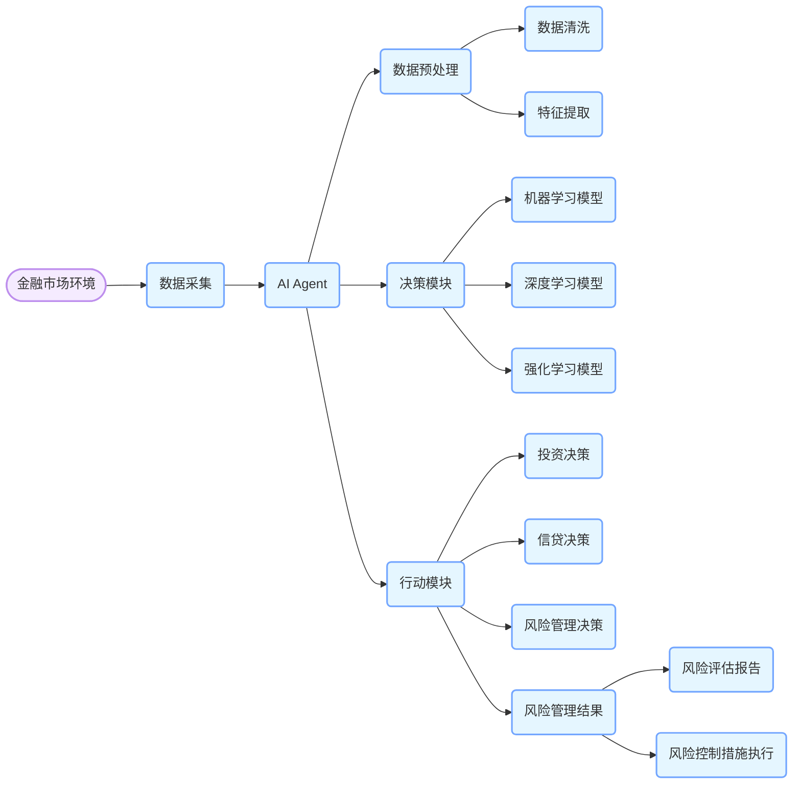

# AI Agent在金融风险分析中的应用

> 关键词：AI Agent、金融风险分析、人工智能、风险评估、决策支持

> 摘要：本文深入探讨了AI Agent在金融风险分析中的应用。首先介绍了相关背景，包括目的、预期读者、文档结构和术语表。接着阐述了AI Agent和金融风险分析的核心概念及其联系，给出了原理和架构的文本示意图与Mermaid流程图。详细讲解了核心算法原理和具体操作步骤，并用Python源代码进行了阐述。分析了相关数学模型和公式，并举例说明。通过项目实战展示了代码实际案例并进行详细解释。探讨了AI Agent在金融风险分析中的实际应用场景，推荐了学习资源、开发工具框架和相关论文著作。最后总结了未来发展趋势与挑战，提供了常见问题与解答以及扩展阅读和参考资料，旨在为金融领域利用AI Agent进行风险分析提供全面的技术指导和理论支持。

## 1. 背景介绍 
### 1.1 目的和范围
金融行业面临着各种复杂的风险，如信用风险、市场风险、流动性风险等。准确、及时地分析和评估这些风险对于金融机构的稳健运营至关重要。AI Agent作为一种具有自主决策和学习能力的智能实体，能够在金融风险分析中发挥重要作用。本文的目的是深入探讨AI Agent在金融风险分析中的应用原理、方法和实践，涵盖了从核心概念到实际应用的各个方面，旨在为金融从业者、研究人员和技术开发者提供全面的参考。

### 1.2 预期读者
本文的预期读者包括金融领域的专业人士，如银行风险管理人员、投资分析师、保险精算师等，他们希望了解如何利用AI Agent提升金融风险分析的效率和准确性；计算机科学领域的研究人员和开发者，对AI Agent技术在金融领域的应用感兴趣；以及对金融科技和人工智能交叉领域有学习需求的学生和爱好者。

### 1.3 文档结构概述
本文将按照以下结构展开：首先介绍相关的核心概念，包括AI Agent和金融风险分析的定义和联系；然后详细讲解核心算法原理和具体操作步骤，并给出Python源代码示例；接着分析相关的数学模型和公式，并举例说明；通过项目实战展示AI Agent在金融风险分析中的具体应用；探讨实际应用场景；推荐相关的学习资源、开发工具框架和论文著作；最后总结未来发展趋势与挑战，提供常见问题解答和扩展阅读参考资料。

### 1.4 术语表
#### 1.4.1 核心术语定义
- **AI Agent**：一种能够感知环境、自主决策并采取行动以实现特定目标的智能实体。它可以通过学习和适应不断优化自己的行为。
- **金融风险分析**：对金融活动中可能面临的各种风险进行识别、评估和控制的过程。包括信用风险、市场风险、流动性风险等多种类型。
- **信用风险**：指借款人或交易对手未能履行合同义务而导致损失的可能性。
- **市场风险**：由于市场价格波动（如利率、汇率、股票价格等）而导致金融资产价值变动的风险。
- **流动性风险**：指金融机构无法及时以合理价格变现资产或筹集资金以满足支付需求的风险。

#### 1.4.2 相关概念解释
- **机器学习**：是AI Agent实现智能决策和学习的重要技术手段，通过对大量数据的学习和分析，建立模型来预测和分类。
- **深度学习**：是机器学习的一个分支，利用多层神经网络对数据进行深度特征提取和学习，在图像识别、自然语言处理等领域取得了显著成果。
- **强化学习**：通过智能体与环境的交互，根据环境反馈的奖励信号来学习最优策略，适用于需要在动态环境中进行决策的场景。

#### 1.4.3 缩略词列表
- **AI**：Artificial Intelligence（人工智能）
- **ML**：Machine Learning（机器学习）
- **DL**：Deep Learning（深度学习）
- **RL**：Reinforcement Learning（强化学习）

## 2. 核心概念与联系 
### 核心概念原理
#### AI Agent原理
AI Agent通常由感知模块、决策模块和行动模块组成。感知模块负责收集环境信息，如金融市场数据、客户信用信息等；决策模块根据感知到的信息，运用算法和模型进行分析和判断，制定决策方案；行动模块则根据决策结果采取相应的行动，如调整投资组合、发放贷款等。AI Agent可以通过学习和进化不断提高自己的决策能力和适应性。

#### 金融风险分析原理
金融风险分析的核心是对各种风险因素进行识别、度量和评估。首先，需要确定可能影响金融活动的风险因素，如宏观经济指标、行业发展趋势、企业财务状况等；然后，运用数学模型和统计方法对这些风险因素进行量化分析，计算出风险指标，如风险价值（VaR）、信用评分等；最后，根据风险评估结果制定相应的风险管理策略，如风险分散、风险对冲等。

### 架构的文本示意图
```plaintext
金融市场环境
|
|-- 数据采集（感知模块）
|   |
|   |-- 市场数据（价格、利率等）
|   |-- 客户数据（信用记录、财务状况等）
|   |-- 宏观经济数据（GDP、通货膨胀率等）
|
|-- AI Agent
|   |
|   |-- 数据预处理
|   |   |
|   |   |-- 数据清洗
|   |   |-- 特征提取
|   |
|   |-- 决策模块
|   |   |
|   |   |-- 机器学习模型（分类、回归等）
|   |   |-- 深度学习模型（神经网络等）
|   |   |-- 强化学习模型（策略优化等）
|   |
|   |-- 行动模块
|       |
|       |-- 投资决策（资产配置、交易执行等）
|       |-- 信贷决策（贷款审批、额度调整等）
|       |-- 风险管理决策（风险分散、对冲等）
|
|-- 风险管理结果
    |
    |-- 风险评估报告
    |-- 风险控制措施执行
```

### Mermaid流程图


## 3. 核心算法原理 & 具体操作步骤 
### 核心算法原理
#### 机器学习算法
在金融风险分析中，常用的机器学习算法包括逻辑回归、决策树、随机森林等。以逻辑回归为例，它是一种用于分类问题的算法，通过建立线性回归模型并使用逻辑函数将输出值映射到概率值，从而进行分类决策。逻辑回归的模型可以表示为：
$$P(Y = 1|X) = \frac{1}{1 + e^{-(w_0 + w_1x_1 + w_2x_2 + \cdots + w_nx_n)}}$$
其中，$P(Y = 1|X)$ 表示在输入特征 $X = (x_1, x_2, \cdots, x_n)$ 下，类别为 1 的概率；$w_0, w_1, w_2, \cdots, w_n$ 是模型的参数。

#### 深度学习算法
深度学习算法在处理复杂的金融数据和非线性关系方面具有优势，如卷积神经网络（CNN）和循环神经网络（RNN）。以长短期记忆网络（LSTM）为例，它是一种特殊的RNN，能够有效处理序列数据中的长期依赖关系。LSTM单元的结构包括输入门、遗忘门和输出门，通过这些门控机制来控制信息的流动和记忆。

#### 强化学习算法
强化学习算法适用于需要在动态环境中进行决策的场景，如投资组合优化。以Q学习算法为例，它通过学习一个动作价值函数 $Q(s, a)$ 来确定在状态 $s$ 下采取动作 $a$ 的价值。Q学习的更新公式为：
$$Q(s_t, a_t) \leftarrow Q(s_t, a_t) + \alpha [r_{t+1} + \gamma \max_{a} Q(s_{t+1}, a) - Q(s_t, a_t)]$$
其中，$s_t$ 是当前状态，$a_t$ 是当前动作，$r_{t+1}$ 是下一个时间步的奖励，$\alpha$ 是学习率，$\gamma$ 是折扣因子。

### 具体操作步骤
#### 数据收集
从金融市场数据源、企业财务报表、征信机构等渠道收集相关数据，包括市场价格、利率、企业财务指标、客户信用记录等。

#### 数据预处理
对收集到的数据进行清洗，去除缺失值、异常值；进行特征提取和选择，将原始数据转换为适合模型输入的特征向量。

#### 模型训练
选择合适的算法和模型，将预处理后的数据划分为训练集和测试集，使用训练集对模型进行训练，调整模型参数以优化性能。

#### 模型评估
使用测试集对训练好的模型进行评估，计算评估指标，如准确率、召回率、F1值等，评估模型的性能和泛化能力。

#### 决策和应用
根据训练好的模型对新的数据进行预测和决策，如判断客户的信用风险、调整投资组合等，并将决策结果应用到实际的金融业务中。

### Python源代码示例
```python
import pandas as pd
from sklearn.model_selection import train_test_split
from sklearn.linear_model import LogisticRegression
from sklearn.metrics import accuracy_score

# 数据收集和预处理
data = pd.read_csv('financial_data.csv')
X = data.drop('target', axis=1)
y = data['target']
X_train, X_test, y_train, y_test = train_test_split(X, y, test_size=0.2, random_state=42)

# 模型训练
model = LogisticRegression()
model.fit(X_train, y_train)

# 模型预测
y_pred = model.predict(X_test)

# 模型评估
accuracy = accuracy_score(y_test, y_pred)
print(f"模型准确率: {accuracy}")
```

## 4. 数学模型和公式 & 详细讲解 & 举例说明 
### 风险价值（VaR）模型
#### 数学公式
风险价值（VaR）是衡量市场风险的常用指标，它表示在一定的置信水平下，某一金融资产或投资组合在未来特定时期内可能遭受的最大损失。VaR的计算公式为：
$$P(\Delta V \leq -VaR) = 1 - c$$
其中，$\Delta V$ 是金融资产或投资组合的价值变动，$c$ 是置信水平。

#### 详细讲解
VaR的计算方法有多种，如历史模拟法、方差 - 协方差法和蒙特卡罗模拟法。历史模拟法通过回顾历史数据来估计未来的风险，假设未来的市场变化与历史相似；方差 - 协方差法基于资产收益率的正态分布假设，通过计算资产收益率的均值和方差来估计VaR；蒙特卡罗模拟法通过模拟大量的市场情景来估计VaR，适用于处理复杂的金融产品和非正态分布的情况。

#### 举例说明
假设一个投资组合的价值为 $100$ 万元，置信水平为 $95\%$，通过历史模拟法计算得到VaR为 $5$ 万元。这意味着在未来的特定时期内，有 $95\%$ 的可能性该投资组合的损失不会超过 $5$ 万元。

### 信用评分模型
#### 数学公式
信用评分模型通常使用逻辑回归等算法来计算客户的信用评分。以逻辑回归为例，信用评分可以表示为：
$$Score = a + b_1x_1 + b_2x_2 + \cdots + b_nx_n$$
其中，$x_1, x_2, \cdots, x_n$ 是客户的特征变量，如年龄、收入、信用历史等；$a, b_1, b_2, \cdots, b_n$ 是模型的参数。

#### 详细讲解
信用评分模型通过对大量客户的历史数据进行学习，建立特征变量与违约概率之间的关系。根据客户的特征变量计算出信用评分，信用评分越高，表明客户的信用风险越低。金融机构可以根据信用评分来决定是否批准贷款、确定贷款额度和利率等。

#### 举例说明
假设一个信用评分模型的参数为 $a = 500$，$b_1 = 10$（年龄），$b_2 = 20$（收入），一个客户的年龄为 $30$ 岁，收入为 $5000$ 元，则该客户的信用评分为：
$$Score = 500 + 10 \times 30 + 20 \times 5000 = 500 + 300 + 100000 = 100800$$

## 5. 项目实战：代码实际案例和详细解释说明 
### 5.1  开发环境搭建
#### 安装Python
首先需要安装Python，建议使用Python 3.7及以上版本。可以从Python官方网站（https://www.python.org/downloads/）下载安装包进行安装。

#### 安装必要的库
在命令行中使用pip命令安装必要的库，如pandas、numpy、scikit-learn等：
```sh
pip install pandas numpy scikit-learn
```

### 5.2  源代码详细实现和代码解读
```python
import pandas as pd
from sklearn.model_selection import train_test_split
from sklearn.ensemble import RandomForestClassifier
from sklearn.metrics import classification_report

# 数据加载
data = pd.read_csv('credit_data.csv')

# 数据预处理
X = data.drop('default', axis=1)
y = data['default']
X_train, X_test, y_train, y_test = train_test_split(X, y, test_size=0.2, random_state=42)

# 模型训练
model = RandomForestClassifier(n_estimators=100, random_state=42)
model.fit(X_train, y_train)

# 模型预测
y_pred = model.predict(X_test)

# 模型评估
report = classification_report(y_test, y_pred)
print(report)
```

#### 代码解读
1. **数据加载**：使用pandas库的`read_csv`函数加载信用数据文件`credit_data.csv`。
2. **数据预处理**：将特征变量和目标变量分离，使用`train_test_split`函数将数据划分为训练集和测试集，测试集占比为 $20\%$。
3. **模型训练**：使用随机森林分类器作为模型，设置`n_estimators`为 $100$，表示使用 $100$ 棵决策树进行训练。
4. **模型预测**：使用训练好的模型对测试集进行预测，得到预测结果`y_pred`。
5. **模型评估**：使用`classification_report`函数生成分类报告，包括准确率、召回率、F1值等评估指标。

### 5.3  代码解读与分析
#### 随机森林算法
随机森林是一种集成学习算法，通过组合多个决策树来提高模型的性能和稳定性。每个决策树在不同的数据集子集和特征子集上进行训练，最后通过投票或平均的方式得到最终的预测结果。

#### 评估指标分析
- **准确率（Accuracy）**：表示预测正确的样本数占总样本数的比例，反映了模型的整体预测能力。
- **召回率（Recall）**：表示实际为正例的样本中被预测为正例的比例，反映了模型对正例的识别能力。
- **F1值（F1-score）**：是准确率和召回率的调和平均数，综合考虑了模型的准确率和召回率。

通过分析分类报告，可以评估模型在不同类别上的性能，发现模型的优缺点，并进行相应的调整和优化。

## 6. 实际应用场景 
### 信用风险评估
AI Agent可以通过分析客户的信用历史、财务状况、收入水平等多方面信息，对客户的信用风险进行评估。例如，银行在审批贷款时，可以使用AI Agent计算客户的信用评分，根据评分决定是否批准贷款以及贷款的额度和利率。

### 市场风险监测
AI Agent可以实时监测金融市场的价格波动、利率变化等信息，对投资组合的市场风险进行评估和预警。例如，投资机构可以使用AI Agent计算投资组合的VaR值，及时调整投资策略以降低风险。

### 流动性风险管理
AI Agent可以分析金融机构的资产负债结构、资金流动性等情况，对流动性风险进行评估和管理。例如，银行可以使用AI Agent预测未来的资金需求，合理安排资金储备，避免出现流动性危机。

### 欺诈检测
AI Agent可以通过分析交易数据、客户行为模式等信息，识别潜在的欺诈行为。例如，信用卡公司可以使用AI Agent监测客户的交易记录，及时发现异常交易并采取措施防止欺诈损失。

## 7. 工具和资源推荐
### 7.1 学习资源推荐
#### 7.1.1 书籍推荐
- 《人工智能：一种现代的方法》：全面介绍了人工智能的基本概念、算法和应用，是人工智能领域的经典教材。
- 《Python机器学习》：详细讲解了使用Python进行机器学习的方法和技巧，包括数据预处理、模型选择、评估等方面。
- 《金融风险管理》：系统介绍了金融风险的识别、度量和管理方法，是金融风险管理领域的权威著作。

#### 7.1.2 在线课程
- Coursera上的“机器学习”课程：由斯坦福大学教授Andrew Ng主讲，是机器学习领域的经典课程，涵盖了机器学习的基本概念、算法和应用。
- edX上的“深度学习”课程：由深度学习领域的知名学者授课，深入讲解了深度学习的原理、模型和应用。
- Udemy上的“金融科技实战”课程：结合实际案例，介绍了金融科技在金融风险分析、投资决策等方面的应用。

#### 7.1.3 技术博客和网站
- Towards Data Science：是一个专注于数据科学和机器学习的博客平台，提供了大量的技术文章和案例分析。
- Kaggle：是一个数据科学竞赛平台，上面有很多关于金融风险分析的数据集和竞赛项目，可以学习到其他选手的优秀解决方案。
- Medium：是一个综合性的博客平台，有很多金融科技和人工智能领域的专家分享他们的经验和见解。

### 7.2 开发工具框架推荐
#### 7.2.1 IDE和编辑器
- PyCharm：是一款专业的Python集成开发环境，提供了丰富的代码编辑、调试、版本控制等功能，适合开发大型的Python项目。
- Jupyter Notebook：是一个交互式的编程环境，支持多种编程语言，方便进行数据探索、模型实验和结果展示。
- Visual Studio Code：是一款轻量级的代码编辑器，支持多种编程语言和插件扩展，具有良好的代码编辑体验和开发效率。

#### 7.2.2 调试和性能分析工具
- PDB：是Python自带的调试工具，可以在代码中设置断点，逐行调试代码，帮助发现和解决问题。
- cProfile：是Python的性能分析工具，可以分析代码的运行时间和函数调用情况，帮助优化代码性能。
- TensorBoard：是TensorFlow的可视化工具，可以可视化模型的训练过程、性能指标等信息，方便进行模型调试和优化。

#### 7.2.3 相关框架和库
- Scikit-learn：是一个常用的机器学习库，提供了丰富的机器学习算法和工具，如分类、回归、聚类等。
- TensorFlow：是一个开源的深度学习框架，支持多种深度学习模型的构建和训练，如神经网络、卷积神经网络等。
- PyTorch：是另一个流行的深度学习框架，具有动态图的特点，易于使用和调试，在学术界和工业界都有广泛的应用。

### 7.3 相关论文著作推荐
#### 7.3.1 经典论文
- 《Capital Asset Pricing Model: A Theory of Market Equilibrium under Conditions of Risk》：提出了资本资产定价模型（CAPM），是现代金融理论的重要基础。
- 《On the Pricing of Corporate Debt: The Risk Structure of Interest Rates》：研究了公司债务的定价问题，提出了信用风险定价的理论模型。
- 《Machine Learning in Automated Trading: Review and Classification》：对机器学习在自动化交易中的应用进行了综述和分类，为相关研究提供了重要的参考。

#### 7.3.2 最新研究成果
- 《Deep Reinforcement Learning for Portfolio Optimization》：研究了深度强化学习在投资组合优化中的应用，提出了一种基于深度强化学习的投资组合优化算法。
- 《Credit Risk Assessment Using Machine Learning Techniques: A Comparative Analysis》：比较了不同机器学习技术在信用风险评估中的性能，为信用风险评估提供了新的方法和思路。
- 《AI in Finance: Transforming the Industry》：探讨了人工智能在金融领域的应用现状和未来发展趋势，对金融科技的发展具有重要的指导意义。

#### 7.3.3 应用案例分析
- 《How JP Morgan Uses AI to Manage Risk》：介绍了摩根大通如何使用人工智能技术进行风险管理，包括信用风险评估、市场风险监测等方面的应用案例。
- 《AI - Powered Fraud Detection in the Banking Industry》：分析了银行如何使用人工智能技术进行欺诈检测，通过实际案例展示了人工智能在防范金融欺诈方面的有效性。
- 《Investment Management with AI: A Case Study》：以某个投资机构为例，介绍了如何使用人工智能技术进行投资管理，包括投资策略制定、资产配置等方面的应用案例。

## 8. 总结：未来发展趋势与挑战
### 未来发展趋势
#### 智能化程度不断提高
随着人工智能技术的不断发展，AI Agent在金融风险分析中的智能化程度将不断提高。未来的AI Agent将能够更加准确地感知金融市场环境，自主学习和适应市场变化，做出更加智能的决策。

#### 与其他技术深度融合
AI Agent将与区块链、物联网等其他技术深度融合，为金融风险分析提供更加全面、准确的数据支持。例如，区块链技术可以提供可信的交易记录，物联网技术可以实时监测企业的生产经营情况，这些数据可以帮助AI Agent更好地评估信用风险和市场风险。

#### 应用场景不断拓展
AI Agent在金融风险分析中的应用场景将不断拓展，除了传统的信用风险评估、市场风险监测等领域，还将应用于金融创新产品的风险评估、金融监管等领域。

### 挑战
#### 数据质量和安全问题
金融数据的质量和安全是AI Agent应用的关键问题。金融数据通常具有复杂性、多样性和敏感性等特点，数据的质量直接影响模型的性能和决策的准确性。同时，数据的安全问题也不容忽视，需要采取有效的措施保护金融数据的隐私和安全。

#### 模型可解释性问题
深度学习等复杂模型在金融风险分析中取得了较好的效果，但这些模型往往具有较强的黑盒性，难以解释模型的决策过程和结果。在金融领域，模型的可解释性非常重要，需要开发具有可解释性的模型和方法。

#### 法律法规和监管问题
AI Agent在金融风险分析中的应用涉及到法律法规和监管问题。例如，如何确保AI Agent的决策符合法律法规的要求，如何对AI Agent的应用进行监管等。需要建立健全相关的法律法规和监管体系，保障金融市场的稳定和安全。

## 9. 附录：常见问题与解答
### 问题1：AI Agent在金融风险分析中的应用是否会完全取代人类分析师？
答：不会。虽然AI Agent在数据处理、模型计算等方面具有优势，但金融风险分析是一个复杂的过程，需要考虑到很多非量化的因素，如市场情绪、政策变化等。人类分析师具有丰富的经验和判断力，能够对这些非量化因素进行分析和判断。因此，AI Agent和人类分析师应该相互协作，共同提高金融风险分析的效率和准确性。

### 问题2：如何选择适合的AI Agent算法和模型？
答：选择适合的AI Agent算法和模型需要考虑多个因素，如数据类型、问题类型、模型复杂度等。对于简单的分类和回归问题，可以选择逻辑回归、决策树等传统机器学习算法；对于复杂的序列数据和图像数据，可以选择深度学习算法，如CNN、RNN等；对于需要在动态环境中进行决策的问题，可以选择强化学习算法。同时，还需要通过实验和评估来比较不同算法和模型的性能，选择最优的模型。

### 问题3：AI Agent在金融风险分析中的应用需要具备哪些技术能力？
答：AI Agent在金融风险分析中的应用需要具备以下技术能力：
- 机器学习和深度学习知识：了解常用的机器学习和深度学习算法，如逻辑回归、决策树、神经网络等。
- 数据处理和分析能力：能够对金融数据进行清洗、预处理、特征提取等操作，掌握数据分析和可视化工具。
- 编程能力：熟练掌握Python等编程语言，能够使用相关的库和框架进行模型开发和训练。
- 金融知识：了解金融市场的基本原理和金融风险的类型和特征，能够将技术应用到实际的金融业务中。

## 10. 扩展阅读 & 参考资料
### 扩展阅读
- 《金融科技前沿：技术趋势与应用实践》
- 《人工智能时代的金融风险管理》
- 《大数据与金融风险分析》

### 参考资料
- 《人工智能：一种现代的方法》（Stuart Russell, Peter Norvig）
- 《Python机器学习》（Sebastian Raschka, Vahid Mirjalili）
- 《金融风险管理》（John C. Hull）
- Coursera“机器学习”课程（Andrew Ng）
- edX“深度学习”课程
- Udemy“金融科技实战”课程
- Towards Data Science博客平台
- Kaggle数据科学竞赛平台
- Medium博客平台
- Scikit - learn官方文档
- TensorFlow官方文档
- PyTorch官方文档
- 《Capital Asset Pricing Model: A Theory of Market Equilibrium under Conditions of Risk》（William F. Sharpe）
- 《On the Pricing of Corporate Debt: The Risk Structure of Interest Rates》（Robert C. Merton）
- 《Machine Learning in Automated Trading: Review and Classification》（Rishi Narang）
- 《Deep Reinforcement Learning for Portfolio Optimization》
- 《Credit Risk Assessment Using Machine Learning Techniques: A Comparative Analysis》
- 《AI in Finance: Transforming the Industry》
- 《How JP Morgan Uses AI to Manage Risk》
- 《AI - Powered Fraud Detection in the Banking Industry》
- 《Investment Management with AI: A Case Study》

作者：AI天才研究院/AI Genius Institute & 禅与计算机程序设计艺术 /Zen And The Art of Computer Programming