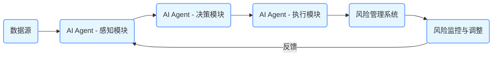

# AI Agent在风险管理中的应用

> 关键词：AI Agent、风险管理、智能决策、自动化流程、风险评估

> 摘要：本文深入探讨了AI Agent在风险管理领域的应用。首先介绍了相关背景，包括目的范围、预期读者等内容。接着阐述了AI Agent和风险管理的核心概念及联系，详细讲解了核心算法原理与具体操作步骤，给出了相应的数学模型和公式。通过项目实战展示了AI Agent在风险管理中的代码实现与解读。分析了其实际应用场景，推荐了学习、开发工具框架及相关论文著作。最后总结了未来发展趋势与挑战，并提供了常见问题解答和扩展阅读参考资料，旨在为读者全面呈现AI Agent在风险管理中的应用全貌。

## 1. 背景介绍 
### 1.1 目的和范围
随着科技的飞速发展，风险管理领域面临着日益复杂的挑战，传统的风险管理方法在处理海量数据和实时决策方面逐渐显得力不从心。本文的目的在于深入研究AI Agent在风险管理中的应用，探讨如何利用AI Agent的智能特性提升风险管理的效率和准确性。具体范围涵盖了AI Agent在风险识别、评估、预警和应对等各个环节的应用，分析其优势和潜在问题，并通过实际案例展示其可行性和有效性。

### 1.2 预期读者
本文的预期读者主要包括风险管理领域的专业人士，如金融机构的风险管理人员、企业的风险分析师等，他们希望了解新技术在风险管理中的应用，以提升自身的工作能力和风险管理水平。同时，也适合对人工智能和风险管理交叉领域感兴趣的研究人员、学生，以及关注科技发展对传统行业影响的投资者和决策者。

### 1.3 文档结构概述
本文将按照以下结构进行阐述：首先介绍核心概念与联系，明确AI Agent和风险管理的基本定义和相互关系；接着讲解核心算法原理和具体操作步骤，通过Python代码进行详细说明；然后给出数学模型和公式，并结合实际例子进行解释；通过项目实战展示AI Agent在风险管理中的具体实现和代码解读；分析其实际应用场景；推荐相关的学习资源、开发工具框架和论文著作；最后总结未来发展趋势与挑战，提供常见问题解答和扩展阅读参考资料。

### 1.4 术语表
#### 1.4.1 核心术语定义
- **AI Agent（人工智能代理）**：是一种能够感知环境、根据内部状态和目标进行决策，并通过执行器对环境产生作用的智能实体。它可以自主地或在人类的指导下完成特定的任务。
- **风险管理**：是指如何在一个肯定有风险的环境里把风险可能造成的不良影响减至最低的管理过程。包括风险识别、评估、应对和监控等环节。

#### 1.4.2 相关概念解释
- **风险识别**：是风险管理的第一步，通过各种方法和技术，识别可能对组织目标产生影响的风险因素。
- **风险评估**：对识别出的风险进行量化分析，评估其发生的可能性和影响程度。
- **风险预警**：根据风险评估的结果，在风险达到一定阈值时发出警报，提醒相关人员采取措施。
- **风险应对**：针对不同的风险，制定相应的策略和措施，以降低风险的影响。

#### 1.4.3 缩略词列表
- **AI**：Artificial Intelligence，人工智能
- **ML**：Machine Learning，机器学习
- **DL**：Deep Learning，深度学习

## 2. 核心概念与联系 

### 核心概念原理
#### AI Agent原理
AI Agent的核心原理基于感知、决策和行动的循环。它通过传感器感知环境信息，将这些信息输入到决策模块。决策模块根据内部的知识、规则或模型进行推理和判断，生成相应的行动策略。最后，执行器根据决策结果对环境产生作用。例如，一个金融风险管理的AI Agent可以通过收集市场数据、企业财务报表等信息，利用机器学习模型评估风险，然后根据评估结果向风险管理人员提供建议或自动执行交易操作。

#### 风险管理原理
风险管理的原理是通过对风险的识别、评估、应对和监控，实现对风险的有效控制。首先，需要全面识别可能存在的风险因素，包括市场风险、信用风险、操作风险等。然后，对这些风险进行量化评估，确定其发生的可能性和影响程度。根据评估结果，制定相应的风险应对策略，如风险规避、风险降低、风险转移等。最后，持续监控风险的变化，及时调整应对策略。

### 架构的文本示意图
AI Agent在风险管理中的架构可以描述为：AI Agent作为核心，通过数据接口与各种数据源相连，包括市场数据、企业内部数据、行业报告等。AI Agent内部包含感知模块、决策模块和执行模块。感知模块负责收集和处理数据，决策模块根据数据进行风险评估和决策，执行模块将决策结果转化为实际行动，如发出预警、调整投资组合等。同时，AI Agent与风险管理系统进行交互，将决策结果反馈给系统，系统根据反馈信息进行风险监控和调整。

### Mermaid流程图


## 3. 核心算法原理 & 具体操作步骤 

### 核心算法原理
在AI Agent应用于风险管理中，常用的算法包括机器学习算法和深度学习算法。以风险评估为例，我们可以使用逻辑回归算法。逻辑回归是一种用于二分类问题的统计模型，它通过对输入特征进行线性组合，然后使用逻辑函数将其转换为概率值。在风险管理中，我们可以将风险分为高风险和低风险两类，通过逻辑回归模型预测某个事件属于高风险的概率。

### Python源代码详细阐述
```python
import numpy as np
from sklearn.linear_model import LogisticRegression
from sklearn.model_selection import train_test_split
from sklearn.metrics import accuracy_score

# 生成示例数据
np.random.seed(0)
X = np.random.randn(100, 5)  # 100个样本，每个样本有5个特征
y = (np.sum(X, axis=1) > 0).astype(int)  # 生成二分类标签

# 划分训练集和测试集
X_train, X_test, y_train, y_test = train_test_split(X, y, test_size=0.2, random_state=42)

# 创建逻辑回归模型
model = LogisticRegression()

# 训练模型
model.fit(X_train, y_train)

# 预测
y_pred = model.predict(X_test)

# 计算准确率
accuracy = accuracy_score(y_test, y_pred)
print(f"模型准确率: {accuracy}")
```
### 具体操作步骤
1. **数据准备**：收集与风险管理相关的数据，如市场数据、企业财务数据等，并进行清洗和预处理，将其转换为适合模型输入的格式。
2. **模型选择**：根据具体的风险管理任务和数据特点，选择合适的算法和模型，如逻辑回归、决策树、神经网络等。
3. **模型训练**：使用训练数据对模型进行训练，调整模型的参数，使其能够准确地预测风险。
4. **模型评估**：使用测试数据对训练好的模型进行评估，计算模型的准确率、召回率、F1值等指标，评估模型的性能。
5. **模型部署**：将训练好的模型部署到实际的风险管理系统中，让AI Agent根据模型的预测结果进行决策和行动。

## 4. 数学模型和公式 & 详细讲解 & 举例说明 

### 逻辑回归数学模型和公式
逻辑回归的数学模型可以表示为：
$$
P(y = 1|x) = \frac{1}{1 + e^{-(w_0 + w_1x_1 + w_2x_2 + \cdots + w_nx_n)}}
$$
其中，$P(y = 1|x)$ 表示在输入特征 $x = (x_1, x_2, \cdots, x_n)$ 的条件下，事件 $y = 1$ 发生的概率；$w_0, w_1, w_2, \cdots, w_n$ 是模型的参数。

逻辑回归的目标是找到一组参数 $w$，使得模型对训练数据的似然函数最大。似然函数可以表示为：
$$
L(w) = \prod_{i=1}^{m} P(y^{(i)} = 1|x^{(i)})^{y^{(i)}} (1 - P(y^{(i)} = 1|x^{(i)}))^{1 - y^{(i)}}
$$
其中，$m$ 是训练数据的样本数量，$x^{(i)}$ 和 $y^{(i)}$ 分别是第 $i$ 个样本的输入特征和标签。

为了方便计算，通常会对似然函数取对数，得到对数似然函数：
$$
\ell(w) = \log L(w) = \sum_{i=1}^{m} [y^{(i)} \log P(y^{(i)} = 1|x^{(i)}) + (1 - y^{(i)}) \log (1 - P(y^{(i)} = 1|x^{(i)}))]
$$
然后，通过梯度下降等优化算法，最大化对数似然函数，得到最优的参数 $w$。

### 详细讲解
逻辑回归通过对输入特征进行线性组合，然后使用逻辑函数将其转换为概率值。逻辑函数的取值范围在 $[0, 1]$ 之间，可以很好地表示事件发生的概率。在风险管理中，我们可以根据这个概率值来判断某个事件是否属于高风险。例如，如果 $P(y = 1|x) > 0.5$，我们可以认为该事件属于高风险；否则，属于低风险。

### 举例说明
假设我们要评估一个企业的信用风险，我们可以选择一些与企业信用相关的特征，如资产负债率、利润率、流动比率等。将这些特征作为输入，使用逻辑回归模型进行训练。训练完成后，对于一个新的企业，我们可以输入其相应的特征值，模型会输出该企业违约的概率。如果概率大于某个阈值，如 $0.5$，我们可以认为该企业存在较高的信用风险，需要采取相应的措施，如增加担保、提高贷款利率等。

## 5. 项目实战：代码实际案例和详细解释说明 

### 5.1  开发环境搭建
#### 操作系统
可以选择Windows、Linux或Mac OS等主流操作系统。这里以Ubuntu 20.04为例进行说明。

#### 安装Python
在Ubuntu上，可以使用以下命令安装Python 3：
```bash
sudo apt update
sudo apt install python3 python3-pip
```

#### 安装必要的库
使用以下命令安装项目所需的库：
```bash
pip install numpy pandas scikit-learn matplotlib
```

### 5.2  源代码详细实现和代码解读
```python
import numpy as np
import pandas as pd
from sklearn.model_selection import train_test_split
from sklearn.linear_model import LogisticRegression
from sklearn.metrics import accuracy_score, confusion_matrix
import matplotlib.pyplot as plt

# 加载数据
data = pd.read_csv('risk_data.csv')

# 分离特征和标签
X = data.drop('risk_label', axis=1)
y = data['risk_label']

# 划分训练集和测试集
X_train, X_test, y_train, y_test = train_test_split(X, y, test_size=0.2, random_state=42)

# 创建逻辑回归模型
model = LogisticRegression()

# 训练模型
model.fit(X_train, y_train)

# 预测
y_pred = model.predict(X_test)

# 计算准确率
accuracy = accuracy_score(y_test, y_pred)
print(f"模型准确率: {accuracy}")

# 计算混淆矩阵
cm = confusion_matrix(y_test, y_pred)
print("混淆矩阵:")
print(cm)

# 绘制混淆矩阵
plt.imshow(cm, interpolation='nearest', cmap=plt.cm.Blues)
plt.title('Confusion matrix')
plt.colorbar()
tick_marks = np.arange(2)
plt.xticks(tick_marks, ['Low Risk', 'High Risk'])
plt.yticks(tick_marks, ['Low Risk', 'High Risk'])

thresh = cm.max() / 2.
for i in range(cm.shape[0]):
    for j in range(cm.shape[1]):
        plt.text(j, i, format(cm[i, j], 'd'),
                 horizontalalignment="center",
                 color="white" if cm[i, j] > thresh else "black")

plt.tight_layout()
plt.ylabel('True label')
plt.xlabel('Predicted label')
plt.show()
```
### 代码解读与分析
1. **数据加载**：使用 `pandas` 库的 `read_csv` 函数加载包含风险数据的CSV文件。
2. **特征和标签分离**：将数据集中的特征和标签分离，便于后续的模型训练和预测。
3. **数据集划分**：使用 `train_test_split` 函数将数据集划分为训练集和测试集，比例为 $8:2$。
4. **模型创建和训练**：创建逻辑回归模型，并使用训练集对模型进行训练。
5. **模型预测**：使用训练好的模型对测试集进行预测。
6. **模型评估**：计算模型的准确率和混淆矩阵，评估模型的性能。准确率可以反映模型整体的预测准确性，混淆矩阵可以更详细地展示模型在不同类别上的预测情况。
7. **可视化**：使用 `matplotlib` 库绘制混淆矩阵的可视化图，直观地展示模型的预测结果。

## 6. 实际应用场景 
### 金融风险管理
在金融领域，AI Agent可以用于信用风险评估、市场风险监测和操作风险预警等方面。例如，银行可以使用AI Agent对贷款申请人的信用状况进行评估，根据申请人的收入、负债、信用历史等信息，预测其违约的概率。在市场风险管理中，AI Agent可以实时监测市场数据，如股票价格、利率、汇率等，当市场波动超过一定阈值时，及时发出预警，帮助金融机构调整投资组合。

### 企业风险管理
企业可以利用AI Agent对供应链风险、运营风险和战略风险进行管理。在供应链风险管理中，AI Agent可以监测供应商的财务状况、交货时间等信息，提前发现潜在的风险，如供应商破产、交货延迟等，并及时采取措施，如寻找替代供应商、调整库存策略等。在运营风险管理中，AI Agent可以分析企业的生产数据、销售数据等，发现生产过程中的异常情况，如设备故障、质量问题等，及时通知相关人员进行处理。

### 医疗风险管理
在医疗领域，AI Agent可以用于医疗质量风险评估、医疗事故预警和药品不良反应监测等方面。例如，医院可以使用AI Agent对患者的病历数据、检查结果等进行分析，评估医疗质量风险，如手术并发症的发生概率。在医疗事故预警方面，AI Agent可以实时监测患者的生命体征、治疗过程等信息，当出现异常情况时，及时发出警报，提醒医护人员采取措施。

## 7. 工具和资源推荐
### 7.1 学习资源推荐
#### 7.1.1 书籍推荐
- 《机器学习》（周志华）：全面介绍了机器学习的基本概念、算法和应用，是机器学习领域的经典教材。
- 《深度学习》（Ian Goodfellow、Yoshua Bengio、Aaron Courville）：深度学习领域的权威著作，深入讲解了深度学习的原理、模型和算法。
- 《人工智能：一种现代的方法》（Stuart Russell、Peter Norvig）：涵盖了人工智能的各个方面，包括搜索算法、知识表示、机器学习、自然语言处理等，是人工智能领域的经典参考书。

#### 7.1.2 在线课程
- Coursera上的“机器学习”课程（Andrew Ng教授）：由机器学习领域的知名专家授课，内容深入浅出，适合初学者。
- edX上的“深度学习”系列课程：包括深度学习基础、卷积神经网络、循环神经网络等内容，帮助学习者系统地掌握深度学习知识。
- 中国大学MOOC上的“人工智能基础”课程：由国内高校的教授授课，介绍了人工智能的基本概念、算法和应用。

#### 7.1.3 技术博客和网站
- Medium：上面有很多关于人工智能和风险管理的技术文章，作者来自世界各地的技术专家和研究人员。
- Towards Data Science：专注于数据科学和机器学习领域的博客，提供了很多实用的技术教程和案例分析。
- Kaggle：一个数据科学竞赛平台，上面有很多关于风险管理的数据集和解决方案，可以学习到其他数据科学家的经验和技巧。

### 7.2 开发工具框架推荐
#### 7.2.1 IDE和编辑器
- PyCharm：一款专业的Python集成开发环境，提供了丰富的代码编辑、调试和项目管理功能。
- Jupyter Notebook：一个交互式的开发环境，适合进行数据分析和模型训练，支持Python、R等多种编程语言。
- Visual Studio Code：一款轻量级的代码编辑器，支持多种编程语言和插件扩展，可用于开发人工智能和风险管理项目。

#### 7.2.2 调试和性能分析工具
- TensorBoard：TensorFlow的可视化工具，可以用于可视化模型的训练过程、损失函数变化等信息，帮助调试和优化模型。
- Py-Spy：一个Python性能分析工具，可以分析Python程序的CPU使用情况和函数调用时间，帮助找出性能瓶颈。
- Scikit-learn的交叉验证和模型选择工具：可以用于评估模型的性能和选择最优的模型参数。

#### 7.2.3 相关框架和库
- Scikit-learn：一个简单易用的机器学习库，提供了各种机器学习算法和工具，如分类、回归、聚类等。
- TensorFlow：一个开源的深度学习框架，广泛应用于图像识别、自然语言处理等领域，支持分布式训练和模型部署。
- PyTorch：另一个流行的深度学习框架，具有动态图机制，易于使用和调试，适合科研和快速原型开发。

### 7.3 相关论文著作推荐
#### 7.3.1 经典论文
- “A Decision-Theoretic Approach to Classification”（Leo Breiman、Jerome Friedman、Richard Olshen、Charles Stone）：介绍了决策树分类算法的基本原理和应用。
- “Neural Networks and Deep Learning”（Michael Nielsen）：深入浅出地讲解了神经网络和深度学习的基本概念和算法。
- “Risk Management and Financial Institutions”（John C. Hull）：金融风险管理领域的经典著作，介绍了金融风险的种类、度量方法和管理策略。

#### 7.3.2 最新研究成果
- 可以通过IEEE Xplore、ACM Digital Library等学术数据库搜索关于AI Agent在风险管理中的最新研究论文，了解该领域的前沿动态。
- 参加相关的学术会议，如ACM SIGKDD、NeurIPS等，获取最新的研究成果和技术趋势。

#### 7.3.3 应用案例分析
- 一些金融机构和企业会发布关于AI Agent在风险管理中的应用案例报告，可以通过它们的官方网站或行业媒体获取这些案例，学习实际应用中的经验和教训。

## 8. 总结：未来发展趋势与挑战
### 未来发展趋势
- **与物联网和大数据的深度融合**：随着物联网技术的发展，大量的设备和传感器会产生海量的数据。AI Agent可以与物联网设备相结合，实时收集和分析这些数据，提高风险管理的实时性和准确性。同时，大数据技术的发展也为AI Agent提供了更丰富的数据资源，有助于训练更强大的模型。
- **强化学习和迁移学习的应用**：强化学习可以使AI Agent在不断的交互和试错中学习最优的决策策略，适用于动态和不确定的风险管理环境。迁移学习可以将在一个领域学到的知识迁移到另一个领域，提高模型的训练效率和泛化能力。
- **跨领域风险管理**：未来的风险管理将不再局限于单一领域，而是需要跨领域的综合管理。AI Agent可以整合不同领域的数据和知识，实现跨领域的风险识别、评估和应对。

### 挑战
- **数据质量和隐私问题**：AI Agent的性能很大程度上依赖于数据的质量。然而，实际应用中数据可能存在噪声、缺失值等问题，影响模型的训练和预测效果。同时，数据隐私也是一个重要的问题，尤其是在金融、医疗等领域，需要确保数据的安全和隐私。
- **模型可解释性**：深度学习等复杂模型虽然在性能上表现出色，但往往缺乏可解释性。在风险管理中，决策者需要了解模型的决策依据，以便做出合理的决策。因此，如何提高模型的可解释性是一个亟待解决的问题。
- **法律法规和伦理问题**：AI Agent在风险管理中的应用可能会涉及到法律法规和伦理问题。例如，模型的决策可能会对某些群体产生不公平的影响，需要制定相应的法律法规和伦理准则来规范其应用。

## 9. 附录：常见问题与解答
### 问题1：AI Agent在风险管理中的应用是否会完全取代人类？
解答：不会。虽然AI Agent在数据处理和决策速度方面具有优势，但风险管理不仅仅是数据和模型的问题，还涉及到人类的经验、判断力和价值观。在实际应用中，AI Agent可以作为人类的辅助工具，帮助人类更高效地处理风险，但最终的决策仍然需要人类来做出。

### 问题2：如何选择适合风险管理的AI Agent算法？
解答：选择适合的算法需要考虑多个因素，如数据的特点、风险管理的任务和目标、计算资源等。如果数据是线性可分的，逻辑回归等简单算法可能就足够了；如果数据具有复杂的非线性关系，可以考虑使用深度学习算法。同时，还需要进行实验和评估，比较不同算法在训练集和测试集上的性能，选择最优的算法。

### 问题3：AI Agent在风险管理中的应用需要多少数据？
解答：所需的数据量取决于算法的复杂度和数据的质量。一般来说，复杂的算法需要更多的数据来训练，以避免过拟合。同时，数据的质量也很重要，如果数据存在噪声、缺失值等问题，可能需要更多的数据来弥补。在实际应用中，可以通过交叉验证等方法来评估数据量对模型性能的影响，确定合适的数据量。

## 10. 扩展阅读 & 参考资料
### 扩展阅读
- 《人工智能时代的风险管理》：进一步探讨了人工智能技术在风险管理领域的应用和挑战。
- 《智能金融：科技重塑金融未来》：介绍了金融科技的发展趋势和应用，包括AI Agent在金融风险管理中的应用案例。

### 参考资料
- [Scikit-learn官方文档](https://scikit-learn.org/stable/documentation.html)
- [TensorFlow官方文档](https://www.tensorflow.org/api_docs)
- [PyTorch官方文档](https://pytorch.org/docs/stable/index.html)

作者：AI天才研究院/AI Genius Institute & 禅与计算机程序设计艺术 /Zen And The Art of Computer Programming