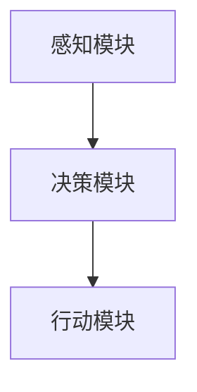

# AI Agent在食品安全监管中的应用

> 关键词：AI Agent、食品安全监管、智能决策、数据驱动、自动化检测

> 摘要：本文深入探讨了AI Agent在食品安全监管中的应用。随着食品行业的快速发展，食品安全问题日益受到关注，传统监管方式面临诸多挑战。AI Agent凭借其智能决策、自动化处理等特性，为食品安全监管带来了新的解决方案。文章首先介绍了相关背景，包括目的范围、预期读者等；接着阐述了AI Agent的核心概念与联系；详细讲解了其核心算法原理及具体操作步骤，并给出数学模型和公式；通过项目实战展示了代码实现及解读；分析了实际应用场景；推荐了相关工具和资源；最后总结了未来发展趋势与挑战，同时提供了常见问题解答和扩展阅读参考资料，旨在为相关从业者和研究者提供全面深入的参考。

## 1. 背景介绍 
### 1.1 目的和范围
食品安全直接关系到人民群众的身体健康和生命安全，是社会广泛关注的焦点问题。传统的食品安全监管方式主要依赖人工抽检、实验室检测等手段，存在效率低、覆盖范围有限、难以实时监测等问题。本文章的目的在于探讨AI Agent如何应用于食品安全监管领域，以提高监管效率、准确性和及时性，实现对食品安全的全方位、全过程监管。范围涵盖了从食品生产、加工、流通到消费的各个环节，以及AI Agent在这些环节中所涉及的技术、方法和应用场景。

### 1.2 预期读者
本文的预期读者包括食品安全监管部门的工作人员、食品企业的质量管理人员、从事人工智能和食品安全相关研究的科研人员、相关专业的学生以及对食品安全和人工智能技术感兴趣的普通读者。通过阅读本文，读者可以了解AI Agent在食品安全监管中的应用原理、方法和实践案例，为实际工作和研究提供参考和借鉴。

### 1.3 文档结构概述
本文将按照以下结构进行阐述：首先介绍背景信息，包括目的范围、预期读者等；接着讲解AI Agent的核心概念与联系，包括其原理和架构；详细介绍核心算法原理及具体操作步骤，并给出数学模型和公式；通过项目实战展示代码实现及解读；分析实际应用场景；推荐相关工具和资源；最后总结未来发展趋势与挑战，提供常见问题解答和扩展阅读参考资料。

### 1.4 术语表
#### 1.4.1 核心术语定义
- **AI Agent（人工智能代理）**：是一种能够感知环境、进行推理和决策，并采取行动以实现特定目标的智能实体。在食品安全监管中，AI Agent可以收集、分析食品安全相关数据，并根据分析结果做出监管决策。
- **食品安全监管**：指政府及其相关部门依据法律法规和标准，对食品生产、加工、流通、消费等环节进行监督管理，以保障食品安全的活动。
- **数据驱动**：指基于大量的数据进行分析和决策，通过挖掘数据中的信息和规律，为决策提供支持。在食品安全监管中，数据驱动可以帮助监管部门及时发现食品安全问题，采取有效的监管措施。

#### 1.4.2 相关概念解释
- **机器学习**：是人工智能的一个分支，通过让计算机从数据中学习模式和规律，从而实现对未知数据的预测和分类。在食品安全监管中，机器学习可以用于对食品检测数据的分析和处理，帮助监管部门识别潜在的食品安全风险。
- **深度学习**：是机器学习的一种，通过构建多层神经网络，自动从数据中提取特征和模式。深度学习在图像识别、语音识别等领域取得了显著的成果，在食品安全监管中，深度学习可以用于对食品图像、视频等数据的分析，帮助监管部门快速准确地检测食品中的有害物质。

#### 1.4.3 缩略词列表
- **AI**：Artificial Intelligence（人工智能）
- **ML**：Machine Learning（机器学习）
- **DL**：Deep Learning（深度学习）

## 2. 核心概念与联系 
### 2.1 AI Agent的原理
AI Agent的基本原理是通过感知环境中的信息，对这些信息进行处理和分析，然后根据预设的目标和规则做出决策，并采取相应的行动。在食品安全监管中，AI Agent可以通过各种传感器、监测设备等收集食品生产、加工、流通等环节的相关数据，如食品的成分、质量、温度、湿度等。然后，AI Agent对这些数据进行分析和处理，利用机器学习、深度学习等技术识别潜在的食品安全风险。最后，AI Agent根据分析结果做出决策，如发出预警、进行现场检查、采取整改措施等。

### 2.2 AI Agent的架构
AI Agent的架构通常包括感知模块、决策模块和行动模块。感知模块负责收集环境中的信息，如传感器数据、文本数据、图像数据等。决策模块对感知模块收集到的信息进行处理和分析，利用机器学习、深度学习等算法进行模型训练和预测，根据预设的目标和规则做出决策。行动模块根据决策模块的决策结果，采取相应的行动，如发送通知、控制设备、执行任务等。

以下是AI Agent架构的文本示意图：

```plaintext
+-------------------+
|    感知模块       |
| （收集环境信息）  |
+-------------------+
         |
         v
+-------------------+
|    决策模块       |
| （处理分析信息）  |
+-------------------+
         |
         v
+-------------------+
|    行动模块       |
| （执行决策行动）  |
+-------------------+
```

以下是AI Agent架构的Mermaid流程图：



### 2.3 AI Agent与食品安全监管的联系
AI Agent与食品安全监管密切相关。在食品安全监管中，AI Agent可以发挥以下作用：
- **数据收集与整合**：AI Agent可以通过各种传感器、监测设备等收集食品生产、加工、流通等环节的相关数据，并将这些数据整合到一个统一的平台上，方便监管部门进行管理和分析。
- **风险预警与预测**：AI Agent可以利用机器学习、深度学习等技术对收集到的数据进行分析和处理，识别潜在的食品安全风险，并及时发出预警。同时，AI Agent还可以对未来的食品安全趋势进行预测，为监管部门提供决策支持。
- **智能决策与执行**：AI Agent可以根据分析结果和预设的规则做出决策，并自动执行相应的行动，如发出通知、进行现场检查、采取整改措施等。这可以提高监管效率和准确性，减少人为因素的干扰。
- **过程监控与追溯**：AI Agent可以对食品生产、加工、流通等环节进行实时监控，记录相关信息，实现食品质量的可追溯性。一旦发生食品安全问题，监管部门可以通过AI Agent快速追溯到问题食品的来源和流向，采取有效的措施进行处理。

## 3. 核心算法原理 & 具体操作步骤 
### 3.1 核心算法原理
在AI Agent应用于食品安全监管中，常用的核心算法包括机器学习算法和深度学习算法。以下以支持向量机（SVM）和卷积神经网络（CNN）为例进行介绍。

#### 3.1.1 支持向量机（SVM）
支持向量机是一种二分类模型，其基本思想是在特征空间中找到一个最优的超平面，使得不同类别的样本能够被最大程度地分开。在食品安全监管中，SVM可以用于对食品检测数据进行分类，判断食品是否合格。

SVM的目标是求解以下优化问题：

$$\min_{w,b,\xi} \frac{1}{2}||w||^2 + C\sum_{i=1}^{n}\xi_i$$

$$s.t. \quad y_i(w^T\phi(x_i)+b) \geq 1 - \xi_i, \quad \xi_i \geq 0, \quad i = 1,2,\cdots,n$$

其中，$w$ 是超平面的法向量，$b$ 是偏置，$\xi_i$ 是松弛变量，$C$ 是惩罚参数，$x_i$ 是样本，$y_i$ 是样本的标签，$\phi(x_i)$ 是将样本 $x_i$ 映射到高维特征空间的函数。

#### 3.1.2 卷积神经网络（CNN）
卷积神经网络是一种专门用于处理具有网格结构数据的深度学习模型，如图像、音频等。在食品安全监管中，CNN可以用于对食品图像进行分析，检测食品中的有害物质。

CNN的基本结构包括卷积层、池化层和全连接层。卷积层通过卷积核提取输入数据的特征，池化层对特征图进行下采样，减少数据量，全连接层将提取的特征进行分类。

### 3.2 具体操作步骤
以下是使用Python实现基于SVM的食品分类的具体操作步骤：

```python
# 步骤1：导入必要的库
import numpy as np
from sklearn import datasets
from sklearn.model_selection import train_test_split
from sklearn.svm import SVC
from sklearn.metrics import accuracy_score

# 步骤2：加载数据
# 这里使用一个示例数据集，实际应用中需要使用真实的食品检测数据
iris = datasets.load_iris()
X = iris.data
y = iris.target

# 步骤3：划分训练集和测试集
X_train, X_test, y_train, y_test = train_test_split(X, y, test_size=0.3, random_state=42)

# 步骤4：创建SVM模型
model = SVC(kernel='linear')

# 步骤5：训练模型
model.fit(X_train, y_train)

# 步骤6：预测
y_pred = model.predict(X_test)

# 步骤7：评估模型
accuracy = accuracy_score(y_test, y_pred)
print(f"Accuracy: {accuracy}")
```

## 4. 数学模型和公式 & 详细讲解 & 举例说明 
### 4.1 支持向量机（SVM）的数学模型和公式
#### 4.1.1 线性可分情况
在线性可分的情况下，支持向量机的目标是找到一个超平面 $w^T x + b = 0$，使得不同类别的样本能够被最大程度地分开。超平面到最近样本的距离称为间隔，支持向量机的目标是最大化间隔。

设训练样本为 $(x_1, y_1), (x_2, y_2), \cdots, (x_n, y_n)$，其中 $x_i \in \mathbb{R}^d$ 是样本特征，$y_i \in \{-1, 1\}$ 是样本标签。则支持向量机的优化问题可以表示为：

$$\max_{\gamma, w, b} \gamma$$

$$s.t. \quad y_i(w^T x_i + b) \geq \gamma, \quad i = 1,2,\cdots,n$$

$$||w|| = 1$$

通过引入拉格朗日乘子，可以将上述优化问题转化为对偶问题：

$$\max_{\alpha} \sum_{i=1}^{n} \alpha_i - \frac{1}{2} \sum_{i=1}^{n} \sum_{j=1}^{n} \alpha_i \alpha_j y_i y_j x_i^T x_j$$

$$s.t. \quad \sum_{i=1}^{n} \alpha_i y_i = 0$$

$$\alpha_i \geq 0, \quad i = 1,2,\cdots,n$$

#### 4.1.2 线性不可分情况
在实际应用中，很多数据是线性不可分的。为了处理这种情况，支持向量机引入了松弛变量 $\xi_i$ 和惩罚参数 $C$。优化问题变为：

$$\min_{w,b,\xi} \frac{1}{2}||w||^2 + C\sum_{i=1}^{n}\xi_i$$

$$s.t. \quad y_i(w^T x_i + b) \geq 1 - \xi_i, \quad \xi_i \geq 0, \quad i = 1,2,\cdots,n$$

同样，通过引入拉格朗日乘子，可以将上述优化问题转化为对偶问题：

$$\max_{\alpha} \sum_{i=1}^{n} \alpha_i - \frac{1}{2} \sum_{i=1}^{n} \sum_{j=1}^{n} \alpha_i \alpha_j y_i y_j x_i^T x_j$$

$$s.t. \quad \sum_{i=1}^{n} \alpha_i y_i = 0$$

$$0 \leq \alpha_i \leq C, \quad i = 1,2,\cdots,n$$

### 4.2 卷积神经网络（CNN）的数学模型和公式
#### 4.2.1 卷积层
卷积层的核心操作是卷积运算。设输入特征图为 $X$，卷积核为 $K$，则卷积层的输出特征图 $Y$ 可以表示为：

$$Y_{i,j}^k = \sum_{m=0}^{M-1} \sum_{n=0}^{N-1} X_{i+m,j+n}^l K_{m,n}^{l,k} + b^k$$

其中，$Y_{i,j}^k$ 是输出特征图 $Y$ 的第 $k$ 个通道在位置 $(i,j)$ 的值，$X_{i+m,j+n}^l$ 是输入特征图 $X$ 的第 $l$ 个通道在位置 $(i+m,j+n)$ 的值，$K_{m,n}^{l,k}$ 是卷积核 $K$ 的第 $l$ 个输入通道到第 $k$ 个输出通道在位置 $(m,n)$ 的权重，$b^k$ 是偏置。

#### 4.2.2 池化层
池化层的作用是对特征图进行下采样，减少数据量。常见的池化操作有最大池化和平均池化。

最大池化的公式为：

$$Y_{i,j}^k = \max_{m=0}^{M-1} \max_{n=0}^{N-1} X_{iM+m,jN+n}^k$$

其中，$Y_{i,j}^k$ 是输出特征图 $Y$ 的第 $k$ 个通道在位置 $(i,j)$ 的值，$X_{iM+m,jN+n}^k$ 是输入特征图 $X$ 的第 $k$ 个通道在位置 $(iM+m,jN+n)$ 的值。

平均池化的公式为：

$$Y_{i,j}^k = \frac{1}{MN} \sum_{m=0}^{M-1} \sum_{n=0}^{N-1} X_{iM+m,jN+n}^k$$

### 4.3 举例说明
#### 4.3.1 SVM举例
假设我们有一个二维的数据集，包含两个类别，如下所示：

| 样本编号 | $x_1$ | $x_2$ | 标签 |
| ---- | ---- | ---- | ---- |
| 1 | 1 | 2 | 1 |
| 2 | 2 | 3 | 1 |
| 3 | 3 | 1 | -1 |
| 4 | 4 | 2 | -1 |

我们可以使用支持向量机来找到一个超平面将这两个类别分开。通过求解上述的优化问题，我们可以得到超平面的参数 $w$ 和 $b$，从而得到超平面的方程。

#### 4.3.2 CNN举例
假设我们有一张食品图像，我们想要检测图像中是否含有有害物质。我们可以使用卷积神经网络来对图像进行分析。首先，将图像输入到卷积层，通过卷积运算提取图像的特征。然后，将提取的特征输入到池化层进行下采样。最后，将下采样后的特征输入到全连接层进行分类，判断图像中是否含有有害物质。

## 5. 项目实战：代码实际案例和详细解释说明 
### 5.1 开发环境搭建
#### 5.1.1 安装Python
首先，需要安装Python环境。可以从Python官方网站（https://www.python.org/downloads/） 下载适合自己操作系统的Python安装包，并按照安装向导进行安装。

#### 5.1.2 安装必要的库
在项目中，需要使用一些Python库，如NumPy、Pandas、Scikit-learn、TensorFlow、Keras等。可以使用以下命令进行安装：

```sh
pip install numpy pandas scikit-learn tensorflow keras
```

### 5.2 源代码详细实现和代码解读
以下是一个使用卷积神经网络（CNN）对食品图像进行分类的项目实战代码：

```python
# 步骤1：导入必要的库
import numpy as np
import tensorflow as tf
from tensorflow.keras import layers, models
from tensorflow.keras.preprocessing.image import ImageDataGenerator

# 步骤2：数据准备
# 假设我们有一个包含食品图像的数据集，分为训练集和测试集
train_datagen = ImageDataGenerator(rescale=1./255)
test_datagen = ImageDataGenerator(rescale=1./255)

train_generator = train_datagen.flow_from_directory(
    'train_data_directory',
    target_size=(150, 150),
    batch_size=32,
    class_mode='binary')

test_generator = test_datagen.flow_from_directory(
    'test_data_directory',
    target_size=(150, 150),
    batch_size=32,
    class_mode='binary')

# 步骤3：构建CNN模型
model = models.Sequential()
model.add(layers.Conv2D(32, (3, 3), activation='relu', input_shape=(150, 150, 3)))
model.add(layers.MaxPooling2D((2, 2)))
model.add(layers.Conv2D(64, (3, 3), activation='relu'))
model.add(layers.MaxPooling2D((2, 2)))
model.add(layers.Conv2D(128, (3, 3), activation='relu'))
model.add(layers.MaxPooling2D((2, 2)))
model.add(layers.Flatten())
model.add(layers.Dense(128, activation='relu'))
model.add(layers.Dense(1, activation='sigmoid'))

# 步骤4：编译模型
model.compile(optimizer='adam',
              loss='binary_crossentropy',
              metrics=['accuracy'])

# 步骤5：训练模型
history = model.fit(
    train_generator,
    steps_per_epoch=train_generator.samples // train_generator.batch_size,
    epochs=10,
    validation_data=test_generator,
    validation_steps=test_generator.samples // test_generator.batch_size)

# 步骤6：评估模型
test_loss, test_acc = model.evaluate(test_generator)
print(f"Test accuracy: {test_acc}")
```

### 5.3 代码解读与分析
#### 5.3.1 数据准备
使用 `ImageDataGenerator` 对图像数据进行预处理，将图像的像素值归一化到 $[0, 1]$ 范围内。然后使用 `flow_from_directory` 方法从指定的目录中加载图像数据，并将其分为训练集和测试集。

#### 5.3.2 构建CNN模型
使用 `Sequential` 模型构建一个简单的卷积神经网络。模型包括三个卷积层和三个池化层，用于提取图像的特征。然后将提取的特征展平，通过全连接层进行分类。最后使用 `sigmoid` 激活函数输出分类结果。

#### 5.3.3 编译模型
使用 `adam` 优化器和 `binary_crossentropy` 损失函数编译模型。同时，使用 `accuracy` 作为评估指标。

#### 5.3.4 训练模型
使用 `fit` 方法训练模型，指定训练集和验证集，以及训练的轮数和每个轮次的步数。

#### 5.3.5 评估模型
使用 `evaluate` 方法评估模型在测试集上的性能，输出测试集的损失和准确率。

## 6. 实际应用场景 
### 6.1 食品生产环节
在食品生产环节，AI Agent可以实时监测生产过程中的各项参数，如温度、湿度、压力等。通过对这些参数的分析，AI Agent可以判断生产过程是否正常，是否存在食品安全隐患。例如，如果生产过程中的温度过高，可能会导致食品变质，AI Agent可以及时发出预警，提醒生产人员采取措施。

此外，AI Agent还可以对生产线上的食品进行质量检测。通过图像识别技术，AI Agent可以检测食品的外观、形状、颜色等是否符合标准，是否存在异物、瑕疵等问题。如果发现问题，AI Agent可以自动将问题食品剔除，保证产品质量。

### 6.2 食品加工环节
在食品加工环节，AI Agent可以对加工设备进行监测和管理。通过对设备的运行状态、能耗等数据的分析，AI Agent可以预测设备的故障风险，提前进行维护和保养，避免设备故障导致的食品安全问题。

同时，AI Agent可以对加工过程中的添加剂使用情况进行监管。通过对添加剂的种类、用量、使用时间等数据的记录和分析，AI Agent可以确保添加剂的使用符合国家标准，防止滥用添加剂对人体健康造成危害。

### 6.3 食品流通环节
在食品流通环节，AI Agent可以对食品的运输和储存条件进行监测。通过安装在运输车辆和仓库中的传感器，AI Agent可以实时获取温度、湿度、光照等环境参数。如果环境参数不符合要求，AI Agent可以及时发出预警，提醒运输和储存人员采取措施，保证食品的质量和安全。

此外，AI Agent还可以对食品的追溯信息进行管理。通过区块链等技术，AI Agent可以记录食品从生产到消费的全过程信息，包括生产批次、生产日期、运输路线、销售渠道等。一旦发生食品安全问题，监管部门可以通过AI Agent快速追溯到问题食品的来源和流向，采取有效的措施进行处理。

### 6.4 食品消费环节
在食品消费环节，AI Agent可以为消费者提供食品安全信息查询服务。消费者可以通过手机应用、网站等渠道，查询食品的相关信息，如生产厂家、生产日期、保质期、检测报告等。AI Agent可以根据消费者的查询信息，提供个性化的食品安全建议和提示，帮助消费者做出正确的消费决策。

同时，AI Agent还可以对消费者的反馈信息进行收集和分析。通过对消费者的投诉、评价等信息的分析，AI Agent可以及时发现食品安全问题，为监管部门提供线索和依据。

## 7. 工具和资源推荐
### 7.1 学习资源推荐
#### 7.1.1 书籍推荐
- 《人工智能：一种现代的方法》：这本书是人工智能领域的经典教材，全面介绍了人工智能的基本概念、方法和技术，包括搜索算法、知识表示、机器学习、自然语言处理等。
- 《深度学习》：这本书由深度学习领域的三位顶尖专家撰写，系统地介绍了深度学习的理论和实践，包括神经网络、卷积神经网络、循环神经网络等。
- 《Python机器学习》：这本书以Python为工具，介绍了机器学习的基本算法和实践，包括分类、回归、聚类、降维等。

#### 7.1.2 在线课程
- Coursera上的“机器学习”课程：由斯坦福大学的Andrew Ng教授授课，是机器学习领域的经典课程，介绍了机器学习的基本概念、算法和应用。
- edX上的“深度学习”课程：由伯克利大学的教授授课，系统地介绍了深度学习的理论和实践，包括神经网络、卷积神经网络、循环神经网络等。
- 网易云课堂上的“Python数据分析与挖掘实战”课程：以Python为工具，介绍了数据分析和挖掘的基本方法和实践，包括数据预处理、数据可视化、机器学习等。

#### 7.1.3 技术博客和网站
- Medium：是一个技术博客平台，上面有很多关于人工智能、机器学习、深度学习等领域的优秀文章。
- arXiv：是一个预印本数据库，上面有很多关于人工智能、机器学习、深度学习等领域的最新研究成果。
- 机器之心：是一个专注于人工智能领域的媒体平台，上面有很多关于人工智能技术、应用、趋势等方面的报道和分析。

### 7.2 开发工具框架推荐
#### 7.2.1 IDE和编辑器
- PyCharm：是一款专门为Python开发设计的集成开发环境，具有代码编辑、调试、版本控制等功能。
- Jupyter Notebook：是一个交互式的笔记本环境，支持Python、R等多种编程语言，适合进行数据分析、机器学习等实验和开发。
- Visual Studio Code：是一款轻量级的代码编辑器，支持多种编程语言，具有丰富的插件和扩展功能。

#### 7.2.2 调试和性能分析工具
- TensorBoard：是TensorFlow提供的一个可视化工具，可以用于可视化模型的训练过程、性能指标等。
- Py-Spy：是一个Python性能分析工具，可以用于分析Python程序的性能瓶颈。
- cProfile：是Python标准库中的一个性能分析工具，可以用于分析Python程序的性能。

#### 7.2.3 相关框架和库
- TensorFlow：是一个开源的机器学习框架，由Google开发，支持多种深度学习模型的开发和训练。
- PyTorch：是一个开源的深度学习框架，由Facebook开发，具有动态图和静态图两种模式，适合进行研究和开发。
- Scikit-learn：是一个开源的机器学习库，提供了丰富的机器学习算法和工具，适合进行机器学习的实验和开发。

### 7.3 相关论文著作推荐
#### 7.3.1 经典论文
- “Support-Vector Networks”：这篇论文是支持向量机领域的经典论文，介绍了支持向量机的基本原理和算法。
- “Gradient-Based Learning Applied to Document Recognition”：这篇论文是卷积神经网络领域的经典论文，介绍了卷积神经网络的基本原理和应用。
- “ImageNet Classification with Deep Convolutional Neural Networks”：这篇论文是深度学习领域的经典论文，介绍了深度卷积神经网络在图像分类任务中的应用。

#### 7.3.2 最新研究成果
- 可以通过arXiv、IEEE Xplore等数据库搜索关于AI Agent、食品安全监管等领域的最新研究成果。

#### 7.3.3 应用案例分析
- 可以通过阅读相关的行业报告、案例分析等资料，了解AI Agent在食品安全监管中的实际应用案例和效果。

## 8. 总结：未来发展趋势与挑战
### 8.1 未来发展趋势
#### 8.1.1 智能化程度不断提高
随着人工智能技术的不断发展，AI Agent在食品安全监管中的智能化程度将不断提高。AI Agent将能够更加准确地感知环境信息，更加智能地进行决策和行动，实现对食品安全的全方位、全过程监管。

#### 8.1.2 与其他技术的融合不断加深
AI Agent将与物联网、区块链、大数据等技术不断融合，实现数据的实时共享和交互，提高食品安全监管的效率和准确性。例如，通过物联网技术，AI Agent可以实时获取食品生产、加工、流通等环节的相关数据；通过区块链技术，AI Agent可以保证数据的真实性和不可篡改；通过大数据技术，AI Agent可以对海量数据进行分析和挖掘，发现潜在的食品安全风险。

#### 8.1.3 应用场景不断拓展
AI Agent在食品安全监管中的应用场景将不断拓展，不仅可以应用于食品生产、加工、流通、消费等环节，还可以应用于食品安全标准制定、风险评估等领域。例如，AI Agent可以通过对大量食品安全数据的分析和挖掘，为食品安全标准的制定提供科学依据；可以通过对食品安全风险的评估，提前采取措施，预防食品安全事故的发生。

### 8.2 挑战
#### 8.2.1 数据质量和安全问题
AI Agent的运行依赖于大量的数据，数据的质量和安全直接影响到AI Agent的性能和效果。在食品安全监管中，数据的来源广泛，数据的质量参差不齐，如何保证数据的准确性、完整性和一致性是一个挑战。同时，食品安全数据涉及到企业的商业秘密和消费者的个人隐私，如何保证数据的安全和隐私也是一个挑战。

#### 8.2.2 算法的可解释性问题
AI Agent中使用的机器学习、深度学习等算法往往是黑盒模型，其决策过程和结果难以解释。在食品安全监管中，监管部门需要了解AI Agent的决策依据和过程，以便做出正确的决策。因此，如何提高算法的可解释性是一个挑战。

#### 8.2.3 法律法规和伦理问题
随着AI Agent在食品安全监管中的应用越来越广泛，相关的法律法规和伦理问题也越来越受到关注。例如，AI Agent的决策结果是否具有法律效力，如何保证AI Agent的决策过程符合伦理道德等。因此，需要制定相关的法律法规和伦理准则，规范AI Agent的应用。

## 9. 附录：常见问题与解答
### 9.1 AI Agent在食品安全监管中的应用是否会取代人工监管？
不会。AI Agent在食品安全监管中可以发挥重要作用，提高监管效率和准确性，但不能完全取代人工监管。人工监管在一些方面具有不可替代的作用，如现场检查、调查取证等。AI Agent和人工监管应该相互补充，共同保障食品安全。

### 9.2 如何保证AI Agent在食品安全监管中的决策准确性？
为了保证AI Agent在食品安全监管中的决策准确性，需要从以下几个方面入手：
- 提高数据质量：确保收集到的数据准确、完整、一致。
- 选择合适的算法：根据不同的应用场景和需求，选择合适的机器学习、深度学习等算法。
- 进行模型评估和优化：定期对AI Agent的模型进行评估和优化，提高模型的性能和准确性。
- 结合人工经验：在AI Agent的决策过程中，结合人工经验和专业知识，提高决策的准确性。

### 9.3 AI Agent在食品安全监管中的应用是否会侵犯企业的商业秘密和消费者的个人隐私？
不会。在AI Agent的应用过程中，需要采取一系列措施来保护企业的商业秘密和消费者的个人隐私。例如，对数据进行加密处理，限制数据的访问权限，只允许授权人员访问数据等。同时，需要遵守相关的法律法规和伦理准则，确保数据的使用符合规定。

## 10. 扩展阅读 & 参考资料
### 10.1 扩展阅读
- 《人工智能时代的食品安全监管创新》
- 《基于AI Agent的食品安全追溯系统研究》
- 《深度学习在食品安全检测中的应用进展》

### 10.2 参考资料
- 相关的学术论文、行业报告、技术文档等。
- 食品安全监管部门发布的法律法规、政策文件等。
- 人工智能、机器学习、深度学习等领域的相关书籍和在线课程。

作者：AI天才研究院/AI Genius Institute & 禅与计算机程序设计艺术 /Zen And The Art of Computer Programming