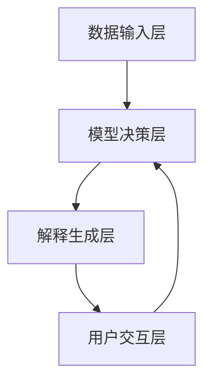

# AI Agent的可解释性设计与实现

> 关键词：AI Agent、可解释性、设计与实现、机器学习、决策过程

> 摘要：本文聚焦于AI Agent的可解释性设计与实现这一重要主题。首先介绍了相关背景，包括目的范围、预期读者等内容。接着阐述了AI Agent及可解释性的核心概念与联系，通过文本示意图和Mermaid流程图进行清晰展示。详细讲解了核心算法原理，并给出Python源代码示例。深入探讨了数学模型和公式，结合实际例子加以说明。通过项目实战，展示了开发环境搭建、源代码实现及解读。分析了AI Agent可解释性在不同领域的实际应用场景，推荐了学习资源、开发工具框架和相关论文著作。最后总结了未来发展趋势与挑战，提供了常见问题解答和扩展阅读参考资料，旨在帮助读者全面理解和掌握AI Agent可解释性的设计与实现方法。

## 1. 背景介绍 
### 1.1 目的和范围
AI Agent作为人工智能领域的重要概念，在众多领域得到了广泛应用。然而，其决策过程往往如同一个“黑匣子”，难以被人类理解。本文章的目的在于深入探讨AI Agent可解释性的设计与实现方法，旨在帮助开发者和研究人员构建具有可解释性的AI Agent系统。范围涵盖了从核心概念的介绍、算法原理的分析、数学模型的推导，到实际项目的开发和应用场景的探讨，力求全面、系统地阐述AI Agent可解释性相关的知识。

### 1.2 预期读者
本文预期读者包括人工智能领域的研究人员、开发者、数据科学家，以及对AI Agent可解释性感兴趣的技术爱好者。对于希望深入了解AI Agent决策过程，提高模型透明度和可信度的专业人士，本文将提供有价值的参考；对于初学者，也能通过逐步的讲解和示例，建立起对AI Agent可解释性的基本认识。

### 1.3 文档结构概述
本文将按照以下结构进行组织：首先介绍AI Agent可解释性的核心概念与联系，通过示意图和流程图帮助读者理解；接着详细讲解核心算法原理，并给出Python代码示例；然后推导相关的数学模型和公式，结合实际例子加深理解；通过项目实战，展示如何在实际开发中实现AI Agent的可解释性；分析AI Agent可解释性在不同领域的实际应用场景；推荐学习资源、开发工具框架和相关论文著作；最后总结未来发展趋势与挑战，提供常见问题解答和扩展阅读参考资料。

### 1.4 术语表
#### 1.4.1 核心术语定义
- **AI Agent**：能够感知环境、做出决策并采取行动以实现特定目标的人工智能实体。它可以是软件程序、机器人等不同形式。
- **可解释性**：指AI Agent的决策过程和结果能够以人类可理解的方式进行解释和说明，使得用户能够明白模型为什么做出这样的决策。
- **特征重要性**：在机器学习模型中，每个特征对模型输出结果的影响程度。通过评估特征重要性，可以了解哪些因素对AI Agent的决策起到关键作用。

#### 1.4.2 相关概念解释
- **模型透明度**：与可解释性密切相关，强调模型的内部结构和工作机制能够被清晰地展示和理解。一个具有高透明度的模型更容易实现可解释性。
- **局部解释和全局解释**：局部解释是针对单个决策实例进行解释，说明该实例下模型做出决策的原因；全局解释则是对整个模型的决策模式进行解释，反映模型在整体上的行为特征。

#### 1.4.3 缩略词列表
- **ML**：Machine Learning，机器学习
- **DL**：Deep Learning，深度学习
- **XAI**：Explainable Artificial Intelligence，可解释人工智能

## 2. 核心概念与联系 

### 核心概念原理
AI Agent的可解释性设计旨在让人类能够理解AI Agent的决策过程和结果。从原理上讲，AI Agent通常基于机器学习或深度学习模型进行决策。这些模型通过大量的数据进行训练，学习数据中的模式和规律，从而对新的输入做出预测或决策。然而，由于模型的复杂性，其决策过程往往难以直接理解。

为了实现可解释性，需要采用一些方法来揭示模型内部的工作机制。例如，可以通过分析特征重要性，了解哪些输入特征对决策起到关键作用；也可以使用局部解释方法，对单个决策实例进行详细解释。

### 架构的文本示意图
AI Agent可解释性架构主要包括以下几个部分：
- **数据输入层**：接收外部环境的输入数据，这些数据可以是图像、文本、数值等不同类型。
- **模型决策层**：包含机器学习或深度学习模型，对输入数据进行处理和分析，做出决策。
- **解释生成层**：根据模型的决策过程和结果，生成人类可理解的解释信息。
- **用户交互层**：将解释信息呈现给用户，并接收用户的反馈和交互。

以下是用文本描述的架构示意图：

```plaintext
|-------------------|
|  数据输入层       |
|-------------------|
        |
        v
|-------------------|
|  模型决策层       |
|-------------------|
        |
        v
|-------------------|
|  解释生成层       |
|-------------------|
        |
        v
|-------------------|
|  用户交互层       |
|-------------------|
```

### Mermaid流程图


该流程图展示了AI Agent可解释性系统的工作流程。数据从输入层进入，经过模型决策层做出决策，解释生成层根据决策结果生成解释信息，最后通过用户交互层呈现给用户。用户的反馈可以再次影响模型决策层的决策过程。

## 3. 核心算法原理 & 具体操作步骤 

### 核心算法原理
在实现AI Agent的可解释性时，常用的算法之一是特征重要性评估算法。这里以随机森林模型为例，介绍其特征重要性评估的原理。

随机森林是一种集成学习方法，由多个决策树组成。在训练过程中，每个决策树会随机选择一部分特征进行训练。特征重要性可以通过计算每个特征在所有决策树中的平均不纯度减少量来评估。不纯度减少量越大，说明该特征对模型的决策越重要。

### 具体操作步骤
1. **数据准备**：收集和整理训练数据，确保数据的质量和完整性。
2. **模型训练**：使用随机森林模型对训练数据进行训练。
3. **特征重要性计算**：计算每个特征在所有决策树中的平均不纯度减少量。
4. **解释生成**：根据特征重要性结果，生成人类可理解的解释信息。

### Python源代码示例
```python
import numpy as np
from sklearn.ensemble import RandomForestClassifier
from sklearn.datasets import load_iris

# 加载数据集
iris = load_iris()
X = iris.data
y = iris.target

# 训练随机森林模型
model = RandomForestClassifier(n_estimators=100)
model.fit(X, y)

# 获取特征重要性
feature_importances = model.feature_importances_

# 打印特征重要性
feature_names = iris.feature_names
for i in range(len(feature_names)):
    print(f"{feature_names[i]}: {feature_importances[i]}")
```

在上述代码中，首先加载了鸢尾花数据集，然后使用随机森林模型进行训练。最后，通过`feature_importances_`属性获取每个特征的重要性，并打印输出。

## 4. 数学模型和公式 & 详细讲解 & 举例说明 

### 数学模型和公式
在随机森林模型中，特征重要性的计算基于基尼不纯度（Gini impurity）。基尼不纯度是一种衡量数据集不纯度的指标，定义如下：

$$
Gini(p) = 1 - \sum_{i=1}^{n} p_i^2
$$

其中，$p_i$ 表示数据集中第 $i$ 类样本的比例，$n$ 表示类别数。

在决策树的每个节点上，通过选择一个特征进行分裂，使得分裂后的子节点的基尼不纯度之和最小。特征重要性可以通过计算该特征在所有决策树中的平均基尼不纯度减少量来评估。

设 $Gini_{parent}$ 表示父节点的基尼不纯度，$Gini_{left}$ 和 $Gini_{right}$ 分别表示左子节点和右子节点的基尼不纯度，$N_{parent}$、$N_{left}$ 和 $N_{right}$ 分别表示父节点、左子节点和右子节点的样本数量。则该特征的基尼不纯度减少量为：

$$
\Delta Gini = Gini_{parent} - \frac{N_{left}}{N_{parent}} Gini_{left} - \frac{N_{right}}{N_{parent}} Gini_{right}
$$

最后，将该特征在所有决策树中的基尼不纯度减少量求平均值，得到该特征的重要性。

### 详细讲解
基尼不纯度的取值范围在 $[0, 1]$ 之间，值越小表示数据集越纯，即样本属于同一类别的比例越高。在决策树的分裂过程中，通过选择合适的特征进行分裂，使得子节点的基尼不纯度尽可能降低，从而提高模型的分类性能。

特征重要性的计算基于基尼不纯度减少量，反映了该特征在决策树分裂过程中的重要程度。平均基尼不纯度减少量越大，说明该特征对模型的决策越重要。

### 举例说明
假设我们有一个二分类数据集，共有 100 个样本，其中正类样本 60 个，负类样本 40 个。则父节点的基尼不纯度为：

$$
Gini_{parent} = 1 - (\frac{60}{100})^2 - (\frac{40}{100})^2 = 0.48
$$

假设选择某个特征进行分裂后，左子节点有 40 个样本，其中正类样本 30 个，负类样本 10 个；右子节点有 60 个样本，其中正类样本 30 个，负类样本 30 个。则左子节点和右子节点的基尼不纯度分别为：

$$
Gini_{left} = 1 - (\frac{30}{40})^2 - (\frac{10}{40})^2 = 0.375
$$

$$
Gini_{right} = 1 - (\frac{30}{60})^2 - (\frac{30}{60})^2 = 0.5
$$

该特征的基尼不纯度减少量为：

$$
\Delta Gini = 0.48 - \frac{40}{100} \times 0.375 - \frac{60}{100} \times 0.5 = 0.03
$$

通过计算所有决策树中该特征的基尼不纯度减少量，并求平均值，即可得到该特征的重要性。

## 5. 项目实战：代码实际案例和详细解释说明 

### 5.1  开发环境搭建
在进行AI Agent可解释性项目实战之前，需要搭建相应的开发环境。以下是具体步骤：

1. **安装Python**：建议使用Python 3.7及以上版本。可以从Python官方网站（https://www.python.org/downloads/）下载并安装。
2. **安装必要的库**：使用`pip`命令安装以下库：
```bash
pip install numpy pandas scikit-learn matplotlib
```
- `numpy`：用于数值计算。
- `pandas`：用于数据处理和分析。
- `scikit-learn`：提供了丰富的机器学习算法和工具。
- `matplotlib`：用于数据可视化。

### 5.2  源代码详细实现和代码解读
以下是一个完整的项目实战代码示例，用于实现基于随机森林模型的AI Agent可解释性：

```python
import numpy as np
import pandas as pd
from sklearn.ensemble import RandomForestClassifier
from sklearn.model_selection import train_test_split
from sklearn.metrics import accuracy_score
import matplotlib.pyplot as plt

# 加载数据集
data = pd.read_csv('heart.csv')
X = data.drop('target', axis=1)
y = data['target']

# 划分训练集和测试集
X_train, X_test, y_train, y_test = train_test_split(X, y, test_size=0.2, random_state=42)

# 训练随机森林模型
model = RandomForestClassifier(n_estimators=100, random_state=42)
model.fit(X_train, y_train)

# 预测测试集
y_pred = model.predict(X_test)

# 计算准确率
accuracy = accuracy_score(y_test, y_pred)
print(f"Accuracy: {accuracy}")

# 获取特征重要性
feature_importances = model.feature_importances_
feature_names = X.columns

# 绘制特征重要性柱状图
plt.figure(figsize=(10, 6))
plt.bar(feature_names, feature_importances)
plt.xlabel('Features')
plt.ylabel('Importance')
plt.title('Feature Importance in Random Forest Model')
plt.xticks(rotation=90)
plt.show()
```

### 代码解读与分析
1. **数据加载和预处理**：使用`pandas`库加载心脏病数据集，并将特征和标签分离。然后使用`train_test_split`函数将数据集划分为训练集和测试集。
2. **模型训练**：使用随机森林模型对训练集进行训练，设置`n_estimators`为 100，表示使用 100 个决策树。
3. **模型预测和评估**：使用训练好的模型对测试集进行预测，并计算预测准确率。
4. **特征重要性计算和可视化**：通过`feature_importances_`属性获取每个特征的重要性，并使用`matplotlib`库绘制特征重要性柱状图，直观地展示每个特征对模型决策的影响程度。

通过以上步骤，我们可以实现一个简单的AI Agent可解释性项目，帮助我们理解模型的决策过程和特征的重要性。

## 6. 实际应用场景 
AI Agent的可解释性在许多领域都有重要的应用，以下是一些常见的实际应用场景：

### 医疗领域
在医疗诊断中，AI Agent可以帮助医生分析患者的病历数据、影像资料等，做出诊断建议。然而，医生需要了解AI Agent的决策依据，以确保诊断的准确性和可靠性。通过实现AI Agent的可解释性，医生可以清楚地知道哪些因素影响了诊断结果，从而更好地与AI Agent合作，为患者提供更精准的治疗方案。

### 金融领域
在金融风险评估、信贷审批等业务中，AI Agent可以根据客户的信用数据、财务状况等信息进行风险评估和决策。可解释性可以帮助金融机构了解AI Agent的决策逻辑，确保决策的公平性和合规性。同时，也可以向客户解释决策原因，提高客户的满意度和信任度。

### 自动驾驶领域
在自动驾驶系统中，AI Agent需要实时感知环境、做出决策并控制车辆行驶。可解释性可以帮助工程师和监管机构了解AI Agent的决策过程，确保自动驾驶系统的安全性和可靠性。例如，当车辆做出紧急制动决策时，可解释性可以说明是哪些传感器数据和算法导致了这一决策。

### 教育领域
在智能教育系统中，AI Agent可以根据学生的学习数据和表现，提供个性化的学习建议和辅导。可解释性可以帮助教师和学生理解AI Agent的建议依据，更好地调整学习策略和方法。同时，也可以提高教师对智能教育系统的信任度，促进其在教育领域的广泛应用。

## 7. 工具和资源推荐
### 7.1 学习资源推荐
#### 7.1.1 书籍推荐
- 《可解释人工智能：算法基础与应用》：全面介绍了可解释人工智能的基本概念、算法和应用，是学习AI Agent可解释性的重要参考书籍。
- 《Python机器学习》：详细介绍了Python在机器学习领域的应用，包括各种机器学习算法的实现和优化，对于理解AI Agent的模型原理有很大帮助。

#### 7.1.2 在线课程
- Coursera上的“Explainable AI”课程：由知名专家授课，系统地讲解了可解释人工智能的理论和实践，提供了丰富的案例和代码示例。
- edX上的“Machine Learning for Everyone”课程：适合初学者，从基础的机器学习概念入手，逐步引导学习者掌握AI Agent的相关知识。

#### 7.1.3 技术博客和网站
- Towards Data Science：汇聚了大量关于数据科学、机器学习和人工智能的技术文章，其中不乏关于AI Agent可解释性的深入探讨。
- Medium上的AI板块：有许多专业人士分享的关于AI Agent可解释性的最新研究成果和实践经验。

### 7.2 开发工具框架推荐
#### 7.2.1 IDE和编辑器
- PyCharm：功能强大的Python集成开发环境，提供了代码编辑、调试、版本控制等一系列功能，适合开发AI Agent可解释性项目。
- Jupyter Notebook：交互式的开发环境，支持代码、文本、图表等多种形式的展示，方便进行数据分析和模型实验。

#### 7.2.2 调试和性能分析工具
- TensorBoard：用于可视化深度学习模型的训练过程和性能指标，帮助开发者调试和优化模型。
- Scikit-learn的`cross_val_score`函数：用于评估机器学习模型的性能，通过交叉验证的方式得到更准确的评估结果。

#### 7.2.3 相关框架和库
- SHAP（SHapley Additive exPlanations）：用于解释机器学习模型的预测结果，提供了多种解释方法和可视化工具。
- LIME（Local Interpretable Model-agnostic Explanations）：一种模型无关的局部解释方法，可以对任何机器学习模型的单个预测进行解释。

### 7.3 相关论文著作推荐
#### 7.3.1 经典论文
- “Why Should I Trust You?” Explaining the Predictions of Any Classifier：提出了LIME方法，为模型的局部解释提供了重要的理论基础。
- A Unified Approach to Interpreting Model Predictions：介绍了SHAP方法，统一了多种解释方法的理论框架。

#### 7.3.2 最新研究成果
- 关注顶级学术会议如NeurIPS、ICML、CVPR等上关于AI Agent可解释性的最新研究论文，了解该领域的前沿动态。
- 查阅知名学术期刊如Journal of Artificial Intelligence Research、Artificial Intelligence等上的相关研究成果。

#### 7.3.3 应用案例分析
- 一些知名企业和研究机构会发布关于AI Agent可解释性在实际应用中的案例分析报告，如Google、Microsoft等公司的技术博客和研究报告，这些案例可以为实际项目的开发提供参考。

## 8. 总结：未来发展趋势与挑战
### 未来发展趋势
- **多模态解释**：随着AI Agent处理的数据类型越来越多样化，未来的可解释性方法将不仅仅局限于文本解释，还将结合图像、音频等多模态信息，提供更加直观和全面的解释。
- **实时解释**：在一些实时性要求较高的应用场景中，如自动驾驶、金融交易等，需要AI Agent能够实时提供决策解释。因此，实时解释技术将成为未来的研究热点。
- **与人类认知的融合**：可解释性方法将更加注重与人类认知方式的融合，使解释结果更容易被人类理解和接受。例如，采用自然语言生成技术生成更加自然、易懂的解释文本。

### 挑战
- **模型复杂性**：随着深度学习模型的不断发展，模型的复杂性越来越高，使得可解释性的实现变得更加困难。如何在保证模型性能的前提下，提高模型的可解释性是一个亟待解决的问题。
- **解释的准确性和可靠性**：解释结果的准确性和可靠性直接影响到用户对AI Agent的信任度。然而，目前的可解释性方法还存在一定的局限性，需要进一步研究和改进。
- **隐私和安全问题**：在解释AI Agent的决策过程时，可能会涉及到用户的隐私和敏感信息。如何在保证可解释性的同时，保护用户的隐私和数据安全是一个重要的挑战。

## 9. 附录：常见问题与解答
### 问题1：AI Agent的可解释性和透明度有什么区别？
可解释性强调的是能够以人类可理解的方式解释AI Agent的决策过程和结果，重点在于解释的内容和方式。而透明度更侧重于模型的内部结构和工作机制能够被清晰地展示和理解，强调的是模型本身的可见性。可解释性是实现透明度的一种手段，但透明度并不一定意味着具有可解释性。

### 问题2：可解释性方法是否会影响AI Agent的性能？
在某些情况下，可解释性方法可能会对AI Agent的性能产生一定的影响。例如，一些简单的可解释模型可能在性能上不如复杂的黑盒模型。然而，随着技术的发展，越来越多的研究致力于在保证可解释性的同时，尽量减少对模型性能的影响。一些可解释性方法可以在不牺牲太多性能的前提下，提供有效的解释信息。

### 问题3：如何选择合适的可解释性方法？
选择合适的可解释性方法需要考虑多个因素，包括模型类型、数据特点、应用场景等。例如，如果是线性模型，可以使用系数分析等简单的解释方法；如果是复杂的深度学习模型，可以考虑使用SHAP、LIME等方法。同时，还需要根据应用场景的需求，选择局部解释还是全局解释方法。

## 10. 扩展阅读 & 参考资料
- Molnar, Christoph. "Interpretable machine learning. A Guide for Making Black Box Models Explainable." (2019).
- Ribeiro, Marco Tulio, Sameer Singh, and Carlos Guestrin. "Why should I trust you?: Explaining the predictions of any classifier." Proceedings of the 22nd ACM SIGKDD international conference on knowledge discovery and data mining. 2016.
- Lundberg, Scott M., and Su-In Lee. "A unified approach to interpreting model predictions." Advances in neural information processing systems. 2017.

作者：AI天才研究院/AI Genius Institute & 禅与计算机程序设计艺术 /Zen And The Art of Computer Programming