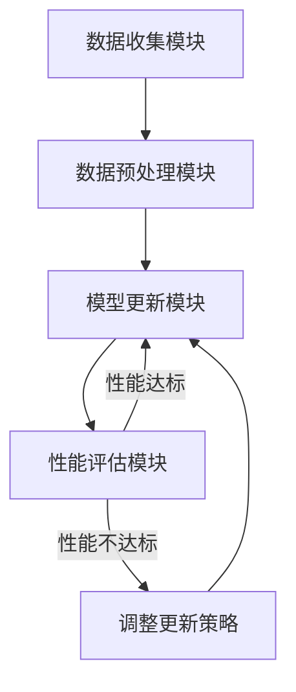

# AI Agent的增量学习：持续优化性能

> 关键词：AI Agent、增量学习、持续优化、性能提升、机器学习

> 摘要：本文围绕AI Agent的增量学习展开，深入探讨了其核心概念、算法原理、数学模型等内容。详细介绍了如何通过增量学习让AI Agent持续优化性能，包括具体的操作步骤和代码实现。通过项目实战案例，展示了增量学习在实际开发中的应用。同时，分析了AI Agent增量学习的实际应用场景，推荐了相关的学习资源、开发工具和论文著作。最后，对AI Agent增量学习的未来发展趋势与挑战进行了总结，并提供了常见问题解答和扩展阅读参考资料。

## 1. 背景介绍 
### 1.1 目的和范围
在当今快速发展的人工智能领域，AI Agent作为能够自主感知环境、做出决策并执行动作的实体，其性能的持续优化至关重要。传统的机器学习方法通常在固定的数据集上进行训练，一旦模型训练完成，很难适应新的数据和变化的环境。而增量学习则为解决这一问题提供了有效的途径。本文的目的是深入探讨AI Agent的增量学习机制，介绍其核心概念、算法原理、数学模型，并通过实际案例展示如何利用增量学习持续优化AI Agent的性能。文章的范围涵盖了增量学习的基本理论、具体实现方法、实际应用场景以及相关的工具和资源推荐。

### 1.2 预期读者
本文预期读者包括人工智能领域的研究人员、开发者、学生以及对AI Agent和增量学习感兴趣的技术爱好者。对于有一定机器学习基础的读者，本文将提供深入的技术分析和实践指导；对于初学者，也能通过详细的解释和案例逐步了解AI Agent增量学习的核心概念和实现方法。

### 1.3 文档结构概述
本文将按照以下结构进行组织：首先介绍AI Agent增量学习的核心概念和相关联系，包括原理和架构的文本示意图以及Mermaid流程图；接着详细阐述核心算法原理和具体操作步骤，并使用Python源代码进行说明；然后介绍数学模型和公式，并通过举例进行详细讲解；之后通过项目实战展示代码实际案例和详细解释；再分析AI Agent增量学习的实际应用场景；推荐相关的学习资源、开发工具和论文著作；最后总结未来发展趋势与挑战，提供常见问题解答和扩展阅读参考资料。

### 1.4 术语表
#### 1.4.1 核心术语定义
- **AI Agent**：能够感知环境、做出决策并执行动作的人工智能实体，可以是虚拟的软件程序，也可以是物理机器人。
- **增量学习**：一种机器学习方法，允许模型在不断接收新数据时，逐步更新和改进自身的知识和性能，而不需要重新训练整个模型。
- **性能优化**：通过调整模型参数、改进算法或引入新的数据，提高AI Agent在特定任务上的表现，如准确率、效率等。

#### 1.4.2 相关概念解释
- **在线学习**：一种特殊的增量学习方式，模型在接收到每个新的数据样本后立即进行更新，适用于数据实时到达的场景。
- **灾难性遗忘**：在增量学习过程中，模型在学习新任务时可能会忘记之前学习的知识，导致在旧任务上的性能下降。

#### 1.4.3 缩略词列表
- **ML**：Machine Learning，机器学习
- **DL**：Deep Learning，深度学习
- **SGD**：Stochastic Gradient Descent，随机梯度下降

## 2. 核心概念与联系 

### 核心概念原理
AI Agent的增量学习是指在AI Agent运行过程中，随着时间的推移，不断接收新的数据，并利用这些新数据对已有的模型进行更新和改进，以提高其在各种任务上的性能。其核心原理基于机器学习中的参数更新机制，通过对新数据的学习，调整模型的权重和偏置，使得模型能够更好地适应新的环境和任务。

### 架构的文本示意图
一个典型的AI Agent增量学习架构包括以下几个部分：
1. **数据收集模块**：负责收集新的数据，这些数据可以来自传感器、用户反馈等。
2. **数据预处理模块**：对收集到的新数据进行清洗、归一化等预处理操作，以提高数据的质量。
3. **模型更新模块**：根据新数据和已有的模型，计算模型参数的更新量，并对模型进行更新。
4. **性能评估模块**：评估更新后的模型在旧任务和新任务上的性能，以确保模型的性能得到持续优化。

### Mermaid流程图


## 3. 核心算法原理 & 具体操作步骤 

### 算法原理讲解
在AI Agent的增量学习中，常用的算法之一是随机梯度下降（SGD）的变体。SGD是一种优化算法，用于最小化损失函数。在增量学习中，我们可以使用SGD的在线版本，即每次接收到一个新的数据样本时，就根据该样本计算损失函数的梯度，并更新模型的参数。

### Python源代码详细阐述
以下是一个简单的Python示例，展示了如何使用SGD进行增量学习：

```python
import numpy as np

# 定义一个简单的线性回归模型
class LinearRegression:
    def __init__(self, learning_rate=0.01):
        self.learning_rate = learning_rate
        self.weights = None
        self.bias = None

    def fit(self, X, y):
        n_samples, n_features = X.shape
        if self.weights is None:
            self.weights = np.zeros(n_features)
            self.bias = 0

        # 随机梯度下降
        for _ in range(1):  # 这里只进行一次迭代，模拟增量学习
            for i in range(n_samples):
                y_pred = np.dot(X[i], self.weights) + self.bias
                dw = -2 * X[i] * (y[i] - y_pred)
                db = -2 * (y[i] - y_pred)
                self.weights -= self.learning_rate * dw
                self.bias -= self.learning_rate * db

    def predict(self, X):
        return np.dot(X, self.weights) + self.bias

# 生成一些示例数据
X = np.array([[1], [2], [3], [4], [5]])
y = np.array([2, 4, 6, 8, 10])

# 初始化模型
model = LinearRegression()

# 进行增量学习
for i in range(len(X)):
    X_sample = X[i].reshape(1, -1)
    y_sample = y[i].reshape(1,)
    model.fit(X_sample, y_sample)

# 进行预测
new_X = np.array([[6]])
prediction = model.predict(new_X)
print("预测结果:", prediction)
```

### 具体操作步骤
1. **初始化模型**：定义模型的结构和初始参数。
2. **接收新数据**：从数据收集模块获取新的数据样本。
3. **数据预处理**：对新数据进行必要的预处理操作。
4. **计算梯度**：根据新数据和当前模型，计算损失函数的梯度。
5. **更新模型参数**：根据梯度和学习率，更新模型的权重和偏置。
6. **性能评估**：评估更新后的模型性能，如果性能不达标，调整更新策略。

## 4. 数学模型和公式 & 详细讲解 & 举例说明 

### 数学模型
在增量学习中，我们通常使用线性回归模型作为示例。线性回归模型的数学表达式为：
$$y = w^T x + b$$
其中，$y$ 是预测值，$x$ 是输入特征向量，$w$ 是权重向量，$b$ 是偏置。

### 损失函数
为了衡量模型的预测值与真实值之间的差异，我们使用均方误差（MSE）作为损失函数：
$$L(w, b) = \frac{1}{n} \sum_{i=1}^{n} (y_i - (w^T x_i + b))^2$$
其中，$n$ 是样本数量，$y_i$ 是第 $i$ 个样本的真实值，$x_i$ 是第 $i$ 个样本的输入特征向量。

### 梯度计算
为了更新模型的参数，我们需要计算损失函数关于权重和偏置的梯度：
$$\frac{\partial L}{\partial w} = -\frac{2}{n} \sum_{i=1}^{n} (y_i - (w^T x_i + b)) x_i$$
$$\frac{\partial L}{\partial b} = -\frac{2}{n} \sum_{i=1}^{n} (y_i - (w^T x_i + b))$$

### 举例说明
假设我们有一个简单的线性回归问题，输入特征向量 $x = [1]$，真实值 $y = 2$，初始权重 $w = 0$，偏置 $b = 0$。学习率 $\alpha = 0.01$。

1. **计算预测值**：
$$y_pred = w^T x + b = 0 \times 1 + 0 = 0$$

2. **计算损失函数**：
$$L(w, b) = (y - y_pred)^2 = (2 - 0)^2 = 4$$

3. **计算梯度**：
$$\frac{\partial L}{\partial w} = -2 (y - y_pred) x = -2 \times (2 - 0) \times 1 = -4$$
$$\frac{\partial L}{\partial b} = -2 (y - y_pred) = -2 \times (2 - 0) = -4$$

4. **更新模型参数**：
$$w = w - \alpha \frac{\partial L}{\partial w} = 0 - 0.01 \times (-4) = 0.04$$
$$b = b - \alpha \frac{\partial L}{\partial b} = 0 - 0.01 \times (-4) = 0.04$$

经过一次更新后，模型的权重变为 $0.04$，偏置变为 $0.04$。

## 5. 项目实战：代码实际案例和详细解释说明 

### 5.1  开发环境搭建
为了实现AI Agent的增量学习项目，我们需要搭建以下开发环境：
1. **Python环境**：建议使用Python 3.7及以上版本。
2. **必要的库**：安装NumPy、Pandas、Scikit-learn等常用的机器学习库。可以使用以下命令进行安装：
```sh
pip install numpy pandas scikit-learn
```

### 5.2  源代码详细实现和代码解读
以下是一个更完整的项目实战代码示例，展示了如何使用增量学习对鸢尾花数据集进行分类：

```python
import numpy as np
from sklearn.datasets import load_iris
from sklearn.model_selection import train_test_split
from sklearn.linear_model import SGDClassifier

# 加载鸢尾花数据集
iris = load_iris()
X = iris.data
y = iris.target

# 划分训练集和测试集
X_train, X_test, y_train, y_test = train_test_split(X, y, test_size=0.2, random_state=42)

# 初始化SGD分类器
clf = SGDClassifier()

# 进行增量学习
batch_size = 10
for i in range(0, len(X_train), batch_size):
    X_batch = X_train[i:i+batch_size]
    y_batch = y_train[i:i+batch_size]
    clf.partial_fit(X_batch, y_batch, classes=np.unique(y))

# 评估模型性能
accuracy = clf.score(X_test, y_test)
print("模型准确率:", accuracy)
```

### 代码解读与分析
1. **数据加载和划分**：使用`sklearn.datasets.load_iris`加载鸢尾花数据集，并使用`train_test_split`将数据集划分为训练集和测试集。
2. **模型初始化**：使用`SGDClassifier`初始化一个随机梯度下降分类器。
3. **增量学习**：通过循环将训练集分成多个小批量，每次使用`partial_fit`方法对模型进行更新。
4. **性能评估**：使用`score`方法评估模型在测试集上的准确率。

## 6. 实际应用场景 
AI Agent的增量学习在许多实际场景中都有广泛的应用，以下是一些常见的应用场景：

### 实时数据处理
在金融、医疗、工业等领域，数据通常是实时产生的。AI Agent可以使用增量学习对实时数据进行处理和分析，及时做出决策。例如，在股票交易中，AI Agent可以根据实时的股票价格数据进行增量学习，预测股票的走势，帮助投资者做出决策。

### 个性化推荐
在电子商务、社交媒体等领域，用户的兴趣和行为是不断变化的。AI Agent可以使用增量学习根据用户的实时行为数据更新推荐模型，提供更加个性化的推荐服务。例如，在电商平台上，AI Agent可以根据用户的浏览历史、购买记录等数据进行增量学习，为用户推荐更符合其兴趣的商品。

### 机器人学习
在机器人领域，机器人需要不断适应新的环境和任务。AI Agent可以使用增量学习让机器人在运行过程中不断学习和改进自己的行为。例如，在机器人导航中，机器人可以根据实时的传感器数据进行增量学习，优化自己的导航策略。

## 7. 工具和资源推荐
### 7.1 学习资源推荐
#### 7.1.1 书籍推荐
- 《机器学习》（周志华）：全面介绍了机器学习的基本概念、算法和应用，是机器学习领域的经典教材。
- 《深度学习》（Ian Goodfellow、Yoshua Bengio、Aaron Courville）：深入探讨了深度学习的理论和实践，适合有一定机器学习基础的读者。
- 《Python机器学习实战》（Sebastian Raschka）：通过实际案例介绍了如何使用Python实现机器学习算法，是一本非常实用的学习书籍。

#### 7.1.2 在线课程
- Coursera上的“机器学习”课程（Andrew Ng）：由斯坦福大学教授Andrew Ng主讲，是机器学习领域最受欢迎的在线课程之一。
- edX上的“深度学习基础”课程：介绍了深度学习的基本概念和算法，适合初学者。
- 中国大学MOOC上的“人工智能基础”课程：系统介绍了人工智能的基本理论和方法。

#### 7.1.3 技术博客和网站
- Medium：有许多机器学习和人工智能领域的优秀博客文章，可以帮助读者了解最新的技术动态和研究成果。
- Towards Data Science：专注于数据科学和机器学习领域的技术博客，提供了许多实用的教程和案例。
- arXiv：一个预印本平台，包含了大量的机器学习和人工智能领域的研究论文。

### 7.2 开发工具框架推荐
#### 7.2.1 IDE和编辑器
- PyCharm：一款专业的Python集成开发环境，提供了丰富的功能和插件，适合Python开发。
- Jupyter Notebook：一个交互式的开发环境，非常适合数据探索和模型实验。
- Visual Studio Code：一款轻量级的代码编辑器，支持多种编程语言和插件，是开发者的常用工具之一。

#### 7.2.2 调试和性能分析工具
- TensorBoard：TensorFlow提供的可视化工具，可以帮助开发者调试和分析模型的训练过程。
- PyTorch Profiler：PyTorch提供的性能分析工具，可以帮助开发者找出模型中的性能瓶颈。
- cProfile：Python内置的性能分析模块，可以分析Python代码的执行时间和调用次数。

#### 7.2.3 相关框架和库
- TensorFlow：一个开源的深度学习框架，提供了丰富的工具和库，支持多种深度学习模型的开发和训练。
- PyTorch：另一个流行的深度学习框架，具有动态图机制，易于使用和调试。
- Scikit-learn：一个简单易用的机器学习库，提供了多种机器学习算法和工具，适合初学者和快速开发。

### 7.3 相关论文著作推荐
#### 7.3.1 经典论文
- "A Theory of Learning from Different Domains"（Shai Ben-David等）：介绍了迁移学习的基本理论和方法。
- "Online Learning and Stochastic Approximations"（Leon Bottou）：详细阐述了在线学习和随机逼近的理论和算法。
- "Incremental Learning Techniques for Neural Networks"（Yaser S. Abu-Mostafa）：探讨了神经网络的增量学习技术。

#### 7.3.2 最新研究成果
- 关注顶级学术会议如NeurIPS、ICML、CVPR等的最新论文，了解AI Agent增量学习领域的最新研究动态。
- 一些知名的学术期刊如Journal of Artificial Intelligence Research（JAIR）、Artificial Intelligence等也会发表相关的研究成果。

#### 7.3.3 应用案例分析
- 可以参考一些实际应用案例的论文，了解AI Agent增量学习在不同领域的具体应用和效果。例如，在医疗领域的疾病诊断、在工业领域的故障预测等方面的应用案例。

## 8. 总结：未来发展趋势与挑战
### 未来发展趋势
- **与强化学习的结合**：将增量学习与强化学习相结合，可以让AI Agent在不断与环境交互的过程中持续学习和优化策略，提高其在复杂环境中的决策能力。
- **多模态增量学习**：随着传感器技术的发展，AI Agent可以获取多种模态的数据，如图像、语音、文本等。多模态增量学习将成为未来的一个重要研究方向，以更好地处理和融合不同模态的数据。
- **联邦增量学习**：在数据隐私和安全要求越来越高的情况下，联邦增量学习可以让多个参与方在不共享原始数据的情况下进行增量学习，保护数据隐私的同时提高模型性能。

### 挑战
- **灾难性遗忘问题**：如前文所述，灾难性遗忘是增量学习中面临的一个重要挑战。如何有效地解决灾难性遗忘问题，保证模型在学习新任务时不会忘记旧知识，是未来需要研究的重点。
- **数据质量和多样性**：增量学习需要不断接收新的数据，数据的质量和多样性对模型的性能有很大影响。如何保证新数据的质量和多样性，避免模型出现过拟合或欠拟合的问题，是一个挑战。
- **计算资源和效率**：随着数据量的不断增加，增量学习需要消耗大量的计算资源和时间。如何提高增量学习的计算效率，降低计算成本，是实际应用中需要解决的问题。

## 9. 附录：常见问题与解答
### 问题1：增量学习和传统机器学习有什么区别？
答：传统机器学习通常在固定的数据集上进行训练，训练完成后模型的参数就固定下来了。而增量学习允许模型在不断接收新数据时，逐步更新和改进自身的知识和性能，不需要重新训练整个模型。

### 问题2：如何解决增量学习中的灾难性遗忘问题？
答：可以采用一些方法来缓解灾难性遗忘问题，如弹性权重巩固（EWC）、突触智能（SI）等。这些方法通过在模型更新过程中引入额外的约束，保护模型在旧任务上的知识。

### 问题3：增量学习适用于所有类型的机器学习模型吗？
答：增量学习适用于大多数机器学习模型，但不同模型的增量学习实现方式可能有所不同。例如，神经网络可以通过在线梯度下降等方法进行增量学习，而决策树等模型可能需要采用不同的更新策略。

## 10. 扩展阅读 & 参考资料
- Goodfellow, I., Bengio, Y., & Courville, A. (2016). Deep Learning. MIT Press.
- Zhou, Z. H. (2016). Machine Learning. Tsinghua University Press.
- Bottou, L. (1998). Online Learning and Stochastic Approximations. In Online Learning and Neural Networks.
- Shai Ben-David, John Blitzer, Koby Crammer, Alex Kulesza, Fernando Pereira, & Jennifer Wortman Vaughan. (2010). A Theory of Learning from Different Domains. Machine Learning, 79(1-2), 151-175.

作者：AI天才研究院/AI Genius Institute & 禅与计算机程序设计艺术 /Zen And The Art of Computer Programming