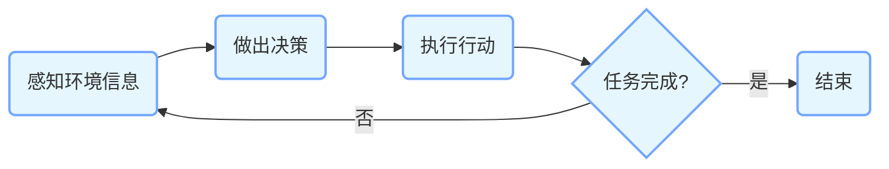

# AI Agent的多Agent协作系统设计

> 关键词：AI Agent、多Agent协作系统、协作算法、数学模型、实际应用

> 摘要：本文围绕AI Agent的多Agent协作系统设计展开，深入探讨了其核心概念、算法原理、数学模型等方面。首先介绍了多Agent协作系统的背景知识，包括目的范围、预期读者等。接着阐述了核心概念及其联系，通过文本示意图和Mermaid流程图进行清晰展示。详细讲解了核心算法原理，并使用Python代码进行说明。对数学模型和公式进行了详细推导和举例。通过项目实战，展示了代码的实际案例和详细解释。分析了多Agent协作系统的实际应用场景，推荐了相关的学习资源、开发工具框架和论文著作。最后总结了未来发展趋势与挑战，还给出了常见问题的解答和扩展阅读参考资料。

## 1. 背景介绍 
### 1.1 目的和范围
多Agent协作系统旨在让多个AI Agent相互协作，共同完成复杂的任务。其应用范围广泛，涵盖了智能交通、智能制造、智能医疗等众多领域。通过协作，Agent可以整合各自的优势，提高任务执行的效率和质量，解决单个Agent难以处理的复杂问题。

### 1.2 预期读者
本文预期读者包括人工智能领域的研究人员、软件开发人员、对多Agent系统感兴趣的学生以及相关行业的从业者。这些读者希望深入了解多Agent协作系统的设计原理和实现方法，以便在实际项目中应用或进一步研究。

### 1.3 文档结构概述
本文首先介绍多Agent协作系统的背景知识，为后续内容奠定基础。接着阐述核心概念及其联系，让读者对系统有一个整体的认识。详细讲解核心算法原理和具体操作步骤，通过Python代码进行实现。对数学模型和公式进行详细推导和举例，帮助读者理解系统的理论基础。通过项目实战，展示代码的实际应用和详细解释。分析实际应用场景，让读者了解系统的实用性。推荐相关的学习资源、开发工具框架和论文著作，方便读者进一步学习和研究。最后总结未来发展趋势与挑战，给出常见问题的解答和扩展阅读参考资料。

### 1.4 术语表
#### 1.4.1 核心术语定义
- **AI Agent**：具有自主决策和行动能力的智能实体，能够感知环境、处理信息并做出相应的决策和行动。
- **多Agent协作系统**：由多个AI Agent组成的系统，这些Agent通过相互协作来完成共同的任务。
- **协作算法**：用于协调多个Agent之间的行为，使它们能够有效地协作完成任务的算法。
- **通信协议**：规定了Agent之间进行信息交换的格式和规则。

#### 1.4.2 相关概念解释
- **自主性**：Agent能够独立地感知环境、做出决策和采取行动，不受外部的直接控制。
- **交互性**：Agent能够与其他Agent和环境进行信息交换和交互。
- **协作性**：多个Agent能够相互配合，共同完成任务。

#### 1.4.3 缩略词列表
- **MAS**：Multi-Agent System（多Agent系统）
- **RPC**：Remote Procedure Call（远程过程调用）

## 2. 核心概念与联系 

### 核心概念原理
AI Agent是多Agent协作系统的基本组成单元。每个Agent都有自己的目标、知识和能力。在多Agent协作系统中，Agent之间需要进行信息交换和协作，以实现共同的目标。协作的方式可以分为竞争、合作、协调等。

例如，在一个智能交通系统中，每个车辆可以看作一个Agent。这些Agent需要根据交通状况和自身的目的地，与其他车辆进行协作，以优化交通流量，减少拥堵。

### 架构的文本示意图
多Agent协作系统的架构可以分为三层：感知层、决策层和执行层。

- **感知层**：负责感知环境信息，包括其他Agent的状态、环境的变化等。
- **决策层**：根据感知层提供的信息，结合自身的目标和知识，做出决策。
- **执行层**：根据决策层的决策，执行相应的行动。

```plaintext
+---------------------+
|      感知层         |
|  (感知环境信息)     |
+---------------------+
         |
         v
+---------------------+
|      决策层         |
|  (做出决策)         |
+---------------------+
         |
         v
+---------------------+
|      执行层         |
|  (执行行动)         |
+---------------------+
```

### Mermaid流程图


## 3. 核心算法原理 & 具体操作步骤 

### 核心算法原理
在多Agent协作系统中，常用的协作算法有合同网协议、拍卖算法等。这里以合同网协议为例进行介绍。

合同网协议是一种基于任务分配的协作算法。其基本思想是：当一个Agent有任务需要完成时，它会发布一个任务公告，其他Agent根据自己的能力和资源进行投标。发布任务的Agent根据投标情况选择最合适的Agent来完成任务，并签订合同。

### 具体操作步骤
1. **任务发布**：当一个Agent有任务需要完成时，它会发布一个任务公告，包括任务的描述、要求、截止时间等信息。
2. **投标**：其他Agent收到任务公告后，根据自己的能力和资源进行评估，如果认为自己能够完成任务，则向发布任务的Agent发送投标信息，包括自己的报价、完成时间等。
3. **中标选择**：发布任务的Agent收到所有投标信息后，根据一定的评估标准（如报价最低、完成时间最短等）选择最合适的Agent作为中标者，并向其发送中标通知。
4. **合同签订**：中标者收到中标通知后，与发布任务的Agent签订合同，明确双方的权利和义务。
5. **任务执行**：中标者按照合同要求完成任务，并将任务结果反馈给发布任务的Agent。

### Python源代码实现
```python
import random

# 定义Agent类
class Agent:
    def __init__(self, id):
        self.id = id
        self.ability = random.randint(1, 10)  # 随机生成Agent的能力值
        self.tasks = []  # 存储Agent当前的任务

    def receive_task_announcement(self, task):
        # 收到任务公告后，评估自己是否能够完成任务
        if self.ability >= task['difficulty']:
            # 计算报价和完成时间
            price = random.randint(10, 100)
            time = random.randint(1, 10)
            bid = {
                'agent_id': self.id,
                'price': price,
                'time': time
            }
            return bid
        return None

    def receive_award_notice(self, task):
        # 收到中标通知后，签订合同并执行任务
        self.tasks.append(task)
        print(f"Agent {self.id} 中标任务 {task['id']}，开始执行任务")

    def complete_task(self, task):
        # 完成任务后，反馈任务结果
        self.tasks.remove(task)
        print(f"Agent {self.id} 完成任务 {task['id']}")

# 定义任务类
class Task:
    def __init__(self, id, difficulty):
        self.id = id
        self.difficulty = difficulty

# 模拟合同网协议
def contract_net_protocol():
    # 创建Agent列表
    agents = [Agent(i) for i in range(5)]
    # 创建任务
    task = Task(1, random.randint(1, 10))

    # 任务发布
    bids = []
    for agent in agents:
        bid = agent.receive_task_announcement(task.__dict__)
        if bid:
            bids.append(bid)

    # 中标选择
    if bids:
        # 选择报价最低的Agent作为中标者
        winner_bid = min(bids, key=lambda x: x['price'])
        winner_agent = next(agent for agent in agents if agent.id == winner_bid['agent_id'])

        # 合同签订
        winner_agent.receive_award_notice(task.__dict__)

        # 任务执行
        winner_agent.complete_task(task.__dict__)
    else:
        print("没有合适的Agent能够完成任务")

if __name__ == "__main__":
    contract_net_protocol()
```

## 4. 数学模型和公式 & 详细讲解 & 举例说明 

### 数学模型
在多Agent协作系统中，可以使用博弈论来建立数学模型。博弈论是研究决策主体在相互作用时的决策以及这种决策的均衡问题的理论。

假设有两个Agent $A_1$ 和 $A_2$，它们的策略集合分别为 $S_1 = \{s_{11}, s_{12}, \cdots, s_{1m}\}$ 和 $S_2 = \{s_{21}, s_{22}, \cdots, s_{2n}\}$。当 $A_1$ 选择策略 $s_{1i}$，$A_2$ 选择策略 $s_{2j}$ 时，它们的收益分别为 $u_1(s_{1i}, s_{2j})$ 和 $u_2(s_{1i}, s_{2j})$。

### 数学公式
博弈的目标是找到纳什均衡。纳什均衡是指在博弈中，每个Agent的策略都是对其他Agent策略的最优反应，即对于任意的 $i$ 和 $j$，有：

$$
u_1(s_{1i}^*, s_{2j}^*) \geq u_1(s_{1i}, s_{2j}^*) \quad \forall s_{1i} \in S_1
$$

$$
u_2(s_{1i}^*, s_{2j}^*) \geq u_2(s_{1i}^*, s_{2j}) \quad \forall s_{2j} \in S_2
$$

其中，$(s_{1i}^*, s_{2j}^*)$ 是纳什均衡点。

### 详细讲解
纳什均衡的意义在于，在这个状态下，每个Agent都没有动力改变自己的策略，因为改变策略只会降低自己的收益。

### 举例说明
假设有两个企业 $A$ 和 $B$，它们都可以选择降价或不降价。它们的收益矩阵如下：

|        | 企业 $B$ 降价 | 企业 $B$ 不降价 |
| ------ | ------------- | --------------- |
| 企业 $A$ 降价 | $(2, 2)$      | $(5, 1)$        |
| 企业 $A$ 不降价 | $(1, 5)$      | $(3, 3)$        |

在这个例子中，$(2, 2)$ 和 $(3, 3)$ 是纳什均衡点。当企业 $A$ 和企业 $B$ 都选择降价时，它们的收益都是 2；当企业 $A$ 和企业 $B$ 都选择不降价时，它们的收益都是 3。在这两种情况下，任何一方改变策略都会降低自己的收益。

## 5. 项目实战：代码实际案例和详细解释说明 

### 5.1  开发环境搭建
- **操作系统**：推荐使用Linux或Windows操作系统。
- **编程语言**：Python 3.x
- **开发工具**：可以使用PyCharm、VS Code等集成开发环境。

### 5.2  源代码详细实现和代码解读
以下是一个简单的多Agent协作系统的代码示例，模拟了多个Agent协作完成任务的过程。

```python
import random

# 定义Agent类
class Agent:
    def __init__(self, id):
        self.id = id
        self.ability = random.randint(1, 10)  # 随机生成Agent的能力值
        self.tasks = []  # 存储Agent当前的任务

    def receive_task(self, task):
        # 收到任务后，评估自己是否能够完成任务
        if self.ability >= task.difficulty:
            self.tasks.append(task)
            print(f"Agent {self.id} 接收任务 {task.id}")
            return True
        return False

    def work_on_tasks(self):
        # 处理任务
        for task in self.tasks:
            print(f"Agent {self.id} 正在处理任务 {task.id}")
            # 模拟任务处理时间
            import time
            time.sleep(random.randint(1, 3))
            print(f"Agent {self.id} 完成任务 {task.id}")
        self.tasks = []

# 定义任务类
class Task:
    def __init__(self, id, difficulty):
        self.id = id
        self.difficulty = difficulty

# 模拟多Agent协作系统
def multi_agent_system():
    # 创建Agent列表
    agents = [Agent(i) for i in range(3)]
    # 创建任务列表
    tasks = [Task(i, random.randint(1, 10)) for i in range(5)]

    # 分配任务
    for task in tasks:
        for agent in agents:
            if agent.receive_task(task):
                break

    # 处理任务
    for agent in agents:
        agent.work_on_tasks()

if __name__ == "__main__":
    multi_agent_system()
```

### 代码解读与分析
- **Agent类**：表示一个Agent，包含Agent的ID、能力值和当前任务列表。`receive_task` 方法用于接收任务，并评估自己是否能够完成任务。`work_on_tasks` 方法用于处理任务。
- **Task类**：表示一个任务，包含任务的ID和难度。
- **multi_agent_system函数**：模拟多Agent协作系统的运行过程。首先创建Agent列表和任务列表，然后将任务分配给合适的Agent，最后让Agent处理任务。

通过这个代码示例，我们可以看到多个Agent如何协作完成任务。每个Agent根据自己的能力接收任务，并独立地处理任务。

## 6. 实际应用场景 
### 智能交通系统
在智能交通系统中，多Agent协作系统可以用于交通流量优化、车辆调度等。每个车辆可以看作一个Agent，它们可以通过相互协作，避免交通拥堵，提高交通效率。例如，当一辆车检测到前方道路拥堵时，它可以与其他车辆进行通信，选择一条更合适的路线。

### 智能制造系统
在智能制造系统中，多Agent协作系统可以用于生产调度、设备维护等。每个设备可以看作一个Agent，它们可以根据生产任务的需求，自动调整自己的工作状态，实现高效生产。例如，当一个设备出现故障时，它可以向其他设备发送求助信息，其他设备可以提供协助。

### 智能医疗系统
在智能医疗系统中，多Agent协作系统可以用于医疗诊断、治疗方案制定等。每个医疗设备和医生可以看作一个Agent，它们可以通过相互协作，提供更准确的诊断和治疗方案。例如，当一个患者的病情比较复杂时，不同的医生可以通过协作，共同制定治疗方案。

## 7. 工具和资源推荐
### 7.1 学习资源推荐
#### 7.1.1 书籍推荐
- 《多Agent系统导论》：全面介绍了多Agent系统的基本概念、理论和方法。
- 《人工智能：一种现代的方法》：涵盖了人工智能的各个领域，包括多Agent系统。

#### 7.1.2 在线课程
- Coursera上的“Artificial Intelligence”课程：提供了人工智能的基础知识和多Agent系统的相关内容。
- edX上的“Multi-Agent Systems”课程：专门介绍了多Agent系统的设计和实现。

#### 7.1.3 技术博客和网站
- AI Stack Exchange：一个人工智能领域的问答社区，可以在这里找到多Agent系统的相关问题和解答。
- Towards Data Science：提供了很多关于人工智能和多Agent系统的技术文章。

### 7.2 开发工具框架推荐
#### 7.2.1 IDE和编辑器
- PyCharm：一个功能强大的Python集成开发环境，适合开发多Agent系统。
- VS Code：一个轻量级的代码编辑器，支持多种编程语言，也可以用于开发多Agent系统。

#### 7.2.2 调试和性能分析工具
- Py-Spy：一个用于Python程序性能分析的工具，可以帮助我们找出多Agent系统中的性能瓶颈。
- pdb：Python自带的调试器，可以帮助我们调试多Agent系统的代码。

#### 7.2.3 相关框架和库
- Mesa：一个用于构建基于Agent的模型的Python框架，提供了丰富的工具和接口。
- JADE：一个用Java实现的多Agent开发框架，支持多种通信协议和协作算法。

### 7.3 相关论文著作推荐
#### 7.3.1 经典论文
- “Contract Net Protocol: High-Level Communication and Control in a Distributed Problem Solver”：介绍了合同网协议的基本原理和实现方法。
- “Multi-Agent Systems: A Modern Approach to Distributed Artificial Intelligence”：对多Agent系统的理论和方法进行了系统的阐述。

#### 7.3.2 最新研究成果
- 可以通过IEEE Xplore、ACM Digital Library等学术数据库搜索多Agent协作系统的最新研究成果。

#### 7.3.3 应用案例分析
- 可以参考一些实际应用案例的论文，了解多Agent协作系统在不同领域的应用情况和效果。

## 8. 总结：未来发展趋势与挑战
### 未来发展趋势
- **与其他技术的融合**：多Agent协作系统将与区块链、物联网、大数据等技术深度融合，创造出更多的应用场景和商业价值。
- **更加智能的协作**：Agent将具备更强的学习能力和推理能力，能够实现更加智能的协作，提高任务执行的效率和质量。
- **大规模协作**：随着技术的发展，多Agent协作系统将能够支持大规模的Agent协作，解决更加复杂的问题。

### 挑战
- **通信和协调问题**：在多Agent协作系统中，Agent之间的通信和协调是一个关键问题。如何保证通信的可靠性和高效性，如何协调Agent之间的行为，是需要解决的挑战。
- **安全和隐私问题**：多Agent协作系统涉及到大量的信息交换和共享，如何保证信息的安全和隐私，是一个重要的挑战。
- **系统的可扩展性**：随着Agent数量的增加和任务的复杂化，系统的可扩展性成为一个挑战。如何设计一个具有良好可扩展性的多Agent协作系统，是需要研究的问题。

## 9. 附录：常见问题与解答
### 问题1：多Agent协作系统和分布式系统有什么区别？
解答：多Agent协作系统强调Agent的自主性和协作性，每个Agent都有自己的目标和决策能力，通过相互协作来完成任务。分布式系统则更注重资源的分布和共享，强调系统的整体性能和可靠性。

### 问题2：如何选择合适的协作算法？
解答：选择合适的协作算法需要考虑任务的特点、Agent的能力和数量、通信成本等因素。例如，如果任务是任务分配问题，可以选择合同网协议；如果任务是资源分配问题，可以选择拍卖算法。

### 问题3：多Agent协作系统的性能如何评估？
解答：可以从任务完成时间、任务完成质量、资源利用率等方面评估多Agent协作系统的性能。例如，可以计算任务的平均完成时间、任务的成功率、资源的利用率等指标。

## 10. 扩展阅读 & 参考资料
### 扩展阅读
- 《多智能体系统与控制》
- 《基于Agent的计算经济学》

### 参考资料
- [IEEE Transactions on Systems, Man, and Cybernetics: Systems](https://ieeexplore.ieee.org/xpl/RecentIssue.jsp?punumber=6221036)
- [ACM Transactions on Intelligent Systems and Technology](https://dl.acm.org/journal/tist)

作者：AI天才研究院/AI Genius Institute & 禅与计算机程序设计艺术 /Zen And The Art of Computer Programming