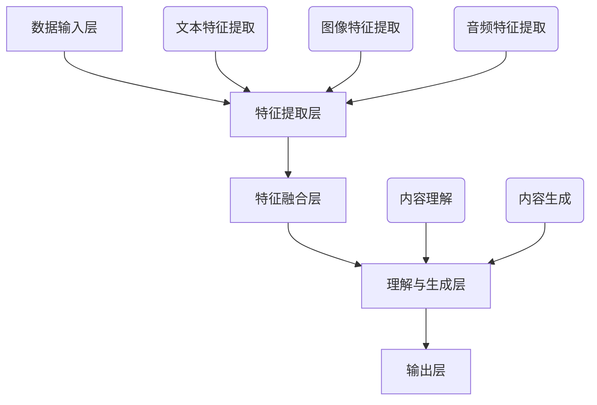

# AI Agent的多模态内容理解与生成

> 关键词：AI Agent、多模态、内容理解、内容生成、深度学习

> 摘要：本文围绕AI Agent的多模态内容理解与生成展开深入探讨。首先介绍了相关背景知识，包括目的、预期读者、文档结构和术语表。接着阐述了核心概念与联系，给出了原理和架构的文本示意图及Mermaid流程图。详细讲解了核心算法原理，并通过Python源代码进行说明。深入分析了数学模型和公式，结合具体例子进行解释。通过项目实战展示了代码实际案例并进行详细解读。探讨了实际应用场景，推荐了相关工具和资源。最后总结了未来发展趋势与挑战，还提供了常见问题与解答以及扩展阅读和参考资料，旨在为读者全面呈现AI Agent多模态内容理解与生成的技术全貌。

## 1. 背景介绍 
### 1.1 目的和范围
随着人工智能技术的不断发展，单一模态的数据处理已经难以满足复杂的现实需求。AI Agent的多模态内容理解与生成旨在让AI Agent能够综合处理文本、图像、音频、视频等多种不同模态的数据，实现更全面、深入的内容理解，并生成多样化、高质量的内容。本文章的范围涵盖了多模态内容理解与生成的基本概念、核心算法、数学模型、实际应用以及相关的工具和资源等方面，致力于为读者提供一个系统、全面的技术知识体系。

### 1.2 预期读者
本文预期读者包括对人工智能、机器学习、深度学习等领域感兴趣的研究人员、工程师、学生以及相关行业从业者。无论是希望深入了解多模态技术原理的专业人士，还是对新兴技术有探索欲望的初学者，都能从本文中获取有价值的信息。

### 1.3 文档结构概述
本文首先介绍相关背景知识，包括目的、读者群体、文档结构和术语表。接着阐述核心概念与联系，包括原理和架构的文本示意图及流程图。然后详细讲解核心算法原理并给出Python源代码。再分析数学模型和公式并举例说明。通过项目实战展示代码案例并解读。探讨实际应用场景，推荐工具和资源。最后总结未来发展趋势与挑战，提供常见问题解答和扩展阅读参考资料。

### 1.4 术语表
#### 1.4.1 核心术语定义
- **AI Agent**：智能代理，是一种能够感知环境、进行决策并采取行动以实现特定目标的软件实体。
- **多模态**：指包含多种不同类型数据的模式，如文本、图像、音频、视频等。
- **内容理解**：对输入的多模态数据进行分析、处理和解释，以获取其中的语义信息和内在含义。
- **内容生成**：根据理解的多模态信息，生成新的文本、图像、音频等内容。

#### 1.4.2 相关概念解释
- **深度学习**：一种基于人工神经网络的机器学习方法，通过多层神经网络自动学习数据的特征和模式，在多模态处理中发挥重要作用。
- **特征提取**：从原始多模态数据中提取出具有代表性的特征，以便后续的处理和分析。
- **融合策略**：将不同模态的特征进行整合的方法，以实现更全面的信息利用。

#### 1.4.3 缩略词列表
- **CNN**：Convolutional Neural Network，卷积神经网络
- **RNN**：Recurrent Neural Network，循环神经网络
- **LSTM**：Long Short - Term Memory，长短期记忆网络
- **Transformer**：一种基于注意力机制的深度学习架构

## 2. 核心概念与联系 
### 核心概念原理
AI Agent的多模态内容理解与生成的核心在于将不同模态的数据进行有效的融合和处理。首先，对于每种模态的数据，需要进行特征提取，将原始数据转换为计算机能够处理的特征表示。例如，对于图像数据，可以使用卷积神经网络（CNN）提取图像的视觉特征；对于文本数据，可以使用预训练的语言模型提取文本的语义特征。

然后，将不同模态的特征进行融合。融合的策略有多种，如早期融合、晚期融合和中间融合等。早期融合是在特征提取之前将不同模态的数据进行拼接；晚期融合是在各个模态单独处理后，将最终的决策结果进行融合；中间融合则是在特征提取过程中的某个中间阶段进行融合。

最后，根据融合后的特征进行内容理解和生成。内容理解可以通过分类、聚类、语义分析等任务来实现；内容生成可以根据不同的需求，生成文本描述、图像合成、音频生成等。

### 架构的文本示意图
AI Agent的多模态内容理解与生成架构主要包括以下几个部分：
1. **数据输入层**：接收来自不同模态的原始数据，如文本、图像、音频等。
2. **特征提取层**：针对不同模态的数据，使用相应的模型进行特征提取。
3. **特征融合层**：将不同模态的特征进行融合，得到综合的特征表示。
4. **理解与生成层**：根据融合后的特征进行内容理解和生成任务。
5. **输出层**：输出理解结果或生成的内容。

### Mermaid流程图


## 3. 核心算法原理 & 具体操作步骤 
### 特征提取算法
#### 图像特征提取（以CNN为例）
卷积神经网络（CNN）是一种专门用于处理具有网格结构数据（如图像）的深度学习模型。其核心操作包括卷积层、池化层和全连接层。

以下是一个使用Python和PyTorch实现的简单CNN图像特征提取示例：
```python
import torch
import torch.nn as nn

class SimpleCNN(nn.Module):
    def __init__(self):
        super(SimpleCNN, self).__init__()
        self.conv1 = nn.Conv2d(3, 16, kernel_size=3, padding=1)
        self.relu1 = nn.ReLU()
        self.pool1 = nn.MaxPool2d(kernel_size=2, stride=2)
        self.conv2 = nn.Conv2d(16, 32, kernel_size=3, padding=1)
        self.relu2 = nn.ReLU()
        self.pool2 = nn.MaxPool2d(kernel_size=2, stride=2)
        self.fc1 = nn.Linear(32 * 56 * 56, 128)
        self.relu3 = nn.ReLU()

    def forward(self, x):
        x = self.pool1(self.relu1(self.conv1(x)))
        x = self.pool2(self.relu2(self.conv2(x)))
        x = x.view(-1, 32 * 56 * 56)
        x = self.relu3(self.fc1(x))
        return x

# 示例使用
model = SimpleCNN()
input_image = torch.randn(1, 3, 224, 224)
features = model(input_image)
print(features.shape)
```
#### 文本特征提取（以Transformer为例）
Transformer是一种基于注意力机制的深度学习架构，在自然语言处理中取得了很好的效果。可以使用预训练的Transformer模型（如BERT）进行文本特征提取。

以下是一个使用Hugging Face的Transformers库进行文本特征提取的示例：
```python
from transformers import AutoTokenizer, AutoModel
import torch

tokenizer = AutoTokenizer.from_pretrained('bert-base-uncased')
model = AutoModel.from_pretrained('bert-base-uncased')

text = "This is a sample sentence."
inputs = tokenizer(text, return_tensors='pt')
outputs = model(**inputs)
last_hidden_state = outputs.last_hidden_state
print(last_hidden_state.shape)
```
### 特征融合算法
#### 早期融合
早期融合是将不同模态的数据在特征提取之前进行拼接。以下是一个简单的早期融合示例：
```python
import torch

# 假设已经提取了图像特征和文本特征
image_features = torch.randn(1, 128)
text_features = torch.randn(1, 128)

# 早期融合
combined_features = torch.cat((image_features, text_features), dim=1)
print(combined_features.shape)
```
#### 晚期融合
晚期融合是在各个模态单独处理后，将最终的决策结果进行融合。以下是一个简单的晚期融合示例：
```python
import torch
import torch.nn.functional as F

# 假设已经得到图像和文本的分类结果
image_logits = torch.randn(1, 10)
text_logits = torch.randn(1, 10)

# 计算概率分布
image_probs = F.softmax(image_logits, dim=1)
text_probs = F.softmax(text_logits, dim=1)

# 晚期融合（简单平均）
combined_probs = (image_probs + text_probs) / 2
print(combined_probs.shape)
```
### 内容生成算法（以文本生成为例）
可以使用基于Transformer的语言模型（如GPT）进行文本生成。以下是一个使用Hugging Face的Transformers库进行文本生成的示例：
```python
from transformers import GPT2LMHeadModel, GPT2Tokenizer

tokenizer = GPT2Tokenizer.from_pretrained('gpt2')
model = GPT2LMHeadModel.from_pretrained('gpt2')

input_text = "Once upon a time"
input_ids = tokenizer.encode(input_text, return_tensors='pt')
output = model.generate(input_ids, max_length=50, num_beams=5, no_repeat_ngram_size=2, early_stopping=True)
generated_text = tokenizer.decode(output[0], skip_special_tokens=True)
print(generated_text)
```

## 4. 数学模型和公式 & 详细讲解 & 举例说明 
### 卷积神经网络（CNN）
#### 卷积操作
卷积操作是CNN的核心操作，其数学公式为：
$$y_{i,j}^k=\sum_{m=0}^{M - 1}\sum_{n=0}^{N - 1}x_{i + m,j + n}w_{m,n}^k + b^k$$
其中，$x$ 是输入图像，$w$ 是卷积核，$b$ 是偏置，$y$ 是卷积后的特征图，$k$ 表示第 $k$ 个卷积核，$M$ 和 $N$ 是卷积核的大小。

举例说明：假设输入图像 $x$ 是一个 $3\times3$ 的矩阵，卷积核 $w$ 是一个 $2\times2$ 的矩阵，偏置 $b = 0$。则卷积操作的计算过程如下：
输入图像 $x=\begin{bmatrix}1 & 2 & 3\\4 & 5 & 6\\7 & 8 & 9\end{bmatrix}$，卷积核 $w=\begin{bmatrix}1 & 2\\3 & 4\end{bmatrix}$。
第一个卷积结果：
$$y_{0,0}=\sum_{m = 0}^{1}\sum_{n = 0}^{1}x_{0 + m,0 + n}w_{m,n}=1\times1+2\times2 + 4\times3+5\times4=37$$

#### 池化操作
池化操作通常用于降低特征图的维度，常见的池化操作有最大池化和平均池化。最大池化的数学公式为：
$$y_{i,j}=\max_{m,n\in\mathcal{R}(i,j)}x_{m,n}$$
其中，$\mathcal{R}(i,j)$ 表示以 $(i,j)$ 为中心的池化区域。

举例说明：假设输入特征图 $x=\begin{bmatrix}1 & 2 & 3\\4 & 5 & 6\\7 & 8 & 9\end{bmatrix}$，池化窗口大小为 $2\times2$，步长为 2。则最大池化的结果为：
$$y=\begin{bmatrix}5 & 6\\8 & 9\end{bmatrix}$$
### 注意力机制
注意力机制的核心思想是计算输入序列中每个元素的重要性权重。其数学公式为：
$$\text{Attention}(Q, K, V)=\text{softmax}\left(\frac{QK^T}{\sqrt{d_k}}\right)V$$
其中，$Q$ 是查询矩阵，$K$ 是键矩阵，$V$ 是值矩阵，$d_k$ 是键向量的维度。

举例说明：假设 $Q=\begin{bmatrix}1 & 2\\3 & 4\end{bmatrix}$，$K=\begin{bmatrix}5 & 6\\7 & 8\end{bmatrix}$，$V=\begin{bmatrix}9 & 10\\11 & 12\end{bmatrix}$，$d_k = 2$。
首先计算 $QK^T=\begin{bmatrix}1\times5 + 2\times7 & 1\times6+2\times8\\3\times5 + 4\times7 & 3\times6+4\times8\end{bmatrix}=\begin{bmatrix}19 & 22\\43 & 50\end{bmatrix}$。
然后计算 $\frac{QK^T}{\sqrt{d_k}}=\begin{bmatrix}\frac{19}{\sqrt{2}} & \frac{22}{\sqrt{2}}\\\frac{43}{\sqrt{2}} & \frac{50}{\sqrt{2}}\end{bmatrix}$。
接着计算 $\text{softmax}\left(\frac{QK^T}{\sqrt{d_k}}\right)$，最后与 $V$ 相乘得到注意力结果。

### 语言模型生成概率
对于基于自回归的语言模型，生成下一个词的概率可以表示为：
$$P(w_t|w_1,\cdots,w_{t - 1})=\text{softmax}(z_t)$$
其中，$w_t$ 是第 $t$ 个词，$z_t$ 是模型的输出得分。

举例说明：假设模型的输出得分 $z_t=\begin{bmatrix}1 & 2 & 3\end{bmatrix}$，则生成每个词的概率为：
$$P(w_1)=\frac{e^1}{e^1 + e^2+e^3}\approx0.09$$
$$P(w_2)=\frac{e^2}{e^1 + e^2+e^3}\approx0.24$$
$$P(w_3)=\frac{e^3}{e^1 + e^2+e^3}\approx0.67$$

## 5. 项目实战：代码实际案例和详细解释说明 
### 5.1  开发环境搭建
#### 安装Python
首先需要安装Python，建议使用Python 3.7及以上版本。可以从Python官方网站（https://www.python.org/downloads/）下载并安装。

#### 安装深度学习框架
本文使用PyTorch和Hugging Face的Transformers库，安装命令如下：
```bash
pip install torch
pip install transformers
```

#### 安装其他依赖库
还需要安装一些其他的依赖库，如`numpy`、`matplotlib`等：
```bash
pip install numpy matplotlib
```
### 5.2  源代码详细实现和代码解读
以下是一个简单的多模态图像文本分类项目的实现：
```python
import torch
import torch.nn as nn
from transformers import AutoTokenizer, AutoModel
import torchvision.models as models

# 图像特征提取模型
class ImageFeatureExtractor(nn.Module):
    def __init__(self):
        super(ImageFeatureExtractor, self).__init__()
        self.resnet = models.resnet18(pretrained=True)
        self.resnet.fc = nn.Identity()

    def forward(self, x):
        return self.resnet(x)

# 文本特征提取模型
class TextFeatureExtractor(nn.Module):
    def __init__(self):
        super(TextFeatureExtractor, self).__init__()
        self.tokenizer = AutoTokenizer.from_pretrained('bert-base-uncased')
        self.bert = AutoModel.from_pretrained('bert-base-uncased')

    def forward(self, text):
        inputs = self.tokenizer(text, return_tensors='pt', padding=True, truncation=True)
        outputs = self.bert(**inputs)
        return outputs.last_hidden_state[:, 0, :]

# 多模态分类模型
class MultiModalClassifier(nn.Module):
    def __init__(self):
        super(MultiModalClassifier, self).__init__()
        self.image_extractor = ImageFeatureExtractor()
        self.text_extractor = TextFeatureExtractor()
        self.fc1 = nn.Linear(512 + 768, 256)
        self.relu = nn.ReLU()
        self.fc2 = nn.Linear(256, 10)

    def forward(self, image, text):
        image_features = self.image_extractor(image)
        text_features = self.text_extractor(text)
        combined_features = torch.cat((image_features, text_features), dim=1)
        x = self.relu(self.fc1(combined_features))
        x = self.fc2(x)
        return x

# 示例使用
model = MultiModalClassifier()
image = torch.randn(1, 3, 224, 224)
text = ["This is a sample text."]
output = model(image, text)
print(output.shape)
```
### 5.3  代码解读与分析
1. **ImageFeatureExtractor类**：使用预训练的ResNet18模型提取图像特征，将最后一层全连接层替换为恒等映射，以便输出特征向量。
2. **TextFeatureExtractor类**：使用预训练的BERT模型提取文本特征，取[CLS]标记的输出作为文本的整体特征。
3. **MultiModalClassifier类**：将图像特征和文本特征进行拼接，然后通过两层全连接层进行分类。
4. **示例使用**：创建多模态分类模型实例，输入随机图像和文本，得到分类输出。

## 6. 实际应用场景 
### 智能客服
多模态的AI Agent可以处理用户的文本、语音和图像等多种形式的咨询，提供更准确、全面的回答。例如，用户可以上传图片描述产品问题，智能客服可以结合图像和文本信息进行问题诊断和解决。

### 自动驾驶
在自动驾驶中，AI Agent需要处理来自摄像头、雷达、激光雷达等多种传感器的数据，实现对道路、交通标志、行人等的多模态理解，从而做出安全、准确的驾驶决策。

### 智能教育
多模态的AI Agent可以根据学生的文本作业、语音回答和表情等多模态信息，评估学生的学习状态和知识掌握情况，提供个性化的学习建议和辅导。

### 虚拟现实和增强现实
在虚拟现实和增强现实场景中，AI Agent可以结合视觉、听觉、触觉等多模态信息，为用户提供更加沉浸式、真实的体验。例如，根据用户的语音指令和手势动作，在虚拟环境中进行交互和操作。

## 7. 工具和资源推荐
### 7.1 学习资源推荐
#### 7.1.1 书籍推荐
- 《深度学习》（Deep Learning）：由Ian Goodfellow、Yoshua Bengio和Aaron Courville撰写，是深度学习领域的经典教材，涵盖了神经网络、卷积神经网络、循环神经网络等重要内容。
- 《Python深度学习》（Deep Learning with Python）：由Francois Chollet编写，结合Keras框架介绍深度学习的实践应用，适合初学者快速上手。
- 《多模态机器学习：基础与应用》（Multimodal Machine Learning: A Survey and Taxonomy）：对多模态机器学习的理论和应用进行了全面的综述和分类，是多模态领域的重要参考书籍。

#### 7.1.2 在线课程
- Coursera上的“深度学习专项课程”（Deep Learning Specialization）：由Andrew Ng教授授课，包括神经网络、卷积神经网络、循环神经网络等多个模块，内容全面深入。
- edX上的“人工智能基础”（Introduction to Artificial Intelligence）：介绍人工智能的基本概念、算法和应用，适合初学者入门。
- B站等平台上的多模态相关课程：有很多开源的教学视频，由不同的讲师讲解多模态技术的原理和实践。

#### 7.1.3 技术博客和网站
- Medium：有很多关于人工智能、深度学习和多模态技术的优秀博客文章，作者来自不同的研究机构和企业。
- arXiv：提供最新的学术论文预印本，涵盖了多模态领域的最新研究成果。
- Hugging Face的博客：分享了很多关于Transformer模型和自然语言处理的技术文章和实践经验。

### 7.2 开发工具框架推荐
#### 7.2.1 IDE和编辑器
- PyCharm：一款功能强大的Python集成开发环境，提供代码编辑、调试、版本控制等功能，适合开发深度学习项目。
- Jupyter Notebook：交互式的开发环境，方便进行代码编写、实验和结果展示，常用于深度学习的研究和教学。
- Visual Studio Code：轻量级的代码编辑器，支持多种编程语言和插件扩展，可用于快速开发和调试。

#### 7.2.2 调试和性能分析工具
- TensorBoard：TensorFlow的可视化工具，可以用于查看模型的训练过程、损失曲线、准确率等指标，也可以用于分析模型的结构和参数。
- PyTorch Profiler：PyTorch提供的性能分析工具，可以帮助开发者找出代码中的性能瓶颈，优化模型的训练和推理速度。
- NVIDIA Nsight Systems：用于分析GPU性能的工具，可以详细分析GPU的使用情况、内存占用等信息。

#### 7.2.3 相关框架和库
- PyTorch：一个开源的深度学习框架，提供了丰富的神经网络模块和优化算法，支持GPU加速，广泛应用于多模态领域。
- TensorFlow：另一个流行的深度学习框架，具有强大的分布式训练和部署能力，也有很多多模态相关的工具和模型。
- Hugging Face的Transformers库：提供了大量预训练的Transformer模型，方便进行文本处理和生成任务。
- TorchVision：PyTorch的计算机视觉库，提供了常用的图像数据集、模型和图像处理工具。

### 7.3 相关论文著作推荐
#### 7.3.1 经典论文
- “Attention Is All You Need”：提出了Transformer架构，奠定了现代自然语言处理的基础。
- “ImageNet Classification with Deep Convolutional Neural Networks”：介绍了AlexNet模型，开启了深度学习在计算机视觉领域的热潮。
- “Long Short - Term Memory”：提出了LSTM网络，解决了传统循环神经网络的梯度消失问题。

#### 7.3.2 最新研究成果
- 关注arXiv上的最新论文，如关于多模态预训练模型、跨模态迁移学习等方面的研究。
- 参加国际学术会议，如CVPR、ICCV、ACL等，了解多模态领域的最新研究动态。

#### 7.3.3 应用案例分析
- 各大科技公司的技术博客，如Google、Facebook、Microsoft等，分享了很多多模态技术在实际应用中的案例和经验。
- 相关的学术论文和研究报告，对多模态技术在不同领域的应用进行了深入分析和探讨。

## 8. 总结：未来发展趋势与挑战
### 未来发展趋势
#### 多模态预训练模型的发展
未来会有更多强大的多模态预训练模型出现，这些模型可以在大规模的多模态数据上进行预训练，然后在不同的下游任务中进行微调，提高模型的泛化能力和性能。

#### 跨模态迁移学习
跨模态迁移学习可以将一个模态的知识迁移到另一个模态，减少对大规模标注数据的依赖。未来，跨模态迁移学习技术将不断发展，提高多模态学习的效率和效果。

#### 多模态交互与协作
AI Agent的多模态能力将越来越强，能够与人类进行更加自然、高效的多模态交互和协作。例如，在智能家居、智能办公等场景中，AI Agent可以通过语音、手势、表情等多种方式与用户进行交互。

### 挑战
#### 数据获取与标注
多模态数据的获取和标注是一个挑战。不同模态的数据来源不同，格式也不同，需要进行复杂的处理和整合。同时，标注多模态数据需要专业的知识和大量的人力物力。

#### 模型复杂度与计算资源
多模态模型通常比较复杂，需要大量的计算资源进行训练和推理。如何在有限的计算资源下提高模型的效率和性能是一个亟待解决的问题。

#### 语义理解与融合
不同模态的数据具有不同的语义表示，如何实现不同模态语义的有效理解和融合是多模态技术的核心挑战之一。需要进一步研究和发展语义分析和融合的方法。

## 9. 附录：常见问题与解答
### 多模态数据的特征维度不一致怎么办？
可以采用特征降维或升维的方法，如主成分分析（PCA）进行降维，或通过全连接层进行升维，使不同模态的特征维度一致。

### 多模态模型训练时容易过拟合怎么办？
可以采用数据增强、正则化（如L1、L2正则化）、早停策略等方法来防止过拟合。同时，增加训练数据的多样性和规模也有助于提高模型的泛化能力。

### 如何选择合适的特征融合策略？
需要根据具体的任务和数据特点来选择。早期融合适用于不同模态数据之间相关性较强的情况；晚期融合适用于不同模态数据相对独立的情况；中间融合则可以在两者之间取得平衡。

## 10. 扩展阅读 & 参考资料
### 扩展阅读
- 关于多模态情感分析、多模态知识图谱等相关领域的研究。
- 不同行业中多模态技术的应用案例和实践经验分享。

### 参考资料
- 相关的学术论文、书籍、技术报告等。
- 开源代码库和数据集，如GitHub上的多模态相关项目、公开的多模态数据集（如MNIST-M、VQA等）。

作者：AI天才研究院/AI Genius Institute & 禅与计算机程序设计艺术 /Zen And The Art of Computer Programming