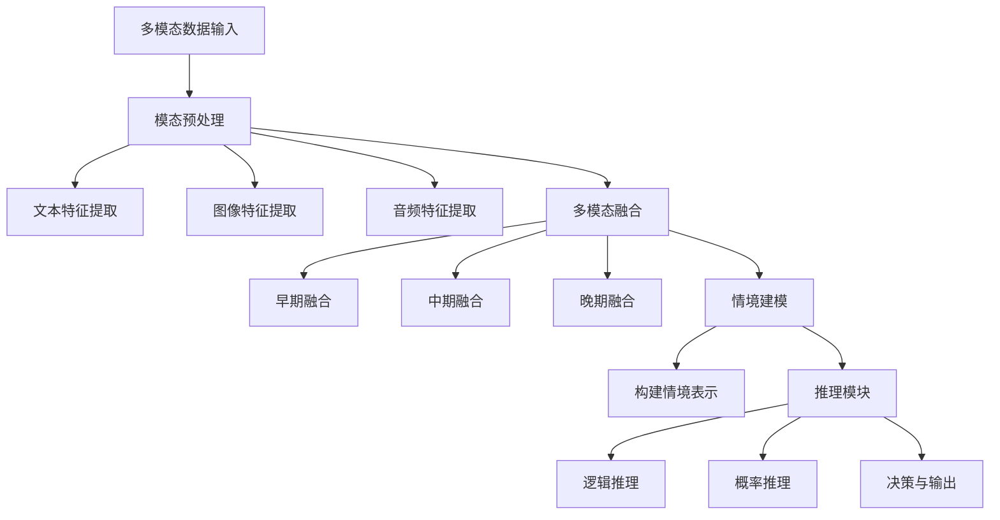

# AI Agent的多模态情境理解与推理

> 关键词：AI Agent、多模态、情境理解、推理、深度学习

> 摘要：本文聚焦于AI Agent的多模态情境理解与推理这一前沿领域。首先介绍了该研究的背景，包括目的、预期读者、文档结构和相关术语。接着深入阐述了核心概念，给出了原理和架构的文本示意图以及Mermaid流程图。详细讲解了核心算法原理，并使用Python源代码进行说明。同时，引入了相关数学模型和公式，并举例分析。通过项目实战，展示了代码的实际案例并进行详细解读。探讨了其实际应用场景，推荐了学习资源、开发工具框架和相关论文著作。最后总结了未来发展趋势与挑战，提供了常见问题解答和扩展阅读参考资料，旨在为读者全面深入地呈现AI Agent多模态情境理解与推理的知识体系。

## 1. 背景介绍 
### 1.1 目的和范围
在当今数字化时代，人工智能正以前所未有的速度发展。AI Agent作为人工智能领域的重要研究对象，旨在模拟人类的智能行为，能够自主地感知环境、做出决策并执行相应的任务。传统的AI Agent主要基于单一模态的数据进行处理，如文本或图像，但在现实世界中，信息往往是以多种模态的形式存在的，包括视觉、听觉、触觉等。多模态情境理解与推理能够让AI Agent更全面、准确地理解周围环境，从而做出更合理的决策。

本文的目的在于深入探讨AI Agent如何实现多模态情境理解与推理，涵盖了从核心概念、算法原理到实际应用的各个方面。我们将研究多模态数据的融合方法、情境理解的机制以及推理的策略，为相关领域的研究和开发提供理论支持和实践指导。

### 1.2 预期读者
本文的预期读者包括人工智能领域的研究人员、开发者、学生以及对AI Agent和多模态技术感兴趣的爱好者。对于研究人员，本文可以为他们的研究工作提供新的思路和方法；对于开发者，能够帮助他们在实际项目中应用多模态情境理解与推理技术；对于学生，有助于他们深入学习人工智能的相关知识；对于爱好者，则可以让他们了解该领域的最新进展。

### 1.3 文档结构概述
本文将按照以下结构进行组织：
1. **背景介绍**：阐述研究的目的、预期读者、文档结构和相关术语。
2. **核心概念与联系**：介绍多模态、情境理解、推理等核心概念，给出原理和架构的文本示意图和Mermaid流程图。
3. **核心算法原理 & 具体操作步骤**：详细讲解实现多模态情境理解与推理的核心算法，并使用Python源代码进行说明。
4. **数学模型和公式 & 详细讲解 & 举例说明**：引入相关数学模型和公式，进行详细讲解并举例分析。
5. **项目实战：代码实际案例和详细解释说明**：通过具体的项目实战，展示代码的实现过程并进行详细解读。
6. **实际应用场景**：探讨AI Agent多模态情境理解与推理在不同领域的实际应用。
7. **工具和资源推荐**：推荐学习资源、开发工具框架和相关论文著作。
8. **总结：未来发展趋势与挑战**：总结该领域的未来发展趋势和面临的挑战。
9. **附录：常见问题与解答**：提供常见问题的解答。
10. **扩展阅读 & 参考资料**：列出扩展阅读的资料和参考来源。

### 1.4 术语表
#### 1.4.1 核心术语定义
- **AI Agent**：人工智能代理，是一种能够感知环境、做出决策并执行任务的智能实体。
- **多模态**：指的是包含多种不同类型数据的信息，如文本、图像、音频、视频等。
- **情境理解**：AI Agent对周围环境的综合感知和理解，包括对场景、事件、实体等的识别和分析。
- **推理**：基于已有的知识和信息，通过逻辑或概率方法得出新结论的过程。

#### 1.4.2 相关概念解释
- **多模态融合**：将不同模态的数据进行整合和处理，以获取更全面、准确的信息。
- **情境建模**：对情境进行抽象和表示，以便AI Agent能够更好地理解和处理。
- **知识图谱**：一种语义网络，用于表示实体之间的关系和知识。

#### 1.4.3 缩略词列表
- **CNN**：Convolutional Neural Network，卷积神经网络
- **RNN**：Recurrent Neural Network，循环神经网络
- **LSTM**：Long Short-Term Memory，长短期记忆网络
- **Transformer**：一种基于注意力机制的深度学习模型

## 2. 核心概念与联系 

### 核心概念原理
#### 多模态
多模态数据是指包含多种不同类型信息的数据，如文本、图像、音频等。不同模态的数据具有不同的特征和表达方式，例如文本数据包含语义信息，图像数据包含视觉特征，音频数据包含声音特征。多模态数据的融合可以让AI Agent获取更丰富、全面的信息，从而提高情境理解和推理的能力。

#### 情境理解
情境理解是AI Agent对周围环境的综合感知和理解。它需要对场景、事件、实体等进行识别和分析，以确定当前的情境状态。情境理解可以基于多种模态的数据进行，例如通过图像识别场景中的物体，通过文本理解场景中的事件描述。

#### 推理
推理是基于已有的知识和信息，通过逻辑或概率方法得出新结论的过程。在多模态情境理解的基础上，AI Agent可以利用推理技术进行决策和预测。例如，根据图像中物体的位置和状态，结合文本描述的规则，推理出物体之间的关系和可能发生的事件。

### 架构的文本示意图
```plaintext
多模态数据输入
|
|-- 模态预处理（特征提取）
|   |-- 文本特征提取（如词嵌入）
|   |-- 图像特征提取（如CNN）
|   |-- 音频特征提取（如MFCC）
|
|-- 多模态融合
|   |-- 早期融合（特征级融合）
|   |-- 中期融合（决策级融合）
|   |-- 晚期融合（结果级融合）
|
|-- 情境建模
|   |-- 构建情境表示（如知识图谱）
|
|-- 推理模块
|   |-- 逻辑推理（规则推理）
|   |-- 概率推理（贝叶斯网络）
|
|-- 决策与输出
```

### Mermaid流程图


## 3. 核心算法原理 & 具体操作步骤 

### 多模态特征提取
#### 文本特征提取
在文本特征提取中，我们可以使用词嵌入技术将文本转换为向量表示。以下是使用Python和`torchtext`库进行词嵌入的示例代码：
```python
import torch
import torchtext
from torchtext.vocab import GloVe

# 加载预训练的GloVe词向量
glove = GloVe(name='6B', dim=100)

# 定义文本
text = "This is a sample sentence."

# 将文本分词
tokens = text.split()

# 获取词向量
vectors = [glove[token] for token in tokens]

# 转换为张量
text_features = torch.stack(vectors)

print(text_features.shape)
```
#### 图像特征提取
对于图像特征提取，我们可以使用卷积神经网络（CNN）。以下是使用`torchvision`库中的预训练ResNet模型进行图像特征提取的示例代码：
```python
import torch
import torchvision.models as models
import torchvision.transforms as transforms
from PIL import Image

# 加载预训练的ResNet模型
resnet = models.resnet18(pretrained=True)
# 去除最后一层全连接层
feature_extractor = torch.nn.Sequential(*list(resnet.children())[:-1])

# 定义图像预处理
transform = transforms.Compose([
    transforms.Resize(256),
    transforms.CenterCrop(224),
    transforms.ToTensor(),
    transforms.Normalize(mean=[0.485, 0.456, 0.406], std=[0.229, 0.224, 0.225])
])

# 加载图像
image = Image.open('sample_image.jpg')
# 预处理图像
image = transform(image).unsqueeze(0)

# 提取图像特征
with torch.no_grad():
    image_features = feature_extractor(image).squeeze()

print(image_features.shape)
```

### 多模态融合
#### 早期融合（特征级融合）
早期融合是在特征提取阶段将不同模态的特征进行拼接。以下是一个简单的示例代码：
```python
# 假设text_features和image_features已经提取好
combined_features = torch.cat((text_features, image_features), dim=0)

print(combined_features.shape)
```
#### 中期融合（决策级融合）
中期融合是在模型的中间层将不同模态的信息进行融合。以下是一个简单的示例代码：
```python
import torch.nn as nn

class MidFusionModel(nn.Module):
    def __init__(self):
        super(MidFusionModel, self).__init__()
        self.text_fc = nn.Linear(text_features.shape[1], 128)
        self.image_fc = nn.Linear(image_features.shape[1], 128)
        self.fc = nn.Linear(256, 1)

    def forward(self, text, image):
        text_out = self.text_fc(text)
        image_out = self.image_fc(image)
        combined = torch.cat((text_out, image_out), dim=1)
        output = self.fc(combined)
        return output

model = MidFusionModel()
output = model(text_features, image_features)

print(output.shape)
```
#### 晚期融合（结果级融合）
晚期融合是在模型的输出阶段将不同模态的结果进行融合。以下是一个简单的示例代码：
```python
import torch.nn.functional as F

# 假设text_output和image_output是不同模态模型的输出
text_output = torch.randn(1, 10)
image_output = torch.randn(1, 10)

# 简单的加权融合
combined_output = 0.5 * text_output + 0.5 * image_output

# 经过softmax函数
final_output = F.softmax(combined_output, dim=1)

print(final_output.shape)
```

### 情境建模与推理
#### 情境建模
我们可以使用知识图谱来构建情境表示。以下是一个简单的知识图谱构建示例：
```python
from rdflib import Graph, URIRef, Literal

# 创建一个图
g = Graph()

# 定义实体和关系
person = URIRef("http://example.org/person")
book = URIRef("http://example.org/book")
reads = URIRef("http://example.org/reads")

# 添加三元组
g.add((person, reads, book))

# 打印图的内容
for s, p, o in g:
    print(s, p, o)
```
#### 推理
我们可以使用规则推理来进行简单的推理。以下是一个简单的规则推理示例：
```python
# 定义规则
rules = [
    {"if": [("person", "reads", "book")], "then": [("person", "has_knowledge", "book")]}
]

# 定义事实
facts = [("person", "reads", "book")]

# 进行推理
new_facts = []
for rule in rules:
    if all(fact in facts for fact in rule["if"]):
        new_facts.extend(rule["then"])

facts.extend(new_facts)

print(facts)
```

## 4. 数学模型和公式 & 详细讲解 & 举例说明 

### 多模态融合的数学模型
#### 早期融合（特征级融合）
早期融合是将不同模态的特征向量进行拼接。假设我们有文本特征向量 $\mathbf{x}_t \in \mathbb{R}^{d_t}$ 和图像特征向量 $\mathbf{x}_i \in \mathbb{R}^{d_i}$，则融合后的特征向量 $\mathbf{x}_c$ 为：
$$\mathbf{x}_c = [\mathbf{x}_t; \mathbf{x}_i] \in \mathbb{R}^{d_t + d_i}$$
其中 $[\cdot; \cdot]$ 表示向量拼接操作。

举例：假设 $\mathbf{x}_t = [1, 2, 3]$，$\mathbf{x}_i = [4, 5]$，则 $\mathbf{x}_c = [1, 2, 3, 4, 5]$。

#### 中期融合（决策级融合）
中期融合可以使用加权和的方式进行。假设我们有文本模态的中间输出 $\mathbf{y}_t \in \mathbb{R}^{d}$ 和图像模态的中间输出 $\mathbf{y}_i \in \mathbb{R}^{d}$，则融合后的输出 $\mathbf{y}_c$ 为：
$$\mathbf{y}_c = \alpha \mathbf{y}_t + (1 - \alpha) \mathbf{y}_i$$
其中 $\alpha \in [0, 1]$ 是权重系数。

举例：假设 $\mathbf{y}_t = [1, 2]$，$\mathbf{y}_i = [3, 4]$，$\alpha = 0.5$，则 $\mathbf{y}_c = 0.5 \times [1, 2] + 0.5 \times [3, 4] = [2, 3]$。

#### 晚期融合（结果级融合）
晚期融合也可以使用加权和的方式进行。假设我们有文本模态的输出概率分布 $\mathbf{p}_t \in \mathbb{R}^{K}$ 和图像模态的输出概率分布 $\mathbf{p}_i \in \mathbb{R}^{K}$，则融合后的概率分布 $\mathbf{p}_c$ 为：
$$\mathbf{p}_c = \beta \mathbf{p}_t + (1 - \beta) \mathbf{p}_i$$
其中 $\beta \in [0, 1]$ 是权重系数。

举例：假设 $\mathbf{p}_t = [0.2, 0.8]$，$\mathbf{p}_i = [0.3, 0.7]$，$\beta = 0.6$，则 $\mathbf{p}_c = 0.6 \times [0.2, 0.8] + 0.4 \times [0.3, 0.7] = [0.24, 0.76]$。

### 推理的数学模型
#### 逻辑推理
逻辑推理可以使用一阶逻辑进行表示。假设我们有一组规则 $R = \{r_1, r_2, \cdots, r_n\}$ 和一组事实 $F = \{f_1, f_2, \cdots, f_m\}$，每个规则 $r_i$ 可以表示为 $A_i \rightarrow C_i$，其中 $A_i$ 是前提条件，$C_i$ 是结论。如果 $A_i \subseteq F$，则可以推导出 $C_i$，并将其添加到 $F$ 中。

举例：假设规则 $r_1$ 为 $A_1 = \{(a, p, b)\} \rightarrow C_1 = \{(b, q, a)\}$，事实 $F = \{(a, p, b)\}$，由于 $A_1 \subseteq F$，则可以推导出 $(b, q, a)$，并将其添加到 $F$ 中。

#### 概率推理
概率推理可以使用贝叶斯网络进行表示。贝叶斯网络是一个有向无环图，每个节点表示一个随机变量，每条边表示变量之间的依赖关系。假设我们有一个贝叶斯网络 $G = (V, E)$，其中 $V$ 是节点集合，$E$ 是边集合。每个节点 $X_i$ 有一个条件概率分布 $P(X_i | Pa(X_i))$，其中 $Pa(X_i)$ 是 $X_i$ 的父节点集合。

根据贝叶斯定理，我们可以计算联合概率分布：
$$P(X_1, X_2, \cdots, X_n) = \prod_{i = 1}^{n} P(X_i | Pa(X_i))$$

举例：假设我们有一个简单的贝叶斯网络，包含三个节点 $X_1$，$X_2$，$X_3$，其中 $X_1$ 是 $X_2$ 的父节点，$X_2$ 是 $X_3$ 的父节点。则联合概率分布为：
$$P(X_1, X_2, X_3) = P(X_1) P(X_2 | X_1) P(X_3 | X_2)$$

## 5. 项目实战：代码实际案例和详细解释说明 

### 5.1  开发环境搭建
#### 安装Python
首先，确保你已经安装了Python 3.x版本。你可以从Python官方网站（https://www.python.org/downloads/）下载并安装。

#### 安装必要的库
使用`pip`命令安装以下必要的库：
```bash
pip install torch torchvision torchtext rdflib
```

### 5.2  源代码详细实现和代码解读
#### 项目概述
我们将实现一个简单的多模态情感分析项目，结合文本和图像信息来判断情感倾向（积极或消极）。

#### 代码实现
```python
import torch
import torch.nn as nn
import torch.optim as optim
from torch.utils.data import Dataset, DataLoader
from torchvision.models import resnet18
from torchtext.vocab import GloVe
import torchvision.transforms as transforms
from PIL import Image
import pandas as pd

# 定义数据集类
class MultimodalDataset(Dataset):
    def __init__(self, csv_file, root_dir, transform=None):
        self.dataframe = pd.read_csv(csv_file)
        self.root_dir = root_dir
        self.transform = transform
        self.glove = GloVe(name='6B', dim=100)

    def __len__(self):
        return len(self.dataframe)

    def __getitem__(self, idx):
        if torch.is_tensor(idx):
            idx = idx.tolist()

        text = self.dataframe.iloc[idx, 0]
        image_path = self.dataframe.iloc[idx, 1]
        label = self.dataframe.iloc[idx, 2]

        # 文本特征提取
        tokens = text.split()
        vectors = [self.glove[token] for token in tokens]
        text_features = torch.stack(vectors).mean(dim=0)

        # 图像特征提取
        image = Image.open(self.root_dir + image_path)
        if self.transform:
            image = self.transform(image)

        return text_features, image, label

# 定义多模态模型
class MultimodalModel(nn.Module):
    def __init__(self):
        super(MultimodalModel, self).__init__()
        self.text_fc = nn.Linear(100, 128)
        self.image_model = resnet18(pretrained=True)
        self.image_model.fc = nn.Linear(self.image_model.fc.in_features, 128)
        self.fc = nn.Linear(256, 1)
        self.sigmoid = nn.Sigmoid()

    def forward(self, text, image):
        text_out = self.text_fc(text)
        image_out = self.image_model(image)
        combined = torch.cat((text_out, image_out), dim=1)
        output = self.fc(combined)
        output = self.sigmoid(output)
        return output

# 数据预处理
transform = transforms.Compose([
    transforms.Resize(256),
    transforms.CenterCrop(224),
    transforms.ToTensor(),
    transforms.Normalize(mean=[0.485, 0.456, 0.406], std=[0.229, 0.224, 0.225])
])

# 加载数据集
dataset = MultimodalDataset(csv_file='data.csv', root_dir='images/', transform=transform)
dataloader = DataLoader(dataset, batch_size=32, shuffle=True)

# 初始化模型、损失函数和优化器
model = MultimodalModel()
criterion = nn.BCELoss()
optimizer = optim.Adam(model.parameters(), lr=0.001)

# 训练模型
num_epochs = 10
for epoch in range(num_epochs):
    running_loss = 0.0
    for text_features, images, labels in dataloader:
        optimizer.zero_grad()
        outputs = model(text_features, images)
        labels = labels.float().unsqueeze(1)
        loss = criterion(outputs, labels)
        loss.backward()
        optimizer.step()
        running_loss += loss.item()
    print(f'Epoch {epoch + 1}, Loss: {running_loss / len(dataloader)}')
```

### 5.3  代码解读与分析
#### 数据集类
`MultimodalDataset`类用于加载和处理多模态数据。在`__getitem__`方法中，我们对文本和图像进行特征提取。对于文本，使用GloVe词向量进行表示；对于图像，使用预训练的ResNet模型进行特征提取。

#### 多模态模型
`MultimodalModel`类是我们的核心模型。它包含一个文本全连接层、一个图像ResNet模型和一个融合全连接层。在`forward`方法中，我们将文本和图像的特征进行拼接，并通过全连接层和Sigmoid函数输出情感概率。

#### 训练过程
在训练过程中，我们使用二元交叉熵损失函数（BCELoss）和Adam优化器。通过多次迭代训练数据，不断更新模型的参数，使损失函数逐渐减小。

## 6. 实际应用场景 
### 智能客服
在智能客服系统中，AI Agent可以通过多模态情境理解与推理更好地理解用户的需求。用户可以通过文本、语音或图像等方式与客服进行交互。例如，用户可以发送一张故障设备的图片并附上文字描述，AI Agent可以综合分析图片中的设备状态和文本描述，快速准确地判断问题并提供解决方案。

### 自动驾驶
在自动驾驶领域，AI Agent需要处理多种模态的数据，如摄像头图像、激光雷达点云、毫米波雷达数据等。通过多模态情境理解与推理，AI Agent可以更全面地感知周围环境，识别道路、车辆、行人等物体，预测他们的行为，从而做出更安全、合理的驾驶决策。

### 智能家居
在智能家居系统中，AI Agent可以通过多模态传感器收集信息，如摄像头的视觉信息、麦克风的语音信息、温湿度传感器的数据等。通过对这些多模态数据的理解和推理，AI Agent可以自动调节室内温度、灯光亮度，根据用户的语音指令控制家电设备，提供更加智能、便捷的家居体验。

### 医疗诊断
在医疗领域，AI Agent可以结合患者的病历文本、医学影像（如X光、CT等）和生命体征数据进行多模态情境理解与推理。通过分析这些多模态数据，AI Agent可以辅助医生进行疾病诊断、制定治疗方案，提高诊断的准确性和效率。

## 7. 工具和资源推荐
### 7.1 学习资源推荐
#### 7.1.1 书籍推荐
- 《深度学习》（Deep Learning）：由Ian Goodfellow、Yoshua Bengio和Aaron Courville所著，是深度学习领域的经典教材，涵盖了神经网络、卷积神经网络、循环神经网络等重要内容。
- 《人工智能：一种现代的方法》（Artificial Intelligence: A Modern Approach）：由Stuart Russell和Peter Norvig所著，全面介绍了人工智能的各个领域，包括知识表示、推理、机器学习等。
- 《多模态机器学习：基础与应用》（Multimodal Machine Learning: Foundations and Applications）：由Paul Pu Liang和Soujanya Poria所著，专门介绍了多模态机器学习的相关理论和方法。

#### 7.1.2 在线课程
- Coursera上的“深度学习专项课程”（Deep Learning Specialization）：由Andrew Ng教授授课，包括神经网络和深度学习、改善深层神经网络、结构化机器学习项目等课程。
- edX上的“人工智能基础”（Introduction to Artificial Intelligence）：由UC Berkeley大学提供，介绍了人工智能的基本概念和方法。
- Kaggle上的“多模态学习”（Multimodal Learning）：提供了多模态学习的相关教程和竞赛。

#### 7.1.3 技术博客和网站
- Towards Data Science：一个专注于数据科学和机器学习的博客平台，有很多关于多模态学习和AI Agent的文章。
- Medium：一个综合性的博客平台，有很多技术专家分享他们的研究成果和经验。
- arXiv：一个预印本服务器，提供了大量的学术论文，包括多模态学习和AI Agent领域的最新研究。

### 7.2 开发工具框架推荐
#### 7.2.1 IDE和编辑器
- PyCharm：一款专门为Python开发设计的集成开发环境，提供了丰富的功能，如代码调试、自动补全、版本控制等。
- Jupyter Notebook：一个交互式的开发环境，适合进行数据分析和模型实验，支持Python、R等多种编程语言。
- Visual Studio Code：一款轻量级的代码编辑器，支持多种编程语言和插件扩展，有丰富的开发工具和调试功能。

#### 7.2.2 调试和性能分析工具
- PyTorch Profiler：PyTorch提供的性能分析工具，可以帮助开发者分析模型的性能瓶颈，优化代码。
- TensorBoard：TensorFlow提供的可视化工具，也可以用于PyTorch模型的可视化和性能分析。
- cProfile：Python内置的性能分析工具，可以帮助开发者分析代码的运行时间和函数调用情况。

#### 7.2.3 相关框架和库
- PyTorch：一个开源的深度学习框架，提供了丰富的神经网络模块和工具，支持多模态数据的处理和模型训练。
- TensorFlow：另一个流行的深度学习框架，具有强大的分布式训练和部署能力，也支持多模态学习。
- AllenNLP：一个用于自然语言处理的深度学习框架，提供了丰富的预训练模型和工具，方便进行文本处理和多模态融合。

### 7.3 相关论文著作推荐
#### 7.3.1 经典论文
- "Attention Is All You Need"：提出了Transformer模型，为自然语言处理和多模态学习带来了革命性的变化。
- "Multimodal Deep Learning"：首次提出了多模态深度学习的概念，介绍了多模态数据融合的方法和应用。
- "Deep Residual Learning for Image Recognition"：提出了残差网络（ResNet），解决了深度神经网络训练中的梯度消失问题，在图像特征提取中得到了广泛应用。

#### 7.3.2 最新研究成果
- 搜索arXiv和ACM Digital Library等学术数据库，关注多模态学习和AI Agent领域的最新研究论文。
- 参加相关的学术会议，如NeurIPS、ICML、CVPR等，了解最新的研究动态和成果。

#### 7.3.3 应用案例分析
- 搜索IEEE Xplore和ACM Digital Library等数据库，查找多模态学习和AI Agent在不同领域的应用案例分析论文。
- 关注工业界的技术博客和报告，了解实际应用中的经验和挑战。

## 8. 总结：未来发展趋势与挑战
### 未来发展趋势
#### 更强大的多模态融合方法
未来的研究将致力于开发更高效、更强大的多模态融合方法，能够更好地处理不同模态数据之间的复杂关系，提高多模态情境理解和推理的准确性。

#### 跨模态迁移学习
跨模态迁移学习将成为一个重要的研究方向。通过在不同模态之间迁移知识，可以减少对大量标注数据的依赖，提高模型的泛化能力。

#### 与其他技术的融合
AI Agent的多模态情境理解与推理将与其他技术，如区块链、物联网等进行深度融合，创造出更多的应用场景和价值。

#### 可解释性和可信赖性
随着AI技术的广泛应用，模型的可解释性和可信赖性将变得越来越重要。未来的研究将致力于开发可解释的多模态模型，提高模型的透明度和可信度。

### 挑战
#### 数据获取和标注
多模态数据的获取和标注是一个具有挑战性的问题。不同模态的数据需要不同的采集设备和方法，而且标注多模态数据需要专业的知识和大量的人力。

#### 计算资源需求
多模态模型通常需要大量的计算资源来进行训练和推理。如何在有限的计算资源下提高模型的性能是一个亟待解决的问题。

#### 模态间语义鸿沟
不同模态的数据具有不同的语义表示，如何跨越模态间的语义鸿沟，实现有效的多模态融合和推理是一个挑战。

#### 伦理和法律问题
随着AI Agent的广泛应用，伦理和法律问题也日益凸显。例如，如何确保AI Agent的决策符合道德和法律标准，如何保护用户的隐私和数据安全等。

## 9. 附录：常见问题与解答
### 1. 多模态融合有哪些方法？
多模态融合主要有早期融合（特征级融合）、中期融合（决策级融合）和晚期融合（结果级融合）三种方法。早期融合是在特征提取阶段将不同模态的特征进行拼接；中期融合是在模型的中间层将不同模态的信息进行融合；晚期融合是在模型的输出阶段将不同模态的结果进行融合。

### 2. 如何选择合适的多模态融合方法？
选择合适的多模态融合方法需要考虑数据的特点、模型的结构和任务的需求。如果不同模态的数据之间具有较强的相关性，可以选择早期融合；如果不同模态的数据之间的相关性较弱，可以选择中期或晚期融合。

### 3. 多模态情境理解与推理的应用场景有哪些限制？
多模态情境理解与推理的应用场景受到数据质量、计算资源和模型性能的限制。例如，在一些复杂的场景中，多模态数据的质量可能较低，导致模型的性能下降；在一些资源受限的设备上，无法运行复杂的多模态模型。

### 4. 如何提高多模态模型的可解释性？
提高多模态模型的可解释性可以采用以下方法：使用可解释的模型结构，如决策树、规则引擎等；引入注意力机制，可视化模型的注意力分布；使用特征重要性分析方法，分析不同模态特征对模型输出的影响。

### 5. 多模态学习需要多少标注数据？
多模态学习需要的标注数据量取决于数据的复杂度、模型的结构和任务的难度。一般来说，数据越复杂、模型越复杂、任务越难，需要的标注数据量就越大。可以采用数据增强、迁移学习等方法来减少对标注数据的依赖。

## 10. 扩展阅读 & 参考资料
### 扩展阅读
- 《人工智能中的不确定性》（Uncertainty in Artificial Intelligence）：介绍了人工智能中处理不确定性的方法和技术，对概率推理有深入的讲解。
- 《计算机视觉：算法与应用》（Computer Vision: Algorithms and Applications）：详细介绍了计算机视觉的基本算法和应用，对图像特征提取和多模态视觉处理有很好的参考价值。
- 《自然语言处理入门》（Natural Language Processing in Action）：适合初学者入门自然语言处理，介绍了文本特征提取、文本分类等基本技术。

### 参考资料
- Goodfellow, I., Bengio, Y., & Courville, A. (2016). Deep Learning. MIT Press.
- Russell, S. J., & Norvig, P. (2016). Artificial Intelligence: A Modern Approach. Pearson.
- Liang, P. P., & Poria, S. (2020). Multimodal Machine Learning: Foundations and Applications. Morgan & Claypool Publishers.
- Vaswani, A., Shazeer, N., Parmar, N., Uszkoreit, J., Jones, L., Gomez, A. N.,... & Polosukhin, I. (2017). Attention is all you need. Advances in neural information processing systems, 5998-6008.
- Ngiam, J., Khosla, A., Kim, M., Nam, J., Lee, H., & Ng, A. Y. (2011). Multimodal deep learning. In Proceedings of the 28th international conference on machine learning (ICML-11) (pp. 689-696).

作者：AI天才研究院/AI Genius Institute & 禅与计算机程序设计艺术 /Zen And The Art of Computer Programming