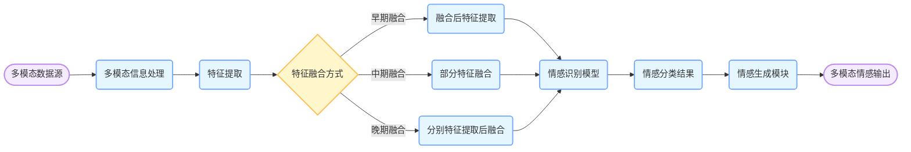

# AI Agent的多模态情感识别与生成

> 关键词：AI Agent、多模态、情感识别、情感生成、人工智能

> 摘要：本文围绕AI Agent的多模态情感识别与生成展开深入探讨。在人工智能快速发展的当下，使AI Agent能够准确识别和生成情感具有重要意义。多模态情感识别结合了文本、语音、视觉等多种信息来源，以更全面准确地理解情感；情感生成则致力于让AI Agent以自然、合适的方式表达情感。文章详细阐述了核心概念、算法原理、数学模型，通过项目实战展示代码实现与解读，介绍了实际应用场景、相关工具和资源，并对未来发展趋势与挑战进行总结，旨在为相关领域的研究和实践提供全面的参考和指导。

## 1. 背景介绍 
### 1.1 目的和范围
本文章的目的在于全面深入地研究AI Agent的多模态情感识别与生成技术。具体范围涵盖从核心概念的阐述，到相关算法原理的剖析，再到数学模型的讲解，以及通过实际项目案例展示技术的应用，最后对该领域的未来发展进行展望。通过这样的研究，希望能够帮助读者系统地了解多模态情感识别与生成的技术体系，为相关的研究和开发工作提供理论支持和实践指导。

### 1.2 预期读者
本文预期读者包括人工智能领域的研究人员、开发者、学生，以及对AI Agent和情感计算感兴趣的技术爱好者。对于研究人员，文章可以为其提供前沿的研究思路和理论参考；对于开发者，可作为技术实现的指导手册；对于学生和技术爱好者，能帮助他们建立起对多模态情感识别与生成的初步认识和理解。

### 1.3 文档结构概述
本文将按照以下结构进行阐述：首先介绍背景信息，包括目的、预期读者和文档结构概述等；接着详细讲解核心概念与联系，通过文本示意图和Mermaid流程图展示多模态情感识别与生成的原理和架构；然后深入探讨核心算法原理及具体操作步骤，并使用Python源代码进行详细阐述；再介绍相关的数学模型和公式，并举例说明；之后通过项目实战展示代码实际案例和详细解释说明；接着介绍实际应用场景；随后推荐相关的工具和资源；最后对未来发展趋势与挑战进行总结，并提供附录常见问题与解答以及扩展阅读和参考资料。

### 1.4 术语表
#### 1.4.1 核心术语定义
- **AI Agent**：人工智能代理，是能够感知环境并采取行动以实现特定目标的智能实体。
- **多模态**：指的是结合多种信息模态，如文本、语音、视觉等，以更全面地获取和处理信息。
- **情感识别**：通过对各种信息的分析和处理，判断出其中所包含的情感状态，如高兴、悲伤、愤怒等。
- **情感生成**：让AI Agent根据不同的情境和任务需求，生成合适的情感表达。

#### 1.4.2 相关概念解释
- **信息模态**：信息的不同表现形式，如文本是一种基于文字的信息模态，语音是基于声音的信息模态，视觉是基于图像或视频的信息模态。
- **特征提取**：从原始数据中提取出能够代表数据特征的信息，以便后续的分析和处理。
- **机器学习模型**：用于对数据进行学习和预测的数学模型，常见的有神经网络、决策树等。

#### 1.4.3 缩略词列表
- **CNN**：Convolutional Neural Network，卷积神经网络
- **RNN**：Recurrent Neural Network，循环神经网络
- **LSTM**：Long Short-Term Memory，长短期记忆网络
- **GRU**：Gated Recurrent Unit，门控循环单元

## 2. 核心概念与联系 

### 核心概念原理
多模态情感识别与生成是基于多模态信息融合的技术，旨在让AI Agent能够像人类一样感知和表达情感。其基本原理是通过多种传感器或数据源收集不同模态的信息，如文本信息可以通过自然语言处理技术进行分析，语音信息可以通过语音识别和声学特征提取进行处理，视觉信息可以通过图像处理和计算机视觉技术进行分析。然后将这些不同模态的信息进行融合，提取出能够反映情感状态的特征，再利用机器学习或深度学习模型进行情感识别。在情感生成方面，则是根据识别出的情感状态或预设的情感目标，结合多模态信息生成合适的情感表达，如生成带有情感色彩的文本、语音或表情动作。

### 架构的文本示意图
```plaintext
多模态数据源
|-- 文本数据源（如社交媒体帖子、聊天记录）
|-- 语音数据源（如语音通话、语音指令）
|-- 视觉数据源（如面部表情视频、肢体动作图像）

多模态信息处理模块
|-- 文本处理子模块（分词、词性标注、语义分析等）
|-- 语音处理子模块（语音识别、声学特征提取等）
|-- 视觉处理子模块（图像预处理、特征提取等）

特征融合模块
|-- 早期融合（在特征提取前进行融合）
|-- 中期融合（在特征提取过程中进行融合）
|-- 晚期融合（在特征提取后进行融合）

情感识别模型
|-- 机器学习模型（如支持向量机、随机森林）
|-- 深度学习模型（如CNN、RNN、LSTM、GRU等）

情感生成模块
|-- 文本生成子模块（生成带有情感色彩的文本）
|-- 语音生成子模块（生成带有情感的语音）
|-- 视觉生成子模块（生成带有情感的表情动作）
```

### Mermaid流程图


## 3. 核心算法原理 & 具体操作步骤 

### 文本情感分析算法 - 基于词向量的方法
#### 算法原理
基于词向量的文本情感分析方法的核心思想是将文本中的每个词转换为对应的词向量，然后通过对这些词向量进行处理和分析，得到整个文本的情感倾向。常用的词向量模型有Word2Vec、GloVe等。在得到词向量后，可以使用深度学习模型如LSTM或GRU对文本的序列信息进行建模，从而实现情感分类。

#### 具体操作步骤
1. **数据预处理**：对文本数据进行清洗，去除噪声、停用词等。
2. **词向量训练**：使用Word2Vec或GloVe等模型训练词向量。
3. **文本向量化**：将文本中的每个词转换为对应的词向量。
4. **模型构建**：构建LSTM或GRU模型。
5. **模型训练**：使用训练数据对模型进行训练。
6. **模型评估**：使用测试数据对模型进行评估。

#### Python源代码实现
```python
import numpy as np
import pandas as pd
from sklearn.model_selection import train_test_split
from tensorflow.keras.preprocessing.text import Tokenizer
from tensorflow.keras.preprocessing.sequence import pad_sequences
from tensorflow.keras.models import Sequential
from tensorflow.keras.layers import Embedding, LSTM, Dense

# 加载数据
data = pd.read_csv('text_data.csv')
texts = data['text'].values
labels = data['label'].values

# 数据预处理
tokenizer = Tokenizer()
tokenizer.fit_on_texts(texts)
sequences = tokenizer.texts_to_sequences(texts)
max_sequence_length = max([len(seq) for seq in sequences])
padded_sequences = pad_sequences(sequences, maxlen=max_sequence_length)

# 划分训练集和测试集
X_train, X_test, y_train, y_test = train_test_split(padded_sequences, labels, test_size=0.2, random_state=42)

# 构建模型
vocab_size = len(tokenizer.word_index) + 1
embedding_dim = 100
model = Sequential()
model.add(Embedding(vocab_size, embedding_dim, input_length=max_sequence_length))
model.add(LSTM(128))
model.add(Dense(1, activation='sigmoid'))

# 编译模型
model.compile(optimizer='adam', loss='binary_crossentropy', metrics=['accuracy'])

# 训练模型
model.fit(X_train, y_train, epochs=10, batch_size=32, validation_data=(X_test, y_test))

# 评估模型
loss, accuracy = model.evaluate(X_test, y_test)
print(f"Test Loss: {loss}, Test Accuracy: {accuracy}")
```

### 语音情感分析算法 - 基于声学特征的方法
#### 算法原理
语音情感分析基于声学特征的方法是通过提取语音信号中的声学特征，如音高、音长、音色等，然后使用机器学习或深度学习模型对这些特征进行分类，从而实现情感识别。常用的声学特征提取方法有MFCC（Mel频率倒谱系数）等。

#### 具体操作步骤
1. **语音信号预处理**：对语音信号进行降噪、分帧等处理。
2. **声学特征提取**：使用MFCC等方法提取声学特征。
3. **特征归一化**：对提取的特征进行归一化处理。
4. **模型构建**：构建支持向量机、随机森林或深度学习模型。
5. **模型训练**：使用训练数据对模型进行训练。
6. **模型评估**：使用测试数据对模型进行评估。

#### Python源代码实现
```python
import librosa
import numpy as np
from sklearn.model_selection import train_test_split
from sklearn.svm import SVC
from sklearn.metrics import accuracy_score

# 加载语音数据和标签
def load_audio_data(data_path, labels):
    audio_features = []
    for file_path in data_path:
        audio, sr = librosa.load(file_path)
        mfccs = librosa.feature.mfcc(y=audio, sr=sr, n_mfcc=13)
        mfccs_mean = np.mean(mfccs, axis=1)
        audio_features.append(mfccs_mean)
    return np.array(audio_features), np.array(labels)

# 示例数据路径和标签
data_path = ['audio1.wav', 'audio2.wav', ...]
labels = [0, 1, ...]

# 加载数据
X, y = load_audio_data(data_path, labels)

# 划分训练集和测试集
X_train, X_test, y_train, y_test = train_test_split(X, y, test_size=0.2, random_state=42)

# 构建支持向量机模型
model = SVC()

# 训练模型
model.fit(X_train, y_train)

# 预测
y_pred = model.predict(X_test)

# 评估模型
accuracy = accuracy_score(y_test, y_pred)
print(f"Test Accuracy: {accuracy}")
```

### 多模态信息融合算法 - 早期融合方法
#### 算法原理
早期融合方法是在特征提取前将不同模态的数据进行融合。例如，可以将文本和语音数据进行拼接，然后一起进行特征提取和后续的处理。这种方法的优点是能够充分利用不同模态之间的相关性，但缺点是不同模态的数据可能具有不同的特征尺度和分布，需要进行合适的预处理。

#### 具体操作步骤
1. **数据对齐**：确保不同模态的数据在时间或空间上对齐。
2. **数据拼接**：将不同模态的数据进行拼接。
3. **特征提取**：对拼接后的数据进行特征提取。
4. **模型构建**：构建分类或回归模型。
5. **模型训练**：使用训练数据对模型进行训练。
6. **模型评估**：使用测试数据对模型进行评估。

#### Python源代码实现
```python
import numpy as np
from sklearn.model_selection import train_test_split
from sklearn.ensemble import RandomForestClassifier
from sklearn.metrics import accuracy_score

# 示例文本特征和语音特征
text_features = np.random.rand(100, 10)
audio_features = np.random.rand(100, 5)
labels = np.random.randint(0, 2, 100)

# 早期融合
fused_features = np.hstack((text_features, audio_features))

# 划分训练集和测试集
X_train, X_test, y_train, y_test = train_test_split(fused_features, labels, test_size=0.2, random_state=42)

# 构建随机森林模型
model = RandomForestClassifier()

# 训练模型
model.fit(X_train, y_train)

# 预测
y_pred = model.predict(X_test)

# 评估模型
accuracy = accuracy_score(y_test, y_pred)
print(f"Test Accuracy: {accuracy}")
```

## 4. 数学模型和公式 & 详细讲解 & 举例说明 

### 词向量模型 - Word2Vec
#### 数学模型和公式
Word2Vec主要有两种模型：CBOW（Continuous Bag-of-Words）和Skip-gram。

- **CBOW模型**：CBOW模型的目标是根据上下文词预测中心词。其数学公式可以表示为：
$$
P(w_{t}|w_{t - c}, \cdots, w_{t - 1}, w_{t + 1}, \cdots, w_{t + c}) = \frac{\exp(u_{w_{t}}^{T}v_{context})}{\sum_{w = 1}^{V}\exp(u_{w}^{T}v_{context})}
$$
其中，$w_{t}$ 是中心词，$w_{t - c}, \cdots, w_{t - 1}, w_{t + 1}, \cdots, w_{t + c}$ 是上下文词，$v_{context}$ 是上下文词向量的平均值，$u_{w}$ 是词 $w$ 的输出向量，$V$ 是词汇表的大小。

- **Skip-gram模型**：Skip-gram模型的目标是根据中心词预测上下文词。其数学公式可以表示为：
$$
P(w_{o}|w_{i}) = \frac{\exp(u_{w_{o}}^{T}v_{w_{i}})}{\sum_{w = 1}^{V}\exp(u_{w}^{T}v_{w_{i}})}
$$
其中，$w_{i}$ 是中心词，$w_{o}$ 是上下文词，$v_{w_{i}}$ 是中心词 $w_{i}$ 的输入向量，$u_{w}$ 是词 $w$ 的输出向量，$V$ 是词汇表的大小。

#### 详细讲解
CBOW模型通过上下文词的信息来预测中心词，它将上下文词的词向量进行平均，然后通过一个线性变换和softmax函数得到中心词的概率分布。Skip-gram模型则相反，它通过中心词的信息来预测上下文词，将中心词的词向量与每个可能的上下文词的输出向量进行点积，然后通过softmax函数得到上下文词的概率分布。

#### 举例说明
假设我们有一个句子 “I like playing football”，对于CBOW模型，如果中心词是 “playing”，上下文词是 “I”、“like”、“football”，则模型会根据 “I”、“like”、“football” 的词向量来预测 “playing”。对于Skip-gram模型，如果中心词是 “playing”，则模型会根据 “playing” 的词向量来预测 “I”、“like”、“football” 等上下文词。

### 深度学习模型 - LSTM
#### 数学模型和公式
LSTM的核心是细胞状态 $C_{t}$ 和三个门：输入门 $i_{t}$、遗忘门 $f_{t}$ 和输出门 $o_{t}$。其数学公式如下：

- **遗忘门**：
$$
f_{t} = \sigma(W_{f}[h_{t - 1}, x_{t}] + b_{f})
$$
- **输入门**：
$$
i_{t} = \sigma(W_{i}[h_{t - 1}, x_{t}] + b_{i})
$$
$$
\tilde{C}_{t} = \tanh(W_{C}[h_{t - 1}, x_{t}] + b_{C})
$$
- **细胞状态更新**：
$$
C_{t} = f_{t} \odot C_{t - 1} + i_{t} \odot \tilde{C}_{t}
$$
- **输出门**：
$$
o_{t} = \sigma(W_{o}[h_{t - 1}, x_{t}] + b_{o})
$$
$$
h_{t} = o_{t} \odot \tanh(C_{t})
$$
其中，$\sigma$ 是sigmoid函数，$\tanh$ 是双曲正切函数，$W$ 是权重矩阵，$b$ 是偏置向量，$h_{t}$ 是隐藏状态，$x_{t}$ 是输入向量，$\odot$ 表示逐元素相乘。

#### 详细讲解
遗忘门决定了上一时刻的细胞状态 $C_{t - 1}$ 有多少信息需要被遗忘；输入门决定了新的信息 $\tilde{C}_{t}$ 有多少需要被添加到细胞状态中；细胞状态更新是根据遗忘门和输入门的输出对细胞状态进行更新；输出门决定了细胞状态 $C_{t}$ 有多少信息需要被输出到隐藏状态 $h_{t}$ 中。

#### 举例说明
假设我们要处理一个文本序列，每个时间步的输入 $x_{t}$ 是一个词向量。LSTM会根据当前的输入 $x_{t}$ 和上一时刻的隐藏状态 $h_{t - 1}$ 计算遗忘门、输入门和输出门的值，然后更新细胞状态 $C_{t}$ 和隐藏状态 $h_{t}$。通过这种方式，LSTM能够捕捉到文本序列中的长期依赖关系。

### 多模态信息融合 - 加权融合方法
#### 数学模型和公式
加权融合方法是将不同模态的特征进行加权求和，其数学公式可以表示为：
$$
F_{fused} = \alpha_{1}F_{1} + \alpha_{2}F_{2} + \cdots + \alpha_{n}F_{n}
$$
其中，$F_{fused}$ 是融合后的特征，$F_{i}$ 是第 $i$ 个模态的特征，$\alpha_{i}$ 是第 $i$ 个模态的权重，且 $\sum_{i = 1}^{n}\alpha_{i} = 1$。

#### 详细讲解
加权融合方法通过为不同模态的特征分配不同的权重，来综合利用不同模态的信息。权重的大小反映了该模态在融合过程中的重要性。可以通过训练或人工设置的方式来确定权重。

#### 举例说明
假设我们有文本特征 $F_{text}$ 和语音特征 $F_{audio}$，权重分别为 $\alpha_{text} = 0.6$ 和 $\alpha_{audio} = 0.4$，则融合后的特征为：
$$
F_{fused} = 0.6F_{text} + 0.4F_{audio}
$$

## 5. 项目实战：代码实际案例和详细解释说明 

### 5.1  开发环境搭建
#### 硬件环境
- **处理器**：Intel Core i7及以上
- **内存**：16GB及以上
- **硬盘**：至少500GB可用空间
- **显卡**：NVIDIA GPU（可选，用于加速深度学习训练）

#### 软件环境
- **操作系统**：Windows 10、Linux（如Ubuntu 18.04及以上）或macOS
- **Python版本**：Python 3.7及以上
- **深度学习框架**：TensorFlow 2.x或PyTorch
- **机器学习库**：scikit-learn
- **音频处理库**：librosa
- **图像处理库**：OpenCV

#### 安装步骤
1. **安装Python**：从Python官方网站下载并安装Python 3.7及以上版本。
2. **创建虚拟环境**：使用 `venv` 或 `conda` 创建虚拟环境。例如，使用 `venv` 创建虚拟环境：
```bash
python -m venv myenv
source myenv/bin/activate  # Linux/Mac
myenv\Scripts\activate  # Windows
```
3. **安装依赖库**：使用 `pip` 安装所需的库。例如：
```bash
pip install tensorflow scikit-learn librosa opencv-python
```

### 5.2  源代码详细实现和代码解读
#### 项目概述
本项目将实现一个简单的多模态情感识别系统，结合文本和语音信息进行情感识别。

#### 数据准备
假设我们有一个包含文本和语音数据的数据集，数据集中的每个样本都有对应的情感标签（如0表示消极，1表示积极）。我们需要将数据进行预处理，包括文本的分词、语音的特征提取等。

```python
import numpy as np
import pandas as pd
import librosa
from sklearn.preprocessing import LabelEncoder
from tensorflow.keras.preprocessing.text import Tokenizer
from tensorflow.keras.preprocessing.sequence import pad_sequences

# 加载文本数据
text_data = pd.read_csv('text_data.csv')
texts = text_data['text'].values
text_labels = text_data['label'].values

# 文本预处理
tokenizer = Tokenizer()
tokenizer.fit_on_texts(texts)
sequences = tokenizer.texts_to_sequences(texts)
max_sequence_length = max([len(seq) for seq in sequences])
padded_text_sequences = pad_sequences(sequences, maxlen=max_sequence_length)

# 加载语音数据
audio_files = text_data['audio_file'].values
audio_features = []
for file in audio_files:
    audio, sr = librosa.load(file)
    mfccs = librosa.feature.mfcc(y=audio, sr=sr, n_mfcc=13)
    mfccs_mean = np.mean(mfccs, axis=1)
    audio_features.append(mfccs_mean)
audio_features = np.array(audio_features)

# 标签编码
label_encoder = LabelEncoder()
encoded_labels = label_encoder.fit_transform(text_labels)
```

#### 模型构建
我们将构建一个多模态融合的深度学习模型，结合文本和语音特征进行情感识别。

```python
from tensorflow.keras.models import Model
from tensorflow.keras.layers import Input, Embedding, LSTM, Dense, Concatenate

# 文本输入
text_input = Input(shape=(max_sequence_length,))
embedding_layer = Embedding(input_dim=len(tokenizer.word_index) + 1, output_dim=100)(text_input)
lstm_layer = LSTM(128)(embedding_layer)

# 语音输入
audio_input = Input(shape=(audio_features.shape[1],))

# 特征融合
concatenated = Concatenate()([lstm_layer, audio_input])

# 输出层
output_layer = Dense(1, activation='sigmoid')(concatenated)

# 模型定义
model = Model(inputs=[text_input, audio_input], outputs=output_layer)

# 编译模型
model.compile(optimizer='adam', loss='binary_crossentropy', metrics=['accuracy'])
```

#### 模型训练
```python
from sklearn.model_selection import train_test_split

# 划分训练集和测试集
X_text_train, X_text_test, X_audio_train, X_audio_test, y_train, y_test = train_test_split(
    padded_text_sequences, audio_features, encoded_labels, test_size=0.2, random_state=42
)

# 训练模型
model.fit([X_text_train, X_audio_train], y_train, epochs=10, batch_size=32, validation_data=([X_text_test, X_audio_test], y_test))
```

### 5.3  代码解读与分析
#### 数据预处理部分
- **文本预处理**：使用 `Tokenizer` 对文本进行分词，并将文本转换为序列。然后使用 `pad_sequences` 对序列进行填充，使其长度一致。
- **语音预处理**：使用 `librosa` 库加载语音文件，并提取MFCC特征。将提取的特征进行平均，得到每个语音样本的特征向量。
- **标签编码**：使用 `LabelEncoder` 对情感标签进行编码，将字符串标签转换为数字标签。

#### 模型构建部分
- **文本输入**：使用 `Input` 层定义文本输入的形状，然后通过 `Embedding` 层将文本序列转换为词向量，再通过 `LSTM` 层对文本的序列信息进行建模。
- **语音输入**：使用 `Input` 层定义语音输入的形状。
- **特征融合**：使用 `Concatenate` 层将文本和语音特征进行拼接。
- **输出层**：使用 `Dense` 层和 `sigmoid` 激活函数进行二分类。

#### 模型训练部分
- **划分训练集和测试集**：使用 `train_test_split` 函数将数据划分为训练集和测试集。
- **训练模型**：使用 `fit` 方法对模型进行训练，指定训练数据、训练轮数、批次大小和验证数据。

## 6. 实际应用场景 
### 智能客服
在智能客服系统中，多模态情感识别与生成技术可以帮助客服更好地理解用户的情感状态。通过分析用户的文本、语音和表情等多模态信息，智能客服可以准确判断用户是高兴、不满还是疑惑等情感状态。然后根据识别结果，智能客服可以生成更加合适的回复，如对于不满的用户，使用更加温和、安抚的语言进行回应，提高用户满意度。

### 教育领域
在在线教育中，多模态情感识别技术可以实时监测学生的情感状态。例如，通过分析学生的面部表情、语音语调等，判断学生是否对课程内容感兴趣、是否遇到困难等。教师可以根据这些情感信息及时调整教学策略，如对于感到困惑的学生，提供更多的解释和指导。同时，情感生成技术可以让虚拟教师以更加生动、富有情感的方式进行教学，提高学生的学习积极性。

### 心理健康监测
多模态情感识别技术可以用于心理健康监测。通过分析用户的语音、文本和行为等多模态信息，识别用户是否存在抑郁、焦虑等心理问题的迹象。例如，分析用户的语音是否低沉、语速是否缓慢，文本中是否经常出现消极词汇等。情感生成技术可以让心理健康辅助系统生成安慰、鼓励的话语，帮助用户缓解负面情绪。

### 智能家居
在智能家居系统中，多模态情感识别与生成技术可以让家居设备更好地适应用户的情感需求。例如，当系统识别到用户处于疲惫状态时，可以自动调节灯光亮度、播放舒缓的音乐，营造舒适的环境。同时，智能音箱可以使用情感生成技术，用温柔的语音与用户交流，提供温馨的服务。

## 7. 工具和资源推荐
### 7.1 学习资源推荐
#### 7.1.1 书籍推荐
- 《深度学习》（Deep Learning）：由Ian Goodfellow、Yoshua Bengio和Aaron Courville撰写，是深度学习领域的经典教材，涵盖了深度学习的基本原理、算法和应用。
- 《Python自然语言处理》（Natural Language Processing with Python）：介绍了使用Python进行自然语言处理的基本方法和技术，包括文本处理、词法分析、句法分析等。
- 《语音信号处理》：系统地介绍了语音信号处理的基本理论、方法和技术，包括语音特征提取、语音识别、语音合成等。

#### 7.1.2 在线课程
- Coursera上的“深度学习专项课程”（Deep Learning Specialization）：由Andrew Ng教授授课，全面介绍了深度学习的各个方面，包括神经网络、卷积神经网络、循环神经网络等。
- edX上的“自然语言处理”（Natural Language Processing）：介绍了自然语言处理的基本概念、算法和应用，包括文本分类、情感分析、机器翻译等。
- Udemy上的“语音处理与语音识别”（Speech Processing and Speech Recognition）：讲解了语音信号处理和语音识别的基本原理和技术，通过实际案例进行演示。

#### 7.1.3 技术博客和网站
- Medium：有许多关于人工智能、机器学习和深度学习的技术博客，作者们会分享最新的研究成果和实践经验。
- arXiv：是一个预印本服务器，提供了大量的学术论文，涵盖了人工智能、机器学习、计算机视觉等多个领域。
- Kaggle：是一个数据科学竞赛平台，有许多关于情感识别、多模态数据处理等相关的数据集和竞赛，可以通过参与竞赛学习和实践相关技术。

### 7.2 开发工具框架推荐
#### 7.2.1 IDE和编辑器
- PyCharm：是一款专门为Python开发设计的集成开发环境，提供了丰富的功能，如代码自动完成、调试、版本控制等。
- Jupyter Notebook：是一个交互式的开发环境，适合进行数据探索、模型训练和可视化等工作。
- Visual Studio Code：是一款轻量级的代码编辑器，支持多种编程语言，有丰富的插件可以扩展功能。

#### 7.2.2 调试和性能分析工具
- TensorBoard：是TensorFlow的可视化工具，可以用于可视化模型的训练过程、损失曲线、准确率等指标，帮助调试和优化模型。
- PyTorch Profiler：是PyTorch的性能分析工具，可以分析模型的运行时间、内存使用等情况，帮助优化模型性能。
- cProfile：是Python的内置性能分析工具，可以分析Python代码的执行时间和函数调用情况，帮助找出性能瓶颈。

#### 7.2.3 相关框架和库
- TensorFlow：是一个开源的深度学习框架，提供了丰富的工具和接口，支持多种深度学习模型的构建和训练。
- PyTorch：是另一个流行的深度学习框架，具有动态计算图的特点，适合进行快速迭代和实验。
- scikit-learn：是一个用于机器学习的Python库，提供了多种机器学习算法和工具，如分类、回归、聚类等。
- librosa：是一个用于音频处理的Python库，提供了丰富的音频特征提取和处理方法。
- OpenCV：是一个开源的计算机视觉库，提供了多种图像处理和计算机视觉算法，如图像滤波、特征提取、目标检测等。

### 7.3 相关论文著作推荐
#### 7.3.1 经典论文
- “Attention Is All You Need”：提出了Transformer模型，为自然语言处理和其他领域带来了革命性的变化。
- “Long Short-Term Memory”：介绍了LSTM模型的原理和应用，是循环神经网络领域的经典论文。
- “Convolutional Neural Networks for Sentence Classification”：探讨了使用卷积神经网络进行文本分类的方法。

#### 7.3.2 最新研究成果
- 关注顶级学术会议如NeurIPS、ICML、ACL等的最新论文，了解多模态情感识别与生成领域的最新研究进展。
- 查阅相关领域的学术期刊，如Journal of Artificial Intelligence Research、ACM Transactions on Intelligent Systems and Technology等。

#### 7.3.3 应用案例分析
- 分析一些实际应用中的多模态情感识别与生成系统的案例，了解其技术实现和应用效果。例如，分析某些智能客服系统、心理健康监测系统等的相关技术文档和研究报告。

## 8. 总结：未来发展趋势与挑战
### 未来发展趋势
#### 更复杂的多模态融合
未来的多模态情感识别与生成技术将更加注重不同模态之间的深度融合。不仅仅是简单的特征拼接，而是会探索更加复杂的融合方式，如基于注意力机制的融合，能够更好地捕捉不同模态之间的交互信息，提高情感识别和生成的准确性。

#### 跨语言和跨文化的应用
随着全球化的发展，多模态情感识别与生成技术将越来越多地应用于跨语言和跨文化的场景中。需要研究不同语言和文化背景下的情感表达差异，开发出能够适应多种语言和文化的系统，提高系统的通用性和适应性。

#### 与其他技术的融合
多模态情感识别与生成技术将与其他技术如虚拟现实、增强现实、机器人技术等深度融合。例如，在虚拟现实环境中，通过多模态情感识别技术实时感知用户的情感状态，然后通过情感生成技术让虚拟角色做出相应的情感反应，增强用户的沉浸感和交互体验。

#### 个性化的情感服务
未来的系统将更加注重个性化的情感服务。根据用户的历史数据、偏好和行为模式，为每个用户提供个性化的情感识别和生成服务。例如，智能助手能够根据用户的情绪状态和个人喜好，提供更加贴心的建议和服务。

### 挑战
#### 数据的稀缺性和标注困难
多模态情感数据的收集和标注是一个挑战。不同模态的数据收集需要不同的设备和环境，而且数据的标注需要专业的知识和大量的人力。此外，情感本身具有主观性，不同的人对同一种情感的理解和标注可能存在差异，这增加了数据标注的难度。

#### 计算资源的需求
多模态情感识别与生成技术通常需要处理大量的数据和复杂的模型，对计算资源的需求较高。特别是在实时应用场景中，需要在有限的时间内完成多模态数据的处理和情感分析，对计算资源和算法的效率提出了更高的要求。

#### 隐私和安全问题
多模态情感数据包含了用户的大量个人信息，如语音、面部表情等，涉及到用户的隐私和安全问题。在数据收集、存储和处理过程中，需要采取有效的措施保护用户的隐私和数据安全，防止数据泄露和滥用。

#### 模型的可解释性
深度学习模型在多模态情感识别与生成中取得了很好的效果，但这些模型通常是黑盒模型，缺乏可解释性。在一些关键应用场景中，如心理健康监测、医疗诊断等，需要模型能够解释其决策过程和结果，以便用户能够理解和信任模型的输出。

## 9. 附录：常见问题与解答
### 1. 多模态情感识别与单模态情感识别有什么区别？
多模态情感识别结合了多种信息模态，如文本、语音、视觉等，能够更全面地获取和分析情感信息。而单模态情感识别只依赖于一种信息模态，可能会丢失一些重要的情感线索，导致识别准确率较低。例如，仅通过文本可能无法准确判断说话者的语气和情感强度，而结合语音的语调、语速等信息可以提高情感识别的准确性。

### 2. 如何选择合适的多模态融合方法？
选择合适的多模态融合方法需要考虑多个因素，如数据的特点、模型的复杂度、计算资源等。早期融合方法简单直接，能够充分利用不同模态之间的相关性，但可能存在特征尺度和分布不一致的问题；中期融合方法在特征提取过程中进行融合，能够更好地保留不同模态的特征信息；晚期融合方法在特征提取后进行融合，灵活性较高，但可能会忽略不同模态之间的交互信息。可以通过实验比较不同融合方法的效果，选择最适合的方法。

### 3. 多模态情感识别与生成技术在实际应用中存在哪些局限性？
多模态情感识别与生成技术在实际应用中存在一些局限性。例如，数据的质量和多样性可能会影响识别和生成的效果；不同模态的数据收集和处理需要不同的设备和技术，增加了系统的复杂性和成本；情感本身具有主观性和动态性，难以准确地进行识别和生成。此外，在一些复杂的场景中，如多人对话、嘈杂环境等，技术的性能可能会受到影响。

### 4. 如何提高多模态情感识别模型的性能？
可以从以下几个方面提高多模态情感识别模型的性能：
- **数据方面**：收集更多、更丰富的多模态情感数据，提高数据的质量和多样性；进行数据增强，如对语音数据进行加噪、变速等处理，对图像数据进行旋转、翻转等操作。
- **模型方面**：选择合适的模型结构和算法，如使用深度学习模型结合注意力机制；进行模型调优，如调整超参数、优化损失函数等。
- **融合方面**：探索更有效的多模态融合方法，提高不同模态信息的融合效果。

### 5. 多模态情感生成技术如何保证生成的情感表达自然合理？
为了保证多模态情感生成技术生成的情感表达自然合理，可以从以下几个方面入手：
- **数据驱动**：使用大量的自然语言文本、语音和图像数据进行训练，让模型学习到自然的情感表达方式。
- **规则约束**：制定一些规则和模板，对生成的情感表达进行约束和规范，确保其符合语言习惯和情感逻辑。
- **用户反馈**：收集用户的反馈意见，不断调整和优化生成模型，提高生成结果的质量。

## 10. 扩展阅读 & 参考资料
### 扩展阅读
- 《情感计算》（Affective Computing）：全面介绍了情感计算的理论、方法和应用，深入探讨了情感与认知、计算机技术之间的关系。
- 《人工智能：现代方法》（Artificial Intelligence: A Modern Approach）：是人工智能领域的经典教材，涵盖了人工智能的各个方面，包括知识表示、推理、机器学习、自然语言处理等。
- 《计算机视觉：算法与应用》（Computer Vision: Algorithms and Applications）：详细介绍了计算机视觉的基本算法和应用，包括图像滤波、特征提取、目标检测、图像分割等。

### 参考资料
- 相关学术论文和研究报告，如发表在NeurIPS、ICML、ACL等会议上的论文。
- 开源项目和代码库，如GitHub上的多模态情感识别与生成相关的项目。
- 相关技术博客和论坛，如Stack Overflow、Reddit等，用户可以在这些平台上交流和分享经验。

作者：AI天才研究院/AI Genius Institute & 禅与计算机程序设计艺术 /Zen And The Art of Computer Programming