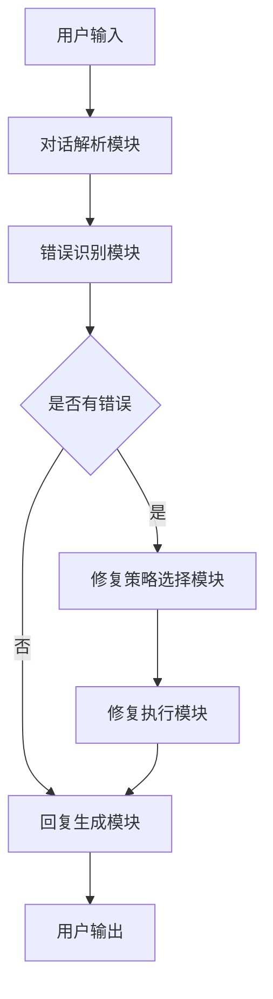

# AI Agent的对话修复：处理交互中的错误

> 关键词：AI Agent、对话修复、交互错误、自然语言处理、机器学习、对话系统、错误处理

> 摘要：本文围绕AI Agent的对话修复展开，深入探讨在交互过程中出现错误的原因、类型及处理方法。首先介绍相关背景知识，包括目的范围、预期读者等。接着阐述核心概念与联系，以清晰的文本示意图和Mermaid流程图呈现其原理架构。详细讲解核心算法原理及具体操作步骤，结合Python源代码进行说明。同时给出数学模型和公式，并举例解释。通过项目实战，展示代码实际案例及详细解读。分析实际应用场景，推荐相关工具和资源。最后总结未来发展趋势与挑战，提供常见问题解答及扩展阅读参考资料，旨在为读者全面了解AI Agent对话修复提供深度且系统的知识体系。

## 1. 背景介绍 
### 1.1 目的和范围
随着人工智能技术的不断发展，AI Agent在各个领域的应用越来越广泛，如智能客服、虚拟助手等。在与用户的交互过程中，由于各种原因，对话可能会出现错误，这会影响用户体验和AI Agent的实用性。本文的目的在于深入研究AI Agent对话中出现的错误，并探讨有效的修复方法，以提高AI Agent与用户交互的质量和效率。

本文的范围涵盖了AI Agent对话错误的分类、错误产生的原因、常见的对话修复技术和算法，以及通过实际案例展示如何在项目中实现对话修复。

### 1.2 预期读者
本文预期读者包括人工智能领域的研究人员、开发人员、对自然语言处理和对话系统感兴趣的技术爱好者，以及希望了解AI Agent交互优化方法的企业技术决策者。

### 1.3 文档结构概述
本文首先介绍背景知识，包括目的范围、预期读者等。接着阐述AI Agent对话修复的核心概念与联系，以清晰的文本示意图和Mermaid流程图呈现其原理架构。然后详细讲解核心算法原理及具体操作步骤，结合Python源代码进行说明。同时给出数学模型和公式，并举例解释。通过项目实战，展示代码实际案例及详细解读。分析实际应用场景，推荐相关工具和资源。最后总结未来发展趋势与挑战，提供常见问题解答及扩展阅读参考资料。

### 1.4 术语表
#### 1.4.1 核心术语定义
- **AI Agent**：人工智能代理，是一种能够感知环境、自主决策并执行相应动作的软件或硬件系统，在对话场景中可与用户进行交互。
- **对话修复**：指在AI Agent与用户的对话过程中，对出现的错误或异常进行识别、分析并采取相应措施进行纠正或改进，以保证对话的流畅性和正确性。
- **交互错误**：在AI Agent与用户交互过程中出现的各种问题，如理解错误、回答错误、对话中断等。

#### 1.4.2 相关概念解释
- **自然语言处理（NLP）**：是计算机科学与人工智能领域中的一个重要方向，主要研究如何让计算机理解、处理和生成人类语言，AI Agent的对话交互离不开自然语言处理技术。
- **机器学习**：是一门多领域交叉学科，涉及概率论、统计学、逼近论、凸分析、算法复杂度理论等多门学科。它专门研究计算机怎样模拟或实现人类的学习行为，以获取新的知识或技能，重新组织已有的知识结构使之不断改善自身的性能。在AI Agent对话修复中，机器学习可用于训练模型来识别和处理错误。

#### 1.4.3 缩略词列表
- **NLP**：Natural Language Processing（自然语言处理）
- **ML**：Machine Learning（机器学习）

## 2. 核心概念与联系 
### 核心概念原理
AI Agent的对话修复主要基于自然语言处理和机器学习技术。其原理是首先对用户输入的对话内容进行解析和理解，识别其中可能存在的错误。然后根据错误的类型和特征，选择合适的修复策略。修复策略可以基于规则，也可以基于机器学习模型。基于规则的方法是通过预定义的规则来处理特定类型的错误，而基于机器学习的方法则是通过训练模型来自动学习错误模式和修复方法。

### 架构的文本示意图
```plaintext
用户输入 -> 对话解析模块 -> 错误识别模块 -> 修复策略选择模块 -> 修复执行模块 -> 回复生成模块 -> 用户输出
```
- **对话解析模块**：对用户输入的对话进行语法、语义分析，将其转换为计算机可以理解的表示形式。
- **错误识别模块**：根据预定义的规则或训练好的模型，识别对话中可能存在的错误。
- **修复策略选择模块**：根据错误的类型和特征，选择合适的修复策略。
- **修复执行模块**：执行选定的修复策略，对对话进行修复。
- **回复生成模块**：根据修复后的对话内容，生成合适的回复并输出给用户。

### Mermaid流程图


## 3. 核心算法原理 & 具体操作步骤 
### 错误识别算法原理
我们可以使用基于规则的方法和机器学习方法相结合来进行错误识别。基于规则的方法适用于一些常见的、容易定义规则的错误，如语法错误、拼写错误等。机器学习方法则适用于一些复杂的、难以用规则定义的错误，如语义理解错误。

以下是一个简单的基于规则的错误识别Python代码示例：
```python
import re

# 定义一些常见的拼写错误规则
spelling_errors = {
    "teh": "the",
    "wrok": "work",
    "frend": "friend"
}

def rule_based_error_recognition(text):
    words = text.split()
    corrected_words = []
    for word in words:
        if word in spelling_errors:
            corrected_words.append(spelling_errors[word])
        else:
            corrected_words.append(word)
    return " ".join(corrected_words)

# 测试示例
text = "teh wrok is done by my frend"
corrected_text = rule_based_error_recognition(text)
print(corrected_text)
```
### 修复策略选择算法原理
根据错误的类型，我们可以选择不同的修复策略。例如，如果是拼写错误，可以直接替换为正确的单词；如果是语义理解错误，可以通过查询知识库或调用其他相关的自然语言处理模型来进行修复。

以下是一个简单的修复策略选择的Python代码示例：
```python
def choose_repair_strategy(error_type):
    if error_type == "spelling":
        return "replace_with_correct_word"
    elif error_type == "semantic":
        return "query_knowledge_base"
    else:
        return "default_strategy"

# 测试示例
error_type = "spelling"
strategy = choose_repair_strategy(error_type)
print(strategy)
```
### 具体操作步骤
1. **对话解析**：将用户输入的对话进行分词、词性标注等处理，将其转换为计算机可以理解的表示形式。
2. **错误识别**：使用基于规则的方法和机器学习方法相结合，识别对话中可能存在的错误。
3. **错误分类**：根据错误的特征，将错误分为不同的类型，如拼写错误、语法错误、语义理解错误等。
4. **修复策略选择**：根据错误的类型，选择合适的修复策略。
5. **修复执行**：执行选定的修复策略，对对话进行修复。
6. **回复生成**：根据修复后的对话内容，生成合适的回复并输出给用户。

## 4. 数学模型和公式 & 详细讲解 & 举例说明 
### 错误识别的概率模型
在机器学习中，我们可以使用概率模型来进行错误识别。假设我们有一个词序列 $w_1, w_2, \cdots, w_n$，我们可以计算每个词序列出现的概率 $P(w_1, w_2, \cdots, w_n)$。如果某个词序列出现的概率低于某个阈值 $\theta$，则认为该词序列可能存在错误。

我们可以使用语言模型来计算词序列的概率。常见的语言模型有 $n$-gram 模型，其计算公式为：
$$P(w_i|w_{i - n + 1}, \cdots, w_{i - 1}) = \frac{C(w_{i - n + 1}, \cdots, w_{i - 1}, w_i)}{C(w_{i - n + 1}, \cdots, w_{i - 1})}$$
其中，$C(w_{i - n + 1}, \cdots, w_{i - 1}, w_i)$ 表示词序列 $w_{i - n + 1}, \cdots, w_{i - 1}, w_i$ 在语料库中出现的次数，$C(w_{i - n + 1}, \cdots, w_{i - 1})$ 表示词序列 $w_{i - n + 1}, \cdots, w_{i - 1}$ 在语料库中出现的次数。

### 举例说明
假设我们有一个语料库，其中包含以下句子：
- "I like to play football"
- "She likes to sing"
- "He likes to read books"

我们使用 2-gram 模型来计算概率。例如，计算 $P(play|to)$，在语料库中，"to play" 出现了 1 次，"to" 出现了 3 次，所以 $P(play|to) = \frac{1}{3}$。

如果我们有一个输入句子 "I like to plau football"，计算 $P(plau|to)$，由于 "to plau" 在语料库中没有出现，其概率为 0，低于某个阈值（如 0.01），则认为 "plau" 可能是一个拼写错误。

### 修复策略的决策模型
在选择修复策略时，我们可以使用决策树模型。决策树是一种基于树结构进行决策的模型，每个内部节点是一个属性上的测试，每个分支是一个测试输出，每个叶节点是一个类别或值。

假设我们有以下特征来描述错误：错误类型（拼写、语法、语义）、错误位置、错误严重程度等。我们可以根据这些特征构建决策树，根据输入的错误特征来选择合适的修复策略。

## 5. 项目实战：代码实际案例和详细解释说明 
### 5.1  开发环境搭建
- **操作系统**：Windows、Linux 或 macOS 均可。
- **Python 版本**：建议使用 Python 3.7 及以上版本。
- **安装依赖库**：
    - `nltk`：用于自然语言处理，如分词、词性标注等。
    - `scikit-learn`：用于机器学习模型的训练和使用。
    - `pandas`：用于数据处理和分析。

可以使用以下命令安装依赖库：
```bash
pip install nltk scikit-learn pandas
```
### 5.2  源代码详细实现和代码解读
以下是一个完整的 AI Agent 对话修复的 Python 代码示例：
```python
import nltk
from nltk.tokenize import word_tokenize
from sklearn.tree import DecisionTreeClassifier
import pandas as pd

# 下载 nltk 数据
nltk.download('punkt')

# 定义一些常见的拼写错误规则
spelling_errors = {
    "teh": "the",
    "wrok": "work",
    "frend": "friend"
}

# 对话解析模块
def parse_dialog(text):
    tokens = word_tokenize(text)
    return tokens

# 错误识别模块（基于规则）
def rule_based_error_recognition(tokens):
    corrected_tokens = []
    for token in tokens:
        if token in spelling_errors:
            corrected_tokens.append(spelling_errors[token])
        else:
            corrected_tokens.append(token)
    return corrected_tokens

# 错误分类模块
def classify_error(tokens, corrected_tokens):
    error_types = []
    for i in range(len(tokens)):
        if tokens[i] != corrected_tokens[i]:
            error_types.append("spelling")
        else:
            error_types.append("no_error")
    return error_types

# 修复策略选择模块（使用决策树）
def train_decision_tree():
    # 示例训练数据
    data = {
        'error_type': ['spelling', 'spelling', 'no_error'],
        'error_position': [1, 3, 0],
        'severity': [1, 2, 0],
        'strategy': ['replace_with_correct_word', 'replace_with_correct_word', 'default_strategy']
    }
    df = pd.DataFrame(data)
    X = df[['error_type', 'error_position', 'severity']]
    X = pd.get_dummies(X)
    y = df['strategy']
    model = DecisionTreeClassifier()
    model.fit(X, y)
    return model

def choose_repair_strategy(model, error_type, error_position, severity):
    input_data = pd.DataFrame({
        'error_type': [error_type],
        'error_position': [error_position],
        'severity': [severity]
    })
    input_data = pd.get_dummies(input_data)
    strategy = model.predict(input_data)
    return strategy[0]

# 修复执行模块
def execute_repair_strategy(strategy, tokens, corrected_tokens):
    if strategy == "replace_with_correct_word":
        return corrected_tokens
    else:
        return tokens

# 回复生成模块
def generate_response(tokens):
    return " ".join(tokens)

# 主函数
def main():
    text = "teh wrok is done by my frend"
    # 对话解析
    tokens = parse_dialog(text)
    # 错误识别
    corrected_tokens = rule_based_error_recognition(tokens)
    # 错误分类
    error_types = classify_error(tokens, corrected_tokens)
    # 训练决策树模型
    model = train_decision_tree()
    # 选择修复策略
    strategy = choose_repair_strategy(model, error_types[0], 1, 1)
    # 执行修复策略
    repaired_tokens = execute_repair_strategy(strategy, tokens, corrected_tokens)
    # 生成回复
    response = generate_response(repaired_tokens)
    print(response)

if __name__ == "__main__":
    main()
```
### 5.3  代码解读与分析
- **对话解析模块**：使用 `nltk` 的 `word_tokenize` 函数将用户输入的对话进行分词，将其转换为词序列。
- **错误识别模块**：基于预定义的拼写错误规则，对词序列中的每个词进行检查，如果发现拼写错误，则替换为正确的单词。
- **错误分类模块**：比较原始词序列和修正后的词序列，判断每个词是否存在错误，并将错误类型分类为 "spelling" 或 "no_error"。
- **修复策略选择模块**：使用决策树模型根据错误类型、错误位置和严重程度选择合适的修复策略。
- **修复执行模块**：根据选择的修复策略，对词序列进行修复。
- **回复生成模块**：将修复后的词序列转换为句子，作为回复输出给用户。

## 6. 实际应用场景 
### 智能客服
在智能客服场景中，用户可能会输入包含拼写错误、语法错误或语义模糊的问题。AI Agent 可以通过对话修复技术，识别并修复这些错误，提高对用户问题的理解和回答的准确性。例如，用户输入 "我想咨询下你们的产品的工能"，AI Agent 可以识别出 "工能" 是 "功能" 的拼写错误，并进行修复，然后准确回答用户的问题。

### 虚拟助手
虚拟助手在与用户交互时，也可能遇到各种错误。通过对话修复，虚拟助手可以更好地理解用户的意图，提供更准确的服务。例如，用户说 "打开音乐播放气"，虚拟助手可以识别出 "音乐播放气" 是 "音乐播放器" 的错误表述，然后执行打开音乐播放器的操作。

### 智能教育系统
在智能教育系统中，学生的输入可能存在错误。AI Agent 可以通过对话修复技术，帮助学生纠正错误，提高学习效果。例如，学生在回答问题时输入 "我认为这个定理是正却的"，系统可以识别出 "正却" 是 "正确" 的拼写错误，并引导学生正确理解和回答问题。

## 7. 工具和资源推荐
### 7.1 学习资源推荐
#### 7.1.1 书籍推荐
- 《自然语言处理入门》：这本书系统地介绍了自然语言处理的基本概念、方法和技术，适合初学者入门。
- 《机器学习》：周志华教授的这本书被称为“西瓜书”，全面介绍了机器学习的基本原理和算法，对于理解AI Agent对话修复中的机器学习算法有很大帮助。
- 《深度学习》：这本书由 Ian Goodfellow、Yoshua Bengio 和 Aaron Courville 合著，深入探讨了深度学习的理论和实践，对于了解深度学习在自然语言处理中的应用有重要意义。

#### 7.1.2 在线课程
- Coursera 上的“Natural Language Processing Specialization”：由斯坦福大学的教授授课，系统地介绍了自然语言处理的各个方面，包括词法分析、句法分析、语义理解等。
- edX 上的“Artificial Intelligence”：该课程全面介绍了人工智能的基本概念、方法和技术，对于了解AI Agent的整体架构和原理有很大帮助。

#### 7.1.3 技术博客和网站
- Medium 上的“Towards Data Science”：这是一个专注于数据科学和人工智能的技术博客，上面有很多关于自然语言处理和AI Agent的优秀文章。
- arXiv.org：这是一个开放的学术预印本平台，上面有很多最新的自然语言处理和人工智能的研究论文。

### 7.2 开发工具框架推荐
#### 7.2.1 IDE和编辑器
- PyCharm：这是一个专业的 Python 集成开发环境，提供了丰富的代码编辑、调试和测试功能，非常适合开发AI Agent对话修复相关的项目。
- Visual Studio Code：这是一个轻量级的代码编辑器，支持多种编程语言，有丰富的插件可以扩展功能，也可以用于开发Python项目。

#### 7.2.2 调试和性能分析工具
- PDB：Python 自带的调试工具，可以帮助开发者定位代码中的问题。
- cProfile：Python 标准库中的性能分析工具，可以分析代码的运行时间和函数调用关系，帮助开发者优化代码性能。

#### 7.2.3 相关框架和库
- NLTK：自然语言处理工具包，提供了丰富的自然语言处理功能，如分词、词性标注、命名实体识别等。
- SpaCy：另一个流行的自然语言处理库，具有高效、易用的特点，适合处理大规模的自然语言数据。
- TensorFlow：一个开源的机器学习框架，提供了丰富的深度学习模型和工具，可用于训练自然语言处理模型。

### 7.3 相关论文著作推荐
#### 7.3.1 经典论文
- “A Statistical Approach to Machine Translation”：这篇论文提出了基于统计的机器翻译方法，对于自然语言处理中的翻译和理解有重要影响。
- “Efficient Estimation of Word Representations in Vector Space”：这篇论文介绍了 Word2Vec 模型，该模型可以将单词表示为向量，在自然语言处理中得到了广泛应用。

#### 7.3.2 最新研究成果
- 关注 ACL（Association for Computational Linguistics）会议和 EMNLP（Conference on Empirical Methods in Natural Language Processing）会议上的最新研究成果，这些会议是自然语言处理领域的顶级学术会议，上面有很多关于AI Agent对话修复的最新研究。

#### 7.3.3 应用案例分析
- 一些知名企业的技术博客，如 Google AI Blog、Microsoft AI Blog 等，会分享他们在AI Agent和自然语言处理方面的应用案例和实践经验，可以从中学习到很多实用的技术和方法。

## 8. 总结：未来发展趋势与挑战
### 未来发展趋势
- **多模态融合**：未来的AI Agent对话修复将不仅仅局限于文本信息，还会融合语音、图像等多模态信息。例如，在用户语音输入中可能存在发音不准确的问题，结合图像信息可以更好地理解用户的意图，进行更准确的对话修复。
- **强化学习的应用**：强化学习可以让AI Agent在与用户的交互过程中不断学习和优化对话修复策略。通过奖励机制，AI Agent可以自动调整修复策略，提高对话修复的效果和效率。
- **个性化修复**：根据用户的历史对话记录、偏好和习惯，为每个用户提供个性化的对话修复服务。例如，对于某个用户经常出现的特定类型的错误，AI Agent可以自动进行更准确的修复。

### 挑战
- **复杂语义理解**：自然语言的语义非常复杂，存在很多歧义、隐喻等现象。准确理解用户的语义是对话修复的关键，但目前的技术还难以完全解决复杂语义理解的问题。
- **数据质量和规模**：机器学习模型的训练需要大量高质量的数据。获取和标注大规模的对话数据是一个挑战，而且数据的质量也会直接影响模型的性能。
- **实时性要求**：在一些实时对话场景中，如智能客服的在线聊天，AI Agent需要在短时间内完成对话修复和回复生成。如何在保证修复效果的前提下，提高系统的实时性是一个需要解决的问题。

## 9. 附录：常见问题与解答
### 问题1：如何提高基于规则的错误识别的准确性？
答：可以不断收集和整理常见的错误规则，扩大规则库。同时，可以结合自然语言处理的其他技术，如词性标注、句法分析等，更准确地判断错误。

### 问题2：机器学习模型在对话修复中的训练数据如何获取？
答：可以通过以下几种方式获取训练数据：1. 收集真实的用户对话记录，并进行标注；2. 利用公开的语料库进行数据扩充；3. 人工生成一些模拟的错误数据。

### 问题3：如何处理对话中的语义理解错误？
答：可以使用知识图谱、预训练语言模型等技术来辅助语义理解。知识图谱可以提供丰富的知识信息，帮助AI Agent更好地理解用户的意图；预训练语言模型可以学习到语言的语义表示，提高语义理解的准确性。

## 10. 扩展阅读 & 参考资料
- Jurafsky, D., & Martin, J. H. (2022). Speech and Language Processing (3rd ed. draft).
- Goodfellow, I., Bengio, Y., & Courville, A. (2016). Deep Learning. MIT Press.
- 周志华. (2016). 机器学习. 清华大学出版社.

作者：AI天才研究院/AI Genius Institute & 禅与计算机程序设计艺术 /Zen And The Art of Computer Programming