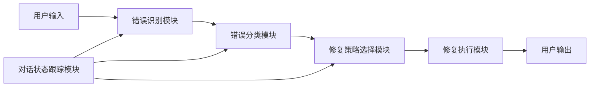

# AI Agent的对话修复：处理交互中的错误

> 关键词：AI Agent、对话修复、交互错误处理、自然语言处理、机器学习

> 摘要：本文围绕AI Agent在对话交互中出现的错误处理展开深入探讨。首先介绍了相关背景，包括目的、预期读者等内容。接着阐述了核心概念，如AI Agent对话修复的原理与架构，并以示意图和流程图辅助说明。详细讲解了核心算法原理，结合Python代码展示具体操作步骤，同时给出数学模型和公式并举例说明。通过项目实战，包括开发环境搭建、源代码实现与解读，让读者了解如何在实际中应用对话修复技术。分析了实际应用场景，推荐了学习资源、开发工具框架和相关论文著作。最后总结了未来发展趋势与挑战，提供常见问题解答及扩展阅读参考资料，旨在帮助读者全面掌握AI Agent对话修复技术。

## 1. 背景介绍 
### 1.1 目的和范围
随着人工智能技术的飞速发展，AI Agent在各种对话系统中得到了广泛应用，如智能客服、语音助手等。然而，在实际对话交互过程中，由于用户输入的多样性、语言的歧义性以及AI Agent自身的局限性，不可避免地会出现各种错误，如理解错误、回答不准确等。本文章的目的在于深入探讨如何对AI Agent在对话交互中出现的错误进行有效的修复，提高对话系统的性能和用户体验。

文章的范围涵盖了AI Agent对话修复的核心概念、算法原理、数学模型、项目实战、实际应用场景以及相关的工具和资源推荐等方面，旨在为读者提供一个全面且深入的关于AI Agent对话修复的知识体系。

### 1.2 预期读者
本文预期读者主要包括人工智能领域的研究人员、开发人员、软件工程师、数据科学家等，他们对自然语言处理、对话系统开发等方面有一定的了解和兴趣，希望深入学习和掌握AI Agent对话修复技术。同时，对于对人工智能技术感兴趣的爱好者，也可以通过本文初步了解该领域的相关知识。

### 1.3 文档结构概述
本文将按照以下结构进行详细阐述：
- 核心概念与联系：介绍AI Agent对话修复的核心概念、原理和架构，并通过文本示意图和Mermaid流程图进行直观展示。
- 核心算法原理 & 具体操作步骤：详细讲解AI Agent对话修复的核心算法原理，并使用Python源代码进行具体操作步骤的阐述。
- 数学模型和公式 & 详细讲解 & 举例说明：给出AI Agent对话修复相关的数学模型和公式，并进行详细讲解和举例说明。
- 项目实战：通过实际案例，介绍开发环境搭建、源代码详细实现和代码解读，帮助读者将理论知识应用到实际项目中。
- 实际应用场景：分析AI Agent对话修复技术在不同领域的实际应用场景。
- 工具和资源推荐：推荐学习资源、开发工具框架和相关论文著作，方便读者进一步深入学习。
- 总结：未来发展趋势与挑战：总结AI Agent对话修复技术的未来发展趋势，并分析可能面临的挑战。
- 附录：常见问题与解答：提供常见问题的解答，帮助读者解决在学习和实践过程中遇到的问题。
- 扩展阅读 & 参考资料：提供扩展阅读的建议和相关参考资料，供读者进一步深入研究。

### 1.4 术语表
#### 1.4.1 核心术语定义
- **AI Agent**：人工智能代理，是一种能够感知环境、进行决策并采取行动以实现特定目标的软件实体。在对话系统中，AI Agent负责与用户进行交互，理解用户的输入并生成相应的回复。
- **对话修复**：指在AI Agent与用户的对话交互过程中，对出现的错误进行识别和纠正，以提高对话的质量和准确性。
- **自然语言处理（NLP）**：是人工智能的一个重要分支，主要研究如何让计算机理解、处理和生成自然语言。在AI Agent对话修复中，NLP技术用于对用户输入的文本进行分析和理解。
- **机器学习**：是一门多领域交叉学科，涉及概率论、统计学、逼近论、凸分析、算法复杂度理论等多门学科。它专门研究计算机怎样模拟或实现人类的学习行为，以获取新的知识或技能，重新组织已有的知识结构使之不断改善自身的性能。在AI Agent对话修复中，机器学习算法用于训练模型，以提高对话修复的能力。

#### 1.4.2 相关概念解释
- **对话状态跟踪**：在对话交互过程中，记录和维护当前对话的状态信息，包括用户的历史输入、AI Agent的历史回复、当前话题等。对话状态跟踪对于理解对话的上下文和进行准确的对话修复至关重要。
- **错误类型**：在AI Agent对话交互中，常见的错误类型包括理解错误（如误解用户的意图）、回答不准确（如提供的信息与用户需求不符）、生成错误（如生成的回复语法错误或语义不合理）等。
- **修复策略**：针对不同类型的错误，采取不同的修复策略，如重新理解用户意图、调整回答内容、纠正生成错误等。

#### 1.4.3 缩略词列表
- **NLP**：Natural Language Processing（自然语言处理）
- **ML**：Machine Learning（机器学习）
- **RNN**：Recurrent Neural Network（循环神经网络）
- **LSTM**：Long Short-Term Memory（长短期记忆网络）
- **GRU**：Gated Recurrent Unit（门控循环单元）

## 2. 核心概念与联系 
### 核心概念原理
AI Agent的对话修复主要基于对对话交互过程中错误的识别和纠正。其核心原理包括以下几个方面：
- **错误识别**：通过对用户输入和AI Agent回复的分析，识别出可能存在的错误。这可以基于规则、机器学习模型或两者结合的方式进行。例如，基于规则的方法可以定义一些常见的错误模式，如语法错误、语义矛盾等；机器学习模型可以通过训练大量的对话数据，学习到不同类型错误的特征，从而进行错误识别。
- **错误分类**：将识别出的错误进行分类，以便采取不同的修复策略。常见的错误分类包括理解错误、回答不准确、生成错误等。
- **修复策略选择**：根据错误的类型和对话的上下文，选择合适的修复策略。例如，对于理解错误，可以重新对用户的输入进行分析和理解；对于回答不准确，可以调整回答的内容或提供更多的信息；对于生成错误，可以纠正生成的回复。
- **修复执行**：根据选择的修复策略，对AI Agent的回复进行修复，并将修复后的回复返回给用户。

### 架构的文本示意图
```plaintext
用户输入 ---> 错误识别模块 ---> 错误分类模块 ---> 修复策略选择模块 ---> 修复执行模块 ---> 用户输出
|                                                           ^
|                                                           |
+----------------------- 对话状态跟踪模块 ---------------------+
```
在这个架构中，用户输入首先进入错误识别模块，该模块对输入进行分析，识别出可能存在的错误。然后，错误分类模块将错误进行分类。修复策略选择模块根据错误类型和对话状态跟踪模块提供的上下文信息，选择合适的修复策略。修复执行模块根据选择的策略对AI Agent的回复进行修复，并将修复后的回复输出给用户。对话状态跟踪模块记录和维护对话的状态信息，为错误识别、分类和修复策略选择提供上下文支持。

### Mermaid流程图


## 3. 核心算法原理 & 具体操作步骤 
### 核心算法原理
在AI Agent的对话修复中，常用的算法包括基于规则的算法和基于机器学习的算法。这里我们重点介绍基于机器学习的算法，以循环神经网络（RNN）及其变体长短期记忆网络（LSTM）和门控循环单元（GRU）为例。

RNN是一种能够处理序列数据的神经网络，它通过在不同时间步之间共享参数，能够捕捉序列中的时间依赖关系。然而，传统的RNN存在梯度消失或梯度爆炸的问题，导致难以处理长序列数据。LSTM和GRU是为了解决这个问题而提出的改进版本。

LSTM通过引入门控机制，能够有效地控制信息的流动，从而解决了梯度消失的问题。它包含输入门、遗忘门和输出门，分别用于控制新信息的输入、旧信息的遗忘和输出信息的选择。

GRU是LSTM的一种简化版本，它只包含更新门和重置门，减少了参数数量，计算效率更高。

### 具体操作步骤及Python源代码
以下是一个使用Python和PyTorch库实现基于LSTM的对话修复模型的示例代码：

```python
import torch
import torch.nn as nn
import torch.optim as optim

# 定义LSTM模型
class LSTMModel(nn.Module):
    def __init__(self, input_size, hidden_size, output_size):
        super(LSTMModel, self).__init__()
        self.hidden_size = hidden_size
        self.lstm = nn.LSTM(input_size, hidden_size)
        self.fc = nn.Linear(hidden_size, output_size)

    def forward(self, input):
        lstm_out, _ = self.lstm(input.view(len(input), 1, -1))
        output = self.fc(lstm_out.view(len(input), -1))
        return output

# 初始化模型参数
input_size = 10
hidden_size = 20
output_size = 10
model = LSTMModel(input_size, hidden_size, output_size)

# 定义损失函数和优化器
criterion = nn.MSELoss()
optimizer = optim.SGD(model.parameters(), lr=0.01)

# 生成一些示例数据
input_data = torch.randn(5, input_size)
target_data = torch.randn(5, output_size)

# 训练模型
for epoch in range(100):
    optimizer.zero_grad()
    output = model(input_data)
    loss = criterion(output, target_data)
    loss.backward()
    optimizer.step()
    if epoch % 10 == 0:
        print(f'Epoch {epoch}, Loss: {loss.item()}')
```

在这个示例中，我们首先定义了一个LSTM模型，包含一个LSTM层和一个全连接层。然后，我们初始化模型参数、定义损失函数和优化器。接着，我们生成了一些示例数据，并进行了100个epoch的训练。在每个epoch中，我们计算模型的输出，计算损失，进行反向传播和参数更新。最后，我们每10个epoch打印一次损失值。

## 4. 数学模型和公式 & 详细讲解 & 举例说明 
### 数学模型
在基于LSTM的对话修复模型中，LSTM单元的数学模型可以用以下公式表示：

#### 遗忘门
$$f_t = \sigma(W_f[h_{t-1}, x_t] + b_f)$$
其中，$f_t$ 是遗忘门的输出，$\sigma$ 是sigmoid函数，$W_f$ 是遗忘门的权重矩阵，$h_{t-1}$ 是上一个时间步的隐藏状态，$x_t$ 是当前时间步的输入，$b_f$ 是遗忘门的偏置。遗忘门的作用是决定上一个时间步的哪些信息需要被遗忘。

#### 输入门
$$i_t = \sigma(W_i[h_{t-1}, x_t] + b_i)$$
$$\tilde{C}_t = \tanh(W_C[h_{t-1}, x_t] + b_C)$$
其中，$i_t$ 是输入门的输出，$\tilde{C}_t$ 是候选记忆单元，$W_i$ 和 $W_C$ 分别是输入门和候选记忆单元的权重矩阵，$b_i$ 和 $b_C$ 分别是输入门和候选记忆单元的偏置。输入门的作用是决定当前时间步的哪些新信息需要被加入到记忆单元中。

#### 记忆单元更新
$$C_t = f_t \odot C_{t-1} + i_t \odot \tilde{C}_t$$
其中，$C_t$ 是当前时间步的记忆单元，$\odot$ 表示逐元素相乘。记忆单元的更新是通过遗忘门控制上一个时间步的记忆单元的遗忘，以及输入门控制当前时间步的新信息的加入来实现的。

#### 输出门
$$o_t = \sigma(W_o[h_{t-1}, x_t] + b_o)$$
$$h_t = o_t \odot \tanh(C_t)$$
其中，$o_t$ 是输出门的输出，$h_t$ 是当前时间步的隐藏状态，$W_o$ 是输出门的权重矩阵，$b_o$ 是输出门的偏置。输出门的作用是决定当前时间步的哪些信息需要被输出。

### 详细讲解
遗忘门通过sigmoid函数将输入映射到 $[0, 1]$ 之间，输出值越接近1表示保留的信息越多，越接近0表示遗忘的信息越多。输入门同样使用sigmoid函数，决定新信息的加入程度，候选记忆单元使用tanh函数将输入映射到 $[-1, 1]$ 之间。记忆单元的更新是通过逐元素相乘和相加来实现的，确保信息的合理传递。输出门通过sigmoid函数控制记忆单元中哪些信息需要被输出，最终输出的隐藏状态通过逐元素相乘和tanh函数进行处理。

### 举例说明
假设我们有一个简单的对话修复任务，输入是一个单词序列，我们希望模型能够预测每个单词的下一个可能的单词。我们可以将每个单词表示为一个向量，作为LSTM的输入。在第一个时间步，输入为 $x_1$，上一个时间步的隐藏状态 $h_0$ 初始化为零向量。遗忘门根据输入 $[h_0, x_1]$ 计算输出 $f_1$，决定是否遗忘上一个时间步的信息（这里由于 $h_0$ 为零向量，实际上没有信息需要遗忘）。输入门计算 $i_1$ 和 $\tilde{C}_1$，决定当前时间步的新信息的加入程度。记忆单元更新为 $C_1 = f_1 \odot C_0 + i_1 \odot \tilde{C}_1$，由于 $C_0$ 为零向量，实际上 $C_1 = i_1 \odot \tilde{C}_1$。输出门计算 $o_1$，并得到当前时间步的隐藏状态 $h_1 = o_1 \odot \tanh(C_1)$。最后，通过全连接层将 $h_1$ 映射到输出空间，得到预测的下一个单词的概率分布。

## 5. 项目实战：代码实际案例和详细解释说明 
### 5.1  开发环境搭建
#### 操作系统
建议使用Linux或Windows操作系统，这里以Ubuntu 20.04为例进行说明。

#### Python环境
安装Python 3.7或更高版本，可以使用以下命令进行安装：
```bash
sudo apt update
sudo apt install python3 python3-pip
```

#### 依赖库安装
安装项目所需的依赖库，包括PyTorch、NLTK等，可以使用以下命令进行安装：
```bash
pip install torch torchvision nltk
```

### 5.2  源代码详细实现和代码解读
以下是一个完整的基于LSTM的对话修复项目的源代码示例：

```python
import torch
import torch.nn as nn
import torch.optim as optim
import nltk
from nltk.tokenize import word_tokenize
from collections import Counter

# 数据预处理
def preprocess(text):
    tokens = word_tokenize(text.lower())
    return tokens

# 构建词汇表
def build_vocab(tokens):
    counter = Counter(tokens)
    vocab = sorted(counter, key=counter.get, reverse=True)
    word2idx = {word: idx for idx, word in enumerate(vocab)}
    idx2word = {idx: word for idx, word in enumerate(vocab)}
    return word2idx, idx2word

# 数据转换
def text_to_indices(text, word2idx):
    tokens = preprocess(text)
    indices = [word2idx[word] for word in tokens if word in word2idx]
    return torch.tensor(indices, dtype=torch.long)

# 定义LSTM模型
class LSTMModel(nn.Module):
    def __init__(self, vocab_size, embedding_dim, hidden_dim, output_dim):
        super(LSTMModel, self).__init__()
        self.embedding = nn.Embedding(vocab_size, embedding_dim)
        self.lstm = nn.LSTM(embedding_dim, hidden_dim)
        self.fc = nn.Linear(hidden_dim, output_dim)

    def forward(self, input):
        embedded = self.embedding(input)
        lstm_out, _ = self.lstm(embedded.view(len(input), 1, -1))
        output = self.fc(lstm_out.view(len(input), -1))
        return output

# 训练模型
def train_model(model, input_data, target_data, epochs, lr):
    criterion = nn.CrossEntropyLoss()
    optimizer = optim.Adam(model.parameters(), lr=lr)

    for epoch in range(epochs):
        optimizer.zero_grad()
        output = model(input_data)
        loss = criterion(output, target_data)
        loss.backward()
        optimizer.step()
        if epoch % 10 == 0:
            print(f'Epoch {epoch}, Loss: {loss.item()}')

# 示例数据
text = "This is a sample sentence for dialogue repair."
tokens = preprocess(text)
word2idx, idx2word = build_vocab(tokens)
input_text = "This is a sample"
input_indices = text_to_indices(input_text, word2idx)
target_text = "sentence for dialogue repair."
target_indices = text_to_indices(target_text, word2idx)

# 初始化模型
vocab_size = len(word2idx)
embedding_dim = 100
hidden_dim = 200
output_dim = vocab_size
model = LSTMModel(vocab_size, embedding_dim, hidden_dim, output_dim)

# 训练模型
train_model(model, input_indices, target_indices, epochs=100, lr=0.001)
```

### 5.3  代码解读与分析
#### 数据预处理
`preprocess` 函数使用NLTK的 `word_tokenize` 函数将输入文本进行分词，并将所有单词转换为小写。

#### 构建词汇表
`build_vocab` 函数使用 `Counter` 类统计每个单词的出现频率，然后根据频率对单词进行排序，构建单词到索引和索引到单词的映射。

#### 数据转换
`text_to_indices` 函数将输入文本转换为对应的索引序列，以便输入到模型中。

#### 定义LSTM模型
`LSTMModel` 类继承自 `nn.Module`，包含一个嵌入层、一个LSTM层和一个全连接层。嵌入层将输入的索引序列转换为向量表示，LSTM层处理序列数据，全连接层将LSTM层的输出映射到词汇表大小的输出空间。

#### 训练模型
`train_model` 函数定义了损失函数和优化器，使用交叉熵损失函数和Adam优化器进行模型训练。在每个epoch中，计算模型的输出，计算损失，进行反向传播和参数更新。

#### 示例数据和模型训练
我们使用一个简单的示例文本进行数据处理和模型训练。首先将文本进行预处理，构建词汇表，然后将输入文本和目标文本转换为索引序列。最后初始化模型并进行训练。

## 6. 实际应用场景 
### 智能客服
在智能客服系统中，AI Agent需要与用户进行对话，解答用户的问题。然而，由于用户问题的多样性和复杂性，AI Agent可能会出现理解错误或回答不准确的情况。对话修复技术可以帮助智能客服系统识别和纠正这些错误，提高回答的准确性和质量，从而提升用户体验。例如，当用户询问“你们公司的产品有哪些售后服务？”，如果AI Agent误解为“你们公司的产品有哪些”，对话修复技术可以识别出这个理解错误，并重新对用户的问题进行分析和理解，给出关于售后服务的准确回答。

### 语音助手
语音助手如Siri、小爱同学等，通过语音交互与用户进行沟通。在语音识别过程中，可能会出现识别错误，导致AI Agent接收到的文本信息不准确。对话修复技术可以对这些错误进行识别和纠正，提高语音助手的交互效果。例如，当用户说“打开我的音乐播放器”，语音识别可能将“音乐播放器”误识别为“游戏播放器”，对话修复技术可以识别出这个错误，并纠正AI Agent的理解，打开正确的音乐播放器应用。

### 聊天机器人
聊天机器人用于与用户进行自然流畅的对话。在对话过程中，聊天机器人可能会生成一些不合理或不准确的回复。对话修复技术可以对这些生成错误进行修复，使聊天机器人的回复更加合理和准确。例如，当用户询问“今天天气怎么样？”，聊天机器人回复“我喜欢吃苹果”，对话修复技术可以识别出这个回复与用户问题不相关的错误，并重新生成一个关于天气的回复。

### 智能教育
在智能教育系统中，AI Agent可以与学生进行交互，解答学生的问题，提供学习指导。然而，学生的问题可能具有一定的专业性和复杂性，AI Agent可能会出现回答不准确或不完整的情况。对话修复技术可以帮助智能教育系统识别和纠正这些错误，为学生提供更准确、更详细的学习指导。例如，当学生询问“如何证明勾股定理？”，如果AI Agent的回答不完整或存在错误，对话修复技术可以对回答进行修正和补充，帮助学生更好地理解和掌握相关知识。

## 7. 工具和资源推荐
### 7.1 学习资源推荐
#### 7.1.1 书籍推荐
- 《深度学习》（Deep Learning）：由Ian Goodfellow、Yoshua Bengio和Aaron Courville所著，是深度学习领域的经典教材，涵盖了深度学习的基本概念、算法和应用，对于理解AI Agent对话修复的相关技术有很大的帮助。
- 《自然语言处理入门》（Natural Language Processing with Python）：由Steven Bird、Ewan Klein和Edward Loper所著，详细介绍了自然语言处理的基本技术和方法，包括分词、词性标注、句法分析等，是学习自然语言处理的入门好书。
- 《Python自然语言处理实战：核心技术与算法》：由何晗所著，结合Python语言和实际案例，介绍了自然语言处理的核心技术和算法，对于使用Python进行AI Agent对话修复的开发有很大的参考价值。

#### 7.1.2 在线课程
- Coursera上的“深度学习专项课程”（Deep Learning Specialization）：由Andrew Ng教授主讲，包括深度学习基础、卷积神经网络、循环神经网络等多个课程，对于深入学习深度学习技术非常有帮助。
- edX上的“自然语言处理”（Natural Language Processing）：由哥伦比亚大学的教授主讲，系统地介绍了自然语言处理的理论和实践，包括文本分类、情感分析、机器翻译等内容。
- 哔哩哔哩上有很多关于人工智能和自然语言处理的免费视频教程，例如“刘二大人的PyTorch深度学习入门教程”，对于初学者来说是一个很好的学习资源。

#### 7.1.3 技术博客和网站
- Medium：是一个技术博客平台，上面有很多关于人工智能、自然语言处理和AI Agent的技术文章，例如Towards Data Science专栏，经常发布一些高质量的技术文章和研究成果。
- arXiv：是一个预印本论文库，提供了大量关于人工智能和自然语言处理的最新研究论文，可以及时了解该领域的最新动态和研究进展。
- GitHub：是一个开源代码托管平台，上面有很多关于AI Agent对话修复的开源项目，可以学习和参考他人的代码实现。

### 7.2 开发工具框架推荐
#### 7.2.1 IDE和编辑器
- PyCharm：是一款专门为Python开发设计的集成开发环境（IDE），具有代码自动补全、调试、版本控制等功能，非常适合Python开发。
- Jupyter Notebook：是一个基于Web的交互式计算环境，可以在浏览器中编写和运行Python代码，同时可以添加文本说明和可视化图表，非常适合进行数据探索和模型实验。
- Visual Studio Code：是一款轻量级的代码编辑器，支持多种编程语言和插件扩展，具有丰富的代码编辑和调试功能，也可以用于Python开发。

#### 7.2.2 调试和性能分析工具
- PyTorch Debugger（PDB）：是Python自带的调试工具，可以用于调试PyTorch代码。通过设置断点、查看变量值等功能，可以帮助开发者快速定位和解决代码中的问题。
- TensorBoard：是TensorFlow提供的一个可视化工具，也可以用于PyTorch项目。它可以可视化模型的训练过程、损失函数的变化、模型的结构等信息，帮助开发者更好地理解和优化模型。
- cProfile：是Python的一个性能分析工具，可以分析代码的运行时间和函数调用次数，帮助开发者找出代码中的性能瓶颈。

#### 7.2.3 相关框架和库
- PyTorch：是一个开源的深度学习框架，提供了丰富的神经网络层和优化算法，支持GPU加速，非常适合进行深度学习模型的开发和训练。
- NLTK：是一个自然语言处理工具包，提供了分词、词性标注、句法分析、情感分析等多种自然语言处理任务的工具和数据集，方便开发者进行自然语言处理任务的开发。
- SpaCy：是另一个流行的自然语言处理库，具有高效的处理速度和丰富的语言模型，支持多种语言的处理，适用于大规模自然语言处理任务。

### 7.3 相关论文著作推荐
#### 7.3.1 经典论文
- “Long Short-Term Memory”（Sepp Hochreiter和Jürgen Schmidhuber，1997）：介绍了长短期记忆网络（LSTM）的基本原理和结构，是深度学习领域的经典论文之一。
- “Gated Recurrent Unit”（Kyunghyun Cho等人，2014）：提出了门控循环单元（GRU），是对LSTM的一种简化和改进。
- “Attention Is All You Need”（Ashish Vaswani等人，2017）：提出了Transformer模型，引入了注意力机制，在自然语言处理领域取得了巨大的成功。

#### 7.3.2 最新研究成果
- 可以关注每年的自然语言处理领域的顶级会议，如ACL（Association for Computational Linguistics）、EMNLP（Conference on Empirical Methods in Natural Language Processing）等，这些会议上会发表很多关于AI Agent对话修复的最新研究成果。
- 一些知名的学术期刊，如Journal of Artificial Intelligence Research（JAIR）、Artificial Intelligence等，也会发表相关的高质量研究论文。

#### 7.3.3 应用案例分析
- 可以参考一些实际应用案例的论文，了解AI Agent对话修复技术在不同领域的应用情况和效果。例如，一些关于智能客服系统、语音助手等的论文，会详细介绍如何使用对话修复技术提高系统的性能和用户体验。

## 8. 总结：未来发展趋势与挑战
### 未来发展趋势
#### 多模态融合
未来的AI Agent对话修复技术将不仅仅局限于文本信息，还会融合语音、图像、视频等多模态信息。例如，在智能客服系统中，用户可以通过语音、图片等多种方式提出问题，AI Agent需要综合处理这些多模态信息，进行准确的错误识别和修复。多模态融合可以提高AI Agent对用户意图的理解能力，从而提升对话修复的效果。

#### 强化学习的应用
强化学习是一种通过智能体与环境进行交互，不断尝试不同的动作以获得最大奖励的学习方法。在AI Agent对话修复中，强化学习可以用于优化修复策略的选择。通过设置合适的奖励函数，让AI Agent在与用户的对话交互中不断学习，选择最优的修复策略，提高对话修复的效率和质量。

#### 个性化修复
不同的用户有不同的语言习惯和需求，未来的AI Agent对话修复技术将更加注重个性化。AI Agent可以根据用户的历史对话记录、偏好等信息，为每个用户提供个性化的对话修复服务。例如，对于经常使用特定词汇和表达方式的用户，AI Agent可以更好地理解他们的意图，更准确地进行错误修复。

#### 与知识图谱的结合
知识图谱是一种将实体和实体之间的关系以图形化方式表示的知识库。将AI Agent对话修复技术与知识图谱相结合，可以让AI Agent在对话过程中利用知识图谱中的丰富知识，更好地理解用户的问题，进行更准确的错误修复。例如，当用户询问关于某个历史事件的问题时，AI Agent可以通过知识图谱获取相关的历史背景知识，提高回答的准确性。

### 挑战
#### 复杂语义理解
自然语言具有丰富的语义和歧义性，理解用户输入的复杂语义仍然是一个巨大的挑战。特别是在一些专业领域，如医学、法律等，语言的专业性和复杂性更高，AI Agent很难准确理解用户的意图，从而导致错误识别和修复的难度增加。

#### 数据不足
训练高质量的AI Agent对话修复模型需要大量的标注数据。然而，在实际应用中，获取足够的标注数据往往是困难的。特别是对于一些特定领域或新出现的问题，数据的收集和标注成本很高，这限制了模型的性能和应用范围。

#### 实时性要求
在一些实时对话场景中，如语音助手、智能客服等，对AI Agent的响应时间有很高的要求。对话修复需要在短时间内完成，否则会影响用户体验。然而，复杂的错误识别和修复算法往往需要较长的计算时间，如何在保证修复效果的同时满足实时性要求是一个亟待解决的问题。

#### 伦理和安全问题
随着AI Agent在各个领域的广泛应用，伦理和安全问题也日益凸显。例如，AI Agent的错误回复可能会误导用户，甚至造成严重的后果。如何确保AI Agent的对话修复技术符合伦理和安全标准，避免出现不良影响，是未来需要关注的重要问题。

## 9. 附录：常见问题与解答
### 问题1：如何选择合适的错误识别方法？
答：选择合适的错误识别方法需要考虑多个因素，如数据规模、错误类型、应用场景等。如果数据规模较小，可以考虑使用基于规则的方法，通过定义一些常见的错误模式来进行错误识别。如果数据规模较大，可以使用机器学习模型，如神经网络、决策树等，通过训练大量的数据来学习错误的特征。同时，还可以结合规则和机器学习的方法，提高错误识别的准确性。

### 问题2：如何处理未登录词（OOV）？
答：未登录词是指在训练数据中未出现过的词。处理未登录词的方法有很多种，常见的方法包括使用字符级别的模型、引入外部词典、使用词嵌入的方法等。字符级别的模型可以将单词拆分为字符序列进行处理，从而能够处理未登录词。引入外部词典可以将未登录词映射到已知的词汇上。使用词嵌入的方法可以将未登录词的词向量通过与已知词的词向量进行相似性计算来得到。

### 问题3：如何评估对话修复模型的性能？
答：评估对话修复模型的性能可以使用多种指标，如准确率、召回率、F1值等。准确率表示模型正确修复的错误占所有修复尝试的比例，召回率表示模型正确修复的错误占所有实际错误的比例，F1值是准确率和召回率的调和平均值。此外，还可以使用人工评估的方法，通过让人类评估者对模型的修复结果进行打分，来评估模型的性能。

### 问题4：如何提高对话修复模型的泛化能力？
答：提高对话修复模型的泛化能力可以从多个方面入手。首先，增加训练数据的多样性，包括不同类型的错误、不同领域的对话等，让模型能够学习到更广泛的知识。其次，使用正则化技术，如L1和L2正则化、Dropout等，防止模型过拟合。此外，还可以进行模型融合，将多个不同的模型进行组合，提高模型的泛化能力。

## 10. 扩展阅读 & 参考资料
### 扩展阅读
- 《人工智能：一种现代的方法》（Artificial Intelligence: A Modern Approach）：全面介绍了人工智能的各个领域，包括知识表示、推理、学习、规划等，对于深入理解AI Agent的工作原理和技术有很大的帮助。
- 《深度学习实战》（Deep Learning in Practice）：通过实际案例介绍了深度学习的应用，包括图像识别、自然语言处理、语音识别等，对于将AI Agent对话修复技术应用到实际项目中有很好的参考价值。
- 《自然语言处理实战：基于深度学习的方法》（Natural Language Processing in Action: Understanding, Analyzing, and Generating Text with Python）：结合Python代码和实际案例，介绍了自然语言处理的深度学习方法，包括循环神经网络、卷积神经网络、Transformer等，对于学习和实践AI Agent对话修复技术有很大的帮助。

### 参考资料
- 相关的学术论文和研究报告，可以从学术数据库如IEEE Xplore、ACM Digital Library等获取。
- 开源项目和代码库，如GitHub上的相关项目，可以学习和参考他人的代码实现。
- 官方文档和教程，如PyTorch、NLTK、SpaCy等框架和库的官方文档，是学习和使用这些工具的重要参考资料。

作者：AI天才研究院/AI Genius Institute & 禅与计算机程序设计艺术 /Zen And The Art of Computer Programming