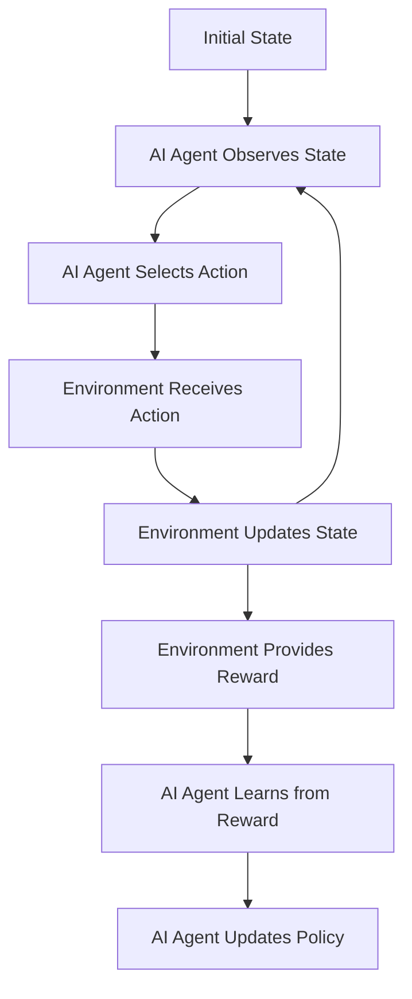

# AI Agent的强化学习在游戏AI中的进阶应用

> 关键词：AI Agent、强化学习、游戏AI、进阶应用、马尔可夫决策过程

> 摘要：本文深入探讨了AI Agent的强化学习在游戏AI中的进阶应用。首先介绍了相关背景知识，包括目的范围、预期读者等。接着详细阐述了核心概念，如AI Agent和强化学习的原理及架构。通过Python代码解释了核心算法原理和具体操作步骤，同时给出了数学模型和公式并举例说明。在项目实战部分，提供了开发环境搭建、源代码实现及解读。还分析了实际应用场景，推荐了学习资源、开发工具框架和相关论文著作。最后总结了未来发展趋势与挑战，并提供常见问题解答和扩展阅读参考资料，旨在为相关领域的研究者和开发者提供全面而深入的技术指导。

## 1. 背景介绍 
### 1.1 目的和范围
本文章的主要目的是深入探讨AI Agent的强化学习在游戏AI中的进阶应用。随着人工智能技术的不断发展，强化学习在游戏领域展现出了巨大的潜力。从早期简单的游戏策略到如今复杂的大型游戏场景，AI Agent的强化学习技术正不断推动着游戏AI的发展。我们将涵盖从基础概念到实际应用的各个方面，包括核心算法原理、数学模型、项目实战以及未来发展趋势等，旨在为读者提供一个全面而深入的技术视角。

### 1.2 预期读者
本文预期读者包括人工智能、机器学习和游戏开发领域的研究者、开发者，以及对游戏AI技术感兴趣的学生和爱好者。无论是想要深入了解强化学习在游戏中的应用原理，还是希望将这些技术应用到实际项目中的人员，都能从本文中获得有价值的信息。

### 1.3 文档结构概述
本文将按照以下结构进行组织：首先介绍相关背景知识，包括目的范围、预期读者等；接着详细阐述核心概念，如AI Agent和强化学习的原理及架构；通过Python代码解释核心算法原理和具体操作步骤，同时给出数学模型和公式并举例说明；在项目实战部分，提供开发环境搭建、源代码实现及解读；还会分析实际应用场景，推荐学习资源、开发工具框架和相关论文著作；最后总结未来发展趋势与挑战，并提供常见问题解答和扩展阅读参考资料。

### 1.4 术语表
#### 1.4.1 核心术语定义
- **AI Agent**：是一种能够感知环境、做出决策并执行动作的智能实体。在游戏中，AI Agent可以是游戏角色、NPC等，它通过与游戏环境进行交互来实现特定的目标。
- **强化学习**：是一种机器学习方法，智能体（Agent）通过与环境进行交互，根据环境反馈的奖励信号来学习最优的行为策略，以最大化长期累积奖励。
- **游戏AI**：指在游戏中使用人工智能技术来实现智能决策和行为的系统，它可以控制游戏角色的行动、策略制定等，提高游戏的趣味性和挑战性。

#### 1.4.2 相关概念解释
- **马尔可夫决策过程（MDP）**：是强化学习的理论基础，它描述了一个智能体在环境中的决策过程。MDP由状态集合、动作集合、状态转移概率、奖励函数和折扣因子组成。智能体在每个时间步根据当前状态选择一个动作，环境根据状态转移概率转移到下一个状态，并给予智能体一个奖励。
- **策略（Policy）**：是智能体在每个状态下选择动作的规则。策略可以是确定性的，即对于每个状态只选择一个特定的动作；也可以是随机性的，即对于每个状态以一定的概率选择不同的动作。
- **价值函数（Value Function）**：用于评估在某个状态或状态 - 动作对下的长期累积奖励。价值函数可以帮助智能体判断不同状态和动作的优劣，从而选择最优的策略。

#### 1.4.3 缩略词列表
- **MDP**：Markov Decision Process（马尔可夫决策过程）
- **Q - learning**：一种无模型的强化学习算法，用于学习最优的动作价值函数Q(s, a)。
- **DQN**：Deep Q - Network（深度Q网络），是将深度学习与Q - learning相结合的算法，用于处理高维状态空间的强化学习问题。

## 2. 核心概念与联系 

### 核心概念原理
#### AI Agent
AI Agent是一个能够感知环境、做出决策并执行动作的智能实体。在游戏环境中，AI Agent可以看作是游戏角色或NPC。它通过传感器（如视觉、听觉等）感知游戏环境的状态，然后根据内部的决策机制选择合适的动作，并通过执行器（如移动、攻击等）在游戏中执行这些动作。

#### 强化学习
强化学习是一种通过智能体与环境进行交互来学习最优行为策略的机器学习方法。智能体在每个时间步观察环境的状态，选择一个动作并执行，环境根据智能体的动作转移到下一个状态，并给予智能体一个奖励。智能体的目标是通过不断地与环境交互，学习到一个最优的策略，使得长期累积奖励最大化。

### 架构的文本示意图
```plaintext
+----------------+          +----------------+          +----------------+
|    Environment | <------> |    AI Agent    | <------> |  Reward Signal |
+----------------+          +----------------+          +----------------+
      |                          |                          |
      |                          |                          |
      V                          V                          V
  State Space                Action Space               Reward Function
```
在这个架构中，环境和AI Agent之间进行交互。环境提供状态给AI Agent，AI Agent根据状态选择动作并执行，环境根据动作更新状态并返回奖励信号给AI Agent。状态空间包含了环境所有可能的状态，动作空间包含了AI Agent所有可能的动作，奖励函数用于评估AI Agent的动作对实现目标的贡献。

### Mermaid流程图

该流程图展示了AI Agent在强化学习过程中的基本交互流程。从初始状态开始，AI Agent观察环境状态，选择动作并执行，环境根据动作更新状态并给予奖励，AI Agent根据奖励进行学习并更新策略，然后继续观察新的状态，循环进行。

## 3. 核心算法原理 & 具体操作步骤 

### Q - learning算法原理
Q - learning是一种无模型的强化学习算法，用于学习最优的动作价值函数Q(s, a)，其中s表示状态，a表示动作。Q(s, a)表示在状态s下执行动作a的长期累积奖励。Q - learning的核心思想是通过不断地更新Q值，使得Q值逐渐逼近最优的动作价值函数。

Q - learning的更新公式如下：
$$Q(s_t, a_t) \leftarrow Q(s_t, a_t) + \alpha [r_{t+1} + \gamma \max_{a} Q(s_{t+1}, a) - Q(s_t, a_t)]$$
其中：
- $s_t$ 表示当前状态
- $a_t$ 表示当前动作
- $r_{t+1}$ 表示执行动作 $a_t$ 后获得的奖励
- $s_{t+1}$ 表示执行动作 $a_t$ 后转移到的下一个状态
- $\alpha$ 是学习率，控制每次更新的步长
- $\gamma$ 是折扣因子，用于权衡当前奖励和未来奖励的重要性

### Python源代码实现
```python
import numpy as np

# 定义Q - learning类
class QLearningAgent:
    def __init__(self, state_space_size, action_space_size, learning_rate=0.1, discount_factor=0.9):
        self.state_space_size = state_space_size
        self.action_space_size = action_space_size
        self.learning_rate = learning_rate
        self.discount_factor = discount_factor
        # 初始化Q表
        self.q_table = np.zeros((state_space_size, action_space_size))

    def choose_action(self, state, epsilon=0.1):
        # epsilon - greedy策略
        if np.random.uniform(0, 1) < epsilon:
            # 随机选择动作
            action = np.random.choice(self.action_space_size)
        else:
            # 选择Q值最大的动作
            action = np.argmax(self.q_table[state, :])
        return action

    def learn(self, state, action, reward, next_state):
        # Q - learning更新公式
        predict = self.q_table[state, action]
        target = reward + self.discount_factor * np.max(self.q_table[next_state, :])
        self.q_table[state, action] = self.q_table[state, action] + self.learning_rate * (target - predict)


# 示例使用
state_space_size = 10
action_space_size = 4
agent = QLearningAgent(state_space_size, action_space_size)

# 模拟交互过程
current_state = 0
for _ in range(100):
    action = agent.choose_action(current_state)
    # 模拟环境反馈
    next_state = np.random.randint(0, state_space_size)
    reward = np.random.randint(-1, 2)
    agent.learn(current_state, action, reward, next_state)
    current_state = next_state
```
### 具体操作步骤
1. **初始化**：初始化Q表，将所有Q值初始化为0。同时设置学习率 $\alpha$ 和折扣因子 $\gamma$。
2. **选择动作**：在每个时间步，AI Agent根据当前状态 $s_t$ 选择一个动作 $a_t$。可以使用epsilon - greedy策略，以一定的概率 $\epsilon$ 随机选择动作，以 $1 - \epsilon$ 的概率选择Q值最大的动作。
3. **执行动作并获取奖励**：AI Agent执行选择的动作 $a_t$，环境根据动作更新状态到 $s_{t+1}$，并给予AI Agent一个奖励 $r_{t+1}$。
4. **更新Q值**：根据Q - learning更新公式更新Q表中 $(s_t, a_t)$ 对应的Q值。
5. **重复步骤2 - 4**：不断重复上述步骤，直到达到终止条件（如达到最大时间步数或达到目标状态）。

## 4. 数学模型和公式 & 详细讲解 & 举例说明 

### 马尔可夫决策过程（MDP）
马尔可夫决策过程是强化学习的理论基础，它可以用一个五元组 $(S, A, P, R, \gamma)$ 来表示，其中：
- $S$ 是状态集合，表示环境所有可能的状态。
- $A$ 是动作集合，表示AI Agent所有可能的动作。
- $P(s'|s, a)$ 是状态转移概率，表示在状态 $s$ 下执行动作 $a$ 后转移到状态 $s'$ 的概率。
- $R(s, a, s')$ 是奖励函数，表示在状态 $s$ 下执行动作 $a$ 并转移到状态 $s'$ 时获得的奖励。
- $\gamma$ 是折扣因子，用于权衡当前奖励和未来奖励的重要性，取值范围为 $[0, 1]$。

### 价值函数
#### 状态价值函数 $V^{\pi}(s)$
状态价值函数 $V^{\pi}(s)$ 表示在策略 $\pi$ 下，从状态 $s$ 开始的长期累积奖励的期望：
$$V^{\pi}(s) = \mathbb{E}_{\pi} \left[ \sum_{t=0}^{\infty} \gamma^t r_{t+1} \big| s_0 = s \right]$$
其中，$\mathbb{E}_{\pi}$ 表示在策略 $\pi$ 下的期望。

#### 动作价值函数 $Q^{\pi}(s, a)$
动作价值函数 $Q^{\pi}(s, a)$ 表示在策略 $\pi$ 下，从状态 $s$ 执行动作 $a$ 后的长期累积奖励的期望：
$$Q^{\pi}(s, a) = \mathbb{E}_{\pi} \left[ \sum_{t=0}^{\infty} \gamma^t r_{t+1} \big| s_0 = s, a_0 = a \right]$$

### 贝尔曼方程
#### 状态价值函数的贝尔曼方程
$$V^{\pi}(s) = \sum_{a \in A} \pi(a|s) \left[ R(s, a) + \gamma \sum_{s' \in S} P(s'|s, a) V^{\pi}(s') \right]$$
该方程表示在策略 $\pi$ 下，状态 $s$ 的价值等于在该状态下所有可能动作的期望奖励加上下一个状态的折扣价值。

#### 动作价值函数的贝尔曼方程
$$Q^{\pi}(s, a) = R(s, a) + \gamma \sum_{s' \in S} P(s'|s, a) \sum_{a' \in A} \pi(a'|s') Q^{\pi}(s', a')$$
该方程表示在策略 $\pi$ 下，状态 - 动作对 $(s, a)$ 的价值等于执行该动作获得的奖励加上下一个状态 - 动作对的折扣价值。

### 举例说明
考虑一个简单的网格世界游戏，游戏环境是一个 $3 \times 3$ 的网格，AI Agent的目标是从左上角的起始位置移动到右下角的目标位置。状态集合 $S$ 包含网格中所有可能的位置，动作集合 $A = \{上, 下, 左, 右\}$。奖励函数设置为：到达目标位置获得奖励 +10，撞到墙壁获得奖励 -1，其他情况获得奖励 0。

假设折扣因子 $\gamma = 0.9$，初始状态 $s_0$ 为左上角位置。如果AI Agent选择向右移动，根据状态转移概率转移到下一个状态 $s_1$，并获得奖励 $r_1 = 0$。可以使用Q - learning算法更新Q值，逐步学习到最优的策略。

## 5. 项目实战：代码实际案例和详细解释说明 

### 5.1  开发环境搭建
#### 安装Python
首先需要安装Python，建议使用Python 3.7及以上版本。可以从Python官方网站（https://www.python.org/downloads/）下载安装包，按照安装向导进行安装。

#### 安装必要的库
在本项目中，我们需要使用一些Python库，如NumPy、OpenAI Gym等。可以使用以下命令进行安装：
```sh
pip install numpy gym
```
OpenAI Gym是一个用于开发和比较强化学习算法的工具包，它提供了许多不同类型的游戏环境，方便我们进行实验和测试。

### 5.2  源代码详细实现和代码解读
```python
import gym
import numpy as np

# 创建游戏环境
env = gym.make('FrozenLake-v1')

# 获取状态空间和动作空间的大小
state_space_size = env.observation_space.n
action_space_size = env.action_space.n

# 初始化Q表
q_table = np.zeros((state_space_size, action_space_size))

# 定义超参数
total_episodes = 15000        # 总训练回合数
learning_rate = 0.8           # 学习率
max_steps = 99                # 每个回合的最大步数
gamma = 0.95                  # 折扣因子

# 探索率相关参数
epsilon = 1.0                 # 初始探索率
max_epsilon = 1.0             # 最大探索率
min_epsilon = 0.01            # 最小探索率
decay_rate = 0.005            # 探索率衰减率

# 存储每个回合的奖励
rewards = []

# 训练循环
for episode in range(total_episodes):
    # 重置环境
    state = env.reset()
    step = 0
    done = False
    total_rewards = 0
    
    for step in range(max_steps):
        # epsilon - greedy策略选择动作
        exp_exp_tradeoff = np.random.uniform(0, 1)
        
        if exp_exp_tradeoff > epsilon:
            # 选择Q值最大的动作
            action = np.argmax(q_table[state, :])
        else:
            # 随机选择动作
            action = env.action_space.sample()
        
        # 执行动作
        new_state, reward, done, info = env.step(action)
        
        # Q - learning更新公式
        q_table[state, action] = q_table[state, action] + learning_rate * (reward + gamma * np.max(q_table[new_state, :]) - q_table[state, action])
        
        total_rewards = total_rewards + reward
        state = new_state
        
        if done == True: 
            break
    
    # 降低探索率
    epsilon = min_epsilon + (max_epsilon - min_epsilon)*np.exp(-decay_rate*episode)
    rewards.append(total_rewards)

print ("Score over time: " +  str(sum(rewards)/total_episodes))
print(q_table)

# 测试训练好的策略
env.reset()

for episode in range(5):
    state = env.reset()
    step = 0
    done = False
    print("****************************************************")
    print("EPISODE ", episode)

    for step in range(max_steps):
        env.render()
        # 选择Q值最大的动作
        action = np.argmax(q_table[state, :])
        
        new_state, reward, done, info = env.step(action)
        
        if done:
            break
        state = new_state
env.close()
```
### 代码解读与分析
#### 环境创建
```python
env = gym.make('FrozenLake-v1')
```
使用OpenAI Gym创建一个FrozenLake游戏环境。FrozenLake是一个简单的网格世界游戏，AI Agent需要在冰面上移动，避免掉入冰洞，最终到达目标位置。

#### Q表初始化
```python
q_table = np.zeros((state_space_size, action_space_size))
```
将Q表初始化为全零矩阵，其中 `state_space_size` 是状态空间的大小，`action_space_size` 是动作空间的大小。

#### 超参数设置
```python
total_episodes = 15000
learning_rate = 0.8
max_steps = 99
gamma = 0.95
epsilon = 1.0
max_epsilon = 1.0
min_epsilon = 0.01
decay_rate = 0.005
```
设置总训练回合数、学习率、每个回合的最大步数、折扣因子、探索率等超参数。探索率随着训练回合数的增加而逐渐衰减，使得AI Agent在训练初期更多地进行探索，后期更多地利用已学习到的知识。

#### 训练循环
```python
for episode in range(total_episodes):
    #...
    for step in range(max_steps):
        #...
        q_table[state, action] = q_table[state, action] + learning_rate * (reward + gamma * np.max(q_table[new_state, :]) - q_table[state, action])
        #...
```
在每个训练回合中，AI Agent根据epsilon - greedy策略选择动作，执行动作并获取奖励，然后使用Q - learning更新公式更新Q表。

#### 测试阶段
```python
for episode in range(5):
    state = env.reset()
    step = 0
    done = False
    for step in range(max_steps):
        env.render()
        action = np.argmax(q_table[state, :])
        new_state, reward, done, info = env.step(action)
        if done:
            break
        state = new_state
```
在测试阶段，AI Agent使用训练好的Q表选择Q值最大的动作，观察其在游戏环境中的表现。

## 6. 实际应用场景 
### 竞技类游戏
在竞技类游戏中，如《英雄联盟》《Dota 2》等，AI Agent的强化学习可以用于训练智能的游戏策略。通过与不同的对手进行对战，AI Agent可以学习到最优的英雄选择、技能释放时机、团队协作策略等。例如，在《英雄联盟》中，AI Agent可以根据当前游戏状态（如双方英雄的血量、等级、位置等）选择合适的技能释放和团队进攻/防守策略，提高游戏胜率。

### 策略类游戏
策略类游戏，如《文明》系列、《三国志》系列等，需要玩家制定长期的战略规划。AI Agent的强化学习可以帮助游戏AI学习到不同的战略策略，如资源管理、城市建设、军事扩张等。例如，在《文明》游戏中，AI Agent可以学习到如何根据不同的地形和资源分布，合理规划城市的建设和发展，以实现国家的繁荣和扩张。

### 角色扮演类游戏
在角色扮演类游戏中，如《塞尔达传说》《最终幻想》等，AI Agent的强化学习可以用于实现更加智能的NPC行为。NPC可以根据玩家的行为和游戏环境的变化，做出不同的反应和决策。例如，在《塞尔达传说》中，NPC可以学习到如何根据玩家的对话和行为，提供不同的任务和帮助，增加游戏的交互性和趣味性。

### 体育类游戏
体育类游戏，如《FIFA》《NBA 2K》等，AI Agent的强化学习可以用于训练更加真实和智能的球员行为。AI Agent可以学习到不同的战术策略、球员跑位和传球时机等。例如，在《FIFA》游戏中，AI Agent可以根据对手的防守布局，选择合适的进攻战术，如长传冲吊、短传渗透等，提高球队的进攻效率。

## 7. 工具和资源推荐
### 7.1 学习资源推荐
#### 7.1.1 书籍推荐
- 《强化学习：原理与Python实现》：本书系统地介绍了强化学习的基本原理和算法，并通过Python代码实现了各种强化学习算法，适合初学者入门。
- 《深度学习》：由Ian Goodfellow、Yoshua Bengio和Aaron Courville三位深度学习领域的专家撰写，全面介绍了深度学习的理论和应用，其中也包含了强化学习的相关内容。
- 《人工智能：一种现代的方法》：是人工智能领域的经典教材，涵盖了人工智能的各个方面，包括搜索算法、机器学习、自然语言处理等，对强化学习也有详细的介绍。

#### 7.1.2 在线课程
- Coursera上的“强化学习专项课程”：由UC Berkeley的Pieter Abbeel教授等人授课，系统地介绍了强化学习的理论和实践，包括动态规划、蒙特卡罗方法、时序差分学习等内容。
- edX上的“深度强化学习”：由DeepMind的David Silver教授授课，深入讲解了深度强化学习的算法和应用，如DQN、A3C、PPO等。
- OpenAI Gym官方文档和教程：OpenAI Gym提供了丰富的文档和教程，帮助用户快速上手使用Gym进行强化学习实验。

#### 7.1.3 技术博客和网站
- OpenAI官方博客：OpenAI是人工智能领域的领先研究机构，其官方博客会发布最新的研究成果和技术文章，包括强化学习在各个领域的应用。
- DeepMind官方博客：DeepMind在强化学习领域取得了许多重要的研究成果，其官方博客会分享相关的研究论文和技术经验。
- Medium上的强化学习相关文章：Medium上有许多机器学习和人工智能领域的专家分享强化学习的技术文章和实践经验，可以从中获取到最新的研究动态和实用技巧。

### 7.2 开发工具框架推荐
#### 7.2.1 IDE和编辑器
- PyCharm：是一款专门为Python开发设计的集成开发环境（IDE），具有强大的代码编辑、调试、自动补全、代码分析等功能，适合开发大型的Python项目。
- Jupyter Notebook：是一个交互式的开发环境，支持Python、R等多种编程语言。可以方便地进行代码编写、运行和可视化展示，非常适合进行数据探索和机器学习实验。
- Visual Studio Code：是一款轻量级的代码编辑器，支持多种编程语言和插件扩展。它具有丰富的代码编辑功能和调试功能，同时可以通过安装Python扩展来进行Python开发。

#### 7.2.2 调试和性能分析工具
- TensorBoard：是TensorFlow提供的一个可视化工具，可以用于可视化训练过程中的各种指标，如损失函数、准确率、梯度等。通过TensorBoard可以直观地观察模型的训练情况，帮助调试和优化模型。
- Py-Spy：是一个用于分析Python程序性能的工具，可以实时监控Python程序的CPU使用率、函数调用时间等信息，帮助找出程序中的性能瓶颈。
- cProfile：是Python标准库中的一个性能分析模块，可以用于分析Python程序中各个函数的调用时间和调用次数，帮助优化代码性能。

#### 7.2.3 相关框架和库
- TensorFlow：是一个开源的机器学习框架，由Google开发。它提供了丰富的深度学习模型和工具，支持分布式训练和部署。在强化学习中，可以使用TensorFlow构建深度Q网络（DQN）、策略梯度算法等。
- PyTorch：是另一个流行的深度学习框架，由Facebook开发。它具有动态计算图的特点，易于使用和调试。在强化学习中，PyTorch也被广泛应用于构建各种强化学习模型。
- Stable Baselines：是一个基于OpenAI Gym和TensorFlow/PyTorch的强化学习库，提供了一系列预训练的强化学习算法和工具，方便用户快速实现和测试强化学习算法。

### 7.3 相关论文著作推荐
#### 7.3.1 经典论文
- “Playing Atari with Deep Reinforcement Learning”：由DeepMind团队发表，提出了深度Q网络（DQN）算法，首次将深度学习与强化学习相结合，在Atari游戏上取得了很好的效果。
- “Policy Gradient Methods for Reinforcement Learning with Function Approximation”：介绍了策略梯度算法的基本原理和方法，为基于策略梯度的强化学习算法奠定了基础。
- “Asynchronous Methods for Deep Reinforcement Learning”：提出了异步优势演员 - 评论家（A3C）算法，通过异步训练的方式提高了强化学习算法的训练效率。

#### 7.3.2 最新研究成果
- 每年在NeurIPS、ICML、AAAI等顶级人工智能会议上都会有大量关于强化学习的最新研究成果发表，可以关注这些会议的论文集，了解最新的研究动态。
- arXiv是一个预印本平台，许多研究人员会在上面发布自己的最新研究成果。可以在arXiv上搜索强化学习相关的论文，获取最新的研究进展。

#### 7.3.3 应用案例分析
- 《Deep Reinforcement Learning Hands-On》：书中包含了许多强化学习在不同领域的应用案例，如游戏、机器人、自动驾驶等，通过实际案例分析帮助读者理解强化学习的应用场景和实现方法。
- 各大科技公司的技术博客和研究报告，如Google、Microsoft、OpenAI等公司会分享他们在强化学习领域的应用案例和实践经验，可以从中学习到实际项目中的技术和方法。

## 8. 总结：未来发展趋势与挑战
### 未来发展趋势
#### 多智能体强化学习
随着游戏的复杂性不断增加，多智能体强化学习将成为未来游戏AI的重要发展方向。在多智能体环境中，多个AI Agent需要相互协作或竞争，以实现共同的目标或最大化自身的利益。例如，在大型多人在线游戏中，多个AI Agent可以组成团队进行合作对战，或者在竞技游戏中进行对抗。多智能体强化学习可以学习到更加复杂的策略和行为模式，提高游戏的趣味性和挑战性。

#### 结合深度学习和强化学习
深度学习和强化学习的结合将进一步推动游戏AI的发展。深度学习可以用于处理高维的游戏状态信息，如图像、语音等，而强化学习可以用于学习最优的游戏策略。例如，通过使用卷积神经网络（CNN）处理游戏画面，将其作为强化学习的输入，让AI Agent学习到更加直观和有效的游戏策略。

#### 基于模拟环境的训练
为了提高AI Agent的学习效率和泛化能力，基于模拟环境的训练将成为未来的趋势。可以构建高度逼真的游戏模拟环境，让AI Agent在模拟环境中进行大量的训练，然后将训练好的模型应用到实际游戏中。模拟环境可以提供更加丰富的训练数据和多样化的场景，帮助AI Agent学习到更加鲁棒的策略。

### 挑战
#### 计算资源需求
强化学习算法通常需要大量的计算资源进行训练，特别是在处理复杂的游戏环境和高维的状态空间时。随着游戏的复杂度不断增加，对计算资源的需求也会越来越高。如何在有限的计算资源下提高强化学习算法的训练效率，是一个亟待解决的问题。

#### 数据收集和标注
在强化学习中，数据收集和标注是一个重要的环节。但是在游戏环境中，数据的收集和标注往往比较困难。例如，在一些实时战略游戏中，游戏状态的变化非常复杂，很难手动标注数据。如何自动收集和标注高质量的游戏数据，是提高强化学习算法性能的关键。

#### 可解释性和安全性
强化学习模型通常是一个黑盒模型，很难解释其决策过程和行为原因。在游戏AI中，可解释性是一个重要的问题，特别是在一些竞技游戏中，玩家需要了解AI Agent的决策过程，以便更好地进行对抗。此外，强化学习模型的安全性也是一个挑战，如何避免AI Agent学习到不良的行为策略，保证游戏的公平性和安全性，是需要解决的问题。

## 9. 附录：常见问题与解答
### Q1：强化学习和监督学习有什么区别？
A1：监督学习是一种有监督的机器学习方法，需要提供大量的输入 - 输出对作为训练数据，模型的目标是学习输入和输出之间的映射关系。而强化学习是一种无监督的机器学习方法，智能体通过与环境进行交互，根据环境反馈的奖励信号来学习最优的行为策略，不需要提供明确的输入 - 输出对。

### Q2：Q - learning和DQN有什么区别？
A2：Q - learning是一种传统的强化学习算法，使用Q表来存储状态 - 动作对的Q值。当状态空间和动作空间非常大时，Q表的存储和更新会变得非常困难。DQN是将深度学习与Q - learning相结合的算法，使用深度神经网络来近似Q值函数，能够处理高维的状态空间，避免了Q表的存储问题。

### Q3：如何选择合适的学习率和折扣因子？
A3：学习率控制每次更新的步长，学习率过大可能导致算法无法收敛，学习率过小则会导致学习速度过慢。通常可以通过实验来选择合适的学习率，一般取值范围在0.1 - 0.001之间。折扣因子用于权衡当前奖励和未来奖励的重要性，折扣因子越接近1，表示越重视未来奖励；折扣因子越接近0，表示越重视当前奖励。通常可以根据具体的问题来选择合适的折扣因子，一般取值范围在0.9 - 0.99之间。

### Q4：如何评估强化学习模型的性能？
A4：可以使用多种指标来评估强化学习模型的性能，如累积奖励、胜率、平均步数等。累积奖励表示智能体在一个回合或多个回合中获得的总奖励，累积奖励越高表示模型的性能越好。胜率适用于竞技类游戏，表示智能体在多次对战中获胜的比例。平均步数表示智能体在每个回合中完成任务所需的平均步数，平均步数越少表示模型的效率越高。

## 10. 扩展阅读 & 参考资料
### 扩展阅读
- 《Reinforcement Learning: Theory and Algorithms》：深入介绍了强化学习的理论和算法，包括动态规划、蒙特卡罗方法、时序差分学习等内容，适合对强化学习理论感兴趣的读者。
- 《Game AI Pro》系列书籍：专注于游戏AI的实践和应用，包含了许多游戏AI领域的专家分享的技术和经验，适合游戏开发者和研究者阅读。

### 参考资料
- OpenAI Gym官方文档：https://gym.openai.com/docs/
- TensorFlow官方文档：https://www.tensorflow.org/api_docs
- PyTorch官方文档：https://pytorch.org/docs/stable/index.html
- Stable Baselines官方文档：https://stable-baselines.readthedocs.io/en/master/

作者：AI天才研究院/AI Genius Institute & 禅与计算机程序设计艺术 /Zen And The Art of Computer Programming