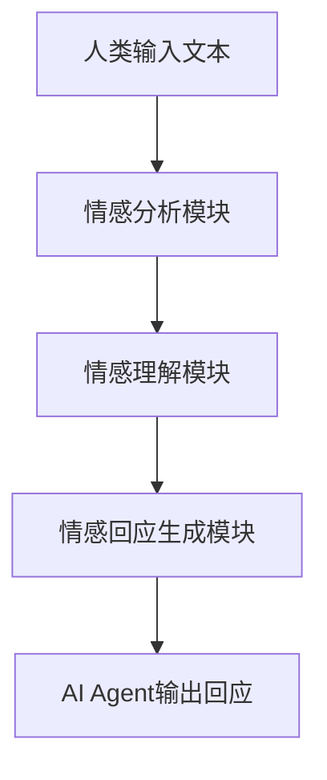

# AI Agent的情感共情：提升LLM的人文关怀能力

> 关键词：AI Agent、情感共情、大语言模型（LLM）、人文关怀能力、自然语言处理

> 摘要：本文聚焦于AI Agent的情感共情能力，旨在探讨如何通过该能力提升大语言模型（LLM）的人文关怀水平。文章详细介绍了情感共情的背景知识，包括其目的、预期读者和文档结构。深入阐述了情感共情的核心概念、相关算法原理、数学模型，并通过实际代码案例展示其实现过程。同时，分析了AI Agent情感共情在不同场景的应用，推荐了学习资源、开发工具和相关论文。最后，总结了未来发展趋势与挑战，解答了常见问题并提供扩展阅读资料，为推动AI在人文关怀领域的发展提供了全面的参考。

## 1. 背景介绍 

### 1.1 目的和范围
随着人工智能技术的飞速发展，大语言模型（LLM）在自然语言处理领域取得了显著的成果。然而，目前大多数LLM缺乏情感共情能力，难以在与人类交互中提供真正的人文关怀。本文的目的是深入探讨如何赋予AI Agent情感共情能力，从而提升LLM的人文关怀水平。我们将从理论原理、算法实现、实际应用等多个方面进行研究，范围涵盖情感共情的核心概念、相关算法、数学模型以及实际案例等。

### 1.2 预期读者
本文主要面向对人工智能、自然语言处理、情感计算等领域感兴趣的专业人士，包括程序员、软件架构师、人工智能研究者等。同时，对于希望了解AI在人文关怀领域应用的普通读者也具有一定的参考价值。

### 1.3 文档结构概述
本文将按照以下结构进行组织：首先介绍情感共情的背景知识，包括目的、预期读者和文档结构；接着阐述情感共情的核心概念与联系，通过文本示意图和Mermaid流程图进行说明；然后详细讲解核心算法原理和具体操作步骤，并给出Python源代码；之后介绍相关的数学模型和公式，并举例说明；再通过实际代码案例展示AI Agent情感共情的实现过程；分析其在不同场景的实际应用；推荐学习资源、开发工具和相关论文；最后总结未来发展趋势与挑战，解答常见问题并提供扩展阅读资料。

### 1.4 术语表

#### 1.4.1 核心术语定义
- **AI Agent**：是一种能够感知环境、进行决策并采取行动的人工智能实体，它可以根据预设的规则或学习到的知识与外界进行交互。
- **情感共情**：指AI Agent能够识别和理解人类的情感状态，并做出相应的情感反应，以达到与人类情感共鸣的能力。
- **大语言模型（LLM）**：是一种基于深度学习的自然语言处理模型，通过大规模的文本数据进行训练，能够生成高质量的自然语言文本。
- **人文关怀能力**：指AI在与人类交互过程中，能够理解人类的情感、需求和价值观，并提供具有关怀性和支持性的回应的能力。

#### 1.4.2 相关概念解释
- **情感分析**：是自然语言处理的一个重要任务，旨在识别文本中表达的情感倾向，如积极、消极或中性。
- **情感计算**：是一个跨学科领域，涉及计算机科学、心理学、认知科学等，旨在让计算机能够识别、表达和模拟人类情感。
- **自然语言处理（NLP）**：是人工智能的一个分支，研究如何让计算机理解和处理人类语言，包括文本分类、机器翻译、问答系统等任务。

#### 1.4.3 缩略词列表
- **AI**：Artificial Intelligence，人工智能
- **LLM**：Large Language Model，大语言模型
- **NLP**：Natural Language Processing，自然语言处理

## 2. 核心概念与联系 

### 核心概念原理
情感共情的核心在于让AI Agent能够感知、理解和回应人类的情感。这涉及到多个方面的技术和理论。首先，AI Agent需要通过自然语言处理技术对人类输入的文本进行分析，识别其中的情感信息。这可以通过情感分析算法来实现，例如基于机器学习的分类算法或基于深度学习的神经网络模型。

其次，AI Agent需要具备情感理解能力，即能够理解不同情感的含义和背景。这需要结合心理学和认知科学的知识，构建情感模型来描述情感的产生、发展和表达。

最后，AI Agent需要根据识别和理解的情感信息，做出相应的情感回应。这可以通过生成具有情感色彩的文本或语音来实现，以达到与人类情感共鸣的效果。

### 架构的文本示意图
```plaintext
人类输入文本 -> 情感分析模块 -> 情感理解模块 -> 情感回应生成模块 -> AI Agent输出回应
```
这个示意图展示了AI Agent实现情感共情的基本架构。人类输入的文本首先经过情感分析模块，识别其中的情感信息；然后情感理解模块对这些情感信息进行深入理解；最后情感回应生成模块根据理解的结果生成相应的情感回应，并由AI Agent输出给人类。

### Mermaid流程图

这个流程图直观地展示了AI Agent实现情感共情的流程。从人类输入文本开始，依次经过情感分析、情感理解和情感回应生成三个模块，最终输出具有情感共情的回应。

## 3. 核心算法原理 & 具体操作步骤 

### 情感分析算法原理
情感分析的目的是识别文本中表达的情感倾向。一种常用的方法是基于机器学习的分类算法，例如朴素贝叶斯分类器。下面是一个使用Python和`sklearn`库实现的简单情感分析示例：

```python
from sklearn.feature_extraction.text import TfidfVectorizer
from sklearn.naive_bayes import MultinomialNB
from sklearn.pipeline import Pipeline

# 训练数据
train_texts = ["这部电影太棒了，我非常喜欢！", "这个产品质量太差了，很不满意。", "今天天气真好，心情也不错。"]
train_labels = ["积极", "消极", "积极"]

# 创建一个Pipeline，包含特征提取和分类器
pipeline = Pipeline([
    ('tfidf', TfidfVectorizer()),
    ('clf', MultinomialNB())
])

# 训练模型
pipeline.fit(train_texts, train_labels)

# 测试数据
test_text = "这个餐厅的服务很糟糕。"

# 预测情感
predicted_label = pipeline.predict([test_text])
print(f"预测的情感倾向: {predicted_label[0]}")
```

### 具体操作步骤
1. **数据准备**：收集包含情感标签的文本数据作为训练集，例如上述代码中的`train_texts`和`train_labels`。
2. **特征提取**：使用`TfidfVectorizer`将文本转换为数值特征，以便机器学习模型能够处理。
3. **模型选择和训练**：选择合适的分类器，如`MultinomialNB`，并使用训练数据进行训练。
4. **预测**：使用训练好的模型对新的文本进行情感预测，如上述代码中的`test_text`。

### 情感理解和回应生成算法原理
情感理解需要结合心理学和认知科学的知识，构建情感模型。一种简单的方法是使用情感词典，将文本中的词汇与情感词典中的情感极性进行匹配，从而判断文本的情感倾向。

情感回应生成可以基于模板匹配或生成式模型。模板匹配是指预先定义一些具有情感色彩的回应模板，根据识别的情感信息选择合适的模板进行回应。生成式模型则可以使用深度学习模型，如GPT等，根据输入的情感信息生成自然流畅的回应。

以下是一个简单的情感回应生成示例：

```python
# 情感回应模板
positive_responses = ["听起来你心情很不错呢，希望这份好心情能一直保持！", "真好呀，愿快乐常伴你左右！"]
negative_responses = ["别太难过啦，一切都会好起来的。", "心疼你，有什么烦恼可以跟我说说。"]

# 根据情感倾向选择回应
if predicted_label[0] == "积极":
    response = positive_responses[0]
else:
    response = negative_responses[0]

print(f"AI Agent的回应: {response}")
```

### 具体操作步骤
1. **构建情感词典或模板**：根据情感分析的结果，准备相应的情感回应模板。
2. **情感判断**：根据情感分析的结果，判断文本的情感倾向。
3. **选择回应**：根据情感倾向选择合适的回应模板进行回应。

## 4. 数学模型和公式 & 详细讲解 & 举例说明 

### 情感分析中的TF-IDF公式
在情感分析中，TF-IDF（Term Frequency-Inverse Document Frequency）是一种常用的特征提取方法。TF-IDF衡量了一个词在文档中的重要性，其计算公式如下：

$$TF-IDF(t, d, D) = TF(t, d) \times IDF(t, D)$$

其中：
- $TF(t, d)$ 表示词 $t$ 在文档 $d$ 中的词频，即词 $t$ 在文档 $d$ 中出现的次数除以文档 $d$ 中总词数。
- $IDF(t, D)$ 表示词 $t$ 的逆文档频率，计算公式为：

$$IDF(t, D) = \log\frac{N}{1 + df(t)}$$

其中：
- $N$ 是文档集合 $D$ 中的文档总数。
- $df(t)$ 是包含词 $t$ 的文档数。

### 详细讲解
TF-IDF的核心思想是，如果一个词在某个文档中频繁出现，但在整个文档集合中很少出现，那么这个词对于该文档具有较高的区分度，应该赋予较高的权重。

### 举例说明
假设我们有一个文档集合 $D$ 包含三个文档：
- $d_1$: "这部电影太棒了，我非常喜欢！"
- $d_2$: "这个产品质量太差了，很不满意。"
- $d_3$: "今天天气真好，心情也不错。"

我们来计算词 "电影" 的TF-IDF值。
- 首先计算词频 $TF$：在文档 $d_1$ 中，"电影" 出现了1次，文档 $d_1$ 总词数为7，所以 $TF("电影", d_1) = \frac{1}{7}$。
- 然后计算逆文档频率 $IDF$：文档集合 $D$ 中总文档数 $N = 3$，包含词 "电影" 的文档数 $df("电影") = 1$，所以 $IDF("电影", D) = \log\frac{3}{1 + 1} \approx 0.405$。
- 最后计算TF-IDF值：$TF-IDF("电影", d_1, D) = TF("电影", d_1) \times IDF("电影", D) = \frac{1}{7} \times 0.405 \approx 0.058$。

### 朴素贝叶斯分类器的数学原理
朴素贝叶斯分类器基于贝叶斯定理，假设特征之间相互独立。对于一个文本分类问题，给定一个文本 $x = (x_1, x_2, \cdots, x_n)$，其中 $x_i$ 是文本中的一个特征（如词），我们要预测其类别 $y$。贝叶斯定理的公式如下：

$$P(y|x) = \frac{P(x|y)P(y)}{P(x)}$$

由于 $P(x)$ 对于所有类别都是相同的，我们可以忽略它，只考虑分子。朴素贝叶斯假设特征之间相互独立，所以 $P(x|y)$ 可以表示为：

$$P(x|y) = \prod_{i=1}^{n}P(x_i|y)$$

因此，我们只需要计算 $P(y)$ 和 $P(x_i|y)$ 即可。$P(y)$ 是类别 $y$ 的先验概率，可以通过训练数据中类别 $y$ 出现的频率来估计；$P(x_i|y)$ 是在类别 $y$ 下特征 $x_i$ 出现的条件概率，可以通过训练数据中在类别 $y$ 下特征 $x_i$ 出现的频率来估计。

### 详细讲解
朴素贝叶斯分类器的核心思想是通过计算每个类别下文本出现的概率，选择概率最大的类别作为预测结果。由于假设特征之间相互独立，计算复杂度大大降低。

### 举例说明
假设我们有一个二分类问题，类别 $y$ 有 "积极" 和 "消极" 两种。训练数据如下：
| 文本 | 类别 |
| ---- | ---- |
| "这部电影太棒了，我非常喜欢！" | 积极 |
| "这个产品质量太差了，很不满意。" | 消极 |

我们要预测文本 "这个餐厅的服务很糟糕。" 的类别。
- 首先计算先验概率 $P(y)$：假设训练数据中 "积极" 类别的文档数为1，"消极" 类别的文档数为1，总文档数为2，所以 $P(积极) = \frac{1}{2}$，$P(消极) = \frac{1}{2}$。
- 然后计算条件概率 $P(x_i|y)$：例如，对于词 "糟糕"，在 "消极" 类别文档中出现了1次，"消极" 类别文档总词数为4，所以 $P(糟糕|消极) = \frac{1}{4}$；在 "积极" 类别文档中未出现，所以 $P(糟糕|积极) = 0$（实际应用中会进行平滑处理）。
- 最后计算后验概率 $P(y|x)$：对于文本 "这个餐厅的服务很糟糕。"，假设其特征为 "餐厅"、"服务"、"糟糕"，由于 $P(糟糕|积极) = 0$，所以 $P(积极|x) = 0$；$P(消极|x) = P(餐厅|消极)P(服务|消极)P(糟糕|消极)P(消极)$。比较 $P(积极|x)$ 和 $P(消极|x)$ 的大小，选择概率大的类别作为预测结果。

## 5. 项目实战：代码实际案例和详细解释说明 

### 5.1  开发环境搭建
为了实现AI Agent的情感共情功能，我们需要搭建一个开发环境。以下是具体步骤：
1. **安装Python**：建议使用Python 3.7及以上版本。可以从Python官方网站（https://www.python.org/downloads/）下载并安装。
2. **安装必要的库**：我们需要安装`sklearn`、`numpy`等库。可以使用`pip`命令进行安装：
```sh
pip install scikit-learn numpy
```

### 5.2  源代码详细实现和代码解读
以下是一个完整的AI Agent情感共情实现的代码示例：

```python
from sklearn.feature_extraction.text import TfidfVectorizer
from sklearn.naive_bayes import MultinomialNB
from sklearn.pipeline import Pipeline

# 训练数据
train_texts = ["这部电影太棒了，我非常喜欢！", "这个产品质量太差了，很不满意。", "今天天气真好，心情也不错。"]
train_labels = ["积极", "消极", "积极"]

# 创建一个Pipeline，包含特征提取和分类器
pipeline = Pipeline([
    ('tfidf', TfidfVectorizer()),
    ('clf', MultinomialNB())
])

# 训练模型
pipeline.fit(train_texts, train_labels)

# 情感回应模板
positive_responses = ["听起来你心情很不错呢，希望这份好心情能一直保持！", "真好呀，愿快乐常伴你左右！"]
negative_responses = ["别太难过啦，一切都会好起来的。", "心疼你，有什么烦恼可以跟我说说。"]

# 模拟用户输入
user_input = "这个餐厅的服务很糟糕。"

# 预测情感
predicted_label = pipeline.predict([user_input])[0]

# 根据情感倾向选择回应
if predicted_label == "积极":
    response = positive_responses[0]
else:
    response = negative_responses[0]

print(f"用户输入: {user_input}")
print(f"预测的情感倾向: {predicted_label}")
print(f"AI Agent的回应: {response}")
```

### 代码解读与分析
1. **数据准备**：`train_texts` 是训练文本数据，`train_labels` 是对应的情感标签。这些数据用于训练情感分析模型。
2. **Pipeline构建**：使用`Pipeline`将`TfidfVectorizer`和`MultinomialNB`组合在一起，方便进行特征提取和模型训练。
3. **模型训练**：调用`pipeline.fit()`方法使用训练数据对模型进行训练。
4. **情感回应模板**：`positive_responses` 和 `negative_responses` 分别是积极和消极情感的回应模板。
5. **用户输入和预测**：模拟用户输入`user_input`，调用`pipeline.predict()`方法对用户输入的情感进行预测。
6. **回应选择**：根据预测的情感倾向选择合适的回应模板进行回应。

## 6. 实际应用场景 
### 客户服务
在客户服务场景中，AI Agent可以通过情感共情能力更好地理解客户的需求和情绪。当客户表达不满时，AI Agent能够及时识别并给予安慰和解决方案，提高客户满意度。例如，当客户反馈产品出现问题时，AI Agent可以说：“很抱歉给您带来了不便，别着急，我们会尽快为您解决问题。”

### 心理健康咨询
在心理健康咨询领域，AI Agent可以作为辅助工具，为用户提供情感支持和心理疏导。通过识别用户的情感状态，AI Agent可以给予个性化的建议和鼓励。例如，当用户表达焦虑情绪时，AI Agent可以说：“我能感受到你的焦虑，焦虑是很正常的情绪，你可以试着做一些深呼吸来放松一下。”

### 教育领域
在教育场景中，AI Agent可以根据学生的情感状态提供相应的学习建议和鼓励。当学生遇到困难而感到沮丧时，AI Agent可以说：“遇到困难不要灰心，这是成长的机会，我们一起分析问题，总会找到解决办法的。”

### 社交娱乐
在社交娱乐应用中，AI Agent可以增加互动的趣味性和情感共鸣。例如，在聊天机器人中，当用户分享开心的事情时，AI Agent可以给予热情的回应，如“哇，这真是太棒了，替你开心！”

## 7. 工具和资源推荐

### 7.1 学习资源推荐

#### 7.1.1 书籍推荐
- 《自然语言处理入门》：这本书系统地介绍了自然语言处理的基本概念、算法和应用，适合初学者入门。
- 《情感计算》：详细阐述了情感计算的理论和技术，对于深入理解AI Agent的情感共情能力有很大帮助。
- 《Python自然语言处理实战》：通过实际案例介绍了如何使用Python进行自然语言处理，包括情感分析等任务。

#### 7.1.2 在线课程
- Coursera上的“Natural Language Processing Specialization”：由顶尖大学的教授授课，全面介绍了自然语言处理的各个方面。
- edX上的“AI for Everyone”：虽然是面向大众的课程，但也涉及了人工智能的基本概念和应用，包括情感计算。
- 中国大学MOOC上的“自然语言处理”：国内高校的优质课程，讲解详细，适合国内学习者。

#### 7.1.3 技术博客和网站
- Medium：有很多关于人工智能和自然语言处理的技术博客，提供了最新的研究成果和实践经验。
- arXiv：是一个预印本平台，包含了大量的学术论文，对于了解最新的研究动态很有帮助。
- 开源中国：国内的技术社区，有很多关于人工智能和自然语言处理的技术文章和案例分享。

### 7.2 开发工具框架推荐

#### 7.2.1 IDE和编辑器
- PyCharm：是一款功能强大的Python集成开发环境，提供了代码编辑、调试、版本控制等功能，适合Python开发者。
- Jupyter Notebook：以交互式的方式编写和运行代码，方便进行数据探索和模型训练，常用于机器学习和数据科学领域。
- Visual Studio Code：是一款轻量级的代码编辑器，支持多种编程语言，有丰富的插件扩展功能。

#### 7.2.2 调试和性能分析工具
- PDB：Python自带的调试工具，可以帮助开发者定位代码中的问题。
- TensorBoard：是TensorFlow的可视化工具，可以用于查看模型的训练过程和性能指标。
- cProfile：Python的性能分析工具，可以分析代码的运行时间和函数调用情况。

#### 7.2.3 相关框架和库
- scikit-learn：是一个简单易用的机器学习库，提供了多种机器学习算法和工具，包括分类、回归、聚类等。
- TensorFlow：是一个开源的深度学习框架，广泛应用于自然语言处理、计算机视觉等领域。
- PyTorch：也是一个流行的深度学习框架，具有动态图的优势，适合快速开发和实验。

### 7.3 相关论文著作推荐

#### 7.3.1 经典论文
- "A Sentimental Education: Sentiment Analysis Using Subjectivity Summarization Based on Minimum Cuts"：提出了一种基于最小割的情感分析方法，是情感分析领域的经典论文。
- "Emotion Recognition from Text: A Survey"：对文本情感识别的方法和技术进行了全面的综述，对于了解该领域的发展历程和现状很有帮助。
- "Attention Is All You Need"：提出了Transformer架构，为自然语言处理带来了革命性的变化，很多大语言模型都基于该架构。

#### 7.3.2 最新研究成果
- 关注顶级学术会议如ACL（Association for Computational Linguistics）、EMNLP（Conference on Empirical Methods in Natural Language Processing）等的论文，了解情感共情和自然语言处理领域的最新研究动态。
- 一些知名研究机构如OpenAI、Google Research等发布的研究报告和论文，通常代表了该领域的前沿技术。

#### 7.3.3 应用案例分析
- 一些商业应用的案例分析报告，如智能客服系统、聊天机器人等的情感共情应用案例，可以了解实际应用中的挑战和解决方案。
- 行业报告和白皮书，如人工智能在医疗、教育等领域的应用报告，提供了更广泛的应用场景和案例。

## 8. 总结：未来发展趋势与挑战
### 未来发展趋势
- **多模态融合**：未来的AI Agent情感共情能力将不仅仅局限于文本，还会融合语音、图像等多模态信息，更全面地理解人类的情感状态。例如，通过分析语音的语调、语速和图像中的表情等信息，更准确地识别情感。
- **个性化情感共情**：根据用户的个人偏好、历史交互记录等信息，提供更加个性化的情感回应。例如，对于不同性格的用户，采用不同的沟通方式和情感表达方式。
- **与其他技术的融合**：AI Agent的情感共情能力将与虚拟现实、增强现实等技术相结合，创造更加沉浸式的情感交互体验。例如，在虚拟现实场景中，AI Agent可以根据用户的情感状态实时调整场景氛围。

### 挑战
- **情感理解的复杂性**：人类情感是复杂多样的，受到文化、社会背景、个人经历等多种因素的影响。如何让AI Agent准确理解和处理这些复杂的情感信息是一个巨大的挑战。
- **数据质量和隐私问题**：情感分析需要大量的标注数据进行训练，但数据的质量和标注的准确性直接影响模型的性能。同时，收集和使用用户的情感数据也涉及到隐私问题，需要严格遵守相关法律法规。
- **伦理和道德问题**：随着AI Agent情感共情能力的增强，可能会引发一些伦理和道德问题。例如，AI Agent是否应该模拟人类情感，以及如何避免对用户造成情感伤害等。

## 9. 附录：常见问题与解答
### 问题1：AI Agent的情感共情能力与人类的情感共情能力有什么区别？
答：人类的情感共情能力是基于生物学和心理学基础的，具有高度的灵活性和适应性，能够在复杂的情境中快速准确地感知和理解他人的情感。而AI Agent的情感共情能力是基于算法和模型实现的，目前还存在一定的局限性。例如，AI Agent可能无法像人类一样深刻理解情感背后的复杂原因，也难以在一些特殊情境下做出恰当的情感回应。

### 问题2：如何提高AI Agent的情感共情能力？
答：可以从以下几个方面提高AI Agent的情感共情能力：
- 收集更多高质量的标注数据，包括不同情感类型、不同场景下的文本数据，以提高情感分析模型的准确性。
- 引入更多的知识和信息，如心理学、社会学等领域的知识，帮助AI Agent更好地理解情感的含义和背景。
- 采用更先进的算法和模型，如深度学习中的Transformer架构，提高模型的表达能力和泛化能力。

### 问题3：AI Agent的情感共情能力在实际应用中存在哪些风险？
答：AI Agent的情感共情能力在实际应用中可能存在以下风险：
- 情感误判：由于情感分析模型的局限性，可能会出现情感误判的情况，导致AI Agent给出不恰当的回应。
- 隐私泄露：在收集和处理用户的情感数据时，如果不注意保护用户隐私，可能会导致用户隐私泄露。
- 伦理问题：AI Agent的情感回应可能会对用户产生影响，如果处理不当，可能会引发伦理问题，如误导用户、造成情感伤害等。

## 10. 扩展阅读 & 参考资料
- 李航. 《统计学习方法（第2版）》. 清华大学出版社, 2019.
- Jurafsky D, Martin J H. 《Speech and Language Processing (3rd ed. draft)》. 2021.
- OpenAI官方文档（https://openai.com/）
- Google Research博客（https://research.google/）

作者：AI天才研究院/AI Genius Institute & 禅与计算机程序设计艺术 /Zen And The Art of Computer Programming