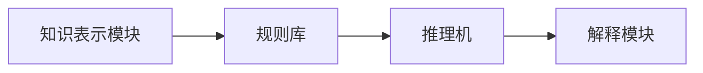

# AI Agent的推理引擎：设计与优化

> 关键词：AI Agent、推理引擎、设计、优化、算法原理

> 摘要：本文聚焦于AI Agent的推理引擎，深入探讨其设计与优化的相关内容。首先介绍了研究的背景、目的、预期读者和文档结构，对核心术语和概念进行了清晰定义。接着阐述了推理引擎的核心概念、原理和架构，并通过Mermaid流程图进行直观展示。详细讲解了核心算法原理，使用Python代码进行说明，同时给出了相关的数学模型和公式。通过项目实战，展示了代码的实际案例并进行详细解读。分析了推理引擎在不同场景下的实际应用，推荐了学习、开发工具和相关论文著作。最后总结了未来的发展趋势与挑战，并提供了常见问题解答和扩展阅读参考资料。

## 1. 背景介绍 
### 1.1 目的和范围
随着人工智能技术的飞速发展，AI Agent在各个领域的应用越来越广泛。推理引擎作为AI Agent的核心组成部分，负责根据已知信息进行逻辑推理和决策，其性能直接影响到AI Agent的表现。本文的目的在于深入探讨AI Agent推理引擎的设计与优化方法，涵盖推理引擎的基本原理、算法实现、实际应用等方面，旨在为相关领域的研究人员和开发者提供全面的指导和参考。

### 1.2 预期读者
本文主要面向对人工智能、AI Agent和推理引擎感兴趣的研究人员、开发者以及相关领域的专业人士。对于希望深入了解推理引擎技术，提升AI Agent性能的读者具有较高的参考价值。

### 1.3 文档结构概述
本文将按照以下结构进行阐述：首先介绍核心概念与联系，包括推理引擎的原理和架构；接着详细讲解核心算法原理和具体操作步骤，并给出Python源代码；然后介绍相关的数学模型和公式，并举例说明；通过项目实战展示代码的实际应用和详细解释；分析推理引擎的实际应用场景；推荐学习和开发所需的工具和资源；总结未来发展趋势与挑战；提供常见问题解答和扩展阅读参考资料。

### 1.4 术语表
#### 1.4.1 核心术语定义
- **AI Agent**：能够感知环境、进行决策并采取行动以实现特定目标的智能实体。
- **推理引擎**：AI Agent中负责根据已知知识和规则进行逻辑推理和得出结论的组件。
- **知识表示**：将现实世界的知识以计算机能够理解和处理的方式进行表示的方法。
- **规则引擎**：基于规则进行推理的引擎，通过匹配规则条件来触发相应的动作。

#### 1.4.2 相关概念解释
- **逻辑推理**：从已知的前提条件出发，按照一定的逻辑规则推导出新的结论的过程。
- **不确定性推理**：处理含有不确定信息的推理，例如概率推理、模糊推理等。
- **知识图谱**：一种以图的形式表示知识的结构，节点表示实体，边表示实体之间的关系。

#### 1.4.3 缩略词列表
- **AI**：Artificial Intelligence，人工智能
- **RDF**：Resource Description Framework，资源描述框架
- **OWL**：Web Ontology Language，网络本体语言

## 2. 核心概念与联系 

### 推理引擎的核心概念
推理引擎的核心任务是根据已知的知识和规则，通过逻辑推理得出新的结论。其基本原理是将知识表示为计算机能够处理的形式，然后利用推理算法对这些知识进行操作。

### 推理引擎的架构
推理引擎的架构通常包括以下几个部分：
- **知识表示模块**：负责将现实世界的知识转化为计算机能够理解和处理的形式，例如使用RDF、OWL等语言进行知识表示。
- **规则库**：存储推理所需的规则，这些规则可以是专家制定的，也可以是通过机器学习算法自动学习得到的。
- **推理机**：根据知识表示模块提供的知识和规则库中的规则进行推理，得出新的结论。
- **解释模块**：对推理结果进行解释，帮助用户理解推理过程和结果的依据。

### 文本示意图
```plaintext
+----------------+        +----------------+        +----------------+
| 知识表示模块  | -----> |    规则库      | -----> |    推理机      |
+----------------+        +----------------+        +----------------+
                                                   |    解释模块    |
                                                   +----------------+
```

### Mermaid流程图


## 3. 核心算法原理 & 具体操作步骤 

### 基于规则的推理算法原理
基于规则的推理是推理引擎中最常见的一种推理方式。其基本思想是将推理规则表示为“IF-THEN”形式的条件语句，当规则的条件部分被满足时，触发规则的结论部分。

以下是一个简单的基于规则的推理算法的Python实现：

```python
# 定义规则类
class Rule:
    def __init__(self, conditions, conclusion):
        self.conditions = conditions
        self.conclusion = conclusion

    def is_satisfied(self, facts):
        for condition in self.conditions:
            if condition not in facts:
                return False
        return True

# 定义推理引擎类
class InferenceEngine:
    def __init__(self, rules, facts):
        self.rules = rules
        self.facts = facts

    def infer(self):
        new_facts = set()
        for rule in self.rules:
            if rule.is_satisfied(self.facts):
                new_facts.add(rule.conclusion)
        self.facts.update(new_facts)
        return new_facts

# 示例规则和事实
rules = [
    Rule(['A', 'B'], 'C'),
    Rule(['C'], 'D')
]
facts = {'A', 'B'}

# 创建推理引擎实例
engine = InferenceEngine(rules, facts)

# 进行推理
new_facts = engine.infer()
print("新的事实:", new_facts)
```

### 具体操作步骤
1. **知识表示**：将现实世界的知识和规则表示为计算机能够处理的形式，例如使用上述的`Rule`类表示规则，使用集合表示事实。
2. **初始化推理引擎**：将规则和事实传递给推理引擎的构造函数，创建推理引擎实例。
3. **进行推理**：调用推理引擎的`infer`方法，根据规则和事实进行推理，得出新的结论。
4. **更新事实**：将推理得出的新结论添加到事实集合中，以便进行下一步的推理。

## 4. 数学模型和公式 & 详细讲解 & 举例说明 

### 逻辑推理的数学模型
在逻辑推理中，常用的数学模型是命题逻辑和谓词逻辑。

#### 命题逻辑
命题逻辑是研究命题之间逻辑关系的数学理论。命题是具有真假值的陈述句。命题逻辑中常用的逻辑运算符包括合取（$\land$）、析取（$\lor$）、否定（$\neg$）、蕴含（$\rightarrow$）等。

例如，设命题$P$表示“今天是晴天”，命题$Q$表示“我去公园”，则命题“如果今天是晴天，那么我去公园”可以表示为$P \rightarrow Q$。

#### 谓词逻辑
谓词逻辑是在命题逻辑的基础上，引入了个体变量和量词（全称量词$\forall$和存在量词$\exists$），可以更精确地描述现实世界的知识。

例如，设谓词$P(x)$表示“$x$是偶数”，则命题“所有的自然数都是偶数”可以表示为$\forall x P(x)$，命题“存在一个自然数是偶数”可以表示为$\exists x P(x)$。

### 推理规则的数学表示
在推理引擎中，推理规则可以用逻辑公式来表示。例如，基于规则的推理中的“IF-THEN”规则可以表示为蕴含式。

设规则“如果$A$和$B$成立，那么$C$成立”可以表示为$(A \land B) \rightarrow C$。

### 举例说明
假设有以下规则和事实：
- 规则1：如果$A$和$B$成立，那么$C$成立，即$(A \land B) \rightarrow C$
- 规则2：如果$C$成立，那么$D$成立，即$C \rightarrow D$
- 事实：$A$和$B$成立

根据规则1，由于$A$和$B$成立，满足规则1的条件，所以可以推出$C$成立。再根据规则2，由于$C$成立，满足规则2的条件，所以可以推出$D$成立。

用数学公式表示推理过程如下：
1. 已知$A$和$B$成立，即$A \land B$为真。
2. 因为$(A \land B) \rightarrow C$，根据蕴含式的推理规则，当$A \land B$为真时，可以推出$C$为真。
3. 因为$C \rightarrow D$，且$C$为真，根据蕴含式的推理规则，可以推出$D$为真。

## 5. 项目实战：代码实际案例和详细解释说明 

### 5.1  开发环境搭建
本项目使用Python语言进行开发，以下是开发环境的搭建步骤：
1. **安装Python**：从Python官方网站（https://www.python.org/downloads/）下载并安装Python 3.x版本。
2. **安装开发工具**：推荐使用PyCharm或VS Code作为开发工具，它们提供了丰富的代码编辑和调试功能。

### 5.2  源代码详细实现和代码解读
以下是一个更复杂的推理引擎的Python实现，包含知识表示、规则匹配和推理过程：

```python
# 定义知识表示类
class KnowledgeBase:
    def __init__(self):
        self.facts = set()
        self.rules = []

    def add_fact(self, fact):
        self.facts.add(fact)

    def add_rule(self, conditions, conclusion):
        rule = (conditions, conclusion)
        self.rules.append(rule)

    def infer(self):
        new_facts = set()
        while True:
            added = False
            for conditions, conclusion in self.rules:
                if all(condition in self.facts for condition in conditions) and conclusion not in self.facts:
                    new_facts.add(conclusion)
                    self.facts.add(conclusion)
                    added = True
            if not added:
                break
        return new_facts

# 创建知识库实例
kb = KnowledgeBase()

# 添加事实
kb.add_fact('A')
kb.add_fact('B')

# 添加规则
kb.add_rule(['A', 'B'], 'C')
kb.add_rule(['C'], 'D')

# 进行推理
new_facts = kb.infer()
print("新的事实:", new_facts)
```

### 代码解读与分析
1. **KnowledgeBase类**：表示知识库，包含事实集合`facts`和规则列表`rules`。
    - `add_fact`方法：用于向知识库中添加事实。
    - `add_rule`方法：用于向知识库中添加规则，规则以元组的形式存储，包含条件列表和结论。
    - `infer`方法：进行推理的核心方法，使用一个无限循环不断匹配规则，直到没有新的事实可以推出为止。
2. **主程序**：创建知识库实例，添加事实和规则，调用`infer`方法进行推理，并输出新的事实。

## 6. 实际应用场景 
### 智能客服
在智能客服系统中，推理引擎可以根据用户的提问和已知的知识进行推理，给出准确的回答。例如，当用户询问某个产品的使用方法时，推理引擎可以根据产品的特点和相关规则，生成详细的使用说明。

### 医疗诊断
在医疗领域，推理引擎可以辅助医生进行诊断。根据患者的症状、检查结果和医学知识，推理引擎可以推断出可能的疾病，并提供相应的治疗建议。

### 金融风险评估
在金融领域，推理引擎可以根据客户的信用记录、财务状况和市场信息等，评估客户的信用风险和投资风险，为金融机构的决策提供支持。

## 7. 工具和资源推荐
### 7.1 学习资源推荐
#### 7.1.1 书籍推荐
- 《人工智能：一种现代的方法》：全面介绍了人工智能的各个领域，包括推理引擎、知识表示等内容。
- 《知识表示与推理》：深入探讨了知识表示和推理的理论和方法。

#### 7.1.2 在线课程
- Coursera上的“人工智能基础”课程：由知名教授授课，系统讲解人工智能的基础知识和技术。
- edX上的“知识工程与语义网”课程：专注于知识表示和推理的应用。

#### 7.1.3 技术博客和网站
- AI Stack Exchange：一个专门讨论人工智能问题的问答社区，有很多关于推理引擎的讨论和解答。
- Towards Data Science：提供了大量关于人工智能和机器学习的技术文章和案例分析。

### 7.2 开发工具框架推荐
#### 7.2.1 IDE和编辑器
- PyCharm：功能强大的Python集成开发环境，提供了代码编辑、调试、版本控制等功能。
- VS Code：轻量级的代码编辑器，支持多种编程语言，有丰富的插件扩展。

#### 7.2.2 调试和性能分析工具
- Py-Spy：用于分析Python程序的性能，找出性能瓶颈。
- pdb：Python自带的调试工具，可以帮助开发者调试代码。

#### 7.2.3 相关框架和库
- rdflib：Python中用于处理RDF数据的库，可用于知识表示和推理。
- owlready2：用于处理OWL本体的Python库，支持本体的加载、推理和修改。

### 7.3 相关论文著作推荐
#### 7.3.1 经典论文
- “A Logic-Based Calculus of Events”：提出了基于逻辑的事件演算方法，用于处理动态知识的推理。
- “Semantic Web Primer”：介绍了语义网的基本概念和技术，包括知识表示和推理。

#### 7.3.2 最新研究成果
- 关注顶级人工智能会议（如AAAI、IJCAI）上的相关论文，了解推理引擎的最新研究进展。
- 查阅知名学术期刊（如Artificial Intelligence）上的文章，获取最新的研究成果。

#### 7.3.3 应用案例分析
- 分析实际应用中的推理引擎案例，如智能客服系统、医疗诊断系统等，学习其设计和实现方法。

## 8. 总结：未来发展趋势与挑战
### 未来发展趋势
- **与深度学习的融合**：将推理引擎与深度学习技术相结合，充分发挥两者的优势，提高AI Agent的智能水平。
- **不确定性推理的发展**：处理更多的不确定信息，提高推理引擎在复杂环境下的性能。
- **知识图谱的应用**：利用知识图谱丰富的知识表示和推理能力，为推理引擎提供更强大的支持。

### 挑战
- **知识获取和更新**：如何高效地获取和更新推理引擎所需的知识是一个挑战。
- **计算资源的需求**：复杂的推理任务需要大量的计算资源，如何优化推理算法以降低计算成本是一个关键问题。
- **可解释性**：提高推理结果的可解释性，让用户能够理解推理过程和结果的依据。

## 9. 附录：常见问题与解答
### 问题1：推理引擎和规则引擎有什么区别？
推理引擎是一个更广泛的概念，它可以基于不同的推理方法进行推理，包括基于规则的推理、基于逻辑的推理、基于概率的推理等。而规则引擎主要是基于规则进行推理，通过匹配规则条件来触发相应的动作。

### 问题2：如何选择合适的知识表示方法？
选择合适的知识表示方法需要考虑知识的特点和应用场景。如果知识具有明确的逻辑结构，可以选择使用逻辑语言（如RDF、OWL）进行表示；如果知识具有不确定性，可以选择使用概率模型进行表示。

### 问题3：推理引擎的性能如何优化？
可以从以下几个方面优化推理引擎的性能：优化推理算法、减少规则的数量、使用并行计算技术、采用缓存机制等。

## 10. 扩展阅读 & 参考资料
- 《人工智能原理与应用》
- 《机器学习》
- https://www.w3.org/TR/rdf-primer/
- https://www.w3.org/TR/owl2-overview/

作者：AI天才研究院/AI Genius Institute & 禅与计算机程序设计艺术 /Zen And The Art of Computer Programming