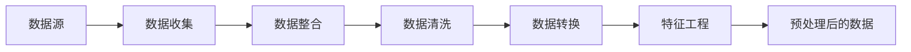

# AI Agent的数据准备和预处理技巧

> 关键词：AI Agent、数据准备、数据预处理、数据清洗、特征工程

> 摘要：本文围绕AI Agent的数据准备和预处理技巧展开。详细介绍了数据准备和预处理在AI Agent开发中的重要性，深入探讨了核心概念、算法原理、数学模型等内容。通过项目实战案例展示了具体的操作过程，分析了实际应用场景，并推荐了相关的学习资源、开发工具和论文著作。最后对未来发展趋势与挑战进行了总结，同时提供了常见问题解答和扩展阅读参考资料，旨在为开发者提供全面且深入的技术指导，助力更好地开展AI Agent相关工作。

## 1. 背景介绍 
### 1.1 目的和范围
AI Agent作为人工智能领域的重要应用，其性能和效果在很大程度上依赖于高质量的数据。数据准备和预处理是确保AI Agent能够准确学习和做出合理决策的基础步骤。本文的目的在于系统地介绍AI Agent数据准备和预处理的相关技巧，涵盖数据的收集、清洗、转换、特征提取等多个方面。范围包括各种常见的数据类型，如结构化数据、非结构化数据等，以及适用于不同场景的预处理方法。

### 1.2 预期读者
本文预期读者主要包括人工智能开发者、数据科学家、机器学习工程师等相关领域的专业人士。同时，对于对AI Agent技术感兴趣的初学者，也可以通过本文了解数据准备和预处理的基本概念和方法，为进一步深入学习打下基础。

### 1.3 文档结构概述
本文将首先介绍核心概念与联系，让读者对数据准备和预处理有一个清晰的框架认识。接着详细阐述核心算法原理和具体操作步骤，结合Python代码进行说明。然后讲解相关的数学模型和公式，并通过举例加深理解。通过项目实战展示实际应用中的代码实现和解读。分析实际应用场景，明确不同场景下的数据准备和预处理需求。推荐相关的工具和资源，帮助读者进一步学习和实践。最后总结未来发展趋势与挑战，解答常见问题，并提供扩展阅读和参考资料。

### 1.4 术语表
#### 1.4.1 核心术语定义
- **AI Agent**：能够感知环境、做出决策并采取行动以实现特定目标的人工智能实体。
- **数据准备**：指从各种数据源收集、整合数据的过程，为后续的预处理和建模做准备。
- **数据预处理**：对原始数据进行清洗、转换、特征提取等操作，以提高数据质量和可用性。
- **数据清洗**：去除数据中的噪声、缺失值、重复值等异常数据的过程。
- **特征工程**：从原始数据中提取和选择有价值的特征，以提高模型的性能。

#### 1.4.2 相关概念解释
- **结构化数据**：具有固定格式和结构的数据，如数据库中的表格数据。
- **非结构化数据**：没有固定结构的数据，如文本、图像、音频等。
- **噪声数据**：数据中包含的错误、异常或无用的信息。
- **缺失值**：数据中某些属性的值缺失的情况。

#### 1.4.3 缩略词列表
- **ML**：Machine Learning，机器学习
- **DL**：Deep Learning，深度学习
- **NLP**：Natural Language Processing，自然语言处理
- **CV**：Computer Vision，计算机视觉

## 2. 核心概念与联系 
### 核心概念原理
#### 数据准备
数据准备是AI Agent开发的第一步，其原理是从多个数据源收集相关数据，并将其整合到一个统一的数据集。数据源可以包括数据库、文件系统、传感器、网络等。在收集数据时，需要考虑数据的完整性、准确性和一致性。例如，在开发一个电商推荐系统的AI Agent时，需要收集用户的浏览记录、购买历史、商品信息等数据。

#### 数据预处理
数据预处理是对收集到的原始数据进行处理，以提高数据质量和可用性。其原理主要包括以下几个方面：
- **数据清洗**：通过识别和处理噪声数据、缺失值和重复值，使数据更加干净和准确。例如，在处理用户评论数据时，可能会存在一些乱码、重复评论等情况，需要进行清洗。
- **数据转换**：将数据转换为适合模型处理的格式。例如，将分类数据转换为数值数据，将连续数据进行归一化处理等。
- **特征工程**：从原始数据中提取和选择有价值的特征，以提高模型的性能。例如，在图像识别任务中，提取图像的颜色、纹理等特征。

### 架构的文本示意图
```plaintext
数据源（数据库、文件系统、传感器等）
    |
    v
数据收集
    |
    v
数据整合
    |
    v
数据清洗（去除噪声、缺失值、重复值）
    |
    v
数据转换（归一化、编码等）
    |
    v
特征工程（特征提取、特征选择）
    |
    v
预处理后的数据（用于AI Agent训练）
```

### Mermaid流程图


## 3. 核心算法原理 & 具体操作步骤 

### 数据清洗算法原理及Python代码实现
#### 去除重复值
原理：遍历数据集中的每一行，检查是否存在重复的行，如果存在则删除重复行。
```python
import pandas as pd

# 创建一个包含重复值的示例数据集
data = {
    'col1': [1, 2, 2, 3],
    'col2': ['a', 'b', 'b', 'c']
}
df = pd.DataFrame(data)

# 去除重复值
df = df.drop_duplicates()
print(df)
```
#### 处理缺失值
原理：常见的处理方法有删除含有缺失值的行或列、用均值、中位数等统计量填充缺失值。
```python
import pandas as pd
import numpy as np

# 创建一个包含缺失值的示例数据集
data = {
    'col1': [1, np.nan, 3],
    'col2': ['a', 'b', np.nan]
}
df = pd.DataFrame(data)

# 删除含有缺失值的行
df_dropna = df.dropna()
print("删除缺失值后的数据集：")
print(df_dropna)

# 用均值填充数值型列的缺失值
df['col1'] = df['col1'].fillna(df['col1'].mean())
print("用均值填充后的数据集：")
print(df)
```

### 数据转换算法原理及Python代码实现
#### 归一化
原理：将数据缩放到一个特定的范围，常见的归一化方法有Min - Max归一化和Z - Score归一化。
```python
from sklearn.preprocessing import MinMaxScaler, StandardScaler
import numpy as np

# 创建一个示例数据集
data = np.array([[1, 2], [3, 4], [5, 6]])

# Min - Max归一化
scaler_minmax = MinMaxScaler()
data_minmax = scaler_minmax.fit_transform(data)
print("Min - Max归一化后的数据：")
print(data_minmax)

# Z - Score归一化
scaler_zscore = StandardScaler()
data_zscore = scaler_zscore.fit_transform(data)
print("Z - Score归一化后的数据：")
print(data_zscore)
```
#### 编码分类数据
原理：将分类数据转换为数值数据，常见的编码方法有独热编码和标签编码。
```python
from sklearn.preprocessing import OneHotEncoder, LabelEncoder
import pandas as pd

# 创建一个包含分类数据的示例数据集
data = {
    'col': ['red', 'blue', 'green']
}
df = pd.DataFrame(data)

# 独热编码
encoder_onehot = OneHotEncoder()
data_onehot = encoder_onehot.fit_transform(df[['col']]).toarray()
print("独热编码后的数据：")
print(data_onehot)

# 标签编码
encoder_label = LabelEncoder()
df['col_encoded'] = encoder_label.fit_transform(df['col'])
print("标签编码后的数据：")
print(df)
```

### 特征工程算法原理及Python代码实现
#### 特征提取
原理：从原始数据中提取有价值的特征。例如，在文本数据中提取词频特征。
```python
from sklearn.feature_extraction.text import CountVectorizer

# 创建一个示例文本数据集
corpus = [
    'This is the first document.',
    'This document is the second document.',
    'And this is the third one.',
    'Is this the first document?'
]

# 提取词频特征
vectorizer = CountVectorizer()
X = vectorizer.fit_transform(corpus)
print("词频特征矩阵：")
print(X.toarray())
```
#### 特征选择
原理：从众多特征中选择对模型性能影响较大的特征。例如，使用方差分析进行特征选择。
```python
from sklearn.feature_selection import SelectKBest, f_classif
from sklearn.datasets import load_iris
import pandas as pd

# 加载鸢尾花数据集
iris = load_iris()
X = iris.data
y = iris.target

# 选择K个最佳特征
selector = SelectKBest(score_func=f_classif, k=2)
X_new = selector.fit_transform(X, y)
print("选择后的特征矩阵形状：")
print(X_new.shape)
```

## 4. 数学模型和公式 & 详细讲解 & 举例说明 

### Min - Max归一化
公式：$$X_{norm}=\frac{X - X_{min}}{X_{max}-X_{min}}$$
详细讲解：Min - Max归一化将数据缩放到[0, 1]的范围内。$X$ 是原始数据，$X_{min}$ 是数据的最小值，$X_{max}$ 是数据的最大值。通过该公式，将每个数据点转换为一个相对值，使得所有数据都在[0, 1]之间。
举例说明：假设有一组数据 $X = [1, 2, 3, 4, 5]$，$X_{min}=1$，$X_{max}=5$。对于数据点 $X = 2$，归一化后的值为：
$$X_{norm}=\frac{2 - 1}{5 - 1}=\frac{1}{4}=0.25$$

### Z - Score归一化
公式：$$X_{z}=\frac{X-\mu}{\sigma}$$
详细讲解：Z - Score归一化将数据转换为均值为0，标准差为1的分布。$\mu$ 是数据的均值，$\sigma$ 是数据的标准差。通过该公式，将每个数据点转换为相对于均值的标准差倍数。
举例说明：假设有一组数据 $X = [1, 2, 3, 4, 5]$，$\mu=\frac{1 + 2+3+4+5}{5}=3$，$\sigma=\sqrt{\frac{\sum_{i = 1}^{n}(X_{i}-\mu)^{2}}{n}}=\sqrt{\frac{(1 - 3)^{2}+(2 - 3)^{2}+(3 - 3)^{2}+(4 - 3)^{2}+(5 - 3)^{2}}{5}}=\sqrt{2}\approx1.414$。对于数据点 $X = 2$，归一化后的值为：
$$X_{z}=\frac{2 - 3}{1.414}\approx - 0.707$$

### 独热编码
原理：对于一个具有 $n$ 个不同取值的分类变量，将其转换为 $n$ 维的向量，每个取值对应一个向量，向量中只有一个元素为1，其余元素为0。
举例说明：假设有一个分类变量“颜色”，取值为“红”、“蓝”、“绿”。则“红”的独热编码为 $[1, 0, 0]$，“蓝”的独热编码为 $[0, 1, 0]$，“绿”的独热编码为 $[0, 0, 1]$。

### 方差分析（ANOVA）用于特征选择
公式：$$F=\frac{MS_{between}}{MS_{within}}$$
其中，$MS_{between}=\frac{\sum_{i = 1}^{k}n_{i}(\bar{X}_{i}-\bar{X})^{2}}{k - 1}$，$MS_{within}=\frac{\sum_{i = 1}^{k}\sum_{j = 1}^{n_{i}}(X_{ij}-\bar{X}_{i})^{2}}{N - k}$。
详细讲解：方差分析用于比较不同组之间的方差和组内方差。$k$ 是组数，$n_{i}$ 是第 $i$ 组的样本数量，$\bar{X}_{i}$ 是第 $i$ 组的均值，$\bar{X}$ 是所有样本的均值，$X_{ij}$ 是第 $i$ 组的第 $j$ 个样本，$N=\sum_{i = 1}^{k}n_{i}$。$F$ 值越大，说明组间方差相对于组内方差越大，该特征对分类的区分能力越强。
举例说明：假设有两组数据，第一组为 $[1, 2, 3]$，第二组为 $[5, 6, 7]$。计算可得：
$\bar{X}_{1}=\frac{1 + 2+3}{3}=2$，$\bar{X}_{2}=\frac{5 + 6+7}{3}=6$，$\bar{X}=\frac{1 + 2+3+5+6+7}{6}=4$。
$MS_{between}=\frac{3\times(2 - 4)^{2}+3\times(6 - 4)^{2}}{2 - 1}=24$，$MS_{within}=\frac{(1 - 2)^{2}+(2 - 2)^{2}+(3 - 2)^{2}+(5 - 6)^{2}+(6 - 6)^{2}+(7 - 6)^{2}}{6 - 2}=1$。
$F=\frac{24}{1}=24$。

## 5. 项目实战：代码实际案例和详细解释说明 
### 5.1  开发环境搭建
#### 安装Python
首先需要安装Python，建议使用Python 3.7及以上版本。可以从Python官方网站（https://www.python.org/downloads/）下载并安装。

#### 安装必要的库
使用pip安装以下必要的库：
```bash
pip install pandas numpy scikit-learn
```

### 5.2  源代码详细实现和代码解读
#### 数据准备和预处理项目实战
```python
import pandas as pd
from sklearn.preprocessing import MinMaxScaler
from sklearn.feature_selection import SelectKBest, f_classif

# 加载数据集
data = pd.read_csv('data.csv')

# 数据清洗：去除重复值
data = data.drop_duplicates()

# 处理缺失值：用均值填充数值型列
numeric_columns = data.select_dtypes(include=['number']).columns
for col in numeric_columns:
    data[col] = data[col].fillna(data[col].mean())

# 数据转换：对数值型列进行Min - Max归一化
scaler = MinMaxScaler()
data[numeric_columns] = scaler.fit_transform(data[numeric_columns])

# 特征工程：选择K个最佳特征
X = data.drop('target', axis=1)
y = data['target']
selector = SelectKBest(score_func=f_classif, k=5)
X_new = selector.fit_transform(X, y)

# 保存预处理后的数据
preprocessed_data = pd.DataFrame(X_new, columns=X.columns[selector.get_support()])
preprocessed_data['target'] = y
preprocessed_data.to_csv('preprocessed_data.csv', index=False)
```
### 5.3  代码解读与分析
- **数据加载**：使用 `pandas` 的 `read_csv` 函数加载数据集。
- **数据清洗**：使用 `drop_duplicates` 函数去除重复值，然后遍历数值型列，用均值填充缺失值。
- **数据转换**：使用 `MinMaxScaler` 对数值型列进行Min - Max归一化。
- **特征工程**：使用 `SelectKBest` 和 `f_classif` 进行特征选择，选择K个最佳特征。
- **保存数据**：将预处理后的数据保存为CSV文件。

## 6. 实际应用场景 
### 电商推荐系统
在电商推荐系统中，AI Agent需要根据用户的历史行为数据（如浏览记录、购买历史、收藏信息等）为用户推荐合适的商品。数据准备阶段需要收集这些多源数据，并进行整合。数据预处理阶段，需要对用户的购买金额等数值型数据进行归一化处理，对商品类别等分类数据进行编码。同时，通过特征工程提取用户的购买频率、偏好等特征，以提高推荐的准确性。

### 医疗诊断系统
在医疗诊断系统中，AI Agent需要根据患者的病历数据、检查报告等进行疾病诊断。数据准备阶段需要从医院的信息系统中收集患者的各种数据。数据预处理阶段，需要处理病历中的文本数据，进行清洗和分词，对检查报告中的数值数据进行标准化处理。通过特征工程提取与疾病相关的特征，如症状出现的频率、指标的异常程度等，帮助AI Agent做出准确的诊断。

### 自动驾驶系统
在自动驾驶系统中，AI Agent需要根据传感器收集的图像、雷达数据等进行决策。数据准备阶段需要收集大量的驾驶场景数据。数据预处理阶段，需要对图像数据进行去噪、增强等处理，对雷达数据进行滤波和特征提取。通过特征工程提取道路标志、障碍物的特征，提高自动驾驶的安全性和可靠性。

## 7. 工具和资源推荐
### 7.1 学习资源推荐
#### 7.1.1 书籍推荐
- 《Python数据分析实战》：介绍了使用Python进行数据分析的方法和技巧，包括数据清洗、转换、可视化等内容。
- 《机器学习》（周志华著）：全面介绍了机器学习的基本概念、算法和应用，对于理解数据预处理在机器学习中的作用有很大帮助。
- 《深度学习》（Ian Goodfellow等著）：深入探讨了深度学习的原理和应用，涉及到数据预处理在深度学习中的重要性。

#### 7.1.2 在线课程
- Coursera上的“机器学习”课程（Andrew Ng教授主讲）：经典的机器学习课程，涵盖了数据预处理的基础知识和方法。
- edX上的“数据科学基础”课程：系统介绍了数据科学的各个方面，包括数据准备和预处理。
- 阿里云天池的“AI训练营”：提供了丰富的实战项目和教学视频，帮助学员掌握数据预处理的实际应用。

#### 7.1.3 技术博客和网站
- Kaggle：一个数据科学竞赛平台，上面有很多关于数据预处理的优秀案例和经验分享。
- Medium：有很多数据科学家和开发者分享的数据预处理技巧和实践经验。
- 机器之心：关注人工智能领域的最新技术和应用，提供了很多关于数据预处理的文章和解读。

### 7.2 开发工具框架推荐
#### 7.2.1 IDE和编辑器
- PyCharm：功能强大的Python集成开发环境，支持代码调试、版本控制等功能。
- Jupyter Notebook：交互式的开发环境，适合进行数据探索和实验，方便展示代码和结果。
- Visual Studio Code：轻量级的代码编辑器，支持多种编程语言和插件扩展，对于Python开发也非常友好。

#### 7.2.2 调试和性能分析工具
- PDB：Python自带的调试工具，可以帮助开发者定位代码中的问题。
- cProfile：用于分析Python代码的性能，找出性能瓶颈。
- TensorBoard：TensorFlow提供的可视化工具，可以用于查看模型训练过程中的各种指标，包括数据预处理的效果。

#### 7.2.3 相关框架和库
- Pandas：用于数据处理和分析的Python库，提供了丰富的数据结构和函数，方便进行数据清洗、转换等操作。
- NumPy：Python的数值计算库，提供了高效的数组操作和数学函数，是很多数据处理和机器学习库的基础。
- Scikit - learn：机器学习库，提供了各种数据预处理和特征工程的工具，如归一化、编码、特征选择等。

### 7.3 相关论文著作推荐
#### 7.3.1 经典论文
- “Data Cleaning: Problems and Current Approaches”：系统介绍了数据清洗的问题和当前的解决方法。
- “Feature Selection for High - Dimensional Data: A Fast Correlation - Based Filter Solution”：提出了一种基于相关性的快速特征选择方法。
- “Normalization: A Preprocessing Stage”：探讨了归一化在数据预处理中的作用和方法。

#### 7.3.2 最新研究成果
- 关注顶级学术会议如NeurIPS、ICML、CVPR等的论文，这些会议上有很多关于数据预处理的最新研究成果。
- 阅读相关领域的顶级期刊如Journal of Artificial Intelligence Research、IEEE Transactions on Pattern Analysis and Machine Intelligence等的文章。

#### 7.3.3 应用案例分析
- 可以在ACM Digital Library、IEEE Xplore等数据库中搜索关于数据预处理在不同应用场景中的案例分析，了解实际应用中的问题和解决方案。

## 8. 总结：未来发展趋势与挑战
### 未来发展趋势
- **自动化数据预处理**：随着人工智能技术的发展，未来将出现更多自动化的数据预处理工具和算法，能够自动识别数据中的问题并进行处理，减少人工干预。
- **与深度学习的深度融合**：数据预处理将与深度学习更加紧密地结合，例如在深度学习模型训练过程中实时进行数据预处理，提高模型的性能和效率。
- **多模态数据预处理**：随着多模态数据（如图像、文本、音频等）的广泛应用，数据预处理将需要处理更加复杂的多模态数据，开发适用于多模态数据的预处理方法。

### 挑战
- **数据隐私和安全**：在数据准备和预处理过程中，需要处理大量的敏感数据，如何保证数据的隐私和安全是一个重要的挑战。
- **处理大规模数据**：随着数据量的不断增长，如何高效地处理大规模数据是数据预处理面临的挑战之一，需要开发更高效的算法和技术。
- **复杂数据类型的处理**：对于一些复杂的数据类型，如高维数据、非结构化数据等，现有的数据预处理方法可能不够有效，需要进一步研究和开发新的方法。

## 9. 附录：常见问题与解答
### 数据清洗时应该优先处理缺失值还是重复值？
一般来说，没有严格的先后顺序。可以先根据数据的特点和实际需求来决定。如果重复值较多且会对后续分析产生较大影响，可以先处理重复值；如果缺失值会导致数据的统计特征发生较大变化，也可以先处理缺失值。

### 归一化和标准化有什么区别？
归一化通常指的是Min - Max归一化，将数据缩放到[0, 1]的范围内；标准化通常指的是Z - Score归一化，将数据转换为均值为0，标准差为1的分布。归一化对异常值比较敏感，而标准化对异常值有一定的鲁棒性。

### 特征选择的方法有哪些？
常见的特征选择方法包括过滤法（如方差分析、相关性分析）、包装法（如递归特征消除）和嵌入法（如基于决策树的特征选择）。

### 如何处理文本数据的缺失值？
可以根据文本数据的特点进行处理。如果缺失值较少，可以直接删除含有缺失值的样本；如果缺失值较多，可以用一些默认值（如“未知”）填充，或者使用文本生成模型生成合理的文本进行填充。

## 10. 扩展阅读 & 参考资料
- 《数据挖掘：概念与技术》（Jiawei Han等著）
- 《Python机器学习实战》（Sebastian Raschka著）
- 维基百科上关于数据预处理的相关条目
- 各大科技公司的技术博客，如Google AI Blog、Facebook AI Research等

作者：AI天才研究院/AI Genius Institute & 禅与计算机程序设计艺术 /Zen And The Art of Computer Programming