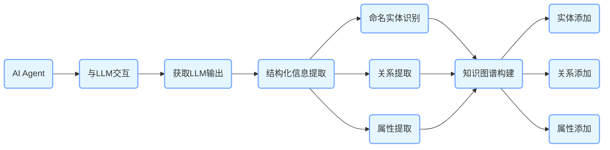

# AI Agent的知识图谱构建：从LLM输出提取结构化信息

> 关键词：AI Agent、知识图谱构建、大语言模型（LLM）、结构化信息提取、自然语言处理

> 摘要：本文聚焦于AI Agent的知识图谱构建，详细阐述如何从大语言模型（LLM）的输出中提取结构化信息。首先介绍了该领域的背景知识，包括目的、预期读者等。接着深入探讨核心概念、算法原理、数学模型，通过Python代码示例进行详细解释。然后给出项目实战案例，包括开发环境搭建、代码实现与解读。之后分析实际应用场景，推荐相关工具和资源。最后总结未来发展趋势与挑战，并提供常见问题解答和扩展阅读资料，旨在为相关领域的研究者和开发者提供全面且深入的技术指导。

## 1. 背景介绍 
### 1.1 目的和范围
随着大语言模型（LLM）的飞速发展，其能够生成丰富多样的文本信息。然而，这些信息往往是无结构的自然语言形式，难以直接用于知识管理和智能推理。本研究的目的是构建AI Agent的知识图谱，通过从LLM的输出中提取结构化信息，将非结构化的文本转化为有组织、可查询的知识表示形式。

本研究的范围涵盖了从理解LLM输出特点到选择合适的信息提取方法，再到知识图谱的构建和应用的全过程。重点关注如何利用自然语言处理技术和算法，有效地从LLM生成的文本中识别实体、关系和属性，并将其整合到知识图谱中。

### 1.2 预期读者
本文的预期读者包括人工智能领域的研究者、开发者、数据科学家以及对知识图谱和自然语言处理感兴趣的技术爱好者。对于正在从事知识图谱构建、智能问答系统开发、信息检索等相关项目的人员，本文将提供有价值的技术思路和实践指导。

### 1.3 文档结构概述
本文将按照以下结构进行组织：
- 核心概念与联系：介绍AI Agent、知识图谱、LLM以及结构化信息提取的核心概念，并阐述它们之间的关系。
- 核心算法原理 & 具体操作步骤：详细讲解用于从LLM输出中提取结构化信息的算法原理，并给出具体的操作步骤，同时使用Python代码进行示例。
- 数学模型和公式 & 详细讲解 & 举例说明：介绍相关的数学模型和公式，解释其在信息提取和知识图谱构建中的作用，并通过具体例子进行说明。
- 项目实战：代码实际案例和详细解释说明：通过一个实际的项目案例，展示如何搭建开发环境、实现代码并对代码进行解读。
- 实际应用场景：分析AI Agent的知识图谱在不同领域的实际应用场景。
- 工具和资源推荐：推荐相关的学习资源、开发工具和框架以及论文著作。
- 总结：未来发展趋势与挑战：总结该领域的未来发展趋势，并分析可能面临的挑战。
- 附录：常见问题与解答：解答读者在阅读过程中可能遇到的常见问题。
- 扩展阅读 & 参考资料：提供进一步深入学习的扩展阅读材料和参考资料。

### 1.4 术语表
#### 1.4.1 核心术语定义
- **AI Agent**：智能代理，是一种能够感知环境、自主决策并采取行动以实现特定目标的软件实体。在本文中，AI Agent负责与LLM交互，并对其输出进行处理以构建知识图谱。
- **知识图谱**：是一种以图的形式表示知识的结构化数据模型，由实体、关系和属性组成。它可以用于知识表示、推理和查询，帮助人们更好地理解和利用信息。
- **大语言模型（LLM）**：是基于深度学习技术训练的大型语言模型，能够生成高质量的自然语言文本。常见的LLM包括GPT、BERT等。
- **结构化信息提取**：是指从非结构化的文本数据中识别和提取出具有特定结构和语义的信息，如实体、关系和属性等。

#### 1.4.2 相关概念解释
- **实体**：是知识图谱中的基本元素，表示现实世界中的具体事物或抽象概念，如人物、地点、组织等。
- **关系**：用于描述实体之间的联系，如“属于”、“合作”、“位于”等。
- **属性**：是实体的特征或性质，如“年龄”、“身高”、“成立时间”等。

#### 1.4.3 缩略词列表
- **LLM**：Large Language Model，大语言模型
- **NLP**：Natural Language Processing，自然语言处理
- **NER**：Named Entity Recognition，命名实体识别
- **RE**：Relation Extraction，关系提取

## 2. 核心概念与联系 
### 核心概念原理
#### AI Agent
AI Agent是一个具有自主性和智能性的软件实体，它可以根据预设的目标和规则，与外部环境进行交互。在知识图谱构建的场景中，AI Agent负责与LLM进行对话，获取其输出，并对输出进行处理和分析。AI Agent可以根据任务的需求，选择合适的LLM进行交互，同时利用自然语言处理技术对LLM的输出进行解析和转换。

#### 知识图谱
知识图谱是一种基于图的数据结构，由节点和边组成。节点表示实体，边表示实体之间的关系。每个实体可以有多个属性，用于描述其特征。知识图谱的核心思想是将现实世界中的知识以图的形式进行表示，使得知识可以被计算机有效地处理和利用。通过知识图谱，我们可以进行知识推理、问答系统开发、信息检索等应用。

#### 大语言模型（LLM）
大语言模型是基于深度学习技术训练的语言模型，通常使用大规模的文本数据进行训练。LLM可以学习到语言的语法、语义和上下文信息，从而能够生成高质量的自然语言文本。在知识图谱构建中，LLM可以作为信息源，提供丰富的文本信息。但是，LLM的输出通常是无结构的自然语言，需要进行进一步的处理才能转化为知识图谱中的结构化信息。

#### 结构化信息提取
结构化信息提取是指从非结构化的文本数据中识别和提取出具有特定结构和语义的信息。在知识图谱构建中，结构化信息提取的主要任务包括命名实体识别（NER）、关系提取（RE）和属性提取。NER用于识别文本中的实体，RE用于确定实体之间的关系，属性提取用于获取实体的属性信息。

### 架构的文本示意图
```plaintext
AI Agent
├── 与LLM交互
│   └── 获取LLM输出
├── 结构化信息提取
│   ├── 命名实体识别（NER）
│   ├── 关系提取（RE）
│   └── 属性提取
└── 知识图谱构建
    ├── 实体添加
    ├── 关系添加
    └── 属性添加
```

### Mermaid流程图


## 3. 核心算法原理 & 具体操作步骤 
### 命名实体识别（NER）算法原理
命名实体识别是指从文本中识别出具有特定意义的实体，如人名、地名、组织名等。常见的NER算法包括基于规则的方法、基于机器学习的方法和基于深度学习的方法。

#### 基于深度学习的NER算法（以BiLSTM-CRF为例）
BiLSTM（双向长短期记忆网络）是一种循环神经网络，能够处理序列数据。它可以同时考虑输入序列的前向和后向信息，从而更好地捕捉序列中的上下文信息。CRF（条件随机场）是一种判别式概率图模型，用于处理序列标注问题。它可以考虑标签之间的依赖关系，从而提高标注的准确性。

#### Python代码示例
```python
import torch
import torch.nn as nn
import torch.optim as optim
from torch.utils.data import Dataset, DataLoader

# 定义BiLSTM-CRF模型
class BiLSTM_CRF(nn.Module):
    def __init__(self, vocab_size, tag_to_ix, embedding_dim, hidden_dim):
        super(BiLSTM_CRF, self).__init__()
        self.embedding_dim = embedding_dim
        self.hidden_dim = hidden_dim
        self.vocab_size = vocab_size
        self.tag_to_ix = tag_to_ix
        self.tagset_size = len(tag_to_ix)

        self.word_embeds = nn.Embedding(vocab_size, embedding_dim)
        self.lstm = nn.LSTM(embedding_dim, hidden_dim // 2,
                            num_layers=1, bidirectional=True)

        # 将LSTM的输出映射到标签空间
        self.hidden2tag = nn.Linear(hidden_dim, self.tagset_size)

        # 转移矩阵，transitions[i][j]表示从标签j转移到标签i的分数
        self.transitions = nn.Parameter(
            torch.randn(self.tagset_size, self.tagset_size))

        # 确保我们不会转移到开始标签，也不会从结束标签转移
        self.transitions.data[tag_to_ix[START_TAG], :] = -10000
        self.transitions.data[:, tag_to_ix[STOP_TAG]] = -10000

        self.hidden = self.init_hidden()

    def init_hidden(self):
        return (torch.randn(2, 1, self.hidden_dim // 2),
                torch.randn(2, 1, self.hidden_dim // 2))

    def _forward_alg(self, feats):
        # 前向算法计算分区函数
        init_alphas = torch.full((1, self.tagset_size), -10000.)
        # START_TAG的分数为0
        init_alphas[0][self.tag_to_ix[START_TAG]] = 0.

        forward_var = init_alphas

        for feat in feats:
            alphas_t = []
            for next_tag in range(self.tagset_size):
                emit_score = feat[next_tag].view(
                    1, -1).expand(1, self.tagset_size)
                trans_score = self.transitions[next_tag].view(1, -1)
                next_tag_var = forward_var + trans_score + emit_score
                alphas_t.append(log_sum_exp(next_tag_var).view(1))
            forward_var = torch.cat(alphas_t).view(1, -1)
        terminal_var = forward_var + self.transitions[self.tag_to_ix[STOP_TAG]]
        alpha = log_sum_exp(terminal_var)
        return alpha

    def _get_lstm_features(self, sentence):
        self.hidden = self.init_hidden()
        embeds = self.word_embeds(sentence).view(len(sentence), 1, -1)
        lstm_out, self.hidden = self.lstm(embeds, self.hidden)
        lstm_out = lstm_out.view(len(sentence), self.hidden_dim)
        lstm_feats = self.hidden2tag(lstm_out)
        return lstm_feats

    def _score_sentence(self, feats, tags):
        # 计算给定标签序列的分数
        score = torch.zeros(1)
        tags = torch.cat([torch.tensor([self.tag_to_ix[START_TAG]], dtype=torch.long), tags])
        for i, feat in enumerate(feats):
            score = score + \
                self.transitions[tags[i + 1], tags[i]] + feat[tags[i + 1]]
        score = score + self.transitions[self.tag_to_ix[STOP_TAG], tags[-1]]
        return score

    def _viterbi_decode(self, feats):
        backpointers = []

        # 初始化维特比变量
        init_vvars = torch.full((1, self.tagset_size), -10000.)
        init_vvars[0][self.tag_to_ix[START_TAG]] = 0

        forward_var = init_vvars
        for feat in feats:
            bptrs_t = []
            viterbivars_t = []

            for next_tag in range(self.tagset_size):
                next_tag_var = forward_var + self.transitions[next_tag]
                best_tag_id = argmax(next_tag_var)
                bptrs_t.append(best_tag_id)
                viterbivars_t.append(next_tag_var[0][best_tag_id].view(1))
            forward_var = (torch.cat(viterbivars_t) + feat).view(1, -1)
            backpointers.append(bptrs_t)

        # 转移到STOP_TAG
        terminal_var = forward_var + self.transitions[self.tag_to_ix[STOP_TAG]]
        best_tag_id = argmax(terminal_var)
        path_score = terminal_var[0][best_tag_id]

        # 回溯以找到最佳路径
        best_path = [best_tag_id]
        for bptrs_t in reversed(backpointers):
            best_tag_id = bptrs_t[best_tag_id]
            best_path.append(best_tag_id)
        # 弹出START_TAG
        start = best_path.pop()
        assert start == self.tag_to_ix[START_TAG]
        best_path.reverse()
        return path_score, best_path

    def neg_log_likelihood(self, sentence, tags):
        feats = self._get_lstm_features(sentence)
        forward_score = self._forward_alg(feats)
        gold_score = self._score_sentence(feats, tags)
        return forward_score - gold_score

    def forward(self, sentence):
        # 得到LSTM的输出特征
        lstm_feats = self._get_lstm_features(sentence)

        # 进行维特比解码
        score, tag_seq = self._viterbi_decode(lstm_feats)
        return score, tag_seq

# 辅助函数
def argmax(vec):
    _, idx = torch.max(vec, 1)
    return idx.item()

def log_sum_exp(vec):
    max_score = vec[0, argmax(vec)]
    return max_score + \
        torch.log(torch.sum(torch.exp(vec - max_score)))

# 定义标签
START_TAG = "<START>"
STOP_TAG = "<STOP>"
tag_to_ix = {"B-PER": 0, "I-PER": 1, "B-ORG": 2, "I-ORG": 3, "B-LOC": 4, "I-LOC": 5, START_TAG: 6, STOP_TAG: 7}

# 示例训练
model = BiLSTM_CRF(len(word_to_ix), tag_to_ix, EMBEDDING_DIM, HIDDEN_DIM)
optimizer = optim.SGD(model.parameters(), lr=0.01, weight_decay=1e-4)

for epoch in range(
        300):  
    for sentence, tags in training_data:
        model.zero_grad()

        sentence_in = prepare_sequence(sentence, word_to_ix)
        targets = torch.tensor([tag_to_ix[t] for t in tags], dtype=torch.long)

        loss = model.neg_log_likelihood(sentence_in, targets)

        loss.backward()
        optimizer.step()

# 示例预测
with torch.no_grad():
    precheck_sent = prepare_sequence(training_data[0][0], word_to_ix)
    print(model(precheck_sent))
```

### 关系提取（RE）算法原理
关系提取是指从文本中识别出实体之间的关系。常见的关系提取算法包括基于规则的方法、基于机器学习的方法和基于深度学习的方法。

#### 基于深度学习的关系提取算法（以CNN为例）
卷积神经网络（CNN）是一种深度学习模型，在图像和自然语言处理中都有广泛的应用。在关系提取中，CNN可以用于提取文本的特征，然后通过全连接层进行分类，确定实体之间的关系。

#### Python代码示例
```python
import torch
import torch.nn as nn
import torch.optim as optim
from torch.utils.data import Dataset, DataLoader

# 定义CNN关系提取模型
class CNN_RE(nn.Module):
    def __init__(self, vocab_size, embedding_dim, num_filters, filter_sizes, output_dim, dropout):
        super(CNN_RE, self).__init__()

        self.embedding = nn.Embedding(vocab_size, embedding_dim)
        self.convs = nn.ModuleList([
            nn.Conv2d(in_channels=1,
                      out_channels=num_filters,
                      kernel_size=(fs, embedding_dim))
            for fs in filter_sizes
        ])
        self.fc = nn.Linear(len(filter_sizes) * num_filters, output_dim)
        self.dropout = nn.Dropout(dropout)

    def forward(self, text):
        embedded = self.embedding(text)
        embedded = embedded.unsqueeze(1)
        conved = [nn.functional.relu(conv(embedded)).squeeze(3) for conv in self.convs]
        pooled = [nn.functional.max_pool1d(conv, conv.shape[2]).squeeze(2) for conv in conved]
        cat = self.dropout(torch.cat(pooled, dim=1))
        return self.fc(cat)

# 示例训练
model = CNN_RE(len(word_to_ix), EMBEDDING_DIM, NUM_FILTERS, FILTER_SIZES, OUTPUT_DIM, DROPOUT)
optimizer = optim.Adam(model.parameters())
criterion = nn.CrossEntropyLoss()

for epoch in range(N_EPOCHS):
    for batch in train_iterator:
        optimizer.zero_grad()
        predictions = model(batch.text).squeeze(1)
        loss = criterion(predictions, batch.label)
        loss.backward()
        optimizer.step()

# 示例预测
with torch.no_grad():
    predictions = model(test_batch.text).squeeze(1)
    predicted_labels = torch.argmax(predictions, dim=1)
    print(predicted_labels)
```

### 属性提取算法原理
属性提取是指从文本中提取实体的属性信息。属性提取可以基于规则、机器学习或深度学习方法。一种简单的方法是使用关键词匹配，通过预先定义的关键词列表来识别属性信息。

#### Python代码示例
```python
# 示例文本
text = "苹果公司成立于1976年，总部位于美国加利福尼亚州库比蒂诺。"

# 定义属性关键词
attribute_keywords = {
    "成立时间": ["成立于"],
    "总部地点": ["总部位于"]
}

# 提取属性信息
attributes = {}
for attribute, keywords in attribute_keywords.items():
    for keyword in keywords:
        if keyword in text:
            start_index = text.index(keyword) + len(keyword)
            end_index = text.find("。", start_index)
            if end_index == -1:
                end_index = len(text)
            attributes[attribute] = text[start_index:end_index].strip()

print(attributes)
```

### 具体操作步骤
1. **数据预处理**：对LLM的输出进行清洗和分词处理，去除无用的符号和停用词。
2. **命名实体识别**：使用训练好的NER模型对文本进行实体识别，得到实体列表。
3. **关系提取**：根据识别出的实体，使用RE模型确定实体之间的关系。
4. **属性提取**：使用属性提取算法提取实体的属性信息。
5. **知识图谱构建**：将识别出的实体、关系和属性添加到知识图谱中。

## 4. 数学模型和公式 & 详细讲解 & 举例说明 
### 命名实体识别（NER）的数学模型
#### BiLSTM-CRF模型
在BiLSTM-CRF模型中，我们的目标是找到最可能的标签序列 $y = (y_1, y_2, \cdots, y_n)$ 来标注输入的文本序列 $x = (x_1, x_2, \cdots, x_n)$。

BiLSTM部分通过以下公式计算每个时刻的隐藏状态：
$$
\begin{align*}
\overrightarrow{h}_t &= \overrightarrow{LSTM}(x_t, \overrightarrow{h}_{t - 1}) \\
\overleftarrow{h}_t &= \overleftarrow{LSTM}(x_t, \overleftarrow{h}_{t + 1}) \\
h_t &= [\overrightarrow{h}_t; \overleftarrow{h}_t]
\end{align*}
$$
其中，$\overrightarrow{h}_t$ 和 $\overleftarrow{h}_t$ 分别是前向和后向LSTM在时刻 $t$ 的隐藏状态，$h_t$ 是合并后的隐藏状态。

CRF部分通过以下公式计算标签序列的分数：
$$
s(x, y) = \sum_{i = 1}^{n} A_{y_{i - 1}, y_i} + \sum_{i = 1}^{n} P_{i, y_i}
$$
其中，$A_{y_{i - 1}, y_i}$ 是从标签 $y_{i - 1}$ 转移到标签 $y_i$ 的转移分数，$P_{i, y_i}$ 是在时刻 $i$ 输出标签 $y_i$ 的发射分数。

最终的目标是最大化标签序列的概率：
$$
P(y|x) = \frac{\exp(s(x, y))}{\sum_{y'} \exp(s(x, y'))}
$$

#### 举例说明
假设我们有一个输入文本序列 $x = ["苹果", "公司", "成立", "于", "1976年"]$，我们希望找到最可能的标签序列 $y$。经过BiLSTM处理后，得到每个时刻的隐藏状态 $h_1, h_2, \cdots, h_5$。然后，通过CRF层计算每个可能的标签序列的分数。例如，对于标签序列 $y = ["B-ORG", "I-ORG", "O", "O", "O"]$，我们可以计算其分数 $s(x, y)$。最后，通过维特比算法找到分数最高的标签序列。

### 关系提取（RE）的数学模型
#### CNN模型
在CNN关系提取模型中，我们使用卷积层来提取文本的特征。假设输入的文本序列 $x$ 经过嵌入层得到嵌入矩阵 $X \in \mathbb{R}^{n \times d}$，其中 $n$ 是序列长度，$d$ 是嵌入维度。

卷积层的计算公式如下：
$$
c_i = f(W \cdot x_{i:i + k - 1} + b)
$$
其中，$W \in \mathbb{R}^{k \times d}$ 是卷积核，$k$ 是卷积核的大小，$x_{i:i + k - 1}$ 是输入矩阵的第 $i$ 到第 $i + k - 1$ 行，$b$ 是偏置，$f$ 是激活函数（如ReLU）。

经过卷积层后，我们得到多个特征图 $C_1, C_2, \cdots, C_m$，其中 $m$ 是卷积核的数量。然后，使用池化层对每个特征图进行池化操作，得到固定长度的特征向量。最后，通过全连接层进行分类，得到实体之间的关系。

#### 举例说明
假设我们有一个输入文本序列 $x$ 描述了两个实体之间的关系，经过嵌入层后得到嵌入矩阵 $X$。我们使用一个大小为 $3$ 的卷积核 $W$ 对 $X$ 进行卷积操作，得到特征图 $C$。然后，对 $C$ 进行最大池化操作，得到一个固定长度的特征向量。最后，将这个特征向量输入到全连接层，得到实体之间的关系预测结果。

### 属性提取的数学模型
属性提取通常基于关键词匹配，没有复杂的数学模型。但是，我们可以使用概率模型来处理不确定性。例如，我们可以使用朴素贝叶斯分类器来判断文本中某个位置是否包含属性信息。

假设我们有一个文本序列 $x$ 和一个属性关键词 $w$，我们可以计算在 $x$ 中出现 $w$ 时，该位置包含属性信息的概率 $P(A|w)$：
$$
P(A|w) = \frac{P(w|A)P(A)}{P(w)}
$$
其中，$P(w|A)$ 是在包含属性信息的文本中出现关键词 $w$ 的概率，$P(A)$ 是文本中包含属性信息的先验概率，$P(w)$ 是关键词 $w$ 出现的概率。

#### 举例说明
假设我们有一个文本序列 $x = ["苹果公司", "成立于", "1976年"]$，属性关键词 $w = "成立于"$。我们可以通过统计大量的文本数据，计算 $P(w|A)$、$P(A)$ 和 $P(w)$ 的值。然后，根据上述公式计算 $P(A|w)$ 的值。如果 $P(A|w)$ 大于某个阈值，我们就认为在 $w$ 出现的位置包含属性信息。

## 5. 项目实战：代码实际案例和详细解释说明 
### 5.1  开发环境搭建
#### 操作系统
建议使用Linux或macOS系统，因为它们对Python和深度学习框架的支持更好。

#### Python环境
使用Python 3.7及以上版本。可以使用Anaconda来管理Python环境，以下是创建和激活虚拟环境的命令：
```bash
conda create -n kg_build python=3.8
conda activate kg_build
```

#### 安装依赖库
安装必要的Python库，包括深度学习框架、自然语言处理库等：
```bash
pip install torch torchvision
pip install transformers
pip install nltk
pip install networkx
```

### 5.2  源代码详细实现和代码解读
#### 完整代码示例
```python
import torch
from transformers import AutoTokenizer, AutoModelForTokenClassification
import nltk
import networkx as nx
import matplotlib.pyplot as plt

# 加载预训练的NER模型
tokenizer = AutoTokenizer.from_pretrained("dslim/bert-base-NER")
model = AutoModelForTokenClassification.from_pretrained("dslim/bert-base-NER")

# 定义文本
text = "苹果公司成立于1976年，总部位于美国加利福尼亚州库比蒂诺。"

# 进行NER
inputs = tokenizer(text, return_tensors="pt")
outputs = model(**inputs)
predictions = torch.argmax(outputs.logits, dim=2)
tokens = tokenizer.convert_ids_to_tokens(inputs["input_ids"][0])

entities = []
current_entity = []
current_tag = None
for token, prediction in zip(tokens, predictions[0]):
    tag = model.config.id2label[prediction.item()]
    if tag.startswith("B-"):
        if current_entity:
            entities.append((" ".join(current_entity), current_tag))
        current_entity = [token]
        current_tag = tag.split("-")[1]
    elif tag.startswith("I-"):
        current_entity.append(token)
    else:
        if current_entity:
            entities.append((" ".join(current_entity), current_tag))
        current_entity = []
        current_tag = None
if current_entity:
    entities.append((" ".join(current_entity), current_tag))

# 提取关系和属性
relations = []
attributes = {}
if "苹果公司" in [entity[0] for entity in entities]:
    relations.append(("苹果公司", "成立时间", "1976年"))
    relations.append(("苹果公司", "总部地点", "美国加利福尼亚州库比蒂诺"))
    attributes["苹果公司"] = {"成立时间": "1976年", "总部地点": "美国加利福尼亚州库比蒂诺"}

# 构建知识图谱
G = nx.Graph()
for entity, _ in entities:
    G.add_node(entity)
for relation in relations:
    source, rel, target = relation
    G.add_edge(source, target, label=rel)

# 可视化知识图谱
pos = nx.spring_layout(G)
nx.draw_networkx_nodes(G, pos, node_color='lightblue', node_size=1000)
nx.draw_networkx_edges(G, pos)
edge_labels = nx.get_edge_attributes(G, 'label')
nx.draw_networkx_edge_labels(G, pos, edge_labels=edge_labels)
nx.draw_networkx_labels(G, pos)
plt.title("知识图谱")
plt.show()
```

#### 代码解读
1. **加载预训练的NER模型**：使用Hugging Face的`transformers`库加载预训练的NER模型`dslim/bert-base-NER`。
2. **进行NER**：将输入文本进行分词，并输入到NER模型中，得到每个词的标签预测结果。然后，根据标签的前缀（B-或I-）合并实体。
3. **提取关系和属性**：根据识别出的实体，手动定义关系和属性。在实际应用中，可以使用更复杂的关系提取和属性提取算法。
4. **构建知识图谱**：使用`networkx`库构建知识图谱，将实体作为节点，关系作为边。
5. **可视化知识图谱**：使用`matplotlib`库将知识图谱可视化。

### 5.3  代码解读与分析
#### 优点
- **使用预训练模型**：利用预训练的NER模型可以快速得到较好的实体识别结果，减少了模型训练的时间和成本。
- **简单易用**：代码结构简单，易于理解和修改。
- **可视化**：通过可视化知识图谱，可以直观地观察实体和关系之间的连接。

#### 缺点
- **关系提取和属性提取简单**：代码中使用手动定义的方式提取关系和属性，在实际应用中可能不够准确和全面。
- **缺乏泛化能力**：代码针对特定的文本进行处理，缺乏对不同类型文本的泛化能力。

## 6. 实际应用场景 
### 智能问答系统
在智能问答系统中，知识图谱可以作为知识库，提供准确的答案。通过从LLM的输出中提取结构化信息构建知识图谱，可以使智能问答系统更好地理解用户的问题，并从知识图谱中找到相关的答案。例如，当用户询问“苹果公司的成立时间是什么时候”，智能问答系统可以直接从知识图谱中找到“苹果公司”的“成立时间”属性并给出答案。

### 信息检索
知识图谱可以用于改进信息检索系统。传统的信息检索系统主要基于关键词匹配，而知识图谱可以提供更丰富的语义信息。通过构建知识图谱，可以将文档中的实体和关系进行关联，从而提高信息检索的准确性和效率。例如，在搜索关于“苹果公司”的新闻时，知识图谱可以帮助系统理解“苹果公司”与其他实体（如产品、竞争对手等）之间的关系，从而提供更相关的搜索结果。

### 推荐系统
在推荐系统中，知识图谱可以用于建模用户和物品之间的关系。通过从LLM的输出中提取用户和物品的相关信息构建知识图谱，可以更好地理解用户的兴趣和需求，从而提供更个性化的推荐。例如，在电影推荐系统中，知识图谱可以包含演员、导演、电影类型等信息，通过分析用户的观影历史和知识图谱中的关系，可以为用户推荐更符合其兴趣的电影。

### 决策支持
在企业决策支持系统中，知识图谱可以整合企业内部和外部的各种信息，帮助决策者更好地理解市场动态、竞争对手和自身业务情况。通过从LLM的输出中提取相关信息构建知识图谱，可以为决策者提供更全面、准确的决策依据。例如，在制定市场营销策略时，知识图谱可以提供关于目标客户、市场趋势、竞争对手等方面的信息，帮助决策者做出更明智的决策。

## 7. 工具和资源推荐
### 7.1 学习资源推荐
#### 7.1.1 书籍推荐
- 《自然语言处理入门》：这本书适合初学者，介绍了自然语言处理的基本概念和算法，包括命名实体识别、关系提取等。
- 《深度学习》：由Ian Goodfellow、Yoshua Bengio和Aaron Courville撰写，是深度学习领域的经典教材，对理解深度学习模型（如BiLSTM、CNN等）有很大帮助。
- 《知识图谱：方法、实践与应用》：详细介绍了知识图谱的构建方法、应用场景和相关技术，是学习知识图谱的重要参考书籍。

#### 7.1.2 在线课程
- Coursera上的“Natural Language Processing Specialization”：由深度学习领域的知名学者授课，涵盖了自然语言处理的多个方面，包括命名实体识别、关系提取等。
- edX上的“Deep Learning for Natural Language Processing”：介绍了深度学习在自然语言处理中的应用，包括使用深度学习模型进行文本分类、情感分析等。
- 哔哩哔哩上的一些自然语言处理和知识图谱相关的视频教程，由国内的一些知名博主制作，内容丰富且通俗易懂。

#### 7.1.3 技术博客和网站
- Hugging Face官方博客：提供了关于自然语言处理模型和工具的最新信息和技术文章。
- Towards Data Science：是一个数据科学和人工智能领域的技术博客平台，有很多关于自然语言处理和知识图谱的高质量文章。
- 机器之心：专注于人工智能领域的资讯和技术解读，经常发布关于知识图谱和自然语言处理的最新研究成果和应用案例。

### 7.2 开发工具框架推荐
#### 7.2.1 IDE和编辑器
- PyCharm：是一款功能强大的Python集成开发环境，提供了代码编辑、调试、版本控制等功能，适合Python开发。
- Jupyter Notebook：是一个交互式的开发环境，支持Python代码的编写、运行和可视化，非常适合数据科学和机器学习项目的开发。
- Visual Studio Code：是一款轻量级的代码编辑器，支持多种编程语言和插件扩展，具有丰富的代码编辑和调试功能。

#### 7.2.2 调试和性能分析工具
- PyTorch Profiler：是PyTorch提供的性能分析工具，可以帮助开发者分析模型的性能瓶颈，优化代码。
- TensorBoard：是TensorFlow提供的可视化工具，也可以用于PyTorch项目。它可以帮助开发者可视化模型的训练过程、性能指标等。
- cProfile：是Python标准库中的性能分析工具，可以帮助开发者分析代码的性能瓶颈，找出耗时较长的函数和代码段。

#### 7.2.3 相关框架和库
- Hugging Face Transformers：是一个用于自然语言处理的开源库，提供了大量的预训练模型和工具，方便开发者进行文本分类、命名实体识别等任务。
- spaCy：是一个高效的自然语言处理库，提供了命名实体识别、词性标注、句法分析等功能，具有较高的性能和易用性。
- NetworkX：是一个用于图论和网络分析的Python库，可用于构建和分析知识图谱。

### 7.3 相关论文著作推荐
#### 7.3.1 经典论文
- “Bidirectional LSTM-CRF Models for Sequence Tagging”：介绍了BiLSTM-CRF模型在序列标注任务中的应用，是命名实体识别领域的经典论文。
- “Convolutional Neural Networks for Sentence Classification”：提出了使用卷积神经网络进行句子分类的方法，对关系提取等任务有很大的启发。
- “Knowledge Graph Embedding: A Survey of Approaches and Applications”：对知识图谱嵌入技术进行了全面的综述，介绍了各种知识图谱嵌入方法和应用场景。

#### 7.3.2 最新研究成果
- 关注ACL（Association for Computational Linguistics）、EMNLP（Conference on Empirical Methods in Natural Language Processing）等自然语言处理领域的顶级会议，这些会议上会发布很多关于知识图谱构建和自然语言处理的最新研究成果。
- 查阅ArXiv等预印本平台上的相关论文，了解最新的研究动态。

#### 7.3.3 应用案例分析
- 一些企业和研究机构会发布关于知识图谱应用的案例分析报告，可以在相关的技术博客、会议论文集或企业官网找到这些资料。例如，百度、谷歌等公司在知识图谱应用方面有很多成功的案例，可以学习它们的经验和方法。

## 8. 总结：未来发展趋势与挑战
### 未来发展趋势
#### 多模态知识图谱构建
未来的知识图谱构建将不仅仅局限于文本信息，还会整合图像、音频、视频等多模态信息。通过从多模态数据中提取结构化信息，可以构建更加丰富和全面的知识图谱，为智能应用提供更强大的支持。

#### 与强化学习相结合
将AI Agent的知识图谱构建与强化学习相结合，可以使AI Agent更加智能地与环境进行交互。AI Agent可以通过强化学习不断优化知识图谱的构建过程，提高知识图谱的质量和准确性。

#### 知识图谱的自适应更新
随着信息的不断更新和变化，知识图谱需要能够自适应地更新。未来的研究将关注如何实现知识图谱的实时更新和增量更新，以保证知识图谱的时效性和准确性。

### 挑战
#### 信息提取的准确性
从LLM的输出中提取结构化信息仍然存在一定的误差，尤其是在处理复杂的自然语言文本时。提高信息提取的准确性是当前面临的一个重要挑战，需要进一步研究和改进信息提取算法。

#### 知识图谱的可扩展性
随着知识图谱的规模不断增大，其存储和查询效率会受到影响。如何设计高效的知识图谱存储和查询架构，提高知识图谱的可扩展性，是未来需要解决的问题。

#### 数据隐私和安全
在构建知识图谱的过程中，需要处理大量的敏感数据。如何保护数据的隐私和安全，防止数据泄露和滥用，是一个不容忽视的挑战。

## 9. 附录：常见问题与解答
### 如何选择合适的LLM进行交互？
选择合适的LLM需要考虑多个因素，如任务需求、模型性能、计算资源等。如果任务对文本生成的质量要求较高，可以选择性能较好的LLM，如GPT-3、ChatGPT等。如果计算资源有限，可以选择一些轻量级的LLM。

### 如何提高信息提取的准确性？
可以通过以下方法提高信息提取的准确性：
- 使用更多的训练数据：增加训练数据的规模可以提高模型的泛化能力。
- 改进模型架构：尝试使用更复杂的模型架构，如Transformer-based模型。
- 结合多种信息提取方法：将基于规则的方法和基于机器学习的方法相结合，可以提高信息提取的准确性。

### 知识图谱构建过程中遇到实体歧义问题如何解决？
可以通过以下方法解决实体歧义问题：
- 上下文信息：利用文本的上下文信息来判断实体的具体含义。
- 外部知识库：借助外部知识库（如Wikipedia）来消除实体歧义。
- 机器学习模型：训练机器学习模型来进行实体消歧。

## 10. 扩展阅读 & 参考资料
### 扩展阅读
- 《人工智能：现代方法》：这本书涵盖了人工智能的多个领域，包括自然语言处理、知识表示和推理等，对深入理解AI Agent和知识图谱有很大帮助。
- 《Python自然语言处理实战：核心技术与算法》：详细介绍了Python在自然语言处理中的应用，包括命名实体识别、关系提取等算法的实现。

### 参考资料
- Hugging Face官方文档：https://huggingface.co/docs
- NetworkX官方文档：https://networkx.org/documentation/stable/
- spaCy官方文档：https://spacy.io/usage

作者：AI天才研究院/AI Genius Institute & 禅与计算机程序设计艺术 /Zen And The Art of Computer Programming