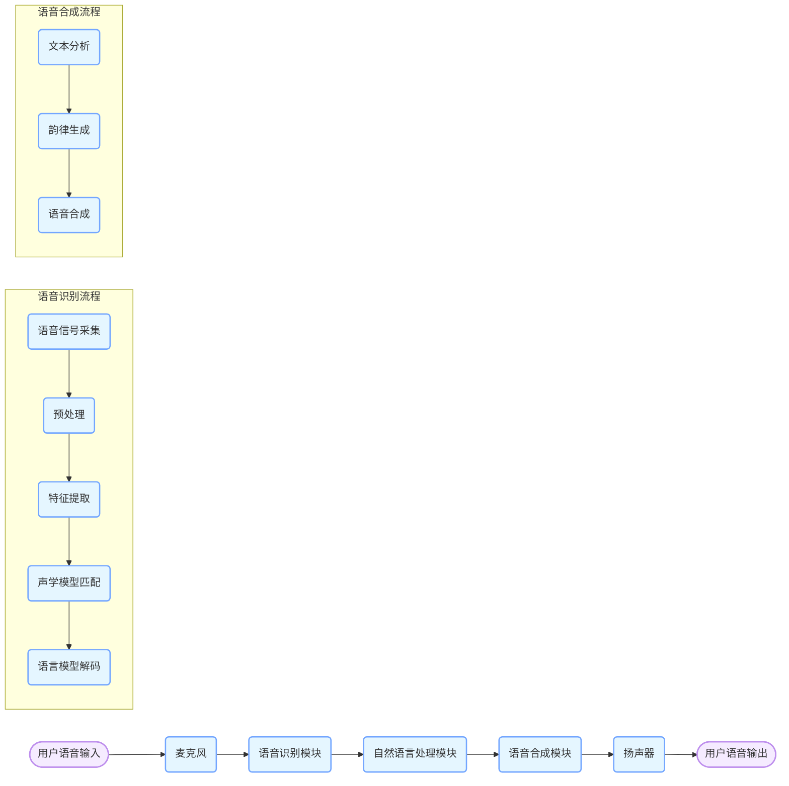

# AI Agent的语音交互设计：语音识别与合成

> 关键词：AI Agent、语音交互设计、语音识别、语音合成、自然语言处理

> 摘要：本文聚焦于AI Agent的语音交互设计，深入探讨语音识别与合成的关键技术。详细介绍了相关核心概念、算法原理、数学模型，并结合实际项目案例进行分析。同时阐述了语音交互在不同场景下的应用，推荐了学习资源、开发工具和相关论文，最后对未来发展趋势与挑战进行总结，为从事AI Agent语音交互设计的开发者和研究者提供全面的技术指导。

## 1. 背景介绍 
### 1.1 目的和范围
随着人工智能技术的飞速发展，AI Agent在各个领域的应用越来越广泛。语音交互作为一种自然、便捷的人机交互方式，成为了AI Agent与用户沟通的重要手段。本文的目的是深入研究AI Agent的语音交互设计，重点关注语音识别与合成技术。涵盖了从基础概念到算法原理，再到实际应用和未来发展的全方位内容，旨在为读者提供一个系统、深入的学习和研究框架。

### 1.2 预期读者
本文预期读者包括人工智能领域的开发者、研究者，语音交互系统的设计师，以及对AI Agent语音交互技术感兴趣的技术爱好者。无论您是初学者希望了解基本概念，还是有一定经验的专业人士想要深入研究算法和应用，本文都将为您提供有价值的信息。

### 1.3 文档结构概述
本文将按照以下结构展开：首先介绍语音识别与合成的核心概念及其联系，接着详细阐述核心算法原理和具体操作步骤，并给出相应的Python代码示例。然后讲解相关的数学模型和公式，并通过举例进行说明。之后通过项目实战，展示代码的实际应用和详细解释。再介绍语音交互在实际场景中的应用，推荐学习资源、开发工具和相关论文。最后总结未来发展趋势与挑战，并提供常见问题解答和扩展阅读参考资料。

### 1.4 术语表
#### 1.4.1 核心术语定义
- **AI Agent**：人工智能代理，是一种能够感知环境、自主决策并采取行动以实现特定目标的软件或硬件系统。
- **语音识别（Speech Recognition）**：将人类语音中的词汇内容转换为计算机可读的输入，例如文本的技术。
- **语音合成（Text-to-Speech, TTS）**：将计算机生成的文本转换为自然流畅的语音输出的技术。
- **自然语言处理（Natural Language Processing, NLP）**：研究计算机与人类自然语言之间交互的技术，旨在让计算机理解、分析和生成自然语言。

#### 1.4.2 相关概念解释
- **声学模型（Acoustic Model）**：语音识别中用于描述语音信号特征与语音单元（如音素）之间关系的模型。
- **语言模型（Language Model）**：用于评估语言序列出现概率的模型，在语音识别和自然语言处理中用于提高识别的准确性。
- **韵律特征（Prosodic Features）**：语音中的节奏、语调、重音等特征，对于语音合成的自然度至关重要。

#### 1.4.3 缩略词列表
- **ASR**：Automatic Speech Recognition，自动语音识别
- **TTS**：Text-to-Speech，文本到语音
- **NLP**：Natural Language Processing，自然语言处理
- **HMM**：Hidden Markov Model，隐马尔可夫模型
- **DNN**：Deep Neural Network，深度神经网络
- **RNN**：Recurrent Neural Network，循环神经网络
- **LSTM**：Long Short-Term Memory，长短期记忆网络

## 2. 核心概念与联系 
### 2.1 语音识别的核心概念
语音识别的目标是将语音信号转换为文本。其基本流程包括语音信号的采集、预处理、特征提取、声学模型匹配和语言模型解码。
- **语音信号采集**：通过麦克风等设备将语音信号转换为电信号。
- **预处理**：对采集到的语音信号进行滤波、降噪等处理，以提高信号质量。
- **特征提取**：从预处理后的语音信号中提取具有代表性的特征，如梅尔频率倒谱系数（MFCC）。
- **声学模型匹配**：将提取的特征与声学模型中的语音单元进行匹配，找出最可能的语音单元序列。
- **语言模型解码**：结合语言模型，对声学模型输出的语音单元序列进行解码，得到最终的文本结果。

### 2.2 语音合成的核心概念
语音合成的任务是将文本转换为自然流畅的语音。其主要步骤包括文本分析、韵律生成和语音合成。
- **文本分析**：对输入的文本进行语法、语义分析，确定语音的基本信息，如发音、语调等。
- **韵律生成**：根据文本分析的结果，生成语音的韵律特征，如节奏、重音等。
- **语音合成**：根据韵律特征和发音信息，合成自然流畅的语音信号。

### 2.3 语音识别与合成的联系
语音识别和语音合成是语音交互系统的两个重要组成部分，它们相互关联、相互影响。语音识别为语音合成提供输入，而语音合成则为语音识别的结果提供反馈。在实际应用中，它们通常结合使用，形成一个完整的语音交互闭环。例如，在智能语音助手系统中，用户通过语音输入问题，语音识别模块将语音转换为文本，然后自然语言处理模块对文本进行理解和处理，最后语音合成模块将处理结果转换为语音输出给用户。

### 2.4 核心概念原理和架构的文本示意图
```plaintext
语音交互系统架构

用户 <---> 麦克风 <---> 语音识别模块 <---> 自然语言处理模块 <---> 语音合成模块 <---> 扬声器 <---> 用户

|--------------------- 语音识别流程 ---------------------|
| 语音信号采集 --> 预处理 --> 特征提取 --> 声学模型匹配 --> 语言模型解码 |

|--------------------- 语音合成流程 ---------------------|
| 文本分析 --> 韵律生成 --> 语音合成 |
```

### 2.5 Mermaid 流程图


## 3. 核心算法原理 & 具体操作步骤 
### 3.1 语音识别算法原理
#### 3.1.1 隐马尔可夫模型（HMM）
隐马尔可夫模型是一种统计模型，常用于语音识别中的声学建模。它假设语音信号是由一系列隐藏状态序列生成的，每个隐藏状态对应一个语音单元（如音素）。HMM由状态转移概率、观测概率和初始状态概率三个参数组成。

以下是一个简单的HMM实现示例：
```python
import numpy as np

# 定义HMM参数
states = ('Healthy', 'Fever')
observations = ('normal', 'cold', 'dizzy')
start_probability = {'Healthy': 0.6, 'Fever': 0.4}
transition_probability = {
    'Healthy': {'Healthy': 0.7, 'Fever': 0.3},
    'Fever': {'Healthy': 0.4, 'Fever': 0.6}
}
emission_probability = {
    'Healthy': {'normal': 0.5, 'cold': 0.4, 'dizzy': 0.1},
    'Fever': {'normal': 0.1, 'cold': 0.3, 'dizzy': 0.6}
}

def viterbi(obs, states, start_p, trans_p, emit_p):
    V = [{}]
    path = {}

    # 初始化第一步
    for y in states:
        V[0][y] = start_p[y] * emit_p[y][obs[0]]
        path[y] = [y]

    # 递推计算
    for t in range(1, len(obs)):
        V.append({})
        newpath = {}
        for y in states:
            (prob, state) = max((V[t - 1][y0] * trans_p[y0][y] * emit_p[y][obs[t]], y0) for y0 in states)
            V[t][y] = prob
            newpath[y] = path[state] + [y]
        path = newpath

    # 终止步骤
    (prob, state) = max((V[len(obs) - 1][y], y) for y in states)
    return (prob, path[state])

# 测试
obs = ('normal', 'cold', 'dizzy')
result = viterbi(obs, states, start_probability, transition_probability, emission_probability)
print("最可能的状态序列:", result[1])
```

#### 3.1.2 深度神经网络（DNN）
深度神经网络在语音识别中取得了巨大的成功。它可以自动学习语音信号的复杂特征，提高识别的准确性。常见的DNN结构包括前馈神经网络（FNN）、卷积神经网络（CNN）和循环神经网络（RNN）等。

以下是一个简单的基于Keras的DNN语音识别模型示例：
```python
import numpy as np
from keras.models import Sequential
from keras.layers import Dense

# 生成示例数据
X_train = np.random.rand(100, 10)
y_train = np.random.randint(0, 2, 100)

# 构建DNN模型
model = Sequential()
model.add(Dense(64, activation='relu', input_dim=10))
model.add(Dense(1, activation='sigmoid'))

# 编译模型
model.compile(optimizer='adam', loss='binary_crossentropy', metrics=['accuracy'])

# 训练模型
model.fit(X_train, y_train, epochs=10, batch_size=32)
```

### 3.2 语音合成算法原理
#### 3.2.1 基于拼接的语音合成
基于拼接的语音合成方法是将预先录制的语音片段拼接起来，生成所需的语音。它的优点是合成的语音质量高，但需要大量的语音数据和复杂的拼接算法。

#### 3.2.2 基于参数的语音合成
基于参数的语音合成方法是通过数学模型生成语音的参数，如基频、共振峰等，然后根据这些参数合成语音。常见的基于参数的语音合成模型包括线性预测倒谱系数（LPCC）和梅尔倒谱系数（MFCC）等。

以下是一个简单的基于Python的TTS示例，使用`gTTS`库：
```python
from gtts import gTTS
import os

text = "Hello, this is a test of text-to-speech."
tts = gTTS(text=text, lang='en')
tts.save("test.mp3")
os.system("mpg321 test.mp3")
```

### 3.3 具体操作步骤
#### 3.3.1 语音识别操作步骤
1. **数据准备**：收集大量的语音数据，并进行标注。
2. **特征提取**：使用合适的特征提取方法，如MFCC，从语音数据中提取特征。
3. **模型训练**：使用训练数据对声学模型和语言模型进行训练。
4. **模型评估**：使用测试数据对训练好的模型进行评估，调整模型参数。
5. **部署应用**：将训练好的模型部署到实际应用中，进行语音识别。

#### 3.3.2 语音合成操作步骤
1. **文本处理**：对输入的文本进行语法、语义分析。
2. **韵律生成**：根据文本分析的结果，生成语音的韵律特征。
3. **语音合成**：根据韵律特征和发音信息，合成自然流畅的语音信号。
4. **音频输出**：将合成的语音信号转换为音频文件或直接输出到扬声器。

## 4. 数学模型和公式 & 详细讲解 & 举例说明 
### 4.1 语音识别中的数学模型和公式
#### 4.1.1 隐马尔可夫模型（HMM）公式
隐马尔可夫模型的三个基本参数可以用以下公式表示：
- 状态转移概率矩阵 $A = [a_{ij}]$，其中 $a_{ij} = P(q_{t+1}=j|q_t=i)$ 表示从状态 $i$ 转移到状态 $j$ 的概率。
- 观测概率矩阵 $B = [b_j(k)]$，其中 $b_j(k) = P(O_t = v_k|q_t = j)$ 表示在状态 $j$ 下观测到符号 $v_k$ 的概率。
- 初始状态概率向量 $\pi = [\pi_i]$，其中 $\pi_i = P(q_1 = i)$ 表示初始时刻处于状态 $i$ 的概率。

HMM的三个基本问题包括：
1. **评估问题**：计算给定观测序列 $O = \{o_1, o_2, \cdots, o_T\}$ 和模型 $\lambda = (A, B, \pi)$ 的概率 $P(O|\lambda)$。可以使用前向算法或后向算法来解决。
2. **解码问题**：寻找最可能的隐藏状态序列 $Q = \{q_1, q_2, \cdots, q_T\}$，使得 $P(Q|O, \lambda)$ 最大。可以使用维特比算法来解决。
3. **学习问题**：根据观测序列 $O$ 估计模型参数 $\lambda = (A, B, \pi)$，使得 $P(O|\lambda)$ 最大。可以使用鲍姆 - 韦尔奇算法来解决。

#### 4.1.2 深度神经网络（DNN）公式
深度神经网络的基本结构是由多个神经元组成的层，每个神经元的输出可以表示为：
$$
y = f(\sum_{i=1}^{n} w_i x_i + b)
$$
其中 $x_i$ 是输入，$w_i$ 是权重，$b$ 是偏置，$f$ 是激活函数。常见的激活函数包括 sigmoid 函数、ReLU 函数等。

### 4.2 语音合成中的数学模型和公式
#### 4.2.1 线性预测倒谱系数（LPCC）公式
线性预测倒谱系数是通过线性预测分析得到的语音特征。线性预测分析的基本思想是用过去的 $p$ 个语音样本预测当前的语音样本，其公式为：
$$
s(n) = \sum_{k=1}^{p} a_k s(n - k) + e(n)
$$
其中 $s(n)$ 是当前的语音样本，$a_k$ 是线性预测系数，$e(n)$ 是预测误差。通过对线性预测系数进行变换，可以得到线性预测倒谱系数。

#### 4.2.2 梅尔倒谱系数（MFCC）公式
梅尔倒谱系数是一种广泛应用于语音识别和合成的特征。其计算步骤包括：
1. **预加重**：对语音信号进行预加重处理，增强高频部分。
2. **分帧加窗**：将语音信号分成若干帧，并加窗处理。
3. **快速傅里叶变换（FFT）**：对每一帧语音信号进行FFT变换，得到频谱。
4. **梅尔滤波器组**：将频谱通过梅尔滤波器组，得到梅尔频谱。
5. **对数运算**：对梅尔频谱取对数。
6. **离散余弦变换（DCT）**：对取对数后的梅尔频谱进行DCT变换，得到MFCC系数。

### 4.3 举例说明
#### 4.3.1 语音识别举例
假设我们有一个简单的语音识别任务，要识别语音中的数字 0 - 9。我们可以使用HMM作为声学模型，对每个数字的语音信号进行建模。训练数据包括大量的数字语音样本及其对应的标签。在识别时，将待识别的语音信号提取特征，然后使用维特比算法在HMM模型中寻找最可能的数字序列。

#### 4.3.2 语音合成举例
假设我们要合成一句“你好，欢迎光临”的语音。首先对文本进行语法、语义分析，确定每个字的发音和语调。然后根据韵律生成规则，生成语音的韵律特征，如节奏、重音等。最后使用基于参数的语音合成方法，根据发音信息和韵律特征合成语音信号。

## 5. 项目实战：代码实际案例和详细解释说明 
### 5.1 开发环境搭建
#### 5.1.1 安装Python
首先需要安装Python，建议使用Python 3.6及以上版本。可以从Python官方网站（https://www.python.org/downloads/）下载并安装。

#### 5.1.2 安装必要的库
使用`pip`命令安装以下必要的库：
```bash
pip install numpy keras gTTS pyaudio librosa
```
- `numpy`：用于数值计算。
- `keras`：用于构建深度学习模型。
- `gTTS`：用于文本到语音合成。
- `pyaudio`：用于语音信号的采集和播放。
- `librosa`：用于语音信号的处理和特征提取。

### 5.2 源代码详细实现和代码解读
#### 5.2.1 语音识别示例
```python
import librosa
import numpy as np
from keras.models import load_model

# 加载训练好的模型
model = load_model('speech_recognition_model.h5')

# 加载语音文件并提取特征
def extract_features(file_path):
    audio, sample_rate = librosa.load(file_path)
    mfccs = librosa.feature.mfcc(y=audio, sr=sample_rate, n_mfcc=13)
    mfccs_processed = np.mean(mfccs.T, axis=0)
    return mfccs_processed

# 预测语音文件的标签
def predict_label(file_path):
    features = extract_features(file_path)
    features = np.array(features).reshape(1, -1)
    prediction = model.predict(features)
    predicted_label = np.argmax(prediction)
    return predicted_label

# 测试
file_path = 'test.wav'
predicted_label = predict_label(file_path)
print("预测的标签:", predicted_label)
```
代码解读：
1. **加载模型**：使用`load_model`函数加载训练好的语音识别模型。
2. **提取特征**：定义`extract_features`函数，使用`librosa`库加载语音文件并提取MFCC特征。
3. **预测标签**：定义`predict_label`函数，将提取的特征输入到模型中进行预测，返回预测的标签。
4. **测试**：选择一个语音文件进行测试，打印预测的标签。

#### 5.2.2 语音合成示例
```python
from gtts import gTTS
import os

# 输入文本
text = "这是一个语音合成的测试。"

# 创建TTS对象
tts = gTTS(text=text, lang='zh-CN')

# 保存为音频文件
tts.save("test_synthesis.mp3")

# 播放音频文件
os.system("mpg321 test_synthesis.mp3")
```
代码解读：
1. **输入文本**：定义要合成的文本。
2. **创建TTS对象**：使用`gTTS`库创建TTS对象，指定文本和语言。
3. **保存为音频文件**：使用`save`方法将合成的语音保存为MP3文件。
4. **播放音频文件**：使用`os.system`命令调用`mpg321`播放器播放音频文件。

### 5.3 代码解读与分析
#### 5.3.1 语音识别代码分析
- **特征提取**：使用`librosa`库提取MFCC特征，这是一种常用的语音特征。通过对MFCC特征进行均值处理，将特征向量转换为一维向量，以便输入到模型中。
- **模型预测**：使用训练好的深度学习模型对提取的特征进行预测，返回预测的标签。
- **局限性**：该示例代码只是一个简单的语音识别示例，实际应用中需要更多的训练数据和更复杂的模型来提高识别的准确性。

#### 5.3.2 语音合成代码分析
- **使用gTTS库**：`gTTS`是一个简单易用的文本到语音合成库，支持多种语言。
- **保存和播放音频文件**：将合成的语音保存为MP3文件，并使用`mpg321`播放器播放。
- **局限性**：`gTTS`库合成的语音质量有限，对于一些复杂的语音合成任务，可能需要使用更专业的语音合成引擎。

## 6. 实际应用场景 
### 6.1 智能语音助手
智能语音助手如苹果的Siri、亚马逊的Alexa和谷歌助手等，是语音交互技术的典型应用。用户可以通过语音与助手进行交互，查询信息、控制设备、播放音乐等。语音识别技术将用户的语音转换为文本，自然语言处理技术对文本进行理解和处理，语音合成技术将处理结果转换为语音输出给用户。

### 6.2 智能家居
在智能家居系统中，语音交互可以实现对家电设备的远程控制。用户可以通过语音指令打开或关闭灯光、调节温度、播放音乐等。语音识别和合成技术使得用户可以更加方便、自然地与智能家居设备进行交互。

### 6.3 车载系统
车载语音交互系统可以让驾驶员在驾驶过程中通过语音指令进行导航、打电话、播放音乐等操作，提高驾驶的安全性和便利性。语音识别技术可以准确识别驾驶员的语音指令，语音合成技术可以将导航信息、提醒信息等以语音的形式输出给驾驶员。

### 6.4 客户服务
在客户服务领域，语音交互可以实现自动语音应答系统（IVR）和智能客服机器人。用户可以通过语音与系统进行交互，查询信息、解决问题。语音识别和合成技术可以提高客户服务的效率和质量，减少人工客服的工作量。

### 6.5 教育领域
在教育领域，语音交互可以用于智能学习辅助系统。学生可以通过语音与系统进行交互，提问、查询资料、进行口语练习等。语音识别和合成技术可以提供更加个性化、互动性强的学习体验。

## 7. 工具和资源推荐
### 7.1 学习资源推荐
#### 7.1.1 书籍推荐
- 《语音识别原理与应用》：全面介绍了语音识别的基本原理、算法和应用，是语音识别领域的经典教材。
- 《自然语言处理入门》：适合初学者入门自然语言处理，涵盖了自然语言处理的基本概念、算法和应用。
- 《深度学习》：由Ian Goodfellow、Yoshua Bengio和Aaron Courville编写，是深度学习领域的权威著作。

#### 7.1.2 在线课程
- Coursera上的“Speech Recognition”课程：由斯坦福大学的教授授课，深入介绍了语音识别的原理和技术。
- edX上的“Natural Language Processing”课程：由微软研究院的专家授课，系统讲解了自然语言处理的方法和应用。
- 吴恩达的“Deep Learning Specialization”课程：在Coursera上提供，是深度学习领域的经典课程。

#### 7.1.3 技术博客和网站
- 机器之心（https://www.alienz.cn/）：提供人工智能领域的最新技术和研究成果。
- 深度学习技术前沿（https://www.aiuai.cn/）：专注于深度学习技术的分享和交流。
- 开源中国（https://www.oschina.net/）：提供开源项目和技术文章，涵盖了语音识别和合成等多个领域。

### 7.2 开发工具框架推荐
#### 7.2.1 IDE和编辑器
- PyCharm：是一款专业的Python集成开发环境，提供丰富的功能和插件，适合Python开发。
- Jupyter Notebook：是一个交互式的开发环境，支持Python、R等多种编程语言，适合数据处理和模型训练。
- Visual Studio Code：是一款轻量级的代码编辑器，支持多种编程语言和插件，具有良好的开发体验。

#### 7.2.2 调试和性能分析工具
- TensorBoard：是TensorFlow提供的可视化工具，可以用于模型训练过程的监控和性能分析。
- Py-Spy：是一个Python性能分析工具，可以实时监控Python程序的性能。
- Valgrind：是一个内存调试和性能分析工具，支持多种编程语言。

#### 7.2.3 相关框架和库
- TensorFlow：是一个开源的深度学习框架，提供了丰富的工具和接口，用于构建和训练深度学习模型。
- PyTorch：是另一个流行的深度学习框架，具有动态图的特点，易于使用和调试。
- SpeechRecognition：是一个Python库，提供了简单易用的语音识别接口，支持多种语音识别引擎。

### 7.3 相关论文著作推荐
#### 7.3.1 经典论文
- "The Application of Hidden Markov Models in Speech Recognition"：介绍了隐马尔可夫模型在语音识别中的应用，是语音识别领域的经典论文。
- "Deep Speech: Scaling up end-to-end speech recognition"：提出了一种端到端的语音识别模型，推动了深度学习在语音识别中的应用。
- "Neural Machine Translation by Jointly Learning to Align and Translate"：提出了注意力机制，在自然语言处理和语音识别中得到了广泛应用。

#### 7.3.2 最新研究成果
- 关注顶级学术会议如ICASSP（国际声学、语音和信号处理会议）、Interspeech（国际语音通信协会年会）等的最新研究成果，了解语音识别和合成领域的最新技术和趋势。

#### 7.3.3 应用案例分析
- 可以参考一些知名公司的应用案例，如谷歌、苹果、亚马逊等在语音交互领域的实践经验，学习他们的技术和方法。

## 8. 总结：未来发展趋势与挑战
### 8.1 未来发展趋势
#### 8.1.1 多模态交互
未来的语音交互系统将不仅仅局限于语音，还将结合视觉、手势等多种模态，实现更加自然、高效的人机交互。例如，在智能车载系统中，驾驶员可以通过语音和手势同时控制车辆的各种功能。

#### 8.1.2 个性化语音交互
随着人工智能技术的发展，语音交互系统将能够根据用户的个性化需求和偏好提供更加个性化的服务。例如，智能语音助手可以根据用户的使用习惯和兴趣推荐相关的信息和内容。

#### 8.1.3 端到端学习
端到端学习方法将在语音识别和合成领域得到更广泛的应用。通过直接从语音信号到文本或从文本到语音的端到端学习，可以避免传统方法中复杂的特征工程和模型组合，提高系统的性能和效率。

#### 8.1.4 跨语言语音交互
随着全球化的发展，跨语言语音交互将成为未来的一个重要发展方向。语音识别和合成技术将能够支持更多的语言和方言，实现不同语言之间的无障碍交流。

### 8.2 挑战
#### 8.2.1 语音识别准确性
尽管语音识别技术已经取得了很大的进展，但在复杂环境下（如嘈杂环境、口音较重的语音等）的识别准确性仍然有待提高。需要进一步研究和开发更加鲁棒的语音识别算法和模型。

#### 8.2.2 语音合成自然度
语音合成的自然度仍然是一个挑战。目前的语音合成技术虽然可以生成基本流畅的语音，但在韵律、情感表达等方面还存在不足。需要深入研究语音的韵律特征和情感表达机制，提高语音合成的自然度和表现力。

#### 8.2.3 数据隐私和安全
语音交互系统需要收集和处理大量的用户语音数据，这涉及到数据隐私和安全问题。需要加强数据保护和安全措施，确保用户的语音数据不被泄露和滥用。

#### 8.2.4 计算资源需求
深度学习模型在语音识别和合成中取得了很好的效果，但这些模型通常需要大量的计算资源和时间进行训练和推理。需要研究和开发更加高效的算法和模型，降低计算资源的需求。

## 9. 附录：常见问题与解答
### 9.1 语音识别的准确率受哪些因素影响？
语音识别的准确率受多种因素影响，包括语音信号的质量（如噪声、音量等）、说话人的口音和语速、语言模型的准确性等。在复杂环境下，语音识别的准确率会显著下降。

### 9.2 如何提高语音合成的自然度？
提高语音合成的自然度可以从以下几个方面入手：
- 优化韵律生成算法，使合成的语音具有更自然的节奏、语调等韵律特征。
- 引入情感模型，使合成的语音能够表达不同的情感。
- 使用更多的语音数据进行训练，提高模型的泛化能力。

### 9.3 语音交互系统需要多少训练数据？
语音交互系统需要的训练数据量取决于多种因素，如模型的复杂度、应用场景等。一般来说，越多的训练数据可以提高模型的性能和泛化能力。对于一些简单的任务，可能需要几千条训练数据；而对于复杂的任务，可能需要数万条甚至更多的训练数据。

### 9.4 如何选择合适的语音识别和合成引擎？
选择合适的语音识别和合成引擎需要考虑以下因素：
- 准确性和自然度：评估引擎在不同场景下的识别准确性和合成自然度。
- 支持的语言和方言：根据应用需求选择支持相应语言和方言的引擎。
- 性能和效率：考虑引擎的处理速度和资源占用情况。
- 开发接口和文档：选择提供丰富开发接口和详细文档的引擎，方便开发和集成。

## 10. 扩展阅读 & 参考资料
### 10.1 扩展阅读
- 《人工智能：一种现代的方法》：全面介绍了人工智能的基本概念、算法和应用，是人工智能领域的经典教材。
- 《语音信号处理》：深入讲解了语音信号处理的原理和方法，适合对语音技术感兴趣的读者。
- 《自然语言处理实战》：通过实际案例介绍了自然语言处理的应用和开发技巧。

### 10.2 参考资料
- 相关学术论文和研究报告：可以从IEEE Xplore、ACM Digital Library等学术数据库中查找语音识别和合成领域的最新研究成果。
- 开源项目和代码库：如GitHub上的语音识别和合成相关项目，可以学习和参考他人的代码实现。
- 官方文档和技术博客：如TensorFlow、PyTorch等框架的官方文档和技术博客，提供了详细的使用说明和最新的技术动态。

作者：AI天才研究院/AI Genius Institute & 禅与计算机程序设计艺术 /Zen And The Art of Computer Programming