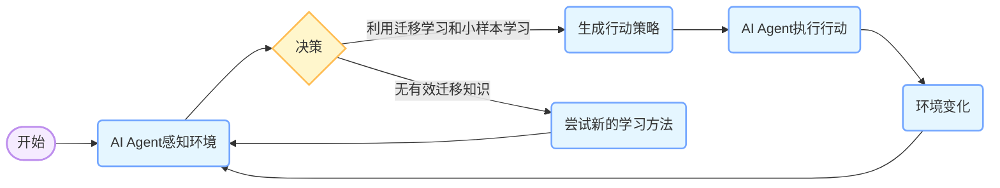

# AI Agent的迁移学习在小样本学习中的应用

> 关键词：AI Agent、迁移学习、小样本学习、模型应用、机器学习

> 摘要：本文聚焦于AI Agent的迁移学习在小样本学习中的应用。首先介绍了研究的背景、目的和范围，明确预期读者和文档结构。详细阐述了AI Agent、迁移学习和小样本学习的核心概念及其联系，给出了原理和架构的文本示意图与Mermaid流程图。深入讲解了相关核心算法原理，并使用Python源代码进行具体操作步骤的说明。同时，介绍了涉及的数学模型和公式，并举例说明。通过项目实战，展示了代码实际案例并进行详细解释。探讨了该技术在不同领域的实际应用场景，推荐了学习资源、开发工具框架以及相关论文著作。最后总结了未来发展趋势与挑战，解答了常见问题，并提供了扩展阅读和参考资料。

## 1. 背景介绍 
### 1.1 目的和范围
在机器学习领域，小样本学习一直是一个具有挑战性的问题。传统的机器学习方法通常需要大量的标注数据来训练出性能良好的模型，但在许多实际应用场景中，获取大量标注数据是非常困难的，例如医疗影像诊断、稀有物种识别等。迁移学习则为解决小样本学习问题提供了一种有效的途径。AI Agent作为一种能够自主感知环境、进行决策和行动的智能体，将其迁移学习能力应用于小样本学习中，可以充分利用在其他领域或任务中积累的知识和经验，快速适应新的小样本任务。

本文的范围主要涵盖了AI Agent迁移学习在小样本学习中的基本概念、算法原理、数学模型、实际应用以及相关的工具和资源推荐等方面。旨在为读者提供一个全面而深入的了解，帮助他们掌握如何将AI Agent的迁移学习技术应用于小样本学习任务中。

### 1.2 预期读者
本文预期读者包括机器学习领域的研究人员、数据科学家、软件工程师以及对AI Agent和小样本学习感兴趣的爱好者。对于希望深入了解迁移学习在小样本场景下应用的专业人士，本文将提供详细的技术原理和实践指导；对于初学者，本文也会从基础概念出发，逐步引导他们理解相关技术。

### 1.3 文档结构概述
本文将按照以下结构进行组织：首先介绍相关核心概念及其联系，包括AI Agent、迁移学习和小样本学习的定义和关系；接着阐述核心算法原理和具体操作步骤，并使用Python代码进行详细说明；然后介绍涉及的数学模型和公式，并举例说明其应用；通过项目实战展示代码实际案例并进行详细解释；探讨该技术在不同领域的实际应用场景；推荐学习资源、开发工具框架以及相关论文著作；最后总结未来发展趋势与挑战，解答常见问题，并提供扩展阅读和参考资料。

### 1.4 术语表
#### 1.4.1 核心术语定义
- **AI Agent（人工智能智能体）**：是一种能够感知环境、根据感知信息进行决策并采取行动以实现特定目标的智能实体。它可以是软件程序、机器人等形式。
- **迁移学习（Transfer Learning）**：是一种机器学习技术，旨在将在一个或多个源任务中学习到的知识和经验，迁移应用到一个不同但相关的目标任务中，以提高目标任务的学习效率和性能。
- **小样本学习（Few - Shot Learning）**：是指在仅有少量标注样本的情况下，训练模型使其能够对新的样本进行准确分类或预测的学习方法。

#### 1.4.2 相关概念解释
- **源任务（Source Task）**：在迁移学习中，是指已经有大量标注数据并且模型已经进行过训练的任务。
- **目标任务（Target Task）**：是指需要利用迁移学习从源任务中获取知识来解决的新任务，通常具有较少的标注数据。
- **元学习（Meta - Learning）**：是一种学习如何学习的方法，它可以快速适应新的任务，与迁移学习和小样本学习密切相关。

#### 1.4.3 缩略词列表
- **CNN（Convolutional Neural Network）**：卷积神经网络
- **RNN（Recurrent Neural Network）**：循环神经网络
- **DNN（Deep Neural Network）**：深度神经网络

## 2. 核心概念与联系 
### 核心概念原理
#### AI Agent
AI Agent的核心原理是基于感知 - 决策 - 行动的循环。它通过传感器感知环境信息，然后根据内部的决策机制对这些信息进行处理和分析，最后选择合适的行动来影响环境。例如，一个自主驾驶的AI Agent通过摄像头、雷达等传感器感知道路状况、交通信号等信息，然后根据预先设定的规则或学习到的策略决定是加速、减速还是转弯。

#### 迁移学习
迁移学习的原理是利用源任务和目标任务之间的相似性，将源任务中学习到的特征表示、模型参数或知识结构等迁移到目标任务中。例如，在图像分类任务中，如果源任务是对猫狗图像进行分类，目标任务是对鸟类图像进行分类，那么可以将在源任务中学习到的图像特征提取方法迁移到目标任务中，从而减少目标任务所需的训练数据量。

#### 小样本学习
小样本学习的原理是通过学习数据的内在结构和特征，使得模型能够在少量标注样本的情况下进行有效的泛化。常见的方法包括元学习、度量学习等。例如，元学习通过在多个不同的任务上进行训练，学习到如何快速适应新的任务，从而在小样本情况下也能取得较好的性能。

### 架构的文本示意图
```plaintext
              AI Agent
                |
                | 感知环境信息
                V
           决策模块
                |
                | 基于迁移学习和小样本学习进行决策
                V
           行动模块
                |
                | 执行行动影响环境
                V
              环境
```

### Mermaid流程图


## 3. 核心算法原理 & 具体操作步骤 
### 核心算法原理
在AI Agent的迁移学习应用于小样本学习中，常用的算法有基于模型参数迁移的方法和基于特征表示迁移的方法。

#### 基于模型参数迁移的方法
这种方法的核心思想是将源任务训练好的模型参数部分或全部迁移到目标任务的模型中。例如，在使用卷积神经网络（CNN）进行图像分类任务时，可以将在大规模图像数据集（如ImageNet）上预训练好的CNN模型的前几层参数迁移到目标小样本图像分类任务的模型中。这些前几层通常学习到了图像的通用特征，如边缘、纹理等，对于不同的图像分类任务都有一定的通用性。

#### 基于特征表示迁移的方法
该方法主要关注从源任务中提取有用的特征表示，并将其应用到目标任务中。可以通过构建一个特征提取器，在源任务上进行训练，然后将其应用于目标任务的小样本数据上。例如，使用自编码器（Autoencoder）在源任务数据上学习到数据的低维特征表示，然后将这个特征提取器用于目标任务的特征提取。

### 具体操作步骤及Python代码实现
以下是一个基于PyTorch的简单示例，展示如何使用预训练的ResNet模型进行迁移学习以解决小样本图像分类问题。

```python
import torch
import torch.nn as nn
import torch.optim as optim
from torchvision import datasets, transforms, models
from torch.utils.data import DataLoader

# 数据预处理
transform = transforms.Compose([
    transforms.Resize((224, 224)),
    transforms.ToTensor(),
    transforms.Normalize(mean=[0.485, 0.456, 0.406], std=[0.229, 0.224, 0.225])
])

# 加载小样本数据集
train_dataset = datasets.ImageFolder(root='path/to/train_data', transform=transform)
train_loader = DataLoader(train_dataset, batch_size=32, shuffle=True)

# 加载预训练的ResNet模型
model = models.resnet18(pretrained=True)

# 冻结模型的所有参数
for param in model.parameters():
    param.requires_grad = False

# 修改最后一层全连接层以适应目标任务的类别数
num_ftrs = model.fc.in_features
model.fc = nn.Linear(num_ftrs, len(train_dataset.classes))

# 定义损失函数和优化器
criterion = nn.CrossEntropyLoss()
optimizer = optim.SGD(model.fc.parameters(), lr=0.001, momentum=0.9)

# 训练模型
device = torch.device("cuda:0" if torch.cuda.is_available() else "cpu")
model.to(device)

num_epochs = 10
for epoch in range(num_epochs):
    running_loss = 0.0
    for i, (inputs, labels) in enumerate(train_loader):
        inputs, labels = inputs.to(device), labels.to(device)

        optimizer.zero_grad()

        outputs = model(inputs)
        loss = criterion(outputs, labels)
        loss.backward()
        optimizer.step()

        running_loss += loss.item()

    print(f'Epoch {epoch + 1}, Loss: {running_loss / len(train_loader)}')

print('Finished Training')
```

### 代码解释
1. **数据预处理**：使用`transforms.Compose`定义了一系列的数据预处理操作，包括图像缩放、转换为张量和归一化。
2. **加载小样本数据集**：使用`datasets.ImageFolder`加载小样本图像数据集，并使用`DataLoader`进行批量加载。
3. **加载预训练模型**：使用`models.resnet18(pretrained=True)`加载预训练的ResNet18模型。
4. **冻结模型参数**：通过设置`param.requires_grad = False`冻结模型的所有参数，只训练最后一层全连接层。
5. **修改最后一层全连接层**：根据目标任务的类别数修改模型的最后一层全连接层。
6. **定义损失函数和优化器**：使用交叉熵损失函数和随机梯度下降优化器。
7. **训练模型**：将模型移动到GPU（如果可用）上，进行多个epoch的训练。

## 4. 数学模型和公式 & 详细讲解 & 举例说明 
### 数学模型
在迁移学习和小样本学习中，常用的数学模型包括神经网络模型、度量学习模型等。这里以神经网络模型为例进行介绍。

#### 神经网络模型
神经网络可以表示为一个函数 $f(x; \theta)$，其中 $x$ 是输入数据，$\theta$ 是模型的参数。对于一个多层感知机（MLP），可以表示为：

$$
h^{(l)} = \sigma(W^{(l)}h^{(l - 1)} + b^{(l)})
$$

其中 $h^{(l)}$ 是第 $l$ 层的输出，$W^{(l)}$ 是第 $l$ 层的权重矩阵，$b^{(l)}$ 是第 $l$ 层的偏置向量，$\sigma$ 是激活函数，如ReLU函数 $\sigma(x) = \max(0, x)$。

### 损失函数
在小样本学习中，常用的损失函数有交叉熵损失函数和三元组损失函数。

#### 交叉熵损失函数
对于分类任务，交叉熵损失函数定义为：

$$
L(y, \hat{y}) = - \sum_{i = 1}^{C} y_i \log(\hat{y}_i)
$$

其中 $y$ 是真实标签的one - hot编码，$\hat{y}$ 是模型的预测概率分布，$C$ 是类别数。

#### 三元组损失函数
三元组损失函数常用于度量学习，用于学习样本之间的相似性。定义为：

$$
L = \max(d(a, p) - d(a, n) + \alpha, 0)
$$

其中 $a$ 是锚样本，$p$ 是正样本（与锚样本属于同一类），$n$ 是负样本（与锚样本属于不同类），$d$ 是距离度量函数，如欧几里得距离，$\alpha$ 是一个正的边界值。

### 举例说明
假设我们有一个二分类任务，真实标签 $y = [1, 0]$，模型的预测概率分布 $\hat{y} = [0.8, 0.2]$。使用交叉熵损失函数计算损失：

$$
L(y, \hat{y}) = - (1 \times \log(0.8) + 0 \times \log(0.2)) \approx 0.223
$$

假设我们使用三元组损失函数，锚样本 $a$ 与正样本 $p$ 的欧几里得距离 $d(a, p) = 0.2$，锚样本 $a$ 与负样本 $n$ 的欧几里得距离 $d(a, n) = 0.5$，边界值 $\alpha = 0.3$。则三元组损失为：

$$
L = \max(0.2 - 0.5 + 0.3, 0) = 0
$$

## 5. 项目实战：代码实际案例和详细解释说明 
### 5.1  开发环境搭建
#### 安装Python
首先需要安装Python，建议使用Python 3.7及以上版本。可以从Python官方网站（https://www.python.org/downloads/）下载并安装。

#### 安装深度学习框架
本文使用PyTorch作为深度学习框架，可以根据自己的CUDA版本和操作系统选择合适的安装方式。可以参考PyTorch官方网站（https://pytorch.org/get-started/locally/）进行安装。

#### 安装其他依赖库
还需要安装一些其他的依赖库，如`torchvision`、`numpy`、`matplotlib`等。可以使用以下命令进行安装：

```sh
pip install torchvision numpy matplotlib
```

### 5.2  源代码详细实现和代码解读
以下是一个更完整的项目实战代码，包括数据加载、模型定义、训练和评估。

```python
import torch
import torch.nn as nn
import torch.optim as optim
from torchvision import datasets, transforms, models
from torch.utils.data import DataLoader
import matplotlib.pyplot as plt

# 数据预处理
train_transform = transforms.Compose([
    transforms.RandomResizedCrop(224),
    transforms.RandomHorizontalFlip(),
    transforms.ToTensor(),
    transforms.Normalize(mean=[0.485, 0.456, 0.406], std=[0.229, 0.224, 0.225])
])

test_transform = transforms.Compose([
    transforms.Resize(256),
    transforms.CenterCrop(224),
    transforms.ToTensor(),
    transforms.Normalize(mean=[0.485, 0.456, 0.406], std=[0.229, 0.224, 0.225])
])

# 加载小样本数据集
train_dataset = datasets.ImageFolder(root='path/to/train_data', transform=train_transform)
test_dataset = datasets.ImageFolder(root='path/to/test_data', transform=test_transform)

train_loader = DataLoader(train_dataset, batch_size=32, shuffle=True)
test_loader = DataLoader(test_dataset, batch_size=32, shuffle=False)

# 加载预训练的ResNet模型
model = models.resnet18(pretrained=True)

# 冻结模型的所有参数
for param in model.parameters():
    param.requires_grad = False

# 修改最后一层全连接层以适应目标任务的类别数
num_ftrs = model.fc.in_features
model.fc = nn.Linear(num_ftrs, len(train_dataset.classes))

# 定义损失函数和优化器
criterion = nn.CrossEntropyLoss()
optimizer = optim.SGD(model.fc.parameters(), lr=0.001, momentum=0.9)

# 训练模型
device = torch.device("cuda:0" if torch.cuda.is_available() else "cpu")
model.to(device)

train_losses = []
test_losses = []
train_accuracies = []
test_accuracies = []

num_epochs = 10
for epoch in range(num_epochs):
    model.train()
    running_train_loss = 0.0
    train_correct = 0
    train_total = 0
    for i, (inputs, labels) in enumerate(train_loader):
        inputs, labels = inputs.to(device), labels.to(device)

        optimizer.zero_grad()

        outputs = model(inputs)
        loss = criterion(outputs, labels)
        loss.backward()
        optimizer.step()

        running_train_loss += loss.item()
        _, predicted = torch.max(outputs.data, 1)
        train_total += labels.size(0)
        train_correct += (predicted == labels).sum().item()

    train_loss = running_train_loss / len(train_loader)
    train_accuracy = 100 * train_correct / train_total
    train_losses.append(train_loss)
    train_accuracies.append(train_accuracy)

    model.eval()
    running_test_loss = 0.0
    test_correct = 0
    test_total = 0
    with torch.no_grad():
        for inputs, labels in test_loader:
            inputs, labels = inputs.to(device), labels.to(device)

            outputs = model(inputs)
            loss = criterion(outputs, labels)

            running_test_loss += loss.item()
            _, predicted = torch.max(outputs.data, 1)
            test_total += labels.size(0)
            test_correct += (predicted == labels).sum().item()

    test_loss = running_test_loss / len(test_loader)
    test_accuracy = 100 * test_correct / test_total
    test_losses.append(test_loss)
    test_accuracies.append(test_accuracy)

    print(f'Epoch {epoch + 1}, Train Loss: {train_loss}, Train Acc: {train_accuracy}%, Test Loss: {test_loss}, Test Acc: {test_accuracy}%')

# 绘制训练和测试损失曲线
plt.figure(figsize=(10, 5))
plt.subplot(1, 2, 1)
plt.plot(train_losses, label='Train Loss')
plt.plot(test_losses, label='Test Loss')
plt.xlabel('Epoch')
plt.ylabel('Loss')
plt.legend()

# 绘制训练和测试准确率曲线
plt.subplot(1, 2, 2)
plt.plot(train_accuracies, label='Train Acc')
plt.plot(test_accuracies, label='Test Acc')
plt.xlabel('Epoch')
plt.ylabel('Accuracy (%)')
plt.legend()

plt.show()
```

### 代码解读与分析
1. **数据预处理**：定义了训练集和测试集不同的数据预处理操作。训练集使用了随机裁剪和水平翻转等数据增强技术，以增加数据的多样性。
2. **数据加载**：使用`datasets.ImageFolder`加载小样本图像数据集，并使用`DataLoader`进行批量加载。
3. **模型加载和修改**：加载预训练的ResNet18模型，冻结其参数，然后修改最后一层全连接层以适应目标任务的类别数。
4. **损失函数和优化器**：使用交叉熵损失函数和随机梯度下降优化器。
5. **训练和评估**：在每个epoch中，先进行训练，计算训练损失和准确率；然后进行评估，计算测试损失和准确率。
6. **绘制曲线**：使用`matplotlib`绘制训练和测试损失曲线以及训练和测试准确率曲线，以便直观地观察模型的训练过程。

## 6. 实际应用场景 
### 医疗影像诊断
在医疗领域，获取大量标注的医疗影像数据（如X光、CT、MRI等）是非常困难的，因为需要专业的医生进行标注，成本高且耗时。AI Agent的迁移学习在小样本学习中的应用可以利用在其他大规模医疗影像数据集上学习到的知识，快速适应新的小样本疾病诊断任务。例如，在检测某种罕见疾病的影像时，可以将在常见疾病影像数据集上预训练好的模型迁移过来，只需要少量该罕见疾病的标注影像数据进行微调，就可以得到一个性能较好的诊断模型。

### 稀有物种识别
在生物多样性保护领域，对于稀有物种的识别往往面临着小样本的问题，因为稀有物种的数量稀少，难以收集到大量的样本数据。通过迁移学习，AI Agent可以利用在常见物种图像数据集上学习到的特征表示，应用于稀有物种的识别任务。例如，在野外监测中，使用无人机拍摄到少量某种稀有鸟类的图像，利用迁移学习模型可以快速对这些图像进行识别和分类。

### 个性化推荐系统
在个性化推荐系统中，对于新用户或新物品，往往只有少量的交互数据。AI Agent的迁移学习可以将在大量老用户和老物品数据上学习到的知识迁移到新用户和新物品上，提高推荐的准确性。例如，在一个音乐推荐系统中，对于新注册的用户，系统可以利用在其他老用户数据上训练好的模型，根据新用户少量的音乐播放记录进行个性化推荐。

### 工业故障诊断
在工业生产中，对于一些复杂设备的故障诊断，往往只有在故障发生时才能收集到少量的故障数据。AI Agent的迁移学习可以利用在其他类似设备或正常运行数据上学习到的知识，应用于小样本的故障诊断任务。例如，在航空发动机的故障诊断中，由于发动机故障发生的概率较低，收集到的故障数据有限，可以使用迁移学习模型利用其他发动机或正常运行数据的知识来提高故障诊断的准确性。

## 7. 工具和资源推荐
### 7.1 学习资源推荐
#### 7.1.1 书籍推荐
- 《深度学习》（Deep Learning）：由Ian Goodfellow、Yoshua Bengio和Aaron Courville撰写，是深度学习领域的经典教材，涵盖了深度学习的基本概念、算法和应用。
- 《Python机器学习》（Python Machine Learning）：由Sebastian Raschka和Vahid Mirjalili撰写，详细介绍了使用Python进行机器学习的方法和技巧，包括迁移学习和小样本学习的相关内容。
- 《人工智能：一种现代的方法》（Artificial Intelligence: A Modern Approach）：由Stuart Russell和Peter Norvig撰写，是人工智能领域的权威教材，对AI Agent、机器学习等方面进行了全面的介绍。

#### 7.1.2 在线课程
- Coursera上的“深度学习专项课程”（Deep Learning Specialization）：由Andrew Ng教授讲授，包括深度学习的基础、卷积神经网络、循环神经网络等内容，也涉及到迁移学习和小样本学习的应用。
- edX上的“人工智能导论”（Introduction to Artificial Intelligence）：介绍了人工智能的基本概念和方法，包括AI Agent的设计和实现。
- 哔哩哔哩（Bilibili）上有许多关于机器学习和深度学习的优质教程，如“李宏毅机器学习”课程，以生动有趣的方式讲解了机器学习的各种算法和应用。

#### 7.1.3 技术博客和网站
- Medium：上面有许多机器学习和人工智能领域的优秀博客文章，作者们会分享最新的研究成果和实践经验。
- arXiv：是一个预印本服务器，提供了大量的机器学习和人工智能领域的研究论文，可以及时了解最新的研究动态。
- Towards Data Science：专注于数据科学和机器学习领域，有许多关于迁移学习、小样本学习等方面的技术文章和案例分析。

### 7.2 开发工具框架推荐
#### 7.2.1 IDE和编辑器
- PyCharm：是一款专门为Python开发设计的集成开发环境（IDE），具有强大的代码编辑、调试和项目管理功能，非常适合机器学习和深度学习项目的开发。
- Jupyter Notebook：是一个交互式的开发环境，支持Python代码的编写、运行和可视化，方便进行数据探索和模型实验。
- Visual Studio Code：是一款轻量级的代码编辑器，具有丰富的插件生态系统，可以通过安装相关插件来支持Python开发和深度学习项目。

#### 7.2.2 调试和性能分析工具
- PyTorch Profiler：是PyTorch提供的性能分析工具，可以帮助开发者分析模型的训练和推理过程中的性能瓶颈，如计算时间、内存使用等。
- TensorBoard：是TensorFlow提供的可视化工具，也可以与PyTorch集成使用，用于可视化模型的训练过程、损失曲线、准确率曲线等。
- NVIDIA Nsight Systems：是一款用于GPU性能分析的工具，可以帮助开发者优化深度学习模型在GPU上的运行性能。

#### 7.2.3 相关框架和库
- PyTorch：是一个开源的深度学习框架，具有动态计算图、易于使用等特点，广泛应用于机器学习和深度学习领域。
- TensorFlow：是另一个流行的开源深度学习框架，具有强大的分布式训练和部署能力，支持多种编程语言。
- Scikit - learn：是一个用于机器学习的Python库，提供了丰富的机器学习算法和工具，如分类、回归、聚类等，也可以用于数据预处理和模型评估。

### 7.3 相关论文著作推荐
#### 7.3.1 经典论文
- “ImageNet Classification with Deep Convolutional Neural Networks”：由Alex Krizhevsky、Ilya Sutskever和Geoffrey E. Hinton撰写，介绍了AlexNet模型，开启了深度学习在计算机视觉领域的热潮，也为迁移学习提供了基础。
- “Learning to Compare: Relation Network for Few - Shot Learning”：提出了关系网络（Relation Network）用于小样本学习，通过学习样本之间的关系来进行分类。
- “Model - Agnostic Meta - Learning for Fast Adaptation of Deep Networks”：介绍了模型无关元学习（MAML）方法，是元学习领域的经典论文，可用于快速适应新的小样本任务。

#### 7.3.2 最新研究成果
- 关注arXiv上最新的研究论文，特别是关于迁移学习和小样本学习的研究。例如，一些新的迁移学习方法，如基于对抗学习的迁移学习、基于图神经网络的迁移学习等。
- 参加国际机器学习会议（ICML）、神经信息处理系统大会（NeurIPS）等顶级学术会议，了解最新的研究动态和成果。

#### 7.3.3 应用案例分析
- 在IEEE Xplore、ACM Digital Library等学术数据库中搜索关于AI Agent的迁移学习在小样本学习中的应用案例，如医疗影像诊断、工业故障诊断等领域的实际应用案例，学习他人的实践经验和方法。

## 8. 总结：未来发展趋势与挑战
### 未来发展趋势
#### 多模态迁移学习
随着数据类型的不断丰富，未来的迁移学习将不仅仅局限于单一模态的数据，如图像、文本等，而是会向多模态迁移学习发展。例如，将图像和文本信息结合起来进行迁移学习，以提高小样本学习的性能。在医疗领域，可以同时利用医学影像和病历文本信息进行疾病诊断。

#### 强化学习与迁移学习的融合
强化学习可以让AI Agent在动态环境中进行学习和决策，将强化学习与迁移学习相结合，可以使AI Agent更好地适应不同的任务和环境。例如，在机器人导航任务中，利用迁移学习将在模拟环境中学习到的知识迁移到真实环境中，同时使用强化学习进行实时决策。

#### 自动迁移学习
未来可能会出现自动迁移学习的工具和方法，能够自动选择合适的源任务、迁移策略和模型架构，减少人工干预。这将大大提高迁移学习的效率和应用范围，使得非专业人士也能够轻松使用迁移学习技术解决小样本学习问题。

### 挑战
#### 领域差异问题
不同领域的数据和任务之间存在较大的差异，如何有效地解决领域差异问题，将源任务的知识迁移到目标任务中，是一个挑战。例如，医疗影像数据和自然图像数据在数据分布、特征表示等方面有很大的不同，需要研究新的迁移学习方法来克服这些差异。

#### 小样本数据的质量和多样性
小样本数据的质量和多样性对模型的性能有很大的影响。如果小样本数据存在噪声、偏差等问题，或者数据的多样性不足，会导致模型的泛化能力下降。因此，如何提高小样本数据的质量和多样性，是小样本学习中需要解决的一个重要问题。

#### 可解释性问题
迁移学习和小样本学习模型往往是黑盒模型，缺乏可解释性。在一些关键领域，如医疗、金融等，模型的可解释性非常重要。如何提高模型的可解释性，让用户理解模型的决策过程和依据，是未来需要研究的一个方向。

## 9. 附录：常见问题与解答
### 问题1：迁移学习一定能提高小样本学习的性能吗？
不一定。迁移学习的效果取决于源任务和目标任务之间的相似性、迁移方法的选择以及小样本数据的质量等因素。如果源任务和目标任务差异较大，或者迁移方法不恰当，可能会导致负迁移，即迁移学习反而降低了模型的性能。

### 问题2：如何选择合适的源任务进行迁移学习？
选择合适的源任务需要考虑以下几点：首先，源任务和目标任务应该具有一定的相似性，如数据类型、任务类型等；其次，源任务应该有足够的标注数据，以便学习到有效的知识；最后，源任务的模型应该具有较好的泛化能力。

### 问题3：在小样本学习中，如何处理数据不平衡的问题？
可以采用以下方法处理数据不平衡问题：一是数据增强，对少数类样本进行数据增强操作，如旋转、翻转等，增加少数类样本的数量；二是调整损失函数的权重，对少数类样本赋予更高的权重，使得模型更加关注少数类样本的分类；三是使用集成学习方法，将多个模型的结果进行融合，提高对少数类样本的分类性能。

### 问题4：迁移学习的模型在目标任务上需要重新训练所有参数吗？
不一定。可以根据具体情况选择是否重新训练所有参数。如果源任务和目标任务非常相似，可以只微调模型的最后几层参数；如果差异较大，可能需要重新训练部分或全部参数。

## 10. 扩展阅读 & 参考资料
### 扩展阅读
- 《迁移学习简明手册》：详细介绍了迁移学习的各种方法和应用案例。
- 《少样本学习方法综述》：对小样本学习的各种方法进行了系统的总结和分析。

### 参考资料
- Goodfellow, I., Bengio, Y., & Courville, A. (2016). Deep Learning. MIT Press.
- Raschka, S., & Mirjalili, V. (2017). Python Machine Learning. Packt Publishing.
- Russell, S. J., & Norvig, P. (2020). Artificial Intelligence: A Modern Approach. Pearson.

作者：AI天才研究院/AI Genius Institute & 禅与计算机程序设计艺术 /Zen And The Art of Computer Programming