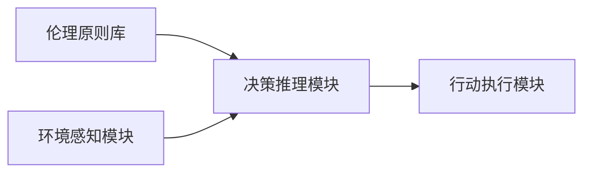

# AI Agent的道德决策框架：伦理AI实践

> 关键词：AI Agent、道德决策框架、伦理AI、实践应用、算法原理

> 摘要：本文聚焦于AI Agent的道德决策框架，深入探讨伦理AI的实践。首先介绍了研究的背景、目的、预期读者等内容。接着阐述核心概念及联系，给出原理和架构的示意图与流程图。详细讲解核心算法原理，用Python代码示例说明。引入数学模型和公式并举例。通过项目实战展示代码实现与解读。分析实际应用场景，推荐相关工具和资源。最后总结未来发展趋势与挑战，解答常见问题并提供扩展阅读和参考资料，旨在为伦理AI的研究和实践提供全面而深入的指导。

## 1. 背景介绍 
### 1.1 目的和范围
随着人工智能技术的飞速发展，AI Agent在各个领域的应用日益广泛。然而，AI Agent的决策可能会对人类社会、环境等产生重大影响，因此其道德决策问题变得至关重要。本研究的目的是构建一个有效的AI Agent道德决策框架，以确保AI Agent的行为符合伦理道德标准。研究范围涵盖了AI Agent道德决策的核心概念、算法原理、数学模型、实际应用场景等多个方面，旨在为伦理AI的实践提供全面的理论和实践指导。

### 1.2 预期读者
本文的预期读者包括人工智能领域的研究人员、开发者、伦理学家、政策制定者以及对AI道德决策感兴趣的相关人士。对于研究人员，本文提供了深入的理论分析和最新的研究成果；对于开发者，给出了具体的算法实现和代码示例；对于伦理学家和政策制定者，有助于他们从技术角度理解AI道德决策问题，从而制定合理的伦理准则和政策；对于普通读者，能够帮助他们了解AI道德决策的基本原理和重要性。

### 1.3 文档结构概述
本文共分为十个部分。第一部分为背景介绍，阐述研究的目的、范围、预期读者和文档结构。第二部分讲解核心概念与联系，包括相关概念的原理和架构，并给出示意图和流程图。第三部分介绍核心算法原理和具体操作步骤，用Python代码详细说明。第四部分引入数学模型和公式，并进行详细讲解和举例。第五部分通过项目实战展示代码实际案例和详细解释。第六部分分析实际应用场景。第七部分推荐相关的工具和资源，包括学习资源、开发工具框架和论文著作。第八部分总结未来发展趋势与挑战。第九部分为附录，解答常见问题。第十部分提供扩展阅读和参考资料。

### 1.4 术语表
#### 1.4.1 核心术语定义
- **AI Agent**：是指能够感知环境、进行决策并采取行动的人工智能实体，它可以是软件程序、机器人等。
- **道德决策框架**：是一套指导AI Agent在面对各种情况时做出符合道德标准决策的规则、方法和流程的集合。
- **伦理AI**：强调人工智能系统的设计、开发和应用应遵循伦理道德原则，确保其行为对人类和社会有益。

#### 1.4.2 相关概念解释
- **功利主义伦理**：一种伦理理论，认为行为的道德性取决于其产生的总体利益，即追求最大多数人的最大幸福。
- **义务论伦理**：强调行为本身的正当性，而不是其后果，认为某些行为具有内在的道德价值，无论其结果如何都应该被执行。
- **机器学习**：是一门多领域交叉学科，涉及概率论、统计学、逼近论、凸分析、算法复杂度理论等多门学科。它专门研究计算机怎样模拟或实现人类的学习行为，以获取新的知识或技能，重新组织已有的知识结构使之不断改善自身的性能。

#### 1.4.3 缩略词列表
- **ML**：Machine Learning，机器学习
- **DL**：Deep Learning，深度学习
- **RL**：Reinforcement Learning，强化学习

## 2. 核心概念与联系 
### 核心概念原理
AI Agent的道德决策框架基于多个核心概念。首先是伦理原则，如功利主义、义务论等，这些原则为道德决策提供了基本的价值导向。功利主义关注行为的后果，追求整体利益的最大化；义务论则强调行为的内在道德性，遵循特定的道德规则。

其次是环境感知，AI Agent需要准确地感知周围环境的信息，包括场景、对象、事件等，以便做出合理的决策。这可以通过传感器、数据采集等方式实现。

然后是决策推理，根据感知到的环境信息和伦理原则，AI Agent运用一定的算法和模型进行推理，选择最优的行动方案。决策推理可以采用规则推理、机器学习、深度学习等方法。

最后是行动执行，AI Agent将决策结果转化为实际的行动，对环境产生影响。

### 架构的文本示意图
```plaintext
              +-------------------+
              |   伦理原则库      |
              +-------------------+
                     |
                     v
+----------------+     +-----------------+
|  环境感知模块  | --> |  决策推理模块   |
+----------------+     +-----------------+
                     |
                     v
              +-------------------+
              |   行动执行模块    |
              +-------------------+
```
### Mermaid 流程图


## 3. 核心算法原理 & 具体操作步骤 
### 算法原理
我们可以采用基于规则的算法和机器学习算法相结合的方式来实现AI Agent的道德决策。基于规则的算法根据预先定义的伦理规则进行决策，适用于一些明确的、规则化的场景。机器学习算法则可以从大量的数据中学习道德模式，适用于复杂的、不确定的场景。

以下是一个简单的基于规则的道德决策算法示例：

```python
# 定义伦理规则
def ethical_rule(perceived_info):
    # 假设规则：如果感知到的信息中包含危险信号，则采取安全行动
    if "danger" in perceived_info:
        return "safe_action"
    else:
        return "normal_action"

# 环境感知模拟
def environment_perception():
    # 模拟感知到的环境信息
    return "danger"

# 决策推理
def decision_making():
    perceived_info = environment_perception()
    action = ethical_rule(perceived_info)
    return action

# 行动执行
def action_execution(action):
    print(f"Executing action: {action}")

# 主程序
if __name__ == "__main__":
    action = decision_making()
    action_execution(action)
```
### 具体操作步骤
1. **环境感知**：AI Agent通过各种传感器或数据接口获取环境信息，将其转换为计算机可处理的格式。
2. **规则匹配**：将感知到的环境信息与预先定义的伦理规则进行匹配，找出符合条件的规则。
3. **决策生成**：根据匹配的规则生成相应的决策结果。
4. **行动执行**：将决策结果转化为实际的行动，对环境产生影响。

## 4. 数学模型和公式 & 详细讲解 & 举例说明 
### 数学模型
我们可以使用决策理论中的效用函数来构建AI Agent的道德决策模型。效用函数衡量了不同行动方案在特定环境下的价值，AI Agent的目标是选择具有最大效用值的行动方案。

设 $A$ 为行动方案的集合，$S$ 为环境状态的集合，$U(a, s)$ 为行动 $a \in A$ 在状态 $s \in S$ 下的效用值。则AI Agent的决策问题可以表示为：

$$\max_{a \in A} U(a, s)$$

### 详细讲解
效用函数 $U(a, s)$ 可以根据不同的伦理原则进行定义。例如，在功利主义伦理下，$U(a, s)$ 可以表示行动 $a$ 在状态 $s$ 下产生的总体利益；在义务论伦理下，$U(a, s)$ 可以根据行动是否符合特定的道德规则来赋值。

### 举例说明
假设一个AI Agent需要在两个行动方案 $a_1$ 和 $a_2$ 之间进行选择，环境状态为 $s$。根据功利主义伦理，我们可以定义效用函数如下：

$U(a_1, s) = 10$

$U(a_2, s) = 5$

则AI Agent应该选择行动方案 $a_1$，因为它具有更大的效用值。

## 5. 项目实战：代码实际案例和详细解释说明 
### 5.1  开发环境搭建
我们使用Python语言进行开发，需要安装以下库：
- **NumPy**：用于数值计算。
- **Pandas**：用于数据处理。
- **Scikit-learn**：用于机器学习算法。

可以使用以下命令进行安装：
```bash
pip install numpy pandas scikit-learn
```

### 5.2  源代码详细实现和代码解读
```python
import numpy as np
from sklearn.linear_model import LogisticRegression

# 生成示例数据
# 假设我们有一些环境特征和对应的道德决策标签
X = np.array([[1, 2], [2, 3], [3, 4], [4, 5]])  # 环境特征
y = np.array([0, 1, 1, 0])  # 道德决策标签，0表示不道德行动，1表示道德行动

# 训练逻辑回归模型
model = LogisticRegression()
model.fit(X, y)

# 模拟新的环境特征
new_X = np.array([[5, 6]])

# 进行预测
prediction = model.predict(new_X)

# 输出预测结果
if prediction[0] == 1:
    print("The action is considered moral.")
else:
    print("The action is considered immoral.")
```
### 代码解读与分析
1. **数据生成**：我们使用 `NumPy` 生成了一些示例数据，包括环境特征 `X` 和对应的道德决策标签 `y`。
2. **模型训练**：使用 `Scikit-learn` 中的逻辑回归模型对数据进行训练，逻辑回归是一种常用的分类算法。
3. **预测**：模拟新的环境特征 `new_X`，使用训练好的模型进行预测。
4. **结果输出**：根据预测结果输出行动是否被认为是道德的。

## 6. 实际应用场景 
### 自动驾驶汽车
在自动驾驶汽车中，AI Agent需要在各种复杂的交通场景中做出道德决策。例如，当面临不可避免的碰撞时，应该优先保护车内乘客还是行人。通过构建道德决策框架，可以让自动驾驶汽车在这种情况下做出符合伦理道德的选择。

### 医疗诊断系统
医疗诊断系统中的AI Agent需要根据患者的病情和各种医疗资源，做出合理的诊断和治疗建议。在这个过程中，需要考虑患者的利益、医疗资源的公平分配等伦理问题。

### 金融投资领域
AI Agent在金融投资领域的应用越来越广泛，如股票交易、风险评估等。在进行投资决策时，需要考虑市场的公平性、投资者的利益等伦理因素，避免操纵市场、欺诈等不道德行为。

## 7. 工具和资源推荐
### 7.1 学习资源推荐
#### 7.1.1 书籍推荐
- 《人工智能伦理》：全面介绍了人工智能领域的伦理问题，包括道德决策、隐私保护等方面。
- 《机器学习》：详细讲解了机器学习的基本原理和算法，为AI Agent的开发提供了理论基础。

#### 7.1.2 在线课程
- Coursera上的“人工智能基础”课程：由知名教授授课，涵盖了人工智能的基本概念、算法和应用。
- edX上的“机器学习导论”课程：系统地介绍了机器学习的主要算法和技术。

#### 7.1.3 技术博客和网站
- Medium上的人工智能相关博客：有很多专业人士分享的最新研究成果和实践经验。
- arXiv.org：提供了大量的学术论文，涵盖了人工智能的各个领域。

### 7.2 开发工具框架推荐
#### 7.2.1 IDE和编辑器
- PyCharm：功能强大的Python集成开发环境，提供了代码编辑、调试、版本控制等功能。
- Jupyter Notebook：交互式的开发环境，适合进行数据分析和模型训练。

#### 7.2.2 调试和性能分析工具
- TensorBoard：用于可视化深度学习模型的训练过程和性能指标。
- Py-Spy：用于分析Python程序的性能瓶颈。

#### 7.2.3 相关框架和库
- TensorFlow：开源的深度学习框架，提供了丰富的工具和接口。
- PyTorch：另一个流行的深度学习框架，具有动态图的优势。

### 7.3 相关论文著作推荐
#### 7.3.1 经典论文
- “Moral Machines: Teaching Robots Right from Wrong”：探讨了如何让机器人具备道德决策能力。
- “The Ethical Algorithm: The Science of Socially Aware Algorithm Design”：介绍了算法设计中的伦理问题。

#### 7.3.2 最新研究成果
- 在顶级学术会议如NeurIPS、ICML等上发表的关于AI道德决策的论文。
- 知名学术期刊如Journal of Artificial Intelligence Research上的相关研究。

#### 7.3.3 应用案例分析
- 一些实际应用案例的研究报告，如自动驾驶汽车的道德决策案例分析、医疗诊断系统的伦理实践等。

## 8. 总结：未来发展趋势与挑战
### 未来发展趋势
- **多伦理原则融合**：未来的AI Agent道德决策框架将融合多种伦理原则，以应对更加复杂和多样化的场景。
- **与人类协作**：AI Agent将与人类更加紧密地协作，共同做出道德决策，充分发挥人类的智慧和AI的计算能力。
- **跨领域应用拓展**：道德决策框架将在更多领域得到应用，如教育、文化、娱乐等。

### 挑战
- **伦理标准的多样性**：不同文化、地区和人群对伦理标准的理解存在差异，如何制定通用的伦理标准是一个挑战。
- **数据的伦理问题**：AI Agent的训练需要大量的数据，但数据的收集、使用和隐私保护等方面存在伦理问题。
- **可解释性问题**：AI Agent的决策过程往往是复杂和难以解释的，如何提高其决策的可解释性，让人类理解和信任其决策是一个重要的挑战。

## 9. 附录：常见问题与解答
### 问题1：AI Agent的道德决策框架是否可以完全替代人类的道德判断？
解答：不能。虽然AI Agent的道德决策框架可以在很多情况下做出合理的决策，但人类的道德判断是基于情感、经验和文化背景等多方面因素的，具有独特的灵活性和判断力。AI Agent只能作为辅助工具，与人类共同参与道德决策。

### 问题2：如何确保AI Agent的道德决策框架符合伦理标准？
解答：首先，需要制定明确的伦理原则和规则，并将其融入到决策框架中。其次，要对AI Agent进行严格的测试和验证，确保其在各种情况下的决策都符合伦理标准。此外，还需要建立监督机制，对AI Agent的行为进行实时监测和评估。

### 问题3：AI Agent的道德决策框架在实际应用中可能会遇到哪些困难？
解答：可能会遇到数据不足、环境复杂多变、伦理标准不一致等困难。数据不足会影响模型的训练效果，环境复杂多变会使决策变得更加困难，伦理标准不一致则会导致决策的不确定性。

## 10. 扩展阅读 & 参考资料
### 扩展阅读
- 《人类简史：从动物到上帝》：从人类历史的角度探讨了道德和伦理的演变。
- 《未来简史：从智人到神人》：对未来人工智能和人类社会的发展进行了展望。

### 参考资料
- 相关学术论文和研究报告。
- 人工智能领域的专业书籍和教材。
- 各大科技公司的技术文档和博客文章。

作者：AI天才研究院/AI Genius Institute & 禅与计算机程序设计艺术 /Zen And The Art of Computer Programming