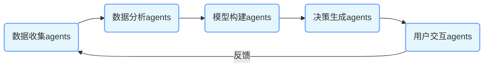

# AI agents协作进行全球经济周期分析：把握大趋势

> 关键词：AI agents、全球经济周期分析、协作、大趋势把握、经济预测

> 摘要：本文聚焦于AI agents协作在全球经济周期分析中的应用。随着全球经济的日益复杂，传统的经济分析方法面临挑战，而AI agents凭借其强大的计算和协作能力为经济分析带来新的视角和方法。文章深入探讨了AI agents的核心概念、协作原理、相关算法、数学模型，通过项目实战展示其具体应用，并介绍了实际应用场景、相关工具和资源，最后对未来发展趋势与挑战进行总结，旨在帮助读者全面了解如何利用AI agents协作把握全球经济大趋势。

## 1. 背景介绍 
### 1.1 目的和范围
全球经济是一个庞大而复杂的系统，其周期波动受到政治、社会、科技等多种因素的综合影响。准确分析全球经济周期对于政府制定宏观经济政策、企业规划战略以及投资者做出决策都具有至关重要的意义。本文的目的在于探讨如何利用AI agents协作的方式进行全球经济周期分析，把握经济发展的大趋势。范围涵盖AI agents的基本原理、协作机制、在经济周期分析中的具体应用，以及相关的技术、工具和资源等方面。

### 1.2 预期读者
本文预期读者包括从事经济学研究的学者、金融行业的从业者（如分析师、投资者）、政府经济决策部门的工作人员，以及对人工智能在经济领域应用感兴趣的技术爱好者。对于经济学背景的读者，本文将展示如何利用新兴的AI技术提升经济分析的准确性和效率；对于技术背景的读者，将呈现AI在经济领域的实际应用场景和挑战。

### 1.3 文档结构概述
本文首先介绍AI agents协作进行全球经济周期分析的背景信息，包括目的、预期读者和文档结构。接着阐述核心概念与联系，明确AI agents的定义、特点以及它们之间的协作方式。然后详细讲解核心算法原理和具体操作步骤，并给出相应的Python源代码。之后介绍相关的数学模型和公式，并举例说明。通过项目实战部分展示如何在实际中应用这些技术，包括开发环境搭建、源代码实现和代码解读。再介绍AI agents在全球经济周期分析中的实际应用场景，推荐相关的工具和资源。最后总结未来发展趋势与挑战，提供常见问题解答和扩展阅读参考资料。

### 1.4 术语表
#### 1.4.1 核心术语定义
- **AI agents（人工智能代理）**：是一种能够感知环境、自主决策并采取行动以实现特定目标的软件实体。在全球经济周期分析中，AI agents可以根据不同的任务和数据来源进行专业化设置，如负责收集数据、进行数据分析、生成预测等。
- **全球经济周期**：指全球经济活动呈现出的扩张和收缩交替出现的周期性变化。通常包括繁荣、衰退、萧条和复苏四个阶段。
- **协作**：指多个AI agents之间通过信息共享、分工合作等方式共同完成一个复杂的任务，如全球经济周期分析。

#### 1.4.2 相关概念解释
- **多智能体系统（Multi - Agent System, MAS）**：由多个AI agents组成的系统，这些agents之间相互作用、相互影响，通过协作来实现系统的整体目标。在全球经济周期分析中，MAS可以协调不同功能的AI agents，提高分析的效率和准确性。
- **经济指标**：用于衡量和反映经济活动状况的统计数据，如国内生产总值（GDP）、通货膨胀率、失业率等。AI agents可以通过收集和分析这些经济指标来进行全球经济周期分析。

#### 1.4.3 缩略词列表
- **MAS**：Multi - Agent System（多智能体系统）
- **GDP**：Gross Domestic Product（国内生产总值）

## 2. 核心概念与联系 

### 2.1 AI agents的基本概念
AI agents是具有一定智能的软件实体，它可以感知周围环境的信息，根据预设的规则或学习到的知识进行决策，并采取相应的行动。一个典型的AI agent通常由感知模块、决策模块和行动模块组成。感知模块负责收集环境中的信息，如经济数据、新闻报道等；决策模块根据感知到的信息进行分析和判断，制定相应的策略；行动模块则根据决策结果执行具体的操作，如生成报告、发出预警等。

### 2.2 AI agents的协作机制
在全球经济周期分析中，单个AI agent可能无法处理复杂的经济数据和完成全面的分析任务。因此，需要多个AI agents进行协作。协作机制可以分为以下几种类型：
- **分工协作**：不同的AI agents负责不同的任务，如有的agent负责收集宏观经济数据，有的agent负责分析行业数据，有的agent负责生成预测模型等。通过分工，每个agent可以专注于自己擅长的领域，提高分析效率。
- **信息共享**：AI agents之间可以共享它们所收集到的信息和分析结果。例如，一个负责分析股票市场的agent可以将其分析结果分享给负责宏观经济预测的agent，以便后者更全面地了解经济形势。
- **协同决策**：当面临复杂的决策问题时，多个AI agents可以共同参与决策过程。它们可以通过协商、投票等方式达成一致的决策结果。

### 2.3 核心概念原理和架构的文本示意图
以下是一个简单的AI agents协作进行全球经济周期分析的架构示意图：

| 层次 | 组成部分 | 功能 |
| ---- | ---- | ---- |
| 数据层 | 数据收集agents | 从各种数据源（如政府统计部门、金融机构、新闻媒体等）收集经济数据和相关信息 |
| 分析层 | 数据分析agents | 对收集到的数据进行清洗、预处理和分析，提取有价值的信息 |
| 模型层 | 模型构建agents | 根据分析结果构建经济预测模型，如时间序列模型、机器学习模型等 |
| 决策层 | 决策生成agents | 根据模型预测结果和预设的规则生成决策建议，如政策调整建议、投资策略建议等 |
| 交互层 | 用户交互agents | 与用户进行交互，将分析结果和决策建议呈现给用户，并接收用户的反馈 |

### 2.4 Mermaid流程图


这个流程图展示了AI agents协作进行全球经济周期分析的主要流程。首先，数据收集agents收集数据，然后将数据传递给数据分析agents进行处理。数据分析agents的结果用于模型构建agents构建预测模型。模型构建agents的输出作为决策生成agents生成决策建议的依据。最后，用户交互agents将决策建议呈现给用户，并接收用户的反馈，反馈信息又可以回到数据收集环节，形成一个闭环的协作系统。

## 3. 核心算法原理 & 具体操作步骤 

### 3.1 数据收集算法
在全球经济周期分析中，数据收集是第一步。常见的数据收集算法包括网络爬虫算法和API调用算法。以下是一个使用Python的`requests`库进行简单网络爬虫的示例代码：

```python
import requests
from bs4 import BeautifulSoup

def collect_data(url):
    try:
        response = requests.get(url)
        response.raise_for_status()
        soup = BeautifulSoup(response.text, 'html.parser')
        # 这里可以根据具体的网页结构提取所需的数据
        data = soup.find_all('p')  # 示例：提取所有的段落标签内容
        return [p.get_text() for p in data]
    except requests.RequestException as e:
        print(f"Error collecting data: {e}")
        return []

# 示例使用
url = 'https://example.com/economic-data'
data = collect_data(url)
print(data)
```

### 3.2 数据分析算法
数据分析阶段常用的算法包括统计分析算法和机器学习算法。以下是一个使用Python的`pandas`库进行简单统计分析的示例代码：

```python
import pandas as pd

def analyze_data(data):
    df = pd.DataFrame(data)
    # 计算数据的基本统计信息
    stats = df.describe()
    return stats

# 示例使用
data = [1, 2, 3, 4, 5]
stats = analyze_data(data)
print(stats)
```

### 3.3 模型构建算法
在构建经济预测模型时，常用的机器学习算法包括线性回归、决策树、神经网络等。以下是一个使用Python的`scikit-learn`库进行线性回归模型构建的示例代码：

```python
from sklearn.linear_model import LinearRegression
import numpy as np

def build_model(X, y):
    model = LinearRegression()
    model.fit(X, y)
    return model

# 示例使用
X = np.array([[1], [2], [3], [4], [5]])
y = np.array([2, 4, 6, 8, 10])
model = build_model(X, y)
print(model.coef_, model.intercept_)
```

### 4. 数学模型和公式 & 详细讲解 & 举例说明 

### 4.1 线性回归模型
线性回归是一种简单而常用的预测模型，它假设自变量和因变量之间存在线性关系。其数学公式为：

$$y = \beta_0 + \beta_1x_1 + \beta_2x_2 + \cdots + \beta_nx_n + \epsilon$$

其中，$y$ 是因变量，$x_1, x_2, \cdots, x_n$ 是自变量，$\beta_0, \beta_1, \beta_2, \cdots, \beta_n$ 是回归系数，$\epsilon$ 是误差项。

在全球经济周期分析中，我们可以使用线性回归模型来预测某个经济指标（如GDP增长率）与其他相关经济指标（如通货膨胀率、失业率等）之间的关系。

例如，假设我们要预测GDP增长率 $y$ 与通货膨胀率 $x_1$ 和失业率 $x_2$ 之间的关系，我们可以收集历史数据，然后使用线性回归模型来估计回归系数 $\beta_0, \beta_1, \beta_2$。以下是一个使用Python实现的示例代码：

```python
from sklearn.linear_model import LinearRegression
import numpy as np

# 示例数据
X = np.array([[2, 5], [3, 4], [4, 3], [5, 2]])  # 通货膨胀率和失业率
y = np.array([3, 4, 5, 6])  # GDP增长率

# 构建线性回归模型
model = LinearRegression()
model.fit(X, y)

# 输出回归系数
print(f"Intercept: {model.intercept_}")
print(f"Coefficients: {model.coef_}")
```

### 4.2 时间序列模型
时间序列模型用于分析随时间变化的数据。常见的时间序列模型包括自回归积分滑动平均模型（ARIMA）。ARIMA模型的一般形式为：

$$ARIMA(p, d, q)$$

其中，$p$ 是自回归项的阶数，$d$ 是差分的阶数，$q$ 是移动平均项的阶数。

ARIMA模型的数学公式可以表示为：

$$\phi(B)(1 - B)^dY_t = \theta(B)\epsilon_t$$

其中，$\phi(B)$ 是自回归多项式，$\theta(B)$ 是移动平均多项式，$B$ 是滞后算子，$Y_t$ 是时间序列数据，$\epsilon_t$ 是白噪声。

例如，假设我们要预测某国的月度GDP数据，我们可以使用ARIMA模型。以下是一个使用Python的`statsmodels`库实现的示例代码：

```python
import pandas as pd
from statsmodels.tsa.arima.model import ARIMA

# 示例数据
data = [100, 102, 105, 107, 110, 112, 115, 117, 120, 122]
df = pd.Series(data)

# 构建ARIMA模型
model = ARIMA(df, order=(1, 1, 1))
model_fit = model.fit()

# 进行预测
forecast = model_fit.forecast(steps=3)
print(forecast)
```

## 5. 项目实战：代码实际案例和详细解释说明 

### 5.1  开发环境搭建
在进行AI agents协作进行全球经济周期分析的项目实战之前，需要搭建相应的开发环境。以下是具体步骤：

#### 5.1.1 安装Python
首先，需要安装Python。可以从Python官方网站（https://www.python.org/downloads/）下载适合自己操作系统的Python版本，并按照安装向导进行安装。

#### 5.1.2 安装必要的库
在项目中，需要使用一些Python库，如`requests`、`pandas`、`scikit-learn`、`statsmodels`等。可以使用`pip`命令来安装这些库：

```bash
pip install requests pandas scikit-learn statsmodels
```

#### 5.1.3 选择开发工具
可以选择使用集成开发环境（IDE），如PyCharm、Jupyter Notebook等。这里以Jupyter Notebook为例，安装方法如下：

```bash
pip install jupyter notebook
```

安装完成后，在命令行中输入`jupyter notebook`即可启动Jupyter Notebook。

### 5.2  源代码详细实现和代码解读
以下是一个简单的AI agents协作进行全球经济周期分析的项目示例代码：

```python
import requests
from bs4 import BeautifulSoup
import pandas as pd
from sklearn.linear_model import LinearRegression

# 数据收集agent
def collect_data(url):
    try:
        response = requests.get(url)
        response.raise_for_status()
        soup = BeautifulSoup(response.text, 'html.parser')
        # 假设网页中有一个表格包含经济数据
        table = soup.find('table')
        rows = table.find_all('tr')
        data = []
        for row in rows[1:]:  # 跳过表头
            cols = row.find_all('td')
            cols = [col.get_text().strip() for col in cols]
            data.append(cols)
        return pd.DataFrame(data)
    except requests.RequestException as e:
        print(f"Error collecting data: {e}")
        return pd.DataFrame()

# 数据分析agent
def analyze_data(data):
    # 假设数据的第一列是自变量，第二列是因变量
    X = data.iloc[:, 0].values.reshape(-1, 1)
    y = data.iloc[:, 1].values
    return X, y

# 模型构建agent
def build_model(X, y):
    model = LinearRegression()
    model.fit(X, y)
    return model

# 决策生成agent
def generate_decision(model, new_X):
    prediction = model.predict(new_X)
    if prediction > 0:
        return "Positive trend, consider investment."
    else:
        return "Negative trend, be cautious."

# 主函数
def main():
    url = 'https://example.com/economic-data'
    data = collect_data(url)
    if not data.empty:
        X, y = analyze_data(data)
        model = build_model(X, y)
        new_X = [[10]]  # 示例新数据
        decision = generate_decision(model, new_X)
        print(decision)

if __name__ == "__main__":
    main()
```

### 5.3  代码解读与分析
- **数据收集agent**：`collect_data`函数通过网络爬虫从指定的网页中收集经济数据，并将其转换为`pandas`的`DataFrame`对象。
- **数据分析agent**：`analyze_data`函数从`DataFrame`中提取自变量和因变量，并将其转换为适合机器学习模型输入的格式。
- **模型构建agent**：`build_model`函数使用线性回归模型对数据进行训练，得到一个预测模型。
- **决策生成agent**：`generate_decision`函数根据训练好的模型对新数据进行预测，并根据预测结果生成决策建议。
- **主函数**：`main`函数将各个agent的功能组合起来，完成整个分析流程。

## 6. 实际应用场景 
### 6.1 政府宏观经济政策制定
政府在制定宏观经济政策时，需要准确了解全球经济周期的走势。AI agents协作可以收集全球范围内的经济数据，进行实时分析和预测。例如，通过分析国际贸易数据、通货膨胀率、失业率等指标，预测经济的扩张或收缩趋势。政府可以根据这些预测结果调整货币政策、财政政策等，以实现经济的稳定增长。

### 6.2 企业战略规划
企业在制定战略规划时，需要考虑全球经济环境的变化。AI agents可以帮助企业分析行业发展趋势、市场需求变化等。例如，通过分析不同国家和地区的经济数据，预测某个行业的市场规模和增长潜力。企业可以根据这些分析结果调整生产计划、市场拓展策略等，提高企业的竞争力。

### 6.3 投资者决策
投资者在进行投资决策时，需要对全球经济形势有清晰的认识。AI agents可以收集和分析各种金融市场数据，如股票市场、债券市场、外汇市场等。通过建立预测模型，预测不同资产的价格走势。投资者可以根据这些预测结果调整投资组合，降低投资风险，提高投资收益。

## 7. 工具和资源推荐
### 7.1 学习资源推荐
#### 7.1.1 书籍推荐
- 《人工智能：一种现代的方法》：这本书是人工智能领域的经典教材，全面介绍了人工智能的基本概念、算法和应用。
- 《Python数据分析实战》：详细介绍了如何使用Python进行数据分析，包括数据处理、可视化、机器学习等方面的内容。
- 《计量经济学基础》：对于理解经济数据的分析方法和模型构建有很大帮助。

#### 7.1.2 在线课程
- Coursera上的“人工智能基础”课程：由知名大学的教授授课，系统介绍人工智能的基础知识和算法。
- edX上的“Python for Data Science”课程：专门讲解如何使用Python进行数据分析。
- 网易云课堂上的“计量经济学实战”课程：结合实际案例介绍计量经济学的应用。

#### 7.1.3 技术博客和网站
- Medium：上面有很多关于人工智能和经济学的技术文章和案例分享。
- Towards Data Science：专注于数据科学和机器学习领域的技术博客，有很多实用的教程和案例。
- 国家统计局网站：可以获取大量的经济数据和统计信息。

### 7.2 开发工具框架推荐
#### 7.2.1 IDE和编辑器
- PyCharm：功能强大的Python集成开发环境，提供代码编辑、调试、版本控制等功能。
- Jupyter Notebook：交互式的开发环境，适合进行数据分析和模型构建的实验。
- Visual Studio Code：轻量级的代码编辑器，支持多种编程语言和插件扩展。

#### 7.2.2 调试和性能分析工具
- Py-Spy：用于分析Python程序的性能瓶颈。
- PDB：Python自带的调试工具，可以帮助调试代码中的错误。
- TensorBoard：用于可视化深度学习模型的训练过程和性能指标。

#### 7.2.3 相关框架和库
- Scikit-learn：提供了丰富的机器学习算法和工具，如分类、回归、聚类等。
- TensorFlow：开源的深度学习框架，广泛应用于图像识别、自然语言处理等领域。
- PyTorch：另一个流行的深度学习框架，具有动态图的特点，易于使用和调试。

### 7.3 相关论文著作推荐
#### 7.3.1 经典论文
- “A Machine Learning Approach to Macroeconomic Forecasting”：介绍了如何使用机器学习方法进行宏观经济预测。
- “Multi - Agent Systems for Economic Forecasting”：探讨了多智能体系统在经济预测中的应用。

#### 7.3.2 最新研究成果
可以通过学术数据库（如IEEE Xplore、ACM Digital Library、ScienceDirect等）搜索关于AI agents在经济领域应用的最新研究论文。

#### 7.3.3 应用案例分析
一些知名的咨询公司（如麦肯锡、波士顿咨询集团等）会发布关于人工智能在经济领域应用的案例分析报告，可以关注这些报告了解实际应用情况。

## 8. 总结：未来发展趋势与挑战
### 8.1 未来发展趋势
- **更强大的协作能力**：未来的AI agents将具备更强大的协作能力，能够实现更高效的信息共享和协同决策。例如，不同领域的AI agents可以实时交互，共同分析复杂的经济问题。
- **融合多种技术**：AI agents将与区块链、物联网等技术深度融合。区块链技术可以提供安全可靠的数据共享和存储环境，物联网技术可以提供更丰富的实时经济数据，从而提高经济周期分析的准确性和及时性。
- **个性化服务**：根据不同用户的需求和偏好，AI agents可以提供个性化的经济分析和决策建议。例如，为投资者提供符合其风险偏好的投资组合建议。

### 8.2 挑战
- **数据质量和安全**：全球经济数据来源广泛，数据质量参差不齐。同时，经济数据涉及敏感信息，数据安全和隐私保护是一个重要挑战。
- **模型解释性**：一些复杂的机器学习模型（如深度学习模型）的解释性较差，难以理解模型的决策过程和依据。在经济决策中，模型的解释性至关重要。
- **伦理和法律问题**：AI agents的应用可能会引发一些伦理和法律问题，如算法偏见、责任归属等。需要建立相应的伦理和法律框架来规范AI agents的使用。

## 9. 附录：常见问题与解答
### 9.1 AI agents在经济周期分析中的准确性如何？
AI agents在经济周期分析中的准确性受到多种因素的影响，如数据质量、模型选择、算法优化等。通过不断改进数据收集方法、选择合适的模型和优化算法，可以提高分析的准确性。但由于经济系统的复杂性和不确定性，完全准确的预测仍然是一个挑战。

### 9.2 如何评估AI agents的性能？
可以使用一些指标来评估AI agents的性能，如预测误差（如均方误差、平均绝对误差等）、准确率、召回率等。此外，还可以通过与传统分析方法的比较来评估AI agents的优势和不足。

### 9.3 AI agents协作需要注意哪些问题？
AI agents协作需要注意信息共享的安全性和准确性、任务分配的合理性、决策协调的有效性等问题。同时，需要建立良好的通信机制和冲突解决机制，以确保协作的顺利进行。

## 10. 扩展阅读 & 参考资料
- 《人工智能简史》
- 《经济学原理》
- “The Future of AI in Economics”，发表于《Journal of Economic Perspectives》
- https://www.imf.org/ （国际货币基金组织官网）
- https://www.worldbank.org/ （世界银行官网）

作者：AI天才研究院/AI Genius Institute & 禅与计算机程序设计艺术 /Zen And The Art of Computer Programming