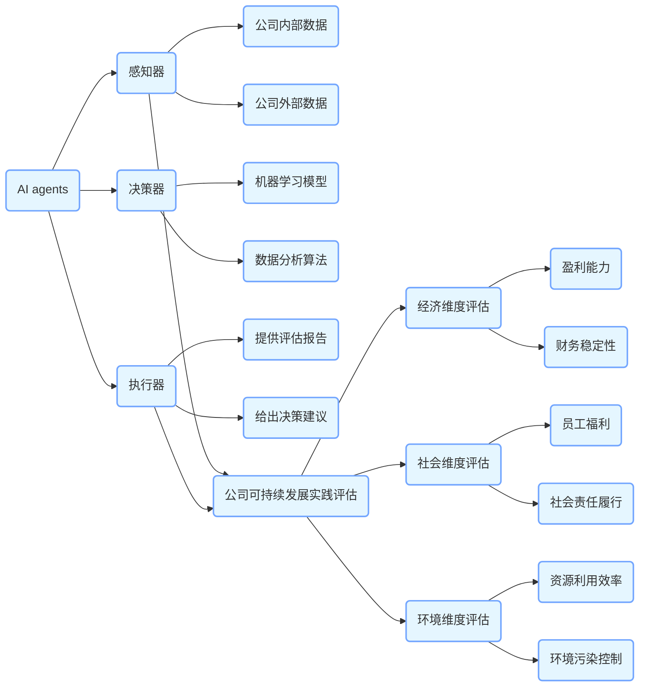

# AI agents在公司可持续发展实践评估中的应用

> 关键词：AI agents、公司可持续发展实践评估、人工智能、评估模型、应用场景

> 摘要：本文深入探讨了AI agents在公司可持续发展实践评估中的应用。首先介绍了相关背景，包括目的、预期读者等内容。接着阐述了AI agents和公司可持续发展实践评估的核心概念及联系，通过示意图和流程图进行清晰展示。详细讲解了核心算法原理，并给出Python源代码示例。介绍了相关数学模型和公式，并举例说明。通过项目实战，给出代码实际案例及详细解释。分析了实际应用场景，推荐了学习资源、开发工具框架以及相关论文著作。最后总结了未来发展趋势与挑战，还提供了常见问题解答和扩展阅读参考资料，旨在为公司在可持续发展实践评估中更好地应用AI agents提供全面的指导。

## 1. 背景介绍 
### 1.1 目的和范围
本文章的目的在于全面探讨AI agents在公司可持续发展实践评估中的应用。随着全球对可持续发展的关注度不断提高，公司需要更科学、高效的方法来评估自身的可持续发展实践。AI agents作为人工智能领域的重要技术，具有强大的信息处理和分析能力，能够为公司的可持续发展评估带来新的思路和方法。本文将涵盖AI agents的基本概念、在评估中的核心算法、数学模型，以及实际应用案例等方面，旨在为企业管理者、研究人员和相关从业者提供一个全面的参考。

### 1.2 预期读者
本文的预期读者主要包括企业管理者，他们可以通过了解AI agents在可持续发展评估中的应用，为公司制定更科学的发展战略；研究人员，他们可以从本文中获取相关研究思路和方法，推动该领域的学术研究；以及对人工智能和可持续发展感兴趣的从业者，帮助他们提升专业知识和技能。

### 1.3 文档结构概述
本文将按照以下结构进行阐述：首先介绍核心概念与联系，帮助读者了解AI agents和公司可持续发展实践评估的基本原理和它们之间的关系；接着详细讲解核心算法原理和具体操作步骤，并给出Python代码示例；然后介绍相关的数学模型和公式，并举例说明其应用；通过项目实战，展示代码的实际案例和详细解释；分析AI agents在公司可持续发展实践评估中的实际应用场景；推荐相关的学习资源、开发工具框架和论文著作；最后总结未来发展趋势与挑战，并提供常见问题解答和扩展阅读参考资料。

### 1.4 术语表
#### 1.4.1 核心术语定义
- **AI agents（人工智能代理）**：是一种能够感知环境、根据内部规则或学习机制进行决策，并采取行动以实现特定目标的软件实体。它可以自主地执行任务，与环境进行交互，并不断优化自身的行为。
- **公司可持续发展实践评估**：是指对公司在经济、社会和环境三个维度上的可持续发展实践进行全面、系统的评价，以衡量公司的可持续发展水平和绩效。

#### 1.4.2 相关概念解释
- **可持续发展**：是指既满足当代人的需求，又不损害后代人满足其需求的能力的发展模式。它强调经济、社会和环境的协调发展。
- **多目标优化**：在AI agents的应用中，多目标优化是指同时考虑多个目标，如经济利益、社会影响和环境效益，通过算法找到最优的解决方案。

#### 1.4.3 缩略词列表
- **AI**：Artificial Intelligence（人工智能）
- **ML**：Machine Learning（机器学习）
- **DL**：Deep Learning（深度学习）

## 2. 核心概念与联系 
### 2.1 AI agents的核心原理
AI agents是一种具有自主性、反应性、社会性和主动性的软件实体。它由感知器、决策器和执行器三部分组成。感知器负责收集环境信息，决策器根据感知到的信息和内部的规则或模型进行决策，执行器则根据决策结果采取相应的行动。AI agents可以通过学习机制不断优化自己的行为，以更好地适应环境和实现目标。

### 2.2 公司可持续发展实践评估的核心原理
公司可持续发展实践评估通常从经济、社会和环境三个维度进行。经济维度包括公司的盈利能力、财务稳定性等；社会维度包括员工福利、社会责任履行等；环境维度包括资源利用效率、环境污染控制等。评估过程通常需要收集大量的数据，并采用合适的评估方法和指标体系进行综合评价。

### 2.3 AI agents与公司可持续发展实践评估的联系
AI agents可以在公司可持续发展实践评估中发挥重要作用。它可以自动收集和分析各种数据，包括公司内部的财务数据、运营数据，以及外部的市场数据、环境数据等。通过机器学习和数据分析算法，AI agents可以识别公司可持续发展实践中的关键因素和潜在问题，并提供针对性的建议和决策支持。例如，AI agents可以帮助公司预测环境法规变化对其业务的影响，优化资源配置以提高环境绩效等。

### 2.4 文本示意图
```plaintext
AI agents
├── 感知器（收集环境信息）
│   ├── 公司内部数据（财务、运营等）
│   └── 公司外部数据（市场、环境等）
├── 决策器（根据信息和规则决策）
│   ├── 机器学习模型
│   └── 数据分析算法
└── 执行器（采取行动）
    ├── 提供评估报告
    └── 给出决策建议

公司可持续发展实践评估
├── 经济维度评估
│   ├── 盈利能力
│   └── 财务稳定性
├── 社会维度评估
│   ├── 员工福利
│   └── 社会责任履行
└── 环境维度评估
    ├── 资源利用效率
    └── 环境污染控制

联系：AI agents通过收集和分析数据，为公司可持续发展实践评估提供支持，帮助识别关键因素和潜在问题，提供决策建议。
```

### 2.5 Mermaid流程图


## 3. 核心算法原理 & 具体操作步骤 
### 3.1 核心算法原理
在AI agents应用于公司可持续发展实践评估中，常用的核心算法包括机器学习算法和数据分析算法。其中，决策树算法是一种常用的机器学习算法，它可以根据数据的特征进行分类和预测。

决策树算法的基本原理是通过对数据集进行递归划分，构建一棵决策树。每个内部节点表示一个特征上的测试，每个分支表示一个测试输出，每个叶节点表示一个类别或值。在构建决策树时，需要选择合适的特征和划分点，以最大化信息增益。

### 3.2 具体操作步骤
1. **数据收集**：收集公司的相关数据，包括经济、社会和环境维度的数据。数据可以来自公司内部的数据库、报表，以及外部的公开数据源。
2. **数据预处理**：对收集到的数据进行清洗、转换和归一化处理，以提高数据的质量和可用性。
3. **特征选择**：从预处理后的数据中选择与公司可持续发展实践评估相关的特征。可以使用相关性分析、主成分分析等方法进行特征选择。
4. **模型训练**：使用决策树算法对选择的特征和对应的标签进行训练，构建决策树模型。
5. **模型评估**：使用测试数据集对训练好的模型进行评估，计算模型的准确率、召回率等指标。
6. **应用模型**：将训练好的模型应用于实际的公司可持续发展实践评估中，根据模型的输出提供评估报告和决策建议。

### 3.3 Python源代码示例
```python
import pandas as pd
from sklearn.model_selection import train_test_split
from sklearn.tree import DecisionTreeClassifier
from sklearn.metrics import accuracy_score

# 1. 数据收集
# 假设数据存储在CSV文件中
data = pd.read_csv('company_sustainability_data.csv')

# 2. 数据预处理
# 假设数据已经进行了清洗和转换
X = data.drop('sustainability_label', axis=1)  # 特征
y = data['sustainability_label']  # 标签

# 3. 特征选择
# 这里简单选择所有特征，实际应用中可以进行特征选择
# 例如：使用相关性分析选择相关性高的特征

# 4. 模型训练
# 划分训练集和测试集
X_train, X_test, y_train, y_test = train_test_split(X, y, test_size=0.2, random_state=42)

# 创建决策树分类器
clf = DecisionTreeClassifier()

# 训练模型
clf.fit(X_train, y_train)

# 5. 模型评估
# 预测测试集
y_pred = clf.predict(X_test)

# 计算准确率
accuracy = accuracy_score(y_test, y_pred)
print(f"模型准确率: {accuracy}")

# 6. 应用模型
# 假设需要对新的数据进行评估
new_data = pd.read_csv('new_company_data.csv')
new_predictions = clf.predict(new_data)
print(f"新数据的预测结果: {new_predictions}")
```

## 4. 数学模型和公式 & 详细讲解 & 举例说明 
### 4.1 信息增益公式
在决策树算法中，信息增益是选择特征的重要指标。信息增益表示在使用某个特征进行划分后，数据集的不确定性减少的程度。信息增益的计算公式如下：
$$
IG(D, A) = H(D) - \sum_{v \in Values(A)} \frac{|D^v|}{|D|} H(D^v)
$$
其中：
- $IG(D, A)$ 表示特征 $A$ 对数据集 $D$ 的信息增益。
- $H(D)$ 表示数据集 $D$ 的熵，用于衡量数据集的不确定性。熵的计算公式为：
$$
H(D) = - \sum_{k=1}^{K} p_k \log_2 p_k
$$
其中 $p_k$ 表示数据集 $D$ 中第 $k$ 类样本的比例，$K$ 表示类别数。
- $Values(A)$ 表示特征 $A$ 的所有可能取值。
- $D^v$ 表示特征 $A$ 取值为 $v$ 时的子集。
- $\frac{|D^v|}{|D|}$ 表示子集 $D^v$ 在数据集 $D$ 中所占的比例。
- $H(D^v)$ 表示子集 $D^v$ 的熵。

### 4.2 详细讲解
信息增益的计算过程可以分为以下几个步骤：
1. 计算数据集 $D$ 的熵 $H(D)$。
2. 对于每个特征 $A$，计算其所有可能取值 $v$ 对应的子集 $D^v$。
3. 计算每个子集 $D^v$ 的熵 $H(D^v)$。
4. 计算特征 $A$ 对数据集 $D$ 的信息增益 $IG(D, A)$。

在决策树的构建过程中，选择信息增益最大的特征作为当前节点的划分特征，以最大化数据集的不确定性减少程度。

### 4.3 举例说明
假设我们有一个数据集 $D$，包含 10 个样本，分为两类：正类和负类，其中正类样本有 6 个，负类样本有 4 个。

首先计算数据集 $D$ 的熵：
$$
p_1 = \frac{6}{10} = 0.6, p_2 = \frac{4}{10} = 0.4
$$
$$
H(D) = - (0.6 \log_2 0.6 + 0.4 \log_2 0.4) \approx 0.971
$$

假设我们有一个特征 $A$，有两个取值：$v_1$ 和 $v_2$。特征 $A$ 取值为 $v_1$ 的子集 $D^{v_1}$ 包含 6 个样本，其中正类样本有 4 个，负类样本有 2 个；特征 $A$ 取值为 $v_2$ 的子集 $D^{v_2}$ 包含 4 个样本，其中正类样本有 2 个，负类样本有 2 个。

计算子集 $D^{v_1}$ 的熵：
$$
p_{11} = \frac{4}{6} \approx 0.667, p_{12} = \frac{2}{6} \approx 0.333
$$
$$
H(D^{v_1}) = - (0.667 \log_2 0.667 + 0.333 \log_2 0.333) \approx 0.918
$$

计算子集 $D^{v_2}$ 的熵：
$$
p_{21} = \frac{2}{4} = 0.5, p_{22} = \frac{2}{4} = 0.5
$$
$$
H(D^{v_2}) = - (0.5 \log_2 0.5 + 0.5 \log_2 0.5) = 1
$$

计算特征 $A$ 对数据集 $D$ 的信息增益：
$$
IG(D, A) = H(D) - (\frac{6}{10} H(D^{v_1}) + \frac{4}{10} H(D^{v_2}))
$$
$$
= 0.971 - (\frac{6}{10} \times 0.918 + \frac{4}{10} \times 1) \approx 0.02
$$

## 5. 项目实战：代码实际案例和详细解释说明 
### 5.1  开发环境搭建
#### 5.1.1 安装Python
首先需要安装Python环境，建议使用Python 3.7及以上版本。可以从Python官方网站（https://www.python.org/downloads/）下载安装包，按照安装向导进行安装。

#### 5.1.2 安装必要的库
在项目中，需要使用一些Python库，如`pandas`、`scikit-learn`等。可以使用`pip`命令进行安装：
```sh
pip install pandas scikit-learn
```

### 5.2  源代码详细实现和代码解读
```python
import pandas as pd
from sklearn.model_selection import train_test_split
from sklearn.tree import DecisionTreeClassifier
from sklearn.metrics import accuracy_score

# 1. 数据收集
# 假设数据存储在CSV文件中
data = pd.read_csv('company_sustainability_data.csv')

# 代码解读：使用pandas库的read_csv函数读取CSV文件，将数据存储在DataFrame对象中。

# 2. 数据预处理
# 假设数据已经进行了清洗和转换
X = data.drop('sustainability_label', axis=1)  # 特征
y = data['sustainability_label']  # 标签

# 代码解读：使用DataFrame的drop方法删除标签列，得到特征矩阵X；使用列索引获取标签向量y。

# 3. 特征选择
# 这里简单选择所有特征，实际应用中可以进行特征选择
# 例如：使用相关性分析选择相关性高的特征

# 代码解读：在这个简单示例中，没有进行特征选择，直接使用所有特征。实际应用中，可以使用相关性分析等方法选择相关性高的特征。

# 4. 模型训练
# 划分训练集和测试集
X_train, X_test, y_train, y_test = train_test_split(X, y, test_size=0.2, random_state=42)

# 代码解读：使用scikit-learn库的train_test_split函数将数据集划分为训练集和测试集，测试集占比为20%。

# 创建决策树分类器
clf = DecisionTreeClassifier()

# 代码解读：创建一个决策树分类器对象。

# 训练模型
clf.fit(X_train, y_train)

# 代码解读：使用训练集对决策树分类器进行训练。

# 5. 模型评估
# 预测测试集
y_pred = clf.predict(X_test)

# 代码解读：使用训练好的模型对测试集进行预测，得到预测结果y_pred。

# 计算准确率
accuracy = accuracy_score(y_test, y_pred)
print(f"模型准确率: {accuracy}")

# 代码解读：使用scikit-learn库的accuracy_score函数计算模型的准确率，并打印输出。

# 6. 应用模型
# 假设需要对新的数据进行评估
new_data = pd.read_csv('new_company_data.csv')
new_predictions = clf.predict(new_data)
print(f"新数据的预测结果: {new_predictions}")

# 代码解读：读取新的数据集，使用训练好的模型对新数据进行预测，并打印预测结果。
```

### 5.3  代码解读与分析
#### 5.3.1 数据处理
代码中使用`pandas`库进行数据的读取和处理。`read_csv`函数可以方便地读取CSV文件，将数据存储在`DataFrame`对象中。`drop`方法用于删除不需要的列，获取特征矩阵和标签向量。

#### 5.3.2 模型训练和评估
使用`scikit-learn`库的`train_test_split`函数将数据集划分为训练集和测试集，保证模型评估的准确性。`DecisionTreeClassifier`类用于创建决策树分类器，`fit`方法用于训练模型，`predict`方法用于进行预测。`accuracy_score`函数用于计算模型的准确率。

#### 5.3.3 应用模型
读取新的数据集，使用训练好的模型对新数据进行预测，得到预测结果。

## 6. 实际应用场景 
### 6.1 战略规划
AI agents可以帮助公司在制定可持续发展战略时进行全面的评估和分析。通过收集和分析市场趋势、竞争对手情况、环境法规等信息，AI agents可以为公司提供针对性的建议，帮助公司确定可持续发展的目标和方向。例如，AI agents可以分析不同行业的可持续发展趋势，为公司选择具有潜力的业务领域提供参考。

### 6.2 风险评估
在公司的运营过程中，AI agents可以实时监测各种风险因素，如环境风险、社会风险等。通过对大量数据的分析，AI agents可以提前预警潜在的风险，并提供相应的应对措施。例如，AI agents可以监测环境法规的变化，评估其对公司业务的影响，帮助公司制定相应的合规策略。

### 6.3 绩效评估
AI agents可以定期对公司的可持续发展绩效进行评估，提供客观、准确的评估报告。通过对经济、社会和环境三个维度的指标进行分析，AI agents可以帮助公司了解自身的可持续发展水平，发现存在的问题和不足，并提出改进建议。例如，AI agents可以分析公司的能源消耗情况，评估其能源利用效率，并提出节能措施。

### 6.4 供应链管理
在供应链管理中，AI agents可以帮助公司评估供应商的可持续发展实践。通过收集和分析供应商的相关数据，AI agents可以对供应商进行分类和评级，选择符合公司可持续发展要求的供应商。例如，AI agents可以评估供应商的环境管理体系、社会责任履行情况等，帮助公司建立绿色供应链。

## 7. 工具和资源推荐
### 7.1 学习资源推荐
#### 7.1.1 书籍推荐
- 《人工智能：一种现代的方法》：这本书是人工智能领域的经典教材，全面介绍了人工智能的基本概念、算法和应用。
- 《Python机器学习》：详细介绍了Python在机器学习中的应用，包括各种机器学习算法的原理和实现。
- 《可持续发展经济学》：介绍了可持续发展的经济理论和方法，对于理解公司可持续发展实践评估具有重要的参考价值。

#### 7.1.2 在线课程
- Coursera上的“人工智能基础”课程：由知名高校的教授授课，系统地介绍了人工智能的基础知识和应用。
- edX上的“机器学习”课程：提供了丰富的机器学习算法和实践案例，适合初学者和有一定基础的学习者。
- 中国大学MOOC上的“可持续发展概论”课程：介绍了可持续发展的基本概念、理论和实践，帮助学习者了解可持续发展的重要性。

#### 7.1.3 技术博客和网站
- Towards Data Science：一个专注于数据科学和机器学习的技术博客，提供了大量的技术文章和实践案例。
- AI Time：一个人工智能领域的资讯平台，及时发布人工智能的最新研究成果和应用案例。
- 世界可持续发展工商理事会（WBCSD）官网：提供了关于公司可持续发展的最新动态、研究报告和最佳实践案例。

### 7.2 开发工具框架推荐
#### 7.2.1 IDE和编辑器
- PyCharm：一款专业的Python集成开发环境，提供了丰富的代码编辑、调试和测试功能。
- Jupyter Notebook：一个交互式的开发环境，适合进行数据分析和模型训练，支持Python、R等多种编程语言。
- Visual Studio Code：一款轻量级的代码编辑器，支持多种编程语言和插件扩展，具有良好的开发体验。

#### 7.2.2 调试和性能分析工具
- TensorBoard：一个用于可视化深度学习模型训练过程和性能的工具，可以帮助开发者更好地理解模型的训练情况。
- Py-Spy：一个用于分析Python程序性能的工具，可以找出程序中的性能瓶颈。
- Scikit-learn的交叉验证工具：可以帮助开发者评估模型的性能和稳定性。

#### 7.2.3 相关框架和库
- Scikit-learn：一个简单易用的机器学习库，提供了各种机器学习算法和工具，如分类、回归、聚类等。
- TensorFlow：一个开源的深度学习框架，广泛应用于图像识别、自然语言处理等领域。
- Pandas：一个用于数据处理和分析的Python库，提供了高效的数据结构和数据操作方法。

### 7.3 相关论文著作推荐
#### 7.3.1 经典论文
- “A Logical Calculus of the Ideas Immanent in Nervous Activity”：这篇论文是神经网络领域的经典之作，为人工智能的发展奠定了基础。
- “Gradient-Based Learning Applied to Document Recognition”：介绍了卷积神经网络在文档识别中的应用，推动了深度学习的发展。
- “Sustainable Development: A Critical Review”：对可持续发展的概念、理论和实践进行了系统的回顾和分析。

#### 7.3.2 最新研究成果
- 关注顶级学术会议如NeurIPS、ICML、AAAI等的论文，了解人工智能领域的最新研究成果。
- 关注可持续发展领域的学术期刊如《Journal of Cleaner Production》、《Sustainable Development》等，了解公司可持续发展实践评估的最新研究动态。

#### 7.3.3 应用案例分析
- 《Sustainable Business Models: Origins, Present Research, and Future Avenues》：分析了不同行业的可持续发展商业模式案例，为公司提供了实践参考。
- 《Corporate Sustainability: First Evidence on Materiality》：研究了公司可持续发展实践的重要性和影响因素，通过实际案例进行了验证。

## 8. 总结：未来发展趋势与挑战
### 8.1 未来发展趋势
#### 8.1.1 融合更多技术
未来，AI agents将与其他技术如物联网、区块链等深度融合。物联网可以提供更丰富的实时数据，区块链可以保证数据的安全性和可信度，从而提高AI agents在公司可持续发展实践评估中的准确性和可靠性。

#### 8.1.2 实现更智能的决策
随着人工智能技术的不断发展，AI agents将具备更强大的智能决策能力。它可以自动分析复杂的情况，提供更精准的决策建议，帮助公司更好地应对可持续发展中的挑战。

#### 8.1.3 推动行业标准的制定
AI agents在公司可持续发展实践评估中的广泛应用将推动行业标准的制定。通过统一的评估指标和方法，不同公司之间可以进行更公平、客观的比较，促进整个行业的可持续发展。

### 8.2 挑战
#### 8.2.1 数据质量和隐私问题
AI agents的性能依赖于大量高质量的数据。然而，数据的收集、整理和标注过程中可能存在质量问题，影响模型的准确性。此外，数据隐私问题也是一个重要的挑战，需要采取有效的措施保护公司和用户的数据安全。

#### 8.2.2 算法解释性问题
许多人工智能算法如深度学习算法是黑盒模型，难以解释其决策过程和结果。在公司可持续发展实践评估中，需要对评估结果进行合理的解释，以便公司管理者和相关利益者能够理解和接受。

#### 8.2.3 人才短缺问题
AI agents在公司可持续发展实践评估中的应用需要具备人工智能、可持续发展等多领域知识的复合型人才。目前，这类人才相对短缺，限制了该技术的广泛应用和发展。

## 9. 附录：常见问题与解答
### 9.1 AI agents在公司可持续发展实践评估中的准确性如何保证？
可以通过以下方法保证AI agents的准确性：
- 收集高质量的数据，对数据进行清洗和预处理，减少数据中的噪声和错误。
- 选择合适的算法和模型，根据具体的评估任务进行模型的训练和优化。
- 进行模型评估和验证，使用交叉验证等方法评估模型的性能，不断调整模型参数。

### 9.2 AI agents能否替代人工进行公司可持续发展实践评估？
AI agents不能完全替代人工进行评估。虽然AI agents具有强大的数据分析和处理能力，但在一些方面还需要人工的参与。例如，对于一些复杂的社会和环境问题，需要人类的专业知识和判断力进行分析和解释。此外，人工可以对AI agents的评估结果进行审核和验证，确保评估的准确性和可靠性。

### 9.3 如何解决AI agents在公司可持续发展实践评估中的算法解释性问题？
可以采用以下方法解决算法解释性问题：
- 选择可解释的算法，如决策树算法，其决策过程可以直观地展示出来。
- 使用模型解释工具，如LIME、SHAP等，对模型的决策结果进行解释。
- 结合领域知识，对模型的输出进行分析和解读，将模型的结果转化为易于理解的信息。

## 10. 扩展阅读 & 参考资料
### 10.1 扩展阅读
- 《AI 3.0》：介绍了人工智能的发展历程和未来趋势，对于理解AI agents的发展具有重要的参考价值。
- 《绿色发展：理念与行动》：探讨了绿色发展的理念和实践，为公司可持续发展提供了新的思路。

### 10.2 参考资料
- 相关学术论文和研究报告，如《Artificial Intelligence for Sustainable Development Goals》、《Corporate Social Responsibility and Sustainability: An Integrative Approach》等。
- 行业标准和指南，如全球报告倡议组织（GRI）的可持续发展报告标准。

作者：AI天才研究院/AI Genius Institute & 禅与计算机程序设计艺术 /Zen And The Art of Computer Programming