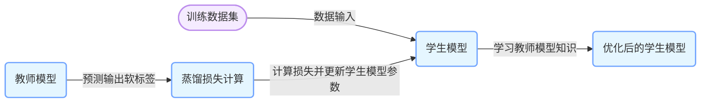

# AI中的知识蒸馏:从大模型到小模型的技能传递

> 关键词：知识蒸馏、大模型、小模型、技能传递、AI、模型压缩、迁移学习

> 摘要：本文围绕AI中的知识蒸馏展开，深入探讨从大模型到小模型的技能传递这一核心主题。首先介绍知识蒸馏的背景，包括其目的、预期读者等内容。接着阐述核心概念与联系，给出相关原理和架构的示意图与流程图。详细讲解核心算法原理，并结合Python源代码进行说明，同时介绍相关数学模型和公式。通过项目实战展示代码实现及解读，分析实际应用场景。还推荐了学习资源、开发工具框架以及相关论文著作。最后总结知识蒸馏的未来发展趋势与挑战，解答常见问题并提供扩展阅读和参考资料，旨在帮助读者全面深入地理解知识蒸馏技术。

## 1. 背景介绍 
### 1.1 目的和范围
在人工智能领域，随着深度学习的不断发展，模型的规模越来越大，性能也越来越强大。然而，大模型存在诸多问题，如计算资源需求高、推理速度慢、难以部署在资源受限的设备上等。知识蒸馏技术应运而生，其目的是将大模型（教师模型）所学到的知识传递给小模型（学生模型），使得小模型在保持较小规模的同时，尽可能达到大模型的性能。本文的范围涵盖知识蒸馏的基本概念、核心算法、数学模型、实际应用案例以及相关工具和资源推荐等方面，旨在为读者全面介绍知识蒸馏这一重要技术。

### 1.2 预期读者
本文预期读者包括对人工智能和机器学习有一定了解的研究人员、工程师、学生等。对于希望深入学习知识蒸馏技术，了解如何将大模型的知识迁移到小模型上，以及解决模型部署过程中资源受限问题的读者具有较高的参考价值。

### 1.3 文档结构概述
本文首先介绍知识蒸馏的背景信息，包括目的、预期读者和文档结构概述等。接着阐述知识蒸馏的核心概念与联系，通过文本示意图和Mermaid流程图展示其原理和架构。然后详细讲解核心算法原理，并结合Python源代码进行说明，同时介绍相关数学模型和公式。通过项目实战部分展示代码实现及解读，分析知识蒸馏在实际应用中的场景。之后推荐学习资源、开发工具框架以及相关论文著作。最后总结知识蒸馏的未来发展趋势与挑战，解答常见问题并提供扩展阅读和参考资料。

### 1.4 术语表
#### 1.4.1 核心术语定义
- **知识蒸馏（Knowledge Distillation）**：一种将大模型（教师模型）的知识传递给小模型（学生模型）的技术，通过让学生模型学习教师模型的输出（软标签）来提升学生模型的性能。
- **教师模型（Teacher Model）**：通常是一个规模较大、性能较好的预训练模型，其学习到的知识将被传递给学生模型。
- **学生模型（Student Model）**：规模较小的模型，通过学习教师模型的知识来提高自身性能，以在资源受限的环境中实现类似的任务表现。
- **软标签（Soft Labels）**：教师模型输出的概率分布，包含了比硬标签（类别标签）更多的信息，能够帮助学生模型更好地学习类别之间的关系。

#### 1.4.2 相关概念解释
- **模型压缩（Model Compression）**：知识蒸馏是模型压缩的一种方法，旨在减少模型的参数数量和计算量，同时保持模型的性能。其他模型压缩方法还包括量化、剪枝等。
- **迁移学习（Transfer Learning）**：知识蒸馏可以看作是一种特殊的迁移学习，它将教师模型在大规模数据上学习到的知识迁移到学生模型上，使得学生模型能够更快地收敛和达到较好的性能。

#### 1.4.3 缩略词列表
- **NN**：神经网络（Neural Network）
- **CNN**：卷积神经网络（Convolutional Neural Network）
- **RNN**：循环神经网络（Recurrent Neural Network）
- **MLP**：多层感知机（Multi - Layer Perceptron）

## 2. 核心概念与联系 

### 核心概念原理
知识蒸馏的核心思想是让学生模型学习教师模型的输出，而不仅仅是训练数据的硬标签。教师模型通常是一个在大规模数据集上训练好的复杂模型，它能够学习到数据中丰富的特征和模式。学生模型则是一个相对简单的模型，通过模仿教师模型的输出，学生模型可以学习到教师模型所学到的知识，从而在性能上接近教师模型。

具体来说，知识蒸馏过程包括两个阶段。在第一阶段，教师模型在大规模数据集上进行训练，学习到数据的特征和模式，并输出每个样本属于各个类别的概率分布（软标签）。在第二阶段，学生模型在相同的数据集上进行训练，其损失函数不仅包括传统的交叉熵损失（基于硬标签），还包括一个蒸馏损失（基于教师模型的软标签）。通过调整蒸馏损失的权重，可以平衡学生模型对硬标签和软标签的学习。

### 架构的文本示意图
```plaintext
+------------------+              +------------------+
|  训练数据集      |              |  教师模型        |
+------------------+              +------------------+
           |                                |
           | 数据输入                      | 预测输出软标签
           v                                v
+------------------+              +------------------+
|  学生模型        |              |  蒸馏损失计算    |
+------------------+              +------------------+
           |                                |
           | 学习教师模型知识              | 计算损失并更新学生模型参数
           v                                v
+------------------+
|  优化后的学生模型  |
+------------------+
```

### Mermaid流程图


## 3. 核心算法原理 & 具体操作步骤 

### 核心算法原理
知识蒸馏的核心算法主要基于损失函数的设计。学生模型的损失函数通常由两部分组成：传统的交叉熵损失（基于硬标签）和蒸馏损失（基于教师模型的软标签）。

传统的交叉熵损失函数定义为：
$$L_{ce}=-\sum_{i=1}^{N}\sum_{j=1}^{C}y_{ij}\log(p_{ij})$$
其中，$N$ 是样本数量，$C$ 是类别数量，$y_{ij}$ 是第 $i$ 个样本的第 $j$ 个类别的真实标签（硬标签），$p_{ij}$ 是学生模型预测的第 $i$ 个样本属于第 $j$ 个类别的概率。

蒸馏损失函数通常使用 KL 散度来衡量学生模型的输出概率分布 $q$ 和教师模型的输出概率分布 $p$ 之间的差异：
$$L_{kd}=T^2\cdot KL(p||q)=T^2\cdot\sum_{j=1}^{C}p_{j}\log\frac{p_{j}}{q_{j}}$$
其中，$T$ 是温度参数，用于控制软标签的平滑程度。温度参数越大，软标签的分布越平滑，能够提供更多的类别之间的信息。

最终的学生模型损失函数为：
$$L=(1 - \alpha)L_{ce}+\alpha L_{kd}$$
其中，$\alpha$ 是一个超参数，用于平衡交叉熵损失和蒸馏损失的权重。

### 具体操作步骤
1. **训练教师模型**：在大规模数据集上训练一个复杂的模型作为教师模型，得到每个样本的软标签。
2. **初始化学生模型**：随机初始化一个较小的模型作为学生模型。
3. **训练学生模型**：在相同的数据集上训练学生模型，计算交叉熵损失和蒸馏损失，并根据最终的损失函数更新学生模型的参数。
4. **调整超参数**：调整温度参数 $T$ 和权重参数 $\alpha$，以获得最佳的学生模型性能。

### Python源代码详细阐述
```python
import torch
import torch.nn as nn
import torch.optim as optim

# 定义教师模型
class TeacherModel(nn.Module):
    def __init__(self, input_size, hidden_size, num_classes):
        super(TeacherModel, self).__init__()
        self.fc1 = nn.Linear(input_size, hidden_size)
        self.relu = nn.ReLU()
        self.fc2 = nn.Linear(hidden_size, num_classes)

    def forward(self, x):
        out = self.fc1(x)
        out = self.relu(out)
        out = self.fc2(out)
        return out

# 定义学生模型
class StudentModel(nn.Module):
    def __init__(self, input_size, num_classes):
        super(StudentModel, self).__init__()
        self.fc = nn.Linear(input_size, num_classes)

    def forward(self, x):
        out = self.fc(x)
        return out

# 知识蒸馏损失函数
def knowledge_distillation_loss(student_logits, teacher_logits, labels, temperature, alpha):
    # 计算交叉熵损失
    ce_loss = nn.CrossEntropyLoss()(student_logits, labels)

    # 计算蒸馏损失
    softmax_teacher = nn.Softmax(dim=1)(teacher_logits / temperature)
    softmax_student = nn.Softmax(dim=1)(student_logits / temperature)
    kd_loss = nn.KLDivLoss(reduction='batchmean')(torch.log(softmax_student), softmax_teacher) * (temperature ** 2)

    # 最终损失
    final_loss = (1 - alpha) * ce_loss + alpha * kd_loss
    return final_loss

# 训练学生模型
def train_student(teacher_model, student_model, train_loader, temperature, alpha, num_epochs, learning_rate):
    criterion = lambda student_logits, teacher_logits, labels: knowledge_distillation_loss(student_logits, teacher_logits, labels, temperature, alpha)
    optimizer = optim.Adam(student_model.parameters(), lr=learning_rate)

    for epoch in range(num_epochs):
        for inputs, labels in train_loader:
            # 教师模型预测
            teacher_logits = teacher_model(inputs)

            # 学生模型预测
            student_logits = student_model(inputs)

            # 计算损失
            loss = criterion(student_logits, teacher_logits, labels)

            # 反向传播和优化
            optimizer.zero_grad()
            loss.backward()
            optimizer.step()

        print(f'Epoch {epoch + 1}/{num_epochs}, Loss: {loss.item()}')

    return student_model
```

## 4. 数学模型和公式 & 详细讲解 & 举例说明 

### 数学模型和公式
1. **交叉熵损失函数**
$$L_{ce}=-\sum_{i=1}^{N}\sum_{j=1}^{C}y_{ij}\log(p_{ij})$$
详细讲解：交叉熵损失函数用于衡量学生模型的预测概率分布 $p$ 与真实标签的分布 $y$ 之间的差异。对于每个样本 $i$，计算其属于各个类别 $j$ 的交叉熵，然后对所有样本求和。真实标签 $y_{ij}$ 通常是一个 one - hot 向量，只有一个元素为 1，其余元素为 0。

举例说明：假设我们有一个二分类问题，样本数量 $N = 2$，类别数量 $C = 2$。真实标签 $y = [[1, 0], [0, 1]]$，学生模型的预测概率 $p = [[0.8, 0.2], [0.3, 0.7]]$。则交叉熵损失为：
$$L_{ce}=-(1\times\log(0.8)+0\times\log(0.2)+0\times\log(0.3)+1\times\log(0.7))\approx 0.357$$

2. **KL 散度（蒸馏损失）**
$$L_{kd}=T^2\cdot KL(p||q)=T^2\cdot\sum_{j=1}^{C}p_{j}\log\frac{p_{j}}{q_{j}}$$
详细讲解：KL 散度用于衡量两个概率分布 $p$ 和 $q$ 之间的差异。在知识蒸馏中，$p$ 是教师模型的输出概率分布，$q$ 是学生模型的输出概率分布。温度参数 $T$ 用于控制软标签的平滑程度，$T$ 越大，软标签的分布越平滑。

举例说明：假设教师模型的输出概率分布 $p = [0.6, 0.4]$，学生模型的输出概率分布 $q = [0.7, 0.3]$，温度参数 $T = 2$。则 KL 散度为：
$$KL(p||q)=0.6\times\log\frac{0.6}{0.7}+0.4\times\log\frac{0.4}{0.3}\approx 0.029$$
蒸馏损失为：
$$L_{kd}=2^2\times 0.029 = 0.116$$

3. **最终损失函数**
$$L=(1 - \alpha)L_{ce}+\alpha L_{kd}$$
详细讲解：最终损失函数是交叉熵损失和蒸馏损失的加权和，$\alpha$ 是一个超参数，用于平衡两者的权重。$\alpha$ 越大，学生模型越注重学习教师模型的软标签；$\alpha$ 越小，学生模型越注重学习真实标签。

举例说明：假设交叉熵损失 $L_{ce}=0.357$，蒸馏损失 $L_{kd}=0.116$，$\alpha = 0.5$。则最终损失为：
$$L=(1 - 0.5)\times 0.357+0.5\times 0.116 = 0.2365$$

## 5. 项目实战：代码实际案例和详细解释说明 

### 5.1  开发环境搭建
1. **安装 Python**：确保系统中安装了 Python 3.6 或更高版本。
2. **安装 PyTorch**：根据自己的系统和 CUDA 版本，选择合适的 PyTorch 版本进行安装。可以使用以下命令安装：
```sh
pip install torch torchvision
```
3. **安装其他依赖库**：安装必要的库，如 `numpy`、`matplotlib` 等。
```sh
pip install numpy matplotlib
```

### 5.2  源代码详细实现和代码解读
```python
import torch
import torch.nn as nn
import torch.optim as optim
from torch.utils.data import DataLoader, TensorDataset
import numpy as np

# 生成一些示例数据
np.random.seed(42)
num_samples = 1000
input_size = 10
num_classes = 5
X = np.random.randn(num_samples, input_size).astype(np.float32)
y = np.random.randint(0, num_classes, num_samples)

# 转换为 PyTorch 张量
X = torch.from_numpy(X)
y = torch.from_numpy(y)

# 创建数据集和数据加载器
dataset = TensorDataset(X, y)
train_loader = DataLoader(dataset, batch_size=32, shuffle=True)

# 定义教师模型
class TeacherModel(nn.Module):
    def __init__(self, input_size, hidden_size, num_classes):
        super(TeacherModel, self).__init__()
        self.fc1 = nn.Linear(input_size, hidden_size)
        self.relu = nn.ReLU()
        self.fc2 = nn.Linear(hidden_size, num_classes)

    def forward(self, x):
        out = self.fc1(x)
        out = self.relu(out)
        out = self.fc2(out)
        return out

# 定义学生模型
class StudentModel(nn.Module):
    def __init__(self, input_size, num_classes):
        super(StudentModel, self).__init__()
        self.fc = nn.Linear(input_size, num_classes)

    def forward(self, x):
        out = self.fc(x)
        return out

# 知识蒸馏损失函数
def knowledge_distillation_loss(student_logits, teacher_logits, labels, temperature, alpha):
    # 计算交叉熵损失
    ce_loss = nn.CrossEntropyLoss()(student_logits, labels)

    # 计算蒸馏损失
    softmax_teacher = nn.Softmax(dim=1)(teacher_logits / temperature)
    softmax_student = nn.Softmax(dim=1)(student_logits / temperature)
    kd_loss = nn.KLDivLoss(reduction='batchmean')(torch.log(softmax_student), softmax_teacher) * (temperature ** 2)

    # 最终损失
    final_loss = (1 - alpha) * ce_loss + alpha * kd_loss
    return final_loss

# 训练学生模型
def train_student(teacher_model, student_model, train_loader, temperature, alpha, num_epochs, learning_rate):
    criterion = lambda student_logits, teacher_logits, labels: knowledge_distillation_loss(student_logits, teacher_logits, labels, temperature, alpha)
    optimizer = optim.Adam(student_model.parameters(), lr=learning_rate)

    for epoch in range(num_epochs):
        for inputs, labels in train_loader:
            # 教师模型预测
            teacher_logits = teacher_model(inputs)

            # 学生模型预测
            student_logits = student_model