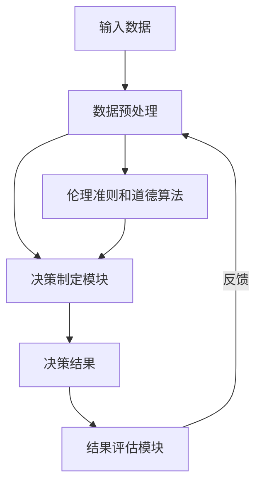

# AI伦理决策模型:将道德考量融入算法

> 关键词：AI伦理决策模型、道德考量、算法、人工智能、伦理准则、决策制定、道德算法

> 摘要：本文深入探讨了AI伦理决策模型，旨在阐述如何将道德考量融入算法之中。首先介绍了研究的背景、目的、预期读者和文档结构，解释了相关术语。接着详细阐述了核心概念、算法原理、数学模型，通过Python代码示例进行说明。然后给出项目实战案例，包括开发环境搭建、源代码实现与解读。之后分析了实际应用场景，推荐了学习资源、开发工具和相关论文。最后总结了未来发展趋势与挑战，并提供常见问题解答和参考资料，旨在为研究者和开发者在构建符合伦理道德的AI系统方面提供全面的指导。

## 1. 背景介绍 
### 1.1 目的和范围
随着人工智能技术的飞速发展，其在各个领域的应用日益广泛，如医疗、金融、交通等。然而，AI系统在决策过程中可能会产生伦理问题，例如歧视、隐私侵犯等。本研究的目的是构建AI伦理决策模型，将道德考量融入算法，使AI系统在决策时能够遵循一定的伦理准则。研究范围涵盖了AI伦理决策模型的核心概念、算法原理、数学模型、实际应用场景等方面。

### 1.2 预期读者
本文预期读者包括人工智能领域的研究者、开发者、伦理学家、政策制定者以及对AI伦理问题感兴趣的人士。对于研究者和开发者，本文提供了技术实现的指导；对于伦理学家和政策制定者，本文有助于他们理解AI伦理决策的技术层面，从而更好地制定相关政策和准则；对于普通读者，本文可以帮助他们了解AI伦理问题的重要性和解决方案。

### 1.3 文档结构概述
本文首先介绍了研究的背景信息，包括目的、预期读者和文档结构。接着阐述了核心概念与联系，通过文本示意图和Mermaid流程图进行说明。然后详细讲解了核心算法原理和具体操作步骤，并给出Python源代码示例。之后介绍了数学模型和公式，并举例说明。在项目实战部分，提供了开发环境搭建、源代码实现和代码解读。随后分析了实际应用场景，推荐了学习资源、开发工具和相关论文。最后总结了未来发展趋势与挑战，提供常见问题解答和参考资料。

### 1.4 术语表
#### 1.4.1 核心术语定义
- **AI伦理决策模型**：一种将道德考量融入AI算法的模型，使AI系统在决策过程中能够遵循一定的伦理准则。
- **道德考量**：在决策过程中考虑道德因素，如公平、正义、隐私保护等。
- **算法**：解决特定问题的一系列指令和步骤。
- **伦理准则**：指导行为的道德规范和原则。
- **决策制定**：在多个选项中选择一个最优方案的过程。

#### 1.4.2 相关概念解释
- **道德算法**：将道德规则转化为算法代码，使AI系统能够根据这些规则进行决策。
- **伦理风险评估**：对AI系统可能产生的伦理问题进行评估和分析。
- **可解释性AI**：使AI系统的决策过程和结果能够被人类理解和解释。

#### 1.4.3 缩略词列表
- **AI**：Artificial Intelligence，人工智能
- **ML**：Machine Learning，机器学习
- **DL**：Deep Learning，深度学习

## 2. 核心概念与联系 

### 核心概念原理
AI伦理决策模型的核心原理是将道德考量融入AI算法的决策过程中。传统的AI算法主要关注优化目标，如准确性、效率等，而忽略了道德因素。AI伦理决策模型通过引入伦理准则和道德算法，使AI系统在决策时能够考虑到公平、正义、隐私保护等道德因素。

其基本原理可以分为以下几个步骤：
1. **伦理准则定义**：明确AI系统需要遵循的伦理准则，如不歧视、保护隐私等。
2. **道德算法设计**：将伦理准则转化为具体的算法代码，使AI系统能够根据这些代码进行决策。
3. **数据预处理**：对输入数据进行处理，确保数据的质量和公正性，避免数据中的偏见影响决策结果。
4. **决策制定**：在多个选项中选择一个最优方案，同时考虑伦理准则和道德算法的约束。
5. **结果评估**：对决策结果进行评估，检查是否符合伦理准则和道德算法的要求。

### 架构的文本示意图
```plaintext
输入数据
|
|-- 数据预处理
|   |-- 数据清洗
|   |-- 数据归一化
|   |-- 去除偏见
|
|-- 伦理准则和道德算法
|   |-- 伦理准则定义
|   |-- 道德算法设计
|
|-- 决策制定模块
|   |-- 多目标优化
|   |-- 约束条件处理
|
|-- 决策结果
|
|-- 结果评估模块
|   |-- 伦理合规检查
|   |-- 结果反馈
```

### Mermaid流程图


## 3. 核心算法原理 & 具体操作步骤 

### 算法原理讲解
AI伦理决策模型的核心算法可以基于多目标优化的思想，将伦理准则作为约束条件，同时优化其他目标，如准确性、效率等。下面是一个简单的示例，假设我们要构建一个AI系统来进行贷款审批，需要考虑公平性和准确性两个目标。

我们可以使用线性规划来实现这个多目标优化问题。假设我们有 $n$ 个申请人，每个申请人有 $m$ 个特征，我们的目标是找到一个决策向量 $\mathbf{x}=(x_1,x_2,\cdots,x_n)^T$，其中 $x_i\in\{0,1\}$ 表示第 $i$ 个申请人是否获得贷款。

我们的优化目标可以表示为：
- **准确性目标**：最大化正确预测的申请人数量。
- **公平性目标**：确保不同群体（如性别、种族等）的申请人获得贷款的比例相同。

### Python源代码示例
```python
import numpy as np
from scipy.optimize import linprog

# 假设有5个申请人，每个申请人有3个特征
n = 5
m = 3

# 生成随机特征矩阵
X = np.random.rand(n, m)

# 生成随机标签（是否违约）
y = np.random.randint(0, 2, n)

# 定义准确性目标函数的系数
c_accuracy = -y  # 最大化正确预测数量，所以取负

# 定义公平性约束条件
# 假设我们有两个群体，每个群体有2个和3个申请人
group_sizes = [2, 3]
group_indices = [np.arange(0, 2), np.arange(2, 5)]

# 公平性约束条件的系数矩阵
A_eq = np.zeros((len(group_sizes) - 1, n))
for i in range(len(group_sizes) - 1):
    A_eq[i, group_indices[i]] = 1 / group_sizes[i]
    A_eq[i, group_indices[i + 1]] = -1 / group_sizes[i + 1]

# 公平性约束条件的右侧常数
b_eq = np.zeros(len(group_sizes) - 1)

# 决策变量的上下界
bounds = [(0, 1) for _ in range(n)]

# 求解线性规划问题
res = linprog(c_accuracy, A_eq=A_eq, b_eq=b_eq, bounds=bounds)

# 决策结果
decisions = res.x.round()
print("决策结果:", decisions)
```

### 具体操作步骤
1. **数据准备**：收集和整理相关数据，包括申请人的特征和标签。
2. **定义目标函数和约束条件**：根据具体问题，定义准确性目标函数和公平性约束条件。
3. **求解优化问题**：使用线性规划等优化算法求解多目标优化问题。
4. **决策结果评估**：对决策结果进行评估，检查是否符合伦理准则和其他要求。

## 4. 数学模型和公式 & 详细讲解 & 举例说明 

### 数学模型
假设我们有一个AI系统，需要在 $n$ 个选项中做出决策，每个选项有 $m$ 个特征。我们的目标是找到一个决策向量 $\mathbf{x}=(x_1,x_2,\cdots,x_n)^T$，其中 $x_i\in\{0,1\}$ 表示第 $i$ 个选项是否被选中。

我们可以定义以下目标函数和约束条件：

#### 目标函数
- **主要目标**：最大化某个性能指标，如准确性、效率等。假设性能指标可以表示为一个线性函数：
$$
\max_{\mathbf{x}} \mathbf{c}^T\mathbf{x}
$$
其中 $\mathbf{c}=(c_1,c_2,\cdots,c_n)^T$ 是性能指标的系数向量。

- **伦理目标**：确保决策结果符合伦理准则。例如，公平性可以表示为不同群体的选项被选中的比例相同。假设我们有 $k$ 个群体，每个群体有 $n_j$ 个选项，群体 $j$ 的选项集合为 $S_j$，则公平性约束可以表示为：
$$
\frac{\sum_{i\in S_j}x_i}{n_j}=\frac{\sum_{i\in S_{j+1}}x_i}{n_{j+1}}, \quad j = 1,2,\cdots,k - 1
$$

#### 约束条件
- **决策变量的取值范围**：
$$
0\leq x_i\leq 1, \quad i = 1,2,\cdots,n
$$
- **其他约束条件**：根据具体问题，可能还需要添加其他约束条件，如资源限制等。

### 详细讲解
上述数学模型将AI伦理决策问题转化为一个多目标优化问题。主要目标函数表示系统的性能要求，而伦理目标则作为约束条件，确保决策结果符合伦理准则。通过求解这个优化问题，我们可以得到一个既满足性能要求又符合伦理准则的决策方案。

### 举例说明
假设我们要构建一个AI系统来分配奖学金，有10个申请人，分为两个群体（男生和女生），每个群体有5个申请人。我们的目标是最大化奖学金分配的准确性（即选择最优秀的申请人），同时确保男生和女生获得奖学金的比例相同。

设 $x_i$ 表示第 $i$ 个申请人是否获得奖学金，$c_i$ 表示第 $i$ 个申请人的综合得分。则主要目标函数为：
$$
\max_{\mathbf{x}} \sum_{i = 1}^{10} c_ix_i
$$

公平性约束条件为：
$$
\frac{\sum_{i = 1}^{5}x_i}{5}=\frac{\sum_{i = 6}^{10}x_i}{5}
$$

同时，决策变量的取值范围为 $0\leq x_i\leq 1$。通过求解这个优化问题，我们可以得到一个公平且准确的奖学金分配方案。

## 5. 项目实战：代码实际案例和详细解释说明 

### 5.1  开发环境搭建
本项目使用Python进行开发，以下是开发环境搭建的步骤：

1. **安装Python**：建议使用Python 3.7及以上版本。可以从Python官方网站（https://www.python.org/downloads/）下载并安装。
2. **安装必要的库**：本项目需要使用`numpy`、`scipy`等库，可以使用以下命令进行安装：
```sh
pip install numpy scipy
```

### 5.2  源代码详细实现和代码解读
以下是一个完整的AI伦理决策模型的Python代码示例，用于解决贷款审批问题：

```python
import numpy as np
from scipy.optimize import linprog

# 假设有10个申请人，每个申请人有5个特征
n = 10
m = 5

# 生成随机特征矩阵
X = np.random.rand(n, m)

# 生成随机标签（是否违约）
y = np.random.randint(0, 2, n)

# 定义准确性目标函数的系数
c_accuracy = -y  # 最大化正确预测数量，所以取负

# 定义公平性约束条件
# 假设我们有两个群体，每个群体有5个申请人
group_sizes = [5, 5]
group_indices = [np.arange(0, 5), np.arange(5, 10)]

# 公平性约束条件的系数矩阵
A_eq = np.zeros((len(group_sizes) - 1, n))
for i in range(len(group_sizes) - 1):
    A_eq[i, group_indices[i]] = 1 / group_sizes[i]
    A_eq[i, group_indices[i + 1]] = -1 / group_sizes[i + 1]

# 公平性约束条件的右侧常数
b_eq = np.zeros(len(group_sizes) - 1)

# 决策变量的上下界
bounds = [(0, 1) for _ in range(n)]

# 求解线性规划问题
res = linprog(c_accuracy, A_eq=A_eq, b_eq=b_eq, bounds=bounds)

# 决策结果
decisions = res.x.round()
print("决策结果:", decisions)

# 评估决策结果的准确性
correct_predictions = np.sum(decisions == y)
accuracy = correct_predictions / n
print("准确性:", accuracy)

# 评估决策结果的公平性
group_decisions = [np.sum(decisions[group_indices[i]]) / group_sizes[i] for i in range(len(group_sizes))]
fairness = np.std(group_decisions)
print("公平性（标准差）:", fairness)
```

### 代码解读与分析
1. **数据生成**：使用`numpy`生成随机特征矩阵和标签，模拟申请人的特征和是否违约的情况。
2. **目标函数定义**：将准确性目标函数的系数取负，因为`linprog`函数是用于求解最小化问题。
3. **公平性约束条件定义**：根据群体划分，定义公平性约束条件的系数矩阵和右侧常数。
4. **求解优化问题**：使用`linprog`函数求解线性规划问题，得到决策结果。
5. **结果评估**：计算决策结果的准确性和公平性，准确性通过比较决策结果和真实标签来计算，公平性通过计算不同群体的决策比例的标准差来评估。

## 6. 实际应用场景 
AI伦理决策模型在许多实际应用场景中都具有重要的意义，以下是一些常见的应用场景：

### 医疗领域
在医疗诊断和治疗决策中，AI系统可以根据患者的病情、基因信息等进行诊断和治疗方案推荐。然而，这些决策可能会涉及到伦理问题，如公平性、隐私保护等。AI伦理决策模型可以确保不同种族、性别、社会经济地位的患者都能得到公平的诊断和治疗，同时保护患者的隐私信息。

### 金融领域
在贷款审批、投资决策等金融业务中，AI系统可以根据申请人的信用记录、收入情况等进行风险评估和决策。AI伦理决策模型可以避免因数据偏见导致的歧视问题，确保不同群体的申请人都能得到公平的对待。

### 交通领域
在自动驾驶汽车的决策过程中，AI系统需要考虑到交通安全、乘客舒适等多个因素。AI伦理决策模型可以在面临复杂情况时，如紧急刹车、避让行人等，做出符合伦理准则的决策，确保乘客和行人的安全。

### 教育领域
在智能教育系统中，AI可以根据学生的学习情况进行个性化的教学推荐。AI伦理决策模型可以确保不同学习能力、背景的学生都能得到公平的教育资源，避免因数据偏见导致的教育不公平问题。

## 7. 工具和资源推荐
### 7.1 学习资源推荐
#### 7.1.1 书籍推荐
- 《人工智能伦理》：全面介绍了人工智能领域的伦理问题和解决方案，包括隐私保护、公平性、可解释性等方面。
- 《道德算法：如何让机器人明辨是非》：探讨了如何将道德规则转化为算法，使AI系统能够做出符合伦理的决策。
- 《机器学习：一种概率视角》：虽然主要介绍机器学习的概率模型，但其中也涉及到一些与伦理决策相关的内容，如模型的可解释性等。

#### 7.1.2 在线课程
- Coursera上的“AI Ethics”课程：由知名学者授课，系统地介绍了AI伦理的基本概念、理论和实践方法。
- edX上的“Responsible AI”课程：重点关注AI系统的负责任开发和应用，包括伦理准则、风险评估等方面。

#### 7.1.3 技术博客和网站
- Medium上的“AI Ethics”专栏：汇集了众多AI伦理领域的专家和研究者的文章，涵盖了最新的研究成果和实践经验。
- AI Now Institute的官方网站：提供了关于AI伦理的研究报告、政策建议等资源。

### 7.2 开发工具框架推荐
#### 7.2.1 IDE和编辑器
- PyCharm：一款功能强大的Python集成开发环境，提供了代码编辑、调试、版本控制等功能，适合Python开发者使用。
- Jupyter Notebook：一个交互式的开发环境，支持Python、R等多种编程语言，适合进行数据分析和模型开发。

#### 7.2.2 调试和性能分析工具
- PDB：Python自带的调试器，可以帮助开发者定位和解决代码中的问题。
- cProfile：Python的性能分析工具，可以分析代码的运行时间和内存使用情况，帮助开发者优化代码性能。

#### 7.2.3 相关框架和库
- TensorFlow：一个开源的机器学习框架，提供了丰富的工具和库，可用于构建各种AI模型。
- PyTorch：另一个流行的深度学习框架，具有动态图机制，易于使用和调试。

### 7.3 相关论文著作推荐
#### 7.3.1 经典论文
- “Machine Bias”：揭示了算法在司法系统中存在的偏见问题，引发了对AI伦理的广泛关注。
- “Fairness in Machine Learning”：探讨了机器学习中的公平性问题，提出了一些衡量和解决公平性的方法。

#### 7.3.2 最新研究成果
- 每年的ACM SIGKDD、NeurIPS等顶级学术会议上都会有关于AI伦理的最新研究成果发表，可以关注这些会议的论文集。

#### 7.3.3 应用案例分析
- 一些知名企业和研究机构会发布关于AI伦理应用案例的报告，如Google、IBM等公司的相关报告，可以从中了解实际应用中的经验和教训。

## 8. 总结：未来发展趋势与挑战
### 未来发展趋势
- **多学科融合**：AI伦理决策模型的研究将越来越多地涉及到计算机科学、伦理学、法学等多个学科的知识，需要跨学科的研究团队进行合作。
- **可解释性增强**：未来的AI伦理决策模型将更加注重可解释性，使人类能够理解AI系统的决策过程和结果，从而更好地监督和控制AI系统。
- **标准化和规范化**：随着AI技术的广泛应用，对AI伦理决策模型的标准化和规范化需求将越来越高，相关的标准和规范将不断完善。

### 挑战
- **伦理准则的多样性**：不同的文化、社会和个人对伦理准则的理解和定义可能存在差异，如何在AI伦理决策模型中考虑这些多样性是一个挑战。
- **数据偏见的处理**：数据中的偏见是导致AI系统产生伦理问题的重要原因之一，如何有效地处理数据偏见，确保AI系统的公平性是一个亟待解决的问题。
- **技术实现的复杂性**：将道德考量融入算法需要复杂的技术实现，如多目标优化、约束求解等，如何提高技术实现的效率和可靠性是一个挑战。

## 9. 附录：常见问题与解答
### 问题1：AI伦理决策模型是否能够完全避免伦理问题？
解答：虽然AI伦理决策模型可以在一定程度上减少伦理问题的发生，但由于伦理准则的多样性和复杂性，以及数据和算法的局限性，无法完全避免伦理问题。AI伦理决策模型只是一种辅助工具，需要人类的监督和干预。

### 问题2：如何确保AI伦理决策模型的公平性？
解答：确保AI伦理决策模型的公平性需要从多个方面入手，包括数据预处理、算法设计、结果评估等。在数据预处理阶段，需要去除数据中的偏见；在算法设计阶段，需要将公平性作为约束条件纳入优化问题；在结果评估阶段，需要对决策结果的公平性进行评估和反馈。

### 问题3：AI伦理决策模型的可解释性重要吗？
解答：非常重要。可解释性可以使人类理解AI系统的决策过程和结果，从而更好地监督和控制AI系统。在一些关键领域，如医疗、金融等，可解释性更是至关重要，因为决策结果可能会对人类的生命和财产产生重大影响。

## 10. 扩展阅读 & 参考资料
- 《人工智能：现代方法》
- 《数据挖掘：概念与技术》
- 相关学术期刊：ACM Transactions on Intelligent Systems and Technology、Journal of Artificial Intelligence Research等
- 国际组织的报告：如联合国教科文组织关于AI伦理的报告

作者：AI天才研究院/AI Genius Institute & 禅与计算机程序设计艺术 /Zen And The Art of Computer Programming