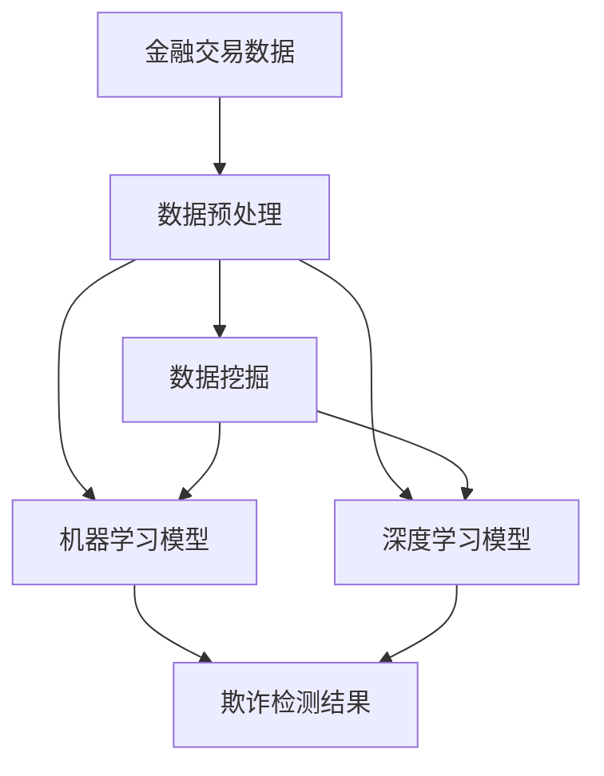

# AI在反金融欺诈中的深度应用研究

> 关键词：AI、反金融欺诈、机器学习、深度学习、数据挖掘、风险评估、异常检测

> 摘要：本文深入探讨了AI在反金融欺诈领域的深度应用。随着金融业务的数字化和复杂化，金融欺诈行为日益猖獗且手段不断翻新，传统的反欺诈方法面临诸多挑战。AI技术凭借其强大的数据分析和模式识别能力，为反金融欺诈提供了新的解决方案。文章首先介绍了研究的背景、目的、预期读者和文档结构等内容，接着阐述了AI在反金融欺诈中的核心概念与联系，详细讲解了核心算法原理、数学模型和公式，并结合项目实战给出了代码实际案例和解释说明。然后探讨了AI在反金融欺诈中的实际应用场景，推荐了相关的工具和资源。最后对未来发展趋势与挑战进行了总结，并给出了常见问题与解答以及扩展阅读和参考资料，旨在为相关领域的研究和实践提供全面且深入的参考。

## 1. 背景介绍 
### 1.1 目的和范围
随着金融科技的飞速发展，金融业务的数字化程度越来越高，各种新兴的金融服务和产品不断涌现。然而，这也为金融欺诈行为提供了更多的机会和手段。金融欺诈不仅会给金融机构和客户带来巨大的经济损失，还会严重影响金融市场的稳定和信心。因此，有效地防范和打击金融欺诈成为了金融行业面临的重要挑战。

本文的目的在于深入研究AI在反金融欺诈中的应用，探讨如何利用AI技术提高反金融欺诈的效率和准确性。具体范围包括AI在反金融欺诈中的核心概念、算法原理、数学模型、实际应用场景等方面，同时结合项目实战给出具体的代码案例和分析。

### 1.2 预期读者
本文的预期读者包括金融行业的从业者，如银行、证券、保险等机构的风险管理和安全部门的工作人员；从事AI和数据分析的技术人员，包括算法工程师、数据科学家等；以及对金融科技和反金融欺诈领域感兴趣的研究人员和学生。

### 1.3 文档结构概述
本文将按照以下结构进行组织：首先介绍背景信息，包括目的、预期读者和文档结构等；接着阐述AI在反金融欺诈中的核心概念与联系，通过文本示意图和Mermaid流程图进行说明；然后详细讲解核心算法原理和具体操作步骤，并使用Python源代码进行阐述；再介绍数学模型和公式，并给出详细讲解和举例说明；之后结合项目实战给出代码实际案例和详细解释说明；接着探讨AI在反金融欺诈中的实际应用场景；推荐相关的工具和资源；对未来发展趋势与挑战进行总结；给出常见问题与解答；最后提供扩展阅读和参考资料。

### 1.4 术语表
#### 1.4.1 核心术语定义
- **AI（Artificial Intelligence）**：人工智能，是指计算机系统能够执行通常需要人类智能才能完成的任务，如学习、推理、问题解决等。
- **金融欺诈**：指以非法占有为目的，通过欺骗、隐瞒等手段，获取金融机构或客户的资金、资产或其他利益的行为。
- **机器学习（Machine Learning）**：是AI的一个分支，研究计算机如何从数据中自动学习模式和规律，并利用这些模式和规律进行预测和决策。
- **深度学习（Deep Learning）**：是机器学习的一个子领域，基于人工神经网络，通过构建多层的神经网络模型，自动从大量数据中学习复杂的特征和模式。
- **异常检测（Anomaly Detection）**：是指在数据集中识别出与正常模式不同的异常数据点或行为，在反金融欺诈中常用于发现潜在的欺诈行为。

#### 1.4.2 相关概念解释
- **数据挖掘（Data Mining）**：是指从大量的数据中发现有价值的信息和知识的过程，在反金融欺诈中可以用于发现欺诈行为的模式和规律。
- **风险评估（Risk Assessment）**：是指对金融交易或客户的风险程度进行评估的过程，通过分析各种风险因素，预测可能发生的损失。
- **特征工程（Feature Engineering）**：是指从原始数据中提取和选择有意义的特征，用于机器学习模型的训练和预测，在反金融欺诈中，合适的特征可以提高模型的准确性。

#### 1.4.3 缩略词列表
- **AI**：Artificial Intelligence
- **ML**：Machine Learning
- **DL**：Deep Learning
- **AD**：Anomaly Detection
- **KNN**：K-Nearest Neighbors
- **SVM**：Support Vector Machine
- **DNN**：Deep Neural Network
- **RNN**：Recurrent Neural Network
- **LSTM**：Long Short-Term Memory

## 2. 核心概念与联系 
在反金融欺诈中，AI主要涉及到机器学习、深度学习、数据挖掘等核心概念，它们之间相互关联，共同构成了反金融欺诈的技术体系。

### 核心概念原理
- **机器学习**：机器学习通过对历史数据的学习，构建预测模型，用于预测未来的事件。在反金融欺诈中，可以利用机器学习算法对交易数据进行分析，识别出潜在的欺诈行为。常见的机器学习算法包括决策树、支持向量机、朴素贝叶斯等。
- **深度学习**：深度学习是机器学习的一个子领域，通过构建多层的神经网络模型，自动从大量数据中学习复杂的特征和模式。在反金融欺诈中，深度学习模型可以处理高维度、复杂的数据，提高欺诈检测的准确性。常见的深度学习模型包括深度神经网络（DNN）、循环神经网络（RNN）、长短时记忆网络（LSTM）等。
- **数据挖掘**：数据挖掘是从大量的数据中发现有价值的信息和知识的过程。在反金融欺诈中，数据挖掘可以用于发现欺诈行为的模式和规律，为机器学习和深度学习模型提供特征和数据支持。

### 架构的文本示意图
```plaintext
金融交易数据
|
|-- 数据预处理
|   |-- 数据清洗
|   |-- 特征提取
|   |-- 特征选择
|
|-- 机器学习模型
|   |-- 决策树
|   |-- 支持向量机
|   |-- 朴素贝叶斯
|
|-- 深度学习模型
|   |-- 深度神经网络（DNN）
|   |-- 循环神经网络（RNN）
|   |-- 长短时记忆网络（LSTM）
|
|-- 欺诈检测结果
```

### Mermaid流程图


## 3. 核心算法原理 & 具体操作步骤 （算法原理讲解必须使用Python源代码来详细阐述）
### 3.1 支持向量机（SVM）算法原理
支持向量机是一种常用的机器学习算法，用于分类和回归分析。在反金融欺诈中，SVM可以用于将交易数据分为正常交易和欺诈交易两类。

SVM的基本思想是在特征空间中找到一个最优的超平面，使得不同类别的数据点到该超平面的距离最大。这个超平面可以用以下方程表示：
$$w^T x + b = 0$$
其中，$w$ 是超平面的法向量，$b$ 是偏置项，$x$ 是数据点的特征向量。

SVM的目标是找到最优的 $w$ 和 $b$，使得以下目标函数最小化：
$$\min_{w,b} \frac{1}{2} ||w||^2 + C \sum_{i=1}^{n} \xi_i$$
其中，$C$ 是惩罚参数，$\xi_i$ 是松弛变量，用于处理数据的线性不可分情况。

### 3.2 具体操作步骤
1. **数据准备**：收集和整理金融交易数据，并进行数据预处理，包括数据清洗、特征提取和特征选择。
2. **模型训练**：使用训练数据对SVM模型进行训练，调整模型的参数，如惩罚参数 $C$ 和核函数等。
3. **模型评估**：使用测试数据对训练好的模型进行评估，计算模型的准确率、召回率、F1值等指标。
4. **欺诈检测**：使用训练好的模型对新的交易数据进行预测，判断是否为欺诈交易。

### 3.3 Python源代码实现
```python
import numpy as np
from sklearn import svm
from sklearn.model_selection import train_test_split
from sklearn.metrics import accuracy_score, recall_score, f1_score

# 生成示例数据
X = np.random.rand(100, 10)  # 特征矩阵
y = np.random.randint(0, 2, 100)  # 标签向量

# 划分训练集和测试集
X_train, X_test, y_train, y_test = train_test_split(X, y, test_size=0.2, random_state=42)

# 创建SVM模型
clf = svm.SVC(C=1.0, kernel='rbf')

# 模型训练
clf.fit(X_train, y_train)

# 模型预测
y_pred = clf.predict(X_test)

# 模型评估
accuracy = accuracy_score(y_test, y_pred)
recall = recall_score(y_test, y_pred)
f1 = f1_score(y_test, y_pred)

print(f"Accuracy: {accuracy}")
print(f"Recall: {recall}")
print(f"F1 Score: {f1}")
```

### 3.4 深度神经网络（DNN）算法原理
深度神经网络是一种多层的神经网络模型，由输入层、隐藏层和输出层组成。在反金融欺诈中，DNN可以自动从大量的交易数据中学习复杂的特征和模式，提高欺诈检测的准确性。

DNN的基本原理是通过前向传播和反向传播算法进行训练。前向传播是指将输入数据从输入层依次传递到隐藏层和输出层，计算输出结果；反向传播是指根据输出结果和真实标签之间的误差，通过梯度下降算法更新模型的参数。

### 3.5 具体操作步骤
1. **数据准备**：收集和整理金融交易数据，并进行数据预处理，包括数据清洗、特征提取和特征选择。
2. **模型构建**：构建DNN模型，包括确定模型的层数、每层的神经元数量、激活函数等。
3. **模型训练**：使用训练数据对DNN模型进行训练，调整模型的参数，如学习率、批次大小、训练轮数等。
4. **模型评估**：使用测试数据对训练好的模型进行评估，计算模型的准确率、召回率、F1值等指标。
5. **欺诈检测**：使用训练好的模型对新的交易数据进行预测，判断是否为欺诈交易。

### 3.6 Python源代码实现
```python
import numpy as np
import tensorflow as tf
from tensorflow.keras.models import Sequential
from tensorflow.keras.layers import Dense
from sklearn.model_selection import train_test_split
from sklearn.metrics import accuracy_score, recall_score, f1_score

# 生成示例数据
X = np.random.rand(100, 10)  # 特征矩阵
y = np.random.randint(0, 2, 100)  # 标签向量

# 划分训练集和测试集
X_train, X_test, y_train, y_test = train_test_split(X, y, test_size=0.2, random_state=42)

# 构建DNN模型
model = Sequential([
    Dense(64, activation='relu', input_shape=(10,)),
    Dense(32, activation='relu'),
    Dense(1, activation='sigmoid')
])

# 编译模型
model.compile(optimizer='adam', loss='binary_crossentropy', metrics=['accuracy'])

# 模型训练
model.fit(X_train, y_train, epochs=10, batch_size=32, validation_data=(X_test, y_test))

# 模型预测
y_pred = model.predict(X_test)
y_pred = (y_pred > 0.5).astype(int)

# 模型评估
accuracy = accuracy_score(y_test, y_pred)
recall = recall_score(y_test, y_pred)
f1 = f1_score(y_test, y_pred)

print(f"Accuracy: {accuracy}")
print(f"Recall: {recall}")
print(f"F1 Score: {f1}")
```

## 4. 数学模型和公式 & 详细讲解 & 举例说明 
### 4.1 逻辑回归模型
逻辑回归是一种常用的分类算法，在反金融欺诈中可以用于预测交易是否为欺诈交易。逻辑回归的数学模型可以表示为：
$$P(y=1|x) = \frac{1}{1 + e^{-(w^T x + b)}}$$
其中，$P(y=1|x)$ 表示在特征向量 $x$ 下，交易为欺诈交易的概率，$w$ 是权重向量，$b$ 是偏置项。

逻辑回归的目标是找到最优的 $w$ 和 $b$，使得以下对数似然函数最大化：
$$L(w,b) = \sum_{i=1}^{n} [y_i \log(P(y=1|x_i)) + (1 - y_i) \log(1 - P(y=1|x_i))]$$
其中，$n$ 是样本数量，$y_i$ 是第 $i$ 个样本的真实标签。

### 4.2 详细讲解
逻辑回归通过对输入特征进行线性组合，然后通过逻辑函数（sigmoid函数）将线性组合的结果映射到 $[0, 1]$ 区间，得到交易为欺诈交易的概率。通过最大化对数似然函数，可以找到最优的 $w$ 和 $b$，使得模型的预测结果与真实标签之间的误差最小。

### 4.3 举例说明
假设我们有一个简单的金融交易数据集，包含两个特征：交易金额和交易时间，标签为是否为欺诈交易。我们可以使用逻辑回归模型对该数据集进行训练和预测。

```python
import numpy as np
from sklearn.linear_model import LogisticRegression
from sklearn.model_selection import train_test_split
from sklearn.metrics import accuracy_score

# 生成示例数据
X = np.array([[100, 10], [200, 20], [300, 30], [400, 40], [500, 50]])
y = np.array([0, 0, 1, 1, 1])

# 划分训练集和测试集
X_train, X_test, y_train, y_test = train_test_split(X, y, test_size=0.2, random_state=42)

# 创建逻辑回归模型
clf = LogisticRegression()

# 模型训练
clf.fit(X_train, y_train)

# 模型预测
y_pred = clf.predict(X_test)

# 模型评估
accuracy = accuracy_score(y_test, y_pred)
print(f"Accuracy: {accuracy}")
```

### 4.4 决策树模型
决策树是一种基于树结构进行决策的分类算法，在反金融欺诈中可以用于构建决策规则，判断交易是否为欺诈交易。决策树的数学模型可以表示为一个树结构，每个内部节点表示一个特征上的测试，每个分支表示一个测试输出，每个叶节点表示一个类别。

决策树的构建过程是一个递归的过程，通过选择最优的特征和划分点，将数据集划分为不同的子集，直到满足终止条件。常用的特征选择方法包括信息增益、信息增益率、基尼指数等。

### 4.5 详细讲解
决策树通过对数据集进行递归划分，构建一个树结构的决策模型。在每个内部节点，选择一个最优的特征和划分点，将数据集划分为不同的子集，使得划分后的子集的纯度最高。纯度的度量方法可以使用信息增益、信息增益率、基尼指数等。

### 4.6 举例说明
假设我们有一个简单的金融交易数据集，包含三个特征：交易金额、交易时间、交易地点，标签为是否为欺诈交易。我们可以使用决策树模型对该数据集进行训练和预测。

```python
import numpy as np
from sklearn.tree import DecisionTreeClassifier
from sklearn.model_selection import train_test_split
from sklearn.metrics import accuracy_score

# 生成示例数据
X = np.array([[100, 10, 1], [200, 20, 2], [300, 30, 3], [400, 40, 4], [500, 50, 5]])
y = np.array([0, 0, 1, 1, 1])

# 划分训练集和测试集
X_train, X_test, y_train, y_test = train_test_split(X, y, test_size=0.2, random_state=42)

# 创建决策树模型
clf = DecisionTreeClassifier()

# 模型训练
clf.fit(X_train, y_train)

# 模型预测
y_pred = clf.predict(X_test)

# 模型评估
accuracy = accuracy_score(y_test, y_pred)
print(f"Accuracy: {accuracy}")
```

## 5. 项目实战：代码实际案例和详细解释说明 
### 5.1  开发环境搭建
#### 5.1.1 安装Python
首先需要安装Python，建议使用Python 3.7及以上版本。可以从Python官方网站（https://www.python.org/downloads/）下载并安装。

#### 5.1.2 安装必要的库
使用以下命令安装必要的Python库：
```sh
pip install numpy pandas scikit-learn tensorflow keras matplotlib seaborn
```

### 5.2  源代码详细实现和代码