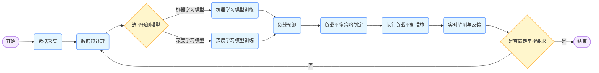

# AI在智能电网负载预测与平衡中的应用

> 关键词：AI、智能电网、负载预测、负载平衡、机器学习、深度学习、电力系统

> 摘要：本文聚焦于AI在智能电网负载预测与平衡中的应用。详细阐述了智能电网负载预测与平衡的核心概念、相关算法原理，深入分析了其数学模型。通过项目实战展示了具体的代码实现与解读，探讨了实际应用场景。同时推荐了学习资源、开发工具框架以及相关论文著作。最后总结了未来发展趋势与挑战，并给出常见问题解答和参考资料，旨在全面呈现AI在智能电网领域的重要作用和广阔前景。

## 1. 背景介绍 
### 1.1 目的和范围
随着全球对电力需求的不断增长以及能源结构的转型，智能电网作为未来电力系统的发展方向，面临着诸多挑战。其中，准确的负载预测和有效的负载平衡对于保障电网的安全、稳定、高效运行至关重要。本文章的目的在于深入探讨AI技术如何应用于智能电网的负载预测与平衡，介绍相关的技术原理、算法实现以及实际应用案例，为相关领域的研究人员、工程师和从业者提供全面的参考。文章的范围涵盖了AI技术在智能电网负载预测与平衡中的各个方面，包括核心概念、算法原理、数学模型、项目实战、应用场景等。

### 1.2 预期读者
本文预期读者包括电力系统领域的研究人员、工程师、技术管理人员，以及对AI技术在能源领域应用感兴趣的计算机科学、控制科学等相关专业的学生和从业者。通过阅读本文，读者可以了解AI在智能电网负载预测与平衡中的最新技术和应用案例，为其在实际工作和研究中提供参考和借鉴。

### 1.3 文档结构概述
本文共分为十个部分。第一部分为背景介绍，阐述了文章的目的、范围、预期读者和文档结构概述。第二部分介绍了智能电网负载预测与平衡的核心概念与联系，包括相关的原理和架构，并通过文本示意图和Mermaid流程图进行展示。第三部分详细讲解了核心算法原理及具体操作步骤，使用Python源代码进行阐述。第四部分介绍了数学模型和公式，并进行详细讲解和举例说明。第五部分通过项目实战，展示了代码实际案例和详细解释说明。第六部分探讨了AI在智能电网负载预测与平衡中的实际应用场景。第七部分推荐了学习资源、开发工具框架以及相关论文著作。第八部分总结了未来发展趋势与挑战。第九部分为附录，提供常见问题与解答。第十部分为扩展阅读与参考资料。

### 1.4 术语表
#### 1.4.1 核心术语定义
- **智能电网（Smart Grid）**：是将现代信息和通信技术与传统电力系统相结合的新型电网，通过实时监测、分析和控制，实现电力系统的高效、可靠、安全运行。
- **负载预测（Load Forecasting）**：是指根据历史负载数据、气象数据、经济数据等信息，预测未来某一时间段内电力系统的负载需求。
- **负载平衡（Load Balancing）**：是指通过调整电力系统中各个发电单元的出力和负荷的分配，使电力系统的负载在时间和空间上达到平衡，提高电力系统的运行效率和可靠性。
- **AI（Artificial Intelligence）**：即人工智能，是研究、开发用于模拟、延伸和扩展人的智能的理论、方法、技术及应用系统的一门新的技术科学。
- **机器学习（Machine Learning）**：是一门多领域交叉学科，涉及概率论、统计学、逼近论、凸分析、算法复杂度理论等多门学科。它专门研究计算机怎样模拟或实现人类的学习行为，以获取新的知识或技能，重新组织已有的知识结构使之不断改善自身的性能。
- **深度学习（Deep Learning）**：是机器学习的一个分支领域，它是一种基于对数据进行表征学习的方法。深度学习通过构建具有很多层的神经网络模型，自动从大量数据中学习特征和模式。

#### 1.4.2 相关概念解释
- **电力系统（Power System）**：是由发电、输电、变电、配电和用电等环节组成的电能生产与消费系统。
- **分布式电源（Distributed Generation）**：是指分布在用户侧的发电系统，如太阳能光伏、风力发电等，具有能源利用效率高、环境污染小等优点。
- **需求响应（Demand Response）**：是指电力用户根据电力价格信号或激励机制，改变其固有的用电模式，减少或增加用电负荷，以响应电力系统的需求。

#### 1.4.3 缩略词列表
- **ANN（Artificial Neural Network）**：人工神经网络
- **SVM（Support Vector Machine）**：支持向量机
- **LSTM（Long Short-Term Memory）**：长短期记忆网络
- **CNN（Convolutional Neural Network）**：卷积神经网络
- **PV（Photovoltaic）**：光伏发电

## 2. 核心概念与联系 

### 智能电网负载预测与平衡的原理
智能电网负载预测的原理是基于历史负载数据和相关的影响因素，如气象数据、经济数据等，建立预测模型，通过对模型的训练和优化，预测未来某一时间段内的负载需求。负载预测的准确性直接影响到电力系统的调度和运行决策。

智能电网负载平衡的原理是根据负载预测结果和电力系统的实时运行状态，通过调整发电单元的出力、控制分布式电源的接入和退出、实施需求响应等措施，使电力系统的负载在时间和空间上达到平衡，提高电力系统的运行效率和可靠性。

### 核心概念的架构关系
智能电网负载预测与平衡是一个相互关联的系统，其架构关系如图1所示。


图1 智能电网负载预测与平衡架构

从图中可以看出，负载预测是负载平衡的基础，准确的负载预测可以为负载平衡提供可靠的依据。负载平衡则是负载预测的应用，通过合理的负载分配和控制，实现电力系统的安全、稳定、高效运行。

### Mermaid流程图


该流程图展示了智能电网负载预测与平衡的整个流程，从数据采集开始，经过数据预处理、模型选择与训练、负载预测、负载平衡策略制定和执行，最后进行实时监测与反馈，若不满足平衡要求则返回数据预处理阶段进行迭代优化。

## 3. 核心算法原理 & 具体操作步骤 

### 机器学习算法 - 支持向量机（SVM）
#### 算法原理
支持向量机是一种有监督的机器学习算法，其基本思想是在特征空间中找到一个最优的超平面，使得不同类别的样本能够被最大程度地分开。在负载预测中，SVM可以通过学习历史负载数据和相关影响因素之间的关系，建立预测模型。

#### Python源代码实现
```python
import numpy as np
from sklearn.svm import SVR
from sklearn.model_selection import train_test_split
from sklearn.preprocessing import StandardScaler

# 生成示例数据
X = np.random.rand(100, 5)  # 特征数据
y = np.random.rand(100)     # 负载数据

# 数据划分
X_train, X_test, y_train, y_test = train_test_split(X, y, test_size=0.2, random_state=42)

# 数据标准化
scaler = StandardScaler()
X_train = scaler.fit_transform(X_train)
X_test = scaler.transform(X_test)

# 创建SVM模型
svm_model = SVR(kernel='rbf', C=100, gamma=0.1)

# 模型训练
svm_model.fit(X_train, y_train)

# 模型预测
y_pred = svm_model.predict(X_test)

# 打印预测结果
print("SVM预测结果：", y_pred)
```
#### 具体操作步骤
1. **数据准备**：收集历史负载数据和相关影响因素数据，将其整理成特征矩阵 $X$ 和目标向量 $y$。
2. **数据划分**：将数据集划分为训练集和测试集，一般采用80%的数据作为训练集，20%的数据作为测试集。
3. **数据标准化**：对特征数据进行标准化处理，使得不同特征具有相同的尺度，提高模型的训练效果。
4. **模型创建**：选择合适的SVM核函数和参数，创建SVM模型。
5. **模型训练**：使用训练集数据对SVM模型进行训练。
6. **模型预测**：使用训练好的模型对测试集数据进行预测。

### 深度学习算法 - 长短期记忆网络（LSTM）
#### 算法原理
长短期记忆网络是一种特殊的循环神经网络，能够有效地处理序列数据中的长期依赖关系。在负载预测中，LSTM可以通过学习历史负载数据的时间序列特征，预测未来的负载需求。

#### Python源代码实现
```python
import numpy as np
import pandas as pd
from tensorflow.keras.models import Sequential
from tensorflow.keras.layers import LSTM, Dense
from sklearn.preprocessing import MinMaxScaler

# 生成示例数据
data = np.random.rand(100, 1)  # 负载数据

# 数据预处理
scaler = MinMaxScaler()
data = scaler.fit_transform(data)

# 准备训练数据
sequence_length = 10
X = []
y = []
for i in range(len(data) - sequence_length):
    X.append(data[i:i+sequence_length])
    y.append(data[i+sequence_length])
X = np.array(X)
y = np.array(y)

# 划分训练集和测试集
train_size = int(len(X) * 0.8)
X_train, X_test = X[:train_size], X[train_size:]
y_train, y_test = y[:train_size], y[train_size:]

# 创建LSTM模型
model = Sequential()
model.add(LSTM(50, input_shape=(sequence_length, 1)))
model.add(Dense(1))
model.compile(optimizer='adam', loss='mse')

# 模型训练
model.fit(X_train, y_train, epochs=50, batch_size=32)

# 模型预测
y_pred = model.predict(X_test)

# 反归一化
y_pred = scaler.inverse_transform(y_pred)
y_test = scaler.inverse_transform(y_test)

# 打印预测结果
print("LSTM预测结果：", y_pred)
```
#### 具体操作步骤
1. **数据准备**：收集历史负载数据，将其整理成时间序列数据。
2. **数据预处理**：对数据进行归一化处理，将数据缩放到0-1之间。
3. **准备训练数据**：将时间序列数据转换为适合LSTM模型输入的格式，即输入序列和对应的目标值。
4. **数据划分**：将数据集划分为训练集和测试集。
5. **模型创建**：构建LSTM模型，包括定义LSTM层和全连接层，设置优化器和损失函数。
6. **模型训练**：使用训练集数据对LSTM模型进行训练。
7. **模型预测**：使用训练好的模型对测试集数据进行预测，并将预测结果反归一化。

## 4. 数学模型和公式 & 详细讲解 & 举例说明 

### 支持向量机（SVM）的数学模型
支持向量机的目标是在特征空间中找到一个最优的超平面，使得不同类别的样本能够被最大程度地分开。对于线性可分的情况，超平面的方程可以表示为：
$$w^T x + b = 0$$
其中，$w$ 是超平面的法向量，$b$ 是偏置项，$x$ 是样本特征向量。

为了找到最优的超平面，需要最大化分类间隔，即：
$$\max_{w,b} \frac{2}{\|w\|}$$
$$s.t. \quad y_i(w^T x_i + b) \geq 1, \quad i = 1,2,\cdots,n$$
其中，$y_i$ 是样本的标签，$n$ 是样本数量。

通过引入拉格朗日乘子 $\alpha_i$，可以将上述约束优化问题转化为对偶问题：
$$\max_{\alpha} \sum_{i=1}^{n} \alpha_i - \frac{1}{2} \sum_{i=1}^{n} \sum_{j=1}^{n} \alpha_i \alpha_j y_i y_j x_i^T x_j$$
$$s.t. \quad \sum_{i=1}^{n} \alpha_i y_i = 0, \quad \alpha_i \geq 0, \quad i = 1,2,\cdots,n$$

求解对偶问题得到最优的拉格朗日乘子 $\alpha^*$，进而可以得到最优的超平面参数 $w^*$ 和 $b^*$。

#### 举例说明
假设有一个二维的线性可分数据集，包含两个类别，样本点分别为 $(1,1)$ 和 $(3,3)$，标签分别为 $-1$ 和 $1$。我们可以使用SVM来找到最优的超平面。

首先，根据上述对偶问题的公式，构建目标函数和约束条件。然后，使用优化算法求解对偶问题，得到最优的拉格朗日乘子 $\alpha^*$。最后，根据 $\alpha^*$ 计算最优的超平面参数 $w^*$ 和 $b^*$。

### 长短期记忆网络（LSTM）的数学模型
LSTM单元的结构如图2所示。


图2 LSTM单元结构

LSTM单元通过三个门控机制（输入门 $i_t$、遗忘门 $f_t$ 和输出门 $o_t$）来控制信息的流动。其数学公式如下：
$$f_t = \sigma(W_f [h_{t-1}, x_t] + b_f)$$
$$i_t = \sigma(W_i [h_{t-1}, x_t] + b_i)$$
$$\tilde{C}_t = \tanh(W_C [h_{t-1}, x_t] + b_C)$$
$$C_t = f_t \odot C_{t-1} + i_t \odot \tilde{C}_t$$
$$o_t = \sigma(W_o [h_{t-1}, x_t] + b_o)$$
$$h_t = o_t \odot \tanh(C_t)$$
其中，$\sigma$ 是 sigmoid 函数，$\tanh$ 是双曲正切函数，$W$ 是权重矩阵，$b$ 是偏置向量，$h_t$ 是隐藏状态，$C_t$ 是细胞状态，$\odot$ 表示逐元素相乘。

#### 举例说明
假设我们要使用LSTM模型对一个时间序列数据进行预测，输入序列的长度为 $T$，每个时间步的特征维度为 $d$。在每个时间步 $t$，LSTM单元根据当前输入 $x_t$ 和上一个时间步的隐藏状态 $h_{t-1}$ 计算输入门、遗忘门和输出门的值，然后更新细胞状态和隐藏状态。最后，使用最后一个时间步的隐藏状态进行预测。

## 5. 项目实战：代码实际案例和详细解释说明 

### 5.1  开发环境搭建
#### 操作系统
本项目可以在Windows、Linux或macOS等主流操作系统上进行开发。建议使用Linux系统，如Ubuntu 18.04或更高版本，因为Linux系统在开发和部署机器学习和深度学习项目方面具有更好的性能和稳定性。

#### Python环境
使用Python 3.7或更高版本。可以使用Anaconda来管理Python环境，Anaconda是一个开源的Python发行版本，包含了许多科学计算和数据分析所需的库和工具。

#### 安装依赖库
在项目开发过程中，需要安装以下主要的依赖库：
- **NumPy**：用于数值计算和数组操作。
- **Pandas**：用于数据处理和分析。
- **Scikit-learn**：用于机器学习模型的训练和评估。
- **TensorFlow**：用于深度学习模型的构建和训练。
- **Keras**：是一个高级神经网络API，基于TensorFlow等后端实现。

可以使用以下命令安装这些依赖库：
```bash
pip install numpy pandas scikit-learn tensorflow keras
```

### 5.2  源代码详细实现和代码解读
#### 数据准备
```python
import pandas as pd
import numpy as np

# 读取数据
data = pd.read_csv('load_data.csv')

# 提取特征和目标变量
X = data.drop('load', axis=1).values
y = data['load'].values

# 数据划分
from sklearn.model_selection import train_test_split
X_train, X_test, y_train, y_test = train_test_split(X, y, test_size=0.2, random_state=42)
```
**代码解读**：首先使用 `pandas` 库读取包含负载数据的CSV文件。然后，使用 `drop` 方法提取除负载列之外的所有列作为特征矩阵 $X$，将负载列作为目标向量 $y$。最后，使用 `train_test_split` 函数将数据集划分为训练集和测试集。

#### 机器学习模型 - 支持向量机（SVM）
```python
from sklearn.svm import SVR
from sklearn.preprocessing import StandardScaler

# 数据标准化
scaler = StandardScaler()
X_train_scaled = scaler.fit_transform(X_train)
X_test_scaled = scaler.transform(X_test)

# 创建SVM模型
svm_model = SVR(kernel='rbf', C=100, gamma=0.1)

# 模型训练
svm_model.fit(X_train_scaled, y_train)

# 模型预测
y_pred_svm = svm_model.predict(X_test_scaled)
```
**代码解读**：使用 `StandardScaler` 对特征数据进行标准化处理，使得不同特征具有相同的尺度。然后，创建一个SVM回归模型，使用径向基函数（RBF）作为核函数，并设置参数 $C$ 和 $\gamma$。接着，使用训练集数据对模型进行训练。最后，使用训练好的模型对测试集数据进行预测。

#### 深度学习模型 - 长短期记忆网络（LSTM）
```python
from tensorflow.keras.models import Sequential
from tensorflow.keras.layers import LSTM, Dense
from sklearn.preprocessing import MinMaxScaler

# 数据预处理
scaler = MinMaxScaler()
y_train_scaled = scaler.fit_transform(y_train.reshape(-1, 1))
y_test_scaled = scaler.transform(y_test.reshape(-1, 1))

# 准备训练数据
sequence_length = 10
X_train_lstm = []
y_train_lstm = []
for i in range(len(y_train_scaled) - sequence_length):
    X_train_lstm.append(y_train_scaled[i:i+sequence_length])
    y_train_lstm.append(y_train_scaled[i+sequence_length])
X_train_lstm = np.array(X_train_lstm)
y_train_lstm = np.array(y_train_lstm)

# 创建LSTM模型
model = Sequential()
model.add(LSTM(50, input_shape=(sequence_length, 1)))
model.add(Dense(1))
model.compile(optimizer='adam', loss='mse')

# 模型训练
model.fit(X_train_lstm, y_train_lstm, epochs=50, batch_size=32)

# 准备测试数据
X_test_lstm = []
for i in range(len(y_test_scaled) - sequence_length):
    X_test_lstm.append(y_test_scaled[i:i+sequence_length])
X_test_lstm = np.array(X_test_lstm)

# 模型预测
y_pred_lstm = model.predict(X_test_lstm)

# 反归一化
y_pred_lstm = scaler.inverse_transform(y_pred_lstm)
```
**代码解读**：首先使用 `MinMaxScaler` 对负载数据进行归一化处理，将数据缩放到0-1之间。然后，将时间序列数据转换为适合LSTM模型输入的格式，即输入序列和对应的目标值。接着，构建LSTM模型，包括一个LSTM层和一个全连接层，使用 `adam` 优化器和均方误差（MSE）损失函数。使用训练集数据对模型进行训练。最后，准备测试数据并进行预测，将预测结果反归一化。

### 5.3  代码解读与分析
#### 机器学习模型 - SVM
- **数据标准化**：SVM模型对特征数据的尺度比较敏感，因此需要对特征数据进行标准化处理，以提高模型的训练效果。
- **核函数选择**：在本案例中，选择了径向基函数（RBF）作为核函数，RBF核函数可以处理非线性问题，具有较好的泛化能力。
- **参数调优**：参数 $C$ 和 $\gamma$ 对SVM模型的性能有重要影响，需要通过交叉验证等方法进行调优。

#### 深度学习模型 - LSTM
- **数据预处理**：LSTM模型需要输入时间序列数据，因此需要将负载数据转换为适合LSTM模型输入的格式。同时，对数据进行归一化处理可以加快模型的训练速度和提高模型的稳定性。
- **模型结构**：本案例中的LSTM模型包含一个LSTM层和一个全连接层，LSTM层用于学习时间序列数据的特征，全连接层用于输出预测结果。
- **训练参数**：训练参数如 `epochs` 和 `batch_size` 对模型的训练效果有重要影响，需要根据实际情况进行调整。

## 6. 实际应用场景 
### 电力系统调度
AI在智能电网负载预测与平衡中的应用可以为电力系统调度提供准确的负载预测信息，帮助调度人员合理安排发电计划，优化发电资源的分配，提高电力系统的运行效率和可靠性。例如，通过预测未来一段时间内的负载需求，调度人员可以提前安排发电机组的启停和出力调整，避免出现电力短缺或过剩的情况。

### 分布式电源管理
随着分布式电源（如太阳能光伏、风力发电等）的大规模接入，智能电网面临着新的挑战。AI技术可以通过对分布式电源的输出功率进行预测，实现分布式电源的优化调度和管理。例如，根据太阳能光伏和风力发电的预测功率，合理调整储能设备的充放电策略，提高分布式电源的利用率和稳定性。

### 需求响应管理
需求响应是指电力用户根据电力价格信号或激励机制，改变其固有的用电模式，减少或增加用电负荷，以响应电力系统的需求。AI技术可以通过对用户用电行为的分析和预测，制定个性化的需求响应策略，引导用户合理用电。例如，根据用户的历史用电数据和实时电价信息，向用户发送用电建议，鼓励用户在电价低谷时段增加用电负荷，在电价高峰时段减少用电负荷。

### 电网规划与扩建
准确的负载预测可以为电网规划与扩建提供重要的依据。AI技术可以通过对历史负载数据和相关影响因素的分析，预测未来一段时间内的负载增长趋势，帮助电网规划人员合理规划电网的布局和容量，提高电网的适应性和可靠性。例如，根据负载预测结果，确定是否需要新建变电站、输电线路等基础设施。

## 7. 工具和资源推荐
### 7.1 学习资源推荐
#### 7.1.1 书籍推荐
- 《机器学习》（周志华）：全面介绍了机器学习的基本概念、算法和应用，是机器学习领域的经典教材。
- 《深度学习》（Ian Goodfellow、Yoshua Bengio和Aaron Courville）：由深度学习领域的三位权威专家撰写，系统地介绍了深度学习的理论和实践。
- 《Python机器学习实战》（Sebastian Raschka）：通过大量的Python代码示例，介绍了机器学习的常用算法和应用场景。

#### 7.1.2 在线课程
- Coursera上的“机器学习”课程（Andrew Ng）：由斯坦福大学的Andrew Ng教授主讲，是机器学习领域的经典在线课程。
- edX上的“深度学习微专业”课程：由伯克利大学等知名高校的教授主讲，系统地介绍了深度学习的理论和实践。
- 中国大学MOOC上的“人工智能基础”课程：由国内多所高校的专家联合授课，介绍了人工智能的基本概念、算法和应用。

#### 7.1.3 技术博客和网站
- Medium：是一个知名的技术博客平台，上面有许多关于AI、机器学习和深度学习的优秀文章。
- Towards Data Science：专注于数据科学和机器学习领域的技术博客，提供了大量的教程和案例分析。
- arXiv：是一个预印本数据库，收录了许多最新的AI和机器学习研究论文。

### 7.2 开发工具框架推荐
#### 7.2.1 IDE和编辑器
- PyCharm：是一款专业的Python集成开发环境（IDE），提供了丰富的代码编辑、调试和分析功能。
- Jupyter Notebook：是一个交互式的编程环境，适合进行数据探索、模型训练和结果展示。
- Visual Studio Code：是一款轻量级的代码编辑器，支持多种编程语言和插件扩展，具有良好的开发体验。

#### 7.2.2 调试和性能分析工具
- TensorBoard：是TensorFlow提供的一个可视化工具，用于监控模型的训练过程、分析模型的性能和查看模型的结构。
- PyTorch Profiler：是PyTorch提供的一个性能分析工具，用于分析模型的计算时间和内存使用情况。
- Scikit-learn的 `cross_val_score` 函数：用于进行交叉验证，评估模型的性能和稳定性。

#### 7.2.3 相关框架和库
- TensorFlow：是一个开源的深度学习框架，由Google开发和维护，提供了丰富的深度学习模型和工具。
- PyTorch：是一个开源的深度学习框架，由Facebook开发和维护，具有动态图和静态图相结合的特点，适合进行研究和开发。
- Scikit-learn：是一个开源的机器学习库，提供了丰富的机器学习算法和工具，用于数据预处理、模型训练和评估。

### 7.3 相关论文著作推荐
#### 7.3.1 经典论文
- “Support-Vector Networks”（Cortes和Vapnik）：是支持向量机领域的经典论文，首次提出了支持向量机的概念和算法。
- “Long Short-Term Memory”（Hochreiter和Schmidhuber）：是长短期记忆网络领域的经典论文，首次提出了长短期记忆网络的结构和算法。
- “ImageNet Classification with Deep Convolutional Neural Networks”（Krizhevsky、Sutskever和Hinton）：是卷积神经网络领域的经典论文，提出了AlexNet模型，在ImageNet图像分类竞赛中取得了优异的成绩。

#### 7.3.2 最新研究成果
- 关注IEEE Transactions on Power Systems、IEEE Transactions on Smart Grid等电力系统领域的顶级期刊，以及NeurIPS、ICML、CVPR等机器学习和深度学习领域的顶级会议，了解最新的研究成果和技术发展趋势。

#### 7.3.3 应用案例分析
- 可以参考一些实际的智能电网项目案例，了解AI技术在智能电网负载预测与平衡中的应用实践和经验教训。例如，国家电网公司的一些智能电网示范项目，以及国外一些先进的智能电网项目。

## 8. 总结：未来发展趋势与挑战
### 未来发展趋势
#### 多源数据融合
未来，智能电网负载预测与平衡将越来越依赖于多源数据的融合，包括气象数据、经济数据、用户行为数据等。通过融合多源数据，可以提高负载预测的准确性和可靠性，实现更加精细化的负载平衡。

#### 边缘计算与云计算结合
边缘计算和云计算的结合将成为智能电网发展的趋势。边缘计算可以在靠近数据源的地方进行数据处理和分析，减少数据传输延迟，提高系统的实时性和可靠性。云计算则可以提供强大的计算资源和存储能力，支持大规模数据的处理和分析。

#### 强化学习的应用
强化学习作为一种智能决策方法，将在智能电网负载平衡中得到更广泛的应用。通过强化学习算法，可以实现电力系统的自适应控制和优化调度，提高电力系统的运行效率和稳定性。

#### 区块链技术的应用
区块链技术具有去中心化、不可篡改、安全可靠等特点，将在智能电网的分布式电源管理、需求响应管理等方面发挥重要作用。通过区块链技术，可以实现电力交易的透明化、公平化和安全化，促进分布式能源的有效利用。

### 挑战
#### 数据质量和隐私保护
智能电网负载预测与平衡需要大量的高质量数据，但数据的收集、存储和管理面临着数据质量和隐私保护的挑战。如何保证数据的准确性、完整性和安全性，以及如何在数据共享的同时保护用户的隐私，是需要解决的重要问题。

#### 模型可解释性
AI模型在智能电网负载预测与平衡中的应用越来越广泛，但许多模型（如深度学习模型）具有较高的复杂性和黑盒性，缺乏可解释性。如何提高模型的可解释性，让决策者能够理解模型的决策过程和结果，是需要解决的关键问题。

#### 系统兼容性和互操作性
智能电网是一个复杂的系统，涉及到多个子系统和设备。如何保证不同系统和设备之间的兼容性和互操作性，实现数据的共享和协同工作，是智能电网发展面临的挑战之一。

#### 人才短缺
AI在智能电网负载预测与平衡中的应用需要既懂电力系统又懂AI技术的复合型人才。目前，这类人才短缺，如何培养和吸引更多的复合型人才，是推动智能电网发展的关键。

## 9. 附录：常见问题与解答
### 问题1：AI在智能电网负载预测与平衡中的应用有哪些优势？
**解答**：AI在智能电网负载预测与平衡中的应用具有以下优势：
- **提高预测准确性**：AI算法可以通过学习大量的历史数据和相关影响因素，建立更加准确的预测模型，提高负载预测的准确性。
- **实现实时决策**：AI技术可以实时处理和分析大量的数据，快速做出决策，实现智能电网的实时控制和优化调度。
- **适应复杂环境**：智能电网面临着复杂的环境和不确定因素，AI算法具有较强的适应性和鲁棒性，可以在复杂环境下实现负载预测与平衡。
- **优化资源配置**：通过准确的负载预测和合理的负载平衡策略，AI技术可以优化发电资源的分配，提高电力系统的运行效率和可靠性。

### 问题2：如何选择合适的AI算法进行负载预测和平衡？
**解答**：选择合适的AI算法进行负载预测和平衡需要考虑以下因素：
- **数据特点**：不同的AI算法适用于不同类型的数据。例如，对于时间序列数据，可以选择LSTM、GRU等深度学习算法；对于结构化数据，可以选择SVM、决策树等机器学习算法。
- **问题复杂度**：如果问题比较简单，可以选择一些简单的算法，如线性回归、逻辑回归等；如果问题比较复杂，需要选择一些复杂的算法，如深度学习算法。
- **模型性能**：需要评估不同算法的性能指标，如准确率、召回率、均方误差等，选择性能最优的算法。
- **可解释性**：在某些应用场景中，需要选择具有可解释性的算法，以便决策者能够理解模型的决策过程和结果。

### 问题3：如何评估AI模型在智能电网负载预测与平衡中的性能？
**解答**：评估AI模型在智能电网负载预测与平衡中的性能可以使用以下指标：
- **均方误差（MSE）**：反映了预测值与真实值之间的平均误差平方，MSE越小，模型的预测精度越高。
- **均方根误差（RMSE）**：是MSE的平方根，与原始数据具有相同的单位，更直观地反映了模型的预测误差。
- **平均绝对误差（MAE）**：反映了预测值与真实值之间的平均绝对误差，MAE越小，模型的预测精度越高。
- **决定系数（$R^2$）**：表示模型对数据的拟合程度，$R^2$越接近1，模型的拟合效果越好。
- **相对误差（RE）**：反映了预测值与真实值之间的相对误差，RE越小，模型的预测精度越高。

### 问题4：AI在智能电网负载预测与平衡中的应用面临哪些挑战？
**解答**：AI在智能电网负载预测与平衡中的应用面临以下挑战：
- **数据质量和隐私保护**：需要保证数据的准确性、完整性和安全性，以及在数据共享的同时保护用户的隐私。
- **模型可解释性**：许多AI模型（如深度学习模型）具有较高的复杂性和黑盒性，缺乏可解释性，需要提高模型的可解释性。
- **系统兼容性和互操作性**：需要保证不同系统和设备之间的兼容性和互操作性，实现数据的共享和协同工作。
- **人才短缺**：需要培养和吸引更多既懂电力系统又懂AI技术的复合型人才。

## 10. 扩展阅读 & 参考资料
### 扩展阅读
- 《智能电网技术》（刘振亚）：全面介绍了智能电网的概念、技术和应用，是智能电网领域的权威著作。
- 《人工智能：现代方法》（Stuart Russell和Peter Norvig）：系统地介绍了人工智能的基本概念、算法和应用，是人工智能领域的经典教材。
- 《电力系统分析》（何仰赞、温增银）：介绍了电力系统的基本原理、分析方法和运行特性，是电力系统领域的经典教材。

### 参考资料
- IEEE Transactions on Power Systems、IEEE Transactions on Smart Grid等电力系统领域的顶级期刊。
- NeurIPS、ICML、CVPR等机器学习和深度学习领域的顶级会议。
- 国家电网公司、南方电网公司等电力企业的相关技术报告和研究成果。

作者：AI天才研究院/AI Genius Institute & 禅与计算机程序设计艺术 /Zen And The Art of Computer Programming