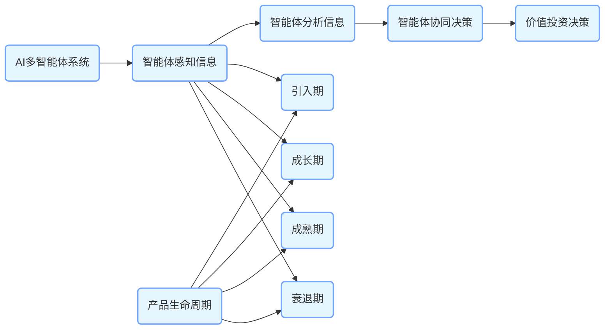

# AI多智能体系统在价值投资中的产品生命周期分析

> 关键词：AI多智能体系统、价值投资、产品生命周期分析、金融科技、智能决策

> 摘要：本文聚焦于AI多智能体系统在价值投资领域对产品生命周期分析的应用。详细阐述了AI多智能体系统和产品生命周期分析的核心概念及相互联系，深入讲解了相关核心算法原理与操作步骤，并运用数学模型和公式进行了理论支撑。通过实际项目案例展示了如何搭建开发环境、实现源代码及进行代码解读。同时探讨了该技术在价值投资中的实际应用场景，推荐了学习、开发工具和相关论文著作。最后对其未来发展趋势与挑战进行了总结，并提供了常见问题解答和扩展阅读参考资料，旨在为金融从业者和技术爱好者提供全面深入的技术和应用指南。

## 1. 背景介绍 
### 1.1 目的和范围
本研究旨在深入探讨AI多智能体系统在价值投资中对产品生命周期分析的应用。通过运用AI多智能体系统的先进技术，对产品从诞生到衰退的整个生命周期进行精准分析，为价值投资者提供更科学、准确的决策依据。研究范围涵盖了AI多智能体系统的原理、算法，产品生命周期分析的各个阶段，以及两者结合在价值投资中的具体应用案例和实际操作。

### 1.2 预期读者
本文预期读者包括金融领域的投资者、分析师、基金经理等专业人士，他们希望借助先进的技术手段提升价值投资决策的准确性和效率；同时也适合计算机科学、人工智能等领域的研究人员和开发者，对跨领域应用AI技术感兴趣的人群，以及相关专业的学生，为他们提供技术应用和研究的新思路。

### 1.3 文档结构概述
本文首先介绍背景信息，包括目的、预期读者和文档结构。接着阐述核心概念，分析AI多智能体系统和产品生命周期分析的原理及联系。然后详细讲解核心算法原理和具体操作步骤，并运用数学模型进行理论说明。通过项目实战展示实际应用中的代码实现和解读。之后探讨该技术在价值投资中的实际应用场景。推荐学习、开发工具和相关论文著作。最后总结未来发展趋势与挑战，提供常见问题解答和扩展阅读参考资料。

### 1.4 术语表
#### 1.4.1 核心术语定义
- **AI多智能体系统（AI Multi - Agent System）**：由多个智能体组成的系统，每个智能体具有一定的自主性、学习能力和交互能力，能够在复杂环境中协同工作以实现共同或各自的目标。
- **价值投资（Value Investing）**：一种投资策略，投资者通过分析资产的内在价值，寻找价格低于其内在价值的投资机会，以获取长期收益。
- **产品生命周期（Product Life Cycle）**：产品从进入市场开始，经历引入期、成长期、成熟期和衰退期的整个过程，反映了产品在市场中的销售和利润变化规律。

#### 1.4.2 相关概念解释
- **智能体（Agent）**：在AI领域，智能体是一个能够感知环境、自主决策并采取行动以实现目标的实体。它可以是软件程序、机器人等。
- **协同决策（Collaborative Decision - Making）**：多个智能体通过交互和信息共享，共同做出决策的过程，以提高决策的准确性和有效性。
- **内在价值（Intrinsic Value）**：资产本身所具有的价值，不依赖于市场价格，通常通过对资产的基本面分析来评估。

#### 1.4.3 缩略词列表
- **AI**：Artificial Intelligence，人工智能
- **MAS**：Multi - Agent System，多智能体系统
- **PLC**：Product Life Cycle，产品生命周期

## 2. 核心概念与联系 
### 2.1 AI多智能体系统原理
AI多智能体系统由多个智能体组成，每个智能体都有自己的感知器、决策器和执行器。感知器用于收集环境信息，决策器根据感知到的信息和自身的目标进行决策，执行器则将决策转化为实际行动。智能体之间可以通过通信机制进行信息交换和协作。

智能体的类型可以分为反应式智能体、慎思式智能体和混合式智能体。反应式智能体根据当前的感知信息立即做出反应，不进行复杂的推理；慎思式智能体具有内部的知识表示和推理能力，能够进行更复杂的决策；混合式智能体结合了反应式和慎思式的特点。

### 2.2 产品生命周期分析原理
产品生命周期包括四个主要阶段：
- **引入期**：产品刚刚进入市场，销售量较低，需要大量的市场推广和研发投入，利润通常为负。
- **成长期**：产品逐渐被市场接受，销售量快速增长，利润开始增加，企业需要扩大生产规模和市场份额。
- **成熟期**：产品市场需求趋于稳定，销售量达到顶峰，利润也相对稳定，但竞争激烈，企业需要通过降低成本、提高质量等方式维持市场份额。
- **衰退期**：产品市场需求逐渐下降，销售量和利润减少，企业需要考虑产品的升级换代或退出市场。

### 2.3 核心概念的联系
在价值投资中，AI多智能体系统可以用于对产品生命周期进行分析。不同类型的智能体可以分别负责收集产品在不同阶段的市场信息、竞争对手信息、技术发展信息等。例如，反应式智能体可以实时感知市场价格波动和销售数据变化；慎思式智能体可以根据收集到的信息进行推理和预测，判断产品所处的生命周期阶段，并评估其内在价值。智能体之间的协同工作可以提高分析的准确性和效率，为价值投资者提供更全面、及时的决策依据。

### 2.4 文本示意图
```plaintext
AI多智能体系统
|-- 智能体1（感知、决策、执行）
|   |-- 收集市场价格信息
|   |-- 分析价格趋势
|   |-- 向其他智能体传递信息
|-- 智能体2（感知、决策、执行）
|   |-- 收集销售数据信息
|   |-- 预测销售增长
|   |-- 与其他智能体协作决策
|--...

产品生命周期
|-- 引入期
|   |-- 低销售量
|   |-- 高研发投入
|-- 成长期
|   |-- 快速销售增长
|   |-- 利润增加
|-- 成熟期
|   |-- 稳定销售
|   |-- 激烈竞争
|-- 衰退期
|   |-- 销售下降
|   |-- 利润减少

AI多智能体系统与产品生命周期的联系
|-- 智能体收集产品各阶段信息
|-- 分析产品所处生命周期阶段
|-- 评估产品内在价值
|-- 为价值投资提供决策依据
```

### 2.5 Mermaid流程图


## 3. 核心算法原理 & 具体操作步骤 
### 3.1 核心算法原理
#### 3.1.1 智能体信息收集算法
智能体通过网络爬虫、数据接口等方式收集产品的相关信息。以Python为例，使用`requests`库进行网络请求获取网页数据：
```python
import requests

def get_product_info(url):
    try:
        response = requests.get(url)
        if response.status_code == 200:
            return response.text
        else:
            print(f"Request failed with status code {response.status_code}")
            return None
    except requests.RequestException as e:
        print(f"Request error: {e}")
        return None

# 示例使用
url = "https://example.com/product_info"
product_info = get_product_info(url)
if product_info:
    print(product_info)
```

#### 3.1.2 智能体信息分析算法
智能体使用机器学习算法对收集到的信息进行分析。例如，使用线性回归算法预测产品的销售增长：
```python
import numpy as np
from sklearn.linear_model import LinearRegression

# 示例数据
X = np.array([[1], [2], [3], [4], [5]])  # 时间序列
y = np.array([10, 20, 30, 40, 50])  # 销售量

model = LinearRegression()
model.fit(X, y)

# 预测未来销售量
future_time = np.array([[6]])
predicted_sales = model.predict(future_time)
print(f"Predicted sales at time 6: {predicted_sales[0]}")
```

#### 3.1.3 智能体协同决策算法
智能体之间通过消息传递机制进行信息共享和协同决策。可以使用Python的`socket`库实现简单的消息传递：
```python
import socket

# 服务器端
server_socket = socket.socket(socket.AF_INET, socket.SOCK_STREAM)
server_address = ('localhost', 12345)
server_socket.bind(server_address)
server_socket.listen(1)

print('Waiting for a connection...')
connection, client_address = server_socket.accept()
try:
    print(f'Connection from {client_address}')
    data = connection.recv(1024)
    print(f'Received: {data.decode()}')
    message = "Decision made: Buy"
    connection.sendall(message.encode())
finally:
    connection.close()
    server_socket.close()

# 客户端
client_socket = socket.socket(socket.AF_INET, socket.SOCK_STREAM)
server_address = ('localhost', 12345)
client_socket.connect(server_address)
try:
    message = "Product in growth phase"
    client_socket.sendall(message.encode())
    data = client_socket.recv(1024)
    print(f'Received from server: {data.decode()}')
finally:
    client_socket.close()
```

### 3.2 具体操作步骤
1. **初始化智能体**：创建多个智能体，为每个智能体分配不同的任务，如信息收集、分析和决策。
2. **信息收集**：各个智能体根据自身任务，使用信息收集算法从互联网、数据库等数据源收集产品的相关信息。
3. **信息分析**：智能体使用机器学习、统计分析等算法对收集到的信息进行分析，提取有价值的特征和模式。
4. **协同决策**：智能体之间通过消息传递机制共享分析结果，进行协同决策，判断产品所处的生命周期阶段，并评估其投资价值。
5. **输出决策结果**：将决策结果反馈给价值投资者，为其投资决策提供参考。

## 4. 数学模型和公式 & 详细讲解 & 举例说明 
### 4.1 线性回归模型
线性回归是一种常用的统计分析方法，用于建立自变量和因变量之间的线性关系。其数学模型可以表示为：
$$y = \beta_0 + \beta_1x_1 + \beta_2x_2 + \cdots + \beta_nx_n + \epsilon$$
其中，$y$ 是因变量，$x_1, x_2, \cdots, x_n$ 是自变量，$\beta_0, \beta_1, \cdots, \beta_n$ 是回归系数，$\epsilon$ 是误差项。

在产品销售预测中，假设我们使用时间 $t$ 作为自变量，销售量 $S$ 作为因变量，线性回归模型可以简化为：
$$S = \beta_0 + \beta_1t + \epsilon$$

### 4.2 最小二乘法求解回归系数
为了求解回归系数 $\beta_0$ 和 $\beta_1$，可以使用最小二乘法。最小二乘法的目标是使实际观测值与模型预测值之间的误差平方和最小。误差平方和可以表示为：
$$Q(\beta_0, \beta_1) = \sum_{i = 1}^{m}(y_i - (\beta_0 + \beta_1x_i))^2$$
其中，$m$ 是样本数量，$y_i$ 是第 $i$ 个实际观测值，$x_i$ 是第 $i$ 个自变量值。

通过对 $Q(\beta_0, \beta_1)$ 分别求关于 $\beta_0$ 和 $\beta_1$ 的偏导数，并令其等于 0，可以得到回归系数的计算公式：
$$\hat{\beta}_1 = \frac{\sum_{i = 1}^{m}(x_i - \bar{x})(y_i - \bar{y})}{\sum_{i = 1}^{m}(x_i - \bar{x})^2}$$
$$\hat{\beta}_0 = \bar{y} - \hat{\beta}_1\bar{x}$$
其中，$\bar{x}$ 和 $\bar{y}$ 分别是自变量和因变量的样本均值。

### 4.3 举例说明
假设我们有以下产品销售数据：
| 时间 $t$ | 销售量 $S$ |
| ---- | ---- |
| 1 | 10 |
| 2 | 20 |
| 3 | 30 |
| 4 | 40 |
| 5 | 50 |

首先计算样本均值：
$$\bar{t} = \frac{1 + 2 + 3 + 4 + 5}{5} = 3$$
$$\bar{S} = \frac{10 + 20 + 30 + 40 + 50}{5} = 30$$

然后计算 $\hat{\beta}_1$：
$$\sum_{i = 1}^{5}(t_i - \bar{t})(S_i - \bar{S}) = (1 - 3)(10 - 30) + (2 - 3)(20 - 30) + (3 - 3)(30 - 30) + (4 - 3)(40 - 30) + (5 - 3)(50 - 30) = 100$$
$$\sum_{i = 1}^{5}(t_i - \bar{t})^2 = (1 - 3)^2 + (2 - 3)^2 + (3 - 3)^2 + (4 - 3)^2 + (5 - 3)^2 = 10$$
$$\hat{\beta}_1 = \frac{100}{10} = 10$$

最后计算 $\hat{\beta}_0$：
$$\hat{\beta}_0 = \bar{S} - \hat{\beta}_1\bar{t} = 30 - 10 \times 3 = 0$$

所以，线性回归模型为 $S = 10t$。可以使用该模型预测未来某个时间的销售量，例如预测 $t = 6$ 时的销售量：
$$S(6) = 10 \times 6 = 60$$

## 5. 项目实战：代码实际案例和详细解释说明 
### 5.1  开发环境搭建
#### 5.1.1 安装Python
首先需要安装Python环境，建议使用Python 3.7及以上版本。可以从Python官方网站（https://www.python.org/downloads/）下载适合自己操作系统的安装包，并按照安装向导进行安装。

#### 5.1.2 安装必要的库
使用`pip`命令安装项目所需的库，包括`requests`、`numpy`、`scikit - learn`等：
```bash
pip install requests numpy scikit-learn
```

### 5.2  源代码详细实现和代码解读
```python
import requests
import numpy as np
from sklearn.linear_model import LinearRegression

# 智能体类
class Agent:
    def __init__(self, name):
        self.name = name

    def collect_info(self, url):
        try:
            response = requests.get(url)
            if response.status_code == 200:
                return response.text
            else:
                print(f"Request failed with status code {response.status_code}")
                return None
        except requests.RequestException as e:
            print(f"Request error: {e}")
            return None

    def analyze_info(self, X, y):
        model = LinearRegression()
        model.fit(X, y)
        return model

# 模拟产品销售数据
time = np.array([[1], [2], [3], [4], [5]])
sales = np.array([10, 20, 30, 40, 50])

# 创建智能体
agent = Agent("SalesAgent")

# 信息收集（这里只是示例，实际中可以从真实数据源获取）
info_url = "https://example.com/product_info"
product_info = agent.collect_info(info_url)
if product_info:
    print(product_info)

# 信息分析
model = agent.analyze_info(time, sales)

# 预测未来销售量
future_time = np.array([[6]])
predicted_sales = model.predict(future_time)
print(f"Predicted sales at time 6: {predicted_sales[0]}")
```

### 5.3  代码解读与分析
1. **智能体类定义**：定义了一个`Agent`类，包含`__init__`、`collect_info`和`analyze_info`三个方法。`__init__`方法用于初始化智能体的名称；`collect_info`方法使用`requests`库从指定的URL收集产品信息；`analyze_info`方法使用`LinearRegression`模型对输入的数据进行线性回归分析。
2. **数据模拟**：使用`numpy`数组模拟了产品的时间序列和销售量数据。
3. **智能体操作**：创建了一个名为`SalesAgent`的智能体实例，调用其`collect_info`方法收集产品信息，调用`analyze_info`方法进行信息分析，并使用训练好的模型预测未来销售量。

## 6. 实际应用场景 
### 6.1 投资决策支持
在价值投资中，AI多智能体系统可以帮助投资者更准确地判断产品所处的生命周期阶段，评估其内在价值。例如，当智能体分析认为产品处于成长期，且具有较高的市场潜力时，投资者可以考虑增加对该产品相关企业的投资；当产品进入衰退期时，投资者可以及时调整投资组合，减少损失。

### 6.2 企业战略规划
企业可以利用AI多智能体系统对自身产品的生命周期进行实时监测和分析。在产品引入期，智能体可以收集市场反馈信息，帮助企业优化产品设计和营销策略；在成长期，智能体可以预测市场需求增长趋势，协助企业合理安排生产规模和资源配置；在成熟期和衰退期，智能体可以提供竞争对手信息和技术发展动态，为企业的产品升级换代和战略转型提供决策依据。

### 6.3 风险评估与管理
AI多智能体系统可以对产品生命周期中的各种风险进行评估和管理。例如，通过分析市场竞争、技术变革、政策法规等因素，智能体可以提前预警产品可能面临的风险，并为投资者和企业提供相应的风险应对策略。在产品研发阶段，智能体可以评估技术风险和市场风险，帮助企业合理分配研发资源；在产品销售阶段，智能体可以监测市场波动和竞争对手动态，及时调整销售策略，降低市场风险。

## 7. 工具和资源推荐
### 7.1 学习资源推荐
#### 7.1.1 书籍推荐
- 《人工智能：一种现代的方法》（Artificial Intelligence: A Modern Approach）：全面介绍了人工智能的基本概念、算法和应用，是人工智能领域的经典教材。
- 《多智能体系统》（Multi - Agent Systems）：详细阐述了多智能体系统的理论、模型和算法，对深入理解AI多智能体系统有很大帮助。
- 《价值投资：从格雷厄姆到巴菲特》（Value Investing: From Graham to Buffett and Beyond）：系统介绍了价值投资的理论和实践，为投资者提供了价值投资的方法和策略。

#### 7.1.2 在线课程
- Coursera上的“人工智能基础”（Foundations of Artificial Intelligence）课程：由知名高校教授授课，涵盖了人工智能的基础知识和核心算法。
- edX上的“多智能体系统设计与应用”（Design and Application of Multi - Agent Systems）课程：深入讲解了多智能体系统的设计原理和实际应用案例。
- Udemy上的“价值投资实战教程”（Value Investing Practical Tutorial）课程：通过实际案例介绍价值投资的操作方法和技巧。

#### 7.1.3 技术博客和网站
- Medium：有许多人工智能和金融科技领域的专家在Medium上分享他们的研究成果和实践经验。
- Towards Data Science：专注于数据科学和人工智能领域的技术博客，提供了大量的技术文章和案例分析。
- Seeking Alpha：是一个金融投资领域的专业网站，提供了丰富的价值投资分析和研究报告。

### 7.2 开发工具框架推荐
#### 7.2.1 IDE和编辑器
- PyCharm：是一款专门为Python开发设计的集成开发环境，具有代码编辑、调试、自动完成等功能，适合开发AI多智能体系统相关的Python代码。
- Jupyter Notebook：是一个交互式的开发环境，支持Python、R等多种编程语言，方便进行数据探索、模型训练和可视化展示。
- Visual Studio Code：是一款轻量级的代码编辑器，支持多种编程语言和插件扩展，具有丰富的代码编辑和调试功能。

#### 7.2.2 调试和性能分析工具
- pdb：是Python自带的调试器，可以帮助开发者在代码中设置断点、查看变量值等，进行代码调试。
- cProfile：是Python的性能分析工具，可以分析代码的运行时间和函数调用情况，帮助开发者优化代码性能。
- TensorBoard：是TensorFlow提供的可视化工具，可以用于可视化模型训练过程中的各种指标，如损失函数、准确率等。

#### 7.2.3 相关框架和库
- Mesa：是一个用于构建基于代理的模型的Python框架，提供了丰富的智能体建模和仿真功能，适合开发AI多智能体系统。
- NumPy：是Python的一个科学计算库，提供了高效的数组操作和数学函数，在数据处理和模型训练中广泛应用。
- Scikit - learn：是一个简单易用的机器学习库，提供了各种机器学习算法和工具，如分类、回归、聚类等，方便进行信息分析和决策。

### 7.3 相关论文著作推荐
#### 7.3.1 经典论文
- “Multi - Agent Systems: A Modern Approach to Distributed Artificial Intelligence”：系统介绍了多智能体系统的基本概念、理论和方法，是多智能体系统领域的经典论文。
- “Security Analysis” by Benjamin Graham and David Dodd：是价值投资领域的经典著作，提出了价值投资的基本理念和方法。
- “The Efficient Market Hypothesis and Its Critics” by Burton G. Malkiel：探讨了有效市场假说及其争议，对理解金融市场的运行机制有重要意义。

#### 7.3.2 最新研究成果
- 在IEEE Transactions on Intelligent Systems、Journal of Artificial Intelligence Research等期刊上可以找到关于AI多智能体系统的最新研究成果。
- 在Journal of Financial Economics、Review of Financial Studies等金融领域的期刊上可以了解到价值投资和产品生命周期分析的最新研究进展。

#### 7.3.3 应用案例分析
- 可以关注一些知名金融机构和科技公司的研究报告和案例分享，如摩根大通、谷歌等，了解AI多智能体系统在价值投资中的实际应用案例和效果。

## 8. 总结：未来发展趋势与挑战
### 8.1 未来发展趋势
- **技术融合**：AI多智能体系统将与区块链、物联网等技术深度融合，实现更高效的信息共享和协同决策。例如，区块链技术可以提供安全可靠的信息存储和传输，物联网技术可以实时收集产品的各种数据，为AI多智能体系统提供更丰富的信息源。
- **应用拓展**：除了价值投资领域，AI多智能体系统在供应链管理、智慧城市、医疗保健等领域的应用也将不断拓展。在供应链管理中，智能体可以协同优化物流配送、库存管理等环节；在智慧城市中，智能体可以实现交通管理、能源分配等方面的智能决策。
- **智能化升级**：智能体的自主性和学习能力将不断提高，能够更好地适应复杂多变的环境。未来的智能体将具备更强的推理能力、情感感知能力和自适应能力，能够为用户提供更加个性化、智能化的服务。

### 8.2 挑战
- **数据质量和安全**：AI多智能体系统的性能高度依赖于数据的质量和安全性。在数据收集过程中，可能会存在数据不准确、不完整等问题；在数据传输和存储过程中，可能会面临数据泄露、篡改等安全风险。因此，需要建立完善的数据质量管理和安全保障机制。
- **智能体协作和协调**：多个智能体之间的协作和协调是一个复杂的问题。智能体可能具有不同的目标、利益和行为模式，如何实现智能体之间的有效协作和协调，避免冲突和矛盾，是需要解决的关键问题。
- **伦理和法律问题**：AI多智能体系统的应用可能会带来一系列伦理和法律问题，如智能体的责任界定、隐私保护、算法偏见等。需要制定相应的伦理准则和法律法规，规范AI多智能体系统的开发和应用。

## 9. 附录：常见问题与解答
### 9.1 AI多智能体系统的开发难度大吗？
AI多智能体系统的开发具有一定的难度，需要掌握人工智能、机器学习、分布式系统等多方面的知识。同时，还需要考虑智能体之间的协作和协调、数据的处理和分析等问题。但是，随着相关技术的不断发展和开源框架的不断完善，开发难度也在逐渐降低。

### 9.2 如何评估AI多智能体系统在价值投资中的效果？
可以从多个方面评估AI多智能体系统在价值投资中的效果，如投资回报率、风险控制能力、决策准确性等。可以通过历史数据回测和实际投资实验，对比使用AI多智能体系统和传统投资方法的投资效果，评估其性能和优势。

### 9.3 AI多智能体系统会取代人类投资者吗？
AI多智能体系统不会完全取代人类投资者。虽然AI多智能体系统可以提供更准确、高效的决策支持，但人类投资者具有独特的判断力、情感感知能力和创造力，能够在复杂的市场环境中做出更加灵活和综合的决策。未来，AI多智能体系统将与人类投资者相互协作，共同提高投资决策的质量和效率。

## 10. 扩展阅读 & 参考资料
### 10.1 扩展阅读
- 《深度学习》（Deep Learning）：深入介绍了深度学习的理论和算法，对于理解AI多智能体系统中的机器学习部分有很大帮助。
- 《金融科技前沿》（Frontiers of Fintech）：关注金融科技领域的最新发展动态和研究成果，涵盖了AI多智能体系统在金融领域的应用等方面的内容。

### 10.2 参考资料
- 相关学术论文和研究报告：可以通过学术数据库（如IEEE Xplore、ACM Digital Library、ScienceDirect等）查找关于AI多智能体系统、价值投资和产品生命周期分析的相关学术论文和研究报告。
- 开源项目和代码库：可以在GitHub等开源代码托管平台上查找AI多智能体系统的开源项目和代码示例，学习和借鉴他人的经验。

作者：AI天才研究院/AI Genius Institute & 禅与计算机程序设计艺术 /Zen And The Art of Computer Programming