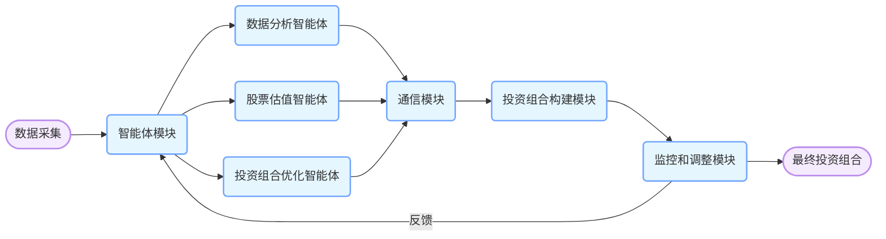

# AI多智能体系统如何改进传统的价值投资组合构建方法

> 关键词：AI多智能体系统、传统价值投资组合、构建方法、改进、金融投资

> 摘要：本文聚焦于AI多智能体系统对传统价值投资组合构建方法的改进。首先介绍了相关背景，包括目的范围、预期读者等内容。接着阐述了AI多智能体系统和传统价值投资组合构建方法的核心概念与联系，通过原理和架构的文本示意图以及Mermaid流程图进行直观展示。详细讲解了核心算法原理和具体操作步骤，利用Python源代码进行深入剖析。呈现了相关数学模型和公式，并举例说明。通过项目实战，给出代码实际案例并详细解释。探讨了该技术在实际中的应用场景，推荐了学习、开发等方面的工具和资源。最后总结了未来发展趋势与挑战，解答了常见问题，并提供了扩展阅读和参考资料，旨在全面揭示AI多智能体系统在改进传统价值投资组合构建方法中的作用和潜力。

## 1. 背景介绍 
### 1.1 目的和范围
在金融投资领域，传统的价值投资组合构建方法一直是投资者进行资产配置的重要手段。然而，随着市场环境的日益复杂和多变，传统方法面临着诸多挑战，如难以快速准确地处理海量数据、对市场动态变化的适应性不足等。本文的目的在于探讨AI多智能体系统如何改进传统的价值投资组合构建方法，提高投资组合的绩效和适应性。

本文的范围涵盖了AI多智能体系统和传统价值投资组合构建方法的基本概念、核心算法原理、数学模型、实际应用案例等方面，旨在为投资者和相关研究人员提供全面而深入的技术参考。

### 1.2 预期读者
本文的预期读者包括金融投资领域的从业者，如投资经理、分析师等，他们可以通过本文了解AI多智能体系统在投资组合构建中的应用，为实际工作提供新的思路和方法；计算机科学和人工智能领域的研究人员和开发者，他们可以从中获取AI多智能体系统在金融领域的应用场景和实践经验；以及对金融投资和人工智能技术感兴趣的学生和爱好者，帮助他们拓宽知识面和视野。

### 1.3 文档结构概述
本文将按照以下结构进行阐述：首先介绍背景信息，包括目的范围、预期读者等；接着讲解AI多智能体系统和传统价值投资组合构建方法的核心概念与联系；然后详细阐述核心算法原理和具体操作步骤，结合Python源代码进行说明；呈现相关数学模型和公式，并举例解释；通过项目实战给出代码实际案例并进行详细解读；探讨实际应用场景；推荐学习、开发等方面的工具和资源；最后总结未来发展趋势与挑战，解答常见问题，并提供扩展阅读和参考资料。

### 1.4 术语表
#### 1.4.1 核心术语定义
- **AI多智能体系统（AI Multi - Agent System）**：由多个智能体组成的系统，每个智能体具有一定的自主决策能力和学习能力，它们之间可以通过交互和协作来完成复杂的任务。
- **传统价值投资组合（Traditional Value Investment Portfolio）**：基于价值投资理念构建的投资组合，通过分析股票的内在价值，选择被低估的股票进行投资，以获取长期稳定的收益。
- **投资组合构建（Portfolio Construction）**：根据投资者的目标、风险偏好和市场情况，选择合适的资产并确定其权重，以形成一个投资组合的过程。

#### 1.4.2 相关概念解释
- **智能体（Agent）**：在AI多智能体系统中，智能体是具有感知、决策和行动能力的实体。它可以感知环境信息，根据自身的目标和规则进行决策，并采取相应的行动。
- **价值投资（Value Investment）**：一种投资策略，认为股票的价格会围绕其内在价值波动，投资者可以通过分析公司的基本面，如财务状况、盈利能力等，寻找被低估的股票进行投资。

#### 1.4.3 缩略词列表
- **AI**：Artificial Intelligence（人工智能）
- **MAS**：Multi - Agent System（多智能体系统）

## 2. 核心概念与联系 
### 核心概念原理
#### AI多智能体系统原理
AI多智能体系统由多个智能体组成，每个智能体可以看作是一个独立的决策单元。智能体具有感知环境的能力，它可以通过各种传感器获取环境信息，如市场数据、新闻资讯等。智能体还具有决策能力，它可以根据自身的目标和规则，对感知到的信息进行分析和处理，做出决策。此外，智能体还可以与其他智能体进行交互和协作，共同完成复杂的任务。

智能体的决策过程通常基于一定的算法和模型，如机器学习算法、优化算法等。通过不断地学习和适应环境变化，智能体可以提高自己的决策能力和性能。

#### 传统价值投资组合构建方法原理
传统价值投资组合构建方法基于价值投资理念，其核心思想是寻找被低估的股票进行投资。投资者通常会通过分析公司的基本面，如财务报表、行业前景等，评估股票的内在价值。然后，将股票的内在价值与市场价格进行比较，选择被低估的股票纳入投资组合。

在确定投资组合中各股票的权重时，投资者通常会考虑多种因素，如风险偏好、投资目标等。常见的方法包括等权重法、市值加权法等。

### 架构的文本示意图
AI多智能体系统与传统价值投资组合构建方法的结合架构可以描述如下：

首先，数据采集模块负责收集各种市场数据和公司信息，包括股票价格、财务报表、新闻资讯等。这些数据将被传输到智能体模块。

智能体模块由多个智能体组成，每个智能体负责不同的任务。例如，有的智能体负责数据分析和处理，有的智能体负责股票估值，有的智能体负责投资组合优化等。智能体之间通过通信模块进行交互和协作。

投资组合构建模块根据智能体的决策结果，确定投资组合中各股票的权重，形成最终的投资组合。

监控和调整模块负责实时监控投资组合的绩效，并根据市场变化和智能体的反馈，对投资组合进行调整。

### Mermaid流程图


## 3. 核心算法原理 & 具体操作步骤 
### 核心算法原理
#### 智能体的机器学习算法
在AI多智能体系统中，智能体通常会使用机器学习算法来进行数据分析和决策。例如，我们可以使用神经网络算法来预测股票价格的走势。

神经网络是一种模仿人类神经系统的计算模型，它由多个神经元组成。每个神经元接收输入信号，经过加权求和和非线性变换后，输出结果。通过不断地调整神经元之间的权重，神经网络可以学习到输入数据和输出结果之间的映射关系。

以下是一个简单的Python代码示例，使用Keras库构建一个简单的神经网络模型来预测股票价格：

```python
import numpy as np
from keras.models import Sequential
from keras.layers import Dense

# 生成一些示例数据
X = np.array([[1, 2], [2, 3], [3, 4], [4, 5]])
y = np.array([3, 5, 7, 9])

# 构建神经网络模型
model = Sequential()
model.add(Dense(10, input_dim=2, activation='relu'))
model.add(Dense(1, activation='linear'))

# 编译模型
model.compile(loss='mean_squared_error', optimizer='adam')

# 训练模型
model.fit(X, y, epochs=100, batch_size=1)

# 进行预测
new_X = np.array([[5, 6]])
prediction = model.predict(new_X)
print("预测结果:", prediction)
```

#### 投资组合优化算法
在确定投资组合中各股票的权重时，我们可以使用优化算法来最大化投资组合的收益或最小化风险。常见的优化算法包括均值 - 方差优化算法。

均值 - 方差优化算法的目标是在给定的风险水平下，最大化投资组合的预期收益；或者在给定的预期收益水平下，最小化投资组合的风险。其数学模型可以表示为：

$$
\min w^T \Sigma w
$$

$$
\text{s.t. } w^T \mu = R
$$

$$
\sum_{i=1}^{n} w_i = 1
$$

其中，$w$ 是投资组合中各股票的权重向量，$\Sigma$ 是股票收益率的协方差矩阵，$\mu$ 是股票的预期收益率向量，$R$ 是给定的预期收益率。

### 具体操作步骤
1. **数据采集**：收集各种市场数据和公司信息，包括股票价格、财务报表、新闻资讯等。
2. **数据预处理**：对采集到的数据进行清洗、归一化等处理，以便后续的分析和处理。
3. **智能体初始化**：初始化各个智能体，为其分配任务和规则。
4. **数据分析和处理**：智能体使用机器学习算法对数据进行分析和处理，如预测股票价格、评估股票的内在价值等。
5. **投资组合优化**：根据智能体的决策结果，使用优化算法确定投资组合中各股票的权重。
6. **投资组合构建**：根据优化结果，构建最终的投资组合。
7. **监控和调整**：实时监控投资组合的绩效，并根据市场变化和智能体的反馈，对投资组合进行调整。

## 4. 数学模型和公式 & 详细讲解 & 举例说明 
### 股票估值模型
#### 股息贴现模型（Dividend Discount Model，DDM）
股息贴现模型是一种常用的股票估值模型，其基本思想是将股票的价值看作是未来股息的现值之和。

公式为：

$$
V = \sum_{t=1}^{\infty} \frac{D_t}{(1 + r)^t}
$$

其中，$V$ 是股票的内在价值，$D_t$ 是第 $t$ 期的股息，$r$ 是贴现率。

例如，假设某股票每年的股息为 $2$ 元，贴现率为 $10\%$，则该股票的内在价值为：

$$
V = \frac{2}{0.1} = 20 \text{ 元}
$$

#### 市盈率模型（Price - Earnings Ratio Model，P/E Model）
市盈率模型是通过比较股票的市盈率与行业平均市盈率来评估股票的价值。

公式为：

$$
V = E \times P/E
$$

其中，$V$ 是股票的内在价值，$E$ 是每股收益，$P/E$ 是市盈率。

例如，假设某股票的每股收益为 $2$ 元，行业平均市盈率为 $15$，则该股票的内在价值为：

$$
V = 2 \times 15 = 30 \text{ 元}
$$

### 投资组合风险模型
#### 方差 - 协方差模型
投资组合的风险可以用方差来衡量，其公式为：

$$
\sigma_p^2 = \sum_{i=1}^{n} \sum_{j=1}^{n} w_i w_j \sigma_{ij}
$$

其中，$\sigma_p^2$ 是投资组合的方差，$w_i$ 和 $w_j$ 分别是第 $i$ 只和第 $j$ 只股票的权重，$\sigma_{ij}$ 是第 $i$ 只和第 $j$ 只股票收益率的协方差。

例如，假设投资组合由两只股票组成，权重分别为 $w_1 = 0.6$ 和 $w_2 = 0.4$，股票 1 的方差为 $\sigma_1^2 = 0.1$，股票 2 的方差为 $\sigma_2^2 = 0.2$，两只股票收益率的协方差为 $\sigma_{12} = 0.05$，则投资组合的方差为：

$$
\begin{align*}
\sigma_p^2 &= w_1^2 \sigma_1^2 + w_2^2 \sigma_2^2 + 2 w_1 w_2 \sigma_{12}\\
&= 0.6^2 \times 0.1 + 0.4^2 \times 0.2 + 2 \times 0.6 \times 0.4 \times 0.05\\
&= 0.036 + 0.032 + 0.024\\
&= 0.092
\end{align*}
$$

## 5. 项目实战：代码实际案例和详细解释说明 
### 5.1  开发环境搭建
1. **安装Python**：从Python官方网站（https://www.python.org/downloads/）下载并安装Python 3.x版本。
2. **安装必要的库**：使用pip命令安装以下库：
    - `pandas`：用于数据处理和分析。
    - `numpy`：用于数值计算。
    - `scikit - learn`：用于机器学习算法。
    - `keras`：用于构建神经网络模型。
    - `cvxpy`：用于优化算法。

示例安装命令：

```sh
pip install pandas numpy scikit-learn keras cvxpy
```

### 5.2  源代码详细实现和代码解读
以下是一个完整的Python代码示例，演示了如何使用AI多智能体系统改进传统的价值投资组合构建方法：

```python
import pandas as pd
import numpy as np
from sklearn.preprocessing import MinMaxScaler
from keras.models import Sequential
from keras.layers import Dense
import cvxpy as cp

# 数据采集和预处理
def data_preprocessing():
    # 假设我们有一些股票价格数据
    data = pd.DataFrame({
        'stock1': [100, 102, 105, 103, 106],
        'stock2': [200, 205, 203, 208, 210],
        'stock3': [300, 302, 305, 303, 306]
    })
    scaler = MinMaxScaler()
    scaled_data = scaler.fit_transform(data)
    return scaled_data

# 智能体模块：使用神经网络预测股票价格
def stock_price_prediction(data):
    X = data[:-1]
    y = data[1:]
    model = Sequential()
    model.add(Dense(10, input_dim=3, activation='relu'))
    model.add(Dense(3, activation='linear'))
    model.compile(loss='mean_squared_error', optimizer='adam')
    model.fit(X, y, epochs=100, batch_size=1)
    next_day_prediction = model.predict(data[-1:])
    return next_day_prediction

# 投资组合优化模块：使用均值 - 方差优化算法
def portfolio_optimization(prediction):
    n = prediction.shape[1]
    w = cp.Variable(n)
    mu = np.mean(prediction, axis=0)
    Sigma = np.cov(prediction.T)
    objective = cp.Minimize(cp.quad_form(w, Sigma))
    constraints = [cp.sum(w) == 1, w >= 0]
    prob = cp.Problem(objective, constraints)
    prob.solve()
    optimal_weights = w.value
    return optimal_weights

# 主函数
def main():
    data = data_preprocessing()
    prediction = stock_price_prediction(data)
    optimal_weights = portfolio_optimization(prediction)
    print("最优权重:", optimal_weights)

if __name__ == "__main__":
    main()
```

### 5.3  代码解读与分析
1. **数据采集和预处理**：`data_preprocessing` 函数模拟了数据采集过程，并使用 `MinMaxScaler` 对数据进行归一化处理，将数据缩放到 $[0, 1]$ 范围内。
2. **智能体模块**：`stock_price_prediction` 函数使用神经网络模型对股票价格进行预测。首先，将数据分为输入特征 $X$ 和目标值 $y$，然后构建一个简单的神经网络模型，训练模型并进行预测。
3. **投资组合优化模块**：`portfolio_optimization` 函数使用均值 - 方差优化算法确定投资组合中各股票的权重。通过定义优化目标和约束条件，使用 `cvxpy` 库求解最优权重。
4. **主函数**：`main` 函数调用上述函数，完成数据预处理、股票价格预测和投资组合优化的整个过程，并输出最优权重。

## 6. 实际应用场景 
### 量化投资
在量化投资领域，AI多智能体系统可以帮助投资者快速准确地处理海量的市场数据，挖掘投资机会。通过智能体之间的交互和协作，可以实现对市场的实时监控和分析，及时调整投资组合，提高投资绩效。

### 风险管理
在风险管理方面，AI多智能体系统可以对投资组合的风险进行实时评估和预警。智能体可以根据市场变化和投资组合的表现，及时调整风险控制策略，降低投资风险。

### 资产配置
AI多智能体系统可以根据投资者的风险偏好、投资目标等因素，为投资者提供个性化的资产配置方案。通过智能体的学习和决策能力，可以不断优化资产配置，提高投资组合的收益和稳定性。

## 7. 工具和资源推荐
### 7.1 学习资源推荐
#### 7.1.1 书籍推荐
- 《人工智能：一种现代的方法》：全面介绍了人工智能的基本概念、算法和应用，是人工智能领域的经典教材。
- 《Python机器学习》：详细介绍了Python在机器学习中的应用，包括各种机器学习算法的原理和实现。
- 《金融投资学》：系统阐述了金融投资的基本理论和方法，包括投资组合理论、资产定价模型等。

#### 7.1.2 在线课程
- Coursera平台上的“机器学习”课程：由斯坦福大学教授Andrew Ng主讲，是机器学习领域的经典课程。
- edX平台上的“人工智能基础”课程：介绍了人工智能的基本概念、算法和应用。
- 中国大学MOOC平台上的“金融投资学”课程：系统讲解了金融投资的基本理论和方法。

#### 7.1.3 技术博客和网站
- Medium：一个汇聚了众多技术专家和开发者的博客平台，上面有很多关于人工智能和金融投资的优秀文章。
- arXiv：一个预印本平台，提供了大量的学术论文和研究成果，包括人工智能和金融领域的最新研究。
- 雪球网：一个专注于金融投资的社区网站，上面有很多投资者分享的投资经验和研究报告。

### 7.2 开发工具框架推荐
#### 7.2.1 IDE和编辑器
- PyCharm：一款功能强大的Python集成开发环境，提供了代码编辑、调试、版本控制等功能。
- Jupyter Notebook：一个交互式的开发环境，适合进行数据探索和模型实验。

#### 7.2.2 调试和性能分析工具
- PDB：Python自带的调试工具，可以帮助开发者调试代码。
- cProfile：Python的性能分析工具，可以帮助开发者找出代码中的性能瓶颈。

#### 7.2.3 相关框架和库
- TensorFlow：一个开源的机器学习框架，提供了丰富的机器学习算法和工具。
- PyTorch：一个深度学习框架，具有动态计算图的特点，适合进行深度学习模型的开发。
- Pandas：一个数据处理和分析库，提供了高效的数据结构和数据操作方法。

### 7.3 相关论文著作推荐
#### 7.3.1 经典论文
- Markowitz, H. M. (1952). Portfolio Selection. The Journal of Finance, 7(1), 77 - 91. 该论文提出了均值 - 方差投资组合理论，是现代投资组合理论的奠基之作。
- Fama, E. F., & French, K. R. (1992). The Cross - Section of Expected Stock Returns. The Journal of Finance, 47(2), 427 - 465. 该论文提出了Fama - French三因子模型，对股票收益率的解释具有重要意义。

#### 7.3.2 最新研究成果
- 关注顶级金融和人工智能学术期刊，如《Journal of Financial Economics》、《Artificial Intelligence》等，获取最新的研究成果。

#### 7.3.3 应用案例分析
- 可以参考一些金融机构和投资公司的研究报告和案例分析，了解AI多智能体系统在实际投资中的应用效果和经验教训。

## 8. 总结：未来发展趋势与挑战
### 未来发展趋势
- **智能化程度不断提高**：随着人工智能技术的不断发展，AI多智能体系统的智能化程度将不断提高。智能体将具有更强的学习能力和决策能力，能够更好地适应复杂多变的市场环境。
- **与其他技术融合**：AI多智能体系统将与区块链、物联网等技术深度融合，为金融投资领域带来更多的创新和变革。例如，区块链技术可以提高数据的安全性和透明度，物联网技术可以提供更多的市场数据和信息。
- **个性化服务**：未来，AI多智能体系统将能够根据投资者的个性化需求，提供更加精准的投资建议和资产配置方案，实现个性化的投资服务。

### 挑战
- **数据质量和隐私问题**：AI多智能体系统的性能很大程度上依赖于数据的质量和数量。然而，数据的质量和隐私问题一直是困扰该领域的难题。如何获取高质量的数据，并保护数据的隐私和安全，是需要解决的重要问题。
- **算法复杂性和可解释性**：随着AI多智能体系统的不断发展，算法的复杂性也在不断增加。复杂的算法虽然可以提高系统的性能，但也带来了可解释性的问题。如何让投资者理解和信任AI多智能体系统的决策结果，是需要解决的另一个重要问题。
- **监管和合规问题**：AI多智能体系统在金融投资领域的应用，可能会带来一些监管和合规问题。例如，如何确保系统的决策符合法律法规和监管要求，如何防范系统的风险等，都是需要关注的问题。

## 9. 附录：常见问题与解答
### 问题1：AI多智能体系统在投资组合构建中的优势是什么？
答：AI多智能体系统具有以下优势：能够快速准确地处理海量数据，挖掘投资机会；智能体之间的交互和协作可以实现对市场的实时监控和分析，及时调整投资组合；可以根据投资者的个性化需求，提供定制化的投资建议和资产配置方案。

### 问题2：如何确保AI多智能体系统的决策结果是可靠的？
答：可以通过以下方法确保决策结果的可靠性：使用高质量的数据进行训练和学习；对算法进行优化和改进，提高算法的准确性和稳定性；对系统进行严格的测试和验证，确保系统在各种情况下都能正常运行；引入可解释性技术，让投资者能够理解和信任系统的决策结果。

### 问题3：AI多智能体系统在实际应用中面临哪些困难？
答：实际应用中面临的数据质量和隐私问题、算法复杂性和可解释性问题、监管和合规问题等。

## 10. 扩展阅读 & 参考资料
### 扩展阅读
- 《智能金融：人工智能时代的金融创新与应用》：介绍了人工智能在金融领域的应用和创新，包括智能投顾、风险管理等方面。
- 《区块链与金融：技术重塑金融未来》：探讨了区块链技术在金融领域的应用和发展趋势。

### 参考资料
- 相关学术论文和研究报告，如《Journal of Financial Economics》、《Artificial Intelligence》等期刊上的论文。
- 金融机构和投资公司的研究报告和案例分析。
- 人工智能和金融投资领域的专业书籍和教材。

作者：AI天才研究院/AI Genius Institute & 禅与计算机程序设计艺术 /Zen And The Art of Computer Programming