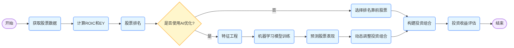

# AI如何优化格林布拉特的魔法公式策略

> 关键词：AI、格林布拉特魔法公式、量化投资、策略优化、机器学习、金融科技

> 摘要：本文围绕AI如何优化格林布拉特的魔法公式策略展开。首先介绍了格林布拉特魔法公式的背景和基本原理，以及AI在金融领域应用的大环境。接着深入剖析了核心概念与联系，阐述了魔法公式与AI结合的架构。通过详细的算法原理和Python代码展示了如何运用AI优化该策略。从数学模型和公式层面揭示了其内在逻辑，并通过项目实战给出实际案例和代码解读。探讨了该优化策略的实际应用场景，推荐了相关的学习资源、开发工具和论文著作。最后总结了未来发展趋势与挑战，还给出了常见问题解答和扩展阅读参考资料，旨在为投资者和金融从业者提供全面深入的技术和理论指导。

## 1. 背景介绍 
### 1.1 目的和范围
格林布拉特的魔法公式是一种简单而有效的量化投资策略，旨在通过对股票的盈利能力和估值水平进行综合评估，筛选出具有投资价值的股票。然而，随着市场环境的不断变化和金融数据的日益复杂，传统的魔法公式策略面临着一定的局限性。本文的目的在于探讨如何利用AI技术对格林布拉特的魔法公式策略进行优化，以提高策略的有效性和适应性。

本文的范围涵盖了从理论原理到实际应用的多个方面，包括魔法公式的基本原理、AI技术的应用、优化策略的算法实现、数学模型的构建、项目实战案例以及实际应用场景等。通过对这些内容的深入研究，为读者提供一个全面而系统的了解AI优化格林布拉特魔法公式策略的途径。

### 1.2 预期读者
本文预期读者主要包括金融领域的投资者、量化分析师、金融科技从业者以及对AI和量化投资感兴趣的技术人员和研究人员。对于投资者来说，本文可以帮助他们了解如何利用先进的技术手段优化投资策略，提高投资收益；对于量化分析师和金融科技从业者，本文提供了一种新的技术思路和方法，有助于他们在实际工作中进行策略开发和优化；对于技术人员和研究人员，本文可以作为一个研究案例，深入探讨AI在金融领域的应用和创新。

### 1.3 文档结构概述
本文共分为十个部分。第一部分是背景介绍，包括目的和范围、预期读者、文档结构概述和术语表；第二部分介绍核心概念与联系，包括格林布拉特魔法公式和AI的原理以及它们之间的联系，并通过文本示意图和Mermaid流程图进行展示；第三部分详细阐述核心算法原理和具体操作步骤，同时使用Python源代码进行说明；第四部分给出数学模型和公式，并进行详细讲解和举例说明；第五部分通过项目实战，介绍开发环境搭建、源代码详细实现和代码解读；第六部分探讨实际应用场景；第七部分推荐相关的工具和资源，包括学习资源、开发工具框架和论文著作；第八部分总结未来发展趋势与挑战；第九部分是附录，解答常见问题；第十部分提供扩展阅读和参考资料。

### 1.4 术语表
#### 1.4.1 核心术语定义
- **格林布拉特魔法公式**：由投资者乔尔·格林布拉特提出的一种量化投资策略，通过计算股票的资本回报率和盈利收益率，对股票进行排名，选择排名靠前的股票进行投资。
- **AI（人工智能）**：研究、开发用于模拟、延伸和扩展人的智能的理论、方法、技术及应用系统的一门新的技术科学。
- **量化投资**：利用计算机技术和数学模型，对金融市场的数据进行分析和处理，以制定投资策略的一种投资方式。
- **机器学习**：一门多领域交叉学科，涉及概率论、统计学、逼近论、凸分析、算法复杂度理论等多门学科。它专门研究计算机怎样模拟或实现人类的学习行为，以获取新的知识或技能，重新组织已有的知识结构使之不断改善自身的性能。
- **资本回报率（ROIC）**：指投出和/或使用资金与相关回报（回报通常表现为获取的利息和/或分得利润）之比例。用于衡量投出资金的使用效果。
- **盈利收益率（EY）**：指股票盈利与股价的比率，是衡量股票估值水平的一个指标。

#### 1.4.2 相关概念解释
- **量化策略优化**：对已有的量化投资策略进行改进和完善，以提高策略的收益率、降低风险或增强策略的适应性。
- **特征工程**：在机器学习中，将原始数据转换为更能代表预测模型的潜在问题的特征的过程，包括数据清洗、特征选择、特征提取和特征变换等步骤。
- **模型训练**：使用机器学习算法对训练数据进行学习，调整模型的参数，使模型能够对未知数据进行准确预测的过程。

#### 1.4.3 缩略词列表
- **AI**：Artificial Intelligence（人工智能）
- **ROIC**：Return on Invested Capital（资本回报率）
- **EY**：Earnings Yield（盈利收益率）

## 2. 核心概念与联系 

### 格林布拉特魔法公式原理
格林布拉特的魔法公式基于两个核心指标：资本回报率（ROIC）和盈利收益率（EY）。资本回报率衡量了公司运用资本创造利润的效率，盈利收益率则反映了股票的估值水平。具体计算方法如下：
- 资本回报率（ROIC） = 息税前利润（EBIT） / 投入资本
- 盈利收益率（EY） = 息税前利润（EBIT） / 企业价值（EV）

魔法公式的基本思路是对股票按照资本回报率和盈利收益率进行排名，然后选择排名靠前的股票进行投资。其背后的逻辑是，高资本回报率的公司通常具有较强的盈利能力和竞争优势，而低估值（高盈利收益率）的股票可能被市场低估，具有较高的投资价值。

### AI在金融领域的应用原理
AI在金融领域的应用主要基于机器学习和深度学习技术。机器学习算法可以对大量的金融数据进行分析和挖掘，发现数据中的规律和模式，从而预测市场趋势、评估风险和优化投资策略。深度学习则可以处理更加复杂和高维的数据，如文本数据、图像数据等，通过构建深度神经网络模型，自动提取数据中的特征，提高预测的准确性和效率。

### 魔法公式与AI的联系
AI可以从多个方面对格林布拉特的魔法公式进行优化。一方面，AI可以通过特征工程，挖掘更多与股票投资价值相关的特征，除了资本回报率和盈利收益率外，还可以考虑公司的财务指标、行业趋势、宏观经济数据等，从而更全面地评估股票的投资价值。另一方面，AI可以利用机器学习算法对股票进行分类和预测，根据不同的市场环境和股票特征，动态调整投资组合，提高策略的适应性和收益率。

### 文本示意图
```plaintext
格林布拉特魔法公式
|-- 资本回报率（ROIC）
|-- 盈利收益率（EY）
|-- 股票排名
|-- 投资组合选择

AI优化
|-- 特征工程
|   |-- 财务指标
|   |-- 行业趋势
|   |-- 宏观经济数据
|-- 机器学习算法
|   |-- 分类算法
|   |-- 预测算法
|-- 动态调整投资组合
```

### Mermaid流程图


## 3. 核心算法原理 & 具体操作步骤 

### 格林布拉特魔法公式算法原理
格林布拉特魔法公式的核心算法是计算每只股票的资本回报率（ROIC）和盈利收益率（EY），然后对股票按照这两个指标进行排名，选择排名靠前的股票构建投资组合。以下是Python代码示例：

```python
import pandas as pd

def calculate_roic(ebit, invested_capital):
    """
    计算资本回报率（ROIC）
    :param ebit: 息税前利润
    :param invested_capital: 投入资本
    :return: 资本回报率
    """
    return ebit / invested_capital

def calculate_ey(ebit, ev):
    """
    计算盈利收益率（EY）
    :param ebit: 息税前利润
    :param ev: 企业价值
    :return: 盈利收益率
    """
    return ebit / ev

def magic_formula_ranking(data):
    """
    格林布拉特魔法公式排名
    :param data: 包含股票数据的DataFrame，列名包括'ebit', 'invested_capital', 'ev'
    :return: 排名后的DataFrame，包含'roic', 'ey', 'roic_rank', 'ey_rank', 'total_rank'列
    """
    data['roic'] = data.apply(lambda row: calculate_roic(row['ebit'], row['invested_capital']), axis=1)
    data['ey'] = data.apply(lambda row: calculate_ey(row['ebit'], row['ev']), axis=1)
    data['roic_rank'] = data['roic'].rank(ascending=False)
    data['ey_rank'] = data['ey'].rank(ascending=False)
    data['total_rank'] = data['roic_rank'] + data['ey_rank']
    data = data.sort_values(by='total_rank')
    return data
```

### AI优化算法原理
AI优化主要包括特征工程和机器学习模型训练两个步骤。特征工程的目的是从原始数据中提取更多有价值的特征，机器学习模型则用于对股票的表现进行预测。以下是一个简单的AI优化示例，使用逻辑回归模型进行股票分类：

```python
from sklearn.linear_model import LogisticRegression
from sklearn.model_selection import train_test_split
from sklearn.preprocessing import StandardScaler

def feature_engineering(data):
    """
    特征工程
    :param data: 包含股票数据的DataFrame
    :return: 处理后的特征矩阵X和标签向量y
    """
    # 选择相关特征
    features = ['roic', 'ey', 'pe_ratio', 'pb_ratio']  # 示例特征，可根据实际情况调整
    X = data[features]
    # 定义标签，例如，未来一段时间内股票收益率大于某个阈值为1，否则为0
    data['label'] = (data['future_return'] > 0.1).astype(int)
    y = data['label']
    return X, y

def ai_optimization(X, y):
    """
    AI优化，使用逻辑回归模型进行训练和预测
    :param X: 特征矩阵
    :param y: 标签向量
    :return: 训练好的模型
    """
    # 数据标准化
    scaler = StandardScaler()
    X_scaled = scaler.fit_transform(X)
    # 划分训练集和测试集
    X_train, X_test, y_train, y_test = train_test_split(X_scaled, y, test_size=0.2, random_state=42)
    # 训练逻辑回归模型
    model = LogisticRegression()
    model.fit(X_train, y_train)
    return model
```

### 具体操作步骤
1. **数据获取**：从金融数据提供商（如Wind、Tushare等）获取股票的财务数据、市场数据等。
2. **数据预处理**：对获取的数据进行清洗、缺失值处理、异常值处理等操作，确保数据的质量。
3. **计算ROIC和EY**：根据上述公式计算每只股票的资本回报率和盈利收益率。
4. **魔法公式排名**：对股票按照ROIC和EY进行排名，选择排名靠前的股票。
5. **特征工程**：从原始数据中提取更多有价值的特征，如市盈率、市净率等。
6. **机器学习模型训练**：使用处理后的特征数据和标签数据，训练机器学习模型，如逻辑回归、决策树、随机森林等。
7. **预测和投资组合调整**：使用训练好的模型对股票的表现进行预测，根据预测结果动态调整投资组合。

## 4. 数学模型和公式 & 详细讲解 & 举例说明 

### 格林布拉特魔法公式数学模型
格林布拉特魔法公式主要基于两个指标：资本回报率（ROIC）和盈利收益率（EY）。其数学公式如下：

- 资本回报率（ROIC）：
$$ROIC = \frac{EBIT}{Invested\ Capital}$$
其中，$EBIT$ 表示息税前利润，$Invested\ Capital$ 表示投入资本。

- 盈利收益率（EY）：
$$EY = \frac{EBIT}{EV}$$
其中，$EV$ 表示企业价值。

### AI优化数学模型
AI优化主要涉及机器学习模型，以逻辑回归模型为例，其数学模型可以表示为：

- 逻辑回归模型的预测函数：
$$P(y = 1|x) = \frac{1}{1 + e^{-z}}$$
其中，$z = \theta_0 + \theta_1x_1 + \theta_2x_2 + \cdots + \theta_nx_n$，$\theta$ 是模型的参数，$x$ 是特征向量。

- 损失函数（对数损失函数）：
$$J(\theta) = -\frac{1}{m}\sum_{i = 1}^{m}[y^{(i)}\log(P(y^{(i)} = 1|x^{(i)})) + (1 - y^{(i)})\log(1 - P(y^{(i)} = 1|x^{(i)}))]$$
其中，$m$ 是样本数量，$y^{(i)}$ 是第 $i$ 个样本的真实标签。

### 详细讲解
- **格林布拉特魔法公式**：资本回报率（ROIC）衡量了公司运用资本创造利润的效率，ROIC越高，说明公司的盈利能力越强。盈利收益率（EY）反映了股票的估值水平，EY越高，说明股票的估值越低，具有更高的投资价值。通过对股票按照ROIC和EY进行排名，可以筛选出盈利能力强且估值低的股票。

- **AI优化**：逻辑回归模型是一种常用的分类模型，通过学习特征和标签之间的关系，预测股票的表现。对数损失函数用于衡量模型的预测结果与真实标签之间的差异，通过最小化损失函数，可以调整模型的参数，使模型的预测结果更加准确。

### 举例说明
假设我们有以下股票数据：

| 股票代码 | EBIT | 投入资本 | 企业价值 | 市盈率 | 市净率 | 未来收益率 |
|---|---|---|---|---|---|---|
| 000001 | 100 | 500 | 800 | 10 | 2 | 0.15 |
| 000002 | 80 | 600 | 900 | 12 | 2.5 | 0.08 |
| 000003 | 120 | 400 | 700 | 8 | 1.8 | 0.2 |

1. **计算ROIC和EY**：
    - 对于股票000001：
        - $ROIC = \frac{100}{500} = 0.2$
        - $EY = \frac{100}{800} = 0.125$
    - 对于股票000002：
        - $ROIC = \frac{80}{600} \approx 0.133$
        - $EY = \frac{80}{900} \approx 0.089$
    - 对于股票000003：
        - $ROIC = \frac{120}{400} = 0.3$
        - $EY = \frac{120}{700} \approx 0.171$

2. **魔法公式排名**：
    - 按照ROIC排名：000003 > 000001 > 000002
    - 按照EY排名：000003 > 000001 > 000002
    - 总排名：000003 > 000001 > 000002

3. **AI优化**：
    - 特征工程：选择ROIC、EY、市盈率、市净率作为特征，未来收益率大于0.1作为标签。
    - 训练逻辑回归模型，预测股票的表现。

## 5. 项目实战：代码实际案例和详细解释说明 

### 5.1  开发环境搭建
1. **Python环境**：建议使用Python 3.7及以上版本，可以通过Anaconda或Python官方网站进行安装。
2. **必要的库**：安装以下必要的Python库：
    - `pandas`：用于数据处理和分析。
    - `numpy`：用于数值计算。
    - `scikit-learn`：用于机器学习算法的实现。
    - `tushare`：用于获取金融数据（需要注册并获取token）。

可以使用以下命令进行安装：
```sh
pip install pandas numpy scikit-learn tushare
```

### 5.2  源代码详细实现和代码解读
```python
import tushare as ts
import pandas as pd
import numpy as np
from sklearn.linear_model import LogisticRegression
from sklearn.model_selection import train_test_split
from sklearn.preprocessing import StandardScaler

# 设置tushare token
ts.set_token('your_token')
pro = ts.pro_api()

def get_stock_data():
    """
    获取股票数据
    :return: 包含股票数据的DataFrame
    """
    # 获取财务数据
    df_finance = pro.income(ts_code='', start_date='20200101', end_date='20211231')
    df_balance = pro.balancesheet(ts_code='', start_date='20200101', end_date='20211231')
    # 获取市场数据
    df_market = pro.daily_basic(ts_code='', start_date='20200101', end_date='20211231')
    # 合并数据
    df = pd.merge(df_finance, df_balance, on='ts_code')
    df = pd.merge(df, df_market, on='ts_code')
    return df

def preprocess_data(df):
    """
    数据预处理
    :param df: 包含股票数据的DataFrame
    :return: 处理后的DataFrame
    """
    # 处理缺失值
    df = df.dropna()
    # 计算ROIC和EY
    df['roic'] = df['ebit'] / df['total_assets']
    df['ey'] = df['ebit'] / df['total_mv']
    return df

def feature_engineering(df):
    """
    特征工程
    :param df: 包含股票数据的DataFrame
    :return: 处理后的特征矩阵X和标签向量y
    """
    # 选择相关特征
    features = ['roic', 'ey', 'pe_ttm', 'pb']
    X = df[features]
    # 定义标签，例如，未来一段时间内股票收益率大于某个阈值为1，否则为0
    df['future_return'] = df['pct_chg'].shift(-1)
    df['label'] = (df['future_return'] > 0.1).astype(int)
    y = df['label']
    return X, y

def ai_optimization(X, y):
    """
    AI优化，使用逻辑回归模型进行训练和预测
    :param X: 特征矩阵
    :param y: 标签向量
    :return: 训练好的模型
    """
    # 数据标准化
    scaler = StandardScaler()
    X_scaled = scaler.fit_transform(X)
    # 划分训练集和测试集
    X_train, X_test, y_train, y_test = train_test_split(X_scaled, y, test_size=0.2, random_state=42)
    # 训练逻辑回归模型
    model = LogisticRegression()
    model.fit(X_train, y_train)
    return model

def main():
    # 获取股票数据
    df = get_stock_data()
    # 数据预处理
    df = preprocess_data(df)
    # 特征工程
    X, y = feature_engineering(df)
    # AI优化
    model = ai_optimization(X, y)
    # 预测
    y_pred = model.predict(X)
    print('预测结果：', y_pred)

if __name__ == '__main__':
    main()
```

### 5.3  代码解读与分析
1. **数据获取**：使用`tushare`库获取股票的财务数据和市场数据，并将它们合并到一个DataFrame中。
2. **数据预处理**：处理缺失值，计算ROIC和EY。
3. **特征工程**：选择相关特征，定义标签，将未来一段时间内股票收益率大于某个阈值的股票标记为1，否则标记为0。
4. **AI优化**：使用逻辑回归模型进行训练和预测，包括数据标准化、划分训练集和测试集、模型训练等步骤。
5. **预测**：使用训练好的模型对股票的表现进行预测。

需要注意的是，上述代码仅为示例，实际应用中可能需要根据具体情况进行调整和优化。例如，数据的获取和处理可能需要更复杂的逻辑，模型的选择和参数调优也需要进一步的研究和实验。

## 6. 实际应用场景 
### 个人投资者
对于个人投资者来说，AI优化的格林布拉特魔法公式策略可以帮助他们更科学地选择投资标的，提高投资收益。个人投资者可以利用该策略筛选出具有投资价值的股票，构建自己的投资组合。同时，通过AI技术的动态调整功能，根据市场环境的变化及时调整投资组合，降低投资风险。

### 机构投资者
机构投资者通常管理着大量的资金，需要更专业和复杂的投资策略。AI优化的格林布拉特魔法公式策略可以为机构投资者提供一种有效的量化投资方法。机构投资者可以利用该策略对大规模的股票数据进行分析和筛选，快速发现投资机会。此外，该策略还可以与其他投资策略相结合，构建多元化的投资组合，提高投资组合的整体绩效。

### 金融科技公司
金融科技公司可以将AI优化的格林布拉特魔法公式策略集成到自己的金融产品中，为客户提供个性化的投资建议和服务。例如，开发智能投顾平台，根据客户的风险偏好和投资目标，利用该策略为客户推荐合适的投资组合。同时，金融科技公司还可以通过不断优化和改进该策略，提高产品的竞争力和用户体验。

### 学术研究
在学术研究领域，AI优化的格林布拉特魔法公式策略可以作为一个研究案例，深入探讨AI在金融领域的应用和创新。研究人员可以通过对该策略的理论分析和实证研究，验证其有效性和可行性，为金融投资理论的发展提供新的思路和方法。此外，该策略还可以用于比较不同AI算法和模型在金融投资中的性能差异，为算法和模型的优化提供参考。

## 7. 工具和资源推荐
### 7.1 学习资源推荐
#### 7.1.1 书籍推荐
- 《聪明的投资者》（The Intelligent Investor）：作者本杰明·格雷厄姆（Benjamin Graham），被誉为投资界的圣经，介绍了价值投资的基本理念和方法。
- 《漫步华尔街》（A Random Walk Down Wall Street）：作者伯顿·马尔基尔（Burton Malkiel），探讨了股票市场的效率和投资策略，对量化投资有一定的启示。
- 《机器学习》（Machine Learning）：作者周志华，是机器学习领域的经典教材，系统介绍了机器学习的基本概念、算法和应用。

#### 7.1.2 在线课程
- Coursera上的“机器学习”课程（Andrew Ng教授主讲）：该课程是机器学习领域的经典在线课程，全面介绍了机器学习的基本概念、算法和应用。
- edX上的“金融科技”课程：该课程介绍了金融科技的发展趋势和应用场景，包括量化投资、区块链、人工智能等方面的内容。
- 中国大学MOOC上的“量化投资与金融科技”课程：该课程结合中国金融市场的实际情况，介绍了量化投资的基本理论和方法，以及金融科技在量化投资中的应用。

#### 7.1.3 技术博客和网站
- Medium：一个技术博客平台，有很多关于AI、量化投资等领域的优秀文章。
- Towards Data Science：专注于数据科学和机器学习领域的技术博客，提供了很多实用的技术教程和案例分析。
- 量化投资研究网：国内专注于量化投资领域的网站，提供了丰富的量化投资知识、策略和工具。

### 7.2 开发工具框架推荐
#### 7.2.1 IDE和编辑器
- PyCharm：一款专业的Python集成开发环境，提供了丰富的代码编辑、调试和版本控制功能。
- Jupyter Notebook：一个交互式的编程环境，适合进行数据分析和模型开发，支持多种编程语言。
- Visual Studio Code：一款轻量级的代码编辑器，支持多种编程语言和插件扩展，具有良好的用户体验。

#### 7.2.2 调试和性能分析工具
- PDB：Python自带的调试工具，可以帮助开发者定位和解决代码中的问题。
- cProfile：Python的性能分析工具，可以分析代码的运行时间和内存使用情况，帮助开发者优化代码性能。
- TensorBoard：TensorFlow的可视化工具，可以用于可视化模型的训练过程和性能指标。

#### 7.2.3 相关框架和库
- Pandas：用于数据处理和分析的Python库，提供了高效的数据结构和数据操作方法。
- NumPy：用于数值计算的Python库，提供了多维数组和各种数学函数。
- Scikit-learn：用于机器学习的Python库，提供了丰富的机器学习算法和工具。
- TensorFlow和PyTorch：深度学习框架，用于构建和训练深度学习模型。

### 7.3 相关论文著作推荐
#### 7.3.1 经典论文
- Fama, E. F., & French, K. R. (1992). The cross-section of expected stock returns. The Journal of Finance, 47(2), 427-465. 该论文提出了著名的Fama-French三因子模型，对股票收益率的横截面进行了深入研究。
- Sharpe, W. F. (1964). Capital asset prices: A theory of market equilibrium under conditions of risk. The Journal of Finance, 19(3), 425-442. 该论文提出了资本资产定价模型（CAPM），为资产定价和投资组合理论奠定了基础。

#### 7.3.2 最新研究成果
- 通过学术数据库（如IEEE Xplore、ACM Digital Library、ScienceDirect等）搜索关于AI在金融投资领域的最新研究论文，了解该领域的前沿技术和发展趋势。

#### 7.3.3 应用案例分析
- 一些金融科技公司和投资机构会发布关于量化投资策略应用案例的报告和文章，可以通过他们的官方网站或相关金融媒体获取这些信息，学习实际应用中的经验和技巧。

## 8. 总结：未来发展趋势与挑战
### 未来发展趋势
1. **多技术融合**：未来，AI优化的格林布拉特魔法公式策略将与更多的技术进行融合，如区块链、物联网、大数据等。例如，区块链技术可以提高金融数据的安全性和可信度，物联网技术可以获取更多的实时数据，大数据技术可以处理和分析海量的金融数据，从而进一步提高策略的有效性和适应性。
2. **个性化投资**：随着投资者对个性化投资需求的不断增加，AI优化的格林布拉特魔法公式策略将更加注重个性化服务。通过对投资者的风险偏好、投资目标、财务状况等信息进行分析，为投资者提供定制化的投资组合和投资建议。
3. **自动化交易**：自动化交易是未来金融投资的发展趋势之一。AI优化的格林布拉特魔法公式策略可以与自动化交易系统相结合，实现股票的自动买卖和投资组合的自动调整，提高交易效率和投资收益。
4. **跨市场应用**：目前，该策略主要应用于股票市场，未来有望扩展到其他金融市场，如债券市场、期货市场、外汇市场等。通过对不同市场的数据进行分析和挖掘，开发出适用于不同市场的投资策略，实现跨市场的资产配置和风险管理。

### 挑战
1. **数据质量和隐私问题**：AI优化的格林布拉特魔法公式策略依赖于大量的金融数据，数据的质量和隐私问题是一个重要的挑战。不准确或不完整的数据可能会影响策略的有效性，而数据的隐私泄露可能会给投资者带来损失。因此，需要加强数据质量管理和隐私保护，确保数据的安全性和可靠性。
2. **模型的可解释性**：AI模型通常具有较高的复杂性和黑箱性，模型的可解释性是一个关键问题。在金融投资领域，投资者需要了解模型的决策过程和依据，以便做出合理的投资决策。因此，需要研究和开发可解释的AI模型，提高模型的透明度和可信度。
3. **市场的不确定性**：金融市场具有高度的不确定性和波动性，市场环境的变化可能会导致策略的失效。因此，需要不断优化和调整策略，提高策略的适应性和抗风险能力。
4. **法律法规和监管**：随着AI在金融领域的广泛应用，相关的法律法规和监管政策也需要不断完善。需要明确AI技术在金融投资中的应用边界和责任，防范金融风险，保护投资者的合法权益。

## 9. 附录：常见问题与解答
### 1. 格林布拉特魔法公式策略一定能获得高收益吗？
格林布拉特魔法公式策略是一种基于历史数据和统计规律的量化投资策略，虽然在过去的实践中取得了一定的成功，但并不能保证在未来一定能获得高收益。金融市场具有高度的不确定性和波动性，市场环境的变化可能会导致策略的失效。因此，投资者在使用该策略时需要结合自己的风险承受能力和投资目标，进行合理的资产配置和风险管理。

### 2. AI优化的格林布拉特魔法公式策略需要哪些数据？
AI优化的格林布拉特魔法公式策略需要大量的金融数据，包括股票的财务数据（如营业收入、净利润、资产负债表等）、市场数据（如股价、成交量、市盈率、市净率等）、宏观经济数据（如GDP、通货膨胀率、利率等）。此外，还可以考虑一些非结构化数据，如新闻资讯、社交媒体数据等，以获取更多的信息和洞察。

### 3. 如何选择合适的机器学习模型进行优化？
选择合适的机器学习模型需要考虑多个因素，如数据的特点、问题的类型、模型的性能和可解释性等。对于股票分类和预测问题，可以选择逻辑回归、决策树、随机森林、支持向量机等传统机器学习模型，也可以选择深度学习模型，如神经网络、循环神经网络等。在选择模型时，需要进行充分的实验和比较，选择性能最优的模型。

### 4. AI优化的格林布拉特魔法公式策略需要专业的技术背景吗？
虽然AI优化的格林布拉特魔法公式策略涉及到一些专业的技术知识，如机器学习、数据分析等，但并不一定需要非常专业的技术背景。现在有很多开源的工具和库可以帮助投资者快速实现该策略，如Python的Pandas、NumPy、Scikit-learn等库。此外，也可以参考一些相关的教程和案例，逐步学习和掌握相关的技术知识。

### 5. 如何评估AI优化的格林布拉特魔法公式策略的性能？
评估AI优化的格林布拉特魔法公式策略的性能可以从多个方面进行，如收益率、风险指标（如夏普比率、最大回撤等）、策略的稳定性和适应性等。可以使用历史数据进行回测，比较策略在不同市场环境下的表现。此外，还可以进行实盘测试，观察策略在实际市场中的运行情况。

## 10. 扩展阅读 & 参考资料
1. 格林布拉特, J. (2010). 股市稳赚. 中信出版社.
2. 李开复. (2017). 人工智能. 文化发展出版社.
3. Tushare官方文档：https://tushare.pro/document/1
4. Scikit-learn官方文档：https://scikit-learn.org/stable/
5. Pandas官方文档：https://pandas.pydata.org/
6. NumPy官方文档：https://numpy.org/

作者：AI天才研究院/AI Genius Institute & 禅与计算机程序设计艺术 /Zen And The Art of Computer Programming