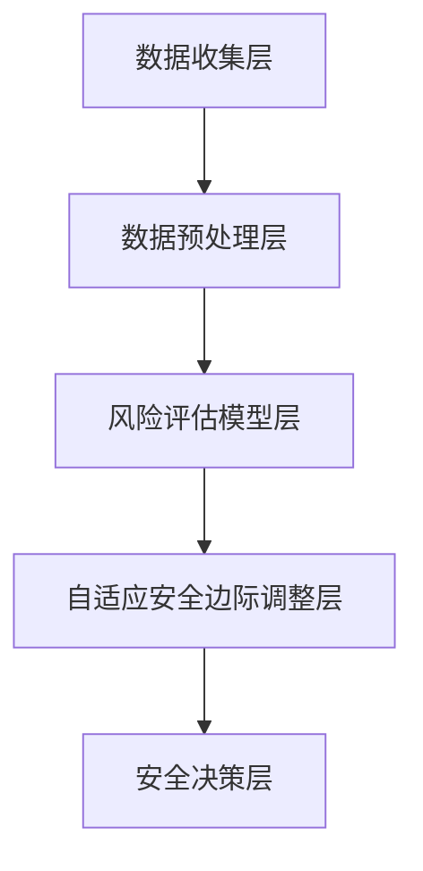

# AI实现的自适应安全边际计算模型

> 关键词：人工智能、自适应安全边际、计算模型、安全评估、风险控制

> 摘要：本文深入探讨了AI实现的自适应安全边际计算模型。首先介绍了该模型的背景，包括目的、预期读者等内容。接着阐述了核心概念与联系，通过文本示意图和Mermaid流程图进行清晰展示。详细讲解了核心算法原理，并给出Python源代码示例。对数学模型和公式进行了推导和举例说明。通过项目实战，展示了代码的实际案例和详细解释。分析了该模型的实际应用场景，推荐了相关的学习资源、开发工具框架以及论文著作。最后总结了未来发展趋势与挑战，提供了常见问题与解答和扩展阅读参考资料。旨在为相关领域的研究和实践提供全面而深入的指导。

## 1. 背景介绍 
### 1.1 目的和范围
在当今数字化时代，安全问题日益突出，无论是网络安全、金融安全还是工业安全等领域，都需要准确评估和控制风险。传统的安全评估方法往往采用固定的安全边际，无法根据实际情况进行动态调整，容易导致过度保护或保护不足的问题。AI实现的自适应安全边际计算模型的目的就是利用人工智能技术，根据实时数据和环境变化，自动调整安全边际，从而更准确地评估和管理风险。

本模型的范围涵盖了多个领域，包括但不限于网络安全、金融风险评估、工业自动化中的安全控制等。通过收集和分析相关数据，模型可以为不同场景提供个性化的安全边际计算方案。

### 1.2 预期读者
本文的预期读者包括从事安全领域研究和实践的专业人员，如网络安全工程师、金融风险管理师、工业自动化工程师等。同时，也适合对人工智能和安全评估感兴趣的科研人员、学生以及相关企业的技术管理人员阅读。

### 1.3 文档结构概述
本文将按照以下结构进行组织：
- 核心概念与联系：介绍自适应安全边际计算模型的核心概念，包括安全边际、自适应机制等，并通过文本示意图和Mermaid流程图展示其架构。
- 核心算法原理 & 具体操作步骤：详细讲解实现自适应安全边际计算的核心算法，并用Python源代码进行阐述。
- 数学模型和公式 & 详细讲解 & 举例说明：给出模型的数学表达式，对公式进行详细推导和解释，并通过具体例子说明其应用。
- 项目实战：代码实际案例和详细解释说明：通过一个实际项目，展示如何使用该模型进行安全边际计算，包括开发环境搭建、源代码实现和代码解读。
- 实际应用场景：分析该模型在不同领域的实际应用情况。
- 工具和资源推荐：推荐相关的学习资源、开发工具框架和论文著作。
- 总结：未来发展趋势与挑战：总结该模型的发展趋势和面临的挑战。
- 附录：常见问题与解答：提供常见问题的解答。
- 扩展阅读 & 参考资料：列出相关的扩展阅读材料和参考资料。

### 1.4 术语表
#### 1.4.1 核心术语定义
- **安全边际**：指在安全评估中，为了确保系统或资产的安全性，在正常运行状态的基础上额外预留的安全余量。它可以是一个数值、一个范围或一个概率。
- **自适应机制**：模型能够根据实时数据和环境变化，自动调整安全边际的计算方法和参数，以适应不同的情况。
- **风险评估**：对系统或资产面临的风险进行识别、分析和评估的过程，通常包括风险的可能性和影响程度。

#### 1.4.2 相关概念解释
- **人工智能**：研究如何使计算机系统能够模拟人类智能的技术，包括机器学习、深度学习、自然语言处理等。
- **机器学习**：人工智能的一个分支，通过让计算机从数据中学习模式和规律，从而实现预测和决策的能力。
- **深度学习**：一种基于神经网络的机器学习方法，具有强大的特征提取和模式识别能力。

#### 1.4.3 缩略词列表
- **AI**：Artificial Intelligence，人工智能
- **ML**：Machine Learning，机器学习
- **DL**：Deep Learning，深度学习

## 2. 核心概念与联系 

### 核心概念原理
自适应安全边际计算模型的核心思想是利用人工智能技术，对实时数据进行分析和处理，根据风险评估结果动态调整安全边际。具体来说，模型首先收集与安全相关的数据，如网络流量、金融交易数据、工业设备运行状态等。然后，使用机器学习或深度学习算法对数据进行建模，预测潜在的风险。根据预测结果，模型自动调整安全边际，以确保系统或资产在不同风险水平下都能保持安全。

### 架构的文本示意图
```plaintext
+----------------------+
|      数据收集层      |
| 收集各类安全相关数据 |
+----------------------+
          |
          v
+----------------------+
|      数据预处理层    |
| 清洗、归一化、特征提取 |
+----------------------+
          |
          v
+----------------------+
|      风险评估模型层  |
| 使用AI算法预测风险   |
+----------------------+
          |
          v
+----------------------+
|  自适应安全边际调整层 |
| 根据风险调整安全边际 |
+----------------------+
          |
          v
+----------------------+
|      安全决策层      |
| 根据安全边际做决策   |
+----------------------+
```

### Mermaid流程图


## 3. 核心算法原理 & 具体操作步骤 

### 核心算法原理
本模型主要使用机器学习中的监督学习算法，如逻辑回归、支持向量机、神经网络等，对风险进行预测。以逻辑回归为例，逻辑回归是一种用于二分类问题的算法，它通过对输入特征进行线性组合，然后使用逻辑函数将其转换为概率值。

假设我们有一个包含 $n$ 个样本的数据集 $\{(x_1, y_1), (x_2, y_2), \cdots, (x_n, y_n)\}$，其中 $x_i$ 是第 $i$ 个样本的特征向量，$y_i$ 是对应的标签（$y_i \in \{0, 1\}$）。逻辑回归的模型可以表示为：

$$P(y = 1|x) = \frac{1}{1 + e^{-(w^T x + b)}}$$

其中 $w$ 是权重向量，$b$ 是偏置项。通过最小化损失函数，如对数损失函数：

$$L(w, b) = -\frac{1}{n} \sum_{i=1}^{n} [y_i \log(P(y = 1|x_i)) + (1 - y_i) \log(1 - P(y = 1|x_i))]$$

可以得到最优的权重和偏置。

### 具体操作步骤
1. **数据收集**：收集与安全相关的数据，如网络流量、金融交易数据等。
2. **数据预处理**：对收集到的数据进行清洗、归一化和特征提取。清洗数据是为了去除噪声和异常值；归一化是为了将不同特征的取值范围统一；特征提取是为了从原始数据中提取出有意义的特征。
3. **模型训练**：使用预处理后的数据对逻辑回归模型进行训练，得到最优的权重和偏置。
4. **风险预测**：使用训练好的模型对新的数据进行风险预测，得到风险概率。
5. **安全边际调整**：根据风险概率，动态调整安全边际。例如，如果风险概率较高，则增加安全边际；如果风险概率较低，则减少安全边际。

### Python源代码示例
```python
import numpy as np
from sklearn.linear_model import LogisticRegression
from sklearn.preprocessing import StandardScaler
from sklearn.model_selection import train_test_split

# 生成示例数据
np.random.seed(42)
X = np.random.randn(100, 5)
y = np.random.randint(0, 2, 100)

# 数据预处理
scaler = StandardScaler()
X_scaled = scaler.fit_transform(X)

# 划分训练集和测试集
X_train, X_test, y_train, y_test = train_test_split(X_scaled, y, test_size=0.2, random_state=42)

# 模型训练
model = LogisticRegression()
model.fit(X_train, y_train)

# 风险预测
y_pred_proba = model.predict_proba(X_test)[:, 1]

# 安全边际调整示例
def adjust_safety_margin(risk_prob):
    if risk_prob > 0.8:
        return 0.3
    elif risk_prob > 0.5:
        return 0.2
    else:
        return 0.1

safety_margins = [adjust_safety_margin(prob) for prob in y_pred_proba]
print("安全边际:", safety_margins)
```

## 4. 数学模型和公式 & 详细讲解 & 举例说明 

### 数学模型和公式
在自适应安全边际计算模型中，我们可以用以下公式来表示安全边际的调整：

$$SM = f(RP)$$

其中 $SM$ 表示安全边际，$RP$ 表示风险概率，$f$ 是一个映射函数，它根据风险概率的大小来调整安全边际。

例如，我们可以定义一个分段函数：

$$
f(RP) = 
\begin{cases}
0.3, & RP > 0.8 \\
0.2, & 0.5 < RP \leq 0.8 \\
0.1, & RP \leq 0.5
\end{cases}
$$

### 详细讲解
这个公式的含义是，当风险概率大于 0.8 时，安全边际设置为 0.3；当风险概率在 0.5 到 0.8 之间时，安全边际设置为 0.2；当风险概率小于等于 0.5 时，安全边际设置为 0.1。这样可以根据不同的风险水平，动态调整安全边际，以达到更好的安全效果。

### 举例说明
假设我们通过逻辑回归模型预测得到一个样本的风险概率为 0.85。根据上述分段函数，安全边际应该设置为 0.3。这意味着在这个样本的评估中，我们需要在正常安全标准的基础上，额外增加 0.3 的安全余量，以应对可能的风险。

## 5. 项目实战：代码实际案例和详细解释说明 

### 5.1  开发环境搭建
- **操作系统**：推荐使用 Linux 或 macOS 系统，也可以使用 Windows 系统。
- **Python 版本**：建议使用 Python 3.7 及以上版本。
- **开发工具**：可以使用 PyCharm、Jupyter Notebook 等开发工具。
- **依赖库安装**：使用以下命令安装所需的依赖库：
```bash
pip install numpy pandas scikit-learn matplotlib
```

### 5.2  源代码详细实现和代码解读
以下是一个完整的项目实战代码示例，用于实现自适应安全边际计算模型：

```python
import numpy as np
import pandas as pd
from sklearn.linear_model import LogisticRegression
from sklearn.preprocessing import StandardScaler
from sklearn.model_selection import train_test_split
import matplotlib.pyplot as plt

# 1. 数据收集
# 假设我们有一个包含特征和标签的 CSV 文件
data = pd.read_csv('data.csv')
X = data.drop('label', axis=1).values
y = data['label'].values

# 2. 数据预处理
scaler = StandardScaler()
X_scaled = scaler.fit_transform(X)

# 3. 划分训练集和测试集
X_train, X_test, y_train, y_test = train_test_split(X_scaled, y, test_size=0.2, random_state=42)

# 4. 模型训练
model = LogisticRegression()
model.fit(X_train, y_train)

# 5. 风险预测
y_pred_proba = model.predict_proba(X_test)[:, 1]

# 6. 安全边际调整
def adjust_safety_margin(risk_prob):
    if risk_prob > 0.8:
        return 0.3
    elif risk_prob > 0.5:
        return 0.2
    else:
        return 0.1

safety_margins = [adjust_safety_margin(prob) for prob in y_pred_proba]

# 7. 可视化结果
plt.scatter(y_pred_proba, safety_margins)
plt.xlabel('风险概率')
plt.ylabel('安全边际')
plt.title('自适应安全边际调整')
plt.show()
```

### 代码解读与分析
- **数据收集**：使用 `pandas` 库读取 CSV 文件，将特征和标签分别存储在 `X` 和 `y` 中。
- **数据预处理**：使用 `StandardScaler` 对特征进行归一化处理，确保不同特征的取值范围一致。
- **划分训练集和测试集**：使用 `train_test_split` 函数将数据集划分为训练集和测试集，比例为 8:2。
- **模型训练**：使用逻辑回归模型对训练集进行训练。
- **风险预测**：使用训练好的模型对测试集进行风险预测，得到风险概率。
- **安全边际调整**：定义一个函数 `adjust_safety_margin`，根据风险概率动态调整安全边际。
- **可视化结果**：使用 `matplotlib` 库绘制风险概率和安全边际的散点图，直观展示自适应调整的效果。

## 6. 实际应用场景 
### 网络安全领域
在网络安全中，自适应安全边际计算模型可以用于实时监测网络流量，预测潜在的网络攻击风险。通过动态调整安全边际，网络安全系统可以在不同的风险水平下采取相应的防护措施，如限制访问、加强加密等。例如，当检测到来自某个 IP 地址的流量异常时，模型可以提高该 IP 地址的风险概率，并相应地增加安全边际，从而更有效地防止网络攻击。

### 金融风险评估领域
在金融领域，该模型可以用于评估投资风险、信用风险等。通过分析金融市场数据、客户信用记录等信息，模型可以预测投资组合或客户的违约风险。根据风险概率，金融机构可以动态调整风险控制措施，如调整贷款利率、限制信贷额度等。例如，对于风险较高的客户，银行可以提高贷款利率，并减少信贷额度，以降低潜在的损失。

### 工业自动化领域
在工业自动化中，自适应安全边际计算模型可以用于监测工业设备的运行状态，预测设备故障的风险。通过收集设备的传感器数据，如温度、压力、振动等，模型可以分析设备的健康状况，并根据风险概率调整安全边际。例如，当设备的某个参数超出正常范围时，模型可以提高该设备的风险概率，并增加安全边际，如缩短维护周期、加强监控等，以确保设备的安全运行。

## 7. 工具和资源推荐
### 7.1 学习资源推荐
#### 7.1.1 书籍推荐
- 《机器学习》（周志华著）：一本全面介绍机器学习理论和算法的经典教材，涵盖了监督学习、无监督学习、强化学习等多个方面。
- 《深度学习》（Ian Goodfellow、Yoshua Bengio 和 Aaron Courville 著）：深度学习领域的权威著作，详细介绍了深度学习的基本原理、模型结构和应用。
- 《Python 数据分析实战》（韦斯·麦金尼著）：介绍了使用 Python 进行数据分析的方法和技巧，包括数据处理、可视化、机器学习等方面。

#### 7.1.2 在线课程
- Coursera 上的“机器学习”课程（Andrew Ng 教授主讲）：一门非常经典的机器学习课程，适合初学者入门。
- edX 上的“深度学习”课程（由多家知名高校联合推出）：深入介绍了深度学习的理论和实践。
- Kaggle 上的教程和竞赛：Kaggle 是一个数据科学竞赛平台，上面有很多优秀的教程和数据集，可以帮助学习者提高实践能力。

#### 7.1.3 技术博客和网站
- Medium：一个技术博客平台，上面有很多关于人工智能、机器学习的优秀文章。
- Towards Data Science：专注于数据科学和机器学习领域的博客，提供了很多实用的技术教程和案例分析。
- arXiv：一个预印本服务器，上面有很多最新的学术研究论文，可以了解该领域的前沿动态。

### 7.2 开发工具框架推荐
#### 7.2.1 IDE和编辑器
- PyCharm：一款专业的 Python 集成开发环境，提供了丰富的代码编辑、调试、测试等功能。
- Jupyter Notebook：一个交互式的笔记本环境，适合进行数据分析和模型开发，支持多种编程语言。
- Visual Studio Code：一款轻量级的代码编辑器，支持多种编程语言和插件扩展。

#### 7.2.2 调试和性能分析工具
- PySnooper：一个简单易用的 Python 调试工具，可以自动记录函数的执行过程和变量的值。
- cProfile：Python 内置的性能分析工具，可以分析代码的运行时间和函数调用次数。
- TensorBoard：TensorFlow 提供的可视化工具，可以用于可视化模型的训练过程和性能指标。

#### 7.2.3 相关框架和库
- Scikit-learn：一个简单易用的机器学习库，提供了丰富的机器学习算法和工具，如分类、回归、聚类等。
- TensorFlow：一个开源的深度学习框架，广泛应用于图像识别、自然语言处理等领域。
- PyTorch：另一个流行的深度学习框架，具有动态图的特点，适合快速开发和实验。

### 7.3 相关论文著作推荐
#### 7.3.1 经典论文
- “A Logical Calculus of the Ideas Immanent in Nervous Activity”（Warren S. McCulloch 和 Walter Pitts 著）：这篇论文提出了人工神经网络的基本模型，是神经网络领域的奠基之作。
- “Learning Representations by Back-propagating Errors”（David E. Rumelhart、Geoffrey E. Hinton 和 Ronald J. Williams 著）：介绍了反向传播算法，是深度学习发展的重要里程碑。
- “Support-Vector Networks”（Corinna Cortes 和 Vladimir Vapnik 著）：提出了支持向量机算法，是机器学习领域的经典算法之一。

#### 7.3.2 最新研究成果
- 在 arXiv 上搜索“Adaptive Safety Margin Computation Model”等关键词，可以找到很多最新的研究论文，了解该领域的最新发展动态。

#### 7.3.3 应用案例分析
- 在 IEEE Xplore、ACM Digital Library 等学术数据库中搜索相关的应用案例分析论文，了解自适应安全边际计算模型在不同领域的实际应用情况。

## 8. 总结：未来发展趋势与挑战
### 未来发展趋势
- **多模态数据融合**：未来的自适应安全边际计算模型将不仅仅依赖于单一类型的数据，而是会融合多种模态的数据，如文本、图像、音频等，以更全面地评估风险。
- **与物联网的结合**：随着物联网的发展，大量的设备将产生实时数据。自适应安全边际计算模型可以与物联网技术相结合，实现对物联网设备的实时安全监测和风险控制。
- **强化学习的应用**：强化学习可以通过与环境的交互，不断优化安全边际的调整策略。未来，强化学习将在自适应安全边际计算模型中得到更广泛的应用。

### 挑战
- **数据隐私和安全**：在收集和处理大量数据的过程中，数据隐私和安全是一个重要的挑战。需要采用有效的数据加密和访问控制技术，确保数据的安全性。
- **模型的可解释性**：人工智能模型往往是黑盒模型，难以解释其决策过程。在安全评估领域，模型的可解释性非常重要，需要研究如何提高模型的可解释性。
- **计算资源的需求**：随着模型的复杂度不断增加，对计算资源的需求也越来越大。需要开发高效的算法和硬件架构，以满足模型训练和推理的需求。

## 9. 附录：常见问题与解答
### 问题 1：如何选择合适的机器学习算法？
解答：选择合适的机器学习算法需要考虑多个因素，如数据的特点、问题的类型、模型的复杂度等。对于简单的分类问题，可以选择逻辑回归、支持向量机等算法；对于复杂的图像识别、自然语言处理等问题，可以选择深度学习算法，如卷积神经网络、循环神经网络等。

### 问题 2：如何处理数据中的缺失值？
解答：处理数据中的缺失值有多种方法，如删除包含缺失值的样本、使用均值、中位数或众数填充缺失值、使用插值方法填充缺失值等。具体选择哪种方法需要根据数据的特点和问题的需求来决定。

### 问题 3：如何评估模型的性能？
解答：评估模型的性能可以使用多种指标，如准确率、召回率、F1 值、均方误差等。对于分类问题，常用的指标是准确率、召回率和 F1 值；对于回归问题，常用的指标是均方误差。可以使用交叉验证等方法来评估模型的泛化能力。

## 10. 扩展阅读 & 参考资料
### 扩展阅读
- 《人工智能：现代方法》（Stuart Russell 和 Peter Norvig 著）：一本全面介绍人工智能领域的经典教材，涵盖了搜索算法、知识表示、机器学习、自然语言处理等多个方面。
- 《大数据时代》（维克托·迈尔 - 舍恩伯格和肯尼斯·库克耶著）：介绍了大数据的概念、特点和应用，探讨了大数据对社会和经济的影响。
- 《失控：全人类的最终命运和结局》（凯文·凯利著）：一本富有前瞻性的书籍，探讨了人工智能、生物进化、网络技术等领域的发展趋势。

### 参考资料
- 《机器学习实战》（Peter Harrington 著）：通过实际案例介绍了机器学习算法的应用，适合初学者入门。
- 《深度学习实战》（Seth Weidman 等著）：介绍了深度学习的实践方法和技巧，包括模型构建、训练和优化等方面。
- 相关学术论文和研究报告，可以在学术数据库如 IEEE Xplore、ACM Digital Library 等中查找。

作者：AI天才研究院/AI Genius Institute & 禅与计算机程序设计艺术 /Zen And The Art of Computer Programming