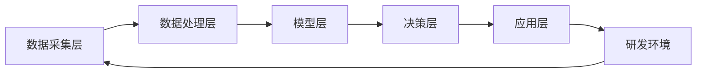

# AI智能体在评估公司研发效率中的作用

> 关键词：AI智能体、公司研发效率、评估、数据驱动、自动化

> 摘要：本文旨在深入探讨AI智能体在评估公司研发效率中的重要作用。首先介绍了相关背景知识，包括目的、预期读者等内容。接着阐述了AI智能体及公司研发效率的核心概念与联系，分析了其核心算法原理和具体操作步骤，并给出了相应的数学模型和公式。通过项目实战展示了如何利用AI智能体进行研发效率评估的代码实现及解读。探讨了AI智能体在评估公司研发效率中的实际应用场景，推荐了相关的工具和资源。最后总结了未来发展趋势与挑战，解答了常见问题并提供了扩展阅读和参考资料，为全面理解和应用AI智能体评估公司研发效率提供了深入且系统的知识。

## 1. 背景介绍 
### 1.1 目的和范围
在当今竞争激烈的商业环境中，公司的研发效率直接关系到其市场竞争力和可持续发展能力。准确评估研发效率对于公司优化资源配置、提升创新能力至关重要。本文的目的在于详细阐述AI智能体在评估公司研发效率方面的作用，探讨其如何通过数据分析、自动化处理等手段，为公司提供全面、准确、及时的研发效率评估结果。

本文的范围涵盖了AI智能体的基本概念、相关算法原理，以及在不同类型公司研发效率评估中的应用。同时，会结合实际案例和代码实现，展示AI智能体在评估过程中的具体操作和优势。

### 1.2 预期读者
本文预期读者包括公司的研发管理人员、技术专家、数据分析师、对AI技术和研发管理感兴趣的学者以及相关领域的从业人员。通过阅读本文，读者可以深入了解AI智能体在评估公司研发效率中的应用原理和实践方法，为其在实际工作中应用相关技术提供参考。

### 1.3 文档结构概述
本文首先介绍背景知识，包括目的、预期读者和文档结构等内容。然后阐述AI智能体及公司研发效率的核心概念与联系，分析其核心算法原理和具体操作步骤，并给出相应的数学模型和公式。通过项目实战展示如何利用AI智能体进行研发效率评估的代码实现及解读。接着探讨AI智能体在评估公司研发效率中的实际应用场景，推荐相关的工具和资源。最后总结未来发展趋势与挑战，解答常见问题并提供扩展阅读和参考资料。

### 1.4 术语表
#### 1.4.1 核心术语定义
- **AI智能体（AI Agent）**：是一种能够感知环境、根据内部机制进行决策，并采取行动以实现特定目标的人工智能实体。它可以自主地与环境进行交互，通过学习和推理来优化自身的行为。
- **公司研发效率**：指公司在研发过程中投入的资源（如人力、物力、财力等）与产出（如新产品、新技术、新专利等）之间的比例关系。研发效率反映了公司在研发活动中利用资源的有效性和创新性。

#### 1.4.2 相关概念解释
- **机器学习（Machine Learning）**：是AI智能体实现智能决策的重要技术手段之一。它通过让计算机从数据中自动学习模式和规律，从而对未知数据进行预测和分类。
- **数据挖掘（Data Mining）**：是从大量数据中发现有价值信息和知识的过程。在评估公司研发效率中，数据挖掘可以帮助AI智能体从海量的研发数据中提取关键信息。

#### 1.4.3 缩略词列表
- **AI**：Artificial Intelligence，人工智能
- **ML**：Machine Learning，机器学习
- **DM**：Data Mining，数据挖掘

## 2. 核心概念与联系 
### 核心概念原理
#### AI智能体原理
AI智能体基于感知、决策和行动的循环机制运行。感知模块负责收集环境信息，如研发项目的进度、资源使用情况等。决策模块根据感知到的信息和预设的目标，运用机器学习、深度学习等算法进行推理和分析，制定出最优的行动策略。行动模块则根据决策结果，采取相应的行动，如调整研发计划、分配资源等。

#### 公司研发效率原理
公司研发效率的评估需要综合考虑多个因素，包括研发投入、研发产出、研发周期等。研发投入包括人力成本、设备采购、研发资金等；研发产出包括新产品的推出、新技术的应用、专利的获得等；研发周期则反映了从研发项目启动到完成的时间长度。通过对这些因素的量化分析，可以计算出公司的研发效率指标。

### 架构的文本示意图
AI智能体在评估公司研发效率中的架构可以描述为：数据采集层负责收集研发过程中的各种数据，如项目进度数据、人员工时数据、财务数据等；数据处理层对采集到的数据进行清洗、转换和存储，为后续的分析提供高质量的数据；模型层运用机器学习、深度学习等算法对处理后的数据进行分析，构建研发效率评估模型；决策层根据评估模型的结果，生成决策建议，如资源分配调整、项目优先级排序等；应用层将决策建议应用到实际的研发管理中，实现对研发效率的优化。

### Mermaid流程图


## 3. 核心算法原理 & 具体操作步骤 
### 核心算法原理
在评估公司研发效率中，常用的算法包括线性回归、决策树、神经网络等。下面以线性回归算法为例进行详细阐述。

线性回归是一种用于建立自变量和因变量之间线性关系的统计模型。在研发效率评估中，我们可以将研发投入（如人力、物力、财力等）作为自变量，研发产出（如新产品数量、专利数量等）作为因变量，通过线性回归模型来预测研发效率。

### Python源代码详细阐述
```python
import numpy as np
from sklearn.linear_model import LinearRegression

# 示例数据：研发投入（人力、物力、财力）和研发产出
# 假设我们有10个研发项目的数据
# 研发投入数据，每行表示一个项目的人力、物力、财力投入
X = np.array([[10, 20, 30],
              [12, 22, 32],
              [15, 25, 35],
              [18, 28, 38],
              [20, 30, 40],
              [22, 32, 42],
              [25, 35, 45],
              [28, 38, 48],
              [30, 40, 50],
              [32, 42, 52]])

# 研发产出数据，每个值表示一个项目的产出
y = np.array([50, 55, 60, 65, 70, 75, 80, 85, 90, 95])

# 创建线性回归模型
model = LinearRegression()

# 拟合模型
model.fit(X, y)

# 预测新的研发项目的产出
new_X = np.array([[35, 45, 55]])
predicted_y = model.predict(new_X)

print("预测的研发产出为:", predicted_y)
```
### 具体操作步骤
1. **数据收集**：收集公司研发过程中的各种数据，包括研发投入和研发产出数据。
2. **数据预处理**：对收集到的数据进行清洗、转换和归一化处理，以提高模型的准确性。
3. **模型选择**：根据数据的特点和评估需求，选择合适的算法模型，如线性回归、决策树等。
4. **模型训练**：使用训练数据对模型进行训练，调整模型的参数，使其能够准确地预测研发效率。
5. **模型评估**：使用测试数据对训练好的模型进行评估，计算模型的准确率、召回率等指标，评估模型的性能。
6. **模型应用**：将训练好的模型应用到实际的研发效率评估中，根据模型的预测结果制定决策。

## 4. 数学模型和公式 & 详细讲解 & 举例说明 
### 数学模型
线性回归模型的数学表达式为：
$$y = \beta_0 + \beta_1x_1 + \beta_2x_2 + \cdots + \beta_nx_n + \epsilon$$
其中，$y$ 是因变量（研发产出），$x_1, x_2, \cdots, x_n$ 是自变量（研发投入），$\beta_0, \beta_1, \beta_2, \cdots, \beta_n$ 是模型的参数，$\epsilon$ 是误差项。

### 详细讲解
线性回归模型的目标是找到一组最优的参数 $\beta_0, \beta_1, \beta_2, \cdots, \beta_n$，使得模型的预测值与实际值之间的误差最小。常用的误差度量方法是均方误差（Mean Squared Error，MSE），其计算公式为：
$$MSE = \frac{1}{m} \sum_{i=1}^{m} (y_i - \hat{y}_i)^2$$
其中，$m$ 是样本数量，$y_i$ 是实际值，$\hat{y}_i$ 是预测值。

通过最小化均方误差，可以得到最优的参数估计值。在实际应用中，可以使用最小二乘法来求解参数。

### 举例说明
假设我们有以下研发投入和研发产出数据：
| 人力投入 ($x_1$) | 物力投入 ($x_2$) | 财力投入 ($x_3$) | 研发产出 ($y$) |
|---|---|---|---|
| 10 | 20 | 30 | 50 |
| 12 | 22 | 32 | 55 |
| 15 | 25 | 35 | 60 |

将这些数据代入线性回归模型中，我们可以得到：
$$50 = \beta_0 + 10\beta_1 + 20\beta_2 + 30\beta_3 + \epsilon_1$$
$$55 = \beta_0 + 12\beta_1 + 22\beta_2 + 32\beta_3 + \epsilon_2$$
$$60 = \beta_0 + 15\beta_1 + 25\beta_2 + 35\beta_3 + \epsilon_3$$

通过最小二乘法求解上述方程组，可以得到最优的参数 $\beta_0, \beta_1, \beta_2, \beta_3$，从而得到线性回归模型。

## 5. 项目实战：代码实际案例和详细解释说明 
### 5.1  开发环境搭建
- **操作系统**：Windows 10 或 Ubuntu 18.04 及以上版本。
- **Python 版本**：Python 3.7 及以上版本。
- **开发工具**：PyCharm 或 Jupyter Notebook。
- **相关库**：numpy、pandas、scikit-learn、matplotlib 等。

可以使用以下命令安装相关库：
```bash
pip install numpy pandas scikit-learn matplotlib
```

### 5.2  源代码详细实现和代码解读
```python
import numpy as np
import pandas as pd
from sklearn.model_selection import train_test_split
from sklearn.linear_model import LinearRegression
from sklearn.metrics import mean_squared_error
import matplotlib.pyplot as plt

# 读取数据
data = pd.read_csv('research_data.csv')

# 提取特征和目标变量
X = data[['human_input', 'material_input', 'financial_input']].values
y = data['output'].values

# 划分训练集和测试集
X_train, X_test, y_train, y_test = train_test_split(X, y, test_size=0.2, random_state=42)

# 创建线性回归模型
model = LinearRegression()

# 拟合模型
model.fit(X_train, y_train)

# 预测测试集
y_pred = model.predict(X_test)

# 计算均方误差
mse = mean_squared_error(y_test, y_pred)
print("均方误差:", mse)

# 可视化预测结果
plt.scatter(y_test, y_pred)
plt.xlabel('实际值')
plt.ylabel('预测值')
plt.title('实际值 vs 预测值')
plt.show()
```
### 代码解读与分析
1. **数据读取**：使用 `pandas` 库的 `read_csv` 函数读取存储研发数据的 CSV 文件。
2. **特征提取**：从数据中提取研发投入（人力、物力、财力）作为特征变量 `X`，提取研发产出作为目标变量 `y`。
3. **数据集划分**：使用 `sklearn` 库的 `train_test_split` 函数将数据集划分为训练集和测试集，其中测试集占比为 20%。
4. **模型创建与训练**：创建线性回归模型，并使用训练集对模型进行训练。
5. **模型预测**：使用训练好的模型对测试集进行预测，得到预测值 `y_pred`。
6. **模型评估**：使用 `sklearn` 库的 `mean_squared_error` 函数计算预测值与实际值之间的均方误差，评估模型的性能。
7. **可视化**：使用 `matplotlib` 库绘制散点图，直观地展示实际值与预测值之间的关系。

## 6. 实际应用场景 
### 资源分配优化
AI智能体可以通过评估公司研发效率，分析各个研发项目的投入产出比，为公司提供资源分配的决策建议。例如，对于研发效率高的项目，可以增加资源投入，以加速项目的进展；对于研发效率低的项目，可以减少资源投入或调整项目方向。

### 项目优先级排序
根据AI智能体评估的研发效率结果，公司可以对研发项目进行优先级排序。将资源优先分配给研发效率高、对公司发展具有重要战略意义的项目，提高公司的整体研发效率和竞争力。

### 研发过程监控
AI智能体可以实时监控研发过程中的各项指标，如项目进度、资源使用情况等。当发现研发效率出现异常时，及时发出预警，帮助公司及时调整研发策略，确保研发项目的顺利进行。

### 人才评估与培养
通过分析研发人员的工作效率和创新能力，AI智能体可以为公司提供人才评估和培养的建议。对于表现优秀的研发人员，可以给予更多的晋升机会和培训资源；对于需要提升的研发人员，可以制定个性化的培训计划，提高其研发能力。

## 7. 工具和资源推荐
### 7.1 学习资源推荐
#### 7.1.1 书籍推荐
- 《机器学习》（周志华著）：全面介绍了机器学习的基本概念、算法和应用，是学习机器学习的经典教材。
- 《Python 机器学习实战》（Sebastian Raschka 著）：通过实际案例详细介绍了如何使用 Python 进行机器学习实践，适合初学者。
- 《深度学习》（Ian Goodfellow 等著）：深入讲解了深度学习的原理和应用，是深度学习领域的权威著作。

#### 7.1.2 在线课程
- Coursera 上的“机器学习”课程（Andrew Ng 教授授课）：该课程是机器学习领域的经典在线课程，内容全面，讲解深入浅出。
- edX 上的“深度学习”课程：由全球知名高校的教授授课，系统地介绍了深度学习的理论和实践。
- 中国大学 MOOC 上的“人工智能基础”课程：适合初学者了解人工智能的基本概念和技术。

#### 7.1.3 技术博客和网站
- Medium：上面有很多关于人工智能、机器学习的技术博客和文章，涵盖了最新的研究成果和实践经验。
- Kaggle：是一个数据科学竞赛平台，上面有很多优秀的数据科学项目和代码示例，可以学习到实际应用中的技巧和方法。
- 机器之心：专注于人工智能领域的资讯和技术报道，提供了丰富的行业动态和技术文章。

### 7.2 开发工具框架推荐
#### 7.2.1 IDE和编辑器
- PyCharm：是一款专门为 Python 开发设计的集成开发环境，具有代码自动补全、调试等功能，提高开发效率。
- Jupyter Notebook：是一个交互式的开发环境，适合进行数据分析和机器学习实验，方便代码的编写、运行和展示。
- Visual Studio Code：是一款轻量级的代码编辑器，支持多种编程语言，具有丰富的插件生态系统。

#### 7.2.2 调试和性能分析工具
- PDB：Python 自带的调试工具，可以帮助开发者调试代码，查找问题。
- cProfile：Python 标准库中的性能分析工具，可以分析代码的运行时间和函数调用情况。
- TensorBoard：是 TensorFlow 提供的可视化工具，可以帮助开发者可视化训练过程和模型结构。

#### 7.2.3 相关框架和库
- Scikit-learn：是一个简单易用的机器学习库，提供了各种机器学习算法和工具，适合初学者和快速原型开发。
- TensorFlow：是一个开源的深度学习框架，广泛应用于图像识别、自然语言处理等领域。
- PyTorch：是另一个流行的深度学习框架，具有动态图的特点，适合研究和开发。

### 7.3 相关论文著作推荐
#### 7.3.1 经典论文
- “A Logical Calculus of the Ideas Immanent in Nervous Activity”（Warren S. McCulloch 和 Walter Pitts 著）：提出了人工神经元模型，为神经网络的发展奠定了基础。
- “Learning Representations by Back-propagating Errors”（David E. Rumelhart 等著）：介绍了反向传播算法，推动了神经网络的发展。
- “ImageNet Classification with Deep Convolutional Neural Networks”（Alex Krizhevsky 等著）：提出了 AlexNet 模型，开启了深度学习在计算机视觉领域的热潮。

#### 7.3.2 最新研究成果
- 关注顶级学术会议如 NeurIPS、ICML、CVPR 等的最新论文，了解人工智能领域的最新研究动态和技术进展。
- 关注知名学术期刊如 Journal of Artificial Intelligence Research、Artificial Intelligence 等的最新研究成果。

#### 7.3.3 应用案例分析
- 阅读各大科技公司的技术博客和研究报告，了解他们在实际应用中如何使用 AI 智能体评估研发效率，以及取得的效果和经验教训。

## 8. 总结：未来发展趋势与挑战
### 未来发展趋势
- **智能化程度不断提高**：AI智能体将不断融合更多的人工智能技术，如自然语言处理、计算机视觉等，实现更加智能化的研发效率评估。例如，通过分析研发文档和会议记录，自动提取关键信息，为评估提供更全面的数据支持。
- **与业务深度融合**：AI智能体将不再仅仅是一个评估工具，而是与公司的业务流程深度融合。例如，在项目立项阶段就可以根据AI智能体的评估结果进行可行性分析，在项目执行过程中实时调整研发策略，提高研发效率和成功率。
- **跨领域应用拓展**：AI智能体在评估公司研发效率中的应用将拓展到更多领域，如医疗研发、航空航天研发等。不同领域的研发具有不同的特点和需求，AI智能体将需要不断适应和优化，以满足多样化的应用场景。

### 挑战
- **数据质量和隐私问题**：AI智能体的评估结果依赖于高质量的数据，但实际研发过程中数据可能存在不准确、不完整等问题。同时，研发数据往往包含公司的机密信息，如何在保证数据质量的前提下，保护数据的隐私和安全是一个重要的挑战。
- **算法解释性问题**：一些复杂的人工智能算法，如深度学习算法，具有很强的预测能力，但缺乏解释性。在评估公司研发效率时，需要能够解释算法的决策过程和结果，以便公司管理人员能够理解和信任评估结果。
- **人才短缺问题**：AI智能体的开发和应用需要具备人工智能、机器学习、研发管理等多方面知识的复合型人才。目前，这类人才相对短缺，限制了AI智能体在评估公司研发效率中的推广和应用。

## 9. 附录：常见问题与解答
### 问题1：AI智能体评估研发效率的准确性如何保证？
答：保证AI智能体评估研发效率的准确性需要从多个方面入手。首先，要确保数据的质量，包括数据的准确性、完整性和一致性。其次，选择合适的算法模型，并进行充分的模型训练和评估。此外，还需要不断对模型进行优化和调整，以适应研发过程中的变化。

### 问题2：AI智能体是否可以完全替代人工评估研发效率？
答：AI智能体不能完全替代人工评估研发效率。虽然AI智能体可以处理大量的数据，提供客观的评估结果，但研发过程中还涉及到很多主观因素，如创新能力、团队协作等，这些因素需要人工进行评估和判断。AI智能体可以作为人工评估的补充，提高评估的效率和准确性。

### 问题3：如何将AI智能体应用到公司的实际研发管理中？
答：将AI智能体应用到公司的实际研发管理中，需要进行以下几个步骤。首先，进行需求分析，明确公司的研发管理需求和目标。然后，收集和整理研发数据，为AI智能体提供数据支持。接着，选择合适的算法模型，开发和训练AI智能体。最后，将AI智能体集成到公司的研发管理系统中，实现对研发效率的实时评估和决策支持。

## 10. 扩展阅读 & 参考资料
### 扩展阅读
- 《智能时代》（吴军著）：介绍了人工智能在各个领域的应用和影响，帮助读者了解人工智能的发展趋势和前景。
- 《思考，快与慢》（丹尼尔·卡尼曼著）：探讨了人类思维的两种模式，对于理解AI智能体的决策机制和人类决策的差异有一定的帮助。

### 参考资料
- 相关的学术论文和研究报告，如 IEEE Transactions on Artificial Intelligence、ACM Transactions on Intelligent Systems and Technology 等期刊上的论文。
- 各大科技公司的技术博客和官方文档，如 Google AI Blog、Microsoft Research Blog 等。

作者：AI天才研究院/AI Genius Institute & 禅与计算机程序设计艺术 /Zen And The Art of Computer Programming